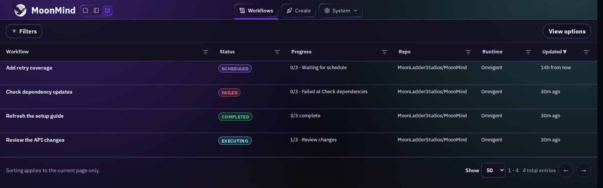
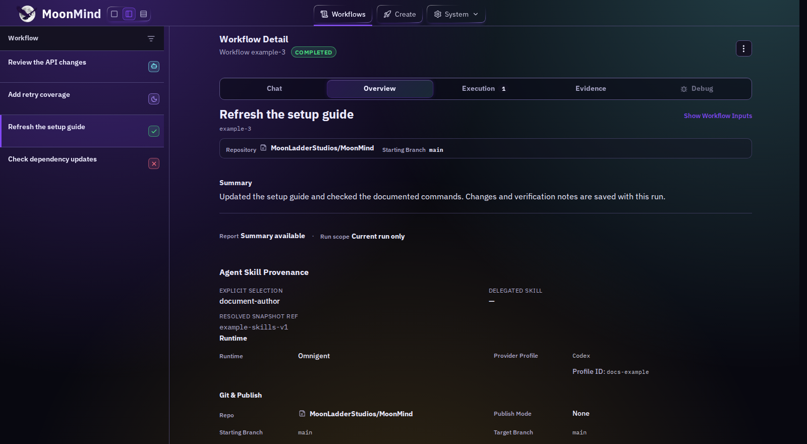

# 🌙 MoonMind

<p align="center">
  
</p>

MoonMind is a self-hosted app for running AI coding workflows. Give it a task, choose an agent, and follow the work from your browser. Each instance is built for one operator, with concurrent workflows and multiple provider accounts.

**Omnigent is MoonMind's primary agent backend.** It runs harnesses such as Codex, Claude Code, and OpenCode. MoonMind manages the workflows, credentials, workspaces, and results around them.

## What it does

- **Runs durable workflows.** Temporal tracks steps, retries, and schedules. Work can resume after a worker restart, with checkpoint recovery where supported.
- **Controls access.** Provider Profiles select credentials and model settings. Agents run inside container boundaries and submit build and test jobs without receiving the host Docker socket.
- **Keeps results inspectable.** The dashboard shows progress, logs, diagnostics, and artifacts. You can review a run, intervene when needed, or return to its saved results later.

MoonMind currently focuses on software engineering. Start with a repository task or a reusable Skill.

## Dashboard





These are captures of the current dashboard with synthetic example data. They show the interface, not live agent results. The [capture recipe](docs/UI/WorkflowConsoleArchitecture.md#20-readme-screenshot-recipe) explains how to refresh them.

## Quick start

Install [Docker with Compose V2](https://docs.docker.com/get-started/get-docker/) and Git, then run:

```bash
git clone https://github.com/MoonLadderStudios/MoonMind.git
cd MoonMind
git submodule update --init --checkout -- moonspec omnigent
docker compose up -d
```

Compose pulls published images. A fresh local install does not need an `.env` file or a local image build.

1. Open [localhost:7000](http://localhost:7000). Wait for the dashboard to load and `curl -fsS http://localhost:7000/healthz` to succeed.
2. In **Settings → Providers & Secrets**, connect a Provider Profile with an API key or a supported OAuth flow. For OAuth, complete the opened enrollment tab, then return and click **Finalize**.
3. For authenticated GitHub work, add a **Source Control** connection and assign the repositories it may access. Token and GitHub App connections are supported.
4. Click **Create**. Select **Omnigent** under Runtime and a compatible Profile. Enter your task and repository details, or choose a Skill or Preset. Review the publishing option before submitting.
5. Open the workflow to inspect its progress, outputs, artifacts, and logs.

Application login, model-provider credentials, and source-control access are separate settings. A healthy dashboard alone does not mean an agent is ready to run.

The default local install binds to `127.0.0.1` and uses restricted, disabled authentication. There is no login step on this path. Before allowing access from another machine, configure the appropriate authentication and ingress boundary. See [Authentication Contracts](docs/Security/AuthenticationContracts.md).

For optional settings, use [`.env-template`](.env-template). For startup checks and troubleshooting, see [Combined Stack Validation](docs/Omnigent/CombinedStackValidationAndRollback.md). Start with `docker compose ps` and `docker compose logs <service>`; do not delete volumes to fix a startup problem.

## How it fits together

- **MoonMind API and dashboard** accept work and expose controls and results.
- **Temporal and workers** coordinate durable workflows and run their steps.
- **Omnigent** manages agent hosts, harnesses, and sessions. Provider Profiles supply the selected connection and defaults.
- **PostgreSQL and MinIO** store application records and artifacts. No vector database is required.
- **Docker Compose** runs the local stack. The [service inventory](docs/FirstRunServiceInventory.md) lists its services, ports, and optional profiles.

Some older execution paths remain for compatibility. Available harness and profile combinations depend on what your deployment supports. See the [Omnigent docs](docs/Omnigent/README.md) and [runtime support policy](docs/Omnigent/RuntimeProviderRollout.md) for the details.

## Operating notes

- **Keep the host running.** Putting the machine that hosts MoonMind to sleep pauses execution. Temporal can resume when the infrastructure returns.
- **Check network boundaries.** Restricted egress needs an enforced, attested configuration. A plain Docker bridge is not network confinement. See [Restricted Egress](docs/Security/RestrictedEgress.md).
- **Secret scanning is opt-in.** `MOONMIND_HIGH_SECURITY_MODE` scans supported MoonMind-owned outbound text and push bundles. It is off by default and does not cover binary attachments, terminal input, or browser automation. See the [Secrets System](docs/Security/SecretsSystem.md).
- **Choose publication deliberately.** Saving results and publishing changes have different permissions. See [Workflow Publishing](docs/Workflows/WorkflowPublishing.md).

For upgrades, use the deployment updater:

```bash
bash tools/update-moonmind.sh --branch main
```

The host updater requires Python 3.10+ and Compose V2. See the [update guide](docs/Steps/DockerComposeUpdateSystem.md) for release selection, preserved settings, and recovery from interrupted updates.

## More information

- [Workflow Console](docs/UI/WorkflowConsoleArchitecture.md)
- [Skills](docs/Steps/SkillSystem.md)
- [Execution and recovery](docs/Temporal/ManagedAndExternalAgentExecutionModel.md)
- [Roadmap](docs/MoonMindRoadmap.md)

## Contributing

Contributions are welcome, including AI-assisted pull requests. Read [CONTRIBUTING.md](CONTRIBUTING.md) for setup and testing, and [AGENTS.md](AGENTS.md) when working with a coding agent.

## License

MoonMind is licensed under [Apache 2.0](LICENSE). See [NOTICE](NOTICE) for attribution.

The Omnigent submodule has its own Apache 2.0 license and notices in `omnigent/LICENSE` and `omnigent/NOTICE`. Other submodules retain their upstream licenses.
