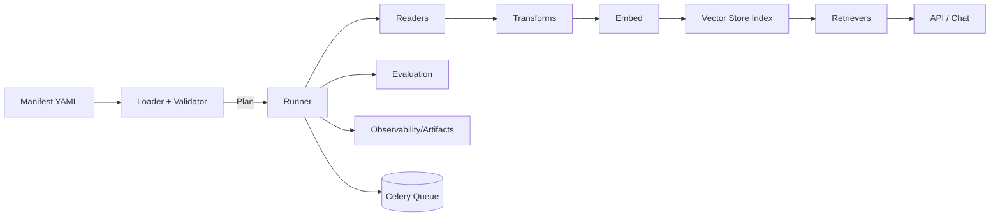

# Llama Index Manifest System – Spec & Operator Guide

> **Status:** Draft v0 (implementation-ready)
> **Last updated:** 2025‑11‑03
> **Owners:** Search Platform / RAG Team
> **Scope:** Declarative ingestion → transforms → indexing → retrieval → optional evaluation, for use with LlamaIndex in MoonMind.

---

## Table of Contents

1. [Why a Manifest System?](#why-a-manifest-system)
2. [Architecture Overview](#architecture-overview)
3. [Manifest Schema (v0)](#manifest-schema-v0)

   * [Top‑level Keys](#top-level-keys)
   * [JSON Schema (abridged)](#json-schema-abridged)
4. [Examples](#examples)

   * [Minimal GitHub Reader](#example-a-minimal-github-reader)
   * [“Kitchen Sink” Multi‑source + Hybrid + Eval](#example-b-kitchen-sink-multi-source--hybrid--eval)
5. [CLI & API Usage](#cli--api-usage)
6. [Orchestration (Celery)](#orchestration-celery)
7. [Performance & Cost Tuning](#performance--cost-tuning)
8. [Security & Compliance](#security--compliance)
9. [Operational Patterns & Anti‑patterns](#operational-patterns--anti-patterns)
10. [Extending the System](#extending-the-system)
11. [Testing & CI](#testing--ci)
12. [Roadmap & Versioning](#roadmap--versioning)
13. [Appendix: Glossary](#appendix-glossary)

---

## Why a Manifest System?

We need repeatable, auditable, **declarative** pipelines for bringing text/code from heterogeneous sources into MoonMind’s retrieval‑augmented generation (RAG):

* **Separate the “what” from the “how”**: teams describe data sources, transforms, and retrieval settings in YAML; runtime decides whether to run locally, via Celery, or on a schedule.
* **Reproducibility**: manifests versioned in Git; runs are observable and produce artifacts.
* **Extensibility**: new readers, vector stores, and evaluators plug in behind a stable schema.
* **Safety**: consistent redaction, token scoping, and incremental re‑index rules.

**Non‑goals:** UI/visual analytics, long‑form prompt engineering, or model evaluation beyond retrieval/evidence metrics.

---

## Architecture Overview

**Key repo areas** this doc integrates with:

* Ingest/indexing: `moonmind/indexers/*` (Jira, Google Drive, Local, GitHub)
* Retrieval/query: `moonmind/rag/retriever.py`
* API: `api_service/api/routers/chat.py`, DI in `api_service/api/dependencies.py`
* Orchestration substrate: `moonmind/workflows/speckit_celery/*` (+ DB migration for workflow state/artifacts)



**Execution modes**

* **Local:** one‑shot runs for development or ad‑hoc refreshes
* **Queued:** submit to Celery for large jobs / nightly schedules
* **Planned:** dry‑run to estimate documents, chunks, tokens, cost

---

## Manifest Schema (v0)

Manifests are YAML. Environment variables interpolate as `${VAR}`. A JSON Schema validates structure and semantics.

### Top‑level Keys

| Key                | Required | Description                                                                                    |
| ------------------ | :------: | ---------------------------------------------------------------------------------------------- |
| `version`          |     ✅    | Schema version string (e.g., `"v0"`)                                                           |
| `metadata`         |     ✅    | Name, description, owner, tags                                                                 |
| `llm`              |          | LLM provider/model/params for answer generation (optional; retrieval‑only if omitted)          |
| `embeddings`       |     ✅    | Provider/model for vectorization and optional `batchSize`                                      |
| `vectorStore`      |     ✅    | Type (`pgvector`, `qdrant`, `milvus`) + connection + `indexName`                               |
| `dataSources[]`    |     ✅    | List of readers (e.g., `GithubRepositoryReader`, `GoogleDriveReader`, `SimpleDirectoryReader`) |
| `transforms`       |          | Splitter, HTML→text, metadata enrichment, PII redaction                                        |
| `indices[]`        |     ✅    | Index definitions (usually a `VectorStoreIndex`) and persistence                               |
| `retrievers[]`     |     ✅    | Named retrievers (`Vector`, `Hybrid`) with params, optional reranker                           |
| `postprocessors[]` |          | Similarity cutoff, dedupe, prev/next node fetcher                                              |
| `evaluation`       |          | Datasets + metrics (e.g., hitRate@k, ndcg@k, faithfulness)                                     |
| `run`              |          | Concurrency, batch size, error policy, `dryRun`                                                |
| `observability`    |          | Tracing/log sinks (`opentelemetry`, `stdout`), callback manager                                |
| `security`         |          | PII redaction, metadata allowlist                                                              |
| `scheduling`       |          | Cron or `"manual"`; used for Celery submissions                                                |

#### Common sub‑structures

* **`dataSources[].params`**: reader‑specific fields

  * GitHub: `owner`, `repo`, `branch`, `include[]`, `exclude[]`, `maxFiles`
  * Google Drive: `folderId`, `mimeTypes[]`
  * Local directory: `inputDir`, `recursive`, `requiredExts[]`
* **`dataSources[].auth`**: secret references (e.g., `githubToken: "${GITHUB_TOKEN}"`)
* **`transforms.splitter`**: `type`, `chunkSize`, `chunkOverlap`
* **`retrievers[].reranker`**: `type`, `topK`
* **`evaluation.metrics[]`**: `name`, `threshold`

> **Compatibility check:** validator ensures vector dimension ↔ embedding model, auth present when required, and that retrievers reference defined indices.

### JSON Schema (abridged)

> **Full schema** should live at `docs/schemas/manifest-v0.json` and be generated from Pydantic models in `moonmind/manifest/models.py`. This abridged form captures the core constraints.

```json
{
  "$schema": "https://json-schema.org/draft/2020-12/schema",
  "$id": "https://moonmind.dev/schemas/manifest-v0.json",
  "title": "MoonMind LlamaIndex Manifest (v0)",
  "type": "object",
  "required": ["version", "metadata", "embeddings", "vectorStore", "dataSources", "indices", "retrievers"],
  "properties": {
    "version": { "const": "v0" },
    "metadata": {
      "type": "object",
      "required": ["name", "description"],
      "properties": {
        "name": { "type": "string", "minLength": 1 },
        "description": { "type": "string" },
        "owner": { "type": "string" },
        "tags": { "type": "array", "items": { "type": "string" } }
      }
    },
    "llm": {
      "type": "object",
      "properties": {
        "provider": { "type": "string" },
        "model": { "type": "string" },
        "temperature": { "type": "number", "minimum": 0, "maximum": 2 }
      },
      "additionalProperties": false
    },
    "embeddings": {
      "type": "object",
      "required": ["provider", "model"],
      "properties": {
        "provider": { "type": "string" },
        "model": { "type": "string" },
        "batchSize": { "type": "integer", "minimum": 1 }
      },
      "additionalProperties": false
    },
    "vectorStore": {
      "type": "object",
      "required": ["type", "indexName", "connection"],
      "properties": {
        "type": { "enum": ["pgvector", "qdrant", "milvus"] },
        "indexName": { "type": "string" },
        "connection": { "type": "object", "additionalProperties": true }
      }
    },
    "dataSources": {
      "type": "array",
      "minItems": 1,
      "items": {
        "type": "object",
        "required": ["id", "type", "params"],
        "properties": {
          "id": { "type": "string" },
          "type": { "type": "string" },
          "params": { "type": "object", "additionalProperties": true },
          "auth": { "type": "object", "additionalProperties": true },
          "schedule": { "type": "string" }  // "manual" or cron
        }
      }
    },
    "transforms": {
      "type": "object",
      "properties": {
        "htmlToText": { "type": "boolean" },
        "splitter": {
          "type": "object",
          "properties": {
            "type": { "type": "string" },
            "chunkSize": { "type": "integer", "minimum": 1 },
            "chunkOverlap": { "type": "integer", "minimum": 0 }
          }
        },
        "enrichMetadata": {
          "type": "array",
          "items": { "type": "object", "additionalProperties": true }
        }
      }
    },
    "indices": {
      "type": "array",
      "minItems": 1,
      "items": {
        "type": "object",
        "required": ["id", "type", "sources"],
        "properties": {
          "id": { "type": "string" },
          "type": { "enum": ["VectorStoreIndex"] },
          "sources": { "type": "array", "items": { "type": "string" } },
          "persist": { "type": "object", "properties": { "path": { "type": "string" } } }
        }
      }
    },
    "retrievers": {
      "type": "array",
      "minItems": 1,
      "items": {
        "type": "object",
        "required": ["id", "type", "indices"],
        "properties": {
          "id": { "type": "string" },
          "type": { "enum": ["Vector", "Hybrid"] },
          "indices": { "type": "array", "items": { "type": "string" } },
          "params": { "type": "object", "properties": { "topK": { "type": "integer", "minimum": 1 }, "alpha": { "type": "number", "minimum": 0, "maximum": 1 } } },
          "reranker": { "type": "object", "properties": { "type": { "type": "string" }, "topK": { "type": "integer", "minimum": 1 } } }
        }
      }
    },
    "postprocessors": { "type": "array", "items": { "type": "object", "additionalProperties": true } },
    "evaluation": {
      "type": "object",
      "properties": {
        "datasets": { "type": "array", "items": { "type": "object", "required": ["name", "path"], "properties": { "name": { "type": "string" }, "path": { "type": "string" } } } },
        "metrics": { "type": "array", "items": { "type": "object", "required": ["name"], "properties": { "name": { "type": "string" }, "threshold": { "type": "number" } } } }
      }
    },
    "run": {
      "type": "object",
      "properties": {
        "concurrency": { "type": "integer", "minimum": 1 },
        "batchSize": { "type": "integer", "minimum": 1 },
        "errorPolicy": { "enum": ["continue", "stopOnFirstError"] },
        "dryRun": { "type": "boolean" }
      }
    },
    "observability": { "type": "object", "additionalProperties": true },
    "security": {
      "type": "object",
      "properties": {
        "piiRedaction": { "type": "boolean" },
        "allowlistMetadata": { "type": "array", "items": { "type": "string" } }
      }
    },
    "scheduling": { "type": "string" } // "manual" or cron
  },
  "additionalProperties": false
}
```

---

## Examples

### Example A: Minimal GitHub Reader

> **Path:** `examples/readers-githubrepositoryreader-example.yaml`

```yaml
version: "v0"
metadata:
  name: "repo-docs"
  description: "Index README + docs from MoonMind"

embeddings:
  provider: "openai"
  model: "text-embedding-3-large"

vectorStore:
  type: "pgvector"
  indexName: "mm_repo_docs"
  connection:
    dsn: "${PG_DSN}"

dataSources:
  - id: "mm-repo"
    type: "GithubRepositoryReader"
    params:
      owner: "MoonLadderStudios"
      repo: "MoonMind"
      branch: "main"
      include: ["README.md", "docs/**/*.md"]
      exclude: ["**/node_modules/**", "**/*.png", "**/*.svg"]
      maxFiles: 500
    auth:
      githubToken: "${GITHUB_TOKEN}"

transforms:
  splitter:
    type: "TokenTextSplitter"
    chunkSize: 1000
    chunkOverlap: 100

indices:
  - id: "mm_repo_vector"
    type: "VectorStoreIndex"
    sources: ["mm-repo"]

retrievers:
  - id: "mm_repo_vector_r"
    type: "Vector"
    indices: ["mm_repo_vector"]
    params: { topK: 8 }

run:
  concurrency: 6
```

**Notes**

* Use a PAT with `repo` read scope for `GITHUB_TOKEN`.
* Expect reduced noise: images and binary assets filtered via `exclude`.

---

### Example B: “Kitchen Sink” Multi‑source + Hybrid + Eval

> **Path:** `examples/readers-full-example.yaml`

```yaml
version: "v0"
metadata:
  name: "moonmind-kitchen-sink"
  tags: ["demo","full"]

llm: { provider: "openai", model: "gpt-4o-mini", temperature: 0 }

embeddings: { provider: "openai", model: "text-embedding-3-large", batchSize: 256 }

vectorStore:
  type: "qdrant"
  indexName: "mm_full_v0"
  connection:
    host: "${QDRANT_HOST}"
    port: ${QDRANT_PORT}

dataSources:
  - id: "github-code-docs"
    type: "GithubRepositoryReader"
    params:
      owner: "MoonLadderStudios"
      repo: "MoonMind"
      branch: "main"
      include: ["**/*.py","**/*.md"]
      exclude: ["tests/**","**/__pycache__/**","**/*.png","**/*.jpg"]
      maxFiles: 5000
    auth:
      githubToken: "${GITHUB_TOKEN}"
    schedule: "0 4 * * *"     # nightly

  - id: "gdrive-specs"
    type: "GoogleDriveReader"
    params:
      folderId: "${SPECS_FOLDER_ID}"
      mimeTypes: ["application/pdf","application/vnd.google-apps.document"]

  - id: "local-handbook"
    type: "SimpleDirectoryReader"
    params:
      inputDir: "./handbook"
      recursive: true
      requiredExts: [".md",".txt"]

transforms:
  htmlToText: true
  splitter: { type: "TokenTextSplitter", chunkSize: 800, chunkOverlap: 120 }
  enrichMetadata:
    - type: "PathToTags"
    - type: "InferDocType"     # code|design|spec|handbook

indices:
  - id: "mm_full_vector"
    type: "VectorStoreIndex"
    sources: ["github-code-docs","gdrive-specs","local-handbook"]
    persist: { path: "s3://moonmind-indices/mm_full_vector_v0/" }

retrievers:
  - id: "mm_hybrid"
    type: "Hybrid"
    indices: ["mm_full_vector"]
    params: { topK: 10, alpha: 0.55 }
    reranker: { type: "bge-reranker-large", topK: 5 }

postprocessors:
  - type: "SimilarityCutoff"
    threshold: 0.74

evaluation:
  datasets:
    - name: "smoke"
      path: "./eval/smoke.jsonl"
  metrics:
    - name: "hitRate@10"
      threshold: 0.8
    - name: "ndcg@10"
      threshold: 0.7

run:
  concurrency: 12
  errorPolicy: "continue"

observability:
  tracing: "opentelemetry"
  logs: "stdout"
```

---

## CLI & API Usage

> **Package layout (proposed):** `moonmind/manifest/` → `models.py`, `schema.json`, `loader.py`, `validator.py`, `runner.py`, `cli.py`

**Commands**

```bash
# Validate schema + semantics
moonmind manifest validate -f examples/readers-githubrepositoryreader-example.yaml

# Plan (no writes) – print doc counts, chunk estimates, token/cost approximations
moonmind manifest plan -f examples/readers-full-example.yaml

# Local run
moonmind manifest run -f examples/readers-full-example.yaml

# Submit to Celery (uses speckit_celery app)
moonmind manifest submit -f examples/readers-full-example.yaml --queue=ingest

# Evaluate a manifest's retriever against a dataset
moonmind manifest evaluate -f examples/readers-full-example.yaml --dataset smoke
```

**API integration**

* **Goal:** expose a **named retriever** (from `retrievers[].id`) into chat routes.
* Wire DI in `api_service/api/dependencies.py` so `chat.py` can select `retriever="mm_hybrid"` at runtime.
* `moonmind/rag/retriever.py` constructs retriever + postprocessors from manifest.

---

## Orchestration (Celery)

Manifests can be **submitted** for queued execution using the `speckit_celery` application:

* **Workflow:** `Validate → Fetch → Split → Embed → Upsert → (Summarize) → (Evaluate)`
* **Persistence:** new tables store **workflow runs**, **task states**, and **artifacts** (logs, patches, PR responses).
* **Artifacts:** plan reports, fetch logs, eval JSON → stored and linked to run IDs.
* **Scheduling:** if `dataSources[].schedule` is a cron, an orchestrator submits runs on that cadence; otherwise `"manual"`.

**Operational knobs**

* Queue name, retries/backoff, worker concurrency; configurable via settings in `moonmind/workflows/speckit_celery/__init__.py`.
* Use `SpecWorkflowRepository` to query and display run state/history.

---

## Performance & Cost Tuning

* **Chunking**: start with 800–1000 tokens, 10–15% overlap; reduce overlap for code to 5–10% if reranking is strong.
* **Batching**: embeddings `batchSize` 128–512 depending on provider limits.
* **Hybrid**: begin with `alpha ≈ 0.5–0.6`; increase alpha if lexical recall is too noisy.
* **Reranker**: use a compact cross‑encoder for latency (e.g., bge‑base) and cap at `topK: 5–10`.
* **Incremental**: Readers should implement `since` semantics (e.g., last commit/timestamp) to avoid full scans.
* **Dedup/filters**: prefer post‑processing `SimilarityCutoff` + metadata allowlist to shrink payload sizes.

---

## Security & Compliance

* **Secrets**: reference via `${ENV}`; set in deployment or secret manager (never commit raw tokens).
* **PII**: set `security.piiRedaction: true` on corp data; redact before embedding.
* **Scopes**: GitHub tokens limited to repo read; Drive folders restricted by service account; DB creds least privilege.
* **Metadata allowlist**: restrict index‑time metadata to safe fields (e.g., `path`, `repo`, `branch`, `docType`).

---

## Operational Patterns & Anti‑patterns

**Do**

* Reuse transforms at the **manifest root** to avoid duplication.
* Keep `indices` small in number; many retrievers can share the same vector index.
* Add an **evaluation** block for production manifests.

**Avoid**

* Embedding binary assets (filter with `exclude`).
* Extremely large overlaps (wasteful tokens).
* Hardcoding secrets; prefer `${ENV}`.

---

## Extending the System

### New Reader (design recipe)

1. Implement a `ReaderAdapter` with:

   * `plan()` → enumerate files/docs and estimate sizes
   * `fetch()` → yield `(text, metadata)` items
   * `state()` → return cursor for incremental runs (e.g., latest commit SHA or timestamp)

2. Add a `type` discriminator (e.g., `ConfluenceReader`) and define `params`/`auth`.

3. Document required scopes and example `include/exclude`.

### New Vector Store

* Adapter for `vectorStore.type` with: `connect`, `upsert(nodes)`, `search(query)`.
* Ensure embedding dimension compatibility; provide migration/DDL if needed.

### New Evaluator

* Input: JSONL of `{query, gold, negatives?}`.
* Metrics: `hitRate@k`, `mAP@k`, `ndcg@k`, optional `faithfulness` (LLM‑as‑judge) with reproducible prompts.

---

## Testing & CI

* **Unit**: loader/validator (missing keys, bad globs, wrong auth), transform contracts.
* **Snapshot**: node counts and index sizes for a fixed small corpus.
* **Smoke retrieval**: assert `hitRate@k` threshold on a golden set.
* **CI**: validate any YAML under `examples/` and **plan** them (no writes) on PRs; fail if invalid or thresholds regress.

---

## Roadmap & Versioning

* **v0.1**: ingestion + retrieval, Vector/Hybrid retrievers, basic rerankers, manual & queued runs.
* **v0.2**: scheduled jobs, lineage view (source → chunk → node → index), richer artifacts.
* **v0.3**: multi‑tenant policy, fine‑grained access control in retrievers.
* **v0.4**: dataset registries, evaluation dashboards.

**Versioning policy**

* Backwards‑compatible additions within a `v0` minor.
* Breaking changes bump `version` and include an upgrade script (`manifest migrate`).

---

## Appendix: Glossary

* **Reader**: component that fetches raw documents (e.g., GitHub, Drive).
* **Transform**: splitter, cleaners, metadata enrichers that prepare nodes.
* **Index**: physical store (vector/summary/keywords) used by retrievers.
* **Retriever**: query‑time component that returns candidate nodes (Vector/Hybrid).
* **Reranker**: optional cross‑encoder to reorder candidates.
* **Postprocessor**: filters and consolidators after retrieval.
* **Plan**: dry‑run estimation of docs/chunks/tokens/cost.

---

### Quick Reference (env vars)

Add required variables to `.env-template`:

* `PG_DSN` (if `pgvector`)
* `QDRANT_HOST`, `QDRANT_PORT` (if `qdrant`)
* `GITHUB_TOKEN` (if using GitHub reader)
* `SPECS_FOLDER_ID` (if using Google Drive reader)
* Provider keys for `llm`/`embeddings`
