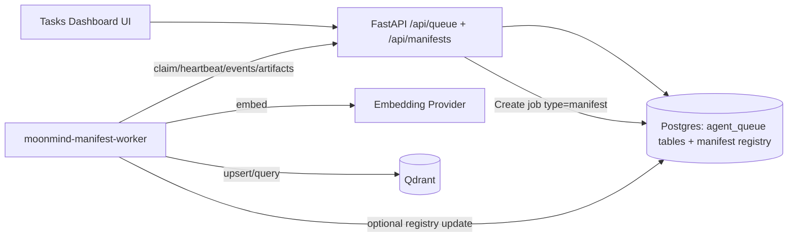

# Manifest Task System (Ingest Manifests via Agent Queue)

Status: Draft (implementation-ready)  
Owners: MoonMind Engineering  
Last Updated: 2026-02-18  

## 1. Purpose

Define how MoonMind ingests **manifest-defined data pipelines** using the existing **Agent Queue task system** (`/api/queue`) so that:

- Manifest ingestion runs are submitted, monitored, cancelled, and audited like other queue jobs.
- The Tasks Dashboard UI can show manifest runs as a first-class **category** (separate from codex/gemini/claude).
- Ingestion is observable (events + artifacts) and safe (no raw secrets in payloads/logs).

This design intentionally reuses:
- Agent Queue job lifecycle, events, artifacts, cancellation, and worker token policy.
- Existing manifest foundations (interpolation, loader/validator patterns).
- “Worker direct data plane” guidance (Qdrant + embeddings) per `docs/WorkerVectorEmbedding.md`.

## 2. Background / Current Repo State

### 2.1 What exists today
- Legacy manifest schema (`apiVersion/kind/spec.readers`) in `moonmind/schemas/manifest_models.py`.
- Loader + interpolation + runner in `moonmind/manifest/*`.
- DB table `manifest` (`ManifestRecord`) + `ManifestSyncService` (hash detect + run readers) but no indexing.
- “v0 manifest” examples and operator guide in `docs/LlamaIndexManifestSystem.md` + `examples/readers-*.yaml` are present, but not wired into execution.

### 2.2 What is missing
- No Agent Queue job type for manifest ingestion.
- No manifest ingestion worker.
- No manifest execution engine that performs: validate → fetch → transform → embed → upsert.
- No UI category/submit flow dedicated to manifests.
- No consistent secret resolution story for manifests that matches Task safety constraints (token-free queue payloads).

## 3. Goals and Non-Goals

### 3.1 Goals
1. Add a **new queue job type** for manifest ingestion runs.
2. Provide a **manifest worker** (`moonmind-manifest-worker`) that:
   - claims manifest jobs
   - streams progress via queue events
   - uploads artifacts (logs/reports)
   - supports cancellation
3. Support **v0 manifests** as defined in `docs/LlamaIndexManifestSystem.md` and `examples/readers-*.yaml`.
4. Keep queue payloads **token-free**: only allow env references and/or secret references (Vault) — never raw API keys.
5. Make manifest runs visible in the Tasks Dashboard UI as a **separate category** from codex/gemini/claude.

### 3.2 Non-Goals (for this document)
- Implementing every v0 feature (e.g., hybrid retrieval, rerankers, full evaluation suite) in the first increment.
- Multi-tenant access control for indices (can be layered later).
- Replacing existing `/v1/documents/*` ingestion endpoints immediately.

## 4. Key Concepts

**Manifest (v0)**  
A YAML document describing ingestion sources, transforms, embeddings, and a vector store target.

**Manifest Run**  
A single execution of a manifest. Represented as an Agent Queue job of type `manifest`.

**Manifest Worker**  
A daemon that claims manifest jobs and executes ingestion pipelines (no LLM runtime selection).

**Control Plane vs Data Plane**  
- Control plane: queue job creation/claim/status, events, artifacts (FastAPI).
- Data plane: embeddings + vector store upserts (worker direct to Qdrant; optionally API-mediated later).

## 5. High-Level Architecture



## 6. Queue Job Type and Payload Contract

### 6.1 New job type

Add a new Agent Queue job type:

* `type = "manifest"`

This job type is **not** executed by codex/gemini/claude workers.
It is executed only by workers advertising capability `manifest`.

### 6.2 Canonical payload: ManifestJobPayload

Clients submit only the manifest payload. The API validates the manifest and derives
`requiredCapabilities` server-side before persisting the job so claim filtering works.

Client request payload:

```json
{
  "manifest": {
    "name": "repo-docs",
    "action": "run",
    "source": {
      "kind": "inline",
      "content": "version: \"v0\"\nmetadata:\n  name: ...\n"
    },
    "options": {
      "dryRun": false,
      "forceFull": false,
      "maxDocs": null
    }
  }
}
```

Persisted queue payload (after API derivation):

```json
{
  "requiredCapabilities": ["manifest", "qdrant", "embeddings", "github"],
  "manifest": {
    "name": "repo-docs",
    "action": "run",
    "source": {
      "kind": "inline",
      "content": "version: \"v0\"\nmetadata:\n  name: ...\n"
    },
    "options": {
      "dryRun": false,
      "forceFull": false,
      "maxDocs": null
    }
  }
}
```

### 6.3 Manifest source kinds

`manifest.source.kind` determines how the worker obtains the YAML:

* `inline`: YAML embedded directly in payload (`content`).
* `registry`: reference by name (`manifest.name`), worker fetches content from manifest registry (optional API endpoint).
* `path`: worker reads file from local filesystem path (used in dev/CI images containing manifests).
* `repo`: worker clones a repo/path and reads YAML (optional; requires git).

Initial implementation SHOULD support `inline` and `path`.
`registry` is recommended once manifest CRUD endpoints exist.

### 6.4 Actions

* `plan`: validate + estimate counts/costs; no upserts.
* `run`: full ingestion (fetch → transform → embed → upsert).
* `evaluate`: optional; run retrieval eval dataset (future phase).

### 6.5 Capability derivation (server-side)

On job creation, API MUST parse/validate manifest and derive `requiredCapabilities`, at minimum:

* Always include: `manifest`
* Include vector store capability based on `vectorStore.type`:

  * `qdrant` → `qdrant`
* Include embedding capability:

  * always include `embeddings`
  * optionally include `openai` / `google` / `ollama` based on manifest embeddings provider
* Include source capabilities based on `dataSources[].type`:

  * GithubRepositoryReader → `github`
  * GoogleDriveReader → `gdrive`
  * ConfluenceReader → `confluence`
  * SimpleDirectoryReader → `local_fs` (or omit if always available)

Workers must advertise a superset of required capabilities or they will never claim the job.

## 7. Manifest Registry (CRUD + Run Submission)

### 7.1 DB model

Reuse existing `manifest` table (`ManifestRecord`) and extend as needed:

Existing columns today:

* `id` (integer PK)
* `name` (string, unique)
* `content` (text manifest body)
* `content_hash` (string hash)
* `last_indexed_at` (nullable timestamp)

Additive columns (backward compatible):

* `version` (nullable string; `"v0"` or `"legacy"`)
* `updated_at` (timestamp)
* `last_run_job_id` (nullable UUID)
* `last_run_status` (nullable string)

### 7.2 API endpoints (recommended)

Add a small CRUD surface:

* `GET /api/manifests` → list manifests
* `GET /api/manifests/{name}` → get YAML + metadata
* `PUT /api/manifests/{name}` → upsert YAML (validates and stores hash)
* `POST /api/manifests/{name}/runs` → submits queue job `type="manifest"`

Submission returns the queue job id for dashboard navigation.

NOTE: A minimal first version can skip CRUD and require `inline` payload submission from UI.

## 8. Manifest Execution Engine

### 8.1 Package layout

Create a dedicated v0 engine:

* `moonmind/manifest_v0/models.py` (Pydantic models)
* `moonmind/manifest_v0/validator.py` (schema + semantic validation)
* `moonmind/manifest_v0/interpolate.py` (env + secret ref resolution)
* `moonmind/manifest_v0/readers/*` (ReaderAdapters)
* `moonmind/manifest_v0/transforms/*`
* `moonmind/manifest_v0/engine.py` (plan/run orchestration)

Keep legacy support in `moonmind/manifest/*` unchanged.

### 8.2 ReaderAdapter interface

Implement adapters as described in `docs/LlamaIndexManifestSystem.md`:

```python
class ReaderAdapter(Protocol):
    def plan(self) -> PlanStats: ...
    def fetch(self) -> Iterable[Document]: ...
    def state(self) -> dict: ...
```

Initial adapters to implement:

* `GithubRepositoryReaderAdapter`
* `GoogleDriveReaderAdapter`
* `SimpleDirectoryReaderAdapter`

### 8.3 Transforms

Initial supported transforms:

* `htmlToText: true|false`
* `splitter`:

  * TokenTextSplitter with `chunkSize`, `chunkOverlap`
* `enrichMetadata` (phase-2):

  * PathToTags
  * InferDocType

### 8.4 Embeddings

Support manifest-level embedding selection. Extend `moonmind/factories/embed_model_factory.py` to include:

* OpenAI embedding models (e.g., `text-embedding-3-large`)
* Keep existing `google` and `ollama`

Key invariant:

* Embedding dimension MUST match the target vector store collection.

### 8.5 Vector store

Phase-1: support `vectorStore.type = "qdrant"`.

Worker uses:

* `qdrant-client` + `llama_index.vector_stores.qdrant.QdrantVectorStore`

Collection selection:

* Prefer `vectorStore.indexName` as the Qdrant collection name.
* If not provided, fall back to `settings.vector_store_collection_name`.

Collection provisioning:

* If collection missing:

  * If `manifest.run.allowCreateCollection=true`, create it with expected dims + cosine distance.
  * Else fail with a clear error.

### 8.6 Namespacing and metadata allowlist

Every node upserted MUST include:

* `manifest.name`
* `dataSource.id`
* any safe source metadata (path/repo/branch/docType/etc)

Apply `security.allowlistMetadata` to restrict stored metadata fields.

## 9. Manifest Worker

### 9.1 New worker service

Add a new worker daemon similar to `moonmind-codex-worker`:

* Entry point: `poetry run moonmind-manifest-worker`
* Module: `moonmind/agents/manifest_worker/worker.py`

### 9.2 Worker configuration (env)

* `MOONMIND_URL`
* `MOONMIND_WORKER_ID`
* `MOONMIND_WORKER_TOKEN`
* `MOONMIND_WORKDIR` (workspace root)
* `MOONMIND_LEASE_SECONDS`, `MOONMIND_POLL_INTERVAL_MS`
* `MOONMIND_WORKER_CAPABILITIES=manifest,qdrant,embeddings,github,gdrive,...`
* Embedding provider keys (fast path):

  * `GOOGLE_API_KEY` and/or `OPENAI_API_KEY`
* Qdrant:

  * `QDRANT_HOST`, `QDRANT_PORT`, optional `QDRANT_API_KEY`

### 9.3 Stage plan + events

Manifest jobs emit stage events analogous to task stages:

1. `moonmind.manifest.validate`
2. `moonmind.manifest.plan`
3. `moonmind.manifest.fetch`
4. `moonmind.manifest.transform`
5. `moonmind.manifest.embed`
6. `moonmind.manifest.upsert`
7. `moonmind.manifest.finalize`

Each stage emits:

* started/finished/failed
* counts and timings in payload (never secrets)

### 9.4 Required artifacts

Worker uploads artifacts to the queue artifact store:

* `logs/manifest.log`
* `manifest/input.yaml` (original YAML, redacted if needed)
* `manifest/resolved.yaml` (after interpolation, with secrets redacted)
* `reports/plan.json`
* `reports/run_summary.json`
* `reports/errors.json` (if failed)

### 9.5 Cancellation

Worker must honor queue cancellation requests using the same mechanism as codex worker:

* heartbeat loop observes `cancelRequestedAt`
* worker stops between stages and acknowledges cancellation with `/cancel/ack`

## 10. Tasks Dashboard UI Integration

### 10.1 New category

Add a new dashboard category:

* **Manifests** (Agent Queue jobs where `type="manifest"`)

This category is distinct from runtime selection (codex/gemini/claude).

### 10.2 Submit form (minimal)

Add `/tasks/queue/new-manifest` (or extend existing submit form with a type switch):

Fields:

* Manifest Name
* Manifest Source:

  * Inline YAML editor (phase-1)
  * Select from registry list (phase-2)
* Action: plan | run
* Dry run checkbox
* Priority

UI submits:

* `POST /api/queue/jobs` with `type="manifest"` and payload per Section 6.

### 10.3 Detail view

Reuse existing queue detail page:

* SSE event stream shows stage progress
* artifacts list provides run reports

## 11. Security Model

### 11.1 No raw secrets in payloads

Queue payload MUST NOT contain raw keys/tokens.

Allowed:

* `${ENV_VAR}` references (resolved by worker runtime env)
* Vault secret references (future hardening):

  * `vault://<mount>/<path>#<field>`

### 11.2 Fast path (Phase-1)

* Worker uses environment variables for provider keys (e.g., `GOOGLE_API_KEY`, `OPENAI_API_KEY`) and GitHub token (`GITHUB_TOKEN`) if needed.
* Mirrors the “fast path” approach documented for Task jobs.

### 11.3 Hardened path (Phase-2)

* Manifest auth blocks can reference Vault
* Worker resolves via Vault client (reuse `moonmind/agents/codex_worker/secret_refs.py` patterns)

### 11.4 Logging redaction

Worker must redact token-like strings from:

* events
* logs
* artifacts

## 12. Delivery Plan

### Phase 1 (MVP): Manifest runs as queue jobs

1. Add `manifest` to queue job type constants in `task_contract.py` so `_SUPPORTED_QUEUE_JOB_TYPES` in `service.py` accepts it.
2. Add `ManifestJobPayload` schema + validation + server-side capability derivation, and add explicit manifest handling in queue payload normalization so manifest fields are preserved.
3. Implement `moonmind-manifest-worker`:

   * validate → run minimal ingestion (qdrant + one embedding provider) → artifacts/events
4. Add dashboard UI category + inline submit form.

### Phase 2: Manifest registry + secret refs

1. Add `/api/manifests` CRUD endpoints backed by `ManifestRecord`.
2. Add `registry` manifest source kind.
3. Add Vault secret references for provider keys and connectors.

### Phase 3: v0 feature coverage

* Implement more adapters (Confluence, Jira)
* Implement evaluation action + dataset registry
* Implement richer transforms and postprocessors

## 13. Related Documents

* `docs/LlamaIndexManifestSystem.md`
* `docs/TaskArchitecture.md`
* `docs/TaskUiArchitecture.md`
* `docs/WorkerVectorEmbedding.md`
* `docs/WorkerGitAuth.md`
