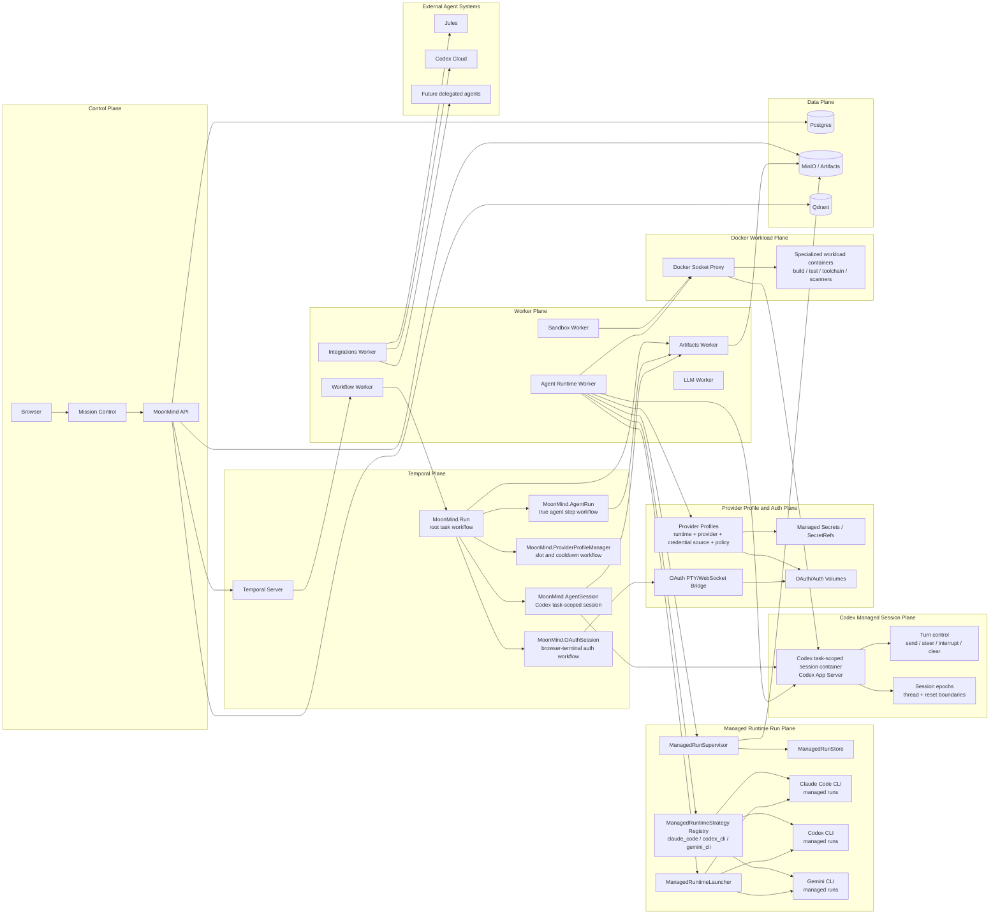

# MoonMind Architecture

**Status:** Current architecture and near-term direction  
**Audience:** Contributors, operators, runtime authors, integration authors, and Mission Control developers  
**Purpose:** Top-level architecture for MoonMind's Temporal-native agent orchestration model, including managed runtime runs, Codex managed sessions, Claude Code workflows, external agents, artifacts, provider profiles, and workload containers.

MoonMind is an open-source platform for orchestrating leading AI coding agents and automation systems while adding resiliency, safety, context delivery, provider-profile routing, and artifact-first observability.

MoonMind currently has two concrete managed-runtime centers of gravity:

1. **Codex CLI** — a working managed runtime path and the current concrete task-scoped managed-session implementation.
2. **Claude Code** — a working managed runtime path for many workflows, backed by runtime strategies, provider-profile materialization, OAuth/API-key credential flows, context injection, GitHub auth handling, and managed-run supervision.

Codex is therefore no longer the only working path for many workflows. However, one important distinction remains:

> **Current maturity note:** `MoonMind.AgentRun` and the managed-runtime launcher support multiple managed CLI runtimes, including `codex_cli`, `claude_code`, and `gemini_cli`. `MoonMind.AgentSession`, `managedSession` bindings, and the turn-level session-control catalog are still Codex-specific today. Claude Code is a concrete managed-run runtime, not yet a peer implementation of the Codex task-scoped `MoonMind.AgentSession` plane.

This document describes the current architecture and target direction. It intentionally separates **managed runtime runs** from **managed sessions** so the project can accurately describe the current Claude Code path without overstating Claude session parity.

> **Core rule:** Temporal remains MoonMind's durable outer orchestrator. Managed runtimes and external agents run inside Temporal-owned execution envelopes. Runtime-specific behavior belongs behind strategies, adapters, provider-profile materialization, launchers, supervisors, and activity handlers, not in workflow-specific branching.

> **Artifact rule:** Artifacts remain execution-centric evidence. Task-, step-, run-, and session-oriented UI views are projections over execution-linked artifacts and compact metadata; they do not create a second durable source of truth.

---

## Architecture at a Glance

---

## Current Runtime Maturity Matrix

| Runtime / integration | Current role | Current maturity | Architecture note |
|---|---|---|---|
| `codex_cli` | Managed CLI runtime and task-scoped managed-session runtime | Concrete working managed-run path and current concrete `MoonMind.AgentSession` implementation | Codex owns the live session-plane contracts today: session container, turn control, `session_epoch`, thread boundaries, clear/reset artifacts, and Codex App Server transport. |
| `claude_code` | Managed CLI runtime | Concrete working managed-run path | Claude Code has a concrete launch strategy, provider-profile materialization, OAuth/API-key paths, MiniMax/Anthropic-compatible profile support, context injection, GitHub auth handling, and runtime-specific launch hardening. It is not yet a peer Codex-style `MoonMind.AgentSession` runtime. |
| `gemini_cli` | Managed CLI runtime | Registered managed-runtime strategy and supported architecture target | Gemini participates in the same strategy/launcher/profile model, but this document's current focus is Codex CLI and Claude Code. |
| Jules | External delegated agent | Concrete external-agent path | Delegated through integration adapters and canonical `AgentRun` contracts. |
| Codex Cloud | External delegated agent | Concrete external-agent path | Coordinated through integration activities and canonical result/status contracts. |
| Specialized Docker workloads | Tool-backed workload containers | Concrete sibling plane | Used for build/test/toolchain/security workloads. They are not managed sessions and not true agent runs unless the launched workload is itself an agent runtime. |

---

## Key Layers

### Control Plane

The API service and Mission Control provide the operator boundary. They create tasks, resolve runtime intent, expose provider-profile and auth configuration, serve artifact and observability views, support intervention flows, and expose context/MCP-style surfaces to compatible runtimes.

### Temporal Plane

Temporal is the durable orchestration backbone. Workflows own orchestration state; activities perform side effects. Temporal remains authoritative for task lifecycle, retries, timers, cancellation, signals, updates, schedules, and workflow visibility.

### Agent Orchestration Layer

The Agent Orchestration Layer spans all true agent execution:

- managed runtime runs launched and supervised by MoonMind
- Codex task-scoped managed sessions
- delegated external agents such as Jules and Codex Cloud

The layer owns canonical contracts, provider-profile coordination, runtime dispatch, artifact publication, policy enforcement, and operator-facing lifecycle semantics.

### Managed Runtime Run Plane

The Managed Runtime Run Plane is the current general managed-runtime implementation path. It is strategy-driven and supports `claude_code`, `codex_cli`, and `gemini_cli` as runtime IDs.

A managed run is normally a step-scoped execution of one CLI runtime under `MoonMind.AgentRun`. It is supervised asynchronously, writes logs and diagnostics to artifacts, and returns canonical `AgentRunStatus` and `AgentRunResult` contracts.

Claude Code lives here today as a concrete managed runtime.

### Codex Managed Session Plane

The Codex Managed Session Plane is a more stateful path. It uses `MoonMind.AgentSession` to own a task-scoped Codex session container, Codex App Server transport, turn-level control, thread IDs, session epochs, clear/reset boundaries, and continuity artifacts.

This plane is currently Codex-specific. Future work may extract runtime-neutral managed-session contracts after a second session runtime is implemented.

### Provider Profile and Auth Plane

Provider Profiles bind runtime, upstream provider, credential source, materialization mode, model defaults, environment/file shaping, slot policy, cooldown policy, and routing metadata.

This layer is central to both Codex and Claude Code. It makes `claude_code + anthropic OAuth`, `claude_code + anthropic API key`, `claude_code + MiniMax`, `codex_cli + OpenAI`, and future combinations first-class execution targets without putting secrets or provider-specific branches into workflow code.

### External Agent Systems

External agents are delegated integrations. MoonMind does not own their runtime envelope but still owns orchestration, status normalization, artifacts, observability evidence, cancellation semantics where supported, and operator presentation.

### Docker Workload Plane

Specialized workload containers are sibling execution resources for bounded non-agent work. They are routed through approved tools and Docker policies, not through managed session identity.

### Data Plane

Postgres stores durable metadata and read models. MinIO stores artifacts and observability blobs. Qdrant stores retrieval and memory vectors.

---

## Design Principles

### 1. Temporal remains the outer orchestrator

Managed runtimes do not replace Temporal orchestration. They run inside a Temporal-owned envelope.

Temporal owns:

- task lifecycle
- workflow history
- step ordering
- retries and timers
- cancellation propagation
- signals and updates
- workflow visibility and operator state

Managed runtime processes, containers, external jobs, OAuth runners, and workload containers are all side-effecting execution resources driven from activities or integration boundaries.

### 2. Distinguish managed runs from managed sessions

A **managed run** is an asynchronously supervised CLI runtime execution. Claude Code and Codex CLI both work on this path today.

A **managed session** is a longer-lived task-scoped runtime container with explicit session identity, turn control, continuity epochs, and clear/reset semantics. Codex is the current concrete implementation of this path.

The top-level architecture must not collapse these together.

### 3. `MoonMind.AgentRun` is the shared true-agent execution workflow

`MoonMind.AgentRun` is the durable child workflow for one true agent execution step, regardless of whether the runtime is managed or external.

It owns lifecycle orchestration, status polling or callback waiting, result fetch, cancellation handling, slot release, and artifact publication coordination. It does not own runtime-specific launch details.

### 4. Runtime-specific logic belongs behind strategies and adapters

Managed runtime differences belong in:

- `ManagedRuntimeStrategy`
- `ManagedAgentAdapter`
- `ManagedRuntimeLauncher`
- `ManagedRunSupervisor`
- Provider Profile materialization
- activity handlers

Workflow code should consume canonical contracts and compact metadata rather than branching on Claude/Codex/Gemini internals.

### 5. Provider Profiles are execution targets, not just auth records

A Provider Profile answers:

> Which runtime should launch, against which provider, using which credential source, materialized in which way, with which model defaults, concurrency, cooldown, and routing policy?

This is broader than legacy auth-profile framing and is required for modern Claude Code and Codex usage.

### 6. Artifacts are authoritative execution evidence

Large inputs and outputs do not belong in workflow history.

MoonMind stores artifacts for:

- instruction bundles
- context packs
- stdout and stderr
- merged logs
- diagnostics
- patches and generated files
- provider result bundles
- session summaries and reset boundaries
- observability events

Task, step, run, and session views are projections over artifacts and compact metadata.

### 7. Session containers are continuity caches, not durable truth

Codex session containers may preserve native runtime state for task continuity, but MoonMind remains authoritative for task status, step state, control intent, artifact refs, provider-profile policy, and audit metadata.

Any state required for recovery, audit, presentation, rerun, or operator understanding must be materialized as artifacts or bounded metadata.

### 8. Step boundaries remain first-class

A managed runtime may run across multiple plan steps or through a task-scoped session, but MoonMind must preserve step-level evidence. Each meaningful step should produce bounded status, logs, outputs, diagnostics, and artifact refs.

Recent Codex hardening reinforces this: task-scoped sessions must not allow broad repository-level autonomy instructions to blur current step boundaries.

### 9. Observation and control are separate

Logging is not intervention.

MoonMind separates:

- **observation** — stdout/stderr capture, diagnostics, live follow, artifact tails, and session/run observability
- **control** — pause, resume, cancel, approve, reject, operator message, interrupt, clear/reset, terminate

Terminal attachment is not the primary observability model for normal managed runs.

---

## Execution Model

### Workflow Catalog

| Workflow | Purpose |
|---|---|
| `MoonMind.Run` | Root workflow for one task. Owns the task envelope, planning, step ordering, task-level cancellation, and final task summary. |
| `MoonMind.AgentRun` | Child workflow for one true agent execution step. Handles managed and external agents through canonical contracts. |
| `MoonMind.AgentSession` | Codex-specific task-scoped session workflow. Owns the Codex session container, turn routing, session epochs, clear/reset, reconciliation, and teardown. |
| `MoonMind.ManagedSessionReconcile` | Bounded reconciliation workflow for Codex managed-session records and container state. |
| `MoonMind.ProviderProfileManager` | Per-runtime workflow that owns provider-profile slot acquisition, release, cooldown, and assignment. |
| `MoonMind.OAuthSession` | Interactive browser-terminal OAuth/auth workflow for runtime auth volumes. |
| `MoonMind.ManifestIngest` | Manifest-driven ingestion and background graph compilation flows. |

### Managed run shape

For Claude Code, Codex CLI, Gemini CLI, and future managed CLI runtimes:

1. `MoonMind.Run` reaches a plan step that targets a true managed agent runtime.
2. `MoonMind.Run` starts `MoonMind.AgentRun` as a child workflow.
3. `MoonMind.AgentRun` acquires provider-profile capacity through `MoonMind.ProviderProfileManager` when needed.
4. `ManagedAgentAdapter` resolves the exact Provider Profile.
5. `ManagedRuntimeLauncher` materializes secrets, files, env, workspace, GitHub auth, runtime homes, and command args.
6. The runtime process is launched asynchronously.
7. `ManagedRunSupervisor` tracks process state, logs, outputs, diagnostics, and failure classification.
8. `MoonMind.AgentRun` polls or receives completion through short activities and durable timers.
9. Final outputs and diagnostics are returned as canonical `AgentRunResult` refs and metadata.
10. Slots and launch resources are released or cleaned up.

This is the path where Claude Code is concrete today.

### Codex managed-session shape

For Codex task-scoped sessions:

1. `MoonMind.Run` determines that a step should use the Codex managed-session path.
2. `MoonMind.Run` ensures the task-scoped `MoonMind.AgentSession` exists.
3. `MoonMind.AgentSession` launches or resumes a Codex session container through session activities.
4. `MoonMind.AgentRun` or session-aware step logic sends a turn into the session.
5. Codex App Server handles turn execution, steering, interruption, clear/reset, and session status.
6. Session continuity artifacts, reset boundaries, stdout/stderr, diagnostics, and result artifacts are published.
7. Clear/reset creates a new session epoch and thread boundary inside the same task-scoped session policy.

Current session-control vocabulary includes:

| Canonical verb | Current activity / transport |
|---|---|
| `start_session` / `resume_session` | `agent_runtime.launch_session` / `agent_runtime.session_status` |
| `send_turn` | `agent_runtime.send_turn` |
| `steer_turn` | `agent_runtime.steer_turn` |
| `interrupt_turn` | `agent_runtime.interrupt_turn` |
| `clear_session` | `agent_runtime.clear_session`, new epoch, new thread |
| `terminate_session` | `agent_runtime.terminate_session` |
| `fetch_status` / `fetch_result` | `agent_runtime.session_status` / `agent_runtime.fetch_session_summary` |
| `publish_session_artifacts` | `agent_runtime.publish_session_artifacts` |

These contracts are Codex-specific today and should remain labeled as such until a second runtime implements the same session-plane capabilities.

### External execution shape

For external agents:

1. `MoonMind.Run` starts `MoonMind.AgentRun` for a delegated step.
2. `MoonMind.AgentRun` uses an external adapter to start remote work.
3. The adapter normalizes provider state into canonical `AgentRunStatus` and `AgentRunResult` contracts.
4. MoonMind persists tracking, logs, diagnostics, output refs, callbacks, and cancellation evidence.

### Specialized workload shape

For non-agent Docker workloads:

1. A plan step invokes an executable tool, normally `tool.type = "skill"`.
2. MoonMind resolves the tool and runner policy.
3. A Docker-capable worker launches the approved workload container through the controlled Docker boundary.
4. Outputs are captured as tool results and artifacts.

These workload containers do not own `session_id`, `session_epoch`, `thread_id`, or `active_turn_id`, and they do not become `MoonMind.AgentRun` child workflows unless the workload is itself a true agent runtime.

---

## Managed Runtime Strategies

MoonMind uses a strategy registry to normalize CLI runtime differences.

A strategy owns runtime-specific behavior such as:

- canonical `runtime_id`
- default command template
- default auth mode
- model and effort argument shaping
- environment shaping
- workspace preparation
- output parsing
- exit classification
- progress probing
- retry classification
- runtime-specific guardrails

Current registered strategy IDs include:

- `claude_code`
- `codex_cli`
- `gemini_cli`

### Claude Code strategy

Claude Code is a real managed-run runtime path today.

The Claude Code strategy is responsible for:

- launching the `claude` CLI
- building non-interactive commands using `-p`
- adding `--dangerously-skip-permissions` for managed workspace edits
- applying model selection unless the Provider Profile supplies `ANTHROPIC_MODEL` through environment shaping
- preparing workspace context through shared context injection
- writing `CLAUDE.md` only when it does not already exist and is not a symlink
- respecting Anthropic, MiniMax, and other Anthropic-compatible provider-profile materialization

Claude Code launch has additional runtime hardening because the CLI can reject dangerous-permission mode as root. The launcher may need to drop privileges to the app user and ensure workspace and GitHub auth helpers remain accessible after that boundary.

### Codex CLI strategy

Codex CLI is both a managed-run runtime and the current managed-session runtime.

The Codex CLI strategy is responsible for:

- launching `codex exec` for managed runs
- shaping model flags with `-m`
- applying managed-runtime instruction notes
- adding retrieval/context guidance
- parsing Codex CLI output
- detecting blocker lines
- probing Codex session artifacts for progress
- supporting Codex-specific runtime homes and progress files

The Codex session plane additionally uses Codex-specific session contracts and a Codex App Server transport.

### Gemini CLI strategy

Gemini CLI participates in the same registry and launcher model. It remains part of the runtime-extensible architecture but is not the current focus of this top-level update.

---

## Provider Profiles, Auth, and Runtime Materialization

Provider Profiles are the durable execution-target abstraction for managed runtimes.

A Provider Profile binds:

- runtime ID
- provider ID and label
- credential source
- runtime materialization mode
- default model and model overrides
- secret refs or auth volume refs
- environment templates
- file templates
- home path overrides
- clear-env rules
- command behavior hints
- profile priority
- concurrency slots
- cooldown policy

### Credential source classes

Supported credential source classes include:

- `oauth_volume`
- `secret_ref`
- `none`

### Materialization modes

Supported materialization modes include:

- `oauth_home`
- `api_key_env`
- `env_bundle`
- `config_bundle`
- `composite`

### Runtime/provider examples

Claude Code examples:

- `claude_code + anthropic + oauth_volume + oauth_home`
- `claude_code + anthropic + secret_ref + api_key_env`
- `claude_code + minimax + secret_ref + env_bundle`
- `claude_code + zai + secret_ref + env_bundle`

Codex examples:

- `codex_cli + openai + oauth_volume + oauth_home`
- `codex_cli + openai + secret_ref + api_key_env`
- `codex_cli + minimax + secret_ref + composite`

Provider Profiles keep these combinations explicit without requiring workflow-level provider branching.

### Materialization pipeline

The launcher should materialize runtime environments in a predictable order:

1. start from a safe base environment
2. apply runtime-global defaults
3. remove or blank `clear_env_keys`
4. resolve `secret_refs` at launch boundary only
5. materialize `file_templates` with safe permissions
6. apply `env_template`
7. apply `home_path_overrides`
8. apply runtime strategy shaping
9. build command
10. launch subprocess or container

Raw secrets never enter workflow history, profile rows, artifacts, or normal logs. Secret values are resolved at launch boundaries and redacted from observable outputs.

---

## OAuth and Browser-Terminal Auth

MoonMind supports browser-terminal OAuth flows for runtime auth homes.

The flow is:

1. Operator starts an OAuth session in Mission Control Settings.
2. API starts `MoonMind.OAuthSession`.
3. The agent-runtime worker starts a short-lived auth-runner container.
4. Mission Control attaches through PTY/WebSocket.
5. The runtime CLI performs its native interactive login.
6. The runtime writes durable auth state into a mounted auth volume.
7. MoonMind verifies the volume using secret-safe metadata.
8. MoonMind registers or updates the Provider Profile.
9. The auth-runner is cleaned up.

Claude Code uses this path for Anthropic OAuth, where the operator opens the Claude login URL externally and pastes the returned token/code into the terminal. API-key auth remains a separate Managed Secrets path.

Codex uses the same OAuth-session infrastructure where appropriate but may have a different user ceremony.

---

## Artifact System and Observability

### Artifact authority

Artifacts are the authoritative evidence layer for large payloads.

Large data belongs in artifacts, including:

- prompts and instruction bundles
- retrieved context packs
- skill snapshots and prompt indexes
- stdout and stderr
- merged logs
- observability event streams
- diagnostics
- generated files and patches
- provider result bundles
- session summaries and reset boundaries

### Execution-centric linkage

Artifacts remain linked to concrete executions and are projected into task, step, run, and session views.

Task-oriented and session-oriented views are read models, not alternate artifact authorities.

### Managed run observability

For managed runs, expected metadata includes:

- `stdout_artifact_ref`
- `stderr_artifact_ref`
- `merged_log_artifact_ref`
- `diagnostics_ref`
- `observability_events_ref`
- `last_log_at`
- `last_log_offset`
- live-stream capability/status metadata where available

`AgentRunResult` is the terminal workflow contract. Live logs and artifact tails belong to observability APIs and Mission Control views.

### Session observability

For Codex sessions, session-aware projections group execution evidence by:

- `session_id`
- `session_epoch`
- `thread_id`
- turn metadata
- reset boundaries

The projection exists for operator understanding. The source of truth remains execution-linked artifacts and compact workflow metadata.

---

## Worker Fleet

MoonMind workers are grouped by capability and security boundary, not by runtime brand.

| Fleet | Task queue | Role |
|---|---|---|
| Workflow | `mm.workflow` | Deterministic workflow orchestration only. No side effects. |
| Artifacts | `mm.activity.artifacts` | Artifact create/read/write/finalize/list/retention lifecycle. |
| LLM | `mm.activity.llm` | Ordinary model calls used for planning, evaluation, summarization, and non-runtime inference. |
| Sandbox | `mm.activity.sandbox` | Shell commands, repo preparation, ordinary tool execution, and non-runtime build/test work. |
| Agent Runtime | `mm.activity.agent_runtime` | Managed runtime launch, supervision, status, cancellation, result collection, session control, artifact publication, OAuth runner launch, and cleanup. |
| Integrations | `mm.activity.integrations` | External provider communication, callbacks, repository publishing, Jira/GitHub integration, and delegated-agent operations. |

Worker images should remain generic and lightweight where possible. Runtime binaries and runtime auth homes belong at runtime/materialization boundaries, not inside deterministic workflow code.

---

## Memory, Context, and Agent Skills

MoonMind owns system-level context assembly and memory retrieval.

Context can include:

- task description
- plan and step state
- repository metadata
- retrieved documents
- long-term memory
- skill snapshots
- runtime-specific instruction guidance
- operator attachments

Managed runtimes may also keep runtime-local context and caches, but those are not durable system truth.

Context and skill delivery should be immutable for a given execution attempt unless an explicit re-resolution action occurs.

Claude Code and Codex currently share context-injection infrastructure for managed runtime workspace preparation where applicable.

---

## Data Layer

### PostgreSQL

Postgres stores:

- API state
- task and execution metadata
- provider profiles
- managed secret metadata and refs
- OAuth session records
- managed run/session read models
- Temporal persistence and visibility
- identity and app state where configured

### MinIO

MinIO stores:

- workflow artifacts
- runtime logs
- diagnostics
- context packs
- output bundles
- session continuity artifacts
- generated files

### Qdrant

Qdrant stores:

- retrieval vectors
- document RAG indexes
- memory indexes
- future runtime/session retrieval features

---

## Safety and Isolation

MoonMind's safety model depends on explicit boundaries.

### Required boundaries

- generic orchestration worker boundary
- runtime strategy and launcher boundary
- provider-profile materialization boundary
- secret-resolution boundary
- runtime auth/home volume boundary
- workspace boundary
- Docker socket proxy boundary
- artifact publication boundary
- observability API boundary

### Security requirements

- raw credentials never appear in workflow history
- raw credentials never appear in profile rows
- secret refs resolve only at controlled launch/proxy boundaries
- generated secret-bearing files are temporary runtime materialization, not durable artifacts by default
- environment variables are cleared to avoid provider bleed-through
- runtime logs and failure messages are redacted
- auth volumes are credential stores, not task workspaces
- Docker access is mediated and policy-controlled
- provider-profile slot policy is explicit
- cancellation and cleanup attempt to prevent orphaned processes, containers, and leases

### Runtime-specific examples

Claude Code:

- may require privilege drop from root to app user for safe CLI execution
- may require Claude home/auth volume materialization
- may require Anthropic-compatible environment shaping for MiniMax or other providers
- should not overwrite existing `CLAUDE.md` or symlinked project instruction files

Codex CLI:

- may require Codex home/config shaping
- may need direct GitHub token env in addition to brokered helpers for nested shell-tool behavior
- owns the current Codex session container and turn-control transport

---

## Runtime Evolution Model

### Adding a managed-run runtime should require

1. a runtime ID
2. a `ManagedRuntimeStrategy`
3. command and environment shaping
4. output parsing and exit classification
5. provider-profile definitions
6. credential/materialization rules
7. launcher and supervisor compatibility
8. artifact and diagnostics mapping
9. tests for strategy, materialization, launch, and result handling

### Adding a managed-session runtime should additionally require

1. a runtime-neutral or runtime-specific session contract
2. launch/resume/session-status semantics
3. turn submission and active-turn identity
4. control actions such as steer, interrupt, clear, terminate
5. epoch/reset semantics
6. continuity artifact publication
7. recovery and reconciliation behavior
8. session-aware Mission Control projections

Until this exists for Claude Code, the top-level docs should not claim Claude Code is a peer `MoonMind.AgentSession` runtime.

### Adding an external agent should require

1. an external adapter
2. provider start/status/result/cancel mapping
3. callback or polling behavior
4. artifact exchange mechanisms
5. canonical contract normalization
6. cancellation and failure classification behavior

---

## Current Architecture Direction

MoonMind's current focus is best described as:

- **Codex CLI and Claude Code are both first-class working managed-runtime paths.**
- **Codex CLI is still the current first-class managed-session path.**
- **Claude Code is a first-class managed-run path and a future candidate for session-plane parity.**
- **Provider Profiles are the core runtime/provider/auth/policy abstraction for both.**
- **`MoonMind.AgentRun` is the shared durable child workflow for true agent execution.**
- **Artifacts and observability APIs are the durable evidence and presentation model.**
- **Docker workloads remain separate from true agent runtime identity.**

Near-term architecture work should continue to:

- reduce Codex-specific naming in generic managed-run areas where safe
- keep Codex-specific naming in the actual Codex session contract until a runtime-neutral session contract exists
- harden Claude Code provider-profile, GitHub auth, OAuth, context, and result flows
- improve Mission Control runtime/profile clarity
- improve managed-run observability and live log plumbing
- extract shared session abstractions only when a second session-backed runtime is implemented

---

## Summary

MoonMind is:

- Temporal-native
- artifact-first
- provider-profile-driven
- strategy-normalized
- managed-runtime-aware
- Codex-session-aware
- Claude-Code-capable today
- external-agent-compatible
- workload-container-safe
- operator-observable

In the current architecture:

- `MoonMind.Run` remains the root task workflow.
- `MoonMind.AgentRun` owns one true agent execution step for managed and external agents.
- `ManagedRuntimeStrategy`, `ManagedRuntimeLauncher`, `ManagedAgentAdapter`, `ManagedRunSupervisor`, and `ManagedRunStore` are the concrete managed-run path for CLI runtimes such as Claude Code and Codex CLI.
- `MoonMind.AgentSession` owns the current Codex task-scoped managed-session path.
- Provider Profiles are the durable routing, credential-source, materialization, and slot/cooldown policy boundary.
- Claude Code is a current working path for many workflows, not merely a future runtime target.
- Claude Code is not yet a peer implementation of the Codex turn-based task-scoped managed-session plane.
- Artifacts and observability APIs remain authoritative for execution evidence.
- External agents and Docker workload containers remain separate execution classes with clear contracts.

This framing keeps the top-level architecture aligned with MoonMind's current dual focus on **Codex CLI** and **Claude Code** while preserving the important implementation truth that Codex still owns the only concrete task-scoped managed-session plane today.

---

## Related Architecture Docs

- `docs/Temporal/ManagedAndExternalAgentExecutionModel.md`
- `docs/Temporal/ArtifactPresentationContract.md`
- `docs/Temporal/ActivityCatalogAndWorkerTopology.md`
- `docs/ManagedAgents/CodexCliManagedSessions.md`
- `docs/ManagedAgents/ClaudeAnthropicOAuth.md`
- `docs/ManagedAgents/ClaudeCodeMiniMax.md`
- `docs/ManagedAgents/LiveLogs.md`
- `docs/ManagedAgents/DockerOutOfDocker.md`
- `docs/Security/ProviderProfiles.md`
- `docs/Security/SecretsSystem.md`
- `docs/Tasks/SkillAndPlanContracts.md`
- `docs/Tasks/AgentSkillSystem.md`
- `docs/ExternalAgents/ExternalAgentIntegrationSystem.md`
- `docs/Memory/MemoryArchitecture.md`
- `docs/Temporal/TemporalArchitecture.md`
