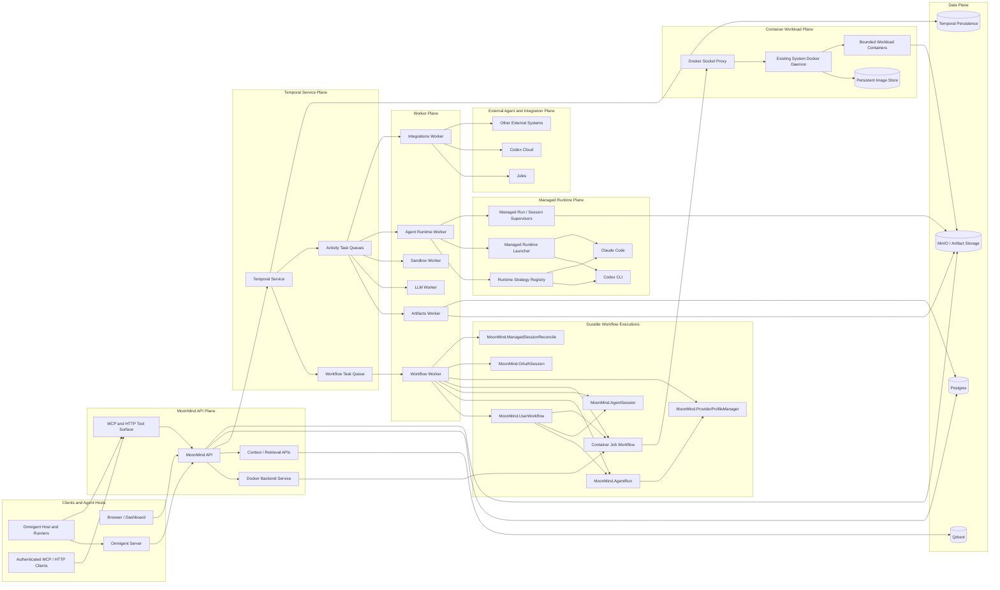

# MoonMind Architecture

**Status:** Current architecture and near-term direction  
**Updated:** 2026-07-13  
**Audience:** Contributors, operators, runtime authors, integration authors, and dashboard developers  
**Purpose:** Top-level architecture for MoonMind's Temporal-native agent orchestration model, including managed runtimes, managed sessions, Omnigent hosts, external agents, artifacts, provider profiles, and API-governed container jobs.

MoonMind is an open-source platform for orchestrating leading AI coding agents
and automation systems while adding resiliency, safety, context delivery,
provider-profile routing, durable workflows, and artifact-first observability.

MoonMind currently has two concrete managed-runtime centers of gravity:

1. **Codex CLI** — a working managed-runtime path and the live
   workflow-scoped managed-session reference implementation.
2. **Claude Code** — a working managed-runtime path with provider-profile,
   OAuth/API-key, context, GitHub-auth, and supervision support. Claude-specific
   session models exist, but Claude Code does not yet enter the live shared
   session controller.

Omnigent integration extends the agent-facing surface to additional harnesses and
hosts while preserving MoonMind's workflow, policy, artifact, and execution
boundaries.

> **Core rule:** Temporal is MoonMind's durable outer orchestrator. Workflow code
> is deterministic and side-effect-free. Managed runtimes, container jobs,
> external-agent calls, OAuth runners, database writes, artifact writes, network
> calls, CLI invocation, and process supervision occur in Activities or external
> service boundaries.

> **Artifact rule:** Artifacts remain execution-centric evidence. Workflow,
> step, run, session, and container-job UI views are projections over linked
> artifacts and compact metadata; they do not create another durable source of
> truth.

> **Docker rule:** Agent runtimes do not receive a Docker socket. Containerized
> repository work enters MoonMind through the API-owned
> [`Docker Backend Service`](ManagedAgents/DockerBackendService.md), which uses one
> deployment-selected daemon and a cross-workflow image cache.

---

## 1. Architecture at a glance



Diagram rules:

- Workflows do not talk directly to workers, Docker, containers, PTYs, storage,
  databases, CLIs, or provider APIs.
- Workflows schedule Activities, create child workflows, send Signals/Updates,
  wait on durable timers, and write compact workflow metadata.
- The API authenticates callers and starts or controls durable workflows.
- Managed runtime components are Activity-owned implementation components, not
  independent workflow peers.
- The Docker Backend Service is API-owned; the long-running execution interval is
  Temporal-owned; Docker side effects occur through trusted workers.
- Omnigent and other agent hosts receive MCP tools, not Docker authority.

---

## 2. Current runtime and integration matrix

| Runtime or integration | Role | Maturity | Architectural boundary |
|---|---|---|---|
| `codex_cli` | Managed CLI runtime and workflow-scoped session runtime | Working managed-run and live `MoonMind.AgentSession` path | Codex App Server transport, session epochs, thread boundaries, artifact-backed continuity |
| `claude_code` | Managed CLI runtime | Working managed-run path; session admission not yet live | Provider profiles, OAuth/API-key materialization, context delivery, runtime-specific hardening |
| Omnigent | Agent host and meta-harness | Combined-stack integration in progress | Omnigent runners call MoonMind through authenticated APIs and MCP tools |
| Jules | External delegated agent | Working integration | Provider adapter normalizes status and artifacts into canonical agent contracts |
| Codex Cloud | External delegated agent | Working integration | Integration Activities and canonical result contracts |
| Docker Backend Service | API-owned workload service | Desired-state container-job interface over existing Docker backend | Arbitrary permitted images, logical workspaces, Temporal durability, cross-workflow image reuse |

---

## 3. Control plane

The API service and dashboard provide the operator boundary. They:

- create workflow executions;
- validate and normalize runtime intent;
- expose provider-profile and authentication configuration;
- serve artifact, log, and execution projections;
- accept intervention and approval requests;
- expose context and MCP surfaces;
- authenticate and authorize container-job submissions;
- resolve logical workspaces and registry-credential references.

Workflow-owned lifecycle state changes go through Temporal Start, Signal, Update,
Query, or idempotent projection Activities. The API must not become a competing
workflow state machine.

### 3.1 MCP and external-agent surface

MoonMind exposes authenticated MCP tools for immediate service operations and
submission-style workflows. Long-running work returns a durable identifier
instead of holding an HTTP request open.

Omnigent agents discover and call these tools through their normal MCP client.
Agent bundles and runners do not receive deployment credentials merely because
they can invoke a tool.

### 3.2 Docker Backend Service

The Docker Backend Service is part of the API subsystem. It owns:

- caller authentication and authorization;
- typed request validation;
- logical workspace resolution;
- backend selection from deployment configuration;
- durable container-job creation;
- status, logs, artifacts, and cancellation surfaces;
- private-image authorization;
- job ownership and labels;
- image-retention policy inputs.

Temporal owns the job's durable execution, timeout, cancellation, and terminal
cleanup. A trusted Activity worker talks to the configured Docker endpoint.

The current required backend is the existing system Docker daemon through
MoonMind's configured proxy. The public job contract remains backend-neutral so
an operator may later choose another Docker Engine endpoint without changing
agent integrations.

---

## 4. Temporal plane

Temporal is the durable orchestration backbone. It owns:

- workflow lifecycle and history;
- retries and durable timers;
- cancellation;
- signals, updates, and queries;
- child workflow relationships;
- schedules;
- workflow visibility.

The Temporal Service stores and dispatches tasks; it does not execute MoonMind
application code. Workers poll task queues and run registered workflow or
Activity handlers.

### 4.1 Workflow types

Key workflow roles include:

- `MoonMind.UserWorkflow`: user-submitted, step-ledger-owning Workflow Execution;
- `MoonMind.AgentRun`: one true agent execution lifecycle;
- `MoonMind.AgentSession`: workflow-scoped session entity;
- container-job workflow: one bounded container execution lifecycle;
- `MoonMind.ProviderProfileManager`: capacity and cooldown coordination;
- `MoonMind.OAuthSession`: interactive authentication orchestration;
- `MoonMind.ManagedSessionReconcile`: bounded session reconciliation;
- manifest ingest and merge automation workflows.

### 4.2 Workflow versus Activity authority

Workflow code decides orchestration. Activities and external services own side
effects such as:

- launching or stopping processes and containers;
- reading or writing files;
- calling providers;
- storing artifacts;
- updating projections;
- resolving credentials;
- interacting with Docker.

Payloads remain compact and non-sensitive. Large content travels by artifact
reference.

---

## 5. Workflow Execution and Step Execution

`MoonMind.UserWorkflow` is the root Workflow Execution. It owns an ordered plan
of Step Executions, compact status, cancellation propagation, and result
finalization.

A step chooses the execution primitive appropriate to its contract:

- an ordinary Activity;
- `MoonMind.AgentRun` for a true agent runtime;
- a session-backed AgentRun using `MoonMind.AgentSession`;
- a container-job workflow for bounded containerized work;
- an integration Activity or child workflow.

MoonMind does not define a separate product entity named Task. Temporal Tasks and
provider-specific tasks remain qualified implementation concepts.

Step completion is based on authoritative terminal evidence, not assistant prose,
wrapper exit alone, filesystem timestamps, or raw container state.

---

## 6. Managed runtime run plane

The managed runtime run plane is strategy-driven. A managed run is normally a
step-scoped CLI execution under `MoonMind.AgentRun`.

It includes:

- `ManagedRuntimeStrategy` selection;
- runtime-specific command and environment shaping;
- `ManagedRuntimeLauncher`;
- `ManagedRunSupervisor`;
- bounded process output capture;
- artifact publication;
- provider-profile lease management;
- canonical `AgentRunStatus` and `AgentRunResult` production.

Managed runtime images contain the agent runtime they execute. General MoonMind
workers remain generic and do not embed every supported CLI.

### 6.1 Provider profiles

Provider Profiles bind:

- runtime;
- upstream provider;
- credential source;
- materialization mode;
- model defaults;
- slot and cooldown policy;
- environment and file shaping;
- routing metadata.

Raw credentials are resolved only at controlled launch boundaries and are kept
out of workflow history.

---

## 7. Shared managed session plane

A managed session is a workflow-scoped continuity environment for a
session-capable runtime.

`MoonMind.AgentSession` owns compact orchestration state. Agent Runtime Activities
launch, resume, observe, control, and terminate the runtime-specific session
container.

The session plane owns:

- `session_id` and `session_epoch`;
- runtime-native container and thread bindings;
- active-turn identity;
- send, steer, interrupt, clear, and terminate controls;
- continuity artifacts and normalized events;
- compatibility and drift checks.

The session container is a performance and continuity cache, not durable truth.
Artifacts, bounded metadata, and execution projections remain authoritative.

### 7.1 Containerized work from a session

A session that needs a compiler SDK, test image, database, or other containerized
tool calls the Docker Backend Service through MoonMind's tool boundary.

The session does not receive a Docker CLI requirement, Docker socket, or
`DOCKER_HOST`. It submits a typed image, command, resources, network policy, and
logical workspace reference, then consumes durable job state and artifacts.

Container jobs have independent identity and cleanup. Session clear/reset does
not delete the shared image cache. Session termination cancels only jobs that are
still owned by the terminating workflow according to explicit ownership rules.

---

## 8. Docker workload plane

The workload plane runs bounded non-agent containers for:

- repository builds and tests;
- linters and code generators;
- .NET, Unreal, Node, Java, and other toolchains;
- integration-test backing services with explicit TTL;
- deployment-gated administrative or diagnostic operations.

The core is workload-agnostic. An image and command are job data, not backend
branches or worker-pool identities.

### 8.1 Image reuse

The selected Docker daemon owns the image store. A missing permitted image is
pulled on demand under a per-image lock. Later workflows reuse the same digest.

Workflow cleanup removes workload containers, writable layers, temporary
networks, scratch state, and ephemeral registry configuration. It does not prune
shared images. Image maintenance is deployment-level and protects images used by
active containers.

### 8.2 Workspace mounts

Agents submit logical workspace references. MoonMind resolves those references
to daemon-visible sources and validates containment and ownership. Caller-supplied
host paths are rejected.

A cheap visibility probe runs before an expensive missing-image acquisition.
This ensures a 73 GB pull cannot begin for a job whose checkout is not visible to
the daemon.

### 8.3 Security

Structured container requests apply:

- no privileged mode;
- dropped capabilities;
- `no-new-privileges`;
- no host PID, IPC, user, or network namespaces;
- no Docker socket or data-root mounts;
- no host-root bind;
- bounded CPU, memory, shared memory, and timeout;
- MoonMind-owned labels;
- controlled network mode;
- private-image authorization on every run.

Raw Docker CLI execution is an explicitly gated internal escape hatch, not the
normal agent interface.

---

## 9. Omnigent integration

Omnigent provides a common host and orchestration layer over multiple coding
harnesses. MoonMind integration preserves the following boundary:

```text
Omnigent agent
    → authenticated MoonMind MCP tool
    → Docker Backend Service
    → Temporal container job
    → configured Docker backend
```

The Omnigent server, host, runner, and agent shell do not receive the Docker
socket or deployment `DOCKER_HOST`.

An Omnigent session supplies its session identity as a logical workspace
reference. MoonMind maps it to the authorized writable worktree, submits the job,
and returns status and evidence through MCP.

This lets the same Omnigent agent request a .NET SDK container, an Unreal
automation image, or another permitted runtime without an image-specific pool or
infrastructure branch.

---

## 10. External agent systems

External agents such as Jules and Codex Cloud are delegated integrations.
MoonMind does not own their execution envelope, but it owns:

- durable orchestration;
- status normalization;
- artifacts and observability evidence;
- cancellation semantics where supported;
- operator presentation.

Adapters normalize provider-specific payloads at the integration boundary and
return canonical agent contracts. Workflow code does not reconstruct provider
contracts ad hoc.

---

## 11. Context, skills, and memory

MoonMind assembles context from workflow intent, prior evidence, retrieval,
attachments, long-term memory, and resolved skills.

Resolved skill sets are immutable execution inputs. Compact references travel in
workflow history; large skill bodies are materialized near the runtime through
artifact-backed paths.

Managed sessions may keep native local context, but recovery and audit must not
depend on it. Session summaries, checkpoints, artifacts, and retrieval indexes
provide durable reconstruction inputs.

---

## 12. Artifacts and observability

Artifacts include:

- prompts and context bundles;
- stdout, stderr, and structured diagnostics;
- diffs and generated files;
- session summaries and reset boundaries;
- container-job logs and test reports;
- provider result payloads after normalization;
- manifest and publication evidence.

Live Logs presents a merged timeline of runtime output and system events. Live
transport is optional; durable artifacts and compact observations are the source
of truth.

All observability carries workflow, run, step, session, job, and trace
correlation identifiers where applicable. Secrets and unbounded content are
excluded or redacted.

---

## 13. Data plane

- **Postgres** stores application metadata, settings, durable projections, and
  operator-facing records. It does not replace Temporal history.
- **Temporal persistence** is owned by the Temporal Service.
- **MinIO or another artifact backend** stores immutable large evidence.
- **Qdrant** stores retrieval indexes and vector-backed memory where enabled.
- **Docker image storage** is deployment-owned cache state, not workflow truth.

Retention policies are explicit and separate for workflow records, workspaces,
artifacts, and Docker cache state.

---

## 14. Security architecture

MoonMind applies security at authority boundaries:

- provider and registry credentials are references until execution;
- managed runtimes receive only their approved credential material;
- agents do not receive deployment Docker authority;
- logical workspace resolution prevents arbitrary host mounts;
- outbound actions may require scanning and approval;
- runtime, container, and network policies fail closed;
- owner labels and correlation metadata cannot be overridden by callers;
- private-image access is checked even when an image is already cached;
- administrative Docker operations remain separately gated.

A Docker socket proxy is an infrastructure boundary for trusted MoonMind code,
not an agent-facing sandbox by itself.

---

## 15. Deployment topology

The default local and self-hosted topology is Docker Compose. It includes:

- MoonMind API and dashboard;
- Temporal and PostgreSQL;
- specialized worker fleets;
- artifact and retrieval services;
- Omnigent server and optional host profiles;
- a restricted Docker socket proxy for trusted MoonMind backend execution.

The existing system Docker daemon is the current container-job backend. A
separate MoonMind daemon is not required. Backend endpoint selection remains a
narrow configuration seam so a future deployment can choose another Docker
Engine endpoint without changing public tools.

---

## 16. Stable architectural rules

1. Temporal owns durable orchestration.
2. Workflows are deterministic; Activities own side effects.
3. Managed agent runs and managed sessions are distinct but share canonical
   contracts.
4. Session containers are continuity caches, not durable truth.
5. Artifacts and bounded metadata are authoritative evidence.
6. Provider Profiles own runtime/provider/credential launch intent.
7. Managed sessions, workload containers, and auth containers use separate
   identities and lifecycles.
8. Agent runtimes request container jobs through MoonMind; they do not receive a
   Docker socket.
9. The Docker Backend Service is API-owned and Temporal-backed.
10. One deployment-selected daemon supplies the cross-workflow image cache.
11. Images are arbitrary permitted references acquired on demand.
12. Job cleanup does not remove shared images.
13. Workspace mounts are resolved from authenticated logical references.
14. Omnigent uses the same MCP container-job tools as other agents.
15. The workload core contains no .NET-, Unreal-, or other toolchain-specific
    backend branches.
16. New runtimes extend MoonMind through adapters and declared capabilities, not
    parallel orchestration systems.

---

## 17. Canonical subsystem documents

- [`Temporal/TemporalArchitecture.md`](Temporal/TemporalArchitecture.md): Temporal
  topology and workflow/Activity authority.
- [`Temporal/ManagedAndExternalAgentExecutionModel.md`](Temporal/ManagedAndExternalAgentExecutionModel.md): true agent execution lifecycle and canonical contracts.
- [`ManagedAgents/ManagedAgentArchitecture.md`](ManagedAgents/ManagedAgentArchitecture.md): managed-agent and managed-session subsystem.
- [`ManagedAgents/CodexCliManagedSessions.md`](ManagedAgents/CodexCliManagedSessions.md): Codex session binding.
- [`ManagedAgents/LiveLogs.md`](ManagedAgents/LiveLogs.md): session-aware log and
  observability contract.
- [`ManagedAgents/DockerBackendService.md`](ManagedAgents/DockerBackendService.md):
  container-job API, backend, image cache, workspace, and cleanup contract.
- [`Security/ProviderProfiles.md`](Security/ProviderProfiles.md): execution target
  and credential selection.
- [`Security/SecretsSystem.md`](Security/SecretsSystem.md): secret references,
  storage, and materialization.
- [`Steps/SkillSystem.md`](Steps/SkillSystem.md): skill resolution and immutable
  materialization.
