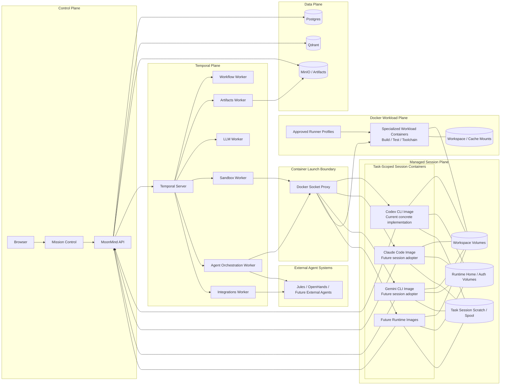

# MoonMind Architecture

**Status:** Desired state
**Audience:** Contributors, operators, runtime authors, and integration authors
**Purpose:** Top-level architectural overview for MoonMind's Temporal-native, task-scoped session-container model

MoonMind is an open-source platform that orchestrates leading AI agents — Codex CLI, Claude Code, Gemini CLI, external agent systems, and future runtimes — while adding resiliency, safety, and observability.

This document describes the **desired-state architecture**.

> **Current maturity note:** The desired architecture is runtime-extensible, but the current concrete task-scoped managed-session implementation is **Codex-first**. `MoonMind.AgentSession` and the live session activities use Codex managed-session contracts today. Claude Code and Gemini CLI are managed-runtime targets and future adopters of this session-plane pattern, not current peer implementations of `MoonMind.AgentSession`.

> **Core rule:** MoonMind keeps **Temporal** as the durable outer orchestrator and treats managed agent runtimes as **task-scoped session containers** launched from independently versioned runtime images. Those images do **not** need to be built from a MoonMind base image. A runtime image is compatible when MoonMind can drive it through a runtime adapter plus a defined control, observability, and artifact contract.

> **Artifact rule:** Artifacts remain **execution-centric**. Task-oriented and session-oriented views are read models and projections over execution-linked artifacts; they do **not** create a second durable source of truth. Task-scoped session containers are continuity caches, not durable truth.

---

## Architecture at a Glance

### Key layers

- **Control Plane** — API plus Mission Control. Starts tasks, resolves runtime intent, serves intervention and observability surfaces, exposes artifact and continuity APIs, and serves MoonMind MCP/context capabilities.
- **Temporal Plane** — Workflows orchestrate. Activities perform side effects. Temporal remains the durable source of truth for task state, retries, timers, schedules, cancellation, signals, updates, and visibility.
- **Agent Orchestration Layer** — MoonMind-owned workflows, workers, adapters, and policies that orchestrate **all** agent execution: managed session runtimes and external delegated agents. This layer does **not** embed Codex CLI, Claude Code, Gemini CLI, or future runtime binaries.
- **Managed Session Plane** — Task-scoped containers launched from runtime-specific images. Each container holds a managed runtime's native session loop, local config, auth state, caches, and session-local working state for the duration of the task or session policy. Codex is the current concrete implementation.
- **Docker Workload Plane** — Separate tool-backed containers for specialized non-agent work, such as build/test/toolchain jobs. These containers are not managed sessions and are not `MoonMind.AgentRun` executions unless the launched workload is itself a true agent runtime.
- **Data Plane** — Postgres for durable metadata and read models, MinIO for artifacts and observability blobs, and Qdrant for retrieval and memory systems.

---

## Design Principles

### 1. Temporal remains the outer orchestrator

MoonMind uses Temporal as the durable orchestration backbone.

Temporal owns:

- task lifecycle
- workflow history
- step ordering
- retries and timers
- cancellation propagation
- signals and updates
- workflow visibility and operator state

Managed runtimes do **not** replace Temporal orchestration. They run **inside** a Temporal-owned execution envelope.

### 2. The Agent Orchestration Layer spans managed and external agents

MoonMind uses one orchestration model for two execution classes:

- **managed session runtimes** — launched and supervised by MoonMind in the Managed Session Plane
- **external delegated agents** — launched or delegated through external-provider adapters

This shared orchestration layer owns canonical contracts, policy enforcement, lifecycle translation, and operator-facing control semantics across both classes.

### 3. Managed runtimes are session containers, not worker-embedded CLIs

MoonMind does not treat Codex CLI, Claude Code, Gemini CLI, and future managed runtimes as binaries that must be bundled into MoonMind worker images.

Instead:

- each managed runtime runs in its own **runtime image**
- MoonMind launches those images on demand as **task-scoped session containers**
- MoonMind service and worker images remain generic and lightweight

Today, Codex CLI is the concrete managed-session implementation. Claude Code and Gemini CLI should converge on this pattern when their session-backed adapters exist, but docs and code should not present them as already equivalent `MoonMind.AgentSession` implementations.

### 4. Runtime compatibility is adapter-defined, not image-base-defined

A runtime image does **not** need to be built specifically for MoonMind.

A runtime image is **MoonMind-compatible** when MoonMind has a runtime adapter that can:

- launch or attach to the runtime session
- send work into the session
- issue control actions such as clear, cancel, interrupt, approve, or operator message
- observe logs and lifecycle transitions
- collect outputs, diagnostics, checkpoints, and artifacts
- translate runtime behavior into MoonMind's canonical contracts

Compatibility is defined at the **adapter boundary**, not by requiring a MoonMind-specific base image.

### 5. One task may span multiple steps over one managed session

MoonMind treats a step as an **objective boundary**, not necessarily a fresh process boundary.

A managed runtime session may be:

- created for one task and reused across multiple steps
- reset or cleared between steps by policy or intervention
- snapshotted or discarded when stronger isolation is required

### 6. Artifacts are authoritative, execution-centric evidence

Large inputs and outputs do not live in workflow history.

MoonMind stores artifacts for things such as:

- instruction bundles
- context bundles
- stdout
- stderr
- diagnostics
- patches and generated files
- session summaries and step checkpoints
- session control events and reset boundaries
- provider snapshots and result bundles

Artifacts remain durably attached to an execution identified by `(namespace, workflow_id, run_id)`. Task and session views are projections over those execution-linked artifacts.

### 7. Session containers are continuity caches, not durable truth

Task-scoped session containers may keep native runtime-local state for efficiency and continuity, including local config, caches, auth state, and session memory.

MoonMind remains authoritative for:

- task status
- plan and step state
- canonical control intent
- artifact refs and evidence
- observability metadata
- provider-profile and policy enforcement
- auditability of resets, approvals, and interventions

Any state needed for recovery, audit, presentation, rerun, or operator understanding must be materialized as artifacts or bounded workflow metadata.

### 8. Step boundaries remain first-class even when one session spans many steps

Session reuse must not collapse multiple plan steps into one undifferentiated blob.

Each meaningful step should still produce step-scoped durable evidence, including the appropriate mix of:

- input artifacts
- output artifacts
- runtime stdout/stderr/diagnostics
- session continuity artifacts

### 9. Session resets create explicit epoch boundaries

`/clear`, hard reset, recovery rebuild, or equivalent intervention starts a new logical continuity interval.

MoonMind must represent those boundaries durably through:

- session epoch metadata
- reset or control-event artifacts
- session projections that preserve epoch boundaries

### 10. Observation and control are separate

Logging is not intervention.

MoonMind separates:

- **observation plane** — stdout/stderr capture, diagnostics, live follow, and task/session observability
- **control plane** — pause, resume, cancel, approve, reject, operator message, clear/reset, and other runtime actions

---

## Control Plane

### API Service

The API service is MoonMind's top-level control plane.

It should provide:

- task and execution lifecycle APIs
- task-oriented Mission Control routes
- artifact APIs
- session-continuity and artifact-projection APIs
- task/session observability APIs
- human-in-the-loop and intervention APIs
- skill resolution and context assembly
- task proposal handling
- runtime/profile/session-policy selection and validation
- MoonMind MCP/context surfaces for compatible runtimes and external agents

The API is the stable boundary between operators, clients, and the Temporal-backed orchestration system.

### Mission Control

Mission Control is the operator UI.

It should provide:

- task list and detail views
- step-level status and artifacts
- a first-class **Execution Artifacts** surface
- a first-class **Session Continuity** surface for task-scoped managed sessions
- managed-runtime observability views backed by MoonMind APIs and artifacts
- runtime intervention controls
- task submission with runtime/profile/session-policy selection
- proposal review and promotion
- task rerun, resume, and approval flows

> **Vocabulary rule:** The UI uses **task** as the primary user-facing term. Workflow and child workflow terminology is reserved for architecture, debugging, and implementation docs.

---

## Execution Model

### Temporal Foundation

Temporal is MoonMind's primary durable execution engine.

MoonMind uses:

- **Workflows** for orchestration
- **Activities** for side effects
- **Timers** for bounded waiting
- **Signals / Updates** for intervention and callback handling
- **Schedules** for recurring or deferred starts
- **Visibility** as the list/query/count source of truth for task dashboards

### Workflow Types

MoonMind keeps a small workflow catalog.

| Workflow | Purpose |
|---|---|
| `MoonMind.Run` | Root workflow for one task. Owns the task envelope, plan execution, step ordering, task-level cancellation, and final task summary. |
| `MoonMind.AgentSession` | Task-scoped child workflow that owns one managed runtime session container, including launch, reuse, clear/reset, epoch changes, reconciliation, and final teardown. |
| `MoonMind.AgentRun` | Step-scoped child workflow for one true agent execution step. For managed runtimes it attaches to or requests an `AgentSession`; for external agents it owns delegated execution lifecycle directly. |
| `MoonMind.ManagedSessionReconcile` | Bounded support workflow that reconciles managed-session supervision records and container state. |
| `MoonMind.ProviderProfileManager` | Owns slot acquisition, release, cooldown, and policy coordination for provider profiles. |
| `MoonMind.OAuthSession` | Owns interactive OAuth/browser auth flows where required by managed runtimes. |
| `MoonMind.ManifestIngest` | Owns manifest-driven ingestion and related background graph compilation flows. |

### Managed execution shape

For managed session runtimes, the desired execution shape is:

1. `MoonMind.Run` determines that a plan step targets a managed runtime.
2. `MoonMind.Run` ensures the required `MoonMind.AgentSession` exists for that task/runtime/profile combination.
3. `MoonMind.AgentRun` sends the step objective into that session through the runtime adapter.
4. The session container continues running across steps unless policy requires reset, new epoch, or teardown.
5. Outputs, logs, diagnostics, and continuity artifacts are persisted and surfaced through canonical contracts and read models.

Current implementation scope: Codex is the live task-scoped session plane. The `MoonMind.AgentSession` workflow and session activities currently carry Codex-specific request/response contracts behind the activity boundary. A runtime-neutral `ManagedSession*` contract should be extracted when a second managed-session runtime becomes real; until then, the top-level architecture remains the extensible target and the Codex session doc remains the concrete implementation slice.

### External execution shape

For external agents:

1. `MoonMind.Run` starts `MoonMind.AgentRun` for the delegated execution step.
2. `MoonMind.AgentRun` uses an external-agent adapter to start, track, and finalize the remote run.
3. MoonMind persists canonical result artifacts and observability evidence just as it does for managed runs, even though it does not own the remote runtime envelope.

### Specialized workload shape

For non-agent Docker workloads:

1. A plan step or session-assisted step invokes an executable tool, normally `tool.type = "skill"`.
2. MoonMind resolves the tool and routes it to a Docker-capable worker fleet.
3. The worker launches an approved workload container through the controlled Docker boundary.
4. The workload writes outputs under approved workspace/artifact paths.
5. MoonMind returns a normal tool result and durable artifacts to the producing step.

These workload containers are a sibling plane to managed sessions. They do not own `session_id`, `session_epoch`, `thread_id`, or `active_turn_id`, and they do not become `MoonMind.AgentRun` child workflows unless the launched workload is itself a true managed or external agent runtime.

### Temporal-to-runtime control mapping

Temporal remains the source of truth for control intent.

The mapping is:

- **Temporal Signal / Update** expresses task-, session-, or step-level control intent
- `MoonMind.Run` or `MoonMind.AgentRun` routes that intent to `MoonMind.AgentSession` or an external-agent adapter
- `MoonMind.AgentSession` invokes canonical control actions through `mm.activity.agent_runtime`
- the managed runtime adapter translates those actions into the runtime image's native control surface

Current session-control vocabulary is intentionally split into three layers:

| Operator intent | Canonical MoonMind session verb | Current activity / Codex transport |
|---|---|---|
| Start or recover a task-scoped session | `start_session` / `resume_session` | `agent_runtime.launch_session` / `agent_runtime.session_status`, backed by the Codex managed-session controller and Codex App Server |
| Send the next objective or operator message | `send_turn` | `agent_runtime.send_turn`, backed by a Codex App Server turn |
| Steer an active turn | `steer_turn` | `agent_runtime.steer_turn`, backed by Codex turn steering |
| Interrupt an active turn | `interrupt_turn` | `agent_runtime.interrupt_turn`, backed by Codex turn interruption |
| Clear context and begin a new continuity epoch | `clear_session` | `agent_runtime.clear_session`, which writes control/reset artifacts, increments `session_epoch`, and starts a new Codex thread |
| Cancel or tear down the session | `cancel_session` / `terminate_session` | `agent_runtime.interrupt_turn` for active-turn cancellation and `agent_runtime.terminate_session` for session teardown |
| Fetch session state or continuity summary | `fetch_status` / `fetch_result` | `agent_runtime.session_status` / `agent_runtime.fetch_session_summary` |
| Approve or reject a runtime request | `approve` / `reject` | Adapter-specific approval transport when supported; no generic approval activity is currently in the live session catalog |

Runtime images do **not** need to understand Temporal directly. They only need to be controllable through an adapter that honors MoonMind's canonical actions.

---

## Tool and Plan Model

MoonMind's execution model remains plan-driven.

### Core concepts

- **Tool** — a named capability with input/output schemas, policies, and an execution binding
- **Plan** — a DAG of steps with dependencies, concurrency policy, and failure handling
- **Artifact** — large data stored outside workflow history and referenced by `ArtifactRef`
- **Resolved Skill Context** — immutable task- or step-specific skill snapshots resolved before execution
- **Session Policy** — a managed-runtime execution hint describing whether a step should reuse, reset, isolate, or recreate a managed session

### Tool subtypes

- **`skill`** — executed as a Temporal activity
- **`agent_runtime`** — executed through `MoonMind.AgentRun`, optionally backed by a persistent `MoonMind.AgentSession`

Docker-backed specialized workloads use the tool path by default. A build/test/toolchain container may run on the same Docker-capable fleet used by managed-runtime supervision, but its product contract remains a tool result plus artifacts, not managed-session identity.

Plans remain **data, not code**.

---

## Worker Fleet

MoonMind workers remain grouped by capability and security boundary, not by runtime brand.

| Fleet | Task Queue | Role |
|---|---|---|
| **Workflow** | `mm.workflow` | Deterministic workflow orchestration only. No side effects. |
| **Artifacts** | `mm.activity.artifacts` | Artifact create/read/write/finalize/list/retention lifecycle. |
| **LLM** | `mm.activity.llm` | Ordinary model calls used for planning, evaluation, summarization, and non-runtime inference. |
| **Sandbox** | `mm.activity.sandbox` | Shell commands, repo preparation, ordinary tool execution, and non-runtime containerized build/test work. |
| **Agent Orchestration** | `mm.activity.agent_runtime` | Managed-session launch, session supervision, external-agent contract translation, status reads, control actions, result collection, observability publication, and cleanup. |
| **Integrations** | `mm.activity.integrations` | External provider callbacks, webhooks, and other non-runtime integration activities. |

### Worker image rule

MoonMind worker images should stay **generic and lightweight**.

They should **not** embed:

- Codex CLI
- Claude Code
- Gemini CLI
- future managed runtime binaries

Those binaries belong in runtime-specific session images.

---

## Agent Orchestration Layer

The Agent Orchestration Layer is the MoonMind-owned execution layer for all agent work.

It includes:

- `MoonMind.Run`, `MoonMind.AgentRun`, `MoonMind.AgentSession`, and `MoonMind.ManagedSessionReconcile`
- managed and external agent adapters
- launcher and supervisor components
- provider-profile coordination
- artifact publication and observability hooks
- policy enforcement for isolation, reuse, and concurrency

### Desired managed-runtime components

- **ManagedAgentAdapter** — translates MoonMind contracts into runtime-specific launch and control operations
- **ManagedRuntimeLauncher** — starts detached managed session containers from runtime images
- **ManagedSessionSupervisor** — owns lifecycle tracking, reconciliation, control dispatch, log capture, and authoritative status
- **ManagedRunStore / Session Store** — persists session metadata, run metadata, refs, epoch metadata, and observability state
- **ProviderProfile Binding** — applies auth/home volumes, slot rules, cooldowns, and runtime policy
- **Artifact Publisher** — persists stdout, stderr, diagnostics, outputs, session summaries, step checkpoints, and control-event artifacts

### Adapter rule

Workflow code should consume **canonical MoonMind contracts only**.

Runtime-specific state, transport details, and response shapes belong inside:

- adapters
- launcher/supervisor layers
- activity handlers

not inside workflows.

---

## Managed Session Plane

### Managed session runtimes

MoonMind supports a class of managed runtimes that are launched as task-scoped session containers.

Examples:

| Runtime | Runtime Image | Notes |
|---|---|---|
| Codex CLI | runtime-specific image | Current concrete task-scoped managed-session implementation. Holds native Codex session state, config, auth, and workspace bindings. |
| Claude Code | runtime-specific image | Future session-plane adopter. Do not describe it as a peer `MoonMind.AgentSession` implementation until the adapter and contracts exist. |
| Gemini CLI | runtime-specific image | Future session-plane adopter. Do not describe it as a peer `MoonMind.AgentSession` implementation until the adapter and contracts exist. |
| Future Runtime | runtime-specific image | Any runtime image that satisfies the MoonMind compatibility contract through an adapter. |

MoonMind owns:

- the container lifecycle
- mounts and policy shaping
- task/session routing
- cancellation
- artifact and observability collection
- control-action translation
- provider-profile enforcement

MoonMind does **not** own the runtime's internal reasoning loop.

### Session scope

The default managed-runtime unit is a **task-scoped session**.

A session may span:

- one step
- many ordered steps
- one runtime/profile binding inside a task
- one branch of a task where stronger isolation is required

A task may own:

- one managed session
- several managed sessions for different runtimes
- several managed sessions for the same runtime when isolation policy requires it

### Session container mounts

The desired-state session container shape includes:

- a **workspace mount** containing the checked-out repo and per-task workspace data
- a **runtime home/auth mount** containing runtime-local config and provider-profile state where policy allows persistence
- a **task session scratch / spool area** for transient session data and live-log transport
- optional access to MoonMind APIs for context, MCP tools, artifacts, and observability

### Session lifecycle actions

MoonMind treats the following as first-class canonical control actions:

- `start_session`
- `resume_session`
- `send_turn`
- `steer_turn`
- `interrupt_turn`
- `clear_session`
- `cancel_session`
- `terminate_session`
- `approve`
- `reject`
- `snapshot_session`
- `fetch_status`
- `fetch_result`

The exact transport is adapter-specific. The contract is MoonMind-specific and canonical. The current Codex implementation maps these verbs to the `agent_runtime.*_session` and turn activities listed in the Temporal activity catalog.

### Session continuity rule

A managed session may be long-lived, but no user-important continuity should exist **only** inside that container.

The normal durable continuity surface is artifact-based and includes a suitable mix of:

- `session.summary`
- `session.step_checkpoint`
- `session.control_event`
- `session.reset_boundary`
- optional `session.transcript`
- optional `session.recovery_bundle`

Those continuity artifacts remain execution-linked even when a session spans multiple steps.

---

## Docker Workload Plane

Specialized Docker workloads are sibling execution resources, not managed sessions.

Use this plane for bounded non-agent work such as:

- Unreal or Unity build/test jobs
- SDK-specific compile or test images
- GPU- or driver-constrained validation
- short-lived helper services that support a bounded step

Default routing:

1. The plan or session-assisted step invokes an executable tool, normally `tool.type = "skill"`.
2. The tool resolves to a curated runner profile or equivalent approved workload definition.
3. A Docker-capable worker launches the workload container through the Docker proxy.
4. Outputs are captured as tool results and artifacts attached to the producing execution step.

Identity rules:

- workload containers are not `MoonMind.AgentSession`
- workload containers are not `MoonMind.AgentRun` unless they are themselves true agent runtimes
- workload artifacts are step outputs, not session-continuity artifacts by default
- optional `session_id` and `session_epoch` fields are association metadata only

The detailed workload-container contract lives in [`docs/ManagedAgents/DockerOutOfDocker.md`](./ManagedAgents/DockerOutOfDocker.md).

---

## Runtime Image Compatibility Contract

A runtime image is compatible with MoonMind when all of the following are true.

### Required compatibility properties

1. **Launchable**
   - MoonMind can start the image as a detached container with the required workspace and profile mounts.

2. **Controllable**
   - MoonMind has a runtime adapter that can drive the image through one of:
     - native runtime protocol
     - CLI/PTY bridge
     - stdin/stdout control loop
     - image-specific IPC or control surface

3. **Observable**
   - MoonMind can capture stdout/stderr, determine lifecycle transitions, and correlate the session to task and step execution.

4. **Recoverable**
   - MoonMind can reattach, reconcile, or classify the session after worker restart or container interruption.

5. **Artifact-compatible**
   - MoonMind can collect outputs, diagnostics, checkpoints, and continuity artifacts without placing large payloads into workflow history.

6. **Policy-compatible**
   - The image can run within MoonMind's allowed resource, network, volume, registry, and secret policies.

### Non-requirements

A compatible runtime image does **not** need to:

- be built from a MoonMind Dockerfile
- contain MoonMind code
- expose Temporal semantics directly
- implement MoonMind APIs internally

MoonMind bridges the image into its orchestration model through the runtime adapter and session supervisor.

---

## Artifact System, Session Continuity, and Observability

### Artifact authority

MoonMind remains artifact-first.

Large data should live in artifacts or artifact-backed blobs rather than workflow history, including:

- prompts and instruction bundles
- skill snapshots and runtime-delivery bundles
- runtime stdout/stderr/merged logs
- diagnostics
- patches and generated files
- provider snapshots
- session summaries, checkpoints, reset boundaries, and control events

### Execution-centric linkage

Artifacts remain durably linked to a concrete execution identified by `(namespace, workflow_id, run_id)`.

Task-oriented, step-oriented, and session-oriented views are server-produced projections over that execution-linked evidence. They are read models, not a second durable artifact identity model.

### Session continuity artifacts

When task-scoped managed sessions are used, MoonMind should write continuity artifacts that let operators and UIs understand what happened without depending on in-container state.

The preferred continuity surface is:

- latest session summary
- latest step checkpoint
- latest control event
- explicit reset boundary / epoch changes
- optional session transcript for richer debugging

### Session projections and read models

MoonMind should provide first-class session-aware read models for UI/API consumption.

These read models group execution-linked artifacts by:

- `session_id`
- optional `session_epoch`
- step or turn context when available

The goal is to support a first-class **Session Continuity** UI while preserving source execution evidence on every artifact.

### Observability remains artifact-first

Managed-run observability should remain MoonMind-owned and artifact-first.

The authoritative durable outputs for a managed execution should include:

- stdout artifact
- stderr artifact
- diagnostics artifact
- appropriate output artifacts
- continuity artifacts when the run participated in a long-lived managed session

Live follow, merged tails, and stream updates are optional and secondary.

### Control and observability separation

Managed runtime log viewing should not depend on embedding the runtime terminal as the primary observability surface.

Operators should be able to:

- inspect logs and diagnostics
- inspect execution artifacts
- inspect session continuity
- approve or reject
- send operator messages
- pause, resume, cancel, or clear/reset

without requiring terminal attachment.

---

## Provider Profiles, Auth, and Safety

Managed session containers must run under explicit provider-profile policy.

### Provider profiles

A provider profile binds:

- runtime family
- auth/home volume
- provider or account identity
- parallelism policy
- cooldown policy
- environment shaping rules
- allowed runtime image / launch policy

### Safety rules

- raw credentials never appear in workflow history
- runtime images are launched through a controlled container-execution boundary
- image allowlists and registry restrictions may apply
- resource and network limits are enforceable per runtime image
- session containers must support cleanup, TTL, and orphan reconciliation
- session reuse policy must be explicit to avoid accidental state bleed
- artifact/session metadata must remain bounded and safe for control-plane display

### Isolation model

MoonMind should separate:

- **generic worker image**
- **runtime image**
- **task workspace**
- **runtime home/auth volume**
- **task session scratch / spool area**

This keeps MoonMind small, makes runtime upgrades independent, and allows stricter policy control over what persists.

---

## Memory, Context, and MCP

MoonMind keeps system-owned memory and context assembly separate from runtime-local session memory.

### MoonMind-owned memory

MoonMind assembles context packs from:

- planning state
- task history
- long-term memory
- document retrieval
- skill snapshots
- task or step attachments

### Runtime-local memory

Managed session containers may also keep runtime-native local memory and session context.

That is allowed, but it is not the system of record.

### MCP and context surfaces

MoonMind should expose HTTP MCP/context and related APIs so managed session containers and external agents can consume MoonMind capabilities without requiring direct in-process integration.

This is a key enabler for running pre-existing runtime images that were not built specifically for MoonMind.

---

## Data Layer

### PostgreSQL

Postgres remains the durable metadata store for:

- API state
- task/session metadata
- task/run and session read models
- Temporal persistence and visibility
- identity and auth-related application state where configured

### MinIO

MinIO remains the S3-compatible store for:

- workflow artifacts
- runtime stdout/stderr
- diagnostics
- output bundles
- continuity artifacts and transcripts
- generated files

### Qdrant

Qdrant remains the vector store for:

- retrieval
- document RAG
- task history and memory indexing
- future runtime/session retrieval features

---

## Desired Runtime Evolution Model

MoonMind should make it easy to add new runtimes without rebuilding the core system.

### Adding a new managed runtime should require

1. a runtime image
2. a runtime adapter
3. a provider-profile and policy definition
4. a session-launch profile
5. observability and artifact mapping into canonical MoonMind contracts

### Adding a new managed runtime should not require

- rebuilding the main MoonMind worker image to include the runtime binary
- inventing a new workflow model
- duplicating artifact or observability systems
- teaching the root workflow runtime-specific payload shapes

This keeps MoonMind extensible while preserving a single orchestration model.

---

## Summary

MoonMind's desired-state architecture is:

- **Temporal-native**
- **artifact-first**
- **execution-centric**
- **session-aware**
- **runtime-image-driven**
- **adapter-normalized**
- **observability-rich**
- **safe by policy**
- **extensible to future runtimes**

In this model:

- `MoonMind.Run` remains the root task workflow
- `MoonMind.AgentSession` owns persistent task-scoped managed runtime sessions, with Codex as the current concrete implementation
- `MoonMind.ManagedSessionReconcile` handles bounded managed-session reconciliation work
- `MoonMind.AgentRun` owns one true agent execution step
- the **Agent Orchestration Layer** spans managed and external agents
- the **Managed Session Plane** hosts runtime-specific session containers for managed runtimes
- the **Docker Workload Plane** hosts separate tool-backed workload containers without conflating them with session identity
- managed runtimes run as independently versioned containers from runtime-specific images
- MoonMind workers stay lightweight and generic
- runtime compatibility is defined by adapters and control, observability, and artifact contracts rather than MoonMind-specific base images
- session continuity is presented through artifact-backed projections rather than container-local state

That is the architecture that supports Codex CLI today, gives Claude Code and Gemini CLI a clear future session-adoption path, and keeps external agents and specialized workload containers from being collapsed into one misleading runtime category.

---

## Related Architecture Docs

This top-level document is complemented by deeper architecture docs for specific subsystems:

- `docs/Temporal/ManagedAndExternalAgentExecutionModel.md`
- `docs/Temporal/ArtifactPresentationContract.md`
- `docs/ManagedAgents/LiveLogs.md`
- `docs/ManagedAgents/DockerOutOfDocker.md`
- `docs/Security/ProviderProfiles.md`
- `docs/Tasks/SkillAndPlanContracts.md`
- `docs/ExternalAgents/ExternalAgentIntegrationSystem.md`
- `docs/Memory/MemoryArchitecture.md`
- `docs/Temporal/TemporalArchitecture.md`
