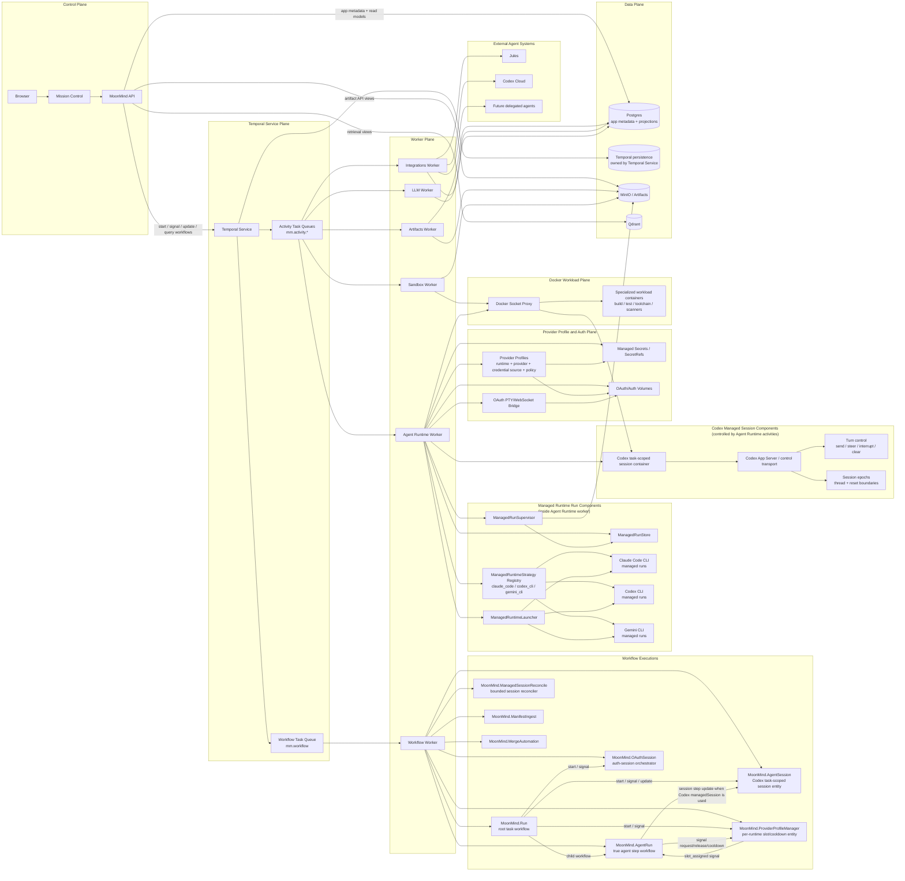

# MoonMind Architecture

**Status:** Current architecture and near-term direction
**Updated:** 2026-05-06
**Audience:** Contributors, operators, runtime authors, integration authors, and Mission Control developers
**Purpose:** Top-level architecture for MoonMind's Temporal-native agent orchestration model, including managed runtime runs, Codex managed sessions, Claude Code workflows, external agents, artifacts, provider profiles, and workload containers.

MoonMind is an open-source platform for orchestrating leading AI coding agents and automation systems while adding resiliency, safety, context delivery, provider-profile routing, and artifact-first observability.

MoonMind currently has two concrete managed-runtime centers of gravity:

1. **Codex CLI** — a working managed runtime path and the current concrete task-scoped managed-session implementation.
2. **Claude Code** — a working managed runtime path for many workflows, backed by runtime strategies, provider-profile materialization, OAuth/API-key credential flows, context injection, GitHub auth handling, and managed-run supervision.

Codex is therefore no longer the only working path for many workflows. However, one important distinction remains:

> **Current maturity note:** `MoonMind.AgentRun` and the managed-runtime launcher support multiple managed CLI runtimes, including `codex_cli`, `claude_code`, and `gemini_cli`. The `claude` and `codex` aliases are normalized to the canonical managed runtime IDs where needed. `MoonMind.AgentSession`, `managedSession` bindings, and the turn-level session-control catalog are still Codex-specific today. Claude Code is a concrete managed-run runtime, not yet a peer implementation of the Codex task-scoped `MoonMind.AgentSession` plane.

This document describes the current architecture and target direction. It intentionally separates **managed runtime runs** from **managed sessions** so the project can accurately describe the current Claude Code path without overstating Claude session parity.

> **Core rule:** Temporal remains MoonMind's durable outer orchestrator. Workflows are deterministic and side-effect-free. Managed runtimes, external agents, OAuth runners, Docker workloads, database writes, artifact writes, network calls, CLI invocation, and process supervision happen in Activities or external integration boundaries, never directly inside workflow code.

> **Artifact rule:** Artifacts remain execution-centric evidence. Task-, step-, run-, and session-oriented UI views are projections over execution-linked artifacts and compact metadata; they do not create a second durable source of truth.

> **Repository-alignment note:** This revision is aligned with the current MoonMind repository shape: `MoonMind.AgentRun`, `MoonMind.AgentSession`, `MoonMind.ProviderProfileManager`, `MoonMind.OAuthSession`, `MoonMind.ManagedSessionReconcile`, `MoonMind.ManifestIngest`, and `MoonMind.MergeAutomation` are workflow types registered by the workflow fleet; managed runtime launch/supervision/session control run through activity fleets and runtime components under `moonmind/workflows/temporal/runtime/`.

---

## Architecture at a Glance

The diagram below is intentionally explicit about the Temporal execution model: the Temporal Service stores and dispatches workflow/activity tasks, Workers poll task queues, workflow code schedules Activities or sends workflow messages, and only Activity Workers interact with infrastructure.

Diagram rules:

- Workflows never talk directly to workers, containers, PTYs, MinIO, Postgres, Qdrant, Docker, CLIs, or provider APIs.
- Workflows schedule Activities on routed task queues, send Signals/Updates to other Workflows, create child Workflows, wait on durable timers, and update compact visibility metadata.
- The Managed Runtime Run Plane and Codex Managed Session components are not independent workflow peers. They are implementation components of Agent Runtime activities.
- The API may write app metadata and read-model data directly when serving ordinary product flows, but workflow-owned lifecycle transitions must be driven through Temporal or idempotent projection activities.

---

## Current Runtime Maturity Matrix

| Runtime / integration | Current role | Current maturity | Architecture note |
|---|---|---|---|
| `codex_cli` | Managed CLI runtime and task-scoped managed-session runtime | Concrete working managed-run path and current concrete `MoonMind.AgentSession` implementation | Codex owns the live session-plane contracts today: session container, turn control, `session_epoch`, thread boundaries, clear/reset artifacts, and Codex App Server transport. |
| `claude_code` | Managed CLI runtime | Concrete working managed-run path | Claude Code has a concrete launch strategy, provider-profile materialization, OAuth/API-key paths, MiniMax/Anthropic-compatible profile support, context injection, GitHub auth handling, and runtime-specific launch hardening. It is not yet a peer Codex-style `MoonMind.AgentSession` runtime. |
| `gemini_cli` | Managed CLI runtime | Registered managed-runtime strategy and supported architecture target | Gemini participates in the same strategy/launcher/profile model, but this document's current focus is Codex CLI and Claude Code. |
| Jules | External delegated agent | Concrete external-agent path | Delegated through integration adapters and canonical `AgentRun` contracts. |
| Codex Cloud | External delegated agent | Concrete external-agent path | Coordinated through integration activities and canonical result/status contracts. |
| Specialized Docker workloads | Tool-backed workload containers | Concrete sibling plane | Used for build/test/toolchain/security workloads. They are not managed sessions and not true agent runs unless the launched workload is itself an agent runtime. |

---

## Key Layers

### Control Plane

The API service and Mission Control provide the operator boundary. They create tasks, resolve runtime intent, expose provider-profile and auth configuration, serve artifact and observability views, support intervention flows, and expose context/MCP-style surfaces to compatible runtimes.

Control-plane calls that change workflow-owned lifecycle state should use Temporal Start, Signal, Update, Query, or idempotent projection activities rather than mutating lifecycle tables as a competing source of truth.

### Temporal Plane

Temporal is the durable orchestration backbone. Workflows own orchestration state; Activities perform side effects. Temporal remains authoritative for task lifecycle, retries, timers, cancellation, signals, updates, child-workflow relationships, schedules, workflow history, and workflow visibility.

The Temporal Service does not execute MoonMind application code. Workflow and Activity Workers poll task queues and execute the registered workflow/activity handlers.

### Agent Orchestration Layer

The Agent Orchestration Layer spans all true agent execution:

- managed runtime runs launched and supervised by MoonMind
- Codex task-scoped managed sessions
- delegated external agents such as Jules and Codex Cloud

The layer owns canonical contracts, provider-profile coordination, runtime dispatch, artifact publication, policy enforcement, failure classification, and operator-facing lifecycle semantics.

### Managed Runtime Run Plane

The Managed Runtime Run Plane is the current general managed-runtime implementation path. It is strategy-driven and supports `claude_code`, `codex_cli`, and `gemini_cli` as runtime IDs.

A managed run is normally a step-scoped execution of one CLI runtime under `MoonMind.AgentRun`. It is launched and supervised by Agent Runtime activities, writes logs and diagnostics to artifacts, updates a local/shared managed-run ledger, and returns canonical `AgentRunStatus` and `AgentRunResult` contracts containing compact metadata and artifact references.

Claude Code lives here today as a concrete managed runtime.

### Codex Managed Session Plane

The Codex Managed Session Plane is a stateful, Codex-specific path. It uses `MoonMind.AgentSession` as a Temporal entity workflow for task-scoped session orchestration and compact session metadata. The workflow does not hold a container or socket connection directly. It schedules Agent Runtime activities that launch/resume/control the Codex session container and publish session artifacts.

**Codex App Server** means the MoonMind-launched control surface inside or beside the Codex managed-session container. It is not a Temporal component and is not directly contacted by workflow code. It is reached only by session-control activities such as `agent_runtime.send_turn`, `agent_runtime.steer_turn`, `agent_runtime.interrupt_turn`, `agent_runtime.clear_session`, and `agent_runtime.terminate_session`.

This plane is currently Codex-specific. Future work may extract runtime-neutral managed-session contracts after a second session runtime is implemented.

### Provider Profile and Auth Plane

Provider Profiles bind runtime, upstream provider, credential source, materialization mode, model defaults, environment/file shaping, slot policy, cooldown policy, and routing metadata.

This layer is central to both Codex and Claude Code. It makes `claude_code + anthropic OAuth`, `claude_code + anthropic API key`, `claude_code + MiniMax`, `codex_cli + OpenAI`, and future combinations first-class execution targets without putting secrets or provider-specific branches into workflow code.

Provider Profiles remain a single execution-target abstraction in this architecture. They may internally reference secret, OAuth-volume, runtime, and policy subdocuments, but the top-level execution contract remains Provider Profile because that is the current repository model and the routing/lease manager operates at profile granularity.

### External Agent Systems

External agents are delegated integrations. MoonMind does not own their runtime envelope but still owns orchestration, status normalization, artifacts, observability evidence, cancellation semantics where supported, and operator presentation.

External agents may complete through polling activities, provider callbacks, or both. Callback handlers should route by stable workflow/task/run identifiers and signal or update the waiting `MoonMind.AgentRun`; polling remains a fallback for providers that do not support callbacks.

### Docker Workload Plane

Specialized workload containers are sibling execution resources for bounded non-agent work. They are routed through approved tools and Docker policies, not through managed session identity.

### Data Plane

Postgres stores app metadata, provider profiles, managed-secret metadata/refs, OAuth session rows, projections, and read models. Temporal persistence and visibility tables are owned by the Temporal Service and should not be used by application code as an integration API. MinIO stores artifacts and observability blobs. Qdrant stores retrieval and memory vectors.

---

## Design Principles

### 1. Workflows are deterministic and side-effect-free

Workflow code may orchestrate, branch on deterministic workflow state, await Signals/Updates, execute Activities, start child Workflows, wait on timers, upsert visibility metadata, and return compact results.

Workflow code must not directly:

- read or write files
- open network connections
- hold PTYs/WebSockets
- launch or supervise OS processes
- call Docker
- call provider APIs
- read environment variables dynamically during replay
- write application databases or artifact stores
- resolve raw secrets

Any code that must do those things belongs in an Activity, external service, or integration callback boundary.

### 2. Temporal remains the outer orchestrator

Managed runtimes do not replace Temporal orchestration. They run inside a Temporal-owned envelope.

Temporal owns:

- task lifecycle
- workflow history
- step ordering
- retries and timers
- cancellation propagation
- Signals and Updates
- workflow visibility and operator state
- durable waiting while providers, operators, subprocesses, or sessions are unavailable

Managed runtime processes, containers, external jobs, OAuth runners, and workload containers are all side-effecting execution resources driven from Activities or integration boundaries.

### 3. Distinguish managed runs from managed sessions

A **managed run** is an asynchronously supervised CLI runtime execution. Claude Code and Codex CLI both work on this path today.

A **managed session** is a longer-lived task-scoped runtime container with explicit session identity, turn control, continuity epochs, and clear/reset semantics. Codex is the current concrete implementation of this path.

The top-level architecture must not collapse these together.

### 4. `MoonMind.AgentRun` is the shared true-agent execution workflow

`MoonMind.AgentRun` is the durable child workflow for one true agent execution step, regardless of whether the runtime is managed, session-backed, or external.

It exists as a child workflow not merely for code organization, but to isolate step-level lifecycle, status, cancellation, retries, provider-profile lease release, failure classification, result normalization, and event history from the root `MoonMind.Run` workflow.

`MoonMind.AgentRun` owns the canonical `AgentRunStatus` / `AgentRunResult` terminal contract for the step. It does not own runtime-specific launch details, container control, or provider-specific API calls. Those happen behind strategies, adapters, and activities.

### 5. Runtime-specific logic belongs behind strategies and adapters

Managed runtime differences belong in:

- `ManagedRuntimeStrategy`
- `ManagedAgentAdapter`
- `ManagedRuntimeLauncher`
- `ManagedRunSupervisor`
- Provider Profile materialization
- Agent Runtime activity handlers

Workflow code should consume canonical contracts and compact metadata rather than branching on Claude/Codex/Gemini internals.

### 6. Provider Profiles are execution targets, not just auth records

A Provider Profile answers:

> Which runtime should launch, against which provider, using which credential source, materialized in which way, with which model defaults, concurrency, cooldown, and routing policy?

This is broader than legacy auth-profile framing and is required for modern Claude Code and Codex usage.

### 7. Artifacts are authoritative execution evidence

Large inputs and outputs do not belong in workflow history.

MoonMind stores artifacts for:

- instruction bundles
- context packs
- stdout and stderr
- merged logs
- diagnostics
- patches and generated files
- provider result bundles
- session summaries and reset boundaries
- observability events

Task, step, run, and session views are projections over artifacts and compact metadata.

### 8. Session containers are continuity caches, not durable truth

Codex session containers may preserve native runtime state for task continuity, but MoonMind remains authoritative for task status, step state, control intent, artifact refs, provider-profile policy, session epoch, thread boundary metadata, and audit metadata.

Any state required for recovery, audit, presentation, rerun, or operator understanding must be materialized as artifacts or bounded metadata. Session containers can be used to accelerate continuity, but they are not the system of record.

### 9. Step boundaries remain first-class

A managed runtime may run across multiple plan steps or through a task-scoped session, but MoonMind must preserve step-level evidence. Each meaningful step should produce bounded status, logs, outputs, diagnostics, and artifact refs.

Task-scoped sessions must not allow broad repository-level autonomy instructions to blur current step boundaries.

### 10. Observation and control are separate

Logging is not intervention.

MoonMind separates:

- **observation** — stdout/stderr capture, diagnostics, live follow, artifact tails, and session/run observability
- **control** — pause, resume, cancel, approve, reject, operator message, interrupt, clear/reset, terminate

Terminal attachment is not the primary observability model for normal managed runs.

### 11. Long-lived workflows must bound history and preserve replay compatibility

Long-lived entity workflows such as `MoonMind.AgentSession` and `MoonMind.ProviderProfileManager` must use history budgets, `Continue-As-New`, bounded in-memory state, compact payloads, and replay-compatible versioning. Workflow code changes that affect command emission must use Temporal patch/version techniques and/or Worker Versioning until old histories have drained or continued-as-new.

---

## Execution Model

### Workflow Catalog

| Workflow | Purpose |
|---|---|
| `MoonMind.Run` | Root workflow for one task. Owns the task envelope, planning, step ordering, task-level cancellation, step ledger, and final task summary. |
| `MoonMind.AgentRun` | Child workflow for one true agent execution step. Handles managed, session-backed, and external agents through canonical contracts. |
| `MoonMind.AgentSession` | Codex-specific task-scoped session entity workflow. Owns compact session orchestration state, turn routing, session epochs, clear/reset metadata, reconciliation hooks, and teardown orchestration. It schedules activities for container and transport side effects. |
| `MoonMind.ManagedSessionReconcile` | Bounded reconciliation workflow for Codex managed-session records and container state. |
| `MoonMind.ProviderProfileManager` | Per-runtime workflow that owns provider-profile slot acquisition, release, cooldown, assignment, lease safety nets, and queue draining. |
| `MoonMind.OAuthSession` | Interactive auth-session workflow. Orchestrates volume provisioning, auth-runner lifecycle, finalize/cancel/fail signals, verification, profile registration, and cleanup. It does not hold PTY/WebSocket connections directly. |
| `MoonMind.ManifestIngest` | Manifest-driven ingestion and background graph compilation flows. |
| `MoonMind.MergeAutomation` | Merge-readiness and post-merge automation workflow for repository/Jira integration flows. |

### Managed run shape

For Claude Code, Codex CLI, Gemini CLI, and future managed CLI runtimes:

1. `MoonMind.Run` reaches a plan step that targets a true managed agent runtime.
2. `MoonMind.Run` starts `MoonMind.AgentRun` as a child workflow and passes compact execution intent, workspace intent, instruction/artifact refs, and provider-profile selector metadata.
3. `MoonMind.AgentRun` resolves the canonical runtime ID and synchronizes/queries compact Provider Profile metadata as needed.
4. `MoonMind.AgentRun` requests provider-profile capacity from `MoonMind.ProviderProfileManager` for the runtime family.
5. The Provider Profile Manager selects and leases exactly one compatible Provider Profile, then signals `slot_assigned` back to the `AgentRun` workflow. Current implementation uses Signals for this protocol; a future Update-based wrapper may be added for synchronous admission, but the signal protocol remains the compatibility path for in-flight histories.
6. `MoonMind.AgentRun` starts the managed runtime through routed Agent Runtime activities. The `ManagedAgentAdapter` resolves the assigned Provider Profile details and must not re-request or silently switch the slot.
7. `ManagedRuntimeLauncher` materializes secrets, files, env, workspace, GitHub auth, runtime homes, support scripts, and command args at the launch boundary.
8. The launcher starts the runtime process idempotently by `run_id`. If an active run record already exists for the same `run_id`, launch returns that record rather than spawning a duplicate process.
9. `ManagedRunSupervisor` supervises the process, heartbeats to Temporal, streams logs, classifies exits, handles timeouts, terminates on cancellation/rate-limit/stall conditions when configured, persists diagnostics, and reconciles lost active records on worker startup.
10. `MoonMind.AgentRun` observes completion through routed status/result activities, durable waits, external callbacks where supported, or future async-activity-completion integration. Polling cadence must be bounded and must not place logs or large outputs in workflow history.
11. Final outputs and diagnostics are returned as canonical `AgentRunResult` refs and compact metadata.
12. Provider-profile slots, GitHub brokers, temporary files, process handles, Docker resources, auth runners, and workspace support files are released or reconciled through idempotent cleanup paths.

This is the path where Claude Code is concrete today.

### Codex managed-session shape

For Codex task-scoped sessions:

1. `MoonMind.Run` determines that a step should use the Codex managed-session path.
2. `MoonMind.Run` ensures the task-scoped `MoonMind.AgentSession` exists.
3. `MoonMind.AgentSession` launches or resumes a Codex session container through Agent Runtime activities.
4. Runtime handles such as container ID, thread ID, active turn ID, and session epoch are attached to `MoonMind.AgentSession` through compact Signals or returned activity payloads.
5. A true agent step is still represented through `MoonMind.AgentRun`. For session-backed execution, `AgentRun` delegates the turn to `MoonMind.AgentSession` and records the canonical step-level `AgentRunResult`.
6. `MoonMind.AgentSession` accepts turn-control requests through Workflow Updates when the caller needs validation and a response. Updates call Agent Runtime activities to send, steer, interrupt, clear, terminate, fetch summaries, and publish session artifacts.
7. Codex App Server handles runtime-native turn execution, steering, interruption, clear/reset, and session status inside the session container.
8. Session continuity artifacts, reset boundaries, stdout/stderr, diagnostics, control-event artifacts, and result artifacts are published.
9. Clear/reset creates a new MoonMind session epoch and thread boundary inside the same task-scoped session policy. The epoch is MoonMind domain state and is independent of Temporal `RunId`.

Current session-control vocabulary:

| Canonical verb | Caller transport into workflow | Workflow action | Current activity / transport |
|---|---|---|---|
| `start_session` / `resume_session` | `Run` starts or signals `AgentSession` | Workflow schedules launch/status activities | `agent_runtime.launch_session` / `agent_runtime.session_status` |
| `attach_runtime_handles` | Signal | Attach compact container/thread/turn handles | no direct external I/O |
| `send_turn` | Workflow Update `SendFollowUp` | Validate, serialize with mutation lock, execute turn, publish continuity refs | `agent_runtime.send_turn` |
| `steer_turn` | Workflow Update `SteerTurn` | Validate current epoch and active turn, execute steer, publish continuity refs | `agent_runtime.steer_turn` |
| `interrupt_turn` | Workflow Update `InterruptTurn` | Validate current epoch and active turn, execute interrupt, publish continuity refs | `agent_runtime.interrupt_turn` |
| `clear_session` | Workflow Update `ClearSession` | Validate, execute clear, increment epoch/thread boundary, publish reset artifacts | `agent_runtime.clear_session` |
| `terminate_session` | Workflow Update or terminal-control signal path | Execute runtime terminate and mark workflow terminating | `agent_runtime.terminate_session` |
| `fetch_status` / `fetch_result` | Query for compact status; activities for runtime state | Return bounded status or fetch/publish summary refs | `agent_runtime.session_status` / `agent_runtime.fetch_session_summary` |
| `publish_session_artifacts` | Internal workflow activity call | Publish session summary/checkpoint/control/reset artifacts | `agent_runtime.publish_session_artifacts` |

All operator or AgentRun-initiated control commands must carry a stable request/control ID. `MoonMind.AgentSession` deduplicates bounded request-tracking state and serializes mutating handlers. Fire-and-forget Signals may be retained for compatibility and notifications, but request/response control paths should use Updates with validation.

These contracts are Codex-specific today and should remain labeled as such until a second runtime implements the same session-plane capabilities.

### Worker affinity and session routing

Session-bound work creates a deployment invariant: the worker that executes a session-control activity must be able to reach the session container, session store, workspace volume, and Docker/control endpoint named in the session record.

The current Docker Compose topology runs an Agent Runtime worker with the shared `mm.activity.agent_runtime` queue, shared auth/workspace volumes, and a Docker proxy. That shape can make session-control routing valid when all Agent Runtime activity executions can reach the same Docker host/proxy and shared store.

Any horizontally scaled or multi-host deployment must choose and document one of the following before treating managed sessions as reliable:

1. shared Docker/control plane plus shared `ManagedSessionStore` and workspaces for all Agent Runtime workers polling `mm.activity.agent_runtime`;
2. worker-specific activity task queues such as `mm.activity.agent_runtime.<worker_id>` recorded in the session binding;
3. Temporal Sessions or another explicit worker-affinity mechanism; or
4. a remote session-control service that is reachable from every Agent Runtime worker and owns container affinity internally.

Without one of these guarantees, a later `send_turn`, `interrupt_turn`, `clear_session`, or `terminate_session` activity may land on a worker that cannot reach the live session container.

### External execution shape

For external agents:

1. `MoonMind.Run` starts `MoonMind.AgentRun` for a delegated step.
2. `MoonMind.AgentRun` uses an external adapter activity to start remote work.
3. The adapter normalizes provider state into canonical `AgentRunStatus` and `AgentRunResult` contracts.
4. Completion can arrive by provider callback routed to the waiting workflow, by polling activities, or by both.
5. MoonMind persists tracking metadata, logs, diagnostics, output refs, callbacks, and cancellation evidence.

### Specialized workload shape

For non-agent Docker workloads:

1. A plan step invokes an executable tool, normally `tool.type = "skill"`.
2. MoonMind resolves the tool and runner policy.
3. A Docker-capable worker launches the approved workload container through the controlled Docker boundary.
4. Outputs are captured as tool results and artifacts.

These workload containers do not own `session_id`, `session_epoch`, `thread_id`, or `active_turn_id`, and they do not become `MoonMind.AgentRun` child workflows unless the workload is itself a true agent runtime.

---

## Temporal Correctness Contract

### Activity routing, retries, and timeouts

All activity invocation should go through the canonical activity catalog. The route defines task queue, worker fleet, capability class, start-to-close timeout, schedule-to-close timeout, heartbeat timeout where required, retry policy, and non-retryable error types.

Broad Workflow Retry Policies should not be the default for `MoonMind.Run`, `MoonMind.AgentRun`, or `MoonMind.AgentSession`, especially when a step may mutate a repository or external system. Retries should be explicit at the Activity or step-attempt level and must be workspace-safe and idempotent.

### Idempotency keys

Every side-effecting Activity must be idempotent or guarded by a durable idempotency key. At minimum, the following operations require keys such as `workflow_id`, `agent_run_id`, `run_id`, `session_id`, `session_epoch`, `turn_id`, `request_id`, `activity_id`, or a lease ID:

- provider-profile slot request/release/cooldown
- managed runtime launch
- managed runtime cancellation
- log/artifact publication
- session launch/resume
- session turn submission
- session interrupt/clear/terminate
- OAuth volume creation
- OAuth runner start/stop
- external-agent start/cancel/callback processing
- repository publish/PR operations

### Cancellation and cleanup

Cancellation must propagate in concrete hops:

1. `MoonMind.Run` cancels or terminates the active child workflow or session workflow according to explicit parent/child lifecycle policy.
2. `MoonMind.AgentRun` catches cancellation and requests managed runtime cancellation where a run was started.
3. Agent Runtime activities terminate processes/containers, publish cancellation evidence, and update run/session stores.
4. Provider-profile leases are released idempotently or expire through manager lease TTL/reconciliation.
5. OAuth and session workflows stop auth/session runners on cancel, expiry, failure, or task completion.

Cleanup activities must be safe to retry and should be run in a cancellation-aware cleanup section. Any intentionally abandoned child workflow or external process must have a separate reconciler or TTL cleanup path.

### Long-running Activities and heartbeats

Long-running Activities that supervise processes, containers, Docker operations, external calls, or open interactive runners must heartbeat. Heartbeat payloads should contain compact handles such as `run_id`, `session_id`, `container_id`, or status offsets, never logs or large data.

The supervisor/reconciler path is responsible for recovering from worker death, lost PIDs, missing containers, and stale active records.

### Continue-As-New

Long-lived workflows must monitor history length and server suggestions. Current required candidates include:

- `MoonMind.AgentSession`, especially after many Updates, Signals, artifact publications, or turn-control actions;
- `MoonMind.ProviderProfileManager`, especially after many slot requests, releases, cooldown updates, profile syncs, lease verifications, and timers;
- long-running `MoonMind.Run` workflows with many steps, dependency waits, child workflows, or operator messages;
- `MoonMind.OAuthSession` if future auth ceremonies become multi-stage or high-event.

Continue-As-New inputs must carry only compact durable state: domain IDs, current epoch, active handles, artifact refs, bounded request-tracking entries, cooldown windows, pending request summaries, and lease metadata. They must not carry raw logs, large prompts, or secrets.

### Signals, Updates, and Queries

Use the following rule of thumb:

- **Update** when the caller needs validation, admission control, deduplication, and a response.
- **Signal** for fire-and-forget notification, compatibility paths, or external callbacks that are retried by the sender.
- **Query** for read-only inspection only.

Blocking Update/Signal handlers must be guarded by mutation locks or otherwise designed to avoid interleaving bugs. All externally retried messages must carry application-level idempotency IDs because deduplication across Continue-As-New is a domain concern.

### Versioning and replay compatibility

Workflow code evolves under replay constraints. Changes that add, remove, or reorder Temporal commands must use Temporal patch/version APIs and/or Worker Versioning. Patch IDs are durable history markers and should not be renamed casually. Runtime strategy evolution should be separated from workflow command-structure evolution whenever possible.

### Payload size and sensitivity

Workflow payloads, Search Attributes, Workflow IDs, Memo fields, Signals, Updates, Queries, Activity inputs, and Activity results must contain only compact, non-sensitive metadata. Large data must be represented by artifact refs. Secret values must not traverse the Temporal control plane unless a Temporal Payload Codec / Data Converter encryption layer is explicitly introduced and enabled for that payload class.

---

## Managed Runtime Strategies

MoonMind uses a strategy registry to normalize CLI runtime differences.

A strategy owns runtime-specific behavior such as:

- canonical `runtime_id`
- default command template
- default auth mode
- model and effort argument shaping
- environment shaping
- workspace preparation
- output parsing
- exit classification
- progress probing
- retry classification
- runtime-specific guardrails

Current registered strategy IDs include:

- `claude_code`
- `codex_cli`
- `gemini_cli`

### Claude Code strategy

Claude Code is a real managed-run runtime path today.

The Claude Code strategy is responsible for:

- launching the `claude` CLI
- building non-interactive commands using `-p`
- applying managed workspace edit policy, including dangerous-permission mode only behind explicit runtime policy gates
- applying model selection unless the Provider Profile supplies `ANTHROPIC_MODEL` through environment shaping
- preparing workspace context through shared context injection
- writing `CLAUDE.md` only when it does not already exist and is not a symlink
- respecting Anthropic, MiniMax, Z.AI, and other Anthropic-compatible provider-profile materialization

Claude Code launch has additional runtime hardening because the CLI can reject dangerous-permission mode as root. The launcher may need to drop privileges to the app user and ensure workspace and GitHub auth helpers remain accessible after that boundary.

`--dangerously-skip-permissions` is not merely a strategy default. It must be governed by runtime policy: isolated workspace, non-root user when required, restricted mounts, scoped credentials, Docker policy, log redaction, and operator-visible launch mode.

### Codex CLI strategy

Codex CLI is both a managed-run runtime and the current managed-session runtime.

The Codex CLI strategy is responsible for:

- launching `codex exec` for managed runs
- shaping model flags with `-m`
- applying managed-runtime instruction notes
- adding retrieval/context guidance
- parsing Codex CLI output
- detecting blocker lines
- probing Codex session artifacts for progress
- supporting Codex-specific runtime homes and progress files

The Codex session plane additionally uses Codex-specific session contracts and a Codex App Server transport.

Codex shell-tool behavior may require direct GitHub token environment binding in addition to brokered helpers for nested shell commands. That exception must remain scoped, redacted, and documented because environment inheritance increases leakage risk.

### Gemini CLI strategy

Gemini CLI participates in the same registry and launcher model. It remains part of the runtime-extensible architecture but is not the current focus of this top-level update.

---

## Provider Profiles, Auth, and Runtime Materialization

Provider Profiles are the durable execution-target abstraction for managed runtimes.

A Provider Profile binds:

- runtime ID
- provider ID and label
- credential source
- runtime materialization mode
- default model and model overrides
- secret refs or auth volume refs
- environment templates
- file templates
- home path overrides
- clear-env rules
- command behavior hints
- profile priority
- concurrency slots
- cooldown policy
- max lease duration
- routing metadata

### Credential source classes

Supported credential source classes include:

- `oauth_volume`
- `secret_ref`
- `none`

### Materialization modes

Supported materialization modes include:

- `oauth_home`
- `api_key_env`
- `env_bundle`
- `config_bundle`
- `composite`

### Runtime/provider examples

Claude Code examples:

- `claude_code + anthropic + oauth_volume + oauth_home`
- `claude_code + anthropic + secret_ref + api_key_env`
- `claude_code + minimax + secret_ref + env_bundle`
- `claude_code + zai + secret_ref + env_bundle`

Codex examples:

- `codex_cli + openai + oauth_volume + oauth_home`
- `codex_cli + openai + secret_ref + api_key_env`
- `codex_cli + minimax + secret_ref + composite`

Provider Profiles keep these combinations explicit without requiring workflow-level provider branching.

### Assignment and materialization sequence

Provider Profile capacity and profile identity must be one durable decision.

1. `AgentRun` determines runtime ID plus exact profile or selector constraints.
2. `AgentRun` requests a slot from `ProviderProfileManager` for that runtime family.
3. `ProviderProfileManager` chooses one profile, records/updates the lease, and signals `slot_assigned(profile_id)`.
4. `AgentRun` treats that profile ID as the selected execution target.
5. `ManagedAgentAdapter` resolves the selected profile details through `provider_profile.list` and prepares profile-safe launch metadata.
6. `ManagedRuntimeLauncher` resolves `SecretRefs` only at the launch boundary, materializes the runtime environment, and starts the process.
7. `AgentRun` reports cooldowns and releases the same leased profile ID on terminal outcome, retry transition, or cancellation.

### Materialization pipeline

The launcher should materialize runtime environments in a predictable order:

1. start from a safe base environment
2. apply runtime-global defaults
3. remove or blank `clear_env_keys`
4. resolve `secret_refs` at launch boundary only
5. materialize `file_templates` with safe permissions
6. apply `env_template`
7. apply `home_path_overrides`
8. apply runtime strategy shaping
9. build command
10. launch subprocess or container

Raw secrets never enter workflow history, profile rows, artifacts, or normal logs. Secret values are resolved at launch boundaries and redacted from observable outputs.

If future functionality requires secret-bearing payloads to cross the Temporal boundary, that feature must first introduce a Temporal Payload Codec / Data Converter encryption policy and classify the affected payloads.

---

## OAuth and Browser-Terminal Auth

MoonMind supports browser-terminal OAuth flows for runtime auth homes.

The flow is:

1. Operator starts an OAuth session in Mission Control Settings.
2. API starts `MoonMind.OAuthSession`.
3. `MoonMind.OAuthSession` schedules Agent Runtime activities to ensure the auth volume and start a short-lived auth-runner container.
4. Mission Control attaches to the PTY/WebSocket bridge out-of-band. The workflow stores compact terminal/session metadata but does not hold the PTY/WebSocket connection.
5. The runtime CLI performs its native interactive login.
6. The runtime writes durable auth state into a mounted auth volume.
7. The user/API finalizes, cancels, or fails the auth session by Signal.
8. `MoonMind.OAuthSession` verifies the volume/fingerprint using Agent Runtime activities and registers or updates the Provider Profile through safe metadata activities.
9. The auth-runner is stopped and cleaned up.

Claude Code uses this path for Anthropic OAuth, where the operator opens the Claude login URL externally and pastes the returned token/code into the terminal. API-key auth remains a separate Managed Secrets path.

Codex uses the same OAuth-session infrastructure where appropriate but may have a different user ceremony.

---

## Artifact System and Observability

### Artifact authority

Artifacts are the authoritative evidence layer for large payloads.

Large data belongs in artifacts, including:

- prompts and instruction bundles
- retrieved context packs
- skill snapshots and prompt indexes
- stdout and stderr
- merged logs
- observability event streams
- diagnostics
- generated files and patches
- provider result bundles
- session summaries and reset boundaries

Artifacts should carry content type, retention class, ownership/lineage metadata, size, and checksum or content digest where supported.

### Execution-centric linkage

Artifacts remain linked to concrete executions and are projected into task, step, run, and session views.

Task-oriented and session-oriented views are read models, not alternate artifact authorities.

### Managed run observability

For managed runs, expected metadata includes:

- `stdout_artifact_ref`
- `stderr_artifact_ref`
- `merged_log_artifact_ref`
- `diagnostics_ref`
- `observability_events_ref`
- `last_log_at`
- `last_log_offset`
- live-stream capability/status metadata where available

`AgentRunResult` is the terminal workflow contract. It must contain compact status, summary, failure classification, provider error code where available, and artifact refs. It must not embed large logs, patches, generated files, or secret-bearing output.

Live logs and artifact tails belong to observability APIs and Mission Control views.

### Session observability

For Codex sessions, session-aware projections group execution evidence by:

- `session_id`
- `session_epoch`
- `thread_id`
- turn metadata
- reset boundaries
- latest summary/checkpoint/control/reset artifact refs

The projection exists for operator understanding. The source of truth remains execution-linked artifacts and compact workflow metadata.

### Structured telemetry

Workers should emit structured logs and metrics containing stable non-sensitive identifiers such as workflow ID, activity ID, run ID, task run ID, runtime ID, profile ID, session ID, session epoch, turn ID, and artifact refs. Raw prompts, raw credentials, full logs, and generated file contents should not be emitted as ordinary structured log fields.

OpenTelemetry tracing and Temporal metrics should be used to correlate workflow, activity, process, artifact, and provider boundaries where deployed.

---

## Worker Fleet

MoonMind workers are grouped by capability and security boundary, not by runtime brand.

| Fleet | Task queue | Role |
|---|---|---|
| Workflow | `mm.workflow` | Deterministic workflow orchestration only. No side effects. Registered workflow types include `MoonMind.Run`, `MoonMind.AgentRun`, `MoonMind.AgentSession`, `MoonMind.ProviderProfileManager`, `MoonMind.OAuthSession`, `MoonMind.ManagedSessionReconcile`, `MoonMind.ManifestIngest`, and `MoonMind.MergeAutomation`. |
| Artifacts | `mm.activity.artifacts` | Artifact create/read/write/finalize/list/retention lifecycle, provider-profile metadata activities, OAuth metadata updates, and read-model/projection activities. |
| LLM | `mm.activity.llm` | Ordinary model calls used for planning, evaluation, summarization, and non-runtime inference. |
| Sandbox | `mm.activity.sandbox` | Shell commands, repo preparation, ordinary tool execution, and non-runtime build/test work. |
| Agent Runtime | `mm.activity.agent_runtime` | Managed runtime launch, supervision, status, cancellation, result collection, session control, artifact publication, OAuth runner launch, and cleanup. This fleet is intentionally heavier and more privileged than ordinary workers. |
| Integrations | `mm.activity.integrations` | External provider communication, callbacks, repository publishing, Jira/GitHub integration, and delegated-agent operations. |

Worker images should remain generic where possible, but the Agent Runtime fleet is a deliberate exception: it may need CLI binaries, auth homes, Docker proxy access, runtime workspace volumes, GitHub helper plumbing, and PTY/session support.

Task queue names must be centralized and validated. All workers polling the same task queue must register compatible activity types and have equivalent access to the resources required by those activities. A typo or mismatched task queue can leave work stuck; a resource-incompatible worker can cause session-control or process-supervision failures.

---

## Memory, Context, and Agent Skills

MoonMind owns system-level context assembly and memory retrieval.

Context can include:

- task description
- plan and step state
- repository metadata
- retrieved documents
- long-term memory
- skill snapshots
- runtime-specific instruction guidance
- operator attachments

Managed runtimes may also keep runtime-local context and caches, but those are not durable system truth.

Context and skill delivery should be immutable for a given execution attempt unless an explicit re-resolution action occurs. Re-resolution should produce a new artifact ref or compact version marker.

Claude Code and Codex currently share context-injection infrastructure for managed runtime workspace preparation where applicable.

---

## Data Layer

### PostgreSQL

Postgres stores:

- API state
- task and execution metadata
- provider profiles
- managed secret metadata and refs
- OAuth session records
- managed run/session read models and projections
- identity and app state where configured
- Temporal persistence and visibility databases when self-hosted Temporal is configured to use Postgres

Application code must not treat Temporal persistence tables as an application API. Workflow state should be read through Temporal clients, Search Attributes, Queries, artifact/read-model projections, or explicit activities.

### ManagedRunStore and ManagedSessionStore

`ManagedRunStore` and `ManagedSessionStore` are runtime ledgers used by Agent Runtime activities to reconnect launch, supervision, status, cancellation, artifact collection, and reconciliation.

They are not a second durable source of truth for task lifecycle. They are operational ledgers/read models for side-effecting runtime resources. In multi-worker deployments, they must be shared or co-located with the resources they describe, and the routing/affinity model must make that explicit.

### MinIO

MinIO stores:

- workflow artifacts
- runtime logs
- diagnostics
- context packs
- output bundles
- session continuity artifacts
- generated files

### Qdrant

Qdrant stores:

- retrieval vectors
- document RAG indexes
- memory indexes
- future runtime/session retrieval features

---

## Safety and Isolation

MoonMind's safety model depends on explicit boundaries.

### Required boundaries

- deterministic workflow worker boundary
- activity worker capability boundary
- runtime strategy and launcher boundary
- provider-profile materialization boundary
- secret-resolution boundary
- runtime auth/home volume boundary
- workspace boundary
- Docker socket proxy boundary
- artifact publication boundary
- observability API boundary
- session-control affinity boundary

### Security requirements

- raw credentials never appear in workflow history
- raw credentials never appear in profile rows
- raw credentials never appear in Workflow IDs, Search Attributes, Memos, ordinary logs, or artifact metadata
- secret refs resolve only at controlled launch/proxy boundaries
- generated secret-bearing files are temporary runtime materialization, not durable artifacts by default
- environment variables are cleared to avoid provider bleed-through
- runtime logs and failure messages are redacted
- auth volumes are credential stores, not task workspaces
- Docker access is mediated and policy-controlled
- provider-profile slot policy is explicit
- cancellation and cleanup use idempotent release, terminate, and reconcile paths to avoid orphaned processes, containers, and leases

### Docker policy requirements

Docker access must be mediated by an allowlisted policy boundary. The policy should cover:

- allowed images
- allowed commands and entrypoints where practical
- CPU/memory/process/file limits
- allowed mounts and mount modes
- workspace path constraints
- network mode and egress policy
- user IDs and privilege drops
- Linux capabilities, seccomp/AppArmor, and privileged mode restrictions
- Docker socket proxy permissions
- cleanup and TTL behavior

### Runtime-specific examples

Claude Code:

- may require privilege drop from root to app user for safe CLI execution
- may require Claude home/auth volume materialization
- may require Anthropic-compatible environment shaping for MiniMax, Z.AI, or other providers
- should not overwrite existing `CLAUDE.md` or symlinked project instruction files
- dangerous-permission mode must be policy-gated and visible

Codex CLI:

- may require Codex home/config shaping
- may need direct GitHub token env in addition to brokered helpers for nested shell-tool behavior
- owns the current Codex session container and turn-control transport
- session containers must be controlled only through session activities and must obey the session-routing/affinity invariant

---

## Runtime Evolution Model

### Adding a managed-run runtime should require

1. a canonical runtime ID
2. a `ManagedRuntimeStrategy`
3. command and environment shaping
4. output parsing and exit classification
5. provider-profile definitions
6. credential/materialization rules
7. launcher and supervisor compatibility
8. activity catalog route, timeouts, retries, and heartbeat policy
9. idempotency keys for launch/status/cancel/result/artifact operations
10. artifact and diagnostics mapping
11. tests for strategy, materialization, launch, cancellation, result handling, and replay-safe workflow routing

### Adding a managed-session runtime should additionally require

1. a runtime-neutral or runtime-specific session contract
2. launch/resume/session-status semantics
3. turn submission and active-turn identity
4. Workflow Update/Signal/Query transport mapping for each control verb
5. request-id deduplication and serialized mutation handling
6. worker affinity or remote-control routing model
7. epoch/reset semantics
8. continuity artifact publication
9. recovery and reconciliation behavior
10. Continue-As-New state contract
11. session-aware Mission Control projections

Until this exists for Claude Code, the top-level docs should not claim Claude Code is a peer `MoonMind.AgentSession` runtime.

### Adding an external agent should require

1. an external adapter
2. provider start/status/result/cancel mapping
3. callback or polling behavior
4. callback routing to workflow IDs or stable run IDs where supported
5. artifact exchange mechanisms
6. canonical contract normalization
7. cancellation and failure classification behavior
8. idempotency for provider job creation and callback processing

---

## Current Architecture Direction

MoonMind's current focus is best described as:

- **Codex CLI and Claude Code are both first-class working managed-runtime paths.**
- **Codex CLI is still the current first-class managed-session path.**
- **Claude Code is a first-class managed-run path and a future candidate for session-plane parity.**
- **Provider Profiles are the core runtime/provider/auth/policy abstraction for both.**
- **`MoonMind.AgentRun` is the shared durable child workflow for true agent execution.**
- **`MoonMind.AgentSession` remains a valid Codex-specific Temporal entity workflow, not an Activity, because it owns durable session orchestration and uses Activities for side effects.**
- **Artifacts and observability APIs are the durable evidence and presentation model.**
- **Docker workloads remain separate from true agent runtime identity.**

Near-term architecture work should continue to:

- document and enforce worker-affinity/session-routing invariants for scaled Agent Runtime deployments
- reduce Codex-specific naming in generic managed-run areas where safe
- keep Codex-specific naming in the actual Codex session contract until a runtime-neutral session contract exists
- harden Claude Code provider-profile, GitHub auth, OAuth, context, and result flows
- improve Mission Control runtime/profile clarity
- improve managed-run observability and live log plumbing
- make external-agent callback routing explicit where supported
- preserve signal-based provider-manager compatibility while considering Update-based admission for new synchronous callers
- extract shared session abstractions only when a second session-backed runtime is implemented

---

## Summary

MoonMind is:

- Temporal-native
- deterministic-workflow-first
- artifact-first
- provider-profile-driven
- strategy-normalized
- managed-runtime-aware
- Codex-session-aware
- Claude-Code-capable today
- external-agent-compatible
- workload-container-safe
- operator-observable

In the current architecture:

- `MoonMind.Run` remains the root task workflow.
- `MoonMind.AgentRun` owns one true agent execution step for managed, session-backed, and external agents.
- `ManagedRuntimeStrategy`, `ManagedRuntimeLauncher`, `ManagedAgentAdapter`, `ManagedRunSupervisor`, and `ManagedRunStore` are the concrete managed-run path for CLI runtimes such as Claude Code and Codex CLI.
- `MoonMind.AgentSession` owns the current Codex task-scoped managed-session orchestration path while side effects remain in Agent Runtime activities.
- Provider Profiles are the durable routing, credential-source, materialization, slot, and cooldown policy boundary.
- Claude Code is a current working path for many workflows, not merely a future runtime target.
- Claude Code is not yet a peer implementation of the Codex turn-based task-scoped managed-session plane.
- Artifacts and observability APIs remain authoritative for execution evidence.
- External agents and Docker workload containers remain separate execution classes with clear contracts.

This framing keeps the top-level architecture aligned with MoonMind's current dual focus on **Codex CLI** and **Claude Code** while preserving the important implementation truth that Codex still owns the only concrete task-scoped managed-session plane today.

---

## Related Architecture Docs

- `docs/Temporal/ManagedAndExternalAgentExecutionModel.md`
- `docs/Temporal/ArtifactPresentationContract.md`
- `docs/Temporal/ActivityCatalogAndWorkerTopology.md`
- `docs/ManagedAgents/CodexCliManagedSessions.md`
- `docs/ManagedAgents/ClaudeAnthropicOAuth.md`
- `docs/ManagedAgents/ClaudeCodeMiniMax.md`
- `docs/ManagedAgents/LiveLogs.md`
- `docs/ManagedAgents/DockerOutOfDocker.md`
- `docs/Security/ProviderProfiles.md`
- `docs/Security/SecretsSystem.md`
- `docs/Tasks/SkillAndPlanContracts.md`
- `docs/Tasks/AgentSkillSystem.md`
- `docs/ExternalAgents/ExternalAgentIntegrationSystem.md`
- `docs/Memory/MemoryArchitecture.md`
- `docs/Temporal/TemporalArchitecture.md`
