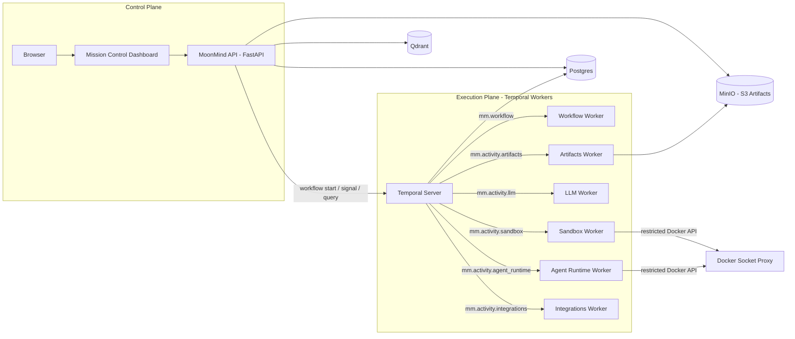

# MoonMind Architecture

MoonMind is a self-hostable platform that orchestrates state-of-the-art AI agents — Claude Code, Gemini CLI, Codex CLI, Cursor CLI, and more — with durable execution, secure sandboxing, and managed context built in.

This document is the top-level architectural overview. It covers the major subsystems, how they connect, and where to find deeper documentation. It reflects the **current and intended near-term** state of the project.

---

## Architecture at a Glance

Key layers:

* **Control Plane** — API + Mission Control. Authenticates callers, starts workflows, exposes task-oriented surfaces, and serves the operator dashboard.
* **Execution Plane** — Temporal workers grouped by capability, not by agent brand. Workflows orchestrate; Activities execute side effects.
* **Data Layer** — A single consolidated Postgres instance, Qdrant for vector retrieval, and MinIO for S3-compatible artifact storage.

---

## Control Plane

### API Service

The FastAPI-based [API service](../api_service/) is MoonMind's central control plane:

* **Workflow management** — starts Temporal workflows, sends signals/updates/cancellations, queries execution state.
* **Task compatibility APIs** — exposes `/tasks/*` endpoints that map the user-facing "task" concept onto Temporal workflow executions.
* **Artifact APIs** — manages artifact metadata, presigned upload/download grants, and artifact-to-execution linkage.
* **RAG retrieval** — indexes and retrieves vectors via Qdrant for chat and the `/context` MCP endpoint.
* **Task Proposals** — stores and surfaces agent-generated task proposals for human review before promotion to executing workflows.
* **Auth** — optional OIDC via Keycloak, or disabled-auth mode for local development.

### Mission Control

Mission Control is MoonMind's purpose-built operator dashboard — a thin, server-hosted web app served directly by the API service.

* **Task list** — unified view of workflow executions across sources, with filtering, sorting, and pagination via Temporal Visibility.
* **Task detail** — execution state, artifact browsing, timeline, and operator actions (pause, resume, cancel, approve, rerun).
* **Task submission** — form wizard for creating new tasks with runtime/model selection, scheduling, and artifact upload.
* **Proposals** — triage queue for reviewing, promoting, or dismissing agent-generated task proposals.

> **Vocabulary rule:** The UI uses **task** as the primary term. "Workflow execution" is reserved for implementation docs and debug views. Temporal Task Queues are never presented as a user-facing queue product.

See: [Mission Control Architecture](UI/MissionControlArchitecture.md) · [Mission Control Style Guide](UI/MissionControlStyleGuide.md)

---

## Execution Plane

### Temporal Foundation

[Temporal](https://temporal.io/) is MoonMind's primary durable execution engine. It provides:

* **Workflow Executions** as the durable orchestration primitive for all managed automation.
* **Activities** for all side-effecting work (LLM calls, sandbox commands, artifact I/O, integrations).
* **Visibility** as the list/query/count source of truth for the dashboard.
* **Schedules** for recurring and deferred task starts.
* **Timers, retries, signals, updates** for resilient fire-and-forget execution.

The Temporal server runs self-hosted in Docker Compose with PostgreSQL persistence and visibility. It is private-network only — no ports are exposed to the host by default.

See: [Temporal Architecture](Temporal/TemporalArchitecture.md) · [Temporal Platform Foundation](Temporal/TemporalPlatformFoundation.md)

### Workflow Types

MoonMind keeps a small workflow type catalog:

| Workflow | Purpose |
|---|---|
| `MoonMind.Run` | Root workflow for all task execution — direct commands, plan-driven execution, and external integrations. |
| `MoonMind.AgentRun` | Child workflow for true agent-runtime execution (managed and external agents). Started per-step by `MoonMind.Run`. |
| `MoonMind.ManifestIngest` | Manifest-driven ingestion with graph compilation, fan-out/fan-in, and aggregation. |
| `MoonMindAuthProfileManagerWorkflow` | Manages auth-profile slot acquisition and release for managed runtimes. |

See: [Workflow Type Catalog](Temporal/WorkflowTypeCatalogAndLifecycle.md)

### Tool & Plan System

MoonMind's execution model is built on three domain concepts that Temporal does not provide directly:

* **Tool** — a named capability with input/output schemas, execution binding, and policies. Two subtypes:
  * `skill` — dispatched as a Temporal Activity (`mm.tool.execute`).
  * `agent_runtime` — dispatched as a child `MoonMind.AgentRun` workflow.
* **Plan** — a DAG of tool invocations (Steps) with explicit dependencies, concurrency policy, and failure mode (`FAIL_FAST` or `CONTINUE`).
* **Artifact** — large inputs/outputs stored outside workflow history, referenced by `ArtifactRef`.

Plans are data, not code. They are validated, stored as artifacts, and interpreted deterministically by the plan interpreter inside `MoonMind.Run`. Planning itself is "just a tool" — an LLM activity that produces a plan artifact.

See: [Tool and Plan Contracts](Tasks/SkillAndPlanContracts.md) · [Skill and Plan Evolution](Tasks/SkillAndPlanEvolution.md)

---

## Worker Fleet

All workers share the same application image (`ghcr.io/moonladderstudios/moonmind:latest`) and differ only in the `TEMPORAL_WORKER_FLEET` environment variable and the task queue they poll. Workers are segmented by **capability and security boundary**, not by agent brand or runtime.

| Fleet | Task Queue | Default Concurrency | Role |
|---|---|---|---|
| **Workflow** | `mm.workflow` | 8 | Deterministic workflow orchestration. No side effects. |
| **Artifacts** | `mm.activity.artifacts` | 8 | Artifact lifecycle: upload, download, list, delete, retention sweep against MinIO. |
| **LLM** | `mm.activity.llm` | 4 | LLM API calls (OpenAI, Gemini, Anthropic). Holds API keys. |
| **Sandbox** | `mm.activity.sandbox` | 2 | Shell commands, repo checkouts, CLI invocations. Holds auth volumes. |
| **Agent Runtime** | `mm.activity.agent_runtime` | 4 | Agent orchestration: task dispatch, status polling, result collection. Holds auth volumes. |
| **Integrations** | `mm.activity.integrations` | 4 | External service activities (Jules, GitHub, webhooks). Holds provider tokens. |

Each worker exposes an HTTP health endpoint at `:8080/healthz`. Startup order is managed through Docker Compose `depends_on` with health and completion conditions.

> **Routing model:** Provider-specific sub-queues (e.g., `mm.activity.llm.codex`) are not configured by default. Add them only when operational isolation or independent scaling demands it.

See: [Activity Catalog and Worker Topology](Temporal/ActivityCatalogAndWorkerTopology.md) · [Source of Truth and Projection Model](Temporal/SourceOfTruthAndProjectionModel.md)

---

## Agent Runtimes

MoonMind supports two categories of agent execution, unified under the `MoonMind.AgentRun` child workflow:

### Managed Agents

MoonMind launches and supervises these runtimes directly. It owns the runtime envelope (lifecycle, auth, workspace, logs) but not the agent's internal reasoning.

| Runtime | Auth Mode | CLI |
|---|---|---|
| Codex CLI | OAuth / API key | `@openai/codex` |
| Gemini CLI | OAuth | `@google/gemini-cli` |
| Claude Code | API key / OAuth | `@anthropic-ai/claude-code` |
| Cursor CLI | OAuth / API key | Cursor CLI |

Managed agent runs use:

* `ManagedAgentAdapter` → `ManagedRuntimeLauncher` → `ManagedRunSupervisor` for async launch and supervision.
* Persistent auth volumes per runtime for credential reuse across restarts.
* `AuthProfileManager` workflow for concurrency enforcement and 429 cooldown per auth profile.

See: [Managed and External Agent Execution Model](Temporal/ManagedAndExternalAgentExecutionModel.md) · [Managed Agents Authentication](ManagedAgents/ManagedAgentsAuthentication.md) · [Docker-out-of-Docker](ManagedAgents/DockerOutOfDocker.md)

### External Agents

MoonMind delegates work to external agent systems it does not run, tracking status and closing the feedback loop.

* **Jules** — full external agent adapter with start/status/fetch_result lifecycle, callback-first integration, and Temporal event bridging.
* **OpenClaw** — external agent adapter.
* **OpenHands** — optional containerized agent that consumes MoonMind's MCP `/context` endpoint.

See: [External Agent Integration System](ExternalAgents/ExternalAgentIntegrationSystem.md) · [Jules Client Adapter](ExternalAgents/JulesClientAdapter.md) · [Adding an External Provider](ExternalAgents/AddingExternalProvider.md)

---

## Artifact System

MoonMind uses an artifact-first model: large inputs and outputs are stored outside Temporal workflow history and referenced by `ArtifactRef` values.

* **Storage backend:** MinIO (S3-compatible), running as a Docker Compose service. The `TemporalArtifactStore` adapter interface allows alternative backends.
* **Two-phase upload:** `artifact.create` registers metadata → client uploads content → `artifact.write_complete` finalizes with integrity verification.
* **Retention classes:** `ephemeral` (7d), `standard` (30d), `long` (180d), `pinned` (no auto-delete). Derived from artifact link type.
* **Redaction levels:** `none`, `preview_only` (16 KB truncated preview), `restricted` (owner/service-principal only).
* **Execution linkage:** Artifacts are linked to workflow executions via `ExecutionRef`. Link types include `input.instructions`, `output.primary`, `output.patch`, `output.logs`, `debug.trace`, etc.

See: [Workflow Artifact System Design](Temporal/WorkflowArtifactSystemDesign.md) · [Artifact Presentation Contract](Temporal/ArtifactPresentationContract.md)

---

## Memory & RAG

MoonMind's memory architecture uses three orthogonal planes to make agent runs faster, safer, and more repeatable:

| Plane | Question It Answers | Storage |
|---|---|---|
| **A — Planning (Beads)** | "What should we do next?" | Git-native, repo-scoped |
| **B — Task History** | "What happened last time?" | Run digests + fix patterns in Qdrant |
| **C — Long-Term (Mem0)** | "What do we know / how do we do this here?" | Curated knowledge in Mem0 |

A **context pack** is assembled per request by composing relevant items from all planes plus document RAG (LlamaIndex + Qdrant), with token budgeting and provenance tracking. Memory is fail-open: if any subsystem is unavailable, the request still runs.

The RAG subsystem is backed by **LlamaIndex** for ingestion/retrieval composition and **Qdrant** for vector storage. A declarative manifest system is specified for repeatable indexing pipelines.

> **Status:** The three-plane model is the desired architecture. Plane B (run digests, fix patterns) and Plane C (Mem0) are defined but still evolving in implementation.

See: [Memory Architecture](Memory/MemoryArchitecture.md) · [Memory Research](Memory/MemoryResearch.md) · [LlamaIndex Manifest System](Rag/LlamaIndexManifestSystem.md) · [Manifest Ingest Design](Rag/ManifestIngestDesign.md)

---

## Model Context Protocol

MoonMind implements an MCP server endpoint at `POST /context`. This gives agent runtimes (OpenHands or others) a standardized interface to MoonMind's model routing, RAG, and policy layers — decoupling agent UX from specific model vendors.

See: [Model Context Protocol](ModelContextProtocol.md)

---

## Data Layer

### Consolidated PostgreSQL

A single Postgres 17 instance hosts all durable state through logical database separation:

| Database | Purpose |
|---|---|
| `moonmind` | API tables, Alembic migrations, task/run state |
| `temporal` | Temporal workflow persistence (history, shards) |
| `temporal_visibility` | Temporal visibility store (search attributes, list/count) |
| `keycloak` | Keycloak IdP state (when `keycloak` profile is active) |

Databases are provisioned by `init_db_scripts/` on first start. Network aliases (`moonmind-api-db`, `temporal-db`) maintain backward compatibility.

### Qdrant

Vector database backing document retrieval for chat, `/context`, and memory planes B/C.

### MinIO

S3-compatible object store for workflow artifacts. The artifacts worker connects on the internal Docker network. The MinIO Console is optionally available on host port 9001 for debugging.

---

## Deployment

MoonMind deploys as a set of decoupled containers from a single `docker-compose.yaml`:

### Core Services (always on)

| Service | Image | Purpose |
|---|---|---|
| `api` | `moonmind` (app image) | FastAPI API + Mission Control dashboard |
| `postgres` | `postgres:17` | Consolidated database |
| `temporal` | `temporalio/auto-setup` | Temporal server |
| `minio` | `minio/minio` | S3-compatible artifact store |
| `qdrant` | `qdrant/qdrant` | Vector database |
| `docker-proxy` | `tecnativa/docker-socket-proxy` | Restricted Docker API for workers |
| `temporal-worker-*` (×6) | `moonmind` (app image) | Worker fleet (workflow, artifacts, llm, sandbox, agent_runtime, integrations) |

### Init Containers (run-once)

| Service | Purpose |
|---|---|
| `init-db` | Bootstrap DB schema, Qdrant indexes |
| `temporal-namespace-init` | Create `moonmind` namespace, register search attributes |
| `agent-workspaces-init` | Fix volume permissions for `/work/agent_jobs` |
| `codex-auth-init`, `gemini-auth-init`, `claude-auth-init`, `cursor-auth-init` | Initialize auth volumes |

### Optional Profiles

| Profile | Service | Purpose |
|---|---|---|
| `keycloak` | `keycloak` | OIDC identity provider |
| `ollama` | `ollama` | Local model inference |
| `vllm` | `vllm` | OpenAI-compatible local inference |
| `openhands` | `openhands` | Agent runtime consuming MCP `/context` |
| `temporal-ui` | `temporal-ui` | Temporal Web dashboard (port 8088) |
| `temporal-tools` | `temporal-admin-tools`, `temporal-visibility-rehearsal` | Ad-hoc Temporal CLI and schema tooling |

### Startup Flow

1. Postgres starts and becomes healthy.
2. `init-db` bootstraps the API schema and Qdrant indexes, then exits.
3. Temporal server starts and auto-creates persistence databases.
4. `temporal-namespace-init` registers the `moonmind` namespace and search attributes, then exits.
5. Auth-init and workspace-init containers prepare volumes, then exit.
6. API and all worker containers start.

---

## Security

* **Fleet isolation** — Workers are segmented by capability. Sandbox workers never hold provider API keys. Integration workers never run arbitrary shell commands.
* **Docker socket proxy** — Workers that need Docker API access use `tecnativa/docker-socket-proxy` with strict endpoint allowlisting. Direct host socket exposure is avoided.
* **Secret hygiene** — Secrets never appear in artifacts, logs, workflow history, or PR text. Raw credentials are passed via environment variables and secret stores only.
* **Auth profiles** — Managed agent credentials are stored in persistent Docker volumes and referenced indirectly. Runtime-specific environment shaping prevents credential mode conflicts.
* **OIDC** — Optional Keycloak profile provides full OIDC login/identity management.

---

## Documentation Index

The `docs/` tree is organized by topic area:

| Directory | Contents |
|---|---|
| [Tasks/](Tasks/) | Task architecture, skill/plan contracts, proposals, presets, cancellation, runs API |
| [Temporal/](Temporal/) | Temporal architecture, worker topology, workflow catalog, artifact system, scheduling, visibility, routing, ops runbook |
| [UI/](UI/) | Mission Control architecture and style guide |
| [ManagedAgents/](ManagedAgents/) | Runtime authentication, Docker-out-of-Docker, Cursor CLI, Git integration, secret store |
| [ExternalAgents/](ExternalAgents/) | Jules adapter, OpenClaw adapter, external agent integration system, adding providers |
| [Memory/](Memory/) | Memory architecture and research |
| [Rag/](Rag/) | LlamaIndex manifest system, manifest ingest design, workflow RAG |
| [Api/](Api/) | API-specific documentation |
| [Troubleshooting/](Troubleshooting/) | Debugging guides |
