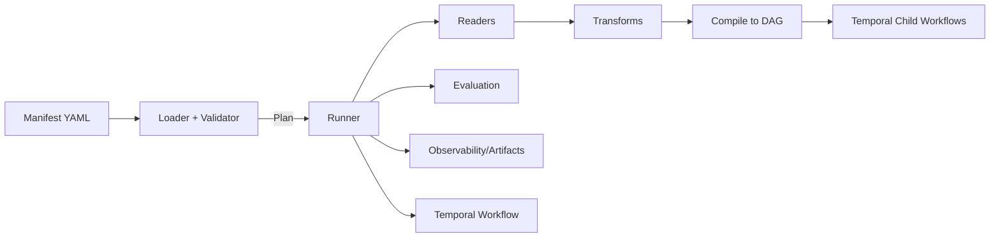

# Manifest System – Schema & Operator Guide

**Implementation tracking:** Rollout and backlog notes live under `docs/tmp/` or in gitignored local-only handoffs (for example `artifacts/`), not as migration checklists in canonical `docs/`.

> **Status:** Draft v0 (Temporal-aligned, vector-free)
> **Last updated:** 2026‑09‑09
> **Owners:** MoonMind Engineering
> **Scope:** Declarative ingestion → transforms → compile → execute → optional evaluation, without a MoonMind-managed vector database.
> **See also:** [ManifestIngestDesign.md](ManifestIngestDesign.md) (Temporal workflow architecture & implementation), [WorkflowRag.md](WorkflowRag.md) (exact context assembly for managed sessions)

MoonMind is vector-free: manifests declare data sources and transforms and
compile to an executable plan. There is no MoonMind-managed vector database,
embedding service, collection, or retrieval index. Ordinary manifests need no
embedding credentials or vector configuration. The retired `embeddings`,
`vectorStore`, `indices`, and `retrievers` fields remain accepted on
historical reads only; new manifests must omit them.

---

## Table of Contents

1. [Why a Manifest System?](#why-a-manifest-system)
2. [Architecture Overview](#architecture-overview)
3. [Manifest Schema (v0)](#manifest-schema-v0)

 * [Top‑level Keys](#top-level-keys)
 * [Retired vector fields](#retired-vector-fields)
4. [Examples](#examples)

 * [Minimal GitHub Reader](#example-a-minimal-github-reader)
 * [Multi-source with Eval](#example-b-multi-source-with-eval)
5. [CLI & API Usage](#cli--api-usage)
6. [Orchestration (Temporal)](#orchestration-temporal)
7. [Performance & Cost Tuning](#performance--cost-tuning)
8. [Security & Compliance](#security--compliance)
9. [Operational Patterns & Anti‑patterns](#operational-patterns--anti-patterns)
10. [Extending the System](#extending-the-system)
11. [Testing & CI](#testing--ci)
12. [Roadmap & Versioning](#roadmap--versioning)
13. [Appendix: Glossary](#appendix-glossary)

---

## Why a Manifest System?

We need repeatable, auditable, **declarative** pipelines for bringing text/code from heterogeneous sources into MoonMind:

* **Separate the “what” from the “how”**: teams describe data sources and transforms in YAML; runtime decides whether to run locally, via Temporal, or on a schedule.
* **Reproducibility**: manifests versioned in Git; runs are observable and produce artifacts.
* **Extensibility**: new readers plug in behind a stable schema.
* **Security**: consistent redaction, token scoping, and incremental re‑ingest rules.

**Non‑goals:** UI/visual analytics, long‑form prompt engineering, model evaluation beyond evidence metrics, or a managed vector index.

---

## Architecture Overview

**Key repo areas** this doc integrates with:

* Ingest: portable readers registered through `moonmind/manifest/adapters.py`
  and executed by `moonmind/manifest/pipeline.py`
* API: manifest endpoints under `api_service/api/routers/`
* Orchestration: `moonmind/workflows/temporal/workflows/manifest_ingest.py`
  (the registered Temporal workflow); `moonmind/workflows/temporal/manifest_ingest.py`
  owns compilation/projection helpers and `activity_runtime.py` owns manifest
  I/O Activities
* Manifest contract: `moonmind/workflows/agent_queue/manifest_contract.py` (validation, normalization, secret leak detection)
* Schema models: `moonmind/schemas/manifest_ingest_models.py`, `moonmind/schemas/manifest_models.py`



**Execution modes**

* **Local:** one‑shot runs for development or ad‑hoc refreshes
* **Temporal:** submit to `MoonMind.ManifestIngest` for durable, observable execution with concurrency control and failure policies
* **Planned:** dry‑run to estimate documents, chunks, tokens, cost

**Compile vs execute.** Compiling a manifest (validate → plan DAG) is distinct
from executing it (running the plan as Temporal child workflows). The single
owner of both sides is `MoonMind.ManifestIngest`; see
[ManifestIngestDesign.md](ManifestIngestDesign.md).

---

## Manifest Schema (v0)

Manifests are YAML. Environment variables interpolate as `${VAR}`. A JSON Schema validates structure and semantics.

### Top-level Keys

| Key | Required | Description |
| ------------------ | :------: | ---------------------------------------------------------------------------------------------- |
| `version` | ✅ | Schema version string (e.g., `"v0"`) |
| `metadata` | ✅ | Name, description, owner, tags |
| `llm` | | LLM provider/model/params for answer generation (optional) |
| `dataSources[]` | ✅ | List of readers (e.g., `GithubRepositoryReader`, `GoogleDriveReader`, `SimpleDirectoryReader`) |
| `transforms` | | Splitter, HTML→text, metadata enrichment, PII redaction |
| `evaluation` | | Datasets + metrics (e.g., hitRate@k, ndcg@k) with committed baselines |
| `run` | | Concurrency, batch size, error policy, `dryRun` |
| `observability` | | Tracing/log sinks (`opentelemetry`, `stdout`), callback manager |
| `security` | | PII redaction, metadata allowlist |
| `scheduling` | | Cron or `"manual"`; used for Temporal Schedules |

#### Common sub‑structures

* **`dataSources[].params`**: reader‑specific fields

 * GitHub: `owner`, `repo`, `branch`, `include[]`, `exclude[]`, `maxFiles`
 * Google Drive: `folderId`, `mimeTypes[]`
 * Local directory: `inputDir`, `recursive`, `requiredExts[]`

* **`transforms.splitter`**: `type`, `chunkSize`, `chunkOverlap`
* **`evaluation.datasets[]`**: `name`, `path` (JSONL with `query`, `relevant_ids`, committed `retrieved_ids`)
* **`evaluation.metrics[]`**: `name` (e.g., `hitRate@10`, `ndcg@10`), optional `threshold`

### Retired vector fields

Retired by MoonLadderStudios/MoonMind#4113. The v0 schema historically carried
a managed-vector pipeline:

* `embeddings` (provider/model for vectorization),
* `vectorStore` (type `pgvector` / `qdrant` / `milvus` + connection + `indexName`),
* `indices[]` (`VectorStoreIndex` definitions),
* `retrievers[]` (`Vector` / `Hybrid` with rerankers).

All four are retired. They validate on historical reads so old manifests stay
readable, but new manifests must omit them: no embedding provider or model,
no vector store type or connection, no `QDRANT_HOST` / `QDRANT_PORT` /
`QDRANT_API_KEY`, no collection administration, and no embedding credentials.
A compatibility check still validates that any *historical* retriever
references a defined index. Full schema redesign is owned by the ManifestIngest
track; this document only records the retirement boundary.

---

## Examples

### Example A: Minimal GitHub Reader

> **Path:** `examples/manifest-github-reader.yaml`

```yaml
version: "v0"
metadata:
  name: "github-reader-minimal"
  description: "Read a single GitHub repository"
  owner: "moonmind-team"

dataSources:
  - id: "moonmind-repo"
    type: "GithubRepositoryReader"
    params:
      owner: "MoonLadderStudios"
      repo: "MoonMind"
      branch: "main"
      filterExtensions: [".md", ".py"]
    auth:
      githubToken: "${GITHUB_TOKEN}"

transforms:
  splitter:
    type: "TokenTextSplitter"
    chunkSize: 1000
    chunkOverlap: 100

run:
  concurrency: 4
```

**Notes**

* Use a PAT with `repo` read scope for `GITHUB_TOKEN`.
* Expect reduced noise: images and binary assets filtered via `exclude`.
* No vector configuration is needed or accepted for new manifests.

---

### Example B: Multi-source with Eval

> **Path:** `examples/readers-full-example.yaml`

```yaml
version: "v0"
metadata:
  name: "moonmind-kitchen-sink"
  tags: ["demo","full"]

llm:
  provider: "openai"
  model: "gpt-4o-mini"
  temperature: 0

dataSources:
  - id: "github-code-docs"
    type: "GithubRepositoryReader"
    params:
      owner: "MoonLadderStudios"
      repo: "MoonMind"
      branch: "main"
      include: ["**/*.py","**/*.md"]
      exclude: ["tests/**","**/__pycache__/**","**/*.png","**/*.jpg"]
      maxFiles: 5000
    auth:
      githubToken: "${GITHUB_TOKEN}"
    schedule: "0 4 * * *" # nightly

  - id: "gdrive-specs"
    type: "GoogleDriveReader"
    params:
      folderId: "${SPECS_FOLDER_ID}"
      mimeTypes: ["application/pdf","application/vnd.google-apps.document"]

  - id: "local-handbook"
    type: "SimpleDirectoryReader"
    params:
      inputDir: "./handbook"
      recursive: true
      requiredExts: [".md",".txt"]

transforms:
  htmlToText: true
  splitter:
    type: "TokenTextSplitter"
    chunkSize: 800
    chunkOverlap: 120
  enrichMetadata:
    - type: "PathToTags"
    - type: "InferDocType" # code|design|spec|handbook

evaluation:
  datasets:
    - name: "smoke"
      path: "./examples/eval/smoke.jsonl"
  metrics:
    - name: "hitRate@10"
      threshold: 0.8
    - name: "ndcg@10"
      threshold: 0.7

run:
  concurrency: 12
  errorPolicy: "continue"

observability:
  tracing: "opentelemetry"
  logs: "stdout"
```

---

## CLI & API Usage

> **Package layout:** `moonmind/manifest/` → `loader.py`, `runner.py`, `interpolation.py`, `sync.py`, `secret_providers.py`
> **Schema models:** `moonmind/schemas/manifest_models.py`, `moonmind/schemas/manifest_ingest_models.py`

**Commands**

```bash
# Validate schema + semantics
moonmind manifest validate -f examples/manifest-github-reader.yaml

# Plan (no writes) – print doc counts, chunk estimates, token/cost approximations
moonmind manifest plan -f examples/readers-full-example.yaml

# Local run
moonmind manifest run -f examples/readers-full-example.yaml

# Evaluate a manifest against a dataset
moonmind manifest evaluate -f examples/readers-full-example.yaml --dataset smoke
```

The shipped `examples/eval/smoke.jsonl` dataset is a generic evaluation
provenance baseline. Each JSONL row declares the query, `relevant_ids`, and
the committed `retrieved_ids` order used for deterministic baseline scoring.
The evaluator computes `hitRate@k` and `ndcg@k` from those values and compares
them with the manifest thresholds. Rows assert evidence traceability (which
module owns which contract), not live managed-vector recall.

**Temporal submission (API)**

To submit a manifest for durable execution, use the MoonMind API to start a `MoonMind.ManifestIngest` workflow:

```bash
# Submit via API — starts a Temporal workflow execution
curl -X POST /api/manifests/{name}/runs \
  -H 'Content-Type: application/json' \
  -d '{"executionPolicy": {"failurePolicy": "fail_fast", "maxConcurrency": 50}}'
```

See [ManifestIngestDesign.md](ManifestIngestDesign.md) for the full workflow input/output contract.

---

## Orchestration (Temporal)

Manifest execution is orchestrated by the `MoonMind.ManifestIngest` Temporal workflow:

* **Pipeline:** `Read manifest (Activity) → Parse + Validate → Compile to DAG → Fan-out child MoonMind.UserWorkflow workflows → Aggregate → Write summary/index artifacts`
* **Durability:** Temporal provides automatic retries, timeout enforcement, and crash recovery. Long-lived ingests use Continue-As-New to manage event history limits.
* **Concurrency:** configurable via `executionPolicy.maxConcurrency` (default 50, hard cap 500). Enforced by the workflow using an internal semaphore.
* **Failure modes:** `fail_fast` (stop on first failure) or `best_effort` / `continue_and_report` (complete independent nodes, report partial failures).
* **Interactive control:** 6 Temporal Updates — `UpdateManifest`, `SetConcurrency`, `Pause`, `Resume`, `CancelNodes`, `RetryNodes`.
* **Artifacts:** summary, run-index, and checkpoint artifacts stored in MinIO via artifact Activities.
* **Scheduling:** if `dataSources[].schedule` is a cron expression, use Temporal Schedules to trigger periodic ingests; otherwise `"manual"`.

**Operational knobs**

* Concurrency, failure policy, and task queue routing configured via execution policy at workflow start time.
* Worker topology and activity task queue assignments defined in `docs/Temporal/ActivityCatalogAndWorkerTopology.md`.
* Monitor manifest runs via the MoonMind dashboard or Temporal Visibility queries (`mm_entry=manifest`).

---

## Performance & Cost Tuning

* **Chunking**: start with 800–1000 tokens, 10–15% overlap; reduce overlap for code to 5–10%.
* **Batching**: reader `batchSize` 128–512 depending on provider limits.
* **Incremental**: Readers should implement `since` semantics (e.g., last commit/timestamp) to avoid full scans.
* **Dedup/filters**: prefer metadata allowlists to shrink payload sizes.

---

## Security & Compliance

* **Secrets**: reference via `${ENV}`; set in deployment or secret manager (never commit raw tokens).
* **PII**: set `security.piiRedaction: true` on corp data; redact during transforms.
* **Scopes**: GitHub tokens limited to repo read; Drive folders restricted by service account; DB creds least privilege.
* **Metadata allowlist**: restrict index‑time metadata to safe fields (e.g., `path`, `repo`, `branch`, `docType`).

---

## Operational Patterns & Anti-patterns

**Do**

* Reuse transforms at the **manifest root** to avoid duplication.
* Add an **evaluation** block for production manifests.

**Avoid**

* Processing binary assets (filter with `exclude`).
* Extremely large overlaps (wasteful tokens).
* Hardcoding secrets; prefer `${ENV}`.
* Adding embedding, vector store, collection, or retrieval index configuration (retired).

---

## Extending the System

### New Reader (design recipe)

1. Implement a `ReaderAdapter` with:

 * `plan()` → enumerate files/docs and estimate sizes
 * `fetch()` → yield `(text, metadata)` items
 * `state()` → return cursor for incremental runs (e.g., latest commit SHA or timestamp)

2. Add a `type` discriminator (e.g., `ConfluenceReader`) and define `params`/`auth`.

3. Document required scopes and example `include/exclude`.

### New Evaluator

* Input: JSONL of `{query, relevant_ids, retrieved_ids?}`.
* Metrics: `hitRate@k`, `mAP@k`, `ndcg@k`, optional `faithfulness` (LLM‑as‑judge) with reproducible prompts.

---

## Testing & CI

* **Unit**: loader/validator (missing keys, bad globs, wrong auth), transform contracts.
* **Snapshot**: node counts for a fixed small corpus.
* **Smoke evaluation**: assert `hitRate@k` threshold on the committed-baseline golden set.
* **CI**: validate any YAML under `examples/` and **plan** them (no writes) on PRs; fail if invalid or thresholds regress.

---

## Roadmap & Versioning

The manifest schema is **v0** with backwards‑compatible minor additions within `v0`. Breaking changes bump `version` and ship an upgrade script (`manifest migrate`). Product milestones beyond the current schema (scheduled jobs, lineage, multi‑tenant policy, dataset registries, evaluation dashboards) and legacy example migration are tracked under `docs/tmp/` or in local-only planning notes when needed.

---

## Appendix: Glossary

* **Reader**: component that fetches raw documents (e.g., GitHub, Drive).
* **Transform**: splitter, cleaners, metadata enrichers that prepare nodes.
* **Plan**: dry‑run estimation of docs/chunks/tokens/cost.
* **Compile**: validating a manifest and producing the executable DAG.
* **Execute**: running the compiled plan as Temporal child workflows.

---

### Quick Reference (env vars)

Add required variables to `.env-template`:

* `GITHUB_TOKEN` (if using GitHub reader)
* `SPECS_FOLDER_ID` (if using Google Drive reader)
* Provider keys for `llm` answer generation (retrieval-only when omitted)

No embedding credentials or vector store connection variables are required
for new manifests. Retired `QDRANT_*`, `VECTOR_STORE_*`, and embedding
configuration entries may still appear in older deployed `.env` files and
historical manifests; they carry no new vector behavior and their remaining
code-path cleanup is owned by the sibling execution track.
