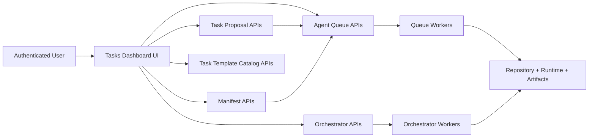

# Task Architecture

Status: Active  
Owners: MoonMind Engineering  
Last Updated: 2026-02-19

## 1. Purpose

This document defines the **high-level architecture** of MoonMind's task system and Tasks Dashboard.

It intentionally stays broad. Detailed UI behavior, route-level contracts, payload examples, and page interaction rules are documented in `docs/TaskUiArchitecture.md`.

---

## 2. Current System Snapshot (2026-02-19)

MoonMind's task system has expanded beyond a single queue submit/list flow. The current dashboard and backend now support:

- Queue Task jobs (`type="task"`) with canonical payload normalization.
- Manifest ingestion jobs (`type="manifest"`) in the same queue system.
- Orchestrator runs for service-level action plans.
- Task proposal review and promotion into executable queue jobs.
- Shared task preset/template catalog support for task authoring workflows.
- Queue run operations (cancellation, live sessions, operator controls/messages) surfaced in the dashboard.

The Tasks Dashboard is now the primary control-plane UI for these task-adjacent workflows.

---

## 3. High-Level Architecture

### Key layers

- **UI Layer**: Task operations and visibility surface (`/tasks`).
- **Control Plane APIs**: queue, orchestrator, proposals, manifests, template catalog.
- **Execution Plane**: workers that claim eligible jobs/runs and emit events/artifacts.
- **Policy Layer**: auth, worker capability checks, repository/job-type constraints, secret handling.

---

## 4. Dashboard Responsibilities (Broad)

The Tasks Dashboard provides one place to:

- Monitor active and historical work across queue and orchestrator systems.
- Submit new work requests (queue task, orchestrator run, manifest run).
- Review and triage worker-generated follow-up proposals.
- Inspect run state through events, artifacts, and run metadata.
- Apply operator controls for active queue task runs.

Implementation details for pages, form fields, endpoint calls, and rendering strategy are intentionally delegated to `docs/TaskUiArchitecture.md`.

---

## 5. Workload Types

### 5.1 Queue Task Jobs (`type="task"`)

- Primary automation job type.
- Server-normalized to the canonical task contract.
- Executed by runtime-capable queue workers (Codex/Gemini/Claude).

### 5.2 Manifest Queue Jobs (`type="manifest"`)

- Manifest ingestion is modeled as queue work.
- Shares queue lifecycle primitives (claim, heartbeat, events, artifacts, cancellation).

### 5.3 Orchestrator Runs

- Separate run model for service action plans.
- Tracked and managed through `/orchestrator/*` APIs and dashboard pages.

### 5.4 Task Proposals

- Control-plane review objects that can be promoted into executable queue jobs.
- Keep human triage separate from actively claimable queue workload.

---

## 6. System Invariants

The following invariants define expected behavior regardless of UI strategy:

1. **Canonical normalization**  
   Queue task submissions are normalized and validated server-side before persistence/execution.

2. **Capability-gated claims**  
   Worker eligibility is constrained by job type, repository policy, and capability matching.

3. **Stage-oriented task execution**  
   Task runs follow prepare/execute/publish stage semantics with publish conditional on mode.

4. **Default resolution at execution time**  
   Runtime and repository defaults are resolved in backend/worker paths, not hardcoded only in UI.

5. **Secret-safe payload policy**  
   Payloads carry references/metadata, never raw credentials.

6. **Observability as a first-class contract**  
   Events and artifacts are the durable source for run transparency and debugging.

---

## 7. Security and Access (Current Direction)

- Dashboard routes are authenticated user surfaces.
- Queue worker mutation routes require worker identity (token/OIDC).
- Worker policy scope remains the enforcement point for repo, job-type, and capability boundaries.
- Orchestrator route auth consistency is an active alignment area with queue/proposal/manifests user auth expectations.

---

## 8. Document Boundaries

Use this document for architecture orientation. Use the following documents for implementation-level detail:

- `docs/TaskUiArchitecture.md` for dashboard route contracts, endpoint mapping, submission payload details, and live UX behavior.
- `docs/CodexTaskQueue.md` for queue contract and execution-specific details.
- `docs/TaskProposalQueue` for proposal lifecycle and promotion design.
- `docs/ManifestTaskSystem.md` for manifest ingestion workflow design.

---

## 9. Out of Scope

This document does not define:

- Detailed UI form fields and page component behavior.
- Full canonical task payload schema and normalization rules.
- Worker runtime adapter internals.
- Manifest pipeline internals.
- Orchestrator plan-step implementation details.

