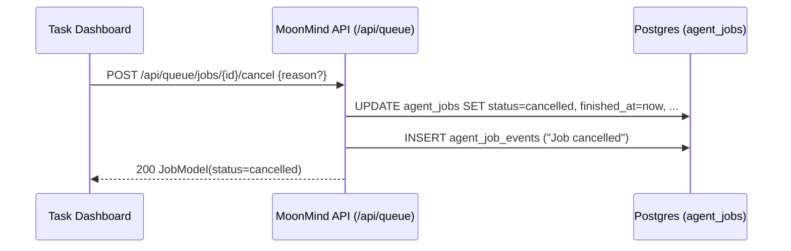
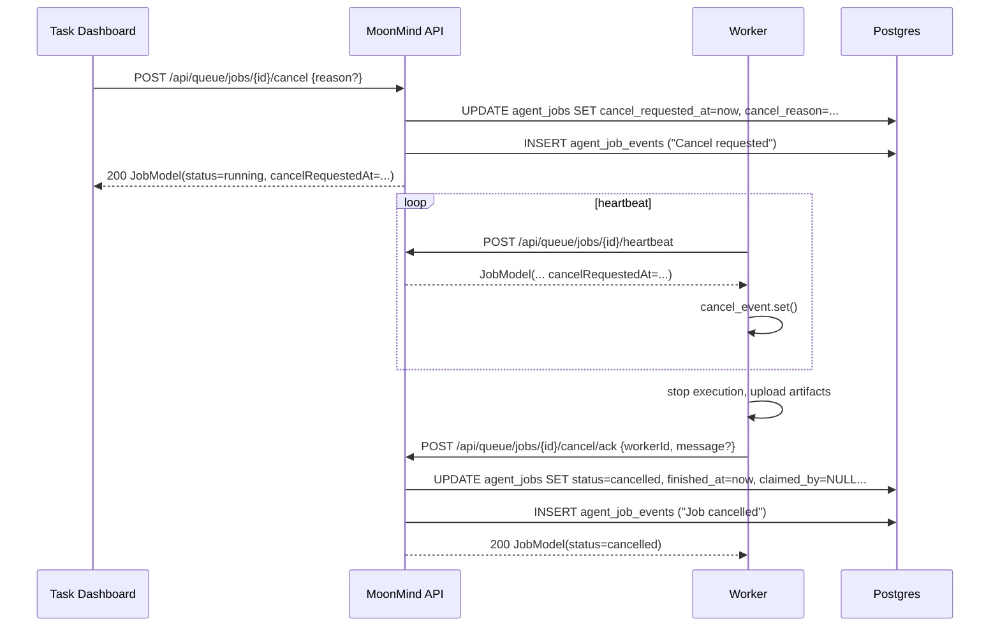

# Task Cancellation (Agent Queue “Task” Jobs)

Status: Proposed
Owners: MoonMind Engineering
Last Updated: 2026-02-16

## 1. Purpose

Add **Task Cancellation** to MoonMind so that:

* Tasks (queue jobs, primarily `type="task"`) can be cancelled while **queued** (required).
* Tasks can be cancelled while **running on a worker** (best-effort, cooperative).
* Cancellation is exposed through:

  * **Task Dashboard UI** (thin dashboard over REST)
  * **REST API endpoint(s)** (under `/api/queue`)
  * **MCP tool call** (under `/mcp/tools/call`) alongside existing queue tools

This design targets Agent Queue jobs because Tasks are represented as queue jobs with a status model that already includes `cancelled` .

---

## 2. Goals and Non-Goals

### Goals

1. **Queued cancellation**: user cancels a queued job → job transitions to `cancelled` and becomes unclaimable.
2. **Running cancellation**: user requests cancellation for a running job → worker detects request, stops execution, and job transitions to `cancelled`.
3. **Unified surfaces**: UI + REST + MCP all map to the **same queue service methods** (same philosophy as existing MCP queue tools) .
4. **Auditability**: cancellation actions are visible in queue job **events**.

### Non-Goals (for this doc)

* Cancelling **Orchestrator runs** (separate lifecycle; dashboard also shows orchestrator, but adding cancel there is a different project) .
* “Hard kill” guarantees (we will do best-effort termination of subprocesses; no absolute guarantee with external CLIs).

---

## 3. Current System Constraints (What we must fit into)

* Queue job statuses already include `cancelled`  and the MVP state table explicitly allows `queued -> cancelled` .
* REST queue surface exists for enqueue/claim/heartbeat/complete/fail/events/artifacts .
* MCP wrapper exists for queue operations (`queue.enqueue`, `queue.claim`, …) .
* Worker lifecycle:

  * Worker claims a job, starts a heartbeat task
  * Heartbeat endpoint returns a `JobModel`  but the current worker client ignores the returned payload.
* Lease expiry reprocessing currently requeues or dead-letters expired running jobs  — cancellation must not be undone by this logic.
* `JobModel` currently does not include any “cancel requested” fields .

---

## 4. Proposed Design

### 4.1 Data Model Changes (AgentJob)

Introduce a **soft cancellation request** that does **not** immediately flip a running job to `cancelled`. This avoids fighting existing worker mutation rules that require `status == running` .

Add columns to `agent_jobs`:

* `cancel_requested_at` (timestamp, nullable)
* `cancel_requested_by_user_id` (uuid, nullable)
* `cancel_reason` (text, nullable)

Optional (nice-to-have, not required for v1):

* `cancelled_by_worker_id` (string, nullable) or record via events only.

Update ORM (`moonmind/workflows/agent_queue/models.py`) and Pydantic (`moonmind/schemas/agent_queue_models.py`) so `JobModel` includes:

* `cancelRequestedAt`
* `cancelRequestedByUserId`
* `cancelReason`

Why: workers need a **cheap** “is cancellation requested?” signal without scanning events, and without introducing a new status like `cancelling`.

---

### 4.2 REST API Additions (Queue Router)

Add two endpoints under `api_service/api/routers/agent_queue.py`:

#### 1) Request cancellation (user action)

`POST /api/queue/jobs/{job_id}/cancel`

* Auth: `get_current_user()`
* Body: `{ "reason"?: string }`
* Behavior:

  * If job is `queued`: transition to `cancelled` immediately.
  * If job is `running`: set `cancel_requested_at/by/reason` only (status remains `running`).
  * If job is terminal (`succeeded`, `failed`, `cancelled`, `dead_letter`): return 409 “state conflict” or treat as idempotent no-op (see 4.6).

Response: updated `JobModel`.

#### 2) Acknowledge cancellation (worker action)

`POST /api/queue/jobs/{job_id}/cancel/ack`

* Auth: worker auth (`X-MoonMind-Worker-Token` / OIDC worker identity), like other worker mutation endpoints
* Body: `{ "workerId": string, "message"?: string }`
* Preconditions:

  * Job is `running`
  * `claimed_by == workerId`
  * `cancel_requested_at` is set (strict) *or* allow “self-cancel” (optional policy knob)
* Behavior:

  * Transition to `cancelled`
  * Set `finished_at = now`
  * Clear claim/lease fields
  * Append a “Job cancelled” event (include workerId + stage if known)

Response: updated `JobModel`.

---

### 4.3 Queue Service + Repository Changes

#### Service (`moonmind/workflows/agent_queue/service.py`)

Add:

* `request_cancel(job_id, requested_by_user_id, reason) -> AgentJob`
* `ack_cancel(job_id, worker_id, message) -> AgentJob`

Both MUST append events (audit trail), consistent with existing lifecycle event usage in the service .

#### Repository (`moonmind/workflows/agent_queue/repositories.py`)

Add methods:

* `request_cancel(...)`
* `ack_cancel(...)`

And modify lease expiry reprocessing:

* Today, `_requeue_expired_jobs` requeues expired running jobs back to `queued` .
* Change rule: if `cancel_requested_at IS NOT NULL`, **do not** requeue; instead set `status=cancelled` and `finished_at=now`.

Also modify retry behavior:

* If `cancel_requested_at` is set, `fail_job(retryable=True)` must **not** requeue; it should become `cancelled` (or `failed` but terminal). The intent of cancellation should prevent “zombie retries”.

---

### 4.4 MCP Tool Additions

Add a new MCP tool in `moonmind/mcp/tool_registry.py` alongside existing queue tools :

* `queue.cancel`

  * args: `{ jobId: UUID, reason?: string }`
  * handler: `AgentQueueService.request_cancel(...)`
  * result: REST-equivalent `JobModel` dumped with aliases (same style as `queue.enqueue`)

This makes cancellation callable via:

* `GET /mcp/tools` discovery
* `POST /mcp/tools/call` execution

No new MCP router needed; it’s just a registry/tool expansion.

---

### 4.5 Task Dashboard UI Changes (Thin Dashboard)

The dashboard is a thin client over REST endpoints  and already knows queue vs orchestrator endpoints via the injected runtime config .

#### View-model config

In `api_service/api/routers/task_dashboard_view_model.py`, add:

* `sources.queue.cancel = "/api/queue/jobs/{id}/cancel"`

So dashboard.js can call `endpoint(queueSourceConfig.cancel, { id })`.

#### UI behavior

In `api_service/static/task_dashboard/dashboard.js`:

* Add a **Cancel** button on:

  * queue list rows (optional)
  * queue detail page (recommended)
* Only show Cancel when:

  * queue job status is `queued` or `running`
  * and status is not already terminal (`cancelled`, `succeeded`, `failed`, `dead_letter`)

Also show a “Cancel requested” indicator when:

* `rawStatus == "running"` AND `cancelRequestedAt` is present (requires JobModel schema update).

---

### 4.6 State Machine, Idempotency, and Concurrency

#### State rules

* `queued -> cancelled`: always allowed (hard requirement)
* `running -> cancelled`: only via **ack** endpoint (worker-owned transition)
* “Cancel request” is orthogonal; it sets `cancel_requested_at` and does not change status.

#### Idempotency

* `POST /cancel`:

  * If job already has `cancel_requested_at`, return job (no-op).
  * If job already `cancelled`, return job (no-op).
* `POST /cancel/ack`:

  * If already `cancelled`, return job (no-op) **only if** caller is same worker or job has no owner.
  * Otherwise 409.

#### Concurrency safety

* `cancel` must be transactional with row locking (similar spirit to claim).
* If a cancel request races with a claim:

  * If cancel wins first (job becomes cancelled), claim won’t select it because claim filters `status == queued`.
  * If claim wins first, cancel request should set `cancel_requested_at` and rely on worker ack.

---

### 4.7 Worker Runtime Cancellation (Cooperative)

We need the worker to:

1. Detect cancellation request while running.
2. Stop execution safely.
3. Ack cancellation to the API.

#### Cancellation detection

Use the existing heartbeat path (endpoint returns JobModel ):

* Change worker `QueueApiClient.heartbeat(...)` to **return** the JSON body (or a parsed JobModel-like dict).
* Add `cancel_event = asyncio.Event()` per job.
* In `_heartbeat_loop`, on each heartbeat response:

  * If `cancelRequestedAt != null`, set `cancel_event`.

To keep cancellation responsive, cap the heartbeat interval:

* `heartbeat_interval = min(lease_seconds / 3, HEARTBEAT_MAX_INTERVAL_SECONDS)`
* Default `HEARTBEAT_MAX_INTERVAL_SECONDS = 10` (configurable)

This preserves the “lease/3” behavior for small leases (tests use lease=3s) while preventing 40s+ cancellation lag in real configs.

#### Cooperative stop points

* Before each stage starts (`prepare`, `execute`, `publish`) , check `cancel_event.is_set()`.
* If set:

  * Emit event: `Job cancellation requested; stopping`
  * Upload any staged artifacts
  * Call `POST /cancel/ack`
  * Exit job handler without calling complete/fail

#### Best-effort subprocess interruption

Long-running CLI calls are currently executed via `asyncio.create_subprocess_exec(...); await process.communicate()` , which is not cancellation-aware.

Update command execution utilities (used by handlers and/or worker stages) to accept `cancel_event`:

* Run `process.communicate()` concurrently with `cancel_event.wait()`
* On cancellation:

  * send SIGINT (graceful)
  * after short grace period, send SIGKILL
  * ensure child process group is terminated (Linux containers → process groups are feasible)

This makes “cancel while running” real for `codex`, `gemini`, and `claude` subprocesses.

---

## 5. End-to-End Flows (Sequence Diagrams)

### 5.1 Cancel queued job

### 5.2 Cancel running job (cooperative)

---

## 6. Testing Plan

### Repository/service tests

* `queued -> cancelled` transition + idempotency
* `running + cancel_requested_at` blocks retry/requeue
* `_requeue_expired_jobs` respects cancellation request (no requeue)
* `cancel/ack` requires ownership and correct state

### API tests

* `POST /api/queue/jobs/{id}/cancel`:

  * queued job → cancelled
  * running job → cancelRequestedAt set
* `POST /api/queue/jobs/{id}/cancel/ack`:

  * worker-owned running job → cancelled
  * wrong worker → 409

### MCP tests

* `queue.cancel` tool exists in discovery and calls service correctly (pattern matches existing MCP tests).

### Worker tests

* Simulate heartbeat returning `cancelRequestedAt` and assert worker calls cancel ack and does not complete.

---

## 7. Rollout Plan

1. **Phase 1 (Must-have):** queued cancellation

   * DB migration + API `/cancel` for queued → cancelled
   * UI cancel button for queued
   * MCP `queue.cancel`

2. **Phase 2 (Best-effort running cancellation):**

   * add cancel request fields + `/cancel` sets them on running jobs
   * worker reads cancelRequestedAt via heartbeat, stops, calls `/cancel/ack`
   * harden lease expiry logic to respect cancellation requests

3. **Phase 3 (Polish):**

   * UI “Cancel requested” indicator
   * subprocess best-effort kill improvements

---

## 8. Open Questions / Policy Knobs

* Should `cancel/ack` be allowed even if `cancel_requested_at` is null (worker self-cancel / operator kill)?
* Should cancellation be restricted to `created_by_user_id == current_user.id` (multi-user hardening), or keep current “any authenticated user” model (matches current list/get openness)?
* What is the desired UX for “cancel requested but job finished successfully before worker noticed”? (Likely: show succeeded; events show cancellation request came too late.)

---

If you want, I can also draft the exact endpoint/request/response schemas (Pydantic models + JSON schema) to match the existing style in `moonmind/schemas/agent_queue_models.py`  and the MCP registry patterns in `moonmind/mcp/tool_registry.py` .
