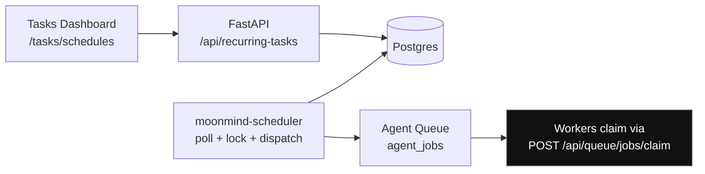

# Recurring Schedules System (DB-backed) — `RecurringTaskDefinition` + `moonmind-scheduler`

Status: Draft (implementation-ready)
Owners: MoonMind Engineering
Last Updated: 2026-02-24

## 1. Purpose

Add **dashboard-managed recurring schedules** to MoonMind by introducing:

1. A DB-backed `RecurringTaskDefinition` model that describes “run this thing on a cadence”.
2. A `moonmind-scheduler` daemon that turns due schedules into **Agent Queue jobs** (and optionally built-in housekeeping runs).

This design **reuses the Agent Queue contract** (job lifecycle, events, artifacts, cancellation, UI detail pages) already defined for `type="task"` jobs , extends it to schedule **manifest runs** (which already enqueue `type="manifest"` jobs via `ManifestsService.submit_manifest_run`) , and provides a clean place to attach **housekeeping** routines.

It also provides a concrete implementation for the manifest scheduling intent described in the older manifest operator guide (“if `dataSources[].schedule` is a cron, an orchestrator submits runs on that cadence”) , but does so without requiring RabbitMQ/Celery Beat.

---

## 2. Goals and Non-Goals

### Goals

* **Dashboard-managed schedules**: create/update/enable/disable, “run now”, view history and next run.
* **DB-backed scheduler**: no RabbitMQ requirement.
* **Reuse Agent Queue**: scheduled work becomes normal queue jobs where possible (`task`, `manifest`, and a new optional `housekeeping` job type).
* **HA-safe + idempotent**: multiple scheduler instances can run; dispatch uses an idempotency key so retries/crashes do not create duplicate queue jobs.
* **Timezone-correct cron** (DST-aware).
* **Manifests + housekeeping** supported as first-class targets.

### Non-Goals (v1)

* Full distributed “workflow engine”.
* Sub-minute precision or seconds-field cron (optional later).
* Perfect “exactly once” execution (we target effectively-once enqueue per scheduled occurrence via idempotent submission + reconciliation; worker execution is still “at least once” due to retries).

---

## 3. High-Level Architecture



Key alignment points:

* Queue jobs and API surfaces already exist (`POST /api/queue/jobs`, `POST /api/queue/jobs/claim`, etc.) 
* Manifest registry runs already enqueue a `manifest` queue job and update `ManifestRecord.last_run_*` 
* Existing daemon pattern exists for queue-consuming services (e.g., orchestrator’s DB queue worker loops over claim/heartbeat) 

---

## 4. Data Model

### 4.1 `recurring_task_definitions`

A schedule definition (“what to run, when, and how to behave if late or overlapping”).

| Column | Type | Notes |
| --- | ---: | --- |
| `id` | uuid pk |
| `name` | text | Display name |
| `description` | text | Optional |
| `enabled` | bool |  |
| `schedule_type` | enum | `cron` (v1) |
| `cron` | text | Standard 5-field cron |
| `timezone` | text | IANA TZ (e.g., `America/Los_Angeles`) |
| `next_run_at` | timestamptz | Computed next due time (UTC) |
| `last_scheduled_for` | timestamptz | Most recent nominal scheduled occurrence (UTC) |
| `last_dispatch_status` | text | `enqueued` / `skipped` / `error` / … |
| `last_dispatch_error` | text | Truncated |
| `owner_user_id` | uuid fk user | For personal schedules |
| `scope_type` | enum | `personal` \| `team` \| `global` (v1 starts with `personal` and `global`) |
| `scope_ref` | text | Team id, etc (nullable) |
| `target` | jsonb | Target spec (see section 5) |
| `policy` | jsonb | Overlap/catchup/misfire/jitter knobs |
| `created_at` | timestamptz |
| `updated_at` | timestamptz |
| `version` | bigint | Monotonic for UI cache bust + optimistic updates |

Indexes:

* `(enabled, next_run_at)` for due scans
* `(owner_user_id, enabled)` for per-user listing

### 4.2 `recurring_task_runs`

One row per scheduled occurrence (or “decision”), used for history and idempotency.

| Column | Type | Notes |
| --- | ---: | --- |
| `id` | uuid pk |
| `definition_id` | uuid fk |
| `scheduled_for` | timestamptz | Nominal occurrence time (UTC) |
| `trigger` | text | `schedule` or `manual` |
| `outcome` | enum | `pending_dispatch` / `enqueued` / `skipped` / `dispatch_error` |
| `dispatch_attempts` | int | default 0 |
| `dispatch_after` | timestamptz | backoff scheduling |
| `queue_job_id` | uuid | nullable |
| `queue_job_type` | text | nullable |
| `message` | text | error or “skipped because …” |
| `created_at` | timestamptz |
| `updated_at` | timestamptz |

Constraints:

* **Unique** `(definition_id, scheduled_for)` → prevents double-enqueue for the same occurrence.

### 4.3 Optional audit table

If you want parity with other “system control events” patterns (like worker pause audit in queue) :

* `recurring_task_audit_events(id, definition_id, action, actor_user_id, reason, created_at)`

---

## 5. Target Types (Reuse for Tasks, Manifests, Housekeeping)

All targets live under `recurring_task_definitions.target` (jsonb). v1 supports:

### 5.1 Target: Queue Task job (`type="task"`)

Uses the canonical queue job type and payload shape. Supports two modes:

**A) Inline task payload (stored fully)**

```json
{
  "kind": "queue_task",
  "job": {
    "type": "task",
    "priority": 0,
    "maxAttempts": 3,
    "affinityKey": "repo/MoonLadderStudios/MoonMind",
    "payload": { "repository": "MoonLadderStudios/MoonMind", "task": { "...": "..." } }
  }
}
```

**B) Template-backed expansion (expand at dispatch time)**
Leverages the Task Presets system (expanded steps into `task.steps[]`) .

```json
{
  "kind": "queue_task_template",
  "jobDefaults": { "priority": 0, "maxAttempts": 3, "affinityKey": "repo/..." },
  "taskDefaults": { "repository": "MoonLadderStudios/MoonMind", "targetRuntime": "codex" },
  "template": { "slug": "pr-code-change", "version": "1.0.0", "inputs": { "change_summary": "Nightly tidy" } }
}
```

Dispatch-time flow:

1. Expand template → concrete `steps[]` + `appliedTemplate` metadata (existing expand API) 
2. Build canonical payload including `task.steps` and `task.appliedStepTemplates` (as UI does) 
3. Enqueue via `AgentQueueService.create_job(type="task", ...)` which already merges template capability metadata through `compile_task_payload_templates` .

### 5.2 Target: Manifest run (registry-backed)

Uses `ManifestsService.submit_manifest_run(...)` which already creates a `manifest` queue job and updates the `ManifestRecord.last_run_*` pointers .

```json
{
  "kind": "manifest_run",
  "name": "confluence-eng",
  "action": "run",
  "options": { "dryRun": false, "forceFull": false, "maxDocs": null }
}
```

### 5.3 Target: Housekeeping

Two viable v1 options:

**Option 1 (recommended): enqueue a new queue job type `housekeeping`**

* Extend supported queue job types (currently `task`, `manifest`, `orchestrator_run`, legacy)  to include `housekeeping`.
* Add a small `moonmind-housekeeping-worker` (no LLM) that claims `type="housekeeping"` and runs built-in operations.

Target spec:

```json
{
  "kind": "housekeeping",
  "action": "prune_artifacts",
  "args": { "olderThanDays": 14 }
}
```

**Option 2 (minimal): scheduler executes housekeeping inline**

* Scheduler runs the operation directly and records the run outcome (no queue job id).
* Faster to ship, but weaker observability (no queue events/artifacts) and doesn’t reuse the existing dashboard detail views.

This design proceeds assuming Option 1, because you explicitly want reuse for “manifests + housekeeping”.

---

## 6. Scheduling Semantics

### 6.1 Cron + timezone

* Store `cron` and `timezone` on the definition.
* Persist `next_run_at` in UTC (timestamptz).
* Compute next fire time using a cron library (e.g., `croniter`) + `zoneinfo`.

### 6.2 Policies (`recurring_task_definitions.policy`)

```json
{
  "overlap": { "mode": "skip", "maxConcurrentRuns": 1 },
  "catchup": { "mode": "last", "maxBackfill": 3 },
  "misfireGraceSeconds": 900,
  "jitterSeconds": 30
}
```

* **Overlap**

  * `skip`: if there is a prior run that’s still “active” (pending_dispatch or enqueued and underlying job not terminal), mark this occurrence as `skipped`.
  * `allow`: enqueue regardless, bounded by `maxConcurrentRuns`.
* **Catchup**

  * `none`: missed occurrences are skipped; schedule jumps forward.
  * `last`: enqueue at most one missed occurrence.
  * `all`: enqueue every missed occurrence up to `maxBackfill`.
* **Misfire grace**

  * If `now - scheduled_for > grace`, treat as skipped (or clamp per catchup mode).
* **Jitter**

  * Add small random delay at dispatch time to avoid thundering herds.
* **Dispatch batch sizing**

  * `maxBatchPerTick` is intentionally **global**, configured via `MOONMIND_SCHEDULER_BATCH_SIZE` (section 7.5), not per schedule policy.

---

## 7. `moonmind-scheduler` Service

### 7.1 Responsibilities

* Convert due `RecurringTaskDefinition`s into `RecurringTaskRun` rows.
* Dispatch pending runs into:
  * Agent Queue (`task`, `manifest`, `housekeeping`)
  * Manifest registry run API/service 
* Provide HA-safe locking and idempotency.

### 7.2 Storage + sessions

Use the shared async DB session helpers (same module used widely across services) .

### 7.3 Daemon loop design (two-stage for safety)

**Loop A: “schedule → runs”**

1. Select due definitions:

   * `enabled = true AND next_run_at <= now`
   * lock with `SELECT … FOR UPDATE SKIP LOCKED`
2. For each:

   * Compute one or more `scheduled_for` timestamps (per catchup)
   * Insert `recurring_task_runs` rows as `pending_dispatch` (unique constraint prevents dupes)
   * Advance definition `next_run_at` to the next future occurrence
   * Update `last_scheduled_for`
3. Commit quickly (don’t do network calls here)

**Loop B: “runs → jobs”**

1. Select pending runs:

   * `outcome IN (pending_dispatch, dispatch_error) AND dispatch_after <= now`
   * lock with `FOR UPDATE SKIP LOCKED`
2. For each run:

   * Dispatch based on `definition.target.kind`
   * On success: set `outcome=enqueued`, store `queue_job_id` + `queue_job_type`
   * On failure: `outcome=dispatch_error`, increment attempts, set `dispatch_after = now + backoff`

Why two loops?

* `AgentQueueService.create_job()` commits internally , and `ManifestsService.submit_manifest_run()` commits too . Separating “schedule decisions” from “dispatch side effects” keeps the system resilient.
* Because enqueue and run-row update are not one DB transaction, dispatch must include an idempotency guard keyed by `(definition_id, scheduled_for)` / `run_id`.
* After an uncertain outcome (timeout/crash after external enqueue), leave the row retryable (`dispatch_error`) and re-dispatch with the same idempotency key; the queue/manifest layer should return the existing job/run instead of creating a duplicate.
* Add a lightweight reconciliation pass that resolves `dispatch_error` rows by checking whether a job/run already exists for the idempotency key before issuing a new enqueue.

### 7.4 Attaching recurrence metadata to queue jobs

When dispatching to Agent Queue, inject:

```json
{
  "system": {
    "recurrence": {
      "definitionId": "<uuid>",
      "runId": "<uuid>",
      "scheduledFor": "2026-02-24T08:00:00Z"
    }
  }
}
```

This enables:

* Queue list filtering / provenance
* Debugging “why did this run happen?”

### 7.5 Configuration (env)

* `MOONMIND_SCHEDULER_POLL_INTERVAL_MS` (default 1000–5000)
* `MOONMIND_SCHEDULER_BATCH_SIZE` (default 50)
* `MOONMIND_SCHEDULER_MAX_BACKFILL` (default 3)
* `MOONMIND_SCHEDULER_LOCK_TIMEOUT_SECONDS` (optional; mostly covered by SKIP LOCKED)
* Standard DB settings via `settings.database.POSTGRES_URL` 

### 7.6 Deployment

Add a docker-compose service:

* image: same as api (so it has code + deps)
* command: `poetry run moonmind-scheduler`

---

## 8. API Surface (FastAPI)

Add `api_service/api/routers/recurring_tasks.py`:

* `GET /api/recurring-tasks?scope=personal|global`
* `POST /api/recurring-tasks`
* `GET /api/recurring-tasks/{id}`
* `PATCH /api/recurring-tasks/{id}` (edit schedule/target/policy + enable/disable)
* `POST /api/recurring-tasks/{id}/run` (creates a `manual` run row → pending_dispatch)
* `GET /api/recurring-tasks/{id}/runs?limit=200`

Auth:

* Personal: owner can manage.
* Global: require operator/superuser (mirror queue operator patterns) .

---

## 9. Dashboard Integration

The Tasks Dashboard is already a thin client over REST endpoints , so schedules follow the same pattern:

### 9.1 Routes

Extend route map with:

* `/tasks/schedules` (list)
* `/tasks/schedules/new` (create)
* `/tasks/schedules/:id` (detail + history)

(Task UI already has `/tasks/manifests` and other category routes) .

### 9.2 View-model config injection

In `task_dashboard_view_model.py`, add `sources.schedules.*` endpoints alongside existing sources .

### 9.3 UI behavior (dashboard.js)

* List schedules with: enabled toggle, next run, last run/outcome.
* Detail page:

  * target summary (task template vs manifest vs housekeeping)
  * “Run now”
  * run history (with links to queue job detail when `queue_job_id` present)
* Create flow:

  * target type selector:

    * “Task (template)” (select slug/version, set inputs)
    * “Manifest (registry)” (select manifest name + options)
    * “Housekeeping” (select action + args)
  * cron + timezone fields
  * policy advanced section (optional)

---

## 10. Security Considerations

* **No raw secrets stored** in schedule definitions.

  * Task payloads should remain token-free and use auth refs (same dashboard constraint) .
  * Manifest contract already rejects raw secret material and only permits `${ENV}`, `profile://`, `vault://` patterns .
* Global schedules require operator privileges.
* Scheduler itself uses DB access; it does not need user tokens.

---

## 11. Testing & Validation

### Unit tests

* Cron + timezone next-run computation (DST boundaries).
* Overlap/catchup/misfire policy evaluation.
* Run row uniqueness (no dupes under concurrent scheduler instances).

### Integration tests (sqlite)

* Seed 2 due definitions, run one scheduler tick, assert:

  * `recurring_task_runs` created
  * queue jobs enqueued for task/manifest targets
  * manifest record last_run fields updated via ManifestsService 

### Contract tests (dashboard)

* `task_dashboard_view_model` includes schedule endpoints.
* Basic route shell renders for `/tasks/schedules`.

---

## 12. Rollout Plan (Phased)

1. **Phase 1: DB + API (no daemon)**

   * Tables + CRUD endpoints + UI scaffolding.
2. **Phase 2: `moonmind-scheduler`**

   * Loop A + Loop B, dispatch for `queue_task` + `manifest_run`.
3. **Phase 3: Dashboard UX**

   * Schedule pages + run history linking to queue job details.
4. **Phase 4: Housekeeping queue job type**

   * Add `housekeeping` to supported job types (currently enumerated in `job_types.py`) 
   * Add `moonmind-housekeeping-worker`.
5. **Phase 5: Manifest YAML schedule import (optional)**

   * When a manifest is saved/updated, detect `dataSources[].schedule` and upsert a linked `RecurringTaskDefinition` (fulfilling the operator-guide scheduling intent) .
