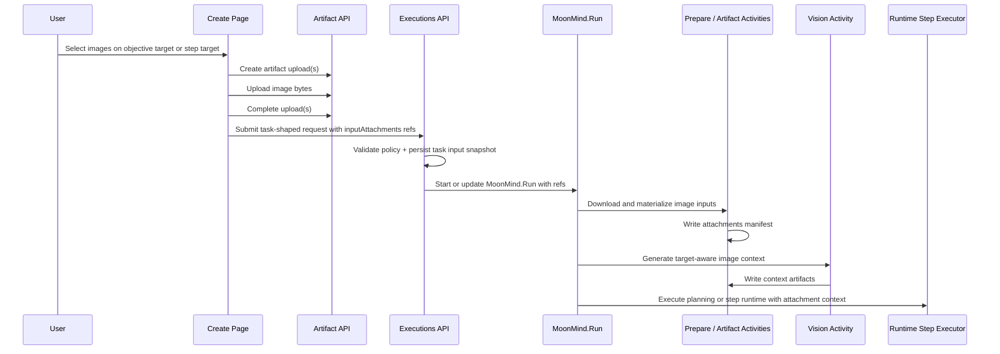

# Task Image Input System

Status: Proposed
Owners: MoonMind Engineering
Last updated: 2026-04-16

## 1. Purpose

This document defines the canonical desired-state contract for image inputs in MoonMind task executions.

The system exists to let users:

- attach images to the task objective target or to individual steps from the Create page
- store uploaded bytes securely in the Artifact Store
- submit lightweight artifact references into `MoonMind.Run`
- preserve attachment targeting through create, edit, and rerun flows
- generate deterministic image-derived context for text-first runtimes
- materialize raw image bytes into the workspace when a runtime or step requires direct file access
- preview and download task images through MoonMind-owned APIs

This document is declarative. It defines the target system contract. It is not a rollout log.

---

## 2. Related docs

- `docs/UI/CreatePage.md`
- `docs/Tasks/TaskArchitecture.md`
- `docs/Temporal/TemporalArchitecture.md`
- `docs/Temporal/WorkflowTypeCatalogAndLifecycle.md`
- `docs/Temporal/ArtifactPresentationContract.md`

---

## 3. Product stance and terminology

### 3.1 Product stance

MoonMind is artifact-first.

Rules:

- uploaded image bytes must not be embedded in Temporal histories
- uploaded image bytes must not be embedded directly in task instruction text
- the control plane submits structured attachment references, not raw binaries
- derived image summaries are secondary artifacts; they do not replace the source image refs
- attachment targeting is explicit and durable

### 3.2 Canonical terminology

The canonical control-plane field name is `inputAttachments`.

The default Create-page attachment policy currently authorizes image MIME types, so the product may label the UI as `Images` while still using the generic `inputAttachments` contract.

Canonical target kinds:

- **objective-scoped attachment**: a ref submitted through `task.inputAttachments`
- **step-scoped attachment**: a ref submitted through `task.steps[n].inputAttachments`

Canonical reference shape:

```ts
interface TaskInputAttachmentRef {
  artifactId: string;
  filename: string;
  contentType: string;
  sizeBytes: number;
}
```

Canonical prepared-manifest shape:

```ts
interface AttachmentManifestEntry {
  artifactId: string;
  filename: string;
  contentType: string;
  sizeBytes: number;
  targetKind: "task" | "step";
  stepRef?: string;
  stepOrdinal?: number;
  workspacePath: string;
  visionContextPath?: string;
  sourceArtifactPath?: string;
}
```

Rules:

- target meaning comes from the field that contains the ref
- attachment identity does not depend on filename conventions
- image context generation must preserve target meaning

---

## 4. End-to-end desired-state flow



Rules:

- upload completes before create, update, or rerun submission is accepted
- the execution API persists the authoritative snapshot of attachment targeting
- workflow prepare is responsible for deterministic local materialization and manifest generation
- runtime adapters consume structured refs and derived context, not browser-local state

---

## 5. Control-plane contract

### 5.1 Canonical submission path

The canonical submit path is task-shaped execution submission through `/api/executions`.

Rules:

- image inputs are submitted through the task-shaped Temporal execution API
- legacy queue-specific attachment submission routes are not the desired-state contract
- all browser upload and download flows remain behind MoonMind-owned API endpoints

### 5.2 Canonical task contract

Representative task-shaped payload:

```json
{
  "type": "task",
  "payload": {
    "repository": "owner/repo",
    "task": {
      "instructions": "Resolved task objective text.",
      "inputAttachments": [
        {
          "artifactId": "art_objective_123",
          "filename": "overview.png",
          "contentType": "image/png",
          "sizeBytes": 48213
        }
      ],
      "steps": [
        {
          "id": "step-1",
          "instructions": "Inspect the screenshot and identify the issue.",
          "inputAttachments": [
            {
              "artifactId": "art_step1_456",
              "filename": "bug.png",
              "contentType": "image/png",
              "sizeBytes": 72109
            }
          ]
        }
      ]
    }
  }
}
```

Rules:

- `task.inputAttachments` is the objective-scoped attachment target
- `task.steps[n].inputAttachments` is the step-scoped attachment target
- the API must preserve target scoping through create, edit, and rerun
- attachment refs are normalized before the workflow starts

### 5.3 Authoritative snapshot contract

The original task input snapshot is the source of truth for edit and rerun reconstruction.

Rules:

- the snapshot must preserve:
  - text fields
  - target attachment refs
  - step identity and order
  - runtime, publish, and repository settings
  - applied preset metadata
- attachment target binding is reconstructed from the snapshot, not inferred from artifact links alone
- the system must fail explicitly rather than silently discarding attachment bindings during reconstruction

---

## 6. Artifact model and storage contract

Image inputs are first-class artifacts.

Rules:

- image bytes are stored in the Artifact Store
- each submitted image is linked to the execution with an execution-owned artifact link
- artifact link metadata may include target diagnostics, but execution payload and snapshot remain the authoritative source of target binding
- worker-side uploads must not overwrite or impersonate input attachments in reserved namespaces

Canonical properties:

- supported content types come from attachment policy, with image types as the default desired-state allowlist
- `image/svg+xml` remains forbidden
- integrity is enforced at artifact completion time
- retention follows the execution’s artifact retention policy unless overridden by a more specific policy

Recommended artifact metadata keys:

- `source: "task-create"`
- `attachmentKind: "input"`
- `targetKind: "task" | "step"`
- `stepRef`
- `stepOrdinal`
- `originalFilename`

Rules:

- metadata is helpful for observability but not the source of truth for binding
- target binding must still be derivable from the task snapshot even if metadata is incomplete

---

## 7. Validation and policy contract

Attachment policy is server-defined and browser-enforced, then revalidated server-side.

Rules:

- allowed content types are checked before upload and again when the API finalizes the artifact
- signature sniffing must confirm the content is a supported image type
- max count, per-file size, and total size limits are enforced
- uploads with invalid or incomplete content are rejected before execution start
- caption hints or other future fields that are not yet supported must fail fast rather than being silently ignored

Representative policy shape:

```json
{
  "enabled": true,
  "maxCount": 10,
  "maxBytes": 10485760,
  "totalBytes": 26214400,
  "allowedContentTypes": [
    "image/png",
    "image/jpeg",
    "image/webp"
  ]
}
```

Rules:

- if the policy is disabled, image input entry points must be hidden and no image refs may be accepted from the Create page
- if the policy is enabled but a runtime later cannot consume images, the create path must fail explicitly rather than silently dropping them

---

## 8. Prepare-time materialization contract

Workflow prepare owns deterministic local file materialization.

Rules:

- prepare downloads all declared input attachments before the relevant runtime or step executes
- prepare writes a canonical manifest at:

```text
.moonmind/attachments_manifest.json
```

- prepare writes raw files into stable target-aware locations:

```text
.moonmind/inputs/task/<artifactId>-<sanitized-filename>
.moonmind/inputs/steps/<stepRef>/<artifactId>-<sanitized-filename>
```

- target-aware workspace paths must be deterministic
- the workspace path for one target must not depend on any unrelated target’s attachment ordering

Rules:

- objective-scoped attachments are materialized under `.moonmind/inputs/task/`
- step-scoped attachments are materialized under `.moonmind/inputs/steps/<stepRef>/`
- if a step has no explicit `id`, the control plane or prepare layer must assign a stable step reference for manifest and path purposes
- partial materialization is a failure, not a best-effort success

---

## 9. Vision context generation contract

Image-derived text context is generated as a deterministic secondary artifact.

Rules:

- context generation is target-aware
- context generation may be enabled or disabled by runtime configuration
- when disabled, manifest generation and raw file materialization still occur
- generated text must remain traceable back to the source image artifact refs

Desired-state output paths:

```text
.moonmind/vision/task/image_context.md
.moonmind/vision/steps/<stepRef>/image_context.md
.moonmind/vision/image_context_index.json
```

Rules:

- objective-scoped images produce objective-scoped context
- step-scoped images produce step-scoped context
- the index artifact summarizes what context exists for which target
- generated context may include OCR, captions, and safety notes, but must remain deterministic and auditable for a given source image set and model configuration

---

## 10. Prompt and runtime injection contract

### 10.1 Text-first runtimes

Text-first runtimes consume image context through an injected `INPUT ATTACHMENTS` block.

Rules:

- the `INPUT ATTACHMENTS` block appears before `WORKSPACE`
- the block references:
  - relevant workspace paths
  - relevant manifest entries
  - relevant generated context paths
- step execution receives only:
  - objective-scoped attachment context
  - the current step’s attachment context
- non-current step attachment context is not injected into a step unless the runtime or planner explicitly requests cross-step access

### 10.2 Planning and task-level reasoning

Rules:

- task-level planning receives objective-scoped attachment context
- planning may also receive a compact inventory of step-scoped attachments so the planner understands later-step inputs without flattening them into the current step context
- planning does not need full raw bytes for attachments that belong to later steps unless a planner-specific runtime explicitly requires them

### 10.3 Multimodal runtimes

Rules:

- multimodal adapters may choose to consume raw image refs directly
- this does not change the control-plane contract
- the same artifact refs, target bindings, and prepare-time manifest remain the source of truth
- direct provider payload construction is a runtime-adapter concern, not a Create-page concern

---

## 11. UI preview and detail contract

Task detail, edit, and rerun surfaces may preview and download image inputs.

Rules:

- previews and downloads go through MoonMind-owned API endpoints
- previews are organized by target:
  - objective-scoped
  - step-scoped
- the UI must not infer target binding from filenames
- preview failure must not remove access to metadata or download actions
- edit and rerun surfaces must distinguish persisted attachments from new local files not yet uploaded

---

## 12. Authorization and security contract

Security boundaries are artifact-first and execution-owned.

Rules:

- end-user preview and download are governed by execution ownership and view permissions
- the browser receives short-lived presigned download URLs or MoonMind proxy responses; it does not receive long-lived object-store credentials
- worker-side access uses service credentials and execution authorization, not browser credentials
- the system must not trust text extracted from images as executable instructions unless the authored task explicitly chooses to use it
- images remain untrusted user input

Rules:

- no direct browser access to object storage
- no direct browser access to Jira or provider-specific file endpoints
- no scriptable image types
- no hidden compatibility transforms that silently rewrite attachment refs or retarget them to another step

---

## 13. Edit and rerun durability contract

Rules:

- create, edit, and rerun all use the same authoritative attachment contract
- unchanged attachment refs survive edit and rerun unchanged
- removing an attachment is explicit
- adding a new attachment is explicit
- an attachment must never disappear merely because the browser reconstructed a text-only draft
- historical source artifacts may continue to exist under retention policy even after the edited draft no longer references them

---

## 14. Observability and diagnostics contract

The image input system must expose enough evidence to debug failures without reading raw workflow history heuristics.

Recommended event classes:

- attachment upload started
- attachment upload completed
- attachment validation failed
- prepare download started
- prepare download completed
- prepare download failed
- image context generation started
- image context generation completed
- image context generation failed

Rules:

- attachment manifest path and generated context paths should be discoverable from task diagnostics
- task detail and debugging surfaces should expose target-aware attachment metadata
- step-level failures must identify the affected step target

---

## 15. Non-goals

The desired-state image system does not require:

- embedding raw image bytes in execution create payloads
- embedding images into instruction markdown as data URLs
- implicit attachment sharing across steps
- live Jira sync
- generic non-image attachment types by default
- provider-specific multimodal message formats as the control-plane contract

---

## 16. Summary

The desired-state image system is simple in principle:

1. the Create page binds images to an explicit target
2. MoonMind stores those images as artifacts
3. the execution API preserves the binding in the task contract and authoritative snapshot
4. workflow prepare materializes the files and generates target-aware image context
5. runtimes consume only the context that belongs to the objective or step they are executing

That is the canonical contract.
