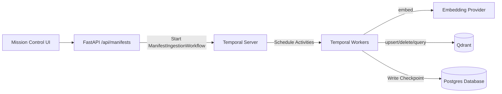

# Manifest Task System (Ingest Manifests via Temporal Workflows)

Status: Draft (implementation-ready)
Owners: MoonMind Engineering
Last Updated: 2026-03-14

## 1. Purpose

Define how MoonMind ingests **manifest-defined data pipelines** using **Temporal Workflows** rather than the legacy task queuing systems so that:

- Manifest ingestion runs are triggered, monitored, cancelled, and audited natively in Temporal.
- The Mission Control UI can interact with Manifest workflows as a first-class **category** (separate from agent chat workflows).
- Ingestion is deterministic and declarative: **validate → fetch → transform → embed → upsert (+ delete)** mapped to Temporal Activities.
- Ingestion is observable (events + artifacts) and safe (no raw secrets in payloads/logs).

This design intentionally reuses:
- Temporal workflow execution guarantees (retries, timeouts, Heartbeating).
- Existing v0 manifest foundations (YAML schema, interpolation patterns, operator docs).
- “Worker direct data plane” guidance (Qdrant + embeddings).

## 2. Background / Current Repo State

### 2.1 What exists today
- Legacy manifest schema (`apiVersion/kind/spec.readers`) in `moonmind/schemas/manifest_models.py`.
- Loader + interpolation + runner in `moonmind/manifest/*`.
- DB table `manifest` (`ManifestRecord`) + `ManifestSyncService` (hash detect + run readers) but no indexing pipeline.
- “v0 manifest” examples and operator guide in `docs/LlamaIndexManifestSystem.md`.

### 2.2 What is missing
- No dedicated Temporal Workflow (`ManifestIngestionWorkflow`) for executing manifest ingestion.
- No v0 execution engine that maps pipeline stages (validate → fetch → transform → embed → upsert) to scalable Temporal Activities.
- No explicit idempotency/deletion rules enforced at the Temporal workflow layer.

## 3. Goals and Non-Goals

### 3.1 Goals
1. Provide a **Temporal Workflow** (`ManifestIngestionWorkflow`) that:
   - Controls the pipeline stages.
   - Streams progress via Temporal signals or Activity heartbeats.
   - Supports safe cancellation mapping to Activity cancellation.
2. Support **v0 manifests** as defined in `docs/LlamaIndexManifestSystem.md`.
3. Keep workflow input payloads **token-free**: only allow env references, profile references, and/or secret references (Vault) — never raw API keys.
4. Make manifest runs visible in the Mission Control UI.
5. Make runs **idempotent**:
   - stable point IDs
   - incremental updates
   - deletions (when documents disappear or are replaced)
6. Add **checkpointing** tracking per-source execution states so incremental sync is possible and resumable.

### 3.2 Non-Goals (for this document)
- Implementing every v0 feature (hybrid retrieval, rerankers, full evaluation suite) in the first increment.
- Full multi-tenant isolation and fine-grained ACL enforcement on vector indices (can be layered later).
- Replacing existing `/v1/documents/*` ingestion endpoints immediately (they remain functional side-by-side).

## 4. Key Concepts

**Manifest (v0)**
A YAML document describing ingestion sources, transforms, embeddings, vector store target, and optional retrieval configuration.

**Manifest Run**
A single Temporal execution of `ManifestIngestionWorkflow`.

**Control Plane vs Data Plane**
- Control plane: Temporal workflow start, status, signals, cancellation.
- Data plane: embeddings + vector store upserts/deletes (worker direct to Qdrant via Activities).

**Source Document ID**
A stable identifier for a logical document in a source system (e.g., Confluence page ID, Drive file ID, GitHub path@ref).

**Point ID**
A stable identifier for a vector entry (a chunk/node) in Qdrant. Must be deterministic to support upsert and deletion.

**Checkpoint**
Per-(manifest,dataSource) state capturing what was last indexed so subsequent Temporal workflow executions can do incremental syncs.

## 5. High-Level Architecture



## 6. Workflow Inputs and Capabilities

### 6.1 Workflow execution parameters
The execution of the Temporal workflow receives parsed, validation-checked settings. 

Client request payload to REST API:

```json
{
  "manifest": {
    "name": "confluence-eng",
    "action": "run",
    "source": {
      "kind": "inline",
      "content": "version: \"v0\"\nmetadata:\n  name: confluence-eng\n..."
    },
    "options": {
      "dryRun": false,
      "forceFull": false,
      "maxDocs": null
    }
  }
}
```

The FastAPI layer submits the `ManifestIngestionWorkflow` to Temporal using normalized arguments (meaning the raw YAML is hashed and cached, so the Workflow doesn't exceed Temporal history limits loading multi-megabyte YAML files if not necessary). Target capability routing (Task Queues) routes the Workflow to an appropriate worker node equipped with data connectors.

### 6.2 Precedence of Options
v0 manifests include a `run:` block (concurrency/batchSize/etc). Temporal inputs also include `options`.
- `options` MAY override run-control fields only (`dryRun`, `forceFull`, `maxDocs`).
- `options` MUST NOT override structural fields (`dataSources`, `embeddings`, `vectorStore`).

## 7. Manifest Execution Engine (v0, declarative)

### 7.1 Package layout
Create a dedicated v0 engine mapping to Temporal Activities:

* `moonmind/manifest_v0/workflows.py` (`ManifestIngestionWorkflow`)
* `moonmind/manifest_v0/activities/` (Activities for validation, fetch, transform, embed, upsert)
* `moonmind/manifest_v0/models.py` (Pydantic models)
* `moonmind/manifest_v0/id_policy.py` (stable point-id construction)
* `moonmind/manifest_v0/state_store.py` (checkpoint read/write)

### 7.2 Idempotency, upserts, and deletions (required)

#### 7.2.1 Stable point IDs
Define point IDs deterministically so repeated runs overwrite the same points:

```
point_id = sha256(
  manifest_name + "|" +
  data_source_id + "|" +
  source_doc_id + "|" +
  str(chunk_index) + "|" +
  bindings
)
```

#### 7.2.2 Checkpointing and state persistence
Checkpoint state is per `(manifest.name, dataSource.id)` and MUST include:

* last successful run timestamp
* last processed cursor (if the source supports it)
* map of `source_doc_id -> doc_hash`

Temporal Activities save this checkpoint directly to the central Postgres registry after successfully upserting target point IDs to Qdrant.

## 8. Cancellation

Temporal provides robust native cancellation. If a user cancels the manifest run via the UI:

1. Temporal broadcasts cancellation to the `ManifestIngestionWorkflow`.
2. The Workflow propagates cancellation to the currently running Activity (e.g. `EmbedDocumentsActivity`).
3. The Activity stops processing the batch, commits the partial checkpoint of what was *already* upserted, and gracefully errors out.

## 9. Security Model

### 9.1 No raw secrets in Temporal History
Temporal inputs MUST NOT contain raw keys/tokens.
Allowed reference patterns:
* `${ENV_VAR}` references (resolved by worker runtime env)
* Profile references (resolved by the Workflow/Activity fetching the integration secret locally at runtime)
* Vault secret references

### 9.2 Secret resolution modes
* **Env mode**: Worker reads provider keys from its own environment variables.
* **Profile mode**: Temporal activity requests the secret from local DB or Vault utilizing the reference immediately prior to performing the API call.

## 10. Delivery Plan

### Phase 0: Foundations
1. Implement `ManifestIngestionWorkflow` skeleton and Temporal test suite.
2. Add minimal `/api/manifests` registry endpoints (GET/PUT) to store text YAML bodies.

### Phase 1: Engine Pipeline
1. Implement Activities for GitHub, Drive, Confluence, Local FS data fetchers.
2. Implement chunking and deterministic embeddings Activities.
3. Wire stable IDs + delete-by-filter semantics for Qdrant Activities.

### Phase 2: User Interface
1. Add Mission Control Temporal view for Workflow monitoring.
2. Form view for launching Manifest executions.
