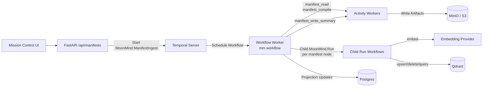

# Manifest Task System (Ingest Manifests via Temporal Workflows)

Status: Draft (implementation-ready)
Owners: MoonMind Engineering
Last Updated: 2026-03-17

## 1. Purpose

Define how MoonMind ingests **manifest-defined data pipelines** using **Temporal Workflows** so that:

- Manifest ingestion runs are triggered, monitored, cancelled, and audited natively in Temporal.
- The Mission Control UI can interact with Manifest workflows as a first-class **category** (separate from agent chat workflows).
- Ingestion is deterministic and declarative: **validate → compile → fan-out → finalize** mapped to Temporal Activities and child Workflow Executions.
- Ingestion is observable (events + artifacts) and safe (no raw secrets in payloads/logs).

This design intentionally reuses:
- Temporal workflow execution guarantees (retries, timeouts, Heartbeating).
- Existing v0 manifest foundations (YAML schema, interpolation patterns, operator docs).
- "Worker direct data plane" guidance (Qdrant + embeddings).

### 1.1 Related docs

- `docs/Temporal/TemporalArchitecture.md` — deployment shape, migration phases, container reference
- `docs/Temporal/WorkflowTypeCatalogAndLifecycle.md` — `MoonMind.ManifestIngest` lifecycle (§4.1, §11.2)
- `docs/Temporal/ActivityCatalogAndWorkerTopology.md` — activity catalog and worker fleet topology
- `docs/Manifests/LlamaIndexManifestSystem.md` — v0 manifest schema, examples, and operator guide

## 2. Background / Current Repo State

### 2.1 What exists today

**Manifest schema and contract layer:**
- Legacy manifest schema (`apiVersion/kind/spec.readers`) in `moonmind/schemas/manifest_models.py`.
- Manifest ingest Pydantic models (`CompiledManifestPlanModel`, `ManifestNodeModel`, `ManifestStatusSnapshotModel`, `ManifestIngestSummaryModel`, etc.) in `moonmind/schemas/manifest_ingest_models.py`.
- Manifest contract validation and normalization (`normalize_manifest_job_payload`, `derive_required_capabilities`, `detect_manifest_secret_leaks`, `collect_manifest_secret_refs`) in `moonmind/workflows/agent_queue/manifest_contract.py`.

**Temporal workflow implementation:**
- `MoonMind.ManifestIngest` workflow in `moonmind/workflows/temporal/manifest_ingest.py`, implementing:
  - Manifest compilation (read + compile via Activities)
  - DAG-aware fan-out execution with concurrency control
  - Child `MoonMind.Run` workflow spawning per manifest node
  - Failure policy enforcement (`fail_fast` / `continue`)
  - Six Temporal Updates (`UpdateManifest`, `SetConcurrency`, `Pause`, `Resume`, `CancelNodes`, `RetryNodes`)
  - Summary and run-index artifact generation on finalization
- Lightweight workflow variant in `moonmind/workflows/temporal/workflows/manifest_ingest.py` for simplified compile-and-summarize flows.

**Legacy data layer:**
- Loader + interpolation + runner in `moonmind/manifest/*`.
- DB table `manifest` (`ManifestRecord`) + `ManifestSyncService` (hash detect + run readers).
- Manifest registry endpoints (`/api/manifests`, `/api/manifests/{name}`, `/api/manifests/{name}/runs`).

### 2.2 What is missing

- Full Activity implementations for data fetchers (GitHub, Drive, Confluence, Local FS) behind manifest node child workflows.
- End-to-end Qdrant upsert/delete Activities for the embed → index pipeline.
- Mission Control UI views for manifest workflow monitoring and launch.

## 3. Goals and Non-Goals

### 3.1 Goals
1. Provide a **Temporal Workflow** (`MoonMind.ManifestIngest`) that:
   - Compiles a manifest into a DAG of executable nodes.
   - Fans out node execution via child `MoonMind.Run` workflows with concurrency control.
   - Streams progress via Temporal Updates and Search Attribute/Memo updates.
   - Supports safe cancellation, pause/resume, and mid-flight manifest updates.
2. Support **v0 manifests** as defined in `docs/Manifests/LlamaIndexManifestSystem.md`.
3. Keep workflow input payloads **token-free**: only allow env references, profile references, and/or secret references (Vault) — never raw API keys.
4. Make manifest runs visible in the Mission Control UI via Temporal Visibility.
5. Make runs **idempotent**:
   - stable node IDs derived from manifest content
   - incremental updates via manifest hash comparison
   - delete semantics when documents disappear or are replaced
6. Add **artifact-backed state tracking** (summary, run-index, checkpoint artifacts) so incremental sync is possible and resumable.

### 3.2 Non-Goals (for this document)
- Implementing every v0 feature (hybrid retrieval, rerankers, full evaluation suite) in the first increment.
- Full multi-tenant isolation and fine-grained ACL enforcement on vector indices (can be layered later).
- Replacing existing `/v1/documents/*` ingestion endpoints immediately (they remain functional side-by-side).

## 4. Key Concepts

**Manifest (v0)**
A YAML document describing ingestion sources, transforms, embeddings, vector store target, and optional retrieval configuration.

**Manifest Run**
A single Temporal execution of `MoonMind.ManifestIngest`.

**Compiled Plan**
The output of manifest compilation (`CompiledManifestPlanModel`): a DAG of `ManifestPlanNodeModel` entries with dependencies, required capabilities, and runtime hints. Produced by the `manifest_compile` Activity.

**Manifest Node**
A single data source entry from the compiled plan, materialized as a `ManifestNodeModel` with lifecycle state (`pending` → `ready` → `running` → `succeeded`/`failed`/`canceled`).

**Control Plane vs Data Plane**
- Control plane: Temporal workflow start, Updates, cancellation, Visibility queries.
- Data plane: embeddings + vector store upserts/deletes (worker direct to Qdrant via Activities within child `MoonMind.Run` workflows).

**Execution Policy**
Per-workflow configuration controlling `failurePolicy` (`fail_fast`, `continue_and_report`, or `best_effort`) and `maxConcurrency` (1–500, default 50).

## 5. High-Level Architecture



## 6. Workflow Inputs and Capabilities

### 6.1 Workflow execution parameters

The `MoonMind.ManifestIngest` workflow receives the following parameters:

```json
{
  "manifestArtifactRef": "art_01JABC...",
  "action": "run",
  "requestedBy": { "type": "user", "id": "user-123" },
  "executionPolicy": {
    "failurePolicy": "fail_fast",
    "maxConcurrency": 50
  },
  "planArtifactRef": null,
  "manifestNodes": []
}
```

Key fields:
- `manifestArtifactRef` (required): Artifact reference to the manifest YAML stored in MinIO. The workflow reads manifest content via the `manifest_read` Activity — raw YAML is never inlined in workflow history.
- `action`: `"run"` or `"plan"` (default `"run"`).
- `requestedBy`: Immutable owner identity, validated against the workflow's `mm_owner_id` Search Attribute.
- `executionPolicy`: Controls concurrency and failure behavior.
- `planArtifactRef` + `manifestNodes`: Optional pre-compiled plan for resumption or re-execution.

### 6.2 Precedence of Options
v0 manifests include a `run:` block (concurrency/batchSize/etc). Temporal inputs also include `executionPolicy`.
- `executionPolicy` MAY override run-control fields only (`failurePolicy`, `maxConcurrency`).
- `executionPolicy` MUST NOT override structural fields (`dataSources`, `embeddings`, `vectorStore`).

## 7. Manifest Execution Engine

### 7.1 Module layout

The manifest ingest implementation is organized across these modules:

| Module | Responsibility |
|---|---|
| `moonmind/workflows/temporal/manifest_ingest.py` | `MoonMind.ManifestIngest` workflow, projection helpers, plan compilation, summary builders, all 6 Updates |
| `moonmind/workflows/temporal/workflows/manifest_ingest.py` | Lightweight workflow variant for compile-and-summarize flows |
| `moonmind/workflows/agent_queue/manifest_contract.py` | Manifest YAML validation, normalization, capability derivation, secret leak detection, secret ref collection |
| `moonmind/schemas/manifest_ingest_models.py` | Pydantic models: `CompiledManifestPlanModel`, `ManifestPlanNodeModel`, `ManifestNodeModel`, `ManifestStatusSnapshotModel`, `ManifestIngestSummaryModel`, `ManifestRunIndexModel`, `ManifestExecutionPolicyModel`, `RequestedByModel` |
| `moonmind/schemas/manifest_models.py` | Legacy manifest schema models |
| `moonmind/manifest/*` | Legacy loader, interpolation, runner, sync service |

### 7.2 Pipeline stages

The workflow executes the following stages:

1. **Initialize**: Validate `manifestArtifactRef`, resolve `requestedBy` against workflow owner metadata, normalize execution policy.
2. **Compile**: If no pre-compiled plan is provided:
   - `manifest_read` Activity — reads manifest YAML from the artifact store.
   - `manifest_compile` Activity — validates YAML via `normalize_manifest_job_payload`, derives required capabilities, computes manifest hash, produces a `CompiledManifestPlanModel` with stable node IDs and dependency edges.
3. **Materialize nodes**: Convert compiled plan nodes to runtime `ManifestNodeModel` entries with initial state `ready`.
4. **Execute (fan-out)**: For each ready node (respecting dependency ordering and concurrency limits):
   - Spawn a child `MoonMind.Run` workflow with the node's parameters, linked to the parent via `manifestIngestWorkflowId` and `nodeId`.
   - Track child state transitions (`running` → `succeeded`/`failed`).
   - Apply failure policy: `fail_fast` cancels remaining nodes on first failure; `continue` proceeds.
5. **Finalize**: Execute `manifest_write_summary` Activity to produce summary and run-index artifacts.

### 7.3 Idempotency and stable node IDs

Node IDs are derived deterministically from manifest content:

```python
node_id = f"node-{sha256(json.dumps(data_source, sort_keys=True))[:12]}"
```

This ensures that repeated runs against the same manifest produce the same node graph, enabling:
- Stable child workflow IDs (`{workflow_id}:{run_id}:{node_id}`)
- Idempotent artifact linkage
- Meaningful diff detection between manifest versions

### 7.4 Manifest hash and version tracking

The manifest contract computes a content-addressable hash:

```
manifestHash = sha256:{hex_digest_of_yaml_content}
```

Combined with `manifestVersion` (currently `v0`), this provides:
- Change detection for incremental sync decisions
- Audit trail for which manifest version produced which run
- Safe retry semantics (same hash = same behavior)

### 7.5 Artifact-backed state

Manifest runs produce three key artifacts:

| Artifact | Description |
|---|---|
| Summary (`summaryArtifactRef`) | `ManifestIngestSummaryModel` — workflow state, phase, counts, failed node IDs |
| Run Index (`runIndexArtifactRef`) | `ManifestRunIndexModel` — per-node state, child workflow/run IDs, result artifact refs |
| Checkpoint (`checkpointArtifactRef`) | Per-(manifest, dataSource) state for incremental sync resumption |

These are referenced via memo fields and stored in MinIO via the artifact Activities.

## 8. Updates and Signals

The `MoonMind.ManifestIngest` workflow implements six Temporal Updates for interactive control:

### 8.1 Updates

| Update | Purpose | Key Parameters | Apply Mode |
|---|---|---|---|
| `UpdateManifest` | Replace the manifest mid-flight with a new version | `newManifestArtifactRef`, `mode` (`APPEND` or `REPLACE_FUTURE`) | `next_safe_point` (applied when no nodes are running) |
| `SetConcurrency` | Adjust the maximum parallel node execution count | `maxConcurrency` (1–500) | `immediate` |
| `Pause` | Pause node scheduling (running nodes complete) | — | `immediate` |
| `Resume` | Resume paused execution | — | `immediate` |
| `CancelNodes` | Cancel specific nodes by ID | `nodeIds[]` | `immediate` (pending/ready set to canceled; running tasks cancelled) |
| `RetryNodes` | Re-queue failed or canceled nodes | `nodeIds[]` | `immediate` (state reset to `pending`) |

### 8.2 UpdateManifest modes

- **`APPEND`**: Add new nodes from the updated manifest without modifying existing nodes. Fails if any new node IDs collide with existing ones.
- **`REPLACE_FUTURE`**: Replace all `pending`/`ready` nodes with the new manifest's plan. Running, succeeded, and failed nodes are preserved.

### 8.3 Signals

Standard `MoonMind.ManifestIngest` does not currently define custom Signals. External events (e.g., webhooks) that need to interact with manifest runs should be routed through the MoonMind API layer, which translates them into Updates.

## 9. Cancellation

Temporal provides robust native cancellation. If a user cancels the manifest run via the UI or API:

1. The MoonMind API requests Temporal cancellation for the `MoonMind.ManifestIngest` workflow.
2. The workflow cancels all pending/ready nodes (setting state to `canceled`).
3. Running child `MoonMind.Run` workflows receive cancellation via `ParentClosePolicy.REQUEST_CANCEL`.
4. The workflow transitions to `finalizing`, writes summary/index artifacts, and completes with `canceled` status.

For granular cancellation, use the `CancelNodes` Update to cancel specific nodes without terminating the entire workflow.

## 10. Security Model

### 10.1 No raw secrets in Temporal History
Temporal inputs and workflow history MUST NOT contain raw keys/tokens.
Allowed reference patterns:
* `${ENV_VAR}` references (resolved by worker runtime env)
* `profile://provider#field` references (resolved by the Activity fetching the integration secret at runtime)
* `vault://mount/path#field` references (resolved via Vault at runtime)

The manifest contract (`manifest_contract.py`) enforces this at validation time via `detect_manifest_secret_leaks`, which scans all manifest values for:
- Known sensitive field names (`api_key`, `token`, `password`, etc.)
- Suspect value prefixes (`sk-`, `ghp_`, `AKIA`, etc.)
- JWT patterns and base64-encoded secrets

### 10.2 Secret reference collection
`collect_manifest_secret_refs` extracts and deduplicates all `profile://` and `vault://` references from the manifest, producing a `manifestSecretRefs` map that workers use to resolve credentials at Activity execution time.

## 11. Delivery Plan

### Phase 0: Foundations ✅
1. ~~Implement `MoonMind.ManifestIngest` workflow skeleton and Temporal test suite.~~
2. ~~Add minimal `/api/manifests` registry endpoints (GET/PUT) to store text YAML bodies.~~
3. ~~Implement manifest contract validation and normalization.~~
4. ~~Implement compiled plan model and node materialization.~~
5. ~~Implement all 6 Temporal Updates for interactive control.~~
6. ~~Implement projection and snapshot system for API queries.~~

### Phase 1: Engine Pipeline (in progress)
1. Implement Activities for GitHub, Drive, Confluence, Local FS data fetchers behind child `MoonMind.Run` workflows.
2. Implement chunking and deterministic embeddings Activities.
3. Wire stable IDs + delete-by-filter semantics for Qdrant Activities.
4. Implement checkpoint read/write for incremental sync.

### Phase 2: User Interface
1. Add Mission Control manifest workflow list/detail views via Temporal Visibility.
2. Form view for launching manifest executions.
3. Node-level status and progress display.
4. Interactive Update controls (pause/resume, cancel nodes, retry nodes, update manifest).
