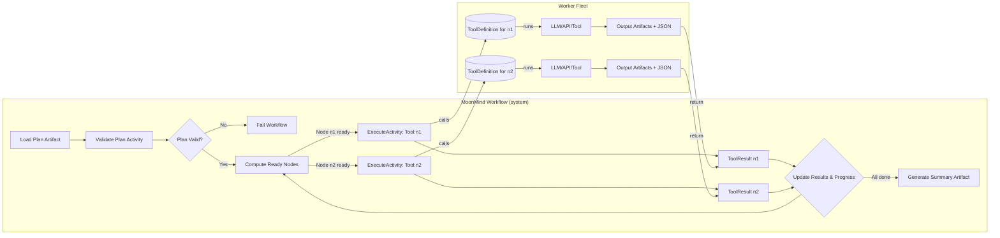

# Skill & Plan Design Evolution (MoonMind & Temporal)

**Implementation tracking:** [`docs/tmp/remaining-work/Tasks-SkillAndPlanEvolution.md`](../tmp/remaining-work/Tasks-SkillAndPlanEvolution.md)

**Executive Summary:** The MoonMind system uses **tools** and **plans** atop Temporal to manage agent tasks. A *Tool* (`ToolDefinition`) is a named capability with input/output schemas, execution bindings, retries, etc. (not a workflow). A *Plan* is a DAG of tool invocations (Steps) with explicit dependencies and policies. This design leverages Temporal's deterministic workflows (orchestration) vs activities (side-effects). The codebase has completed a rename from `Skill*` to `Tool*` for Temporal contract objects; the term "Skill" is now reserved for agent instruction bundles (`.agents/skills/SKILL.md` files).

## Current MoonMind Tool & Plan Contracts

MoonMind's **ToolDefinition** (in a registry) includes `name`, `version`, JSON schemas for inputs/outputs, executor binding, capability requirements, and default policies (timeouts, retries). A Step (plan node) is a JSON node with a unique `id`, tool name+version, inputs, and optional overrides. The **Plan** format is a JSON object with a DAG: an array of `nodes` (each a Step) and `edges` listing dependencies. Large inputs/outputs (plans, artifacts, transcripts) are stored outside the workflow; workflows and activities carry only opaque `artifact_ref`s. MoonMind emphasizes **determinism boundaries**: workflow code is purely orchestration (no nondeterministic calls), while tools (activities) do all external I/O. Progress is tracked via structured counters (nodes pending/running/succeeded/failed) and exposed by Temporal queries and optional progress artifacts.

### Observed Gaps and Characteristics

- **Versioning & Pinning:** Plans carry a `registry_snapshot` (digest + artifact) to pin tool versions. This ensures reproducibility (plan re-runs see the same tool definitions).
- **Error Model:** Tools return a structured `ToolResult` with status, small JSON outputs, list of `output_artifacts`, and optional progress info. Failures use a standard schema (`error_code`, `message`, `retryable`, etc.), driving retry logic (e.g. `non_retryable_error_codes` in the tool def).
- **Policies & Retries:** Default activity timeouts/retries come from ToolDefinition, with overrides allowed within safe bounds. Retry is "at least once" by default (Temporal will retry until success), so **Activities must be idempotent or side-effects safe**.

Overall, the current spec is thorough. However, implementation is greenfield: we must enforce these contracts in code. For example, a "plan.validate" activity should enforce JSON-schema and DAG invariants. Worker fleets must honor `requirements.capabilities` to route tools to the right task queue. Telemetry (StatsD, logs) is mentioned in older docs and should be extended to Temporal metrics and search attributes.

## Best Practices (Temporal + Agent Orchestration)

**Deterministic Orchestration:** Temporal requires deterministic workflow logic; it excels at *orchestration* and state durability. As MoonMind's doc states, "Workflow code orchestrates only. No nondeterministic behavior in workflow code. All external I/O and LLM calls are Activities". This aligns perfectly with Temporal guidance: workflows replay reliably using past decisions, while non-deterministic AI calls live in Activities. Thus, tool invocation and plan execution belong in Activities, while the plan executor (in the Workflow) only schedules nodes, updates progress, and applies failure policies.

**Idempotency & Retries:** By default Temporal will retry an Activity on failure (up to `max_attempts`). We must design Tools so that **re-running an Activity is safe or idempotent**. For example, writing to a DB should use unique keys or check existing records (idempotency keys). Activities like `mm.tool.execute` can compute an idempotency key (e.g. `workflowRunId-activityId`) and skip duplicate side-effects. We should make clear in the Tool contract how Activities achieve idempotency (e.g. through transactional design or dedup keys). Non-idempotent logic should raise retriable vs non-retriable errors appropriately, consistent with our `ToolFailure` codes.

**Observability:** Temporal supports *Query* calls and Search Attributes for workflows. MoonMind's progress model (nodes pending/succeeded etc.) should be exposed via a Workflow Query (as planned). We should also register relevant Search Attributes (e.g. plan title, status) so operators can list workflows. Periodic progress snapshots (the `progress.json` artifact) can be supplemented by logs or metrics. We should instrument key events (node started, succeeded, failed) with logs and metrics (e.g. StatsD or OpenTelemetry). Temporal workers can emit metrics (like how many tools executed, failures, latencies), possibly tagged by tool name/version.

**Failure Modes & Concurrency:** The plan policy allows `failure_mode: FAIL_FAST` or `CONTINUE`. The interpreter must implement these: e.g. on a node failure, either cancel all (fail-fast) or let independent branches finish (continue). Concurrency (`max_concurrency`) caps parallel tool executions. In code, we can track ready nodes and only schedule up to N. If using the Temporal Python SDK, we might fan-out activities or even spawn child workflows to parallelize branches.

**Data Contracts & Validation:** All inputs/outputs use JSON Schema. We must enforce these at runtime: a validation Activity (`plan.validate`) should deeply check that plan nodes, tool parameters, and references are correct. The workflow itself can do quick checks (IDs unique, acyclic, etc.). Plans and tools should be versioned: e.g. `"plan_version": "1.0"` in the plan schema. Future versions can add fields (like conditions) with version checks. The contract should specify that newer fields are ignored in v1.

## Terminology Alternatives

MoonMind currently uses **Skill** and **Plan**. Comparable systems use varied terms (skills, tools, capabilities, actions, tasks). We compare options:

| Term (Skill) | Pros | Cons |
| -------------- | -------------------------------------------- | --------------------------------------- |
| **Skill** (current) | Matches Claude/AutoGen terminology. Conveys "capability." | Some may confuse with human "skill." |
| **Capability** | Emphasizes what agent **can do**. Neutral technical term. | Less common in LLM agent literature; buzzwordy. |
| **Action** | Generic and simple. Connotes a function call. | Too generic; clashes with planning "action" semantics. |
| **Operator** | Suggests an executable operator. | Confusing; often means transformation or company name. |
| **Task** (node) | Common term for a unit of work. | Clashes with Temporal task queues. |
| **Tool/Action** (like LangChain) | Implies simple API. | MoonMind tools are richer (schemas, versions, etc.). |
| **Function** | Technical, clear. | Loses AI agent flavor. |
| **Service/Activity** | Overlaps with Temporal terms. | Might confuse users. |

| Term (Plan) | Pros | Cons |
| --------------- | ----------------------------------------- | ------------------------------------------- |
| **Plan** (current) | Reflects agent planning. Neutral. | Might overlap with "workflow" notion. |
| **Workflow** | Aligns with term "workflow" (implicitly a DAG). | Conflicts with Temporal Workflow. |
| **Recipe/Process** | Conveys a set of steps; intuitive metaphor. | Less standard in AI agents. |
| **Pipeline** | Suggests data flow; used in ETL contexts. | Implies linear flow. |
| **TaskGraph** | Explicitly hints at DAG of tasks. | Clunky; not common jargon in AI. |
| **Blueprint** | Nice metaphor (plan blueprint). | Non-technical. |

## Recommendations & Migration Strategy

- **Schema & Contracts:** Implement strict JSON-schema validation for Tools and Plans. Use a central **Tool Registry loader** that validates required fields (name, version, I/O schemas, executor, policies). On startup, register a digest of the tool set for snapshot pinning. Store plans as versioned artifacts.

- **Plan Execution (Workflow):** Write the Plan Executor as a Temporal Workflow (`MoonMind.Run`). Pseudocode:

  ```python
  @workflow.defn
  async def RunPlanWorkflow(ctx, plan_ref: ArtifactRef):
      plan = await activities.load_plan(plan_ref)
      validate_plan_structure(plan)
      ready = find_ready_nodes(plan)
      running = {}
      while not all_nodes_done(plan):
          for node in ready:
              if len(running) < plan.policy.max_concurrency:
                  running[node.id] = workflow.execute_activity(
                      tool_dispatcher,
                      node.tool.name, node.tool.version, node.inputs,
                      timeouts=node.options.timeouts_override,
                      retry_options=node.options.retries_override,
                  )
          done, _ = await workflow.wait_any(running.values())
          for node_id, fut in running.items():
              if fut in done:
                  result = await fut
                  store_result(node_id, result)
                  update_progress_metrics(node_id, result)
                  running.pop(node_id)
                  for succ in plan.dependents(node_id):
                      if deps_satisfied(succ):
                          ready.add(succ)
                  break
      return summarize_execution()
  ```
  (A **Dispatcher Activity** `mm.tool.execute` routes to the actual tool implementation based on worker capability).

- **Activity Design:** Each tool invocation becomes one Activity. The default activity type (`mm.tool.execute`) handles generic invocation: it looks up the `ToolDefinition` (from the snapshot), validates inputs, performs the operation (LLM, API call, etc.), writes any artifacts, and returns a `ToolResult` (status, outputs, artifact refs). For special cases, some tools may bind to custom activity types (e.g. `artifact.read`, `integration.github.call`) for isolation. Activities must catch exceptions and wrap them into our `ToolFailure` format (error code, message) to inform retry policies. Use idempotency keys inside Activities to avoid duplicate side-effects.

- **Concurrency & Failure Policy:** Implement max concurrency by tracking how many nodes are currently running. Enforce **FAIL_FAST** by canceling outstanding activities when one fails, or **CONTINUE** by letting independent branches finish and collecting failures.

- **Observability & Telemetry:** Expose a Workflow Query for progress. Emit logs/metrics at key points (node start/completion, pipeline end). Map each plan/workflow to identifiable search attributes.

- **Security & Access:** The ToolDefinition includes `allowed_roles` -- during invocation, check caller identity and forbid unauthorized usage. Ensure that Activity workers run in isolated environments if needed (e.g. sandboxed container for risky tools).

- **Versioning & Migration:** Since plans pin a tool registry snapshot, we can evolve tool schemas by introducing new versions without breaking old plans. Existing running workflows will continue using the old registry snapshot for consistency.

- **Data-driven Agent Patterns:** Frame planning itself as a Tool (e.g. `plan.generate`) that outputs a Plan artifact. This fits the idea that agents use LLMs/algorithms to propose multi-step plans, which are then executed deterministically.

## Naming: Completed Rename (Skill to Tool)

> **Status: Implemented.** The codebase has been renamed from `Skill*` to `Tool*` for Temporal contract objects.
> The term "Skill" is now reserved for agent instruction bundles (`.agents/skills/` SKILL.md files).

| Concept | Canonical Term | Legacy Alias | Notes |
|----------|---------------|-------------|-------|
| Temporal contract object | `ToolDefinition` | `SkillDefinition` | Backward-compat alias exported |
| Execution result | `ToolResult` | `SkillResult` | Backward-compat alias exported |
| Failure envelope | `ToolFailure` | `SkillFailure` | Backward-compat alias exported |
| Plan node | `Step` | `SkillInvocation` | Backward-compat alias exported |
| Execution policies | `ToolPolicies` | `SkillPolicies` | Backward-compat alias exported |
| Agent instruction bundle | "Skill" (`.agents/skills/SKILL.md`) | n/a | NOT a Temporal contract |
| Execution DAG | **Plan** | n/a | Unchanged |

The rename clarifies a longstanding ambiguity: "skill" in `.agents/skills/` (agent-readable markdown instructions) vs "skill" in the Temporal plan/dispatch layer (typed contract objects). These are now distinct:

* **Tool** = Temporal contract with schemas, policies, executor binding (`ToolDefinition`)
* **Skill** = Agent instruction markdown (`SKILL.md`) that AI agents read for guidance

Two dispatch paths exist for plan nodes:

| `tool.type` | Dispatch | Contract |
|---|---|---|
| `skill` | Temporal Activity (`mm.tool.execute`) | `ToolDefinition` from registry snapshot |
| `agent_runtime` | Child `MoonMind.AgentRun` workflow | `AgentExecutionRequest` |

## Engineering roadmap

The platform converges on a **registry-backed tool set**, **`plan.validate`**, a **deterministic interpreter** in `MoonMind.Run`, **`mm.tool.execute` dispatch**, **progress queries**, **metrics**, and **role-aware security**. Sequencing and gap list: [`docs/tmp/remaining-work/Tasks-SkillAndPlanEvolution.md`](../tmp/remaining-work/Tasks-SkillAndPlanEvolution.md).

## Diagram: Plan Execution (Mermaid)

This illustrates the workflow reading a plan, validating it, then in rounds scheduling ready nodes (activities). Each activity uses a ToolDefinition to invoke the actual work (LLM or integration), producing a `ToolResult` that the workflow collects.

## Conclusion

MoonMind's tool-and-plan framework aligns with modern agent orchestration practice: modular tools, data-driven plans, and durable execution via Temporal. By enforcing strong schemas, idempotent activities, and clear interfaces we ensure reliability. The terminology now distinguishes **Tools** (Temporal contract objects) from **Skills** (agent instruction bundles), eliminating a prior source of confusion.
