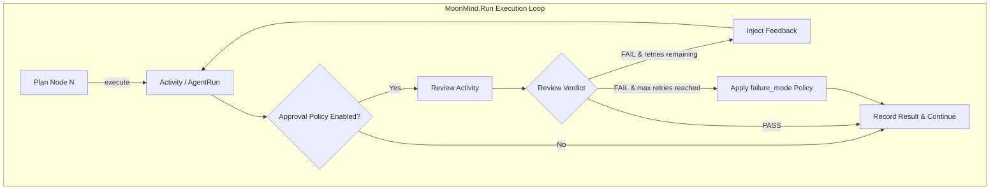

# Step Approval Policy System

Status: **Design Draft**
Owners: MoonMind Engineering
Last Updated: 2026-03-18
Related: `docs/Tasks/SkillAndPlanContracts.md`, `docs/Tasks/TasksStepSystem.md`, `docs/Tasks/TaskArchitecture.md`

---

## 1. Summary

An optional **approval policy** that, when enabled, injects an automated validation step after every plan-node execution in `MoonMind.Run`. An LLM-powered reviewer agent evaluates whether the step's output satisfies the aims described in its inputs. If the review fails, the step is retried with structured feedback about what went wrong.

The feature is designed as a **toggle** — when enabled, the system automatically wraps every eligible step in a review-retry loop without requiring any changes to the plan itself. Non-idempotent tools (e.g., publish steps that create PRs) are exempt by default to prevent duplicate side effects.

---

## 2. Goals & Non-Goals

### Goals

- **Automatic injection**: Operators toggle the feature on; the approval policy appears after every step transparently.
- **LLM-powered review**: A dedicated review activity evaluates step outputs against step inputs/aims using an LLM.
- **Retry with feedback**: Failed reviews feed structured diagnostics back to the step, allowing it to self-correct.
- **Bounded retries**: Configurable max review attempts per step to prevent runaway cost.
- **Observable**: Review verdicts, retries, and feedback are visible in Mission Control and workflow history.
- **Composable with existing policy**: Works alongside `failure_mode` (`FAIL_FAST` / `CONTINUE`), approval gates, and `MoonMind.AgentRun`.

### Non-Goals

- Human-in-the-loop review (already exists via approval signals).
- Replacing Temporal's native activity retry policy (approval policy operates at a higher semantic level).
- Conditional plan branching based on review output (reserved for future conditional-edge support).

---

## 3. Architecture Overview



---

## 4. Data Model Changes

### 4.1 PlanPolicy Extension

Add optional approval policy configuration to the existing `PlanPolicy` contract.

```python
@dataclass(frozen=True, slots=True)
class ApprovalPolicyPolicy:
    """Per-plan approval policy configuration."""

    enabled: bool = False
    max_review_attempts: int = 2          # retries per step (excluding initial)
    reviewer_model: str = "default"       # LLM model for the reviewer
    review_timeout_seconds: int = 120     # timeout for each review activity
    skip_tool_types: tuple[str, ...] = DEFAULT_SKIP_TOOL_TYPES  # tool types to exempt

# Default skip list — non-idempotent tools that must not be blindly retried
DEFAULT_SKIP_TOOL_TYPES = ("repo.publish", "codex.execute")
```

Add to `PlanPolicy`:

```diff
 @dataclass(frozen=True, slots=True)
 class PlanPolicy:
     failure_mode: str = "FAIL_FAST"
     max_concurrency: int = 1
+    approval_policy: ApprovalPolicyPolicy | None = None  # None = not specified in plan
```

### 4.2 Plan JSON Schema Extension

```json
{
  "policy": {
    "failure_mode": "FAIL_FAST",
    "max_concurrency": 1,
    "approval_policy": {
      "enabled": true,
      "max_review_attempts": 2,
      "reviewer_model": "default",
      "review_timeout_seconds": 120,
      "skip_tool_types": []
    }
  }
}
```

When `approval_policy` is absent or `enabled` is `false`, behavior is identical to today.

### 4.3 Review Activity Input / Output Contracts

**ReviewRequest** — input to the review activity:

```json
{
  "node_id": "n1",
  "step_index": 1,
  "total_steps": 5,
  "review_attempt": 1,
  "tool": { "type": "skill", "name": "repo.apply_patch", "version": "2.1.0" },
  "inputs": { "...original step inputs..." },
  "execution_result": {
    "status": "SUCCEEDED",
    "outputs": { "...step outputs..." },
    "output_artifacts": []
  },
  "workflow_context": {
    "workflow_id": "...",
    "run_id": "...",
    "plan_title": "Fix failing tests"
  },
  "previous_feedback": null
}
```

**ReviewVerdict** — output from the review activity:

```json
{
  "verdict": "PASS",
  "confidence": 0.92,
  "feedback": null,
  "issues": []
}
```

```json
{
  "verdict": "FAIL",
  "confidence": 0.85,
  "feedback": "The patch was applied but the test suite still has 3 failing tests. The step outputs show all files were changed, but the error in stderr_tail indicates a missing import.",
  "issues": [
    {
      "severity": "error",
      "description": "Missing import statement for 'datetime' in utils.py",
      "evidence": "stderr_tail: ImportError: cannot import name 'datetime'"
    }
  ]
}
```

Verdict values: `PASS`, `FAIL`, `INCONCLUSIVE`.

- `PASS` → step is accepted; proceed.
- `FAIL` → step should be retried with feedback (if retries remain).
- `INCONCLUSIVE` → treated as `PASS` (conservative; don't block on uncertainty).

---

## 5. Execution Flow

### 5.1 Modified Execution Loop (in `_run_execution_stage`)

The existing node-iteration loop in `MoonMind.Run._run_execution_stage()` wraps each node in a review-retry cycle when the gate is enabled.

**Pseudocode:**

```python
for index, node in enumerate(ordered_nodes, start=1):
    approval_policy = plan_definition.policy.approval_policy
    gate_active = (
        approval_policy.enabled
        and node_tool_type not in approval_policy.skip_tool_types
    )

    previous_feedback = None
    max_attempts = (approval_policy.max_review_attempts + 1) if gate_active else 1

    for attempt in range(1, max_attempts + 1):
        # Build step input, injecting feedback from prior review if present
        step_input = build_step_input(node, previous_feedback)

        # Execute the step (activity or child workflow)
        execution_result = await execute_node(step_input)

        if not gate_active:
            break  # No review — accept result as-is

        # Run the review activity (including on the final attempt)
        review_verdict = await execute_review_activity(
            node=node,
            inputs=step_input,
            result=execution_result,
            attempt=attempt,
            previous_feedback=previous_feedback,
        )

        if review_verdict["verdict"] in ("PASS", "INCONCLUSIVE"):
            break  # Step accepted

        # FAIL — if retries remain, prepare feedback for retry
        if attempt < max_attempts:
            previous_feedback = review_verdict["feedback"]
            self._summary = (
                f"Step {index}/{len(ordered_nodes)} review failed "
                f"(attempt {attempt}), retrying with feedback."
            )
        else:
            # Final attempt also failed review — apply failure_mode policy
            self._handle_step_failure(
                node, execution_result, review_verdict,
                f"Step {index} failed review after {max_attempts} attempts"
            )
```

### 5.2 Feedback Injection

When a step is retried after a failed review, the feedback is injected into the step inputs as an additional context field:

```json
{
  "...original inputs...",
  "_review_feedback": {
    "attempt": 1,
    "feedback": "The patch was applied but tests still fail...",
    "issues": [...]
  }
}
```

For **skill-type** steps, the `_review_feedback` is passed as an additional input field. The skill executor can use it to augment the LLM prompt.

For **agent_runtime** steps (`MoonMind.AgentRun`), the feedback is appended to the instruction text:

```
[Original instruction]

---
REVIEW FEEDBACK (attempt 1): The previous execution did not fully succeed.
[Feedback text]
Please address the above issues in this attempt.
```

### 5.3 Step-Level vs. Agent-Internal Review

This system operates at the **orchestration level** (between plan steps). It does not interfere with agent-internal reasoning loops within a `MoonMind.AgentRun` execution. The review evaluates the final output of each plan step against the aims expressed in that step's inputs.

---

## 6. Review Activity

### 6.1 Activity Registration

```yaml
name: "step.review"
version: "1.0.0"
type: "skill"
description: "LLM-powered review of step execution output against input aims."
executor:
  activity_type: "mm.tool.execute"
  selector:
    mode: "by_capability"
requirements:
  capabilities:
    - "llm"
policies:
  timeouts:
    start_to_close_seconds: 120
    schedule_to_close_seconds: 300
  retries:
    max_attempts: 2
    backoff: "exponential"
    non_retryable_error_codes:
      - "INVALID_INPUT"
```

### 6.2 Activity Implementation

The `step.review` activity:

1. Constructs a review prompt from the `ReviewRequest` payload.
2. Calls the configured reviewer LLM model.
3. Parses the LLM response into a structured `ReviewVerdict`.
4. Returns the verdict.

**Review Prompt Template (simplified):**

```
You are a code review agent for MoonMind. Your job is to evaluate whether a 
workflow step achieved its intended outcome.

## Step Information
- Tool: {tool_name} v{tool_version}
- Step {step_index} of {total_steps} in plan "{plan_title}"

## Step Inputs (what the step was asked to do)
{json_inputs}

## Step Outputs (what the step produced)  
{json_result}

## Previous Feedback (if retrying)
{previous_feedback or "N/A"}

## Your Task
Evaluate whether the step output satisfies the aims described in the inputs.

Respond with JSON:
{
  "verdict": "PASS" | "FAIL" | "INCONCLUSIVE",
  "confidence": <0.0-1.0>,
  "feedback": "<explanation if FAIL>",
  "issues": [{"severity": "error|warning", "description": "...", "evidence": "..."}]
}
```

### 6.3 Routing

The review activity routes to the **LLM activity fleet** (`mm.activity.llm`), leveraging the existing model routing infrastructure. The `reviewer_model` policy controls which model is used (allowing a cheaper, faster model for reviews vs. the agent's primary model).

---

## 7. Configuration & Toggle Points

### 7.1 Plan-Level (Primary)

The `policy.approval_policy` block in the plan JSON. This is the most precise control.

### 7.2 Workflow-Level (API Parameter)

The `initialParameters` payload when starting a `MoonMind.Run` can include a approval policy override:

```json
{
  "initialParameters": {
    "approvalPolicy": {
      "enabled": true,
      "maxReviewAttempts": 3
    }
  }
}
```

**Precedence**: Plan-level `approval_policy` configuration takes full precedence when **present** in the plan JSON (regardless of value). Workflow-level and env-var defaults only apply when the plan **omits** the `approval_policy` block entirely.

- Plan has `approval_policy` → use plan's config (even if `enabled: false`)
- Plan omits `approval_policy` + workflow has `approvalPolicy` → use workflow config
- Both omit → use `MOONMIND_APPROVAL_POLICY_DEFAULT_ENABLED` env var
- All omit → approval policy is disabled

> **Implementation note**: The plan parser must distinguish "plan omitted `approval_policy`" (→ `None`) from "plan explicitly set `approval_policy`" (→ `ApprovalPolicyPolicy`). Use `Optional[ApprovalPolicyPolicy]` on `PlanPolicy.approval_policy` with `None` meaning "not specified".

### 7.3 Environment Variable (Default)

`MOONMIND_APPROVAL_POLICY_DEFAULT_ENABLED=false` — sets the system-wide default when neither plan nor workflow-level configuration is present. Off by default.

### 7.4 Mission Control UI Toggle

The task creation form gains a toggle:

- **"Enable Step Approval Policy"** checkbox (off by default)
- Expanding section with optional overrides (max attempts, reviewer model)

The toggle maps to the `approvalPolicy` field in `initialParameters`.

---

## 8. Observability

### 8.1 Memo Updates

During review cycles, the workflow memo updates to reflect:

```
"Executing plan step 2/5: repo.apply_patch (review attempt 2/3)"
```

### 8.2 Search Attributes

Add `mm_approval_policy_active` (bool) search attribute for filtering in Temporal Visibility and Mission Control.

### 8.3 Mission Control Terminal Widget

Review verdicts are emitted to the Mission Control live output as scoped blocks:

```
───── Approval Policy: step n1 (attempt 1) ─────
Verdict: FAIL (confidence: 0.85)
Issues:
  [error] Missing import statement for 'datetime' in utils.py
Feedback: The patch was applied but the test suite still has 3 failing tests...
Retrying step with feedback...
────────────────────────────────────────────
```

### 8.4 Finish Summary Integration

The `reports/run_summary.json` includes approval policy metrics:

```json
{
  "approvalPolicy": {
    "enabled": true,
    "stepsReviewed": 5,
    "totalReviewAttempts": 8,
    "passedFirstAttempt": 3,
    "passedAfterRetry": 1,
    "failedAfterMaxRetries": 1
  }
}
```

---

## 9. Cost & Safety Controls

### 9.1 Budget Guardrails

- `max_review_attempts` bounds retry cost per step (default: 2 retries).
- `review_timeout_seconds` prevents runaway reviews.
- The reviewer uses a configurable model — operators can choose a cheaper model (e.g., `gemini-flash`) for reviews.
- Total review activity count is bounded by `max_review_attempts × number_of_steps`.

### 9.2 Interaction with Existing Policies

| Existing Policy | Interaction |
|---|---|
| `failure_mode: FAIL_FAST` | If a step fails all review attempts, `FAIL_FAST` halts the workflow. |
| `failure_mode: CONTINUE` | If a step fails all review attempts, execution continues to the next step. |
| Temporal retry policy | Temporal retries handle transient infrastructure errors. Review gate handles semantic/correctness failures. They operate at different levels. |
| Approval gates | Review gate runs before any approval gate. A step must pass review before reaching an approval checkpoint. |
| `MoonMind.AgentRun` 429 retry | The 429 retry in `AgentRun` is internal to that workflow. The approval policy evaluates the final output of the child workflow. |

### 9.3 Skip List

`skip_tool_types` allows exempting certain tool types from review.

**Default skip list** (always exempt unless explicitly removed):

- `repo.publish` — creates branches/PRs; retrying would create duplicates
- `codex.execute` — publishes PRs via `publishMode: pr`; non-idempotent

**Common additional exemptions**:

- Infrastructure tools (`artifact.read`, `artifact.write`)
- Planning tools (`plan.generate`) — the plan itself is validated separately
- Quick utility steps where review overhead exceeds step cost

---

## 10. Determinism & Temporal Safety

### 10.1 Determinism Compliance

The review activity is a standard Temporal Activity — all nondeterministic behavior (LLM calls) runs inside the activity, not in workflow code.

### 10.2 Replay Safety

The review-retry loop is fully deterministic:
- Loop bounds are derived from `approval_policy.max_review_attempts` (frozen in the plan policy).
- Review verdicts are recorded in Temporal workflow history as activity results.
- Feedback strings are deterministic (they come from recorded activity results).

### 10.3 History Size

Each review adds one activity result to the workflow history. With a default of 2 review attempts per step, worst case adds `2 × N` activities (where N is step count). For most plans (< 20 steps), this is well within Temporal's recommended history limits.

---

## 11. Implementation Layers

### Layer 1: Data Model (contracts + parsing)

| File | Change |
|---|---|
| `moonmind/workflows/skills/tool_plan_contracts.py` | Add `ApprovalPolicyPolicy` dataclass, extend `PlanPolicy`, update `parse_plan_definition()` |

### Layer 2: Review Activity

| File | Change |
|---|---|
| `moonmind/workflows/temporal/activities/step_review.py` | **[NEW]** `step.review` activity implementation |
| `moonmind/workflows/temporal/activity_catalog.py` | Register `step.review` route |

### Layer 3: Workflow Execution Loop

| File | Change |
|---|---|
| `moonmind/workflows/temporal/workflows/run.py` | Wrap node loop in review-retry cycle in `_run_execution_stage()` |

### Layer 4: API & UI

| File | Change |
|---|---|
| `api_service/api/routers/executions.py` | Accept `approvalPolicy` in create-run payload, merge into `initialParameters` |
| `frontend/src/entrypoints/task-create.tsx` | Add approval policy toggle to task creation form |

### Layer 5: Observability

| File | Change |
|---|---|
| `moonmind/workflows/temporal/workflows/run.py` | Emit review verdicts to memo and terminal output |
| Finish summary logic | Include `approvalPolicy` metrics in `run_summary.json` |

---

## 12. Future Extensions

- **Per-node review overrides**: Allow individual plan nodes to opt in/out of review.
- **Review criteria customization**: Custom review prompts per step or per skill type.
- **Conditional edges post-review**: Use review output to drive plan branching (depends on conditional-edge support — §Q2 in SkillAndPlanContracts).
- **Review result caching**: Skip re-review on retry if only feedback injection changed (hash-based).
- **Human review escalation**: If `INCONCLUSIVE` confidence is below a threshold, escalate to a human approval gate.
