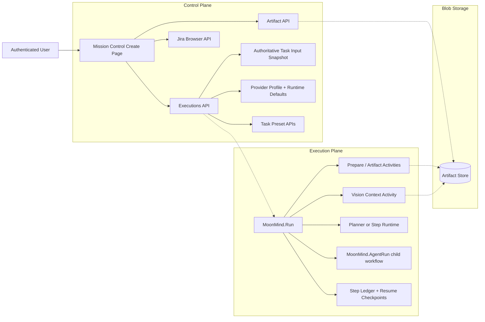

# Task Architecture (Control Plane)

Status: Active
Owners: MoonMind Engineering
Last updated: 2026-05-06

## 1. Purpose

This document defines the high-level desired-state control-plane architecture for MoonMind tasks.

It maps how the control plane translates user intent from Mission Control — including:

- task objective text
- step-authored instructions
- objective-scoped and step-scoped input attachments
- runtime and publish choices
- repository and single authored branch selection
- agent skill selection intent
- presets, Jira imports, and dependency declarations

into durable execution under Temporal.

This document is architectural and declarative. Detailed page behavior belongs in `docs/UI/CreatePage.md`. Detailed image-input behavior belongs in `docs/Tasks/ImageSystem.md`.

---

## 2. System snapshot

MoonMind uses a Temporal-backed execution model in which Mission Control acts as the control plane.

The control plane already centers on these product objects:

- `MoonMind.Run` as the standard task execution workflow
- first-class artifacts for large or binary inputs and outputs
- step-authored tasks rather than opaque queue jobs
- reusable task presets
- runtime and provider selection intent
- durable execution actions such as pause, resume, cancel, approve, and rerun

Desired-state additions clarified by this document:

- image inputs are first-class structured task inputs
- attachment targeting is explicit and durable
- presets are recursively composable authoring objects resolved entirely in the control plane
- create, edit, and rerun preserve attachment bindings through an authoritative task input snapshot
- submitted tasks preserve authored preset metadata and flattened step provenance alongside resolved execution payloads
- runtime preparation and prompt composition are target-aware rather than attachment-bucket-driven
- failed-task recovery has two explicit user workflows:
  - edit the task input and retry the whole task from the beginning
  - press **Resume** to retry the last failed step with the work completed before that step preserved
- failed-step resume depends on durable step ledgers, output refs, and workspace checkpoints rather than log parsing or UI reconstruction

---

## 3. Core architectural principles

### 3.1 Task-first control plane

The user authors tasks, not workflow internals.

Rules:

- the Create page defines user intent in task terms
- the control plane translates that task intent into execution-plane contracts
- the execution plane owns lifecycle progression, retries, waiting, and history

### 3.2 Artifact-first binary handling

Rules:

- binary inputs are stored as artifacts
- binary inputs are referenced in execution contracts by lightweight refs
- binary inputs are not embedded in workflow histories or text instructions

### 3.3 Explicit target binding

Rules:

- an input attachment must belong to an explicit target
- the supported target kinds are:
  - task objective target
  - step target
- target binding must survive create, edit, rerun, prepare, prompt composition, and detail rendering

### 3.4 Durable reconstruction

Rules:

- task input reconstruction uses an authoritative snapshot
- text-only reconstruction is insufficient for attachment-aware tasks
- silent loss of attachment bindings is a contract violation

### 3.5 Separation of text from structured inputs

Rules:

- instruction text remains text
- images remain structured inputs
- derived image context is a secondary artifact, not the instruction field itself

### 3.6 Failed-step resume is not full rerun

Rules:

- failed-task recovery has two separate workflows, and the user's chosen workflow is explicit
- **Edit and retry whole task** loads the original task snapshot into the authoring UI, permits edits, and starts execution from the beginning
- **Resume** does not open an authoring form; it retries the last failed step using the original task input and the durable work completed before that step
- Resume must never silently edit instructions, steps, attachments, runtime, publish mode, branch, dependencies, or preset metadata
- Resume is available only when the platform can identify the failed step and restore the work completed before it from durable evidence
- if the prior work cannot be restored faithfully, Resume must be unavailable or fail explicitly with an operator-readable reason

---

## 4. High-level architecture



Key boundary:

- the control plane owns authoring intent, artifact refs, target binding, runtime choice, preset compilation, and snapshot durability
- the execution plane owns lifecycle, step execution, step ledger state, and resume checkpoint production over already resolved payloads
- runtime adapters own provider-specific realization details

---

## 5. Control-plane responsibilities

The control plane is responsible for all of the following.

### 5.1 Authoring and validation

- render the Create page
- validate repository, runtime, publish mode, dependencies, and attachment policy
- collect text fields, preset state, Jira imports, and input attachments into a coherent draft
- render repository, Branch, and Publish Mode together in the Steps card. `Publish Mode` remains submission data; only its visual placement changes.

### 5.2 Artifact upload orchestration

- create upload intents through MoonMind artifact APIs
- upload browser-selected files before execution submission
- finalize artifact creation and reject incomplete uploads
- submit only structured attachment refs to the execution API

### 5.3 Task contract normalization

- normalize the task-shaped payload
- preserve `task.inputAttachments` and `task.steps[].inputAttachments`
- preserve step identity and order
- preserve runtime and publish intent
- preserve authored preset binding metadata, flattened step provenance, manual and preset-derived step order, and fully resolved execution payloads
- preserve Jira provenance when those contracts allow it

### 5.4 Preset compilation

Preset compilation is a control-plane phase that completes before execution contract finalization.

Rules:

- presets are authoring objects, not execution-plane instructions
- recursive preset composition is resolved in the control plane
- preset compilation validates the include tree before producing worker-facing steps
- compilation flattens manual and preset-derived steps into the final submitted order
- compilation preserves provenance for preset-derived steps and detached template state
- the resolved execution payload must remain executable without live preset catalog lookup

### 5.5 Snapshot durability

- persist an authoritative task input snapshot for edit and rerun
- reconstruct from that snapshot rather than from lossy derived projections
- preserve attachment target binding in the snapshot
- preserve pinned preset bindings, include-tree summary, per-step provenance, detachment state, and final submitted order in the snapshot

### 5.6 User-facing reads

- expose previews and downloads through MoonMind APIs
- surface attachment metadata by target in detail, edit, and rerun flows
- expose enough diagnostics for operators to understand attachment-related failures

### 5.7 Failed-task recovery orchestration

The control plane exposes distinct recovery actions instead of treating every recovery path as a generic rerun.

Rules:

- failed task details may expose **Edit task**, **Rerun**, and **Resume** as separate actions when their capability fields are true
- **Edit task** on a failed execution is the editable full retry path; submitting it creates a new execution from the beginning with a new authoritative task input snapshot
- **Rerun** is the exact full retry path; it starts from the beginning using the original task input without edits
- **Resume** is the failed-step recovery path; it starts a linked follow-up execution that imports completed prior progress and retries the last failed step
- Resume eligibility must be computed by the backend, not inferred by the UI
- Resume eligibility requires, at minimum:
  - an authoritative original task input snapshot
  - a pinned source `workflowId` and `runId`
  - a step ledger that identifies the last failed step
  - durable refs for all completed steps before the failed step
  - a workspace, branch, commit, or equivalent checkpoint representing the state immediately before the failed step
  - a plan identity or digest proving that the restored progress belongs to the same planned step graph
- Resume requests must be rejected explicitly when any required evidence is missing, stale, unauthorized, or inconsistent

---

## 6. Canonical task-shaped contract

Representative contract:

```ts
interface TaskInputAttachmentRef {
  artifactId: string;
  filename: string;
  contentType: string;
  sizeBytes: number;
}

interface TaskStepSource {
  kind?: "manual" | "preset-derived" | "preset-include" | "detached";
  presetId?: string;
  presetSlug?: string;
  version?: string;
  includePath?: string[];
  originalStepId?: string;
}

interface AuthoredPresetBinding {
  presetId?: string;
  presetSlug?: string;
  version?: string;
  alias?: string;
  includePath?: string[];
  inputMapping?: Record<string, unknown>;
  scope?: string;
}

interface TaskStepPayload {
  id?: string;
  title?: string;
  instructions?: string;
  inputAttachments?: TaskInputAttachmentRef[];
  source?: TaskStepSource;
  skill?: {
    id?: string;
    args?: Record<string, unknown>;
    requiredCapabilities?: string[];
  };
  skills?: {
    include?: Array<{ name: string }>;
  };
}

interface TaskPayload {
  instructions?: string;
  inputAttachments?: TaskInputAttachmentRef[];
  steps?: TaskStepPayload[];
  authoredPresets?: AuthoredPresetBinding[];
  runtime?: {
    mode?: string;
    profileId?: string;
    model?: string;
    effort?: string;
  };
  publish?: {
    mode?: "none" | "branch" | "pr";
  };
  git?: {
    branch?: string;
  };
  appliedStepTemplates?: unknown[];
  dependsOn?: string[];
}

type TaskRecoveryKind = "exact_full_rerun" | "edited_full_retry" | "resume_from_failed_step";

interface TaskRecoveryProvenance {
  kind: TaskRecoveryKind;
  sourceWorkflowId: string;
  sourceRunId: string;
  requestedBy?: string;
  requestedAt?: string;
}

interface ResumeFromFailedStepRef {
  kind: "resume_from_failed_step";
  sourceWorkflowId: string;
  sourceRunId: string;
  failedStepId: string;
  failedStepAttempt?: number;
  resumeCheckpointRef: string;
  taskInputSnapshotRef: string;
  planRef?: string;
  planDigest?: string;
}

interface TaskPayloadWithRecovery extends TaskPayload {
  recovery?: TaskRecoveryProvenance;
  resume?: ResumeFromFailedStepRef;
}
```

Rules:

- `task.inputAttachments` is the objective-scoped input target
- `task.steps[n].inputAttachments` is the step-scoped input target
- `task.authoredPresets` preserves optional preset binding metadata used to compile the submitted task
- `task.steps[n].source` preserves optional source provenance for manual, preset-derived, included, or detached steps
- these fields are part of the task contract, not incidental UI metadata
- the absence of attachments is valid
- the presence of attachments must be preserved across create, detail, edit, and rerun
- `task.git.branch` is the single authored branch field; new create, edit, and rerun payloads do not include `targetBranch`
- for `publish.mode === "pr"`, `task.git.branch` is the selected repository branch / PR base and the PR head branch is runtime-generated or provider-managed
- for `publish.mode === "branch"`, `task.git.branch` is the branch to update/push
- `Publish Mode` remains part of task submission semantics; only its Create page placement changes
- the execution-facing payload is resolved before workers consume it; `authoredPresets` and `source` metadata are for reconstruction, audit, diagnostics, and safe rerun semantics
- `task.recovery.kind === "edited_full_retry"` or `"exact_full_rerun"` means the new execution starts from the beginning
- `task.resume.kind === "resume_from_failed_step"` means the new execution must restore completed progress from `resumeCheckpointRef` and start at `failedStepId`
- resume provenance must include both `sourceWorkflowId` and `sourceRunId` so a resume is pinned to the exact source run and cannot drift when the logical execution later changes
- resume checkpoint refs are execution-state refs, not editable authoring fields

---

## 7. Snapshot, full retry, and Resume architecture

The original task input snapshot is the authoritative representation of the authored draft.

Rules:

- it must preserve:
  - task objective text
  - objective-scoped attachment refs
  - step text
  - step-scoped attachment refs
  - step order and identity
  - runtime and publish selections
  - repository and single authored branch selection
  - preset application metadata
  - pinned preset bindings
  - include-tree summary
  - per-step provenance
  - detachment state
  - final submitted order after manual and preset-derived steps are flattened
  - dependency declarations that remain part of the editable contract
- edit, exact full rerun, edited full retry, and Resume all depend on this snapshot for the original authored task input
- edit and full retry derive their initial browser state from this snapshot
- Resume reuses this snapshot without presenting it as an editable authoring surface
- edit, rerun, full retry, and Resume must not depend on current live preset catalog correctness to reconstruct already submitted work
- fallback evidence refs may assist diagnostics, but they are not an authoritative replacement for the snapshot
- an attachment-aware execution without a reconstructible snapshot is degraded and must be treated as such explicitly

### 7.1 Editable full retry

Editable full retry is the workflow used when the user wants to change the overall instructions or any other task input and then retry the task.

Rules:

- the Create page opens in edit-for-rerun mode from the authoritative task input snapshot
- the user may edit instructions, steps, attachments, runtime, publish mode, branch, presets, dependencies, and other authoring fields subject to normal validation
- submitting the form creates a new execution from the beginning
- the edited execution gets its own authoritative task input snapshot
- the original failed execution, its snapshot, step ledger, artifacts, and checkpoints remain immutable
- no completed execution progress is imported into the edited full retry

### 7.2 Exact full rerun

Exact full rerun is the workflow used when the user wants to retry the whole task with the same original task input.

Rules:

- the original task input snapshot is reused as the execution input
- the task starts from the beginning
- prepare, prompt composition, planning or plan hydration, and all steps run again according to the normal execution path
- no completed execution progress is imported from the failed source run

### 7.3 Resume from failed step

Resume is the workflow used when the user presses **Resume** on a failed task to retry the last failed step with the completed work up to that step preserved.

Rules:

- Resume is not an edit flow and must not allow task input changes in v1
- Resume pins the source execution with both `sourceWorkflowId` and `sourceRunId`
- Resume identifies the last failed step from the source run's step ledger
- Resume creates or resolves a `resumeCheckpointRef` that records the completed steps, their output refs, the prepared input refs, and the workspace or branch state immediately before the failed step
- the new execution imports completed prior steps as preserved progress rather than re-executing them
- the failed step is retried as a new attempt in the new execution
- later steps execute normally after the failed step succeeds
- the task detail view must show preserved prior steps as reused from the source run, not freshly executed by the resumed run
- if checkpoint restoration is incomplete, corrupted, unauthorized, or inconsistent with the original task input and plan digest, Resume must fail explicitly before executing the failed step

Representative resume checkpoint artifact:

```json
{
  "schemaVersion": "v1",
  "source": {
    "workflowId": "mm:source",
    "runId": "source-run-id"
  },
  "taskInputSnapshotRef": "art_original_task_snapshot",
  "planRef": "art_original_plan",
  "planDigest": "sha256:...",
  "failedStep": {
    "logicalStepId": "run-tests",
    "order": 4,
    "attempt": 1,
    "title": "Run test suite"
  },
  "preservedSteps": [
    {
      "logicalStepId": "apply-patch",
      "order": 3,
      "status": "succeeded",
      "sourceAttempt": 1,
      "outputRefs": {
        "outputSummary": "art_step_summary",
        "outputPrimary": "art_step_output"
      }
    }
  ],
  "resumeWorkspace": {
    "kind": "workspace_checkpoint",
    "ref": "art_workspace_before_failed_step"
  }
}
```

---

## 8. Execution-plane responsibilities

The execution plane consumes the normalized task contract after control-plane preset compilation has produced a resolved execution payload.

Rules:

- workers consume resolved steps and structured input refs
- workers do not expand presets
- workers do not read the live preset catalog to recover missing task structure
- workers do not depend on live preset catalog correctness for already submitted work

### 8.1 Workflow responsibilities

`MoonMind.Run` owns:

- durable state progression
- waiting, retry, and cancel semantics
- prepare-time attachment handling
- image context generation orchestration
- passing target-aware context into the relevant planner or step runtime
- preserving step ledger state and refs required for later Resume eligibility

### 8.2 Prepare responsibilities

Prepare owns:

- downloading objective-scoped and step-scoped attachments
- writing a canonical attachments manifest
- materializing raw files into stable workspace locations
- producing target-aware image context artifacts
- failing explicitly when attachment preparation is incomplete or invalid

### 8.3 Step execution responsibilities

Step execution owns:

- consuming task-level objective context when relevant
- consuming only the current step’s step-scoped image context by default
- avoiding accidental leakage of unrelated step attachments into the wrong step execution

### 8.4 Child workflow responsibilities

If a step is executed through `MoonMind.AgentRun`, the parent-child boundary must preserve target-aware prepared context.

Rules:

- parent workflow remains the source of truth for attachment target binding
- child workflows receive only the prepared context relevant to the child step
- child workflow logs and diagnostics do not redefine target binding semantics

### 8.5 Resume checkpoint responsibilities

The execution plane owns the durable evidence that makes Resume truthful.

Rules:

- after prepare succeeds, the workflow must record the prepared input refs needed to avoid repeating preparation during Resume when reuse is safe
- after each step succeeds, the workflow must record bounded step state and semantic output refs needed by downstream steps
- before or after each step boundary, the workflow must record a workspace, branch, commit, or equivalent state checkpoint when the runtime mutates working state
- checkpoint writes must be idempotent because activities and workflow tasks may retry
- checkpoint refs must remain outside large inline workflow histories when they are large or binary
- a completed step without recoverable output refs or state checkpoint evidence is not eligible for Resume preservation

### 8.6 Resume execution responsibilities

When a new execution starts with `task.resume.kind === "resume_from_failed_step"`, `MoonMind.Run` owns:

- loading and validating the resume checkpoint
- verifying the checkpoint source `workflowId`, `runId`, task snapshot, and plan identity
- materializing the restored workspace state before the failed step
- marking completed prior steps as preserved from the source run without re-executing them
- injecting preserved outputs so the failed step and downstream steps observe the same contracts as a continuous run
- retrying the failed step as the first newly executed step of the resumed execution
- producing fresh ledger rows, artifacts, and checkpoints for the retried failed step and all later steps

Rules:

- the execution plane must not silently fall back to full rerun behavior when Resume restoration fails
- the execution plane must not re-execute preserved prior steps unless a future UI explicitly asks for that behavior
- preserved rows must carry provenance back to the source `workflowId`, `runId`, logical step ID, and attempt

---

## 9. Artifact and authorization boundary

The artifact system is the binary boundary of the control plane.

Rules:

- the browser never receives long-lived object-store credentials
- user preview and download are authorized by execution ownership and view permissions
- worker-side download and materialization use service credentials and execution authorization
- artifact links are execution-scoped
- target binding is preserved by task contract and snapshot semantics, not inferred from storage paths alone

Recommended metadata may include:

- target kind
- step reference
- original filename
- source import path such as upload or Jira import

Rules:

- metadata is helpful for observability
- metadata must not be the only place where target meaning exists

---

## 10. Runtime and prompt boundary

The control plane does not dictate provider-native multimodal payloads.

Rules:

- the control plane passes normalized task intent plus artifact refs
- text-first runtimes consume generated image context through the canonical `INPUT ATTACHMENTS` contract
- multimodal runtimes may consume raw image refs through runtime adapters without changing the control-plane task contract
- runtime adapters must not invent new attachment targeting rules that the Create page cannot express

---

## 11. Invariants

The following invariants define the desired-state task system.

1. **No binary payloads in Temporal history**
   Image bytes do not belong in execution histories or inline create payload text.

2. **Explicit attachment targets**
   Every input attachment belongs either to the task objective target or to a declared step target.

3. **No silent attachment loss**
   Create, edit, rerun, and prepare must fail explicitly rather than silently dropping attachments.

4. **Text remains text**
   Instruction fields remain textual authoring surfaces. Images remain structured inputs.

5. **Snapshot-based durability**
   Attachment-aware edit and rerun require an authoritative task input snapshot.

6. **Compile-time preset composition**
   Preset composition is compile-time control-plane behavior. Submitted execution payloads must not require live preset lookup.

7. **Preset provenance durability**
   Task snapshots preserve pinned bindings, include-tree summary, per-step provenance, detachment state, and final submitted order.

8. **Server-defined policy**
   Attachment policy is defined by server configuration and enforced by both browser and API.

9. **MoonMind-owned browser APIs**
   The browser talks only to MoonMind APIs, not directly to Jira, object storage, or provider-specific file endpoints.

10. **Target-aware runtime consumption**
   By default, step execution receives only its own step-scoped attachment context plus relevant objective-scoped context.

11. **No hidden retargeting**
   Reordering steps, applying presets, or changing text must not silently retarget an existing attachment to another step.

12. **Compatibility without semantic drift**
   Compatibility aliases and migration layers may exist, but they must not change the canonical meaning of objective-scoped versus step-scoped attachments.

13. **Explicit recovery intent**
   Full rerun, edited full retry, and Resume are distinct intents. The system must not infer Resume from a generic rerun request.

14. **Resume preserves original inputs**
   Resume uses the original task input snapshot unchanged. Any user edit to instructions, steps, attachments, runtime, publish mode, branch, presets, or dependencies requires edited full retry instead.

15. **Resume requires checkpointed progress**
   Resume may be offered only when completed work before the failed step is recoverable from durable step refs and workspace or branch checkpoints.

16. **No silent re-execution of preserved steps**
   Resume must display and treat prior completed steps as preserved from the source run. Re-executing them without explicit user intent is a contract violation.

17. **Pinned resume source**
   Resume must pin both source `workflowId` and source `runId` so recovery cannot drift to a later run of the same logical execution.

---

## 12. Workload-specific behavior

### 12.1 `MoonMind.Run`

This is the canonical attachment-aware task workflow.

Rules:

- attachment-aware task authoring is defined against `MoonMind.Run`
- create, edit, rerun, and detail flows for attachment-aware tasks are all modeled in task-shaped `MoonMind.Run` terms
- `MoonMind.Run` is the canonical workflow that produces step ledger state and resume checkpoints for failed-step Resume
- `MoonMind.Run` may start from the beginning for full retry or start at a failed step when given a validated resume checkpoint
- checkpoint durability remains a parent `MoonMind.Run` responsibility even when an individual step delegates work to `MoonMind.AgentRun`

### 12.2 `MoonMind.AgentRun`

This child workflow may execute a specific step.

Rules:

- when used, it consumes prepared context for the step it represents
- it must not redefine or broaden its attachment scope beyond what the parent workflow prepared

### 12.3 Other workflow types

Other workflow types may reuse artifact infrastructure, but they do not redefine the Create-page attachment contract.

---

## 13. Observability and operator surfaces

The architecture must support operator understanding without requiring raw history parsing.

Rules:

- task detail should expose attachment metadata by target
- diagnostics should expose manifest and generated context refs where appropriate
- attachment failures should identify:
  - which target failed
  - whether the failure happened during upload, validation, materialization, or context generation
- step-aware surfaces should identify the current step’s attachment context separately from unrelated step inputs
- task detail should identify resumed executions and show preserved prior steps as reused from the source run
- diagnostics for failed Resume attempts should identify whether the failure happened during checkpoint validation, workspace restoration, preserved-output injection, or failed-step execution

---

## 14. Boundary with page-level and subsystem docs

Use this document to understand the architectural contract.

Use the related docs for detailed behavior:

- `docs/UI/CreatePage.md` for page sections, field behavior, Jira targeting, edit/rerun UX, and validation copy
- `docs/UI/TaskDetailsPage.md` for failed-task action presentation, including **Resume**
- `docs/Tasks/ImageSystem.md` for image-input upload, artifact storage, materialization, context generation, and preview/download behavior
- `docs/Tasks/AgentSkillSystem.md` for skill selection and resolution
- `docs/Temporal/TemporalArchitecture.md` for workflow lifecycle and worker topology
- `docs/Temporal/RunHistoryAndRerunSemantics.md` for Workflow ID, Run ID, full rerun, and Resume identity semantics
- `docs/Temporal/StepLedgerAndProgressModel.md` for step ledger, preserved-step, and resume checkpoint semantics

---

## 15. Summary

MoonMind’s control plane is task-first, artifact-first, and target-aware.

For image inputs that means:

- the user authors text and image inputs in one draft
- the control plane uploads and binds images to explicit targets
- the task contract and authoritative snapshot preserve those bindings
- the execution plane prepares and injects target-aware context
- detail, edit, and rerun surfaces can round-trip the same authored intent without semantic loss
- failed-task **Resume** can retry the last failed step only when durable checkpoints can restore the work completed before that step

That is the desired-state task architecture contract.
