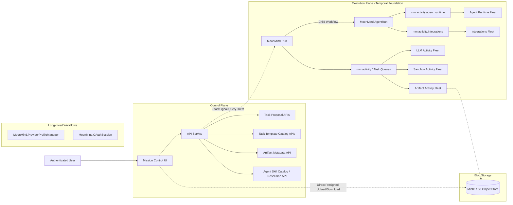

# Task Architecture (Control Plane)

Status: Active  
Owners: MoonMind Engineering  
Last Updated: 2026-04-04  

## 1. Purpose

This document defines the **high-level control plane architecture** of MoonMind's task system and Mission Control dashboard. 

It maps how the control plane translates user intentions in the Mission Control UI—specifically task instructions, artifacts, runtime choices, and **agent skill selection intent**—into the durable execution system backed by Temporal. 

Detailed UI behavior, route-level contracts, payload examples, and page interaction rules are documented natively in `docs/UI/MissionControlArchitecture.md`.
Detailed backend workflow execution logic is defined in `docs/Temporal/TemporalArchitecture.md` and `docs/Tasks/SkillAndPlanContracts.md`.
Detailed agent-skill storage, precedence, and workspace path rules live in `docs/Tasks/AgentSkillSystem.md`.

---

## 2. Current System Snapshot

MoonMind has transitioned from a raw queue/system dispatcher into a workflow-orchestrated system backed by **Temporal**. The Mission Control dashboard operates as the **Control Plane**, surfacing workflows to the user as "Tasks".

The current dashboard and backend API support:
- Workflow Executions for single commands (`MoonMind.Run`), manifest graphs (`MoonMind.ManifestIngest`), and agent lifecycle orchestration (`MoonMind.AgentRun` child workflows).
- First-class Artifact references (pointers passed from UI to the backend vs. raw embedded payloads).
- A task-detail model that reads execution overview plus a dedicated step-ledger surface instead of inferring step state from logs or timeline heuristics.
- Visual Task Proposals which can be reviewed by humans before formal promotion into new Temporal executions.
- Shared task preset/template catalogs for rapid workflow authoring.
- Operator actions (Pause, Resume, Cancel, Approve) dispatched via API as Temporal Signals/Updates.
- **Agent Skill Systems:** MoonMind uses a deployment-backed Agent Skill System where tasks carry explicit skill-selection intent, and the control plane resolves that intent into a run-scoped immutable skill context before execution.

---

## 3. High-Level Architecture

The API Service acts as the translation layer between the Mission Control UI (Task domain) and the Execution Plane (Temporal Workflow domain). All operations (read/write/signal) pass through this API.

### Key layers

- **UI Layer (Mission Control)**: Presents "Tasks" to the user, allowing for creation, monitoring, and interaction (e.g., approval gates, pausing work).
- **Control Plane API**: Maps UI requests to Temporal commands (Start Workflow, Send Signal) and manages domain concepts outside Temporal's scope (Proposals, Templates, Auth). This now heavily features agent skill selection, skill snapshot preparation, and passing only refs into execution.
- **Execution Plane (Temporal)**: Owns durable states and schedules Activities under role-based fleets. `MoonMind.Run` owns task-level step truth and progress, while true agent execution steps dispatch as `MoonMind.AgentRun` child workflows rather than plain activity invocations.
- **Blob Storage (Artifacts)**: Heavy data is stored out-of-band in an S3-compatible backend (MinIO). The UI and the Workflow exchange lightweight `ArtifactRef`s.

### Control-plane boundary

Task submit resolves selection intent into immutable refs. True agent lifecycle orchestration happens through `MoonMind.AgentRun` child workflows on the execution plane. The control plane does not drive agent lifecycle steps directly.

Boundary responsibilities:

- **Control plane** owns skill-selection intent, policy resolution, and snapshot preparation
- **Execution plane** owns durable lifecycle orchestration and state progression
- **Runtime adapters** own provider/runtime translation and canonical contract normalization

---

## 4. Control Plane Responsibilities

The Mission Control provides one place to:
- **Submit Work**: Send instructions, artifacts, runtime choices, and explicit skill-selection intent into the API, which starts a new Temporal Workflow Execution.
- **Resolve Agent Skills**: Accept task/step skill selectors, merge built-in/deployment/repo/local sources under policy, and produce an immutable resolved skill snapshot for execution.
- **Provide Files**: Upload images/context to the Artifact Store (`POST /artifacts`) and pass the generated `ArtifactRef` into the task input.
- **Review Pre-Execution Plans**: Triage "Task Proposals" built by workers before they are promoted into full task runs.
- **Monitor State**: Surface Temporal Visibility metrics, workflow statuses, and `mm_state` progression fields in a user-friendly table.
- **Read Step Truth**: Fetch execution detail plus a step-ledger surface, using the plan artifact as the canonical planned-step source and workflow state/query as the live step-state source.
- **Command & Control**: Pause, Resume, and Cancel executing runs by issuing commands to the API, sending Temporal Signals to the workflow.

### 4.1 Agent Skill Resolution Boundary

The core control-plane resolution flow operates as follows:
1. The user submits workflow intent inside Mission Control, potentially including `task.skills` and `step.skills`.
2. The control plane resolves built-in, deployment, repo, and local skill sources using canonical precedence rules.
3. The control plane produces a `ResolvedSkillSet` artifact.
4. Only refs and compact metadata linking to the snapshot are passed into the execution-plane workflow/runtime path.

**Explicit Boundary Rule:** The *control plane* owns task-facing selection, policy, and resolution intent. The *execution plane* consumes immutable resolved refs. The *runtime adapters* materialize the snapshot for the target runtime.

### 4.2 Task Payload and Mission Control Implications

Task-shaped payloads and UI surfaces now encapsulate skill-selection logic. 
* The control plane API expects payloads including `task.skills`, `step.skills`, skill-set names, include/exclude selectors, and potentially materialization preferences.
* The Mission Control UI provides selection mechanisms for skill sets at submit time, displays resolved skill snapshots inside task detail views, and exposes compact provenance metadata for user review.
* Mission Control task detail should render the Steps surface from a dedicated step-ledger read, not by parsing generic artifacts or managed-run log text.
* Task payloads and control-plane APIs should not depend on provider-shaped execution results. The control plane consumes canonical runtime contracts (`AgentRunHandle`, `AgentRunStatus`, `AgentRunResult`), not provider-native payloads.
* For Temporal-backed task surfaces, `taskId == workflowId`.

*(Note on Scheduling/Reruns: When a task is rerun, the control plane reuses the original resolved skill snapshot by default. Conversely, scheduled tasks preserve the explicit skill-selection intent and resolve it according to the canonical policy at their scheduled execution time.)*

---

## 5. Workload Types

From the perspective of the Dashboard and the user, workloads are represented as **Tasks** or **Proposals**.

### 5.1 Workflow Executions (Tasks)

These represent actively running automation. The dashboard groups these under the "Tasks" list.

| Workflow type | Purpose |
| --- | --- |
| `MoonMind.Run` | Standard execution container for text instructions, direct executable tool invocations, plan-driven work, and agent-runtime work that may carry resolved agent skill context |
| `MoonMind.ManifestIngest` | Complex ingest jobs utilizing fan-out/fan-in aggregation |
| `MoonMind.AgentRun` | Durable lifecycle wrapper for true agent execution; dispatched as a child workflow from `MoonMind.Run` per plan step when `tool.type == "agent_runtime"` |
| `MoonMind.ProviderProfileManager` | Long-running provider-profile coordination for managed runtimes |
| `MoonMind.OAuthSession` | OAuth dance lifecycle |

The UI surfaces these by querying Temporal Visibility indices filtered securely by the user's API credentials.

Important: true agent steps are executed as `MoonMind.AgentRun` child workflows, not as plain activity invocations. This gives each agent step its own durable lifecycle, cancellation boundary, and history shard.

Task-detail rule:

- the parent task view shows the latest/current run's step ledger by default
- step rows may carry `childWorkflowId`, `childRunId`, and `taskRunId`
- child runtime logs and diagnostics stay in `/api/task-runs/*` and must not be flattened into parent workflow state

### 5.2 Task Proposals
- **Control-plane only objects**. These are recommendations generated by agents or by the `proposals` stage of a `MoonMind.Run`, awaiting human review.
- Proposals do not execute on their own. Promotion creates a new `MoonMind.Run` through the same Temporal-backed create path used by `/api/executions`; the legacy queue backend is not part of the target design.
- Proposal payloads may need to persist explicit skill-selection intent so that promoted executions preserve the intended execution context.

---

## 6. System Invariants (Control Plane)

The following invariants define how the UI interacts with the execution backend:

1. **Artifact Passing, Not Data Embedding**  
   The UI will not post large text blobs or multipart image attachments directly into a task execution payload. It uses `POST /artifacts` to receive short-lived `ArtifactRef` pointers, passing only those refs down to Temporal. 

2. **Decoupled execution capability**  
   The UI determines **what** the intent is (Target Repository, required executable tool or runtime, selected agent skills / skill sets, Artifacts). The API and Temporal ensure the job is routed to the exact fleet (`mm.activity.sandbox`, `mm.activity.llm`, `mm.activity.agent_runtime`, `mm.activity.integrations`) equipped to fulfill that specific capability.

3. **Status Polling & Observability**  
   The UI reads state by polling the API, which interrogates Temporal Visibility and the Postgres Artifact Index. **Temporal Visibility is the source of truth for execution state.** Projection rows and adapter caches may exist for performance and compatibility, but they are not the semantic owner of query behavior. The source of truth for file outputs lives in the Artifact Index.

4. **Approval Routing via Signals**  
   When a workflow asks for human permission (e.g. "Can I push to `main`?"), the workflow enters a paused state. The UI displays the approval button, and submitting the form delegates a Temporal `Update` or `Signal` through the Control Plane API to seamlessly unpause the execution block.

5. **Skill Selection, Then Snapshot Resolution**  
   The UI and API exchange skill-selection intent, not raw mutable runtime skill state. The control plane resolves that intent into an immutable skill snapshot before or as part of execution preparation.

6. **Resolved Skill Context Uses Refs**  
   The control plane must not embed full instruction bundles or skill bodies directly in task payloads when artifact-backed refs are the correct execution boundary.

7. **Canonical Runtime Contracts**  
   Task payloads and control-plane APIs must not depend on provider-shaped execution results. Canonical runtime contracts (`AgentRunHandle`, `AgentRunStatus`, `AgentRunResult`) are the interface between the execution plane and the control plane.

---

## 7. Document Boundaries

Use this document to understand the "Big Picture" view of the Mission Control UI operating over the Execution Plane.

For implementation-level specs, see:
- `docs/Tasks/AgentSkillSystem.md`: Canonical storage, precedence, versioning, path conventions, and `ResolvedSkillSet` semantics for agent skills.
- `docs/UI/MissionControlArchitecture.md`: Dashboard API routes, endpoint mappings, layout structures, and live UX component behavior.
- `docs/Tasks/SkillAndPlanContracts.md`: How executable tools and plans generated in the control plane resolve to literal executions in the execution plane.
- `docs/Temporal/StepLedgerAndProgressModel.md`: Canonical step-ledger schema, status vocabulary, checks, attempts, and latest-run behavior.
- `docs/Temporal/TemporalArchitecture.md`: Pure Temporal execution philosophy, queue logic, visibility tables, and worker fleet design.
- `docs/Temporal/TaskExecutionCompatibilityModel.md`: Concrete compatibility bridge between task-oriented product surfaces and Temporal-backed workflow executions.
- `docs/Temporal/VisibilityAndUiQueryModel.md`: Canonical query model, Search Attribute registry, status mapping, and pagination semantics for Temporal-backed list/detail surfaces.
- `docs/Tasks/ImageSystem.md`: The specific flow of image processing from UI `ArtifactRef` generation into LLM context chunks.
