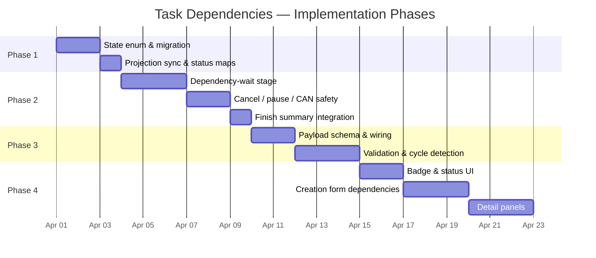

# Task Dependencies System

Status: Proposed  
Owners: MoonMind Engineering  
Last Updated: 2026-03-22  
Related: `docs/Tasks/TaskArchitecture.md`, `docs/Tasks/TaskCancellation.md`, `docs/Tasks/TaskProposalSystem.md`, `docs/Temporal/TemporalArchitecture.md`

---

## 1. Purpose

This document outlines the design for a **Task Dependencies** system within MoonMind. This system allows a Task to specify prerequisite Tasks that must complete successfully before the dependent Task begins execution.

This enables complex, multi-stage workflows across disparate agents or execution environments by explicitly modeling temporal dependencies between separate `MoonMind.Run` executions.

---

## 2. Requirements

- A Task can define a list of one or more prerequisite Task IDs (Temporal workflow IDs — see §3.1 for identity rules).
- The dependent Task will remain in a `WAITING_ON_DEPENDENCIES` state until all prerequisites have reached a successful terminal state.
- If any prerequisite Task fails, is cancelled, or terminates unsuccessfully, the dependent Task should fail automatically with a `DependencyFailedError`.
- The Mission Control UI must visually indicate when a Task is blocked by dependencies, and allow users to configure these dependencies during task creation/editing.
- Dependencies are **non-transitive** at the contract level: if Task C depends on Task B and Task B depends on Task A, Task C waits only for Task B — not for Task A. Transitive guarantees are implicit (B cannot complete until A completes).

### 2.1 Limits

- A single task may declare at most **10** prerequisite IDs in `dependsOn`.
- Cross-workflow-type dependencies (e.g., depending on a `MoonMind.ManifestIngest` workflow) are **not supported** in the initial version. Only `MoonMind.Run` workflow IDs are valid dependency targets.

---

## 3. Backend Component

The backend implementation involves updating the canonical payload, modifying the API to accept and validate dependencies, and updating the Temporal Workflow logic to wait for preconditions.

### 3.1 Canonical Payload Updates

The canonical task payload defined in `moonmind.workflows.agent_queue.task_contract` and exposed via `/api/queue/jobs` will be extended with an optional `dependsOn` field under the `task` block:

```json
{
  "task": {
    "instructions": "Run integration tests",
    "dependsOn": [
      "task-run-id-1",
      "task-run-id-2"
    ],
    "proposeTasks": true,
    "steps": []
  }
}
```

#### Identity rules

`dependsOn` entries are **Temporal workflow IDs**. For Temporal-backed tasks, `taskId == workflowId` (consistent with `TaskProposalSystem.md` §5). The API must validate that each ID matches an existing `MoonMind.Run` workflow execution before accepting the task creation request.

### 3.2 Temporal Workflow Execution (`MoonMind.Run`)

The `MoonMind.Run` Temporal Workflow will enforce these dependencies before beginning actual work (i.e., before the `planning` stage).

#### Updated lifecycle stages

The `MoonMind.Run` lifecycle for dependency-aware tasks becomes:

1. `initializing`
2. `waiting_on_dependencies` ← **new stage**
3. `planning`
4. `executing`
5. `proposals`
6. `finalizing`
7. terminal state

If `task.dependsOn` is empty or absent, the workflow skips stage 2.

#### Waiting mechanism (external workflow handles)

The workflow uses **Temporal external workflow handles** to wait for prerequisites. This is the idiomatic Temporal approach — no polling, no signals, no cross-workflow coupling:

```python
handles = [
    workflow.get_external_workflow_handle_for(MoonMindRunWorkflow.run, dep_id)
    for dep_id in depends_on
]
try:
    await asyncio.gather(*(h.result() for h in handles))
except exceptions.WorkflowFailureError as exc:
    raise ApplicationError(
        f"Dependency failed: {exc}", non_retryable=True,
    ) from exc
```

Advantages over polling or signal-based approaches:
- **Built into the SDK** — highly optimized, no custom activity or loop.
- **No history bloat** — a single `await` per dependency, not repeated poll events.
- **Automatic failure propagation** — if a dependency fails, cancels, or terminates, `.result()` raises `WorkflowFailureError` immediately.
- **No changes to existing workflows** — prerequisite workflows are unmodified.

> **Fallback note**: If the prerequisite workflow type is unknown at compile time (e.g., cross-type dependencies in a future version), a polling-based local activity with exponential backoff (5s → 60s cap) can be used instead. This is the degraded path, not the default.

1. **Initialization:** Upon starting, the workflow checks if `task.dependsOn` is populated. If so, it transitions `mm_state` to `waiting_on_dependencies`.

2. **Waiting:**
   - The workflow creates external workflow handles for each dependency and awaits their results concurrently via `asyncio.gather`.
   - The gather is wrapped in a compound condition that also checks `self._cancel_requested`, allowing clean cancellation during the wait.

3. **Resolution:**
   - If all prerequisites complete successfully, the workflow proceeds to `planning`.
   - If any prerequisite fails, cancels, or terminates, `WorkflowFailureError` is raised and caught → the workflow fails with a `DependencyFailedError` that names the failed prerequisite.

4. **State tracking:**
   - While waiting, `mm_state` search attribute is set to `waiting_on_dependencies`.
   - The workflow memo is updated with `dependsOn` IDs so the API can surface dependency information without additional queries.

#### `waiting_on_dependencies` state — implementation requirements

`waiting_on_dependencies` is a new value in the `MoonMindWorkflowState` enum. Adding it requires coordinated changes:

1. **Enum**: Add `WAITING_ON_DEPENDENCIES = "waiting_on_dependencies"` to `MoonMindWorkflowState` in `api_service/db/models.py`.
2. **DB migration**: An Alembic migration to add the new enum value to the PostgreSQL `moonmindworkflowstate` type.
3. **Projection sync**: Ensure `api_service/core/sync.py` recognizes the new state during projection sync (it currently warns and ignores unknown values).
4. **Workflow constants**: Add `STATE_WAITING_ON_DEPENDENCIES = "waiting_on_dependencies"` to `run.py` alongside the existing state constants.
5. **UI badges/filters**: Mission Control must render a badge for this state and include it in state filter dropdowns.

The value uses lowercase naming to match the existing convention (`initializing`, `planning`, `executing`, etc.).

#### Finish summary integration

The finish summary records:
- Whether a dependency wait occurred.
- Duration of the dependency wait (wall-clock time from entering `waiting_on_dependencies` to exiting it).
- Resolution: all dependencies completed vs. a dependency failed (with the failed ID).

### 3.3 Cancellation and Pause Interaction

The dependency-wait phase must respect the existing cancellation and pause contracts defined in `TaskCancellation.md`.

**Cancellation of the waiting workflow:**
- The `asyncio.gather` wait is wrapped in a `workflow.wait_condition` or shielded check that also evaluates `self._cancel_requested`. When cancel is requested, in-progress external handle waits are abandoned and the workflow returns `{"status": "canceled"}`.
- Cancelling a dependent workflow does **not** propagate cancellation to its prerequisites. Prerequisites may have other dependents or standalone value.

**Pause during dependency wait:**
- If a pause signal arrives while waiting on dependencies, the workflow should honor it by checking `self._paused` before entering the gather wait. After the pause is lifted, the gather wait resumes.

**Cancellation of a prerequisite:**
- Handled by the standard resolution logic — a prerequisite reaching `CANCELLED` terminal state triggers `DependencyFailedError` in the dependent workflow.

### 3.4 Continue-As-New Considerations

External workflow handles produce minimal history events (one marker per handle, not per poll cycle), so history bloat is not a concern for the dependency-wait phase.

If a workflow hits `continue-as-new` during the dependency wait phase, the new execution must resume the dependency wait with the same `dependsOn` list. The `initialParameters` already carry `dependsOn`, so re-initialization will re-enter the wait phase naturally.

---

## 4. API Validation

### 4.1 Creation-Time Validation

When the API receives a task creation request with `dependsOn`, it must validate:

1. **Existence:** Each ID in `dependsOn` must resolve to an existing `MoonMind.Run` workflow execution via the Temporal client.
2. **Workflow type:** Only `MoonMind.Run` workflow IDs are accepted (not `MoonMind.ManifestIngest` or other types).
3. **Limit:** At most 10 entries in `dependsOn`.
4. **No self-dependency:** The new task's workflow ID must not appear in its own `dependsOn`.
5. **Cycle detection:** Adding the new dependency edges must not create a cycle in the global dependency graph.

### 4.2 Cycle Detection

Cycle detection requires traversing the transitive dependency graph. The algorithm:

1. Build the set of all IDs reachable from the new task's `dependsOn` entries by walking their stored `dependsOn` fields recursively.
2. If the new task's workflow ID appears in the reachable set, reject with a `409 Conflict` response naming the cycle.
3. Cap traversal depth at **20 hops** to bound query cost. If traversal exceeds this depth, reject the request with an error recommending the user simplify the dependency chain.

**Storage:** `dependsOn` is stored in the Temporal workflow's `initialParameters` (already durable). The cycle-check query reads `dependsOn` from workflow metadata/memo for each hop via the Temporal client. No additional Postgres tables are required for the initial implementation.

---

## 5. Frontend Component

The Mission Control UI must be updated to support viewing and configuring task dependencies.

### 5.1 Task Creation & Editing

- **Task Creation Form:** Add a "Dependencies" section below the existing fields.
- **UI Element:** A multi-select combobox or typeahead search field that queries the `/api/queue/jobs` endpoint to find existing Task Runs.
- Users can select existing Tasks to block the new Task.
- The UI must enforce the 10-dependency limit client-side and display a validation error if exceeded.

> **Template dependencies (future scope):** Defining dependencies between Presets/Templates — where instantiating a template creates a linked graph of executions — is a separate, larger feature. It requires atomic multi-workflow creation and is architecturally closer to `MoonMind.ManifestIngest` fan-out. This should be designed in a dedicated follow-up document.

### 5.2 Task List & Detail Views

- **Task List (Table):**
  - Introduce a new visual state/badge for `WAITING_ON_DEPENDENCIES`.
  - Provide a tooltip or quick-view showing the titles of the blocking tasks.
- **Task Detail Page:**
  - Add a "Dependencies" panel showing the list of prerequisite tasks.
  - Show the real-time status of each prerequisite (e.g., Running, Completed, Failed).
  - Include clickable links to navigate directly to the prerequisite task's detail page.
  - Similarly, show a "Dependent Tasks" (downstream) list if a task blocks others. This requires a reverse lookup — querying workflows whose `dependsOn` includes the current task's workflow ID.

---

## 6. Failure Modes & Edge Cases

- **Circular Dependencies:** The API validates at creation time that adding a dependency does not create a cycle (see §4.2). Cycles are rejected with a `409 Conflict` response.
- **Deleted/Purged Tasks:** If a dependency refers to a workflow ID that cannot be found (workflow purged from Temporal), the polling activity treats it as a failed dependency and the dependent task fails immediately with `DependencyFailedError` to avoid waiting forever.
- **Workflow Timeout:** The standard workflow execution timeout still applies. If dependencies take longer than the workflow's configured timeout, the dependent workflow times out normally.
- **Dependency-Wait Timeout (optional):** An optional `dependencyTimeoutSeconds` field under `task` may be added to allow operators to fail fast on stuck dependencies without waiting for the full workflow timeout. If omitted, the workflow-level timeout applies.
- **Already-Terminal Prerequisites:** If all prerequisite workflows are already in a successful terminal state at the time the dependent workflow starts, the first poll resolves immediately and the workflow proceeds without delay.

---

## 7. Constitution Check

| Principle | Status | Notes |
|-----------|--------|-------|
| I. Orchestrate, Don't Recreate | PASS | Dependencies are an orchestration primitive, not agent-level logic. |
| II. One-Click Agent Deployment | PASS | No new infrastructure dependencies. |
| III. Avoid Vendor Lock-In | PASS | Uses Temporal-native primitives only. |
| IV. Own Your Data | PASS | Dependency metadata stored in operator-controlled Temporal. |
| V. Skills Are First-Class | N/A | Not a skill change. |
| VI. Bittersweet Lesson | PASS | Polling scaffold is explicitly designed for replacement. |
| VII. Runtime Configurability | PASS | `dependsOn` is a runtime payload field, not a code constant. |
| VIII. Modular Architecture | PASS | Additive payload extension; no changes to core orchestration interfaces. |
| IX. Resilient by Default | PASS | Cancellation, pause, timeout, and missing-dependency failure modes are all specified. |
| X. Continuous Improvement | N/A | Not directly applicable. |
| XI. Spec-Driven | PENDING | Full `specs/` artifacts required before implementation. |

---

## 8. Phased Implementation Plan

Implementation is split into four phases ordered by dependency: backend state primitives → workflow execution logic → API validation layer → frontend UI. Each phase is independently testable and deployable.

### Phase 1 — Backend Foundation (State & Schema)

**Goal:** Introduce the `waiting_on_dependencies` state across all persistence and projection layers so later phases can set and read it.

#### Deliverables

| # | Change | File(s) |
|---|--------|---------|
| 1.1 | Add `WAITING_ON_DEPENDENCIES = "waiting_on_dependencies"` to the `MoonMindWorkflowState` enum | `api_service/db/models.py` |
| 1.2 | Alembic migration to add the new value to the PostgreSQL `moonmindworkflowstate` native enum type | `api_service/migrations/versions/<new>.py` |
| 1.3 | Add `STATE_WAITING_ON_DEPENDENCIES = "waiting_on_dependencies"` constant alongside existing state constants | `moonmind/workflows/temporal/workflows/run.py` |
| 1.4 | Register the new state in the projection sync state mapping so `sync.py` recognizes it instead of warning on unknown values | `api_service/core/sync.py` |
| 1.5 | Add a dashboard status mapping entry `MoonMindWorkflowState.WAITING_ON_DEPENDENCIES → "waiting"` | `api_service/api/routers/executions.py` |
| 1.6 | Add a compatibility status mapping entry (same pattern as 1.5) | `moonmind/workflows/tasks/compatibility.py` |

#### Tests & Acceptance

- Migration passes `alembic upgrade head` and `alembic downgrade` without error.
- Existing unit tests remain green (`./tools/test_unit.sh`).
- Projection sync accepts `mm_state = "waiting_on_dependencies"` without warning.

---

### Phase 2 — Workflow Dependency Logic

**Goal:** Wire the dependency-wait stage into the `MoonMind.Run` workflow so that tasks with a populated `dependsOn` list block on prerequisites before proceeding to planning.

**Depends on:** Phase 1 (state constant and projection sync must exist).

#### Deliverables

| # | Change | File(s) |
|---|--------|---------|
| 2.1 | Add `_run_dependency_wait_stage` method: transition to `waiting_on_dependencies`, create external workflow handles for each `dependsOn` entry, `asyncio.gather` their results, propagate `DependencyFailedError` on any failure | `moonmind/workflows/temporal/workflows/run.py` |
| 2.2 | Insert the dependency-wait call in `run()` between `_set_state(STATE_INITIALIZING)` and `_set_state(STATE_PLANNING)`, gated on `depends_on = parameters.get("dependsOn", [])` | `moonmind/workflows/temporal/workflows/run.py` |
| 2.3 | Respect `self._cancel_requested` during the gather wait (compound `wait_condition` or shielded check) per §3.3 | `moonmind/workflows/temporal/workflows/run.py` |
| 2.4 | Respect `self._paused` — check before entering gather, resume after unpause per §3.3 | `moonmind/workflows/temporal/workflows/run.py` |
| 2.5 | Record dependency-wait results in the finish summary: whether a wait occurred, wait duration, resolution outcome | `moonmind/workflows/temporal/workflows/run.py` |
| 2.6 | Update workflow memo with `dependsOn` IDs so the API can surface them without additional queries | `moonmind/workflows/temporal/workflows/run.py` |

#### Continue-As-New Safety

Per §3.4, `dependsOn` is carried in `initialParameters`. If the workflow continues as new, the new execution re-reads `initialParameters` and re-enters the wait phase, re-creating external handles. External handles produce minimal history events, so this path is safe.

#### Tests & Acceptance

- **Unit test — happy path:** Workflow with two `dependsOn` entries; both prerequisites complete successfully → workflow proceeds to `planning`.
- **Unit test — dependency failure:** One prerequisite fails → workflow raises `DependencyFailedError` naming the failed ID.
- **Unit test — cancel during wait:** `cancel_requested` set while waiting → workflow returns `{"status": "canceled"}`.
- **Unit test — pause during wait:** `_paused` is set → workflow blocks; after unpause → gather resumes.
- **Unit test — empty `dependsOn`:** Workflow skips the wait stage entirely (no regression).
- **Workflow boundary test:** Verify the invocation shape matches what the worker binding uses.
- All tests via `./tools/test_unit.sh`.

---

### Phase 3 — API Validation & Payload

**Goal:** Accept `dependsOn` in the task creation payload, validate it at request time, and enforce limits and cycle detection.

**Depends on:** Phase 2 (the workflow must handle `dependsOn` in `initialParameters`).

#### Deliverables

| # | Change | File(s) |
|---|--------|---------|
| 3.1 | Extend the canonical task payload schema to accept an optional `dependsOn: list[str]` field under `task` | `moonmind/workflows/agent_queue/task_contract.py` (or equivalent schema file) |
| 3.2 | Wire validated `dependsOn` into `initialParameters` when starting the `MoonMind.Run` workflow | API task creation path (submit router / service) |
| 3.3 | **Existence validation:** Each ID in `dependsOn` must resolve to an existing `MoonMind.Run` workflow via the Temporal client | API validation layer |
| 3.4 | **Workflow type validation:** Reject IDs that belong to non-`MoonMind.Run` workflow types | API validation layer |
| 3.5 | **Limit enforcement:** Reject requests with more than 10 `dependsOn` entries | API validation layer |
| 3.6 | **Self-dependency check:** Reject if the new task's workflow ID appears in its own `dependsOn` | API validation layer |
| 3.7 | **Cycle detection:** Traverse the transitive dependency graph (up to 20 hops) via workflow memo reads; reject with `409 Conflict` if a cycle is found | API validation layer |

#### Tests & Acceptance

- **Unit test:** Valid `dependsOn` accepted and passed through to workflow parameters.
- **Unit test:** Non-existent dependency ID → `404` or appropriate error.
- **Unit test:** Dependency on non-`MoonMind.Run` workflow → rejection.
- **Unit test:** >10 entries → `400` validation error.
- **Unit test:** Self-dependency → `400`.
- **Unit test:** Cycle detection (A→B→A) → `409 Conflict`.
- **Unit test:** Deep chain (>20 hops) → rejection with simplification message.
- All tests via `./tools/test_unit.sh`.

---

### Phase 4 — Frontend (Mission Control UI)

**Goal:** Surface dependency information in Mission Control: visual badges, dependency configuration during task creation, and dependency panels on task detail views.

**Depends on:** Phase 3 (API must serve `dependsOn` data and the `waiting_on_dependencies` state).

#### Deliverables

| # | Change | File(s) |
|---|--------|---------|
| 4.1 | Add a `WAITING_ON_DEPENDENCIES` badge to the task list status column (maps to the `"waiting"` dashboard status from Phase 1) | Mission Control JS (status badge component) |
| 4.2 | Add a tooltip or quick-view on the badge showing blocking task titles | Mission Control JS (task list row component) |
| 4.3 | **Task Creation Form:** Add a "Dependencies" section with a multi-select combobox / typeahead search against `/api/queue/jobs`. Enforce the 10-dependency limit client-side | Mission Control JS (task creation view) |
| 4.4 | **Task Detail — Dependencies panel:** Show prerequisite tasks with real-time status, clickable navigation links to each prerequisite's detail page | Mission Control JS (task detail view) |
| 4.5 | **Task Detail — Dependent Tasks panel:** Reverse-lookup showing downstream tasks that depend on the current task (query workflows whose `dependsOn` includes this task's ID) | Mission Control JS (task detail view) |

#### Tests & Acceptance

- Browser-based verification: create a task with dependencies via the form → task appears in `WAITING_ON_DEPENDENCIES` state with correct badge.
- Verify dependency panel renders prerequisite list with live status updates.
- Verify clicking a prerequisite navigates to its detail page.
- Verify 10-dependency limit is enforced in the form.

---

### Phase Summary



### Risk Notes

- **Alembic migration ordering:** The enum migration (1.2) must be coordinated with any other in-flight migrations to avoid Alembic head conflicts. Rebase against `main` immediately before merging.
- **External workflow handle API:** Verify that the Python Temporal SDK version in use supports `workflow.get_external_workflow_handle_for` (typed variant). If not, fall back to the untyped `workflow.get_external_workflow_handle(workflow_id)` which is already used in `agent_run.py`.
- **Cycle detection cost:** The 20-hop traversal cap is a hard limit, not a soft one. If real-world dependency graphs grow deeper than expected, this can be raised but the cap itself must remain to bound query cost.
- **In-flight compatibility:** Adding the `waiting_on_dependencies` state and `dependsOn` parameter is purely additive. Existing in-flight workflows without `dependsOn` skip the wait stage with zero behavior change, satisfying the Compatibility Policy.
