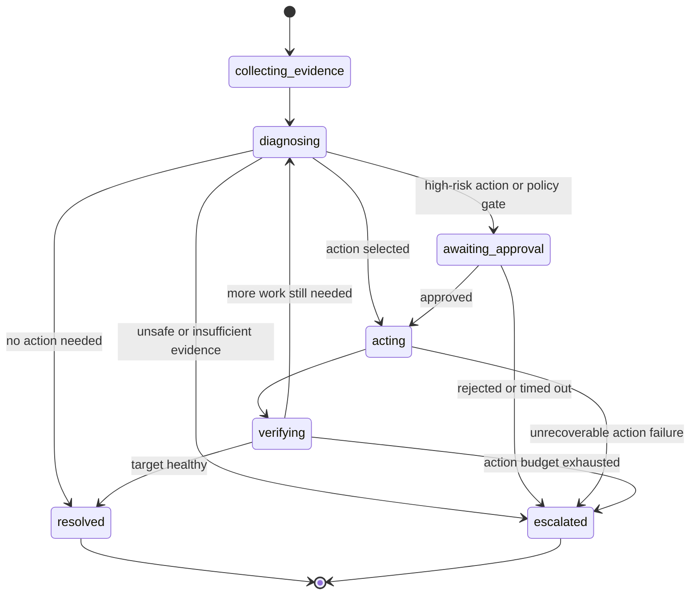

# Task Remediation

**Status:** Desired-state design  
**Owners:** MoonMind Platform + Mission Control  
**Last Updated:** 2026-04-21  
**Related:** `docs/Tasks/TaskDependencies.md`, `docs/Api/ExecutionsApiContract.md`, `docs/Tasks/TaskRunsApi.md`, `docs/Tasks/TaskProposalSystem.md`, `docs/ManagedAgents/LiveLogs.md`, `docs/ManagedAgents/CodexCliManagedSessions.md`, `docs/ManagedAgents/SharedManagedAgentAbstractions.md`, `docs/Security/ProviderProfiles.md`, `docs/Security/SecretsSystem.md`, `docs/ManagedAgents/DockerOutOfDocker.md`, `docs/Temporal/ArtifactPresentationContract.md`, `docs/Temporal/StepLedgerAndProgressModel.md`, `docs/Temporal/RunHistoryAndRerunSemantics.md`, `docs/Temporal/SourceOfTruthAndProjectionModel.md`, `docs/Temporal/WorkflowTypeCatalogAndLifecycle.md`

---

## 1. Purpose

This document defines the desired-state contract for **Task Remediation** in MoonMind.

Task Remediation is the system that allows one MoonMind task to **troubleshoot, observe, and optionally intervene on another MoonMind task or run**. It is the architectural home for the “self-healing” feature: a task may be created specifically to investigate another task, read its durable evidence, follow its live observability stream when appropriate, and take typed, policy-bound administrative actions when allowed.

In this document:

- a **target execution** is the task being investigated or repaired,
- a **remediation task** is the follow-up task doing the investigation or repair,
- **troubleshooting** means evidence collection and diagnosis,
- **remediation** means diagnosis plus allowed intervention actions,
- **self-healing** means automated or operator-triggered creation of remediation tasks under policy.

The core design goal is:

> MoonMind should let a task investigate another task **without turning logs into the source of truth and without turning the agent into an unaudited root shell**.

---

## 2. Why a separate system is required

Task Remediation must be a first-class concept, separate from ordinary task dependencies.

Task dependencies are intentionally narrow. They block one `MoonMind.Run` on the successful terminal completion of another `MoonMind.Run`. They do not import the upstream run’s plan DAG, internal context, logs, or artifacts into the dependent run. They also fail the dependent run when the upstream prerequisite ends in a non-success terminal state. That is the correct contract for orchestration ordering, but it is the wrong contract for troubleshooting and repair.

Remediation needs the opposite behavior:

1. it often starts **because** the target run failed, stalled, timed out, or requested attention;
2. it must read the target run’s evidence instead of waiting for success;
3. it may need to follow live progress while the target is still active;
4. it may need to take bounded administrative actions such as clearing a stale slot, interrupting a managed turn, or restarting a managed container through a control-plane action.

Therefore MoonMind needs a dedicated **remediation relationship** and a dedicated **privileged capability surface** rather than overloading `dependsOn`.

---

## 3. Design goals

Task Remediation must satisfy all of the following:

1. **Cross-task troubleshooting**
   - A new task can explicitly target another task/execution.
   - The target relationship is durable, inspectable, and visible in both directions.

2. **Pinned evidence identity**
   - The remediation task can target a logical execution by `workflowId`.
   - It can also pin a specific run instance by `runId` so it does not silently drift when the target reruns or continues as new.

3. **Artifact-first evidence access**
   - The remediation task can read:
     - execution detail,
     - latest/current step ledger,
     - selected step artifact refs,
     - managed-run observability summaries,
     - durable logs and diagnostics,
     - continuity and control-boundary artifacts for managed sessions.

4. **Optional live follow**
   - When the target is active and observability supports it, the remediation task may follow live logs or structured observability events.
   - Live follow is additive, not authoritative.

5. **Typed administrative actions**
   - The remediation task may execute allowed administrative actions through a MoonMind-owned action registry.
   - Actions are explicit, validated, idempotent, and audited.

6. **Privilege separation**
   - A remediation task may run with stronger permissions than ordinary tasks.
   - Those permissions are expressed through a named policy/profile, not through implicit raw host access.

7. **Auditability**
   - Every diagnosis, plan, action request, action result, and verification result must leave durable evidence.

8. **Loop prevention**
   - Remediation must not create unbounded self-healing loops or conflicting concurrent healers.

9. **Graceful degradation**
   - Historical runs with only merged logs or partial artifact coverage must still be troubleshootable.
   - Missing evidence should degrade the remediation task, not deadlock it.

---

## 4. Non-goals

This design does **not** attempt to provide:

- arbitrary raw shell access on the MoonMind host,
- unrestricted Docker daemon access from the remediation runtime,
- arbitrary SQL or direct database row editing by the agent,
- silent import of another task’s entire workflow history into `initialParameters`,
- cross-task managed-session reuse,
- a rule that every failed task automatically spawns an admin healer,
- a guarantee that historical runs always have full structured event history,
- a bypass around the Secrets System or artifact redaction rules,
- a claim that Live Logs itself is the source of truth.

MoonMind may still support operator handoff or manual terminal workflows elsewhere. This document only defines the **task-based remediation system**.

---

## 5. Architectural stance

### 5.1 Remediation tasks remain `MoonMind.Run`

A remediation task should still be represented as a normal top-level `MoonMind.Run` execution with additional nested semantics under `task.remediation`.

This keeps remediation aligned with the existing task-shaped create path, Mission Control task views, proposal promotion, artifacts, step ledger, cancellation, rerun, and summary flows. A new top-level workflow type is not required in v1.

### 5.2 Remediation is a relationship, not a dependency

A remediation task has a **directed link** to a target execution. The link is not a dependency gate. The remediation run starts immediately once created (or once its own schedule starts); it does not wait for the target to complete successfully.

### 5.3 Control remains separate from observation

Live Logs and observability remain passive observation surfaces. Intervention must occur through a separate MoonMind-owned action surface. A remediation task may use both, but it must not treat the log timeline itself as the control channel.

### 5.4 Source of truth remains unchanged

For the target execution:

- execution identity and lifecycle remain Temporal-owned,
- planned structure remains owned by the plan artifact,
- live step state remains owned by workflow state and step queries,
- evidence remains owned by artifact linkage and managed-run observability,
- projections remain read models, not a second workflow engine.

Task Remediation is layered on top of those contracts; it does not redefine them.

---

## 6. Core invariants

The following invariants are fixed:

1. **A remediation task is explicitly marked.**  
   The canonical marker is `payload.task.remediation`.

2. **A remediation task targets one logical execution and one pinned run snapshot.**  
   `target.workflowId` is required. `target.runId` is resolved and persisted at create time even if the user omitted it.

3. **Remediation is non-transitive by default.**  
   If B remediates A and C remediates B, C does not automatically gain authority over A unless explicitly configured.

4. **Remediation does not import unbounded upstream data into workflow history.**  
   Large logs, diagnostics, provider snapshots, and evidence bodies remain behind artifact refs or observability APIs.

5. **All evidence access is server-mediated.**  
   Artifact refs are identifiers, not access grants. The remediation task never receives presigned URLs, raw storage keys, or raw local filesystem paths as durable context.

6. **Administrative actions are typed and allowlisted.**  
   Remediation never implies “run any command the model suggests.”

7. **Every side-effecting action is idempotent or safely keyed.**  
   Replays, retries, and duplicate requests must not create duplicate destructive actions.

8. **Exclusive locking is required for acting on shared targets.**  
   Diagnosis may be parallelized later; mutation may not.

9. **Secrets remain redacted.**  
   Stronger task authority does not override redaction, audit, or secret-reference rules.

10. **Nested remediation is off by default.**  
    Automatic remediation of remediation tasks is disabled unless explicitly allowed by policy.

11. **Force termination stays high-risk.**  
    Even for admin remediation, forced termination is treated as an ops-grade action, not a casual fallback.

12. **Failure to resolve evidence never becomes infinite wait.**  
    The remediation task must degrade, escalate, or fail with a bounded reason.

---

## 7. Submission contract

### 7.1 Canonical create path

The canonical create path remains the task-shaped submit flow that normalizes into `POST /api/executions`.

Representative request:

```json
{
  "type": "task",
  "payload": {
    "repository": "MoonLadderStudios/MoonMind",
    "task": {
      "instructions": "Investigate the target task, gather evidence, and apply allowed remediation actions if justified.",
      "runtime": { "mode": "codex" },
      "remediation": {
        "target": {
          "workflowId": "mm:01ARZ3NDEKTSV4RRFFQ69G5FAV",
          "runId": "8f15a7b2-6e48-44f0-a3ba-d2f0c8d96fd4",
          "stepSelectors": [
            { "logicalStepId": "run-tests", "attempt": 1 }
          ],
          "taskRunIds": ["tr_01HV8A3Y6Y3Q0QAB7M7H1R5Q7N"]
        },
        "mode": "snapshot_then_follow",
        "authorityMode": "admin_auto",
        "evidencePolicy": {
          "includeStepLedger": true,
          "includeObservabilitySummary": true,
          "includeLogs": ["merged", "stdout", "stderr"],
          "includeDiagnostics": true,
          "includeProviderSnapshots": true,
          "includeContinuityArtifacts": true,
          "tailLines": 2000
        },
        "actionPolicyRef": "admin_healer_default",
        "approvalPolicy": {
          "mode": "risk_gated",
          "autoAllowedRisk": "medium"
        },
        "lockPolicy": {
          "scope": "target_execution",
          "mode": "exclusive"
        },
        "trigger": {
          "type": "manual",
          "createdByWorkflowId": null
        }
      }
    }
  }
}
```

### 7.2 Canonical normalized field

The backend normalizes remediation intent into:

```json
{
  "initialParameters": {
    "task": {
      "remediation": { "...": "..." }
    }
  }
}
```

The `task.remediation` object is the durable contract. Compatibility routes may expose different shapes, but they must normalize into this nested object before `MoonMind.Run` starts.

### 7.3 Field semantics

#### `target.workflowId`
Required durable identity of the target execution.

#### `target.runId`
Pinned target run instance. If omitted, the server resolves the latest/current run at create time and persists the resolved value.

#### `target.stepSelectors[]`
Optional bounded selectors for steps the remediation task should prioritize. Each selector may include:
- `logicalStepId`
- `attempt`
- `taskRunId`

#### `target.taskRunIds[]`
Optional direct observability bindings when the creator already knows which managed-run records matter.

#### `mode`
Allowed values:

- `snapshot` — build a point-in-time evidence bundle only
- `live_follow` — follow active observability where supported
- `snapshot_then_follow` — create a point-in-time bundle, then continue live observation if possible

Default: `snapshot_then_follow`.

#### `authorityMode`
Allowed values:

- `observe_only`
- `approval_gated`
- `admin_auto`

This field controls whether the task may only diagnose, may plan actions but require approval, or may execute actions automatically within policy.

#### `evidencePolicy`
Bounded hints controlling which evidence classes are requested and how much initial log context to include.

#### `actionPolicyRef`
Named policy describing the action allowlist, risk thresholds, lock requirements, verification requirements, and retry budget.

#### `approvalPolicy`
Policy for human approval requirements.

#### `lockPolicy`
Policy for lock scope and exclusivity.

#### `trigger`
Metadata describing how the remediation task was created:
- `manual`
- `on_failed`
- `on_attention_required`
- `on_stuck`
- `policy`
- `proposal_promoted`

### 7.4 Create-time validation

At create time, the platform must:

1. require `task.remediation.target.workflowId`,
2. resolve the target execution and verify caller visibility,
3. reject malformed self-reference,
4. reject unsupported target workflow types,
5. resolve and persist a concrete `target.runId`,
6. verify that selected `taskRunIds` belong to the target execution or selected steps,
7. reject unsupported `authorityMode` values,
8. validate `actionPolicyRef` existence and compatibility with the caller’s permission,
9. reject nested remediation beyond policy limits,
10. initialize a durable remediation link record supporting forward and reverse lookup.

### 7.5 Convenience API

MoonMind may expose a convenience route such as:

```http
POST /api/executions/{workflowId}/remediation
```

That route is only a control-plane convenience. It must expand into the same canonical execution create contract as `POST /api/executions`.

### 7.6 Future automatic self-healing policy

Automatic creation is intentionally a later layer. When MoonMind adds automatic self-healing, the triggering task may carry a bounded policy such as:

```yaml
task:
  remediationPolicy:
    enabled: true
    triggers: ["failed", "attention_required", "stuck"]
    createMode: "proposal"   # or immediate_task
    templateRef: "admin_healer_default"
    authorityMode: "approval_gated"
    maxActiveRemediations: 1
```

The important rule is that **automatic remediation is policy-driven and bounded**, not an undocumented side effect of failure.

---

## 8. Identity, linkage, and read models

### 8.1 Why both `workflowId` and `runId` are required

MoonMind detail routes and compatibility views anchor on the logical execution identity (`workflowId`). However, the latest/current run may change when the target reruns or continues as new. Remediation needs both:

- `workflowId` to identify the logical task,
- `runId` to pin the evidence snapshot that the remediator started from.

### 8.2 Link directions

The system must support both of these views:

- **Remediator → Target**
  - “Which execution is this remediation task investigating?”
- **Target → Remediators**
  - “Which remediation tasks have investigated or acted on this target?”

### 8.3 Durable linkage requirements

The platform must persist enough data to support:

- forward lookup from remediation task to target execution,
- reverse lookup from target execution to remediation tasks,
- pinned target run identity,
- current remediation status,
- current lock holder,
- latest action summary,
- final remediation outcome,
- Mission Control list/detail rendering.

### 8.4 Read model expectations

A derived remediation link read model is allowed for fast UI and API reads, but it must remain downstream of canonical sources.

At minimum it should expose:

```json
{
  "remediationWorkflowId": "mm:...",
  "remediationRunId": "run_...",
  "targetWorkflowId": "mm:...",
  "targetRunId": "run_...",
  "mode": "snapshot_then_follow",
  "authorityMode": "admin_auto",
  "status": "acting",
  "activeLockScope": "target_execution",
  "lastActionKind": "provider_profile.evict_stale_lease",
  "resolution": null,
  "createdAt": "2026-04-21T18:05:00Z",
  "updatedAt": "2026-04-21T18:07:12Z"
}
```

### 8.5 Reverse lookup API

A minimal desired-state surface is:

```http
GET /api/executions/{workflowId}/remediations?direction=inbound
GET /api/executions/{workflowId}/remediations?direction=outbound
```

Where:
- `inbound` means remediation tasks targeting this execution,
- `outbound` means executions that this task is remediating.

---

## 9. Evidence and context model

### 9.1 Evidence sources

The remediation task may need data from several MoonMind surfaces:

1. **Execution detail**
   - title, summary, lifecycle state, current run metadata, progress summary.

2. **Step ledger**
   - selected step status, attempt, summary, `taskRunId`, child refs, step-scoped artifact refs.

3. **Managed-run observability**
   - observability summary,
   - stdout/stderr/merged logs,
   - diagnostics,
   - optional live-follow stream for active runs.

4. **Execution-linked artifacts**
   - output summaries,
   - provider snapshots,
   - run summaries,
   - continuity artifacts,
   - control-boundary artifacts.

5. **Managed-session continuity**
   - session summary,
   - session checkpoints,
   - session control events,
   - reset boundaries,
   - session identity metadata when relevant.

### 9.2 Remediation Context Builder

MoonMind should introduce a **Remediation Context Builder** activity or service that resolves the target evidence and creates a single MoonMind-owned bundle artifact for the remediation task.

Canonical output artifact:

- path: `reports/remediation_context.json`
- artifact type: `remediation.context`

This artifact is the remediation task’s stable entrypoint. It should contain:
- target identity,
- selected steps,
- observability refs,
- bounded summaries,
- compact diagnosis hints,
- live-follow cursor state if applicable,
- action policy and approval policy snapshot,
- lock policy snapshot.

### 9.3 Context artifact shape

Representative shape:

```json
{
  "schemaVersion": "v1",
  "remediationWorkflowId": "mm:remediate_123",
  "generatedAt": "2026-04-21T18:05:02Z",
  "target": {
    "workflowId": "mm:target_456",
    "runId": "run_789",
    "title": "Run integration tests",
    "state": "awaiting_slot",
    "closeStatus": null
  },
  "selectedSteps": [
    {
      "logicalStepId": "run-tests",
      "attempt": 1,
      "status": "awaiting_external",
      "summary": "Waiting on managed runtime slot",
      "taskRunId": "tr_01HV..."
    }
  ],
  "evidence": {
    "stepLedgerRef": { "artifact_id": "art_step_ledger_snapshot" },
    "runSummaryRef": { "artifact_id": "art_run_summary" },
    "taskRuns": [
      {
        "taskRunId": "tr_01HV...",
        "observabilitySummaryRef": { "artifact_id": "art_obs_summary" },
        "stdoutRef": { "artifact_id": "art_stdout" },
        "stderrRef": { "artifact_id": "art_stderr" },
        "mergedLogsRef": { "artifact_id": "art_merged" },
        "diagnosticsRef": { "artifact_id": "art_diag" },
        "providerSnapshotRef": { "artifact_id": "art_provider" }
      }
    ],
    "continuityRefs": [
      { "artifact_id": "art_session_summary", "kind": "session.summary" },
      { "artifact_id": "art_reset_boundary", "kind": "session.reset_boundary" }
    ]
  },
  "liveFollow": {
    "mode": "snapshot_then_follow",
    "supported": true,
    "taskRunId": "tr_01HV...",
    "resumeCursor": { "sequence": 3842 }
  },
  "policies": {
    "authorityMode": "admin_auto",
    "actionPolicyRef": "admin_healer_default",
    "approvalPolicy": { "mode": "risk_gated", "autoAllowedRisk": "medium" },
    "lockPolicy": { "scope": "target_execution", "mode": "exclusive" }
  }
}
```

### 9.4 Boundedness rule

The context artifact must stay **bounded**. It may include small excerpts or summaries, but not unbounded full log bodies. Full logs and rich diagnostics stay behind refs.

### 9.5 Evidence access surface for remediation tasks

The remediation runtime should not scrape Mission Control pages. It should receive a MoonMind-owned tool surface such as:

- `remediation.get_context()`  
  Return the parsed `remediation.context` bundle.

- `remediation.read_target_artifact(artifactRef, readMode?)`  
  Read a referenced artifact through normal artifact policy.

- `remediation.read_target_logs(taskRunId, stream, cursor?, tailLines?)`  
  Read or tail target logs through the `/api/task-runs` observability surfaces.

- `remediation.follow_target_logs(taskRunId, fromSequence?)`  
  Live follow when supported.

- `remediation.list_allowed_actions()`  
  Return action kinds allowed by `actionPolicyRef`.

- `remediation.execute_action(actionKind, params, dryRun?)`  
  Request a typed intervention.

- `remediation.verify_target(checks...)`  
  Re-read target health after an action.

The exact transport may be internal API calls, activities, or MCP tools, but the capability boundary must be MoonMind-owned and typed.

### 9.6 Live follow semantics

Live follow is optional and best effort.

Rules:

1. the remediation task may follow only when:
   - the target run is active,
   - the target `taskRunId` supports live follow,
   - policy allows it;

2. the remediation task must persist a resume cursor such as last seen `sequence`;

3. disconnects, worker restarts, or task retries must resume from durable cursor state when possible;

4. when structured event history is unavailable, MoonMind may fall back to merged-log retrieval or artifact tailing;

5. live follow must never become the only evidence path.

### 9.7 Evidence freshness before action

Before executing a side-effecting action, the remediation task must re-read the target’s current bounded health view. The agent is allowed to start from a pinned snapshot, but it must not act on stale assumptions without a fresh precondition check.

---

## 10. Security and authority model

### 10.1 Authority modes

Task Remediation defines three authority modes:

#### `observe_only`
The remediation task may:
- read allowed evidence,
- produce diagnosis artifacts,
- suggest actions.

It may **not** execute side-effecting actions.

#### `approval_gated`
The remediation task may:
- read evidence,
- propose concrete actions,
- optionally perform dry runs,
- execute actions only after required approval.

#### `admin_auto`
The remediation task may:
- read evidence,
- plan actions,
- execute allowed actions automatically within policy,
- still require approval for explicitly high-risk actions if the action policy says so.

### 10.2 Execution principal

A remediation task with elevated authority should execute under a **named admin remediation principal or security profile**, not simply as the ordinary user runtime.

Desired-state fields:

```yaml
task:
  remediation:
    securityProfileRef: admin_healer
    actionPolicyRef: admin_healer_default
```

Audit must record both:
- the requesting user or workflow,
- the execution principal actually used for the privileged action.

### 10.3 Permission model

The control plane should distinguish:

- permission to view a target execution,
- permission to create a remediation task,
- permission to request an admin remediation profile,
- permission to approve high-risk actions,
- permission to inspect remediation audit history.

A user who can view a task should not automatically be able to launch an admin remediator against it.

### 10.4 Secret handling

Privileged remediation does **not** bypass the Secrets System.

Rules:
- no raw secrets in remediation context artifacts,
- no raw secrets in workflow payloads,
- no raw secrets in run summaries,
- no raw secrets in logs or diagnostics,
- generated credential-bearing runtime files stay ephemeral by default,
- remediation actions receive MoonMind-issued capabilities or narrowly materialized runtime context only where unavoidable.

### 10.5 Artifact and log access mediation

Artifacts and logs must remain server-mediated.

A remediation task may receive:
- artifact refs,
- MoonMind-issued read capability handles,
- redacted or preview views,
- typed observability APIs.

It must not receive:
- presigned storage URLs in durable context,
- storage backend keys,
- absolute local filesystem paths,
- raw secret-bearing config bundles.

### 10.6 High-risk actions

Some actions remain inherently high-risk, even for an admin healer. Examples:
- forced termination,
- destructive container cleanup with uncertain ownership,
- fresh rerun creation that may trigger duplicate external effects,
- replacement of a managed session with continuity loss.

The action registry must allow these to be marked as:
- `low`,
- `medium`,
- `high`.

The `approvalPolicy` then decides whether:
- they are auto-allowed,
- require operator approval,
- are completely disabled.

### 10.7 Visibility and redaction posture

Remediation does not change the rule that non-admin visibility is scoped to ownership and that unauthorized direct fetches must not leak execution existence. Admin remediation may see more, but its artifacts still follow redaction-safe display rules.

---

## 11. Remediation action registry

### 11.1 Rationale

The user-facing desire may sound like “let the healer restart a container or free a slot,” but the implementation must not be “give the model host root.” MoonMind should instead expose a **typed action registry** backed by existing lifecycle surfaces, managed-session controls, provider-profile management, and Docker workload control-plane activities.

### 11.2 Canonical action kinds

The initial registry should include at least the following action families.

#### Execution lifecycle actions
- `execution.pause`
- `execution.resume`
- `execution.request_rerun_same_workflow`
- `execution.start_fresh_rerun`
- `execution.cancel`
- `execution.force_terminate`

#### Managed-session actions
- `session.interrupt_turn`
- `session.clear`
- `session.cancel`
- `session.terminate`
- `session.restart_container`

#### Provider-profile / slot actions
- `provider_profile.evict_stale_lease`

#### Workload / container actions
- `workload.restart_helper_container`
- `workload.reap_orphan_container`

The registry may later grow, but every new action kind must declare:
- target type,
- allowed inputs,
- risk tier,
- preconditions,
- idempotency rules,
- verification requirements,
- audit payload shape.

### 11.3 Action semantics notes

#### `execution.pause` / `execution.resume`
Backed by the ordinary execution signal surface. Use these when the target should stop progressing while evidence is reviewed or operator work occurs.

#### `execution.request_rerun_same_workflow`
Represents Continue-As-New style rerun of the same logical execution where supported and accepted.

#### `execution.start_fresh_rerun`
Represents creation of a fresh execution with a new `workflowId`, preserving original parameters unless overridden.

#### `execution.force_terminate`
Ops-only. Used only for runaway execution or policy violation scenarios. This is never a “normal first fix.”

#### `session.interrupt_turn`
Interrupt an active managed turn without destroying the entire session.

#### `session.clear`
Perform the managed-session clear/reset operation, producing the normal control and reset-boundary artifacts and incrementing the session epoch.

#### `session.restart_container`
A stronger action than `session.clear`. It must be implemented by the owning managed-session plane or a MoonMind control-plane activity, not by handing raw Docker access to the agent. Restarting the session container must create an explicit continuity boundary and produce durable audit artifacts.

#### `provider_profile.evict_stale_lease`
Release a managed runtime slot lease when the lease is stale or orphaned according to policy and supervision evidence.

#### `workload.restart_helper_container` / `workload.reap_orphan_container`
These operate on workload containers that MoonMind launched through the Docker workload plane. They do not imply arbitrary image execution or unrestricted Docker access.

### 11.4 Action request contract

Representative shape:

```json
{
  "schemaVersion": "v1",
  "actionId": "ract_01HV...",
  "actionKind": "provider_profile.evict_stale_lease",
  "requestedBy": {
    "workflowId": "mm:remediate_123",
    "runId": "run_456",
    "logicalStepId": "apply-remediation"
  },
  "target": {
    "workflowId": "mm:target_789",
    "runId": "run_321",
    "resourceKind": "provider_profile_lease",
    "resourceId": "profile:codex_openai_oauth_team"
  },
  "riskTier": "medium",
  "dryRun": false,
  "idempotencyKey": "mm:remediate_123:run_456:provider_profile.evict_stale_lease:profile:codex_openai_oauth_team",
  "params": {
    "reason": "lease exceeded max duration and owner execution is no longer active"
  }
}
```

### 11.5 Action result contract

Representative shape:

```json
{
  "schemaVersion": "v1",
  "actionId": "ract_01HV...",
  "status": "applied",
  "appliedAt": "2026-04-21T18:09:11Z",
  "message": "Lease evicted successfully.",
  "beforeStateRef": { "artifact_id": "art_before" },
  "afterStateRef": { "artifact_id": "art_after" },
  "verificationRequired": true,
  "verificationHint": "re-check slot availability and target state",
  "sideEffects": [
    "released provider profile lease"
  ]
}
```

Allowed `status` values should include:
- `applied`
- `no_op`
- `rejected`
- `precondition_failed`
- `approval_required`
- `timed_out`
- `failed`

### 11.6 Risk tiers and verification

Every side-effecting action must declare:
- required risk tier,
- precondition checks,
- default verification procedure.

Examples:
- `provider_profile.evict_stale_lease` — verify lease age, owner liveness, and slot state afterward.
- `session.restart_container` — verify new session identity fields and new continuity boundary artifact.
- `execution.request_rerun_same_workflow` — verify target run state changes and runId rollover if applicable.

### 11.7 Explicitly unsupported actions

The registry must **not** support by default:

- arbitrary host shell command execution,
- arbitrary SQL,
- arbitrary Docker image pull and run,
- arbitrary volume mounts,
- arbitrary network egress changes,
- reading decrypted secret contents,
- bypassing artifact redaction rules.

If MoonMind later adds more powerful operations, they must still be expressed as typed actions with explicit target classes and audit, never as “raw admin console.”

---

## 12. Locking, idempotency, and loop prevention

### 12.1 Why locks are required

A healer with admin power can cause harm if:
- two healers restart the same container,
- one healer clears a session while another is inspecting it,
- a stale retry repeats a destructive action,
- automatic remediation loops keep rerunning the same failing target.

Therefore remediation needs its own lock and action ledger.

### 12.2 Lock scopes

Canonical lock scopes:

- `target_execution`
- `task_run`
- `managed_session`
- `provider_profile_lease`
- `workload_container`

The default v1 mutation lock is `target_execution` with `exclusive` mode.

### 12.3 Lock contract

A lock record should capture:

```json
{
  "lockId": "rlock_01HV...",
  "scope": "target_execution",
  "targetWorkflowId": "mm:target_123",
  "targetRunId": "run_456",
  "holderWorkflowId": "mm:remediate_789",
  "holderRunId": "run_abc",
  "createdAt": "2026-04-21T18:05:03Z",
  "expiresAt": "2026-04-21T18:35:03Z",
  "mode": "exclusive"
}
```

Rules:
- lock acquisition must be idempotent,
- stale locks must expire or be recoverable,
- lock loss must be surfaced explicitly,
- the remediation task must not silently keep mutating after lock loss.

### 12.4 Action idempotency

Every action request must provide an idempotency key stable for the logical intended side effect.

The remediation system must not rely solely on the generic execution update idempotency behavior because that cache is intentionally narrow. The remediation action ledger is the canonical idempotency surface for remediation actions.

### 12.5 Retry budget and cooldowns

Each remediation task should carry:
- max actions per target,
- max attempts per action kind,
- minimum cooldown between repeated identical actions,
- terminal escalation condition.

Example defaults:
- no more than 3 side-effecting actions total,
- no more than 1 `force_terminate`,
- no more than 2 session restarts,
- no repeated stale-lease eviction within the cooldown window.

### 12.6 Nested remediation defaults

Defaults:
- a remediation task may not automatically spawn another remediation task;
- a remediation task may not target itself;
- a remediation task may not target another remediation task unless `allowNestedRemediation` is explicitly enabled by policy;
- automatic self-healing depth defaults to 1.

### 12.7 Target-change guard

Before acting, the remediation task must compare:
- pinned target `runId`,
- current target `runId`,
- current target state,
- current target summary / session identity.

If the target has materially changed, the action should either:
- no-op,
- re-diagnose,
- escalate to approval.

---

## 13. Runtime lifecycle

### 13.1 Remediation phases

Remediation uses the existing top-level `mm_state` values of `MoonMind.Run`. It does **not** require a new top-level state machine in v1. Instead it exposes a bounded remediation-specific phase field inside summary/read models.

Recommended `remediationPhase` values:

- `collecting_evidence`
- `diagnosing`
- `awaiting_approval`
- `acting`
- `verifying`
- `resolved`
- `escalated`
- `failed`

### 13.2 Recommended lifecycle



### 13.3 Recommended step structure

A remediation task commonly follows these plan nodes:

1. acquire lock,
2. build evidence bundle,
3. diagnose,
4. propose remediation plan,
5. request approval if needed,
6. execute action,
7. verify target,
8. write remediation summary,
9. release lock.

This does not need to be a hard-coded universal plan, but the system should make these phases observable.

### 13.4 Cancellation semantics

Rules:
- canceling the remediation task cancels only the remediation task,
- the target execution is not mutated by cancellation unless a specific action already requested that mutation,
- canceling the target execution does not automatically cancel the remediation task,
- the remediation task must still attempt best-effort lock release and final audit artifact publication.

### 13.5 Rerun semantics

The target may change runs while remediation is active.

Rules:
- the pinned `target.runId` is the diagnosis snapshot anchor,
- the remediation task may still inspect the current/latest target health before acting,
- action policies may allow:
  - `request_rerun_same_workflow`,
  - `start_fresh_rerun`,
  - neither,
- when an action intentionally changes the target run, the remediation summary must record both the pinned run and the new resulting run if known.

### 13.6 Continue-As-New safety

If the remediation task continues as new, it must preserve:
- target `workflowId`,
- pinned target `runId`,
- remediation context artifact ref,
- acquired lock identity,
- action ledger,
- approval state,
- retry budget state,
- last seen live-follow cursor.

---

## 14. Artifacts, summaries, and audit

### 14.1 Required remediation artifacts

At minimum, a remediation task should produce:

- `reports/remediation_context.json`  
  `artifact_type = remediation.context`

- `reports/remediation_plan.json`  
  `artifact_type = remediation.plan`

- `logs/remediation_decision_log.ndjson`  
  `artifact_type = remediation.decision_log`

- `reports/remediation_action_request-<n>.json`  
  `artifact_type = remediation.action_request`

- `reports/remediation_action_result-<n>.json`  
  `artifact_type = remediation.action_result`

- `reports/remediation_verification-<n>.json`  
  `artifact_type = remediation.verification`

- `reports/remediation_summary.json`  
  `artifact_type = remediation.summary`

These artifacts must obey the normal artifact presentation contract:
- bounded safe metadata,
- artifact refs rather than URLs,
- correct preview/redaction handling,
- no secrets in metadata or bodies.

### 14.2 Target-side artifacts

When the remediation task mutates a target-managed session or workload, the target side should also receive the normal continuity/control artifacts appropriate to that subsystem.

Examples:
- `session.control_event`
- `session.reset_boundary`
- target-side audit annotations
- new diagnostics or summary artifacts

The remediation task does not replace those subsystem-native artifacts; it adds a parallel remediation audit trail.

### 14.3 Remediation summary block

`reports/run_summary.json` for the remediation task should include a stable `remediation` block.

Representative shape:

```json
{
  "remediation": {
    "targetWorkflowId": "mm:target_123",
    "targetRunId": "run_456",
    "mode": "snapshot_then_follow",
    "authorityMode": "admin_auto",
    "actionsAttempted": [
      {
        "kind": "provider_profile.evict_stale_lease",
        "status": "applied"
      }
    ],
    "resolution": "resolved_after_action",
    "lockConflicts": 0,
    "approvalCount": 0,
    "evidenceDegraded": false,
    "escalated": false
  }
}
```

Recommended `resolution` values:
- `not_applicable`
- `diagnosis_only`
- `no_action_needed`
- `resolved_after_action`
- `escalated`
- `unsafe_to_act`
- `lock_conflict`
- `evidence_unavailable`
- `failed`

### 14.4 Target-side linkage summary

The target execution detail view should show inbound remediation metadata such as:
- active remediation count,
- latest remediation title,
- latest remediation status,
- latest action kind,
- last updated time.

This may come from a derived link read model rather than from the target workflow summary itself.

### 14.5 Control-plane audit events

In addition to artifacts, MoonMind should persist structured audit events for remediation actions. The storage may reuse a general control-event mechanism or add a remediation-specific table, but it must record:
- actor user,
- execution principal,
- remediation workflow/run,
- target workflow/run,
- action kind,
- risk tier,
- approval decision,
- timestamps,
- bounded metadata.

Artifacts remain the operator-facing deep evidence; audit rows remain the compact queryable trail.

---

## 15. Mission Control UX

### 15.1 Create flow

Mission Control should expose **Create remediation task** from:
- task detail,
- failed task banners,
- attention-required surfaces,
- stuck task surfaces,
- provider-slot or session problem surfaces where applicable.

The create UI should let the operator:
- choose the pinned target run,
- choose all steps or selected steps,
- choose troubleshooting-only vs admin remediation,
- choose live-follow mode,
- choose or review the action policy,
- preview which evidence will be attached.

### 15.2 Target task detail

The target task should show a **Remediation Tasks** panel with:
- remediation task links,
- status,
- authority mode,
- last action,
- resolution,
- active lock badge.

### 15.3 Remediation task detail

The remediation task detail should show a **Remediation Target** panel with:
- target execution link,
- pinned target run id,
- selected steps,
- current target state,
- evidence bundle link,
- allowed actions,
- approval state,
- lock state.

### 15.4 Evidence presentation

Mission Control should provide direct operator access to:
- the remediation context artifact,
- referenced target logs and diagnostics,
- remediation decision log,
- action request/result artifacts,
- verification artifacts.

### 15.5 Live follow behavior

If live follow is active:
- clearly label it as live observation,
- show reconnect state,
- preserve sequence position when reloading,
- make epoch boundaries explicit for managed sessions,
- fall back to durable artifacts when streaming is unavailable.

### 15.6 Operator handoff

When a remediation task is `approval_gated` or encounters a high-risk action:
- show the proposed action,
- show preconditions,
- show expected blast radius,
- allow approve/reject,
- keep the decision in the audit trail.

---

## 16. Failure modes and edge cases

The system must explicitly handle these cases.

### 16.1 Target execution not found or not visible
Fail create-time validation or fail early with a structured remediation error. Do not silently create a task with a null target.

### 16.2 Target reran after remediation started
Keep the pinned snapshot. Revalidate current health before acting. Do not silently retarget without recording it.

### 16.3 Historical target has only merged logs
Allow diagnosis using merged logs and partial artifacts. Surface `evidenceDegraded = true`.

### 16.4 Missing or partial artifact refs
Continue with partial evidence when safe. Record which evidence classes were unavailable.

### 16.5 Live follow unavailable
Fall back to `logs/merged`, `logs/stdout`, `logs/stderr`, diagnostics, and summaries.

### 16.6 Lock conflict
If another remediator owns the target mutation lock, either:
- fail fast,
- downgrade to observe-only,
- queue for later if future policy supports that.
Do not allow concurrent mutations by default.

### 16.7 Precondition no longer holds
Treat as `no_op` or `precondition_failed`, not as silent success.

### 16.8 Stale lease already released
Return `no_op` with verification evidence.

### 16.9 Container restart target already gone
Treat as `no_op` or `verification_failed` depending on desired action semantics.

### 16.10 Forced termination attempted on non-runaway target
Require approval or reject by policy. Forced termination is not the generic fallback for every failure.

### 16.11 Remediation task itself fails
Publish a final remediation summary and release locks. Automatic remediation of the failed remediator is off by default.

---

## 17. Recommended v1

A practical v1 should ship with the following constraints:

1. **Manual creation first**
   - Operators create remediation tasks explicitly from Mission Control.

2. **Pinned target run**
   - Always persist `workflowId + runId`.

3. **Artifact-first context bundle**
   - Generate `reports/remediation_context.json` up front.

4. **MoonMind-owned evidence tools**
   - Provide read access to:
     - step ledger snapshot,
     - target task-run observability summary,
     - stdout/stderr/merged logs,
     - diagnostics,
     - selected artifacts.

5. **Two authority modes only in v1**
   - `observe_only`
   - `admin_auto`

6. **Small action registry**
   - `execution.pause`
   - `execution.resume`
   - `execution.request_rerun_same_workflow`
   - `session.interrupt_turn`
   - `session.clear`
   - `provider_profile.evict_stale_lease`
   - `session.restart_container` if implemented through the owning plane
   - no raw Docker or host shell

7. **Exclusive mutation lock**
   - one active remediator per target execution

8. **Full audit artifacts**
   - always publish context, plan, actions, verification, summary

This v1 is powerful enough to heal common MoonMind operational failures while staying aligned with the existing architecture.

---

## 18. Future extensions

After v1, MoonMind may add:

- automatic remediation policies,
- proposal-based remediation review,
- richer action registry coverage,
- finer-grained lock scopes,
- policy-driven concurrent observe-only remediators,
- historical per-run remediation analytics,
- integration with stuck detection and finish-summary outcomes,
- reusable remediation templates for common failure signatures,
- remediation suggestions generated during the normal proposal phase.

Future work should preserve the core rules of this document:
artifact-first evidence, typed actions, explicit locks, strict audit, and no raw root shell.

---

## 19. Acceptance criteria

This document is complete enough to guide implementation when all of the following are true:

1. `task.remediation` is accepted as the canonical create-time contract.
2. The system distinguishes remediation from ordinary task dependencies.
3. The create path resolves and persists a pinned target `runId`.
4. A remediation context bundle artifact is generated and linked.
5. A MoonMind-owned evidence access surface exists for remediation tasks.
6. A typed action registry exists for side-effecting admin actions.
7. Privileged remediation uses named policy/profile binding, not implicit host access.
8. Exclusive mutation locking and a remediation action idempotency ledger are implemented.
9. Remediation tasks emit the required audit artifacts and summary block.
10. Mission Control can show forward and reverse remediation links.
11. The system degrades safely when only partial historical evidence is available.
12. Automatic self-healing, when later added, is policy-driven and bounded.

---

## Appendix A. Example action policy

```yaml
RemediationActionPolicy:
  policy_id: admin_healer_default
  allowed_actions:
    - execution.pause
    - execution.resume
    - execution.request_rerun_same_workflow
    - session.interrupt_turn
    - session.clear
    - provider_profile.evict_stale_lease
  approval_rules:
    default_mode: risk_gated
    auto_allowed_risk: medium
    always_require_approval:
      - execution.force_terminate
      - session.restart_container
  verification_rules:
    require_verification_for:
      - execution.request_rerun_same_workflow
      - session.clear
      - provider_profile.evict_stale_lease
  retry_budget:
    max_total_actions: 3
    max_per_action_kind: 2
    cooldown_seconds:
      provider_profile.evict_stale_lease: 300
      session.clear: 120
  locking:
    default_scope: target_execution
    mode: exclusive
  nesting:
    allow_nested_remediation: false
```

## Appendix B. Example remediation summary

```json
{
  "schemaVersion": "v1",
  "finishOutcome": {
    "code": "NO_CHANGES",
    "stage": "finalizing",
    "reason": "target recovered after stale lease eviction"
  },
  "remediation": {
    "targetWorkflowId": "mm:target_123",
    "targetRunId": "run_456",
    "mode": "snapshot_then_follow",
    "authorityMode": "admin_auto",
    "actionsAttempted": [
      {
        "kind": "provider_profile.evict_stale_lease",
        "status": "applied"
      }
    ],
    "resolution": "resolved_after_action",
    "evidenceDegraded": false,
    "escalated": false
  }
}
```

## Appendix C. Design rule summary

Keep these rules stable even as implementation evolves:

1. **Remediation is not dependency waiting.**
2. **`workflowId` is the logical target identity; `runId` pins the evidence snapshot.**
3. **Evidence is artifact-first and server-mediated.**
4. **Live follow is helpful but never authoritative.**
5. **The healer gets typed admin actions, not raw root.**
6. **Every mutation is locked, idempotent, and audited.**
7. **Managed-session and Docker actions must go through their owning control planes.**
8. **Secrets stay redacted even for admin remediation.**
9. **Loop prevention is required.**
10. **Mission Control must make the relationship visible in both directions.**
