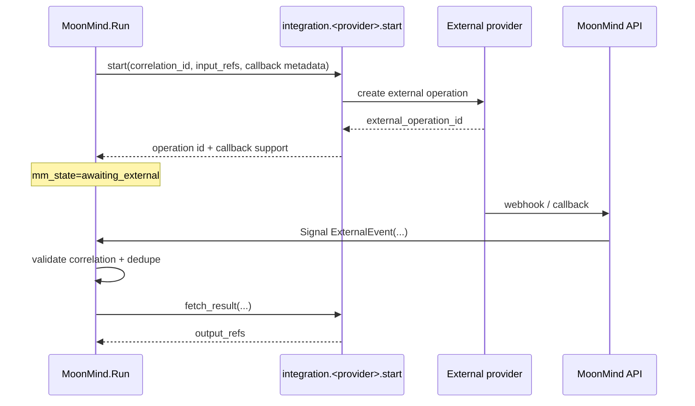

# Integrations Monitoring Design

Status: Draft (Temporal-first, migration-aware)  
Owner: MoonMind Platform  
Last updated: 2026-03-05  
Audience: backend, workflow, API, worker, and dashboard implementers

## 1) Purpose

MoonMind needs a standard way to integrate with external systems that run work asynchronously over time, such as Jules, GitHub-driven automation, CI systems, or future vendor job APIs.

For Temporal-managed flows, MoonMind should model this work using:

* **Workflow Executions** as the durable orchestration unit
* **Activities** for all provider I/O and side effects
* **Signals** for inbound callbacks and external notifications
* **Timers** for durable polling fallback
* **Artifacts** for large payloads, raw provider events, and results
* **Temporal Visibility** plus MoonMind search attributes for dashboard filtering

This design is intentionally **provider-neutral**. Jules is the default example throughout because MoonMind already has a Jules adapter and current Jules polling behavior elsewhere in the codebase.

> This document does not introduce a parallel product-level "integration queue." Temporal Task Queues remain worker routing only.

## 2) Related docs

This design builds on the existing Temporal docs and should not override their locked decisions:

* `docs/Temporal/TemporalArchitecture.md`
* `docs/Temporal/WorkflowTypeCatalogAndLifecycle.md`
* `docs/Temporal/ActivityCatalogAndWorkerTopology.md`
* `docs/Temporal/WorkflowArtifactSystemDesign.md`
* `docs/Temporal/TemporalPlatformFoundation.md`

## 3) State alignment

### 3.1 Current repo state

MoonMind today has:

* a Temporal foundation in Docker Compose
* Temporal-backed execution lifecycle and artifact API contracts
* canonical Temporal control names such as `UpdateInputs`, `SetTitle`, `RequestRerun`, and `ExternalEvent`
* a task-oriented dashboard and compatibility APIs during migration
* existing non-Temporal Jules adapter and polling behavior in current worker code

### 3.2 Target state

As MoonMind migrates durable orchestration to Temporal, external integration monitoring should become a **Temporal-native concern** inside `MoonMind.Run` executions by default:

* start the provider operation in an Activity
* transition workflow state to `awaiting_external`
* accept provider callbacks through `ExternalEvent` signals when possible
* fall back to timer-driven status polling when callbacks are absent or unreliable
* persist results and raw provider payloads as artifacts

### 3.3 Non-goals

This document does not:

* claim that all existing Jules or integration paths are already Temporal-backed
* introduce a new root workflow type per provider
* expose Temporal task queue concepts as user-facing queue semantics
* replace current task-oriented APIs in one step

## 4) Design principles

1. **`MoonMind.Run` is the default orchestration anchor.**  
   External monitoring usually belongs inside the main run lifecycle. Use a child workflow only when isolation, history pressure, or a materially different retry/failure domain justifies it.

2. **Workflow code stays deterministic.**  
   Provider APIs, webhook verification, filesystem access, and artifact writes all happen in Activities or the API layer.

3. **Callback-first, hybrid by default.**  
   If a provider can call back, prefer callback handling and keep polling as a safety net unless reliability is already proven.

4. **Artifacts hold large or volatile payloads.**  
   Raw provider responses, webhook bodies, logs, and fetched outputs should not bloat workflow history.

5. **Use MoonMind's existing Temporal vocabulary.**  
   Async external events enter workflows through the `ExternalEvent` signal. Visibility uses the canonical `mm_*` search attributes already defined by the lifecycle docs.

6. **Idempotency must survive retries and Continue-As-New.**  
   Use a stable `correlation_id`, not `run_id`, as the long-lived provider correlation handle.

7. **Keep worker topology minimal until operations prove otherwise.**  
   Start on `mm.activity.integrations`. Split into provider-specific queues only for distinct secrets, quota isolation, or scaling pressure.

8. **Provider specifics stay behind adapters.**  
   Jules may be the first profile, but the contract must remain portable to other integrations.

## 5) Canonical model: external operation state

Each monitored provider operation should map into a small workflow-side state object.

### Required workflow state

* `integration_name`  
  Example: `jules`
* `correlation_id`  
  Stable MoonMind-generated identifier that survives Continue-As-New
* `external_operation_id`  
  Provider handle such as a Jules `taskId`
* `normalized_status`  
  Portable MoonMind-facing status such as `queued | running | succeeded | failed | canceled | unknown`
* `provider_status`  
  Raw provider status token for debugging and display
* `started_at`
* `last_observed_at`
* `monitor_attempt_count`
* `callback_supported`
* `result_ref` or `result_refs`

### Optional workflow state

* `callback_correlation_key`
* `provider_event_ids_seen` or equivalent bounded dedupe state
* `next_poll_at`
* `poll_interval_seconds`
* `external_url`
* `provider_summary` as small JSON only
* `wait_cycle_count`

### State discipline

* Keep only compact state in workflow memory/history.
* Store raw callback payloads, provider status snapshots, and fetched outputs as artifacts when non-trivial.
* Do not assume `run_id` is stable across the lifetime of the integration wait path.

## 6) Provider activity contract

Activity naming should follow the existing catalog style:

* `integration.<provider>.start`
* `integration.<provider>.status`
* `integration.<provider>.fetch_result`
* `integration.<provider>.cancel`

Default routing is `mm.activity.integrations`.

### 6.1 `integration.<provider>.start`

**Purpose**

Start the external operation and return the provider handle plus monitoring hints.

**Input**

* `correlation_id`
* `idempotency_key`
* `input_refs[]`
* `parameters`
* optional callback metadata such as callback URL or correlation token

**Output**

* `external_operation_id`
* `normalized_status`
* `provider_status`
* `callback_supported`
* optional `callback_correlation_key`
* optional `recommended_poll_seconds`
* optional `external_url`
* optional small `provider_summary`

**Rules**

* Must be safe under retry.
* Idempotency keys should be derived from stable execution identity, such as `correlation_id + provider + request hash`, not Temporal `run_id`.
* If the provider does not support idempotent create, the activity must document the risk and fail conservatively on ambiguous timeouts instead of silently creating duplicates.

### 6.2 `integration.<provider>.status`

**Purpose**

Read provider status during polling or reconciliation.

**Input**

* `external_operation_id`

**Output**

* `normalized_status`
* `provider_status`
* `terminal`
* optional `recommended_poll_seconds`
* optional `external_url`
* optional small `provider_summary`

**Rules**

* Treat as read-only and aggressively retryable.
* Normalize provider-specific statuses into a small MoonMind-facing set while preserving raw status for diagnostics.

### 6.3 `integration.<provider>.fetch_result`

**Purpose**

Fetch or materialize provider outputs after terminal success, or write a compact failure summary artifact when terminal failure details matter.

**Input**

* `external_operation_id`
* optional output destination hints

**Output**

* `output_refs[]`
* optional `summary`
* optional `diagnostics_ref`

**Rules**

* Must store large outputs as artifacts.
* Artifact creation must be idempotent.
* Returning the same artifact reference on retry is preferred.

### 6.4 `integration.<provider>.cancel`

**Purpose**

Best-effort provider cancellation.

**Input**

* `external_operation_id`

**Output**

* `accepted`
* `final_provider_status`
* optional `summary`

**Rules**

* If the provider has no cancel capability, fail fast with an explicit unsupported result. Do not pretend cancellation succeeded.

## 7) Workflow pattern

### 7.1 Default pattern: `MoonMind.Run` with external wait state

For most integrations:

1. `MoonMind.Run` executes `integration.<provider>.start`
2. Workflow updates visibility:
   * `mm_state = awaiting_external`
   * optional `mm_integration = <provider>`
   * memo summary reflects the wait condition
3. Workflow waits for:
   * `ExternalEvent` signal
   * polling timer
   * user cancellation
   * optional pause/resume controls
4. On terminal success, workflow runs `integration.<provider>.fetch_result`
5. Workflow resumes execution or finalization

### 7.2 Callback-first path

Use when the provider can reliably notify MoonMind.

### 7.3 Polling fallback path

Use when callbacks do not exist or are not trustworthy enough.

Loop shape:

1. wait on a durable timer
2. call `integration.<provider>.status`
3. if non-terminal, update poll policy and continue
4. if terminal success, fetch results
5. if terminal failure, produce a failure summary artifact and fail the run with `integration_error`

### 7.4 Hybrid path

This should be the **default recommendation** for new providers unless there is a strong reason not to use it.

Rules:

* arm a polling timer even when callbacks are enabled
* if callback arrives first, consume it and stop polling
* if polling observes a terminal result first, late callbacks become harmless duplicates
* use a terminal-state latch so callback and poll races do not double-complete the workflow

### 7.5 Child workflow usage

Use a child workflow only when one of these is true:

* the external wait path is much longer-lived than the rest of the run
* provider-specific monitoring would otherwise dominate workflow history
* the integration needs an isolated retry or cancellation policy
* a manifest-style parent workflow needs many independently monitored external operations

Do not create one root workflow type per provider just to model this.

## 8) Callback ingestion, correlation, and deduplication

### 8.1 Inbound event path

Recommended callback flow:

1. Provider calls a MoonMind API endpoint
2. API verifies signature, token, request size, and basic schema
3. API resolves the target workflow using a durable correlation record
4. API stores the raw payload as an artifact when useful
5. API signals the workflow with `ExternalEvent`

### 8.2 Correlation record

Do **not** rely on indexing provider operation IDs in Temporal Visibility by default.

Instead, maintain a small durable correlation record outside workflow history keyed by values such as:

* `integration_name`
* `callback_correlation_key`
* `external_operation_id`
* `workflow_id`
* latest `run_id` if operationally useful
* lifecycle status / expiry metadata

Why:

* external IDs are provider-specific detail, not core list-filter data
* correlation must survive Continue-As-New
* API callback handling often needs direct lookup without a visibility scan

### 8.3 `ExternalEvent` signal shape

The current MoonMind execution API already exposes `ExternalEvent`. For integrations monitoring, the payload should stay small and include fields such as:

* `source`
* `event_type`
* `external_operation_id`
* `provider_event_id` when available
* `normalized_status` when known
* `provider_status` when known
* `observed_at`
* optional `payloadArtifactRef` when the raw event body is stored as an artifact

### 8.4 Dedupe rules

* Prefer provider event IDs when available.
* Otherwise dedupe conservatively on `(integration_name, external_operation_id, event_type, observed_at bucket)`.
* After the workflow reaches a terminal state for the external operation, ignore non-terminal late events.
* Callback handling must be safe under replay, duplicate delivery, and out-of-order arrival.

## 9) Visibility and dashboard contract

This design should reuse the existing Temporal lifecycle vocabulary rather than inventing new dashboard fields first.

### 9.1 Search attributes

Required canonical fields remain:

* `mm_owner_id`
* `mm_state`
* `mm_updated_at`
* `mm_entry`

Optional bounded fields relevant to integrations:

* `mm_integration`
* `mm_stage` if needed and bounded

### 9.2 Recommended usage

* Set `mm_state=awaiting_external` while the workflow is blocked on provider progress.
* Set `mm_integration=<provider>` when the run is primarily waiting on one integration.
* Keep high-cardinality provider identifiers out of default search attributes unless a specific product requirement justifies the indexing cost.

### 9.3 Memo guidance

Memo should stay small and human-readable:

* `title`
* `summary`
* optional safe display detail such as `external_url`

Raw provider payloads, detailed status dumps, and large outputs belong in artifacts, not Memo.

### 9.4 Migration note

Task-oriented list/detail views may continue to expose `taskId`-style compatibility fields, but the Temporal-side source of truth remains the workflow execution plus its artifacts and visibility metadata.

## 10) Polling policy, concurrency, and rate limits

### 10.1 Poll timing

Recommended default behavior:

* honor provider `recommended_poll_seconds` when reasonable
* otherwise start small, then back off
* reset backoff when provider status materially changes
* cap steady-state polling to a conservative upper bound

Suggested starting policy:

* initial delay: `5s`
* exponential backoff with jitter
* cap: `2m` to `5m`, provider-dependent

### 10.2 Continue-As-New for long waits

Polling and callback dedupe can make executions long-lived. To control history growth:

* Continue-As-New after a bounded number of wait cycles
* preserve `workflow_id`, `correlation_id`, core memo/search attributes, and provider state needed to resume
* do not key provider idempotency logic off `run_id`

Initial policy can be a placeholder, but should be explicit. A reasonable starting point is every `100-200` wait cycles or earlier if dedupe state grows materially.

### 10.3 Worker routing and rate limits

Start with:

* workflow queue: `mm.workflow`
* integration activities: `mm.activity.integrations`

Add provider-specific queues such as `mm.activity.integrations.jules` only when:

* secrets differ materially
* provider quotas require isolated concurrency
* traffic justifies independent scaling

Primary controls:

* worker concurrency limits
* in-worker token bucket or host/API-key rate limiting
* config-driven limits that are visible in logs and run metadata

## 11) Error handling and cancellation

### 11.1 Retry posture

* `start`: retry only when idempotency is trustworthy
* `status`: retry aggressively on transient transport and 5xx failures
* `fetch_result`: retry with idempotent artifact writes
* `cancel`: retry conservatively and surface unsupported/ambiguous outcomes clearly

### 11.2 Terminal failure handling

When the provider reaches terminal failure:

* write a compact failure summary artifact
* preserve raw provider detail as an artifact when available
* set workflow failure metadata so the UI can show `integration_error`
* include a short operator-facing next action in the final summary

### 11.3 User cancellation

If a user cancels the workflow while an external operation is in flight:

1. workflow receives cancellation
2. workflow attempts `integration.<provider>.cancel` when supported
3. workflow records whether the provider accepted or ignored cancellation
4. workflow closes with MoonMind cancellation semantics even if provider cancellation is best-effort

## 12) Security

### 12.1 Secrets and privileges

* Provider credentials belong only in integration workers and approved secret stores.
* Workflow history, artifacts, and memo fields must never contain raw secrets.
* Split queues and worker deployments only when secret isolation or operational policy requires it.

### 12.2 Webhook handling

* verify signatures or provider auth tokens in the API layer
* apply strict request size limits and rate limits
* require correlation material that is hard to guess
* reject malformed or unverifiable callbacks early

### 12.3 Artifact hygiene

If raw callback or result payloads are stored as artifacts:

* redact secrets before preview generation
* use short-lived download grants
* keep provider debug payloads under appropriate retention classes

## 13) Testing strategy

### 13.1 Unit tests

* provider status normalization
* `start` idempotency behavior
* `fetch_result` idempotent artifact writes
* callback verification and dedupe
* correlation record lookup behavior

### 13.2 Temporal integration tests

* callback arrives before the workflow begins waiting
* callback arrives after several polling cycles
* hybrid mode where callback and polling race
* Continue-As-New preserves provider monitoring state
* cancellation during `awaiting_external`

### 13.3 Failure injection

* provider 429 and 5xx responses
* ambiguous timeout on `start`
* duplicate or reordered webhook events
* missed webhook forcing polling fallback
* terminal provider failure with result fetch or artifact write retries

## 14) Jules profile (default example)

Jules is the clearest current example because MoonMind already has a Jules client with:

* `create_task`
* `get_task`
* `resolve_task`

and current worker-side polling outside Temporal.

### 14.1 Temporal mapping

Recommended activity names:

* `integration.jules.start`
* `integration.jules.status`
* `integration.jules.fetch_result`
* `integration.jules.cancel`

Mapping:

* `external_operation_id` = Jules `taskId`
* `provider_status` = raw Jules `status`
* `normalized_status` = MoonMind portable status derived from Jules status
* `external_url` = Jules task or PR URL when provided

### 14.2 Status normalization

MoonMind should normalize Jules statuses into the common set while preserving the raw value. For example:

* success-like Jules statuses such as `completed`, `succeeded`, `done`, or `resolved` -> `succeeded`
* failure-like statuses such as `failed`, `error`, `canceled`, or `timeout` -> `failed` or `canceled`
* anything else -> `queued`, `running`, or `unknown` depending on the provider contract

### 14.3 Recommended monitoring mode

* If Jules offers reliable callbacks, use hybrid monitoring by default.
* If callbacks are unavailable, polling fallback is acceptable.
* If Jules does not support provider-side cancellation, return explicit unsupported cancellation results rather than silently swallowing cancel requests.

### 14.4 Result handling

At minimum, Jules result handling should produce:

* a compact summary artifact
* any provider URLs needed for follow-up
* optional raw payload artifacts if Jules later exposes richer terminal output

## 15) Implementation order

1. Finalize the provider activity contract and normalized status model.
2. Add durable callback correlation storage rather than depending on search-attribute lookup by external ID.
3. Implement `ExternalEvent`-driven callback handling in the API and workflow path.
4. Add timer-based polling fallback and explicit Continue-As-New policy.
5. Wire visibility updates using existing `mm_*` lifecycle fields.
6. Add provider-specific tests and only then consider reconciliation schedules.

## 16) Open decisions

* Which integrations should migrate first after Jules?
* Does MoonMind need direct detail lookup by provider operation ID, or is correlation storage enough?
* What is the acceptable worst-case completion-detection latency per provider?
* Which integrations truly support durable cancellation versus best-effort cancellation?
* When should a provider earn its own worker queue instead of sharing `mm.activity.integrations`?

## 17) Summary

MoonMind should treat integration monitoring as a normal Temporal workflow concern:

* external work starts in provider Activities
* workflows wait durably in `awaiting_external`
* callbacks enter through `ExternalEvent`
* polling is a fallback or safety net
* results and raw provider payloads are stored as artifacts
* visibility stays aligned with existing `mm_*` lifecycle contracts

This keeps the design flexible for multiple integrations, aligns with the repo's current Temporal direction, and uses Jules as a concrete example without turning Jules-specific behavior into a core platform abstraction.
