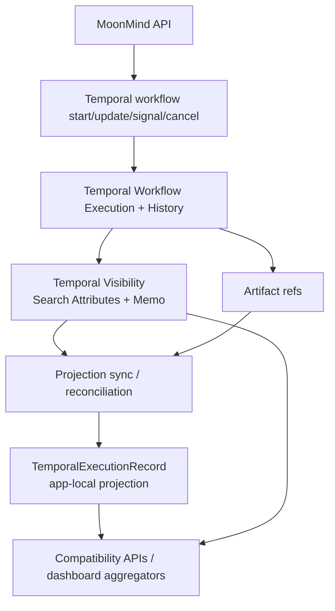

# Source of Truth and Projection Model

**Project:** MoonMind  
**Doc type:** System architecture / read-model and consistency contract  
**Status:** Draft (implementation-oriented)  
**Last updated:** 2026-03-06 (America/Los_Angeles)

---

## 1. Purpose

This document defines the **source-of-truth model** for Temporal-managed executions in MoonMind and the role of the app-local **projection layer** during migration.

It exists to answer four questions clearly:

1. Which system is authoritative for execution lifecycle state?
2. What is the role of `TemporalExecutionRecord` and similar app-local rows?
3. How should reads and writes behave while MoonMind still exposes task-oriented compatibility surfaces?
4. How do we reconcile drift between Temporal, Postgres projections, and compatibility APIs/UI?

This document is intentionally a **bridge contract**. It must acknowledge the current implementation honestly while still locking the target architecture.

---

## 2. Related docs

Primary:

- `docs/Temporal/TemporalArchitecture.md`
- `docs/Temporal/TemporalPlatformFoundation.md`
- `docs/Temporal/WorkflowTypeCatalogAndLifecycle.md`

Adjacent / expected follow-ups:

- `docs/Temporal/VisibilityAndUiQueryModel.md`
- `docs/Temporal/TaskExecutionCompatibilityModel.md`
- `docs/Ui/TemporalDashboardIntegration.md`
- `docs/Temporal/RunHistoryAndRerunSemantics.md`

Implementation touchpoints:

- `api_service/api/routers/executions.py`
- `api_service/db/models.py`
- `moonmind/workflows/temporal/service.py`

---

## 3. Scope and non-goals

### 3.1 In scope

This document covers:

- Temporal-managed execution identity and lifecycle truth
- Postgres projection rows used by MoonMind APIs/UI
- consistency and reconciliation rules between Temporal and local projections
- migration posture for `/api/executions`, `/tasks/*`, and other compatibility surfaces
- Continue-As-New behavior as it affects projection shape
- degraded-mode behavior when one subsystem is unavailable

### 3.2 Not in scope

This document does **not** define:

- artifact byte storage internals
- worker fleet topology
- direct UI component design
- detailed auth policy beyond ownership invariants
- legacy queue/orchestrator persistence internals except where they intersect with compatibility surfaces

---

## 4. Definitions

### 4.1 Temporal source of truth

For a Temporal-managed execution, the canonical runtime truth is the combination of:

- Temporal Workflow Execution identity and history
- Temporal close status / run chain
- Temporal Visibility state used for list/query/count behavior
- workflow-managed Search Attributes and Memo fields

### 4.2 Projection

A **projection** is an app-local read model derived from canonical runtime data.

In the current repository, `TemporalExecutionRecord` is the main projection row for Temporal execution lifecycle APIs and filtering. A projection is allowed to support compatibility APIs, joins, indexing, caching, and degraded-mode reads, but it is **not** the final lifecycle authority once Temporal is truly in control.

### 4.3 Compatibility surface

A compatibility surface is any API or UI path that continues to use MoonMind task-oriented language or legacy route shape while the underlying execution substrate is becoming Temporal.

Examples include:

- `/tasks/*`
- transitional orchestrator/task views
- task-oriented dashboard list/detail models

### 4.4 Reconciliation

Reconciliation is the process of comparing projection state against Temporal truth and repairing drift.

### 4.5 Ghost row

A **ghost row** is a projection record that appears to represent a running execution even though no authoritative Temporal execution exists for it.

Ghost rows are explicitly disallowed in production architecture.

---

## 5. Architectural stance

### 5.1 Final target stance

For **Temporal-managed work**, MoonMind should treat systems of record as follows:

| Concern | Authoritative system |
| --- | --- |
| workflow existence | Temporal |
| durable execution identity (`workflowId`) | Temporal |
| current run identity (`runId`) | Temporal |
| lifecycle / close status | Temporal |
| list/filter/query state for Temporal-managed work | Temporal Visibility |
| display metadata for Temporal-managed work | Temporal Memo + derived workflow metadata |
| artifact bytes | Artifact system |
| artifact metadata / linkage | Artifact metadata tables + workflow refs |
| user auth / ownership policy | MoonMind control plane |
| task-oriented compatibility payloads | MoonMind adapters over canonical sources |

### 5.2 Migration stance

During migration, MoonMind may temporarily use Postgres projections as:

- a local read model for APIs not yet moved to direct Temporal reads
- a compatibility join layer across queue/orchestrator/Temporal sources
- a degraded-mode cache
- a staging implementation while Temporal worker wiring is still being completed

But the migration must move **toward** this rule:

> Projection rows mirror Temporal-managed executions; they do not independently define them.

### 5.3 Current implementation carve-out

The current `TemporalExecutionService` acts as a **state machine + visibility facade** over `TemporalExecutionRecord` rows. That is acceptable as a staging step, but this document treats it as a **temporary implementation posture**, not the final architecture contract.

Additional staging-only realities that should not be normalized into the target contract:

- the current `/api/executions` adapter returns `countMode="exact"` from the projection-backed read path
- the current projection/service remains projection-authoritative for create/update/signal/cancel semantics even though ownership metadata and projection sync markers are now explicitly tracked

---

## 6. Source layering model

Interpretation:

- **Temporal Workflow + Visibility** is the canonical runtime layer.
- **Projection rows** are downstream read models.
- **Compatibility APIs** may consume projection rows, but must not invert the authority relationship.

---

## 7. Current implementation snapshot

The repository already contains a concrete projection-backed execution layer.

### 7.1 `TemporalExecutionRecord`

`TemporalExecutionRecord` is currently an app-local row keyed by `workflow_id` and includes:

- identity: `workflow_id`, `run_id`, `namespace`, `workflow_type`, `owner_id`, `owner_type`, `entry`
- lifecycle: `state`, `close_status`, `paused`, `awaiting_external`
- list/detail metadata: `search_attributes`, `memo`
- refs: `artifact_refs`, `input_ref`, `plan_ref`, `manifest_ref`
- mutable execution context: `parameters`, `pending_parameters_patch`
- operational counters: `step_count`, `wait_cycle_count`, `rerun_count`
- idempotency/cache helpers: `create_idempotency_key`, `last_update_idempotency_key`, `last_update_response`
- projection sync metadata: `projection_version`, `last_synced_at`, `sync_state`, `sync_error`, `source_mode`
- timestamps: `started_at`, `updated_at`, `closed_at`

### 7.2 `TemporalExecutionService`

The service currently:

- creates execution rows
- lists and counts them with local pagination tokens
- applies update/signal/cancel semantics against the projection
- updates `search_attributes` and `memo`
- mutates `run_id` on Continue-As-New style rerun behavior
- returns projection-backed list counts as `countMode="exact"` in the current adapter path

### 7.3 `ExecutionModel`

The current `/api/executions` response model serializes directly from the projection row and exposes:

- `workflowId`
- `runId`
- `workflowType`
- `state`
- `temporalStatus`
- `closeStatus`
- `searchAttributes`
- `memo`
- `artifactRefs`
- timestamps

This is a valid **prototype API shape**, but in the final Temporal-backed architecture the lifecycle truth behind these fields must come from Temporal, not from a separately invented local state machine.

---

## 8. Source-of-truth matrix

### 8.1 Target steady-state matrix for Temporal-managed executions

| Data / behavior | Source of truth | Projection role | Notes |
| --- | --- | --- | --- |
| `workflow_id` | Temporal start result | cached copy | stable identity; never generated independently once Temporal start is authoritative |
| latest `run_id` | Temporal | cached copy | updated in place on Continue-As-New |
| `workflow_type` | Temporal start input / execution type | cached copy | should never diverge after creation |
| Temporal-backed `taskId` compatibility handle | MoonMind adapter over canonical `workflowId` | derived alias only | for Temporal-backed compatibility surfaces, `taskId` must equal `workflowId`; projection must not mint a second durable ID |
| domain `state` (`mm_state`) | workflow-driven Search Attribute + lifecycle mapping | cached copy for joins and compatibility reads | Temporal close status and `mm_state` must stay consistent |
| close / terminal status | Temporal | cached copy | `completed|failed|canceled|terminated|timed_out` mapping remains canonical in Temporal |
| list filters / ordering | Temporal Visibility | optional cache/fallback | final Temporal list behavior must follow Visibility semantics |
| `memo.title` / `memo.summary` | workflow / Temporal Memo | cached copy | projection may denormalize for compatibility APIs |
| `artifact_refs` | workflow + artifact linkage | cached copy | large blobs remain outside workflow history |
| input/plan/manifest refs | workflow inputs + artifact system | cached copy | safe to mirror for compatibility/detail pages |
| ownership filter (`mm_owner_type` + `mm_owner_id`) | MoonMind auth policy mirrored into Temporal | cached copy | MoonMind owns auth; Temporal stores the searchable mirror; projection rows now mirror explicit owner type and owner id values |
| create/update idempotency behavior | MoonMind API contract | local helper state allowed | dedupe is an API concern, not a Temporal history replacement |
| page tokens / count semantics for Temporal list APIs | Temporal Visibility read path | local fallback only | avoid baking DB-offset assumptions into final Temporal-backed APIs |

### 8.2 Migration-phase exception matrix

| Phase | Write authority | Read authority | Projection role |
| --- | --- | --- | --- |
| prototype / staging | local service facade | projection | allows API contract development before full Temporal wiring |
| transition | Temporal for writes; projection refreshed best-effort | mixed: projection + Temporal depending on route | compatibility and migration layer |
| steady-state Temporal-managed flow | Temporal | Temporal Visibility + direct describe, with projection as optional cache/join | downstream read model only |

---

## 9. Projection model

### 9.1 Core rule

There is **one primary execution projection row per Workflow ID**, not per run.

That means:

- `workflow_id` is the stable primary key
- `run_id` is the **latest known run** for that workflow chain
- Continue-As-New updates the existing row instead of creating a second primary execution row

### 9.2 What the primary projection row is for

The primary projection row exists to support:

- compatibility APIs that are not yet direct Temporal consumers
- task-oriented dashboards that still need MoonMind-shaped joins
- local indexing and exact counts where explicitly allowed
- repair and observability tooling
- optional degraded-mode reads when the authoritative source is temporarily impaired

### 9.3 What the primary projection row is not for

The primary projection row must **not** become:

- a second lifecycle engine
- a substitute for workflow history
- the audit source for per-run replay or debugging
- a place to reintroduce legacy queue semantics for Temporal task queues

### 9.4 Projection sync metadata

The current schema now includes explicit sync metadata:

- `projection_version`
- `last_synced_at`
- `sync_state` (`fresh | stale | repair_pending | orphaned`)
- `sync_error`
- `source_mode` (`projection_only | mixed | temporal_authoritative`)

That metadata is still a projection concern, not a claim that the projection has become authoritative.

---

## 10. Write-path contract

### 10.1 Start execution

Final target behavior for a Temporal-managed start:

1. MoonMind API authenticates and validates the request.
2. MoonMind starts the Temporal workflow.
3. Temporal returns canonical execution identity.
4. MoonMind writes or upserts the projection row from the canonical start result.
5. MoonMind returns the execution payload.

Rules:

- The system should not mint an authoritative local execution before Temporal accepts the start.
- If Temporal start fails, no production projection row should survive as an active execution.
- If Temporal start succeeds but projection upsert fails, the workflow still exists. MoonMind should treat projection repair as follow-up work, not rewrite history to pretend the start never happened.

### 10.2 Update execution

Final target behavior:

1. Validate caller authorization and request shape.
2. Send the Update to Temporal.
3. Use the workflow response as the authoritative accept/reject result.
4. Refresh or repair the projection from Temporal-visible state.

Rules:

- Do not accept an update purely by mutating the projection if the underlying workflow rejected it.
- Local cached update responses may exist for idempotency, but the authoritative update effect comes from Temporal/workflow logic.

### 10.3 Signal execution

Final target behavior:

1. Validate caller / webhook policy.
2. Send Signal to Temporal.
3. Refresh projection from Temporal-visible state.

Rules:

- Projection should reflect that a signal was processed, but the signal must not be modeled as a projection-only state transition once the workflow is live.
- Webhook or external callback authenticity remains a MoonMind policy concern even when the transport is a Temporal Signal.

### 10.4 Cancel execution

Final target behavior:

1. Authorize cancel request.
2. Send cancel/terminate request to Temporal.
3. Let Temporal terminal status become authoritative.
4. Refresh projection from the resulting close state.

### 10.5 Current staging allowance

Until real Temporal workflow start/update/signal/cancel plumbing is fully wired, the current projection-backed service may continue to simulate lifecycle behavior for API development.

But from this point forward:

- new docs should describe it as a **staging implementation**
- new code should avoid depending on projection-only semantics that conflict with the final Temporal contract
- migration work should reduce, not deepen, the amount of lifecycle truth invented locally

---

## 11. Read-path contract

### 11.1 Final target read posture for Temporal-managed executions

For Temporal-managed work:

- **list/filter/count** should come from Temporal Visibility
- **detail/describe** should come from Temporal execution state plus safe MoonMind enrichment
- **compatibility/task-oriented views** may merge projection data or other local joins, but must preserve canonical Temporal identifiers internally

### 11.2 Projection-backed reads are allowed only for explicit reasons

Projection-backed reads are still allowed when one of these is true:

- the route is explicitly in prototype mode
- the route is a compatibility adapter not yet moved to direct Temporal reads
- the route needs local joins not present in Temporal Visibility
- the system is in a degraded mode where projection fallback is allowed

### 11.3 Sorting and count semantics

Rules:

- For Temporal-managed list APIs, sort semantics should align with `mm_updated_at` and other approved Visibility fields.
- `countMode` must reflect the actual source behavior.
- Exact counts are allowed when the active source can provide them truthfully.
- `estimated_or_unknown` is an acceptable truthful mode once a route is genuinely Temporal-backed and exact count is unavailable or operationally misleading.
- Once a route becomes truly Temporal-backed, avoid pretending that a projection-only exact count is the canonical answer for a Temporal query.

### 11.4 Compatibility surfaces

Compatibility surfaces such as `/tasks/*` may continue to present a unified task view across multiple backends.

Rules:

- They may use projections and joins.
- They must not erase the fact that a given row is backed by Temporal.
- They must not invent queue-order semantics for Temporal task queues.
- They must preserve `workflowId` and source metadata internally even if the UI still leads with `taskId`.
- For Temporal-backed rows, compatibility surfaces must preserve the fixed identifier bridge: `taskId == workflowId`.

---

## 12. Reconciliation and repair model

### 12.1 Required repair triggers

Projection repair should happen through more than one path:

1. **post-mutation refresh** after start/update/signal/cancel where practical
2. **periodic sweeper** that compares recent Temporal executions against projection rows
3. **repair-on-read** when a requested row is missing or obviously stale
4. **startup/backfill repair** after outages or deployments

### 12.2 Drift types and repair rules

| Drift type | Repair rule |
| --- | --- |
| projection row missing, Temporal execution exists | create/upsert projection from Temporal truth |
| projection row exists, latest `run_id` stale after Continue-As-New | update row in place with latest `run_id`; preserve `workflow_id` |
| projection `state` or `close_status` disagrees with Temporal | trust Temporal and overwrite projection |
| projection `search_attributes` or `memo` stale | refresh from current Temporal-visible values |
| projection row exists but Temporal execution does not | mark row `orphaned` / quarantine; do not present as active execution by default |
| artifact refs diverge | refresh from canonical workflow/artifact linkage and deduplicate |

### 12.3 Repair ordering

When repairing a row, prefer this order:

1. execution existence and identity
2. current run and terminal status
3. domain state / search attributes
4. memo display fields
5. artifact refs and convenience fields
6. local sync metadata

### 12.4 Consistency expectation

MoonMind should treat the projection layer as **eventually consistent** with Temporal once the flow is truly Temporal-backed.

Desired posture:

- synchronous best-effort refresh after user mutations
- asynchronous repair for missed or failed syncs
- staleness measured in **seconds-level operational windows**, not long-lived manual repair by default

This is a posture statement, not a locked numerical SLO yet.

---

## 13. Degraded-mode rules

### 13.1 Temporal unavailable for writes

If Temporal is unavailable for workflow start/update/signal/cancel:

- reject the mutating operation
- do not create a production ghost row that pretends the execution exists
- allow projection-only fallback only in explicitly isolated local-dev/test modes

### 13.2 Temporal Visibility degraded, execution truth still reachable

If Visibility is degraded but workflow truth is otherwise reachable:

- detail endpoints may still serve direct execution data where possible
- list endpoints may temporarily fall back to projection data **only if** the route explicitly allows stale-read fallback
- stale fallback should be observable in logs/metrics and ideally marked internally
- stale fallback must not quietly preserve a canonical-feeling exact count or freshness claim if the route can no longer support it truthfully

### 13.3 App DB / projection store unavailable

If the projection store is unavailable but Temporal is healthy:

- canonical execution truth still exists in Temporal
- direct Temporal-backed reads/writes may continue where the route supports them
- compatibility surfaces depending on projections may degrade or return partial results
- projection repair must backfill missed rows once the DB recovers

### 13.4 Mixed-source dashboard behavior

For unified task views that combine legacy and Temporal-backed rows:

- source outages must be surfaced honestly
- the system must not synthesize fake success or terminal states just to keep a dashboard row stable
- source metadata should remain available for debugging and migration support

---

## 14. Continue-As-New and run history

### 14.1 Primary rule

The primary execution projection is keyed by **Workflow ID**, not Run ID.

### 14.2 What changes on Continue-As-New

On Continue-As-New:

- `workflow_id` stays the same
- `run_id` changes to the latest run
- `state`, `summary`, counters, and other mirrored fields update to the latest canonical values
- the primary projection row is updated in place
- in the current staging projection, `started_at` remains the logical execution start rather than becoming a per-run start timestamp

### 14.3 What we do not duplicate by default

By default, MoonMind should not create a second primary execution row for every run in a Workflow ID chain.

If the product later needs a per-run audit or run-history view, add a **separate run-history projection** instead of overloading the primary execution row.

### 14.4 `rerun_count`

`rerun_count` is a local convenience field and may remain useful for compatibility/UI messaging, but it must not become the only audit source for run history.

Current implementation note:

- `rerun_count` currently behaves as a broad Continue-As-New counter, not a guaranteed count of explicit user-requested reruns only

Temporal remains the authoritative source for the run chain.

---

## 15. Ownership and responsibilities

### 15.1 Workflow authors

Workflow authors own:

- lifecycle transitions emitted through Temporal
- correct Search Attribute and Memo updates
- invariant-preserving Update/Signal behavior

### 15.2 API / control plane owners

API owners own:

- auth and ownership enforcement
- idempotency policy at the API boundary
- compatibility route behavior
- projection schema and repair orchestration

### 15.3 Projection / data-plane owners

Projection owners own:

- sync jobs / repair jobs
- orphan detection
- consistency metrics and alerts
- schema evolution for compatibility and local read models

### 15.4 UI / dashboard owners

UI owners may consume projection-backed views, but must not define lifecycle truth independently of the canonical execution layer.

---

## 16. Acceptance criteria for this document

This document is complete enough to guide implementation when all of the following are true:

1. The source-of-truth matrix is accepted.
2. Projection rows are explicitly defined as downstream read models for Temporal-managed work.
3. The Temporal-backed identifier bridge is fixed: `taskId == workflowId` for compatibility surfaces.
4. Write-path rules are fixed for start/update/signal/cancel.
5. Read-path rules are fixed for Temporal-backed list/detail and compatibility surfaces.
6. Reconciliation rules are defined for missing, stale, and orphaned rows.
7. Continue-As-New handling is unambiguous for the primary execution projection.
8. Degraded-mode behavior forbids ghost rows in production.

---

## 17. Open questions to lock next

1. Do we want a dedicated per-run projection table for future run-history UI, or keep run history fully Temporal-native until demanded?
2. Which sync mechanism becomes primary: post-write refresh only, periodic sweeper, workflow-emitted events, or a hybrid?
3. Do compatibility surfaces need a formal freshness marker once projection fallback is allowed for degraded-mode reads?
4. When should `/api/executions` switch from the current projection-backed exact-count posture to a Visibility-backed count posture that can honestly return `estimated_or_unknown`?

---

## 18. Summary

MoonMind is moving to a model where **Temporal owns execution truth** and **Postgres projections mirror it for compatibility and local read needs**.

The architectural rule to preserve is:

> For Temporal-managed executions, Projection is a read model, not a second workflow engine.

That rule allows MoonMind to:

- keep task-oriented and compatibility surfaces during migration
- support local joins, counts, and fallback reads where needed
- avoid long-term dual-write ambiguity
- adopt Temporal-native lifecycle, visibility, and Continue-As-New semantics without hiding them under a conflicting local state machine
