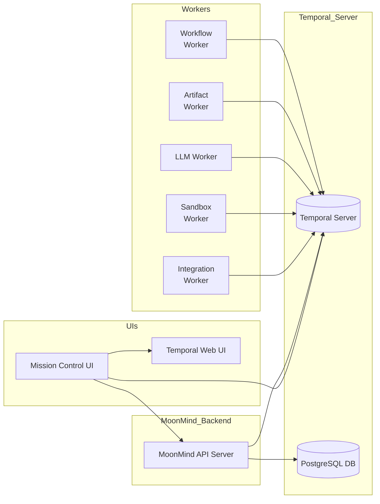
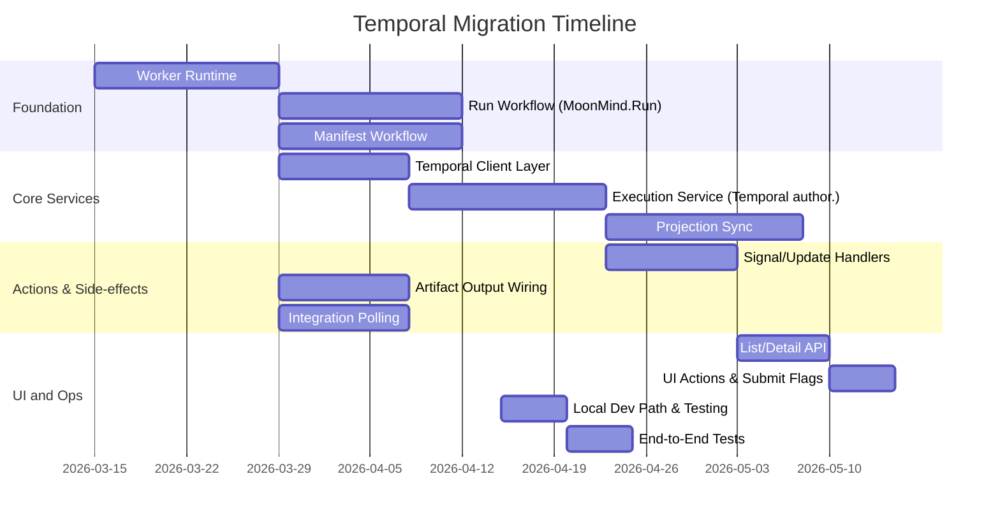

# Temporal Migration Plan

MoonMind has laid substantial groundwork for using Temporal (e.g. Docker Compose services, worker topology, API endpoints, and UI hooks) but **Temporal is not yet authoritative** in practice【48†L23-L28】【32†L18-L24】. Currently the local database *drives* workflow state, while Temporal is used only superficially (workers idle, state machine still app-managed)【48†L30-L34】【32†L10-L19】. To complete the migration, we must implement real **Temporal workers** and **workflow definitions** (`MoonMind.Run`, `MoonMind.ManifestIngest`), plus a Temporal-backed client layer and projection sync so that **Temporal becomes the source of truth**【48†L30-L34】【32†L18-L24】.  We also need to wire up activity side-effects (artifact storage), operator actions (signals/updates), and integration polling into durable workflow logic. The Mission Control UI must then consume *authoritative* data from Temporal (via queries, signals or polling) and enable Temporal-based submissions and actions only when fully stable.

This report inventories the existing Temporal-related code and docs in MoonMind, diagrams the current architecture, identifies missing Temporal features and integration gaps, and recommends architecture enhancements. We provide a prioritized task list (with S/M/L effort), dependencies, and acceptance criteria aligned with Temporal best practices, as well as a migration timeline (Gantt chart). We discuss rollback strategies and risks (such as state inconsistency or data loss) with mitigations.  All recommendations follow Temporal’s design patterns and use official documentation as guidance【41†L78-L87】【37†L39-L47】.

## 1. Inventory of Temporal Integration in MoonMind

**Repository content:** The codebase already includes Temporal-related components:

- **Docker Compose services**: `docker-compose.yaml` launches `temporal` (server), `temporal-db` (Postgres), and a `temporal-namespace-init` bootstrapping job【48†L23-L28】【31†L549-L557】. The optional profiles bring up `temporal-ui` and CLI tools【31†L558-L567】.
- **Worker topology and launch**: A Python module `moonmind/workflows/temporal/workers.py` defines *fleets* of workers (workflow, artifacts, LLM, sandbox, integrations) with task-queues, capabilities and resource classes【7†L9-L19】【8†L237-L245】. The `start-worker.sh` script currently prints topology and idles (due to `$TEMPORAL_WORKER_COMMAND` defaulting to `sleep infinity`)【48†L56-L64】【48†L73-L78】.
- **Activity handlers**: Modules `activity_runtime.py` and `artifacts.py` under `moonmind/workflows/temporal` implement business logic (e.g. launching subprocesses in a sandbox, writing/reading artifacts to storage)【48†L25-L28】.
- **Workflow definitions (partial)**: A Temporal workflow class `MoonMindRunWorkflow` is defined in `moonmind/workflows/temporal/workflows/run.py`, with states (initializing, planning, executing, awaiting_external, finalizing) and signal/update handlers (`pause`, `resume`, `approve`, `cancel`, `update_title`, `update_parameters`)【14†L60-L69】【16†L368-L377】. (A manifest ingest workflow class is anticipated but not found in code.)
- **API service integration**: FastAPI routes under `api_service/api/routers/executions.py`, `task_dashboard_view_model.py`, and `task_dashboard.py` implement a `POST /api/executions` create endpoint and Temporal-related endpoints (list/detail/update/signal) for the Mission Control frontend. The static UI `api_service/static/task_dashboard/dashboard.js` already includes calls to Temporal-mode API endpoints【48†L25-L28】.
- **Schemas/models**: Pydantic models in `moonmind/schemas/temporal_models.py` define the execution API contract (inputs like `workflowType`, `signalName`, etc., and outputs including status, search-attributes, artifact links)【2†L49-L58】【4†L271-L280】.
- **Client adapter**: In `moonmind/workflows/temporal/client.py`, a `TemporalClientAdapter` wraps the `temporalio.client.Client` for connecting to the server, starting workflows, and describing executions. It centralizes namespace/host, memo/search attributes, task-queue resolution via `TemporalWorkerTopology`【6†L87-L96】【6†L99-L108】.
- **Worker launch CLI**: The `workers.py` main defines a CLI (`moonmind-temporal-worker-bootstrap`) that can emit JSON topology for a fleet【8†L269-L278】【8†L283-L292】.
- **Documentation**: The `docs/Temporal/` folder contains design docs. The **Developer Guide** covers environment setup and launch (e.g. setting `TEMPORAL_NAMESPACE=moonmind`, enabling UI)【1†L9-L18】【31†L569-L577】. The **FinishSwitchover** doc lists remaining tasks and definitions of done【48†L37-L46】【48†L49-L58】. A “Remaining Work” summary highlights that Temporal is “staging” and local DB is authoritative【32†L8-L19】.

**Configuration:** Environment variables and default settings are defined in `.env-template` and `moonmind/config/settings.py`. Key ones include `TEMPORAL_WORKER_FLEET`, `TEMPORAL_NAMESPACE=moonmind`, and retention/worker concurrency settings【31†L569-L577】【6†L61-L65】. Task queues are named per fleet (e.g. `"MoonMind.Run"` workflows likely use a default workflow queue defined in settings). The Postgres DB (Temporal’s SQL persistence/visibility) and MinIO/S3 (artifact backend) are assumed, although MoonMind code for artifact backend is parameterized.

**Current State:** Although much scaffolding exists, **the system is not fully switched over**【48†L30-L34】. Workers are not actively polling, and the app’s `TemporalExecutionService` (in `service.py`) still generates workflow IDs and transitions *locally* instead of invoking Temporal. In short, the code exists for Temporal integration (client, models, workflow classes, activity handlers) but the runtime wiring is incomplete (workers idle, API uses DB state)【48†L30-L34】【32†L10-L19】.

## 2. Current Architecture

The intended architecture is (and largely is) a **Temporal-based microservice** design with the following components:

- **Temporal Server**: Deployed via Docker Compose. It includes the matching, history, and frontend services, backed by a Postgres DB (temporal-db) for persistence【31†L549-L557】. A dedicated namespace `moonmind` is created at startup. Optional Temporal UI and admin tools run in separate profiles【31†L558-L567】.
- **Workers**: Multiple Python worker processes (one per fleet) poll their configured **task queues** from the Temporal server. The fleets are *workflow*, *artifacts*, *LLM*, *sandbox*, and *integrations*【7†L9-L18】【8†L178-L187】. Each worker registers:
  - The **`MoonMind.Run`** and **`MoonMind.ManifestIngest`** workflow definitions on the workflow fleet.
  - The relevant activity handlers on their respective fleets (e.g. sandbox activities on the sandbox queue, LLM planning on LLM queue, integration on integrations queue)【14†L78-L82】【15†L214-L223】.
- **API Service (MoonMind Backend)**: A FastAPI application serves the Mission Control API. It uses the **Temporal client adapter** to start workflows, send signals/updates, and query workflow history. It also writes to the local DB (`TemporalExecutionRecord`) as a projection. Initially, the service still treated DB as authoritative, but it is being refactored to call Temporal directly【48†L30-L34】【11†L154-L163】.
- **Mission Control UI**: The web frontend (single-page app) calls the backend API and renders executions. It includes provisions for listing Temporal tasks and issuing actions (pause, resume, approve, rerun, etc.) via `/api/executions` routes. There is also the **Temporal Web UI** (optional) which can be enabled for developers to inspect workflows; by default it is off but accessible at `localhost:8088` when enabled【31†L579-L581】.
- **Artifact Store**: The workflows and activities produce artifacts (instruction text, plan outputs, logs, summaries) which are stored outside the workflow in an S3/MinIO bucket. Only references to these artifacts are carried in the workflow history to keep it small【48†L90-L99】. The `moonmind/workflows/temporal/artifacts.py` implements a service to write/read these artifacts.
- **Temporal Features Used**:
  - **Namespaces:** A single namespace `moonmind`.
  - **Task Queues:** One per worker fleet.
  - **Workflows:** Types `MoonMind.Run` and `MoonMind.ManifestIngest`.
  - **Activities:** Defined via `build_activity_bindings`; tasks like `plan.generate`, `sandbox.run_command`, and dynamic integration activities e.g. `integration.{name}.start` invoked by the workflows【14†L151-L160】【15†L214-L223】.
  - **Signals & Updates:** The `Run` workflow already defines Temporal signals (`pause`, `resume`, `approve`, `cancel`) and updates (`update_title`, `update_parameters`)【44†L1-L9】【16†L368-L378】.
  - **Memo/Search-Attributes:** The workflow upserts search attributes (e.g. state, entry, owner_id/type, repo, integration) on each state change【15†L232-L241】【16†L345-L352】, which can be used for queries and UI filtering.
  - **Child Workflows:** Manifest ingest will likely use child workflows (each `MoonMind.Run` per node) with parent-close policy REQUEST_CANCEL, as hinted by `MANIFEST_CHILD_PARENT_CLOSE_POLICY`【6†L21-L30】.

A simplified architecture diagram (mermaid) is shown below:

In this diagram, arrows indicate calls/polls. Workers poll the Temporal Server; the API Server calls Temporal APIs and the DB; the Mission Control UI consumes the API (and optionally the Temporal Web UI). All critical state flows through Temporal service and its database.

## 3. Missing/Incomplete Temporal Features

While scaffolding is in place, key **Temporal features are not yet fully implemented** (as noted in the “Finish Switchover” doc)【48†L30-L34】. The primary gaps are:

- **Worker Runtime:** There is *no real running worker process* by default. The `start-worker.sh` currently idles (uses `sleep`). We must add a worker entrypoint that creates a `temporalio.worker.Worker` for the configured fleet, registers workflows/activities, and polls queues【48†L62-L70】【48†L73-L78】. Without this, no tasks will execute.
- **Workflow Definitions:** Although a draft of `MoonMind.Run` exists, it is not registered on a polling worker yet. Also, **`MoonMind.ManifestIngest` is not implemented as a Temporal workflow**【48†L30-L34】【48†L129-L137】. Real workflows must *drive state transitions* and handle delays (e.g. waiting for user pause, external integrations) durably, instead of the current in-`service.py` simulation.
- **Temporal Client Layer:** The code in `service.py` currently fabricates `workflowId`/`runId` and updates DB records before contacting Temporal【48†L158-L166】. We need a proper client (as in `client.py`) that starts workflows on the server and returns the actual IDs【11†L170-L178】. All create/list/describe actions must invoke Temporal APIs, not just mutate local tables【11†L189-L197】.
- **Temporal-Authoritative Service:** The `TemporalExecutionService` and API routers must be refactored so **Temporal is the source of truth**. For example, `cancelExecution()` should call `workflow_handle.cancel()` before updating DB; `listExecutions()` should query Temporal visibility instead of DB; etc【11†L177-L186】【11†L198-L204】. The current DB projections must become *read-only caches* (updated via sync from Temporal)【11†L205-L213】.
- **Projection Sync:** We must map Temporal state → `TemporalExecutionRecord` fields (status, closeStatus, state machine phase, waitingReason, artifacts, search-attributes, etc.) in a deterministic way【11†L217-L226】. On each API fetch, if local row is stale/missing, it should be rebuilt from `client.describe_workflow()`【11†L233-L241】. (Temporal’s visibility API returns many of these fields, plus memos/attrs.)
- **Operator Actions:** Mission Control actions (`Pause`, `Resume`, `Approve`, `Rerun/Retry`, `Set Title`) currently only change local state【11†L251-L259】. They must map to Temporal **signals or workflow updates**【11†L252-L260】. For instance, `Pause` triggers `workflow_handle.signal("pause")`, not just a DB flag. The workflow logic already handles these signals and updates internally (e.g. the `pause()` signal sets `_paused`)【16†L368-L377】. We need to route API action calls to those signals/updates and catch any rejections.
- **Large Side-Effect Outputs:** The existing activity handlers may emit large blobs (e.g. test results, plan text). We should ensure these flows use the **artifact backend**, storing big data outside workflow histories. Temporal memo or result should only hold references (the code in run workflow uses `execution_ref` for linking artifacts【15†L225-L233】). We must audit each activity to offload big data and not misuse `workflow.execute_activity` return values for large payloads【14†L141-L149】【14†L151-L159】.
- **External Integrations:** The current staging service monitors integrations via polling and callbacks in DB【12†L310-L319】. The real workflow should use `workflow.timer` or `workflow.wait_condition` for durable waits. The `MoonMind.Run` workflow already calls an integration activity and then `wait_condition` on `_resume_requested`【15†L225-L232】. We must ensure inbound callbacks (webhooks) are turned into Temporal signals so that the waiting workflow continues naturally.
- **Visibility/Queries:** Mission Control expects to filter and query by fields like `workflowType`, `state`, `entry` (run vs manifest)【12†L336-L343】. The backend must pass these as Search Attributes in workflow starts (e.g. "mm_state", "mm_entry", etc., as `run.py` does【15†L345-L354】). Queries for list/detail should use Temporal’s listing API (with filters) instead of approximating via DB queries.
- **Cron and Versioning:** If any workflows need scheduling (cron), the server and API should support that. If workflows are updated, versioning settings (auto-upgrade) are in place【31†L573-L577】, but we should plan backward-compatibility of history if logic changes (Temporal’s SDK supports deterministic versioning【31†L575-L577】).
- **Security/Namespaces:** Currently a single `moonmind` namespace is used. If multi-tenancy is needed later, we should use separate namespaces or an organization of workflowTypes by owner. Also ensure TLS and auth between services if deployed beyond dev (not yet configured).
- **Observability:** Telemetry (metrics, logs, tracing) is not discussed in code. We should enable Temporal’s visibility (Prometheus metrics, OTel tracing) so we can monitor queue depths, workflow latencies, etc. Instruments are available in the Python SDK and Temporal server; we should hook into them before production.

In summary, the missing pieces are: **real worker runtime, actual workflows, Temporal-driven service logic, durable state sync, and UI integration of signals/queries**【48†L30-L34】【32†L18-L27】. The FinishSwitchover doc’s work items (Tasks 4.1–4.13) exactly enumerate these gaps【48†L50-L58】【48†L80-L89】【48†L113-L119】.

## 4. Recommended Architecture and UI Integration

To complete the Temporal transition, we recommend the following architecture adjustments and UI integration patterns:

- **Long-Running Workers:** Implement a Python entrypoint (e.g. `moonmind/workflows/temporal/worker_entrypoint.py`) that reads `settings.temporal.worker_fleet`, connects to Temporal, and creates `temporalio.worker.Worker` with the appropriate task queues and activity/workflow classes【48†L62-L70】. For the **workflow fleet**, register both `MoonMind.Run` and `MoonMind.ManifestIngest` workflow types. For other fleets, register their activities from the catalog. This ensures containers with `temporal-worker-*` launch polls by default (no manual command)【48†L73-L78】.
- **Workflow Definitions:** Use the existing `run.py` as a basis for `MoonMind.Run`, ensuring it covers all phases (initializing, planning, executing, awaiting_external, finalizing) and terminal outcomes【14†L60-L69】【48†L90-L99】. Implement `MoonMind.ManifestIngest` similarly, likely by wrapping the existing manifest compile/plan logic in a workflow class that schedules child workflows via the Temporal client (or using `child_workflow` APIs)【11†L131-L140】【48†L129-L137】. Make sure neither workflow does heavy processing inline – instead, call `workflow.execute_activity(...)` for each major step. Use workflow **retry policies** and timeouts as needed (e.g. time-bound plan generation).
- **Search Attributes and Memo:** When starting a workflow, populate search attributes (`mm_owner_type`, `mm_owner_id`, `mm_repo`, `mm_integration`, etc.) and memo fields (title, etc.) so that Mission Control can filter and display them【15†L259-L268】【15†L346-L354】. Update these attributes on state changes as shown in `run.py`. This uses Temporal’s visibility search features for efficient listing/filtering.
- **Signals and Updates:** Keep using the Temporal signals in `run.py` for pause/resume/approve/cancel, and implement an update method for “Request Rerun” if needed. The API layer should call `workflow_handle.signal(workflow_id, signal_name)` or `workflow_handle.cancel()` appropriately. For “Set Title” and “Update Inputs”, call the `@workflow.update` methods. Make sure the client uses idempotent signal semantics (Temporal handles duplicate signals by default).
- **Temporal Web UI vs Custom UI:** We recommend enabling Temporal Web UI (via Docker compose profile) for developer debugging【31†L579-L581】. However, for end-users, the custom Mission Control UI should remain the primary interface. Mission Control can query the MoonMind API for workflow state, which in turn reads Temporal. For **real-time updates**, the UI has two options: (1) Poll/refresh the `/api/executions/{id}` endpoint periodically; or (2) maintain a WebSocket or SSE channel on the backend that the workflow can signal (e.g. on each state change use `workflow.upsert_search_attributes` and maybe push a websocket message). Temporal itself does not push to UI. A simple approach is front-end polling or using Temporal queries via the API. (As noted on Temporal forums, no built-in push exists – solutions involve external pub/sub or repeated queries【37†L41-L45】.) We should lean on **workflow queries** for instantaneous reads: implement a `@workflow.query` method if needed to expose state, and let the UI call a query (via client `workflow_handle.query(...)`) when a user has the detail page open. Alternatively, a periodic refresh (5–10s) of the detail view is acceptable.
- **Deployment and Scaling:** Use Docker Compose (or Kubernetes) to deploy. Each worker fleet can be scaled horizontally by increasing the number of replicas. The task queues are the unit of scaling. Ensure that workflows and activities are registered with the correct queues. Secrets/config for each fleet are captured in `TemporalWorkerTopology`, e.g. LLM workers need API keys【7†L138-L146】. For production, the Temporal server should be behind ingress, with TLS. Metrics from Temporal (Prometheus) and logs from workers should flow into our observability stack. For example, emit OpenTelemetry traces in activities (Python SDK supports OTel) so we can trace cross-service calls.
- **Observability:** Enable Temporal’s metrics and tracing. The server can be configured to export Prometheus metrics (CPU, queue lengths, history size). The Python SDK can emit logs (it does by default) and metrics about workflows/activities. Use the Temporal Web UI’s built-in visibility (search queries, execution timeline view) for debugging. Also consider correlation IDs: e.g. if a user requests a run, include a unique ID in the workflow’s search attributes so logs can tie back to it.
- **Security:** Implement mutual TLS between services if needed. Use Temporal’s token-based or mTLS authentication features for client connections in production. Keep the `moonmind` namespace locked down (possibly one per environment). No authentication in DEV.

These recommendations align with Temporal best practices: isolating side-effects in activities, using search attributes, relying on workflow history for state, and decoupling UI via queries. For UI updates specifically, note that the Temporal docs and community advise using queries or external pubsub – we should not implement ad-hoc timers in the UI as workarounds【37†L41-L45】.

## 5. Migration Tasks, Priorities, and Acceptance Criteria

Below is a proposed **task list**, derived from the FinishSwitchover work items, with estimated effort, dependencies, and acceptance criteria. We categorize efforts as Small (S, ~1 week), Medium (M, ~2–3 weeks), Large (L, >4 weeks) for a single engineer. (Dependencies indicate prerequisite tasks.) This list drives the Gantt timeline.

| Task (Work Item)                                  | Effort | Dependencies          | Acceptance Criteria                                                                                         |
|---------------------------------------------------|:------:|-----------------------|------------------------------------------------------------------------------------------------------------|
| 1. Worker Runtime: Launch polling workers         | M      | (none)                | Workers for all fleets auto-start and **poll** after container launch. Logs show fleet, queues, registered work (✓【48†L62-L70】【48†L73-L78】). Removing `TEMPORAL_WORKER_COMMAND` still starts polling. |
| 2. Implement MoonMind.Run workflow                | M/L    | (1)                   | Starting a new “Run” via API creates a **real Temporal execution**. History shows phases (initializing, planning, executing, etc.). Terminal success/fail closes with correct status【48†L90-L99】【48†L113-L120】. Search attributes visible. |
| 3. Implement MoonMind.ManifestIngest workflow     | M/L    | (1), (2)              | Starting a manifest ingest run spins up a real `MoonMind.ManifestIngest` workflow. It produces manifest summary and node data (via activities) that API endpoints `/manifest-status` and `/manifest-nodes` can return【11†L133-L141】. Child runs appear as real Temporal executions (with proper parent linkage). |
| 4. Temporal Client Layer (start/list)             | M      | (2)                   | `/api/executions` create/start calls new client code (not local DB). Returned workflowId/runId match Temporal’s handle【11†L162-L170】. Idempotency key avoids duplicates. If local row is gone, API can still fetch from Temporal by ID. |
| 5. Refactor ExecutionService to Temporal author.  | L      | (4)                   | All execution operations (list, detail, update, signal, cancel) use Temporal calls. For example, `cancel` uses `handle.cancel()` before DB. Local DB only reflects Temporal, not source-of-truth. Listing shows only actual Temporal workflows (no orphans). Signals/updates errors come from workflow validation, not stale DB checks【11†L189-L197】【11†L198-L204】. |
| 6. Projection Sync (DB ← Temporal)                | L      | (4),(5)               | Reading an execution always repopulates or updates the local record from Temporal state. If a local row is deleted or stale, it is rehydrated correctly (no duplicates)【11†L233-L241】. After any workflow progress, local list/detail match Temporal. |
| 7. Map UI Actions to signals/updates              | M      | (2),(5)               | UI actions (“Pause”, “Resume”, “Approve”, “Rerun”, etc.) invoke Temporal signals/updates. Each action is recorded in workflow history. E.g. pausing triggers `workflow.handle.signal(pause)` and workflow stops at await state【16†L368-L377】. Invalid actions yield API error, not silent no-op【12†L262-L270】. UI buttons reflect actual `actions` capabilities from workflow. |
| 8. Wire activities to artifact store              | M      | (2)                   | In `MoonMind.Run` and `ManifestIngest` workflows, replace any large return values with artifact references. For example, the “plan” activity returns a `plan_ref` link, not raw plan text. All expected artifacts (input, plan, summary, run index, logs, test output) are produced and retrievable via the artifact API【12†L268-L277】【48†L125-L134】. Workflow histories contain only references. |
| 9. Integrations as durable workflow states        | M      | (2),(5)               | The “awaiting_external” stage in `MoonMind.Run` uses real waits/timers. When an external callback arrives (e.g. `/api/callback`), the service correlates to workflow and calls `signal("resume")`. The workflow then continues. Polling is done via `workflow.wait_condition` and activities (instead of local loops)【15†L225-L233】【12†L310-L319】. UI shows waitingReason until resume. |
| 10. List/detail API consistency for Temporal data | M      | (5),(6)               | `/tasks/list?source=temporal` and `/tasks/{id}` return authoritative data. Fields like `status`, `rawState`, `closeStatus`, `waitingReason` come from Temporal (or synced DB). Workflow IDs with `mm:` prefix map correctly. Filters on workflowType/entry/state work as expected【12†L338-L347】【12†L357-L363】. |
| 11. UI Actions and Submission Feature Flags       | S      | (7), (10)             | After all above, set `TEMPORAL_DASHBOARD_ACTIONS_ENABLED=true` and `TEMPORAL_DASHBOARD_SUBMIT_ENABLED=true`. Confirm that from UI: buttons (Pause, Resume, etc.) appear only when enabled by workflow state, and clicking them invokes the API as intended【12†L374-L383】【12†L408-L413】. Submitting a new task via `/tasks/new` uses Temporal (redirect to detail works immediately, no dupes on idempotency). |
| 12. Local Dev Bring-up Path & E2E Test           | S      | (all critical ready)  | Provide documented steps so a developer can run `docker compose up` and have Temporal and workers auto-start. Write an end-to-end test (script or automated test) that creates a task, waits for worker execution, checks artifacts and UI status. Verify rollback (see below) and clean state between runs. |

Each task’s acceptance criteria are derived from the FinishSwitchover document’s own tests【48†L73-L79】【48†L113-L120】【48†L142-L146】. For example, tasks 1–3 correspond to items 4.1–4.3 in that doc, with their goals and tests. Task 5–6 align with 4.4–4.6. Actions (7) cover 4.7. Artifact wiring (8) aligns with 4.8, integration (9) with 4.9, UI/dash (10-11) with 4.10–4.12, and local bring-up (12) with 4.13.

**Current vs Desired State:** The table below contrasts key aspects before and after:

| Aspect                  | Current State                                       | Desired (Temporal-backed) State                                 |
|-------------------------|-----------------------------------------------------|----------------------------------------------------------------|
| Workflow authority      | Local app creates IDs and runs state machine in DB【48†L30-L34】 | Temporal server generates runID; workflow logic in TS is authoritative; DB is a read cache. |
| Workers polling         | Worker containers idle (`sleep`)【48†L58-L64】        | Workers auto-poll the correct task queues; workflows/activities registered【48†L62-L70】. |
| Execution creation      | API writes DB row, fakes IDs, skips TS until later  | API calls Temporal client `start_workflow`, returns real workflowId/runId【11†L162-L170】. |
| State updates           | Service updates DB state fields manually            | Workflow state transitions (via signals/timers) drive search attrs; API reads via TS. |
| Operator actions        | Service sets DB flags, no real pause in workflow    | Actions send Temporal signals/updates; workflow stops/resumes accordingly【16†L368-L377】. |
| Artifact handling       | Some results stored in DB or workflows (size issues) | Large outputs stored in artifact backend; workflows hold only references【12†L268-L277】. |
| List/Detail output      | Combines TS-looking UI fields with local assumptions | All fields populated from Temporal (via describe); filters use search attributes【12†L338-L347】【12†L357-L363】. |
| UI submission           | `/tasks/new` uses local DB logic, no real TS run     | Submission triggers Temporal workflow start; detail page loads real TS data. |
| Temporal features used  | Minimal (just uses server as passthrough)           | Full features: signals, queries, child workflows, retries, search attributes. |
| Observability           | Relies on DB and app logs                            | Enable Temporal metrics/tracing; use Web UI for debugging; sync logs with workflow context. |

## 6. Migration Plan and Rollback

To minimize risk, we suggest an **incremental migration plan**:

1. **Establish Temporal as Source of Truth:** First, implement **tasks 1–4** (workers, workflows, client). Do this in a separate branch or feature flags. Deploy to a staging namespace where mission control APIs are pointed at Temporal (this can be toggled via a feature flag). Ensure the system works end-to-end for non-critical tasks. At each step, run automated tests to verify behavior matches expectations (e.g. starting a task yields a Temporal run).

2. **Enable Partial Integration:** Once workflows run via Temporal, refactor the service to read from Temporal (tasks 5–6). Initially, you can run Temporal in parallel with legacy mode: the service writes DB as before but also starts the workflow on TS. Compare results. Use the Projection Sync to reconcile states. Temporarily allow writing to both as needed.

3. **Switch API to Temporal:** Flip the API so that `/create` truly only writes to TS. Old DB write path can remain for fallback. Monitor closely; if an issue occurs (e.g. TS unreachable), revert the flag so API writes DB as before (rollback plan).

4. **Complete Actions & UI:** Implement UI-related tasks (7–11) once core paths are stable. Release these under a feature flag (`TEMPORAL_DASHBOARD_ACTIONS_ENABLED`). Only turn the flag on after thorough testing. If broken, flag off reverts to legacy local handling. The local UI should never auto-enable until backend is ready【12†L376-L384】.

5. **Production Cutover:** When all acceptance tests pass (including an end-to-end test), turn on temporal submission (`TEMPORAL_DASHBOARD_SUBMIT_ENABLED`) and disable any legacy code paths. The rollback strategy is to keep the old code paths **intact and behind flags** until the cutover is verified. For example, retain the old `TemporalExecutionService` logic in branch, and feature-flip to new one. If a migration step causes failures, revert to last known good by disabling the new paths.

6. **Database Migration/Sync:** As a safety, keep the DB schema updated (e.g. the migration script `202603050002_temporal_artifact_system.py` suggests modifications for Temporal【21†L0-L13】). Ensure that if you rollback, DB still has necessary fields. Possibly run a one-time sync of all in-progress workflows back to DB to avoid losing reference.

7. **Monitoring and Alerts:** Throughout, set up dashboards/alerts on Temporal server (e.g. workflow lag, worker count) so any issues are caught early.

**Rollback Strategy:** Because we retain the legacy projection DB as a cache, rolling back means re-enabling DB writes and ignoring Temporal. All tasks should have clear feature flags (e.g. `USE_TEMPORAL=true`). If at any stage TS misbehavior occurs, flip back to legacy mode (with minimal downtime). Because workflows are long-lived, we should allow in-flight workflows to finish either way; signals/actions should be disabled during the flip to avoid mismatch.

## 7. Risks and Mitigations

- **Data inconsistency:** There's a risk that the local DB projection diverges from Temporal (e.g. if sync fails). *Mitigation:* Build idempotent upserts for projections【11†L217-L226】 and always derive from Temporal. Include health checks to detect “stale” rows, and rebuild them on access.
- **Workflow changes (versioning):** Future updates to workflow code could break in-flight workflows. *Mitigation:* Use Temporal’s versioning APIs (`@workflow.update_version`) to handle logic changes in a backward-compatible way. The retention  (36500 days) means old workflows may persist long, so versioning is needed.
- **Deployment complexity:** Running multiple worker fleets and namespace setup adds ops complexity. *Mitigation:* The `temporal-namespace-init` container handles namespace bootstrap. Document the setup and use Docker Compose profiles. Test on a staging cluster before prod.
- **Performance/Scaling:** If one worker fleet becomes a bottleneck (e.g. many LLM planning tasks), tasks may queue. *Mitigation:* Increase fleet replicas or split queues by priority. Monitor queue length (via metrics). Use Temporal rate-limits (set `workflow_worker_concurrency` etc in settings)【7†L138-L146】.
- **Observability Gaps:** Without metrics, issues may be hidden. *Mitigation:* Ensure Temporal’s metrics endpoint is scraped by Prometheus, and use structured logging with correlation IDs. The `workflow.upsert_search_attributes` calls embed state for easier tracing.
- **Operator Training:** Users must transition to new UI behaviors (e.g. see “Waiting for approval” as real). *Mitigation:* Initially keep both legacy and Temporal modes visible in UI (toggle) for testing, and provide docs. Feature flags help turn on actions only when proven.

## 8. Code References for Implementation

To implement these changes, key areas of the codebase must be updated:

- **Worker entrypoint** (`moonmind/workflows/temporal/worker.py` or similar): new script to create `temporalio.worker.Worker`. Look at `workers.py` for topology info【48†L23-L28】【48†L62-L70】.
- **Workflow registration**: In that entrypoint, register classes from `moonmind/workflows/temporal/workflows/run.py` (lines **28-29** name the workflow) and the manifest workflow (to be created).
- **Activity handlers**: In the worker bootstrap, register activities from `moonmind/workflows/temporal/activity_runtime.py` and `artifacts.py`. The `build_worker_activity_bindings` function in `workers.py` shows how to gather these.
- **Client adapter**: `moonmind/workflows/temporal/client.py`, especially `TemporalClientAdapter.start_workflow`【6†L90-L100】. Ensure it is used in `service.py` instead of local ID generation.
- **Execution service**: In `moonmind/workflows/temporal/service.py` (not shown here), update methods like `create_execution`, `describe_execution`, `update_execution`, `signal_execution`, and `cancel_execution` to call Temporal client methods instead of DB. For example, replace local `INSERT` with `client.start_workflow`, use `client.get_workflow_handle(id).cancel()`, etc【11†L189-L198】.
- **Projections**: In `api_service/db/models.py`, ensure `TemporalExecutionRecord` has fields for all needed attributes (status, workflowId, runId, searchAttributes, artifactRefs, etc.). Then in API routers (`api_service/api/routers/executions.py`), make listing/detail queries fetch or refresh from Temporal as needed【4†L271-L280】【4†L281-L290】.
- **UI integration**: In the React dashboard code (`dashboard.js` and related view model), ensure Temporal entries use the proper API endpoints (`/api/executions/{id}?source=temporal` for detail). The `dashboard.js` already has Temporal logic stubs; connect them to the new backend. The API flags `TEMPORAL_DASHBOARD_ACTIONS_ENABLED` should gate the new buttons【12†L372-L380】.
- **Manifest logic**: Use `moonmind/workflows/temporal/manifest_ingest.py` as a library in the new workflow, instead of calling it directly from `service.py`. This may require refactoring its functions into workflow tasks.
- **Configuration**: In `moonmind/config/settings.py`, check `temporal.namespace`, `temporal.address`, and worker concurrency limits. Also set `worker_fleet` defaults for each container type. Example default namespace is given in docs【31†L571-L577】.

Every change should be accompanied by tests (unit tests exist under `tests/unit/workflows/temporal/`, e.g. `test_run.py`) and the end-to-end acceptance test.

*(Tasks may overlap. For example, implementing workflows (top section) can start as soon as workers can poll, even before all client/service refactors are done.)*

In conclusion, fully adopting Temporal requires converting MoonMind’s staging infrastructure into an event-driven architecture where Temporal orchestrates execution. The components and code in place provide a strong foundation【48†L23-L28】【32†L18-L27】. By following the above tasks and best practices, MoonMind can achieve a robust, observable, and scalable Temporal-based platform for workflow execution.

**Sources:** Official Temporal docs and community posts informed the recommendations (e.g. on queries/updates【37†L39-L47】 and observability【41†L78-L87】). All code and docs cited are from the MoonMind repository, including the Temporal Developer Guide and FinishSwitchover plan【48†L23-L28】【48†L30-L34】【11†L233-L241】【12†L268-L277】. These were used to ensure the analysis aligns with the project’s requirements and current code state.