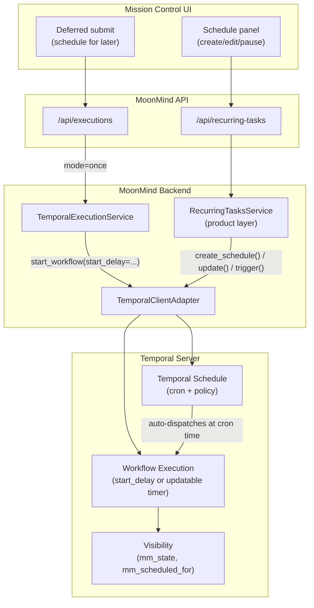

# Temporal Scheduling

**Implementation tracking:** [`docs/tmp/remaining-work/Temporal-TemporalScheduling.md`](../tmp/remaining-work/Temporal-TemporalScheduling.md)

**Status:** Active
**Owner:** MoonMind Platform
**Last Updated:** 2026-03-23
**Audience:** Backend developers, UI developers, operators

## 1. Purpose

This document defines the **desired state** for all time-based scheduling in MoonMind using Temporal-native primitives. It covers:

- **One-time deferred execution** — start a workflow at a specific future time
- **Recurring schedules** — start workflows on a cron-based cadence
- **Reschedulable execution** — change the target start time after creation

All three patterns use Temporal's own scheduling mechanisms. MoonMind does not maintain a custom scheduler daemon, cron-evaluation loop, or DB-backed dispatch queue for scheduling.

## 2. Related Docs

- [TemporalArchitecture.md](TemporalArchitecture.md) — platform foundation, migration phases, locked decisions
- [WorkflowTypeCatalogAndLifecycle.md](WorkflowTypeCatalogAndLifecycle.md) — workflow types, state model, update/signal contracts
- [ActivityCatalogAndWorkerTopology.md](ActivityCatalogAndWorkerTopology.md) — activity routing and worker fleet
- [VisibilityAndUiQueryModel.md](VisibilityAndUiQueryModel.md) — search attributes, list/filter model

---

## 3. Design Principles

1. **Temporal owns time.** All time-based dispatch — delays, cron evaluation, timezone handling, overlap policies, backfill — is delegated to the Temporal server.

2. **MoonMind owns product semantics.** Schedule names, scope/authorization, target types, and UI presentation remain MoonMind domain concepts backed by Postgres.

3. **Thin reconciliation, not dual state.** MoonMind's DB model for schedules mirrors Temporal Schedule state via a reconciliation pattern. Temporal is the source of truth for "when does the next run happen" and "is this schedule paused." MoonMind is the source of truth for "who owns this schedule" and "what target kind does it run."

4. **Use the simplest Temporal primitive that fits.** `start_delay` for one-time delays. Temporal Schedules for recurring cadences. In-workflow timers + signals for reschedulable waits. Don't over-engineer.

---

## 4. One-Time Deferred Execution

### 4.1 Mechanism: Temporal `start_delay`

For "run this workflow once at time T," MoonMind uses the `start_delay` parameter on `client.start_workflow()`.

```python
await client.start_workflow(
    "MoonMind.Run",
    args=[workflow_input],
    id=workflow_id,
    task_queue="mm.workflow",
    start_delay=scheduled_for - datetime.now(UTC),
)
```

**Temporal behavior:**
- The workflow execution is created immediately and is visible in Temporal Visibility.
- The first workflow task is not dispatched to the worker until `start_delay` elapses.
- The workflow can be cancelled before it starts.

**MoonMind behavior:**
- The execution record is created with `mm_state=scheduled` and `mm_scheduled_for` set.
- `mm_state` transitions to `initializing` when the delay elapses and the workflow task dispatches.
- Mission Control shows a "Scheduled for {time}" banner on the detail page.

### 4.2 Constraint: start_delay Is Immutable

Once `start_workflow()` is called with `start_delay`, **the delay cannot be changed**. There is no Temporal API to adjust a pending workflow's dispatch time.

If the product requires the user to **change** the scheduled time after creation, use the reschedulable execution pattern (Section 6) instead.

### 4.3 API Contract

```json
POST /api/executions
{
  "workflowType": "MoonMind.Run",
  "title": "Deploy staging at 2 AM",
  "initialParameters": { ... },
  "schedule": {
    "mode": "once",
    "scheduledFor": "2026-03-24T09:00:00Z"
  }
}
```

**Backend:**
1. Validate `scheduledFor` is a future UTC timestamp.
2. Compute `start_delay = scheduledFor - now`.
3. Call `TemporalClientAdapter.start_workflow(start_delay=start_delay)`.
4. Set `mm_scheduled_for` search attribute.
5. Return response with `state: "scheduled"`.

**Response:**

```json
{
  "workflowId": "mm:01HX...",
  "runId": "temporal-run-uuid",
  "workflowType": "MoonMind.Run",
  "state": "scheduled",
  "scheduledFor": "2026-03-24T09:00:00Z",
  "title": "Deploy staging at 2 AM"
}
```

---

## 5. Recurring Schedules

### 5.1 Mechanism: Temporal Schedules

For recurring work, MoonMind uses **Temporal Schedules** — server-owned schedule objects that start workflow executions on a defined cadence.

```python
await client.create_schedule(
    id=f"mm-schedule:{definition_id}",
    schedule=Schedule(
        action=ScheduleActionStartWorkflow(
            "MoonMind.Run",
            args=[workflow_input],
            id=f"mm:{{{{.ScheduleTime}}}}-{definition_id}",
            task_queue="mm.workflow",
            memo={"title": schedule_name},
            search_attributes=TypedSearchAttributes([
                SearchAttributePair(SearchAttributeKey.for_keyword("mm_owner_id"), owner_id),
                SearchAttributePair(SearchAttributeKey.for_keyword("mm_state"), "initializing"),
            ]),
        ),
        spec=ScheduleSpec(
            cron_expressions=[cron_expression],
            jitter=timedelta(seconds=jitter_seconds),
            time_zone_name=timezone,
        ),
        policy=SchedulePolicy(
            overlap=ScheduleOverlapPolicy.SKIP,
            catchup_window=timedelta(minutes=15),
        ),
        state=ScheduleState(
            paused=not enabled,
            note=f"MoonMind schedule: {schedule_name}",
        ),
    ),
)
```

### 5.2 What Temporal Schedules Provide Natively

| Capability | Temporal Schedule Feature |
|---|---|
| Cron evaluation with timezone | `ScheduleSpec.cron_expressions` + `time_zone_name` |
| Overlap policy | `ScheduleOverlapPolicy` enum: `SKIP`, `BUFFER_ONE`, `BUFFER_ALL`, `ALLOW_ALL`, `CANCEL_OTHER`, `TERMINATE_OTHER` |
| Catchup / backfill | `SchedulePolicy.catchup_window` — runs missed during downtime up to this window |
| Jitter | `ScheduleSpec.jitter` — random delay to spread load |
| Pause / resume | `ScheduleHandle.pause()` / `ScheduleHandle.unpause()` |
| Trigger immediately | `ScheduleHandle.trigger()` |
| Backfill historical range | `ScheduleHandle.backfill()` |
| Recent action list | `ScheduleHandle.describe()` → `info.recent_actions` |
| Upcoming runs | `ScheduleHandle.describe()` → `info.next_action_times` |
| Schedule visibility | Listed in Temporal UI and via `client.list_schedules()` |

### 5.3 MoonMind Domain Model: RecurringTaskDefinition

MoonMind keeps a `RecurringTaskDefinition` row in Postgres for each recurring schedule. This row owns:

- **Product semantics:** name, description, scope, owner, authorization
- **Target specification:** what to run (queue task, task template, manifest) and its payload
- **Schedule policy preferences:** the MoonMind-level policy expressed by the user
- **Temporal Schedule reference:** the Temporal Schedule ID this definition is reconciled with

The Temporal Schedule is the execution-side truth. The MoonMind definition is the product-side truth.

### 5.4 Reconciliation Model

```
User action          MoonMind DB                    Temporal Schedule
─────────────────────────────────────────────────────────────────────
Create schedule  →   INSERT definition row      →   client.create_schedule()
Update cron      →   UPDATE definition row      →   handle.update(spec=...)
Pause            →   UPDATE enabled=false       →   handle.pause()
Resume           →   UPDATE enabled=true        →   handle.unpause()
Trigger now      →   (no DB change needed)      →   handle.trigger()
Delete schedule  →   DELETE/soft-delete row     →   handle.delete()
```

**Invariant:** If the Temporal Schedule and MoonMind DB disagree (e.g., after a failed update), the reconciliation favors the MoonMind DB — the next successful reconciliation pass re-applies the desired state to Temporal.

### 5.5 Overlap Policy Mapping

| MoonMind Policy | Temporal Equivalent |
|---|---|
| `overlap.mode = "skip"` | `ScheduleOverlapPolicy.SKIP` |
| `overlap.mode = "allow"` | `ScheduleOverlapPolicy.ALLOW_ALL` |
| `overlap.mode = "buffer_one"` (new) | `ScheduleOverlapPolicy.BUFFER_ONE` |
| `overlap.mode = "cancel_previous"` (new) | `ScheduleOverlapPolicy.CANCEL_OTHER` |

> [!NOTE]
> MoonMind's prior `maxConcurrentRuns` numeric cap does not have a direct Temporal equivalent. The overlap policy enum replaces the numeric model. If a numeric concurrency limit is needed in the future, it should be implemented as a workflow-level semaphore, not a scheduler feature.

### 5.6 Catchup / Backfill Policy

Temporal Schedules use a **catchup window** (`timedelta`) rather than MoonMind's `catchup.mode` enum:

| MoonMind Mode | Temporal Equivalent |
|---|---|
| `catchup.mode = "none"` | `catchup_window=timedelta(0)` |
| `catchup.mode = "last"` | `catchup_window=timedelta(minutes=15)` (short window catches only the most recent) |
| `catchup.mode = "all"` | `catchup_window=timedelta(days=365)` (large window replays all missed) |

The `misfireGraceSeconds` concept is subsumed by `catchup_window`. The `jitterSeconds` maps directly to `ScheduleSpec.jitter`.

### 5.7 Target Resolution

Temporal Schedules start workflows. The workflow input payload carries the target specification. Target resolution (expanding templates, resolving manifests) happens **inside the workflow**, not at schedule evaluation time:

1. Schedule fires → starts `MoonMind.Run` or `MoonMind.ManifestIngest` with the target payload in the workflow input.
2. The workflow's initialization phase resolves the target:
   - `queue_task` → use payload directly
   - `queue_task_template` → expand the template via an Activity
   - `manifest_run` → resolve the manifest via an Activity

This avoids needing the Temporal Schedule to know about MoonMind's template or manifest systems.

### 5.8 Schedule ID Convention

```
mm-schedule:{definition_uuid}
```

Workflow IDs spawned by the schedule use a deterministic format that includes the schedule time:

```
mm:{definition_uuid}:{schedule_time_epoch}
```

This ensures idempotency — if the schedule fires twice for the same time slot, Temporal prevents a duplicate start.

### 5.9 API Contract

Recurring schedule management uses the existing `/api/recurring-tasks` endpoints. The API surface does not change — only the backend implementation shifts from DB-based dispatch to Temporal Schedule reconciliation.

| Method | Path | Temporal Operation |
|---|---|---|
| `POST` | `/api/recurring-tasks` | `client.create_schedule()` |
| `GET` | `/api/recurring-tasks/{id}` | DB lookup + `handle.describe()` for next runs |
| `PATCH` | `/api/recurring-tasks/{id}` | DB update + `handle.update()` |
| `POST` | `/api/recurring-tasks/{id}/run` | `handle.trigger()` |
| `GET` | `/api/recurring-tasks/{id}/runs` | `handle.describe()` → `info.recent_actions` + Temporal Visibility query |

---

## 6. Reschedulable Deferred Execution

### 6.1 Use Case

When a user creates a deferred task and then needs to change the scheduled time before execution starts.

### 6.2 Mechanism: Updatable Timer Pattern

Instead of `start_delay` (which is immutable), the workflow starts immediately and waits internally for the target time:

```python
@workflow.defn(name="MoonMind.Run")
class MoonMindRun:
    def __init__(self):
        self._target_run_time: datetime | None = None

    @workflow.signal(name="reschedule")
    async def handle_reschedule(self, new_time: datetime) -> None:
        self._target_run_time = new_time

    @workflow.run
    async def run(self, input: RunInput) -> RunResult:
        if input.scheduled_for is not None:
            self._target_run_time = input.scheduled_for
            workflow.upsert_search_attributes([
                SearchAttributePair(mm_state_key, "scheduled"),
                SearchAttributePair(mm_scheduled_for_key, input.scheduled_for),
            ])

            # Wait until target time or reschedule signal
            while self._target_run_time is not None:
                delay = (self._target_run_time - workflow.now()).total_seconds()
                if delay <= 0:
                    break
                await workflow.wait_condition(
                    lambda: self._target_run_time != input.scheduled_for,
                    timeout=timedelta(seconds=delay),
                )
                if self._target_run_time != input.scheduled_for:
                    input.scheduled_for = self._target_run_time
                    continue

            workflow.upsert_search_attributes([
                SearchAttributePair(mm_state_key, "initializing"),
            ])

        # ... proceed to normal execution ...
```

**Key properties:**
- The workflow is immediately visible in Temporal Visibility with `mm_state=scheduled`.
- A `reschedule` signal updates the target time; the workflow re-evaluates the wait.
- Cancellation works at any point.
- The pattern is deterministic and replay-safe (uses `workflow.now()`, not wall clock).

### 6.3 API Contract

```json
POST /api/executions/{workflowId}/reschedule
{
  "scheduledFor": "2026-03-24T12:00:00Z"
}
```

**Backend:** Sends a `reschedule` signal to the workflow with the new time.

---

## 7. Search Attributes for Scheduling

### 7.1 New Search Attribute

| Attribute | Type | Purpose |
|---|---|---|
| `mm_scheduled_for` | `Datetime` | The nominal time a deferred execution is scheduled to start |

This attribute is set when:
- A one-time deferred execution is created (`start_delay` or updatable timer)
- A schedule-spawned workflow starts (set to the schedule time)

### 7.2 Registration

The `mm_scheduled_for` search attribute is registered by the namespace init job (`bootstrap-namespace.sh`) alongside the existing attributes:

```bash
temporal operator search-attribute create \
  --namespace "$TEMPORAL_NAMESPACE" \
  --name mm_scheduled_for \
  --type Datetime
```

---

## 8. What MoonMind No Longer Implements

With Temporal Schedules as the execution backend, MoonMind removes the following from its scheduling codebase:

| Removed Responsibility | Replaced By |
|---|---|
| Cron expression evaluation loop | `ScheduleSpec.cron_expressions` |
| Next-run-at computation and DB updates | Temporal server-side schedule evaluation |
| `schedule_due_definitions()` scan | Temporal schedule auto-dispatch |
| `dispatch_pending_runs()` loop | Temporal schedule auto-dispatch |
| `run_scheduler_tick()` background daemon | Temporal schedule auto-dispatch |
| `RecurringTaskRun` dispatch tracking | `ScheduleHandle.describe()` + Temporal Visibility |
| Custom overlap detection queries | `ScheduleOverlapPolicy` |
| Custom catchup / backfill logic | `SchedulePolicy.catchup_window` |
| Custom misfire grace computation | `SchedulePolicy.catchup_window` |
| Custom jitter randomization | `ScheduleSpec.jitter` |

**What MoonMind keeps:**
- `RecurringTaskDefinition` model — product metadata, scope, authorization, target specification
- `/api/recurring-tasks` API routes — API surface unchanged
- Cron validation utilities — for user input validation before passing to Temporal
- Timezone validation utilities — for user input validation

---

## 9. Architecture Diagram



---

## 10. Scheduling implementation notes

Phased work (adapter wiring, recurring dispatch reconciliation, search attributes) is tracked in [`docs/tmp/TemporalSchedulingPlan.md`](../tmp/TemporalSchedulingPlan.md) and [`docs/tmp/remaining-work/Temporal-TemporalScheduling.md`](../tmp/remaining-work/Temporal-TemporalScheduling.md).

## 11. Canonical Scheduling Semantics

MoonMind implements three distinct scheduling mechanisms, each suited for a specific lifecycle phase. This reference matrix defines when to use which mechanism.

### 11.1 Mechanism Matrix

| Feature | `start_delay` | In-Workflow Timer | Temporal Schedule |
|---|---|---|---|
| **Mechanism** | `client.start_workflow(start_delay=...)` | `await workflow.wait_condition(...)` | `client.create_schedule(...)` |
| **Use Case** | One-time deferred start. | Reschedulable wait state. | Recurring background tasks. |
| **Mutability** | **Immutable.** Cannot be changed after start. | **Mutable.** Can be changed via Signal. | **Mutable.** Can be updated via API. |
| **Visibility State** | Workflow is `Running` (but task is delayed). | Workflow is `Running` (blocked in execution). | Workflow doesn't exist until scheduled time. |
| **Search Attribute**| Uses `mm_scheduled_for`. | Uses `mm_scheduled_for`. | Uses `mm_scheduled_for` when spawned. |
| **Timezone Support**| Evaluated as absolute UTC offset at creation. | Evaluated as absolute UTC wait internally. | Full IANA Timezone & DST support. |

### 11.2 Mechanism Details & Tradeoffs

1. **`start_delay` (Deferred execution):** The simplest and most efficient mechanism for running a task in the future. Temporal holds the execution server-side without consuming a worker thread. However, because it's evaluated at submission time into an absolute wait, it cannot be modified if requirements change.

2. **In-Workflow Timer (Reschedulable execution):** Best used when the start time is a tentative estimate that might shift. The workflow starts immediately but pauses execution at the first step. A Signal handler can interrupt the `wait_condition` to adjust the target time. This consumes slightly more Temporal history but offers full flexibility.

3. **Temporal Schedule (Recurring execution):** The only mechanism that natively supports Cron strings and Calendar expressions. Crucially, Temporal Schedules natively handle **Daylight Saving Time (DST)** boundaries by re-evaluating the Cron expression against the specified `time_zone_name` on each iteration, rather than using a fixed polling interval.

### 11.3 DST and Timezone Guarantees

MoonMind delegates all cron evaluation and timezone math to Temporal Schedules.
- By providing an IANA timezone string (e.g., `US/Eastern`, `Europe/London`), Temporal ensures that schedules strictly follow local wall-clock rules.
- During a Spring Forward (e.g., 2:00 AM becomes 3:00 AM), Temporal correctly skips the non-existent hour. If a schedule was set for 2:30 AM, it will next run on the following day (or transition to the offset equivalent, depending on exact Temporal core semantics, but strictly maintaining the intended cadence).
- During a Fall Back (e.g., 2:00 AM happens twice), Temporal's standard Cron implementation evaluates the schedule natively, which results in the job running twice (once during the first occurrence, and again during the second occurrence) for the repeated hour.
