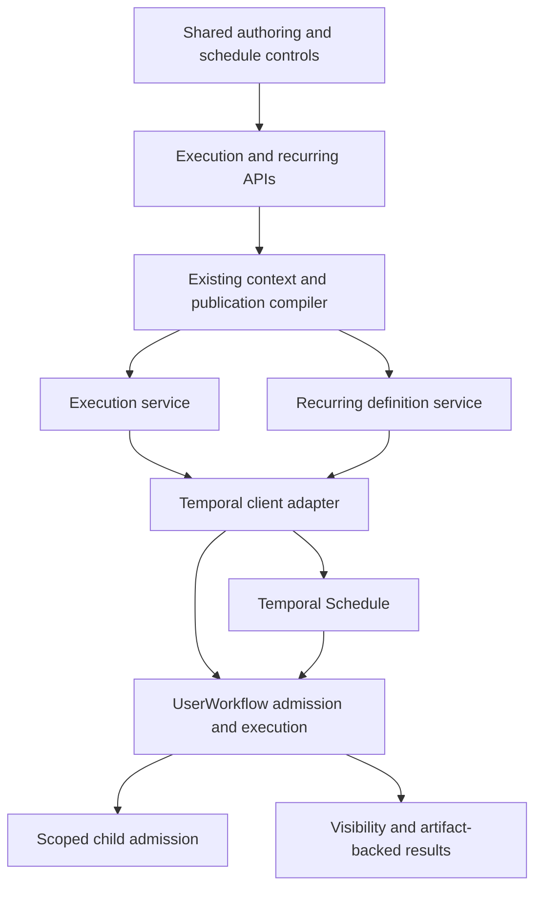

# Temporal Scheduling

**Document Class:** Canonical declarative  
**Viewpoint:** Module Architecture View  
**Status:** Draft  
**Owner:** MoonMind Platform  
**Updated:** 2026-09-06  
**Audience:** Backend developers, UI developers, operators  
**Authority:** Temporal-native timing mechanisms, recurring-definition reconciliation, occurrence input pinning, and scheduling lifecycle boundaries. Workflow Publishing owns publication resolution and scope inheritance.  
**Owning Surface:** RecurringWorkflowDefinition, RecurringWorkflowsService, and Temporal scheduling adapter  
**Related Implementation:** `api_service/services/recurring_workflows_service.py`, `api_service/api/routers/recurring_workflows.py`, and `TemporalClientAdapter`.

Implementation sequencing and rollout evidence belong in issues or `docs/tmp/`, not this canonical specification. New authoring semantics here describe the target, not support claimed for current deployed API/worker versions.

## 1. Purpose

All time-based scheduling uses Temporal-native primitives: one-time deferred execution, cron-based recurring schedules, and reschedulable waits. MoonMind does not maintain a scheduler daemon, cron evaluation loop, or DB-backed dispatch queue.

Every scheduled workflow uses the same single repository/source context, applicable branch, and publication intent as immediate Create. A schedule cannot introduce independent Skill/Preset publish overrides or reinterpret a coordinator's local None as the batch's authored policy.

## 2. Related Docs

- [Temporal Architecture](TemporalArchitecture.md)
- [Workflow Type Catalog and Lifecycle](WorkflowTypeCatalogAndLifecycle.md)
- [Activity Catalog and Worker Topology](ActivityCatalogAndWorkerTopology.md)
- [Visibility and UI Query Model](VisibilityAndUiQueryModel.md)
- [Workflow Publishing](../Workflows/WorkflowPublishing.md)
- [Workflow Presets System](../Workflows/WorkflowPresetsSystem.md)
- [Workflow Editing System](../Workflows/WorkflowEditingSystem.md)
- [Executions API Contract](../Api/ExecutionsApiContract.md)
- [Create Page](../UI/CreatePage.md)
- [Settings System](../Security/SettingsSystem.md)

## 3. Design Principles

Temporal owns delays, cron/timezone evaluation, overlap, catchup, and backfill. MoonMind owns schedule names, scope/authorization, target definitions, authored intent, and presentation. The Postgres definition is product-side desired state; Temporal is the execution-side authority for actual timing, pause state, and fired actions. Reconciliation exposes discrepancies rather than pretending an unapplied update succeeded.

Use start_delay for an immutable one-time delay, workflow timers/signals for a reschedulable wait, and Temporal Schedules for recurring work. The same existing compiler and admission owners validate targets and publication. No second preset expander, repository selector, or publishing policy engine is introduced by scheduling.

## 4. One-Time Deferred Execution

### 4.1 Mechanism: Temporal start_delay

For one execution at a future time, the adapter passes a validated delay to client.start_workflow. The execution is created/visible immediately while its first workflow task is deferred. Cancellation remains available under the lifecycle contract.

MoonMind records `mm_state=scheduled` and `mm_scheduled_for`, then transitions to initializing when dispatch begins. The UI displays the intended time and timezone clearly.

### 4.2 Constraint: start_delay is immutable

A started execution's start_delay is not an editable schedule field. A product requiring a movable start uses section 6's timer pattern. Changing the time does not itself authorize changing repository, publishing, or runtime intent.

### 4.3 API contract

The one-time create form expresses a schedule with mode once and scheduledFor through the existing execution admission path. Validate the future timestamp, compute the adapter delay, persist the scheduled metadata, and return the accepted scheduled execution identity.

The authored input snapshot, selected definition evidence, repository/branch roles, and resolved publication scope are captured under normal admission. Delay does not mean the execution can silently pick up a different Auto default or credential route when it starts. Required current permissions/readiness are checked at use, without substituting another identity after denial.

## 5. Recurring Schedules

### 5.1 Mechanism: Temporal Schedules

Temporal Schedule actions start the declared workflow type with the definition's approved authored input and artifact references. ScheduleSpec owns cron expressions, jitter, and time_zone_name; SchedulePolicy owns overlap and catchup; ScheduleState owns actual paused state. MoonMind's adapter translates validated product choices into those supported primitives.

### 5.2 What Temporal Schedules provide natively

Native operations cover cron/timezone evaluation, supported overlap modes, catchup windows, jitter, pause/unpause, trigger-now, bounded backfill, recent actions, upcoming action times, and schedule listing. The product uses the actual server result rather than reimplementing or guessing those operations.

### 5.3 MoonMind domain model: RecurringWorkflowDefinition

The existing definition owns name, description, principal/scope, authorization, target type and input refs, desired schedule settings, Temporal Schedule reference, and the selected definition/input evidence needed to reproduce authoring.

It stores one authored workspace/repository context, one branch role, and one publishing selection. Compiler-bound Skill arguments and coordinator-local modes are not independent authored fields. Preset Run/filter inputs remain normal task inputs.

### 5.4 Reconciliation model

Create/update/pause/resume/delete commit product desired state and reconcile the corresponding Temporal operation through the existing service/adapter. Trigger-now uses the approved current definition without silently rewriting it.

When DB desired state and Temporal differ after failure, the next successful reconciliation reapplies the validated desired revision. Reconciliation is not allowed to invent new defaults or permission grants. Concurrent edits use expected revisions and stable request identity; a stale reconciliation cannot overwrite a newer approved definition. Report pending/failed reconciliation and actual observed pause/timing separately from desired settings.

### 5.5 Overlap policy mapping

| Product policy | Temporal equivalent |
| --- | --- |
| skip | SKIP |
| allow | ALLOW_ALL |
| buffer_one | BUFFER_ONE |
| cancel_previous | CANCEL_OTHER |

Additional Temporal policies appear only when the product supports and documents them. A numeric model-capacity limit belongs to the existing execution admission owner, not a replacement schedule loop.

Overlap controls scheduled parent occurrences. A fan-out coordinator may finish while its children remain active. SKIP therefore does not, by itself, serialize their shared-branch writes or protect against a later occurrence's children. Branch publication is rejected for such independent batches unless the publication contract provides a qualified cross-occurrence serialization/handoff. PR children retain isolated heads; PR-resolution deduplication remains target-based.

### 5.6 Catchup / backfill policy

Catchup is expressed as a supported Temporal time window. Backfill is an explicit bounded operation through the existing schedule handle. Legacy none/last/all and misfire settings are normalized under their documented compatibility semantics, not presented as proof that a window always contains exactly one occurrence or all historical occurrences. Jitter maps to Temporal jitter.

Catchup, manual triggers, and backfills use the approved definition and fresh occurrence admission. Historical nominal timestamps do not authorize replaying old credentials, old merges, or previously completed child effects. Existing target-level idempotency still applies.

### 5.7 Target resolution

The schedule stores a Temporal workflow-start target with workflowType, initialParameters, and artifact refs where needed. UserWorkflow and ManifestIngest use their normal input contracts. Queue dispatch is not a separate scheduling authority; any supported legacy transport is normalized at the versioned ingress before use.

#### Authored policy and Auto

New authored publication values are default, none, branch, pr, and pr_with_merge_automation. Omission/default is the one user-facing Auto choice. Runtime modes remain none/branch/pr/auto. The compiler never forwards unresolved default to a worker or helper.

When saving a schedule, validate and record its selected preset/Skill definition evidence and the resolved recommendation for its authored task inputs. The default policy pins this meaning rather than adopting a changed catalog default on every firing. No silent change from verification to implementation, PR to merge, or no-publication to publishing is allowed.

An explicitly supported definition-update policy can govern future occurrences through the existing definition/version owner, but changes in target roles, publication/merge authority, or required handoffs require visible review and a new admitted definition revision. Merely selecting Auto is not consent to future authority expansion. Missing pinned evidence is a blocker, not permission to use the latest definition.

The retired workspace `workflow.default_publish_mode` and its environment aliases cannot supply a schedule's new omitted/defaulted selection. Existing configured fallbacks and definitions follow [Settings System section 10.6](../Security/SettingsSystem.md#106-publication-default-ownership-and-retired-setting): preserve proven old effective intent explicitly or require review before affected unattended launches. A generic settings reset, restored old override, or reconciliation pass is not evidence that the schedule's changed meaning was reviewed.

#### Per-occurrence admission

Each occurrence receives its own execution/scope identity and revalidates current authority/readiness. Dynamic Jira queries, issue ranges, Dependabot discovery, and PR head observations resolve at that occurrence through trusted operations. Pinning definition semantics does not freeze yesterday's target list or remote SHA.

The occurrence freezes its resolved scope before dispatch. Its children and nested coordinators inherit that intent, never the parent's local None, and do not re-evaluate later catalog defaults. The child API verifies authenticated lineage, target derivation, and policy. Runtime/Profile and repository credential material are governed by their own immutable binding and acquisition owners.

#### Definition edits and prior work

Editing the schedule changes future admitted occurrences only. It neither updates live parents/children nor changes old input/plan hashes. A running occurrence and its retries retain their original policy. Changing a child's authority requires an explicit supported new-admission/replacement action, not schedule reconciliation.

Historical parent None plus child PR values reconstruct to one PR/default scope only where provenance proves that meaning. Old literal Auto remains Skill-owned. Equal duplicate context values may collapse under the historical reader; conflicts and unknown origins require review. New definitions cannot persist duplicate repository/branch/publish overrides.

#### Dependabot and resolver deduplication

The existing Dependabot repository/PR/head key stays stable across occurrences. Reusing that key checks the admitted child's actual target/policy. A newly edited schedule does not spawn a concurrent conflicting resolver or report the old child as accepted under the new policy. Return an honest existing/skipped/conflict disposition and use normal execution controls for an explicitly authorized replacement.

Dry run discovers/reports candidates without creating children. None is a publication policy, not dry run, and cannot make a push-requiring resolver compatible. Manual trigger and backfill preserve the same distinction.

### 5.8 Schedule ID convention

The schedule ID is `mm-schedule:{definition_uuid}`. Its action uses the deterministic base workflow ID `mm:{definition_uuid}`; the Temporal action supplies its scheduled-time suffix for fired occurrences. Do not insert unexpanded schedule-time template tokens and assume the server interprets them.

Occurrence start identity prevents duplicate starts for the same scheduled action. It does not replace child target/policy idempotency or exact push/PR reconciliation.

### 5.9 API contract

The existing `/api/recurring-workflows` family remains the schedule-management entry point:

| Method/path | Purpose |
| --- | --- |
| POST collection | Create validated definition and reconcile schedule |
| GET definition | Product metadata plus observed schedule state/upcoming times |
| PATCH definition | Revision-checked desired-state update and reconciliation |
| POST definition/run | Trigger approved definition now |
| GET definition/runs | Recent actions and execution results from the existing read boundary |

Pause/resume/delete use the existing authorized product actions and schedule adapter. Returned descriptions retain the single authored selection and effective explanation, not an editable local compiled mode.

## 6. Reschedulable Deferred Execution

### 6.1 Use case

An execution's intended start time must remain movable before active work begins.

### 6.2 Mechanism: updatable timer pattern

Start the workflow, store target time in workflow state, and await a deterministic workflow timer/condition. An authorized reschedule signal changes that time and recomputes the wait using workflow.now. Cancellation remains interruptible. Record scheduled state and timing in Visibility, then transition to initializing when the gate clears.

The timer changes when admitted work begins, not what repository, profile, or publication authority it carries. An authority-bearing edit uses the normal authoring/admission lifecycle rather than a timing signal.

### 6.3 API contract

The supported reschedule endpoint sends the validated scheduledFor value to the owning workflow signal. The backend rejects wrong-owner, stale, unsupported, or already-started requests according to the lifecycle contract. A successful timing update is not an accepted publication-policy edit.

## 7. Search Attributes for Scheduling

`mm_scheduled_for` is a registered Datetime attribute for one-time delayed/timer work and schedule-spawned executions. Register it through the normal namespace-init job and typed search-attribute API. The attribute expresses nominal scheduled time, not proof of actual start or policy admission.

Scope/policy/definition evidence stays in existing input/plan artifacts and bounded projections. Do not index complete child lists or secret-bearing configuration.

## 8. What MoonMind no longer implements

Temporal owns cron evaluation, next-run computation, due-definition scans, dispatch loops, overlap detection, catchup/backfill, misfire timing, and jitter. MoonMind retains the product definition, ownership, API routes, input validation, target compilation, and thin reconciliation.

Publication-scope validation is product admission, not a scheduler feature. No new daemon, global publication registry, or duplicated preset service is introduced.

## 9. Architecture Diagram

```mermaid
flowchart TD
  UI[Shared authoring and schedule controls] --> API[Execution and recurring APIs]
  API --> COMPILER[Existing context and publication compiler]
  COMPILER --> EXEC[Execution service]
  COMPILER --> RECUR[Recurring definition service]
  EXEC --> ADAPTER[Temporal client adapter]
  RECUR --> ADAPTER
  ADAPTER --> SCHEDULE[Temporal Schedule]
  ADAPTER --> RUN[UserWorkflow admission and execution]
  SCHEDULE --> RUN
  RUN --> CHILD[Scoped child admission]
  RUN --> VIS[Visibility and artifact-backed results]
```

## 10. Scheduling implementation notes

Implementation sequencing, cutover and migration work, exact adapter support, and qualification evidence belong in existing issues or `docs/tmp/`. A saved definition or rendered form is not proof that the runtime honors its publication policy.

## 11. Canonical Scheduling Semantics

### 11.1 Mechanism matrix

| Mechanism | Use | Mutability | Execution visibility |
| --- | --- | --- | --- |
| start_delay | One immutable deferred start | Delay fixed after start request | Execution exists while first task is deferred |
| Workflow timer | Reschedulable wait | Time changes by authorized signal | Execution exists in scheduled wait |
| Temporal Schedule | Recurring cadence | Definition revision/update | Individual execution created by each action |

### 11.2 Mechanism details and tradeoffs

The simplest supported timing primitive is preferred. All three retain one authored context/policy and use current permission checks without silently changing identity. Repeated or deferred starts cannot treat a current catalog default as historical intent.

### 11.3 DST and timezone guarantees

One-time inputs resolve to explicit instants. Recurring inputs carry an approved IANA timezone. Temporal owns local-wall-clock and daylight-saving evaluation; the product displays actual upcoming action times and tested supported behavior rather than recreating timezone arithmetic or promising an unverified repeated/missing-hour rule.

### 11.4 Conformance

Required production-boundary coverage includes ordinary scheduling, pause/resume, reconciliation failure, revision races, manual trigger/backfill, and deterministic replay. Publication cases include:

- Auto preserves the reviewed definition meaning across occurrences while dynamic targets refresh safely.
- Explicit None remains None; resolver/dry-run incompatibilities fail before effects.
- Coordinator-local None does not replace PR/Auto child intent through nested scheduling/fan-out.
- Non-default implementation bases and distinct PR heads survive target resolution.
- Schedule edits affect only future admitted scopes, not active children or historical hashes.
- Parent overlap settings do not masquerade as cross-child shared-branch protection.
- Dependabot cross-run deduplication and conflicting policy reuse cannot produce duplicate resolver effects.
- Legacy copies and old literal Auto reconstruct honestly or require review.
- Configured retired workspace fallbacks, backup/restore, and unattended definitions preserve proven intent or block for review instead of silently adopting new effects.
- Current authorization revocation blocks use without credential/default substitution.

Hermetic boundary results and protected-live scheduling/provider qualification are reported separately.
