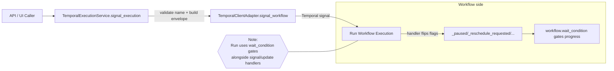
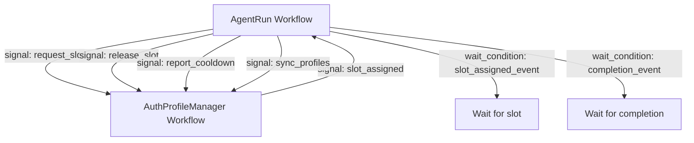
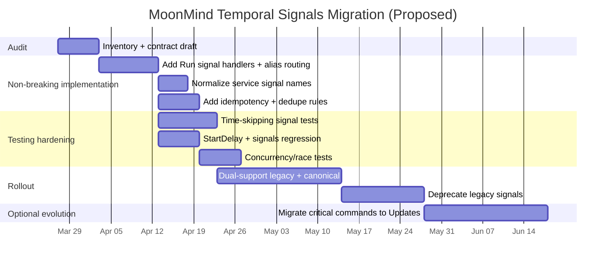

# MoonMind Temporal Signals Deep Research Report

## Executive summary

MoonMind’s Temporal implementation is **Python-first**, with `temporalio` pinned to `^1.23.0` and Python `>=3.10,<3.14`. citeturn60view1 The repository contains multiple Temporal workflows, a client adapter abstraction, and a higher-level execution service that mediates workflow lifecycle operations (start/describe/update/signal). citeturn39view3turn41view0

On **Temporal Signals specifically**, MoonMind shows a **mixed level of maturity**:

A substantial, working signal pattern exists around **auth-profile slot allocation**, where `AgentRun` signals an `AuthProfileManager` workflow (`request_slot`, `release_slot`, `report_cooldown`, `sync_profiles`), and the manager signals back (`slot_assigned`). citeturn50view0turn33view0turn49view0 The **OAuth session** workflow also uses simple `finalize`/`cancel` signals in an idiomatic “set flag + `wait_condition`” pattern. citeturn35view0turn35view2

However, the central **Run** workflow (which appears to be the main “execution orchestration” workflow) uses a mix of update and signal handlers for execution control. It defines **update handlers** for `Pause`, `Resume`, `Approve`, and `Cancel`, and **signal handlers** for asynchronous ingress via `ExternalEvent` and `reschedule`. Meanwhile, some higher layers still attempt to send signals like `"Pause"`, `"Resume"`, `"Approve"`, and `"ExternalEvent"` via `signal_execution`, and the client adapter uses batch `"pause"`/`"resume"`. This highlights a naming and pattern mismatch: the workflow defines acknowledged updates, but external clients sometimes try to trigger them as signals.

There is also a high-impact interaction with `start_delay`: MoonMind’s client adapter can start workflows with `start_delay`, citeturn39view3 but Temporal’s **Start Delay** semantics explicitly state that **non–Signal-With-Start signals are ignored during the delay**, while Signal-With-Start bypasses the remaining delay. citeturn55search2 MoonMind does not appear to use Signal-With-Start in the adapter (no `signal_with_start`), citeturn39view2turn39view3 so “early control signals” (pause/reschedule/etc.) for delayed starts are at risk of being dropped even if handlers existed.

## Repository and SDK context

MoonMind’s Temporal code is concentrated under `moonmind/workflows/temporal/` (client adapter, service layer, worker wiring) and `moonmind/workflows/temporal/workflows/` (workflow implementations). citeturn29view0turn3view0 The orchestration surface includes:

- **Workflow implementations**: `agent_run.py`, `auth_profile_manager.py`, `oauth_session.py`, `run.py`, plus smaller workflow(s). citeturn3view0turn30view0turn30view1turn31view0turn31view1  
- **Client adapter**: `moonmind/workflows/temporal/client.py` provides `start_workflow`, `signal_workflow`, `send_reschedule_signal`, `execute_update`, and batch pause/resume. citeturn39view3turn39view0turn39view1  
- **Execution service**: `moonmind/workflows/temporal/service.py` implements `signal_execution(...)` and validates signal names against an allowed set, then forwards signals through the adapter. citeturn41view0turn42view0  

From the SDK side, Temporal’s Python SDK documentation emphasizes that signals and updates are implemented via decorated handlers, invoked as concurrent asyncio tasks; use locks as needed; and ensure in-progress handler tasks don’t get abandoned when the workflow completes. citeturn54search2 It also recommends using a **single dataclass or Pydantic model argument** for signals/updates/queries to support safe evolution via defaults. citeturn53search2

Scope caveat: this review is based on inspecting the **`main` branch** via GitHub web UI for the Temporal-related paths above. Branch-wide and full-history coverage were not possible in this run; treat cross-branch completeness, PR discussions, and older signal variants as **unspecified** unless verified by a local clone scan.

## Inventory of Temporal signal usage

### Signal handlers defined in workflows

The table below inventories **explicit signal handlers** (decorated methods). If no schema is declared, it is treated as “unspecified/`dict`”.

| File path | Workflow/class | Signal name | Payload schema (current) | Handler present? | Uses Update? | External workflow handle usage? |
|---|---|---|---|---|---|---|
| `moonmind/workflows/temporal/workflows/agent_run.py` | AgentRun workflow | `completion_signal` | `dict` representing `AgentRunResult(**result_dict)` | Yes citeturn32view0 | No citeturn32view1 | Yes (signals other workflows) citeturn50view0turn32view2 |
| `moonmind/workflows/temporal/workflows/agent_run.py` | AgentRun workflow | `slot_assigned` | `dict` with `profile_id` | Yes citeturn32view0 | No citeturn32view1 | Yes citeturn50view0turn32view2 |
| `moonmind/workflows/temporal/workflows/auth_profile_manager.py` | AuthProfileManager workflow | `request_slot` | `dict[str, Any]` (documented TypedDicts exist) | Yes citeturn33view0turn49view1 | No citeturn33view1 | Yes (signals requesters) citeturn49view0 |
| `moonmind/workflows/temporal/workflows/auth_profile_manager.py` | AuthProfileManager workflow | `release_slot` | `dict[str, Any]` (async handler) | Yes citeturn33view0turn49view1 | No citeturn33view1 | Yes citeturn49view0 |
| `moonmind/workflows/temporal/workflows/auth_profile_manager.py` | AuthProfileManager workflow | `report_cooldown` | `dict[str, Any]` (`cooldown_seconds` defaulted) | Yes citeturn33view0turn49view1 | No citeturn33view1 | Yes citeturn49view0 |
| `moonmind/workflows/temporal/workflows/auth_profile_manager.py` | AuthProfileManager workflow | `sync_profiles` | `dict[str, Any]` with `profiles: list[dict]` | Yes citeturn33view0 | No citeturn33view1 | Yes citeturn49view0 |
| `moonmind/workflows/temporal/workflows/auth_profile_manager.py` | AuthProfileManager workflow | `shutdown` | no payload | Yes citeturn33view0 | No citeturn33view1 | Indirectly (loop termination) citeturn33view3 |
| `moonmind/workflows/temporal/workflows/oauth_session.py` | OAuthSession workflow | `finalize` | no payload | Yes citeturn35view0 | No citeturn35view1 | No |
| `moonmind/workflows/temporal/workflows/oauth_session.py` | OAuthSession workflow | `cancel` | no payload | Yes citeturn35view0 | No citeturn35view1 | No |
| `moonmind/workflows/temporal/workflows/run.py` | Run workflow | `Pause`, `Resume`, `Approve`, `Cancel` | — | **No** | **Yes** (`@workflow.update`) | No |
| `moonmind/workflows/temporal/workflows/run.py` | Run workflow | `ExternalEvent`, `reschedule` | `dict[str, Any]` | **Yes** (`@workflow.signal`) | No | No |

### Signals sent from workflows and services

This table inventories where code **sends** signals (internal workflow-to-workflow, and external service-to-workflow).

| File path | Sender component | Target (intended) | Signal name | Payload shape | External handle used? |
|---|---|---|---|---|---|
| `moonmind/workflows/temporal/workflows/agent_run.py` | AgentRun workflow | AuthProfileManager | `request_slot` | `{"requester_workflow_id", "runtime_id", "profile_selector"?}` citeturn50view0 | Yes (`workflow.get_external_workflow_handle`) citeturn50view0 |
| `moonmind/workflows/temporal/workflows/agent_run.py` | AgentRun workflow | AuthProfileManager | `release_slot` | `{"requester_workflow_id", "profile_id"}` citeturn50view2 | Yes citeturn50view2 |
| `moonmind/workflows/temporal/workflows/agent_run.py` | AgentRun workflow | AuthProfileManager | `report_cooldown` | `{"profile_id", "cooldown_seconds"}` citeturn50view3 | Yes citeturn50view3 |
| `moonmind/workflows/temporal/workflows/agent_run.py` | AgentRun workflow | AuthProfileManager | `sync_profiles` | `{"profiles": [...]}` citeturn32view0 | Yes citeturn32view0 |
| `moonmind/workflows/temporal/workflows/auth_profile_manager.py` | AuthProfileManager workflow | AgentRun workflow | `slot_assigned` | `{"profile_id": ...}` citeturn49view0 | Yes citeturn49view0 |
| `moonmind/workflows/temporal/workflows/agent_run.py` | AgentRun workflow | Parent workflow (caller of AgentRun) | `child_state_changed` | `args=[state, message]` citeturn32view2turn50view0 | Yes citeturn32view2 |
| `moonmind/workflows/temporal/workflows/agent_run.py` | AgentRun workflow | Parent workflow | `profile_assigned` | `{"profile_id", "child_workflow_id", "runtime_id"}` citeturn32view2 | Yes citeturn32view2 |
| `moonmind/workflows/temporal/service.py` | `TemporalExecutionService.signal_execution` | Execution workflow (likely Run) | `"ExternalEvent"` | wrapper `{"payload": <dict>, "payload_artifact_ref": <str?>}` citeturn41view0turn42view3 | External via client adapter citeturn41view0 |
| `moonmind/workflows/temporal/service.py` | same | Execution workflow | `"Approve"` | wrapper arg; expects `payload.approval_type` at service validation layer citeturn42view1 | Yes citeturn41view0 |
| `moonmind/workflows/temporal/service.py` | same | Execution workflow | `"Pause"` / `"Resume"` | wrapper arg | Yes citeturn42view1turn41view0 |
| `moonmind/workflows/temporal/client.py` | Client adapter | Any workflow by ID | arbitrary | `handle.signal(signal_name[, arg])` citeturn39view0 | External (client handle) citeturn39view0 |
| `moonmind/workflows/temporal/client.py` | Client adapter | “Delayed workflow” | `"reschedule"` | ISO datetime string citeturn39view0 | Yes citeturn39view0 |
| `moonmind/workflows/temporal/client.py` | Client adapter | All running workflows | `"pause"` / `"resume"` | no payload (batch) citeturn39view3 | Yes citeturn39view3 |

### `wait_condition` usage points tied to signals

MoonMind frequently uses the canonical **“signal flips state; workflow waits on condition”** model, which is explicitly shown in Temporal Python SDK examples. citeturn54search2 Observed call sites include:

- `AgentRun`: waits for `slot_assigned_event` and `completion_event`. citeturn32view2turn32view0  
- `AuthProfileManager`: waits for `_has_new_events` or shutdown with a periodic wake-up. citeturn33view3  
- `OAuthSession`: waits for `_finalize_requested` or `_cancel_requested` with a TTL timeout. citeturn35view2  
- `Run`: waits on `_reschedule_requested/_cancel_requested`, and later on `not self._paused`, relying on explicit `@workflow.update` and `@workflow.signal` handlers to flip those flags.

## Assessment against idiomatic Temporal signal patterns

### What MoonMind is already doing well

MoonMind’s `AuthProfileManager` and `OAuthSession` show recognizable idioms:

The **flag + `wait_condition`** approach is a standard and recommended pattern for signals in Temporal’s Python SDK examples. citeturn35view2turn33view3turn54search2 The handlers are mostly lightweight and deterministic (set state, append requests, set booleans), which is generally good practice for signal handlers.

The code also uses **external workflow handles** (`workflow.get_external_workflow_handle(...)`) to coordinate between workflows. citeturn50view0turn49view0 This matches the SDK’s external handle support (the Python SDK exposes `get_external_workflow_handle` and `get_external_workflow_handle_for`). citeturn54search0

Finally, the workflows actively use **versioning markers** (`workflow.patched(...)`) in long-running coordination paths (e.g., AgentRun slot wait behavior; AuthProfileManager lease persistence / verification), which is the right mechanism for evolving workflow behavior without breaking determinism. citeturn32view2turn33view3

### Key gaps and anti-patterns

The remaining issues are mostly about **contract consistency** and **end-to-end completeness**, not about the existence of signals per se.

Run workflow is missing signal and update handlers despite being controlled by signals elsewhere  
The most serious gap: `TemporalExecutionService.signal_execution` sends `"Pause"`, `"Resume"`, `"Approve"`, and `"ExternalEvent"` signals to a workflow by ID, wrapped in a `{payload, payload_artifact_ref}` envelope. citeturn41view0turn42view3turn42view1 The `TemporalClientAdapter` also sends `"reschedule"` and batch `"pause"/"resume"` signals. citeturn39view0turn39view3 Yet `run.py` defines **no** signal handlers and no update handlers. citeturn61view3turn61view1 This creates a strong likelihood that these signals are either (a) rejected as “unknown signal” by the workflow, or (b) accepted by Temporal but never acted upon because no handler exists—either way the control-plane intention is not realized.

Signal naming is inconsistent across layers (case and semantic mismatch)  
MoonMind’s service-level signals use **TitleCase** names (`"Pause"`, `"Resume"`, `"Approve"`, `"ExternalEvent"`). citeturn42view1turn42view3 The client adapter’s batch signaling uses lowercase `"pause"`/`"resume"`, and rescheduling uses `"reschedule"`. citeturn39view0turn39view3 In Temporal, signal names are author-defined strings (there is no automatic normalization), so case mismatches are effectively different signals. citeturn55search5

Start Delay and signals can silently conflict without Signal-With-Start  
The client adapter can start workflows with `start_delay`. citeturn39view3 Temporal’s Start Delay feature explicitly documents that **during the delay, non–Signal-With-Start signals are ignored**. citeturn55search2 MoonMind does not appear to use Signal-With-Start in the adapter. citeturn39view2turn39view3 As a result, even if Run eventually had pause/reschedule handlers, a pause/reschedule sent “immediately after start” could be dropped if the workflow start is delayed.

Signal payloads are mostly dynamically typed dicts; schema evolution risk is high  
Temporal’s Python SDK docs strongly encourage a **single dataclass/Pydantic argument** for signals and updates, specifically to enable non-breaking addition of defaulted fields over time. citeturn53search2 MoonMind does document some payload shapes as `TypedDict` (e.g., in `auth_profile_manager.py`), but the live handler signatures still accept `dict[str, Any]`, and other flows use raw `dict`. citeturn49view1turn33view0turn32view0 This makes it harder to validate incoming messages, apply authorization consistently, and manage compatibility across clients over time.

Signal concurrency and shared-state mutation is not explicitly guarded  
Temporal’s Python SDK states that each signal/update handler executes in its own asyncio task, concurrently with other handlers and the main workflow task; it explicitly calls out using `asyncio.Lock`/`Semaphore` when needed. citeturn54search2 In MoonMind, `AuthProfileManager.release_slot` is `async` (yields), but other handlers like `request_slot` mutate shared structures (`_pending_requests`, `_profiles`) without an explicit lock. citeturn33view0 This may be fine if handlers are effectively single-threaded by design, but the SDK’s concurrency model means you should treat handler code as potentially concurrent and protect shared invariants if signals can arrive quickly.

Idempotency/deduplication rules are not explicit  
Temporal’s API includes a `request_id` field “used to de-dupe sent signals.” citeturn55search5 MoonMind’s signal payloads (and service wrappers) don’t clearly carry a signal command ID/idempotency key, and the manager does not obviously dedupe repeated `request_slot` calls (it appends to `_pending_requests`). citeturn33view0turn33view3 This can lead to duplicated work under client retries, replay of external systems, or repeated UI actions.

## Desired-state signal contract for MoonMind

This section proposes a “declarative desired-state contract,” designed to be implementable with minimal churn, compatible with Temporal idioms, and evolvable over time. It is written assuming Pydantic v2 (already in the repo) and Temporal Python’s recommendation of single-model signal parameters. citeturn60view1turn53search2

### Canonical naming strategy

Adopt a consistent signal naming convention for MoonMind workflows:

- Prefer **lower_snake_case** for signal names (e.g., `pause`, `resume`, `external_event`, `approve`, `reschedule`).
- Treat existing TitleCase names as **legacy aliases** for a deprecation window (`Pause` → `pause`).

Rationale: MoonMind already uses lowercase for batch signals (`pause`/`resume`) and for other workflow signals (`request_slot`, `slot_assigned`). citeturn39view3turn33view0turn49view0

### Envelope model and governance fields

Define a shared envelope model for externally-originating signals (especially those coming from APIs/UIs). This makes authorization, observability, and idempotency uniform.

```python
# moonmind/workflows/temporal/signals/contracts.py  (new)

from pydantic import BaseModel, Field
from datetime import datetime
from typing import Literal, Any, Optional

class ActorRef(BaseModel):
    actor_type: Literal["user", "system", "service"]
    actor_id: str

class SignalEnvelope(BaseModel):
    schema_version: int = 1
    command_id: str = Field(..., description="Idempotency key / dedupe key")
    sent_at: datetime
    actor: Optional[ActorRef] = None

    # Optional artifact pointer for large payloads
    payload_artifact_ref: Optional[str] = None
```

This aligns with Temporal’s explicit support for signal dedupe at the API level (`request_id`) while also supporting application-level idempotency. citeturn55search5

### Workflow-specific payload schemas

Below are recommended canonical contracts. Where MoonMind already has a shape, it is preserved and formalized.

**AuthProfileManager**

```python
class SlotRequest(SignalEnvelope):
    requester_workflow_id: str
    runtime_id: str
    profile_selector: dict | None = None

class SlotRelease(SignalEnvelope):
    requester_workflow_id: str
    profile_id: str

class CooldownReport(SignalEnvelope):
    profile_id: str
    cooldown_seconds: int = 300

class ProfileSync(SignalEnvelope):
    profiles: list[dict]
```

These are derived from existing in-code intent and TypedDict documentation. citeturn49view1turn33view0turn50view0turn50view2turn50view3turn32view0

Idempotency rules:

- `SlotRequest`: idempotent by `(requester_workflow_id, command_id)`; ignore duplicates.
- `SlotRelease`: idempotent by `(requester_workflow_id, profile_id, command_id)`; repeat releases should be no-ops.
- `ProfileSync`: idempotent by `command_id` or by content hash of the profile list.

Authorization:

- Only internal workers / orchestrator should signal this workflow (not user-facing).

Error handling:

- Prefer no-throw semantics for “already released / already granted” to keep manager robust under duplication.

**AgentRun**

```python
class SlotAssigned(SignalEnvelope):
    profile_id: str

class AgentCompleted(SignalEnvelope):
    result: dict  # Replace with a concrete AgentRunResult model if one exists centrally
```

These formalize existing handler behaviors. citeturn32view0turn49view0

**OAuthSession**

```python
class OAuthFinalize(SignalEnvelope):
    pass

class OAuthCancel(SignalEnvelope):
    reason: str | None = None
```

This extends current no-payload signals with optional reason, while keeping compatibility (fields have defaults). citeturn35view0turn53search2

**Run workflow (execution workflow)**

This is the biggest missing piece; define the intended control-plane signals:

```python
class PauseExecution(SignalEnvelope):
    reason: str | None = None

class ResumeExecution(SignalEnvelope):
    pass

class RescheduleExecution(SignalEnvelope):
    scheduled_for: datetime

class ApproveExecution(SignalEnvelope):
    approval_type: str

class ExternalEvent(SignalEnvelope):
    source: str
    event_type: str
    payload: dict[str, Any] = {}
```

These correspond directly to the service layer’s branches (Approve requires `approval_type`; ExternalEvent requires `source` and `event_type`) and to the adapter’s reschedule helper. citeturn42view1turn42view3turn39view0

### Current-to-desired mapping table

| Current signal (as sent today) | Observed sender | Desired canonical signal | Notes |
|---|---|---|---|
| `"Pause"` | `TemporalExecutionService.signal_execution` citeturn42view1turn41view0 | `pause` | Provide alias support during migration |
| `"Resume"` | service citeturn42view1turn41view0 | `resume` | Same |
| `"Approve"` | service citeturn42view1 | `approve` | Consider Update instead of Signal if caller needs acknowledgement |
| `"ExternalEvent"` | service citeturn42view3 | `external_event` | Keep envelope; consider artifact ref for large payload |
| `"pause"` / `"resume"` | client batch pause/resume citeturn39view3 | `pause` / `resume` | Already matches recommended casing |
| `"reschedule"` | client adapter citeturn39view0 | `reschedule` | Must be implemented in Run workflow; watch start_delay behavior |
| `request_slot`, `release_slot`, `report_cooldown`, `sync_profiles` | AgentRun → manager citeturn50view0turn50view2turn50view3turn32view0 | same names | Add envelope + idempotency rules |
| `slot_assigned` | manager → AgentRun citeturn49view0 | same name | Add envelope; keep as no-op on duplicates |
| `finalize`, `cancel` | external → OAuthSession citeturn35view0 | same names | Add envelope (+ optional reason) |

## Prioritized migration steps, tests, and rollout plan

### Non-breaking improvements

Implement Run workflow signal handlers (and aliases)  
This is the single highest-leverage change because it aligns the service/client signaling surface with actual workflow behavior.

Minimal-diff approach in `moonmind/workflows/temporal/workflows/run.py`:

1) Add signal handlers that flip `_paused`, `_reschedule_requested`, `_cancel_requested`, `_approve_requested`, etc. (these flags already exist). citeturn51view3turn36view1  
2) Accept both legacy and canonical signal names for a deprecation window (e.g., `Pause` and `pause`). The Python SDK supports dynamic signal handler registration (`set_dynamic_signal_handler`) for routing (present in Python SDK API surface). citeturn54search0  

Pseudocode sketch (illustrative):

```python
# moonmind/workflows/temporal/workflows/run.py

from temporalio import workflow

@workflow.defn
class RunWorkflow:
    def __init__(self) -> None:
        ...
        # Route legacy and canonical signals centrally
        workflow.set_dynamic_signal_handler(self._on_signal)

    async def _on_signal(self, name: str, args: list[object]) -> None:
        payload = args[0] if args else None

        if name in ("Pause", "pause"):
            self._paused = True
            self._waiting_reason = "operator_paused"
            self._attention_required = True
            return

        if name in ("Resume", "resume"):
            self._paused = False
            self._resume_requested = True
            self._waiting_reason = None
            self._attention_required = False
            return

        if name in ("reschedule",):
            # parse scheduled_for from payload
            self._scheduled_for = str(payload)
            self._reschedule_requested = True
            return

        if name in ("Approve", "approve"):
            self._approve_requested = True
            return

        if name in ("ExternalEvent", "external_event"):
            # store external event payload for execution-stage consumption
            ...
            return
```

This directly unlocks the waits already coded in Run. citeturn36view1turn51view3turn61view3

Normalize naming in `TemporalExecutionService.signal_execution`  
Before sending signals, convert legacy TitleCase input to canonical lowercase (or whichever convention you choose) so that workflows and batch tools converge.

Today, the service validates signal names and branches on `"ExternalEvent"`, `"Approve"`, `"Pause"`, `"Resume"`. citeturn42view1turn42view3turn42view0 A non-breaking approach is to accept both sets (legacy + canonical) for a window, but always *emit* canonical names to Temporal.

Add explicit idempotency keys to signal payloads and enforce dedupe in handlers  
Temporal can dedupe signals when a stable `request_id` is supplied. citeturn55search5 Even if MoonMind doesn’t expose `request_id` directly at the adapter level, the application should carry a `command_id` and treat duplicates as no-ops. This is especially important for `request_slot` where duplicates can create multiple pending requests. citeturn33view0turn50view0

Harden concurrency in workflows that mutate shared state from signals  
Because signal handlers run as concurrent asyncio tasks, Temporal explicitly recommends locks/semaphores where needed. citeturn54search2 Add a workflow-level `asyncio.Lock` (deterministic) to `AuthProfileManager` around mutations of `_pending_requests` and `_profiles` to prevent interleavings between `release_slot` (async) and other signals.

### Potentially breaking changes

Move “command-like” interactions to Workflow Updates where acknowledgement matters  
If API callers need confirmation that pause/resume/approve has been applied, consider converting some signals to **updates**. The client adapter already supports `execute_update`, and the service layer already has `update_execution(...)` scaffolding. citeturn39view1turn43view3 However, Run currently has no update handlers either. citeturn61view1 This is a larger migration but yields more robust semantics.

Replace raw dict payloads with Pydantic models and configure the data converter  
Temporal Python guidance recommends single dataclass/Pydantic parameters for forward-compatible evolution. citeturn53search2 Migrating signal parameter types from `dict` to Pydantic models can break old clients if not done carefully. Plan a dual-accept period (dict + model) using versioning (`workflow.patched`) as you already do elsewhere. citeturn32view2turn33view3

### Tests and integration checklist for signals

MoonMind has a docker-compose test harness that runs `pytest` for unit and “integration/orchestrator” suites. citeturn58view0 For Temporal signals, add a dedicated checklist:

1) Unit tests with time-skipping environment  
Temporal’s Python SDK provides examples of testing signals and timeouts with `WorkflowEnvironment.start_time_skipping()` and `handle.signal(...)`. citeturn54search2 Mirror that approach to test `Run.pause/resume/reschedule`, `OAuthSession.finalize/cancel`, and `AuthProfileManager` slot allocation.

2) Race tests  
Send bursts of signals (`pause` then `resume`, concurrent `request_slot`, repeated `release_slot`) using `asyncio.gather` to validate idempotency and lock correctness. This directly targets the SDK’s concurrent handler execution model. citeturn54search2

3) Start Delay + signals regression tests  
Since signals can be ignored during `start_delay` unless Signal-With-Start is used, add a test that starts with `start_delay` and attempts to pause/reschedule during the delay to ensure MoonMind’s control plane doesn’t silently drop those actions. citeturn55search2turn39view3

4) Contract validation tests  
If adopting Pydantic models, test that invalid payloads (missing `approval_type`, missing `source/event_type`) are rejected in a controlled way consistent with current service validation. citeturn42view1turn42view3

### Rollout plan and backward compatibility strategies

Use a staged rollout to avoid breaking in-flight workflows and external clients.

- Maintain backward compatibility by supporting both legacy and canonical signal names initially (e.g., `Pause` and `pause`). citeturn42view1turn39view3  
- Use workflow versioning markers (`workflow.patched`) to gate new parsing logic and acceptance of new payload schemas; MoonMind already uses this pattern in long-running workflows. citeturn32view2turn33view3  
- For workflows started with `start_delay`, consider:
  - stopping the use of `start_delay` for workflows that must be controllable immediately, and instead using in-workflow waiting (MoonMind’s Run already does in-workflow scheduling via `wait_condition`), citeturn36view1turn39view3 or  
  - adding Signal-With-Start for critical control-plane commands (especially if you need to bypass delay), consistent with Temporal’s Start Delay documentation. citeturn55search2turn55search5  

### Mermaid diagrams

#### Signal flow for execution control plane



This diagram reflects the current architecture (service → adapter → workflow). citeturn41view0turn39view0turn36view1turn61view3

#### Auth profile slot coordination signals



This is the strongest “already-idiomatic” signal usage cluster in the repo. citeturn50view0turn49view0turn50view2turn50view3turn32view0turn32view2

#### Migration timeline



### Files to inspect during a full local clone scan

If/when scanning the repo locally (all branches, full history), prioritize these additional locations beyond what was inspected here:

- `moonmind/workflows/temporal/workflows/*.py` for any branch-specific or historical signal handlers (especially Run).
- `moonmind/workflows/temporal/client.py` and `moonmind/workflows/temporal/service.py` for signal name consistency and dedupe behavior. citeturn39view3turn41view0
- API endpoints that call `TemporalExecutionService.signal_execution(...)` to determine externally exposed signal surface.
- Test suites under `/tests/unit` and `/tests/integration/orchestrator` (docker-compose points to these). citeturn58view0turn60view1

Unspecified items (need local scan): exact branch coverage, PR/issue motivations for current signal naming, and any deprecated signal names that may exist only in older branches or commits.

