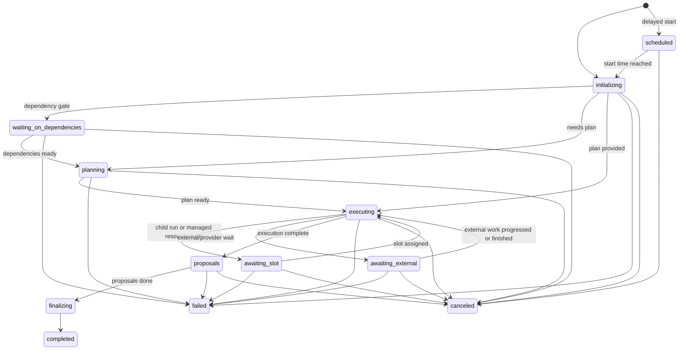
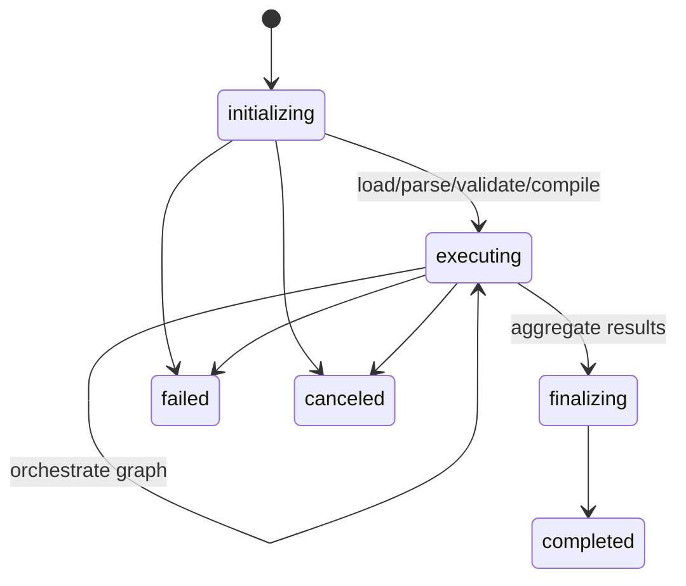
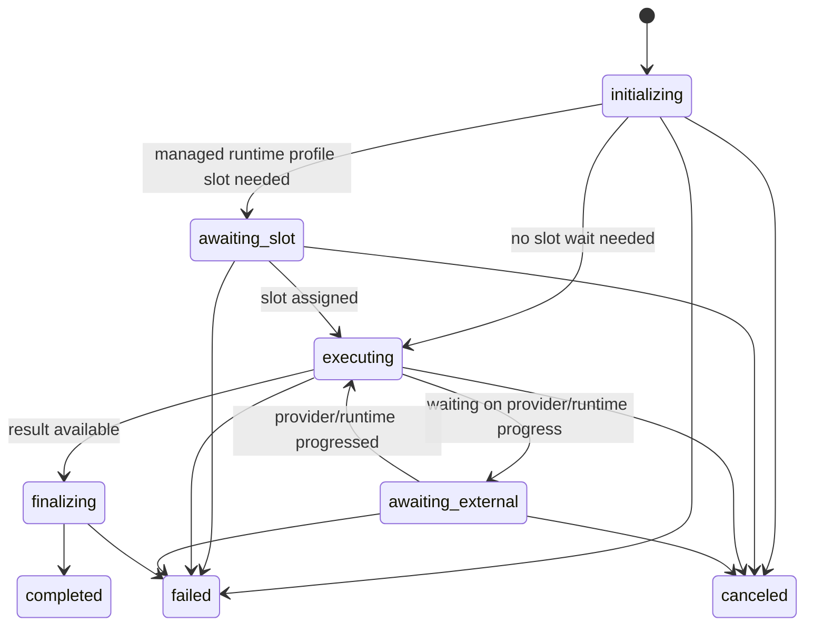
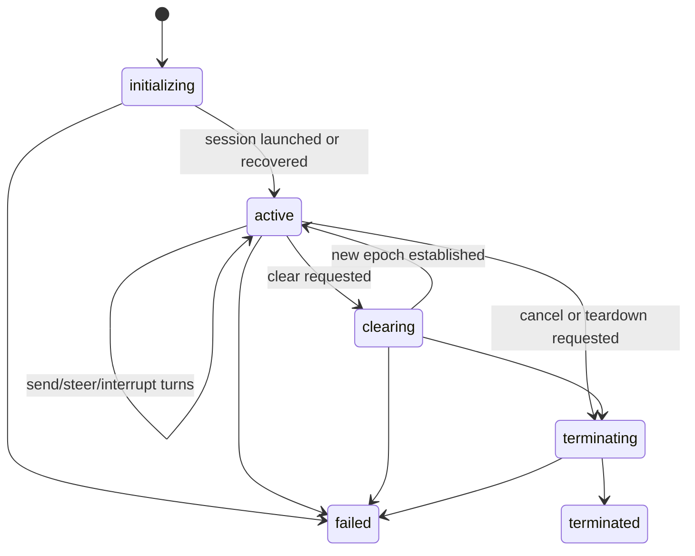

# Workflow Type Catalog and Lifecycle

**Implementation tracking:** [`docs/tmp/remaining-work/Temporal-WorkflowTypeCatalogAndLifecycle.md`](../tmp/remaining-work/Temporal-WorkflowTypeCatalogAndLifecycle.md)

MoonMind’s **Temporal-native** lifecycle contract for Temporal-managed executions. Task-shaped product surfaces may still use `task` labels; this document governs workflow types and execution semantics inside Temporal.

**Status:** Normative (Temporal application layer)  
**Owner:** MoonMind Platform  
**Last updated:** 2026-04-04  
**Audience:** backend, infra, dashboard

---

## 1. Purpose

Define the **Workflow Types** that constitute MoonMind’s Temporal application layer, and specify:

- the **lifecycle** of each workflow execution
- the canonical **domain state model** exposed to the UI through Temporal Visibility
- the **Update** and **Signal** contracts used for edits, approvals, and external events
- lifecycle **invariants**, **timeouts**, **retry posture**, and **history management**
- the minimal **Search Attribute** and **Memo** fields required for list, filtering, and totals

This document defines the **Temporal-side contract**. Public MoonMind APIs and UI flows may still use `task` terminology where compatibility requires it; once work is represented inside Temporal, this document treats it as a **Workflow Execution**.

---

## 2. Design principles

1. **A Temporal-managed row is a Workflow Execution.**  
   Temporal-backed list/detail views should come from Temporal Visibility. Task-oriented compatibility surfaces may still remain multi-source during migration.

2. **Workflow Types are the root orchestration categories.**  
   We do not introduce parallel top-level taxonomies for provider brand, runtime brand, or task-queue brand.

3. **Workflows orchestrate; Activities do side effects.**  
   All nondeterminism lives in Activities.

4. **True agent execution is a child-workflow concern.**  
   `MoonMind.AgentRun` is the durable lifecycle wrapper for one true agent execution. Task-scoped managed sessions are represented separately by `MoonMind.AgentSession` when a runtime uses the managed-session plane.

5. **Edits are modeled as Updates.**  
   Signals are used for asynchronous events such as approvals, webhooks, and external notifications.

6. **Large payloads live outside workflow history.**  
   Workflows reference artifacts and compact contracts rather than inlining large content.

7. **Task Queues are routing plumbing, not product semantics.**  
   MoonMind does not promise FIFO ordering to users.

8. **Canonical runtime contracts cross the workflow boundary.**  
   Workflow code should receive canonical `AgentRunHandle`, `AgentRunStatus`, and `AgentRunResult` contracts rather than provider-shaped payloads.

---

## 3. Naming conventions and identifiers

## 3.1 Workflow Type names

Namespace: `MoonMind.*`

Current core workflow types:

- `MoonMind.Run`
- `MoonMind.ManifestIngest`
- `MoonMind.ProviderProfileManager`
- `MoonMind.AgentRun`
- `MoonMind.AgentSession`
- `MoonMind.ManagedSessionReconcile`
- `MoonMind.OAuthSession`

Rules:

- names are stable
- never reuse an old name for different behavior
- prefer **few** types and add only when behavior is truly distinct

## 3.2 Workflow IDs

Workflow ID format should remain stable and opaque.

Representative form:

- `mm:<uuid>` for standard task executions
- `[prefix]:<id>` for singleton/session workflows (e.g., `oauth-session:<session_id>`)

Rules:

- Workflow ID is the canonical Temporal identifier for a Temporal-managed execution
- do not encode sensitive information into it
- Continue-As-New keeps the same Workflow ID
- public task APIs may expose `taskId` alongside `workflowId` where compatibility requires it

## 3.3 Run IDs

Run IDs are Temporal-generated identifiers for one concrete run of a workflow execution.

Rules:

- they are useful for debugging and detail views
- they are not the primary product handle
- UI detail views may show them, but product identity should center on Workflow ID

---

## 4. Workflow Type catalog

## 4.1 Catalog overview

| Workflow Type | Primary responsibility | Typical inputs | Typical outputs | Expected duration |
| --- | --- | --- | --- | --- |
| `MoonMind.Run` | Execute a user-requested run: plan work, own step state/progress, orchestrate child agent runs, integrate results, produce artifacts | input refs, optional plan ref, parameters | output artifacts, summary, progress, step refs | seconds → hours |
| `MoonMind.ManifestIngest` | Ingest a manifest artifact, validate, compile to a plan/graph, orchestrate execution, aggregate results | manifest artifact ref, policy params | aggregated outputs, per-node results | seconds → hours |
| `MoonMind.ProviderProfileManager` | Coordinate provider-profile slot assignment, release, cooldowns, and reconciliation for managed runtimes | runtime/profile coordination inputs | slot assignment, lease state transitions | minutes → long-lived |
| `MoonMind.AgentRun` | Own the durable lifecycle of one true managed or external agent execution | `AgentExecutionRequest`, refs, runtime metadata | canonical agent result, artifacts, lifecycle outcome | seconds → hours |
| `MoonMind.AgentSession` | Own one task-scoped managed runtime session container, including launch, turn routing, clear/reset epoch changes, status, summary refs, and teardown | Codex managed-session workflow input today; future neutral managed-session input when more runtimes adopt the plane | session handle/state, continuity refs, control/reset refs | minutes → hours |
| `MoonMind.ManagedSessionReconcile` | Periodically reconcile managed-session supervision records and container state outside any one task step | reconciliation policy and runtime scope | reconciliation summary and cleanup actions | seconds → minutes per run |
| `MoonMind.OAuthSession` | Manage browser-initiated OAuth or terminal-auth session lifecycle for managed runtimes | session config, runtime/provider context | auth/session status, profile registration side effects | minutes |

> Note: We intentionally do **not** model “Codex workflow,” “Gemini workflow,” “Jules workflow,” or “worker/system/manifest” as a top-level taxonomy. Provider/runtime choice is an execution concern, not a root orchestration category.

---

## 5. Common lifecycle model

Temporal already provides workflow close statuses:

- Running
- Completed
- Failed
- Canceled
- Terminated
- TimedOut
- ContinuedAsNew

MoonMind additionally maintains a domain state for filtering and UI messaging.

## 5.1 Domain state model (`mm_state`)

Define one canonical Search Attribute representing MoonMind execution state:

- `mm_state` (keyword)

Allowed values in v1:

- `scheduled`
- `initializing`
- `waiting_on_dependencies`
- `planning`
- `awaiting_slot`
- `executing`
- `awaiting_external`
- `proposals`
- `finalizing`
- `completed`
- `failed`
- `canceled`

Rules:

- `mm_state` must be set immediately at workflow start, usually to `initializing`
- `scheduled` means a deferred one-time execution exists but is waiting for start time
- `waiting_on_dependencies` means the workflow is blocked on prerequisite work outside its active loop
- `planning` means the workflow is computing or validating a plan
- `awaiting_slot` means the workflow is waiting on a bounded runtime resource such as a provider-profile slot
- `executing` means active work is occurring
- `awaiting_external` means the workflow is durably waiting on external provider/runtime progress
- `proposals` means post-execution proposal generation/submission is active
- `finalizing` means the workflow is producing its final outputs and terminal summary
- terminal `mm_state` must align with Temporal close status:
  - Temporal Completed → `completed`
  - Temporal Failed / TimedOut / Terminated → `failed`
  - Temporal Canceled → `canceled`

`mm_state` is the only required domain-state field for list filtering.

## 5.2 Optional bounded detail state

A second bounded Search Attribute may be used when extra list-level detail is justified:

- `mm_stage` (keyword)

Examples:

- `phase:planning`
- `phase:execution`
- `agent:awaiting_feedback`

Keep it bounded. Do not turn it into an unbounded event log or full provider-state mirror.

## 5.3 Minimal Visibility schema

### Required Search Attributes

- `mm_owner_id` (keyword)
- `mm_owner_type` (keyword)
- `mm_state` (keyword)
- `mm_updated_at` (datetime)
- `mm_entry` (keyword)

Typical `mm_entry` values (currently normalized by the executions API):

- `run`
- `manifest`
- `provider_profile`

*(Note: additional internally-used workflow types like `agent_run`, `agent_session`, `managed_session_reconcile`, and `oauth_session` are not currently normalized for top-level list filtering by the primary executions API.)*

### Optional Search Attributes

Use only when product filtering requires them:

- `mm_repo` (keyword)
- `mm_integration` (keyword)

### Required Memo fields

- `title` (small string)
- `summary` (small string)

### Optional Memo fields

- `input_ref`
- `manifest_ref`
- other compact safe refs

Rules:

- keep Memo small and human-readable
- do not store large prompts, manifests, or logs in Memo
- use artifact refs instead of inlining large content

---

## 6. Update and Signal contracts

## 6.1 Updates

Updates are the primary way to support edit-like semantics because they provide request/response behavior and acceptance decisions.

### Update: `UpdateInputs`

Purpose: replace or modify references to inputs, plans, or parameters.

Request:

- `input_ref?`
- `plan_ref?`
- `parameters_patch?`

Response:

- `accepted: bool`
- `applied: "immediate" | "next_safe_point" | "continue_as_new"`
- `message: string`

Rules:

- must be idempotent
- must reject invalid or unauthorized changes
- must reject changes when the workflow is terminal or policy forbids them

### Update: `SetTitle`

Request:

- `title: string`

Response:

- `accepted: bool`
- `message: string`

Rules:

- normally safe while running
- terminal behavior depends on product policy

### Update: `RequestRerun`

Purpose: request a clean re-execution.

Request:

- `input_ref?`
- `plan_ref?`
- `parameters_patch?`

Response:

- `accepted: bool`
- `message: string`

Semantics:

- prefer Continue-As-New when the intent is “same durable execution identity, fresh orchestration state”
- use a fresh Workflow ID only when product semantics explicitly call for a new execution identity

## 6.2 Signals

Signals are used for asynchronous external events.

### Signal: `ExternalEvent`

Examples:

- GitHub callback
- Jules/provider callback
- integration completion event
- async external status transition

Payload:

- `source: string`
- `event_type: string`
- `payload_ref?`
- `payload_inline?`

Rules:

- authenticity verification belongs in an Activity if external verification is required
- workflows should not do cryptographic or network verification inline

### Signal: `Approve`

Payload:

- `approval_type: string`
- `note?`

### Signal: `Pause` / `Resume`

Optional. Only expose if interactive long-run control is a product requirement.

### Signal: provider-profile coordination signals

Representative cases include:

- slot assigned
- slot released
- cooldown reported

These are internal orchestration signals and should stay compact and policy-bound.

---

## 7. Cancellation and termination semantics

## 7.1 User cancel

User/API cancel maps to Temporal workflow cancellation.

Workflow behavior:

- transition `mm_state` to `canceled`
- attempt best-effort cancellation of in-flight child workflows or activities where appropriate
- write a final summary

## 7.2 Forced termination

Forced termination is ops-only.

Behavior:

- use only for runaway workflows or policy violations
- mark domain outcome as failed unless a stronger product-specific rule exists
- do not pretend graceful cleanup occurred if it did not

## 7.3 Child workflow cancellation

Important child behavior:

- canceling `MoonMind.Run` should propagate to in-flight `MoonMind.AgentRun` child workflows
- `MoonMind.AgentRun` must still attempt best-effort provider/runtime cleanup inside a non-cancellable cleanup region when appropriate
- provider-side cancel success must be reported truthfully; MoonMind workflow cancellation and provider cancellation are related but not identical concepts

---

## 8. History management and Continue-As-New

## 8.1 Why

Some workflows are long-lived:

- provider polling/waiting
- large manifests
- managed-runtime cooldown loops
- long execution graphs
- repeated proposal cycles

Continue-As-New keeps replay performant and avoids history growth problems.

## 8.2 Policy direction

Use Continue-As-New when:

- a workflow has executed many steps or activities
- a polling/wait loop has grown large enough to justify a fresh run
- an Update requests a major reconfiguration best handled as a clean restart
- managed-runtime cooldown/orchestration loops have repeated enough times to justify a history reset

## 8.3 Preservation rules

Continue-As-New must preserve:

- Workflow ID
- core Search Attributes and Memo
- refs needed to continue
- stable business correlation identifiers
- any durable request context needed for safe retry/resume

---

## 9. Timeouts and retry posture

## 9.1 Workflow-level posture

- workflow execution timeouts should be generous
- workflows should also use internal phase budgets and timers
- workflows should not depend solely on giant top-level execution timeouts for safety

## 9.2 Activity-level posture

Activity timeout/retry defaults live in the Activity/Worker Topology doc and activity catalog.

General rules:

- all activities should have explicit timeouts
- side-effecting activities must be idempotent or safely keyed
- non-retryable contract failures should be classified explicitly
- rate-limit or slot-contention failures may require orchestration-aware retry rather than naive immediate repetition

## 9.3 External waiting posture

For external work:

- prefer callback-first when reliable
- use timer-based polling as fallback
- keep polling bounded
- Continue-As-New periodically for long-lived waits when needed

---

## 10. Error taxonomy and UI-facing failure categories

MoonMind should keep UI-facing failure categories small and stable.

Representative categories:

- `user_error`
- `integration_error`
- `execution_error`
- `system_error`

Workflows should catch failures at orchestration boundaries and produce:

- terminal `mm_state`
- memo summary with compact error category and human-readable message
- artifact-backed diagnostics for deeper debugging

For true agent-runtime work, contract-shape failures such as unsupported provider status or malformed canonical result should be treated as boundary failures, not silently repaired in workflow code.

---

## 11. Per-workflow lifecycle details

## 11.1 `MoonMind.Run` lifecycle

Key notes:

* planning is an Activity-driven concern, not a separate orchestration substrate
* the plan artifact owns planned step structure; `MoonMind.Run` owns the live step ledger and operator-facing progress
* execution may mix direct activities and child workflows
* true agent steps dispatch to `MoonMind.AgentRun`, while the parent tracks only bounded step status, refs, and summaries
* `child_state_changed`-style coordination may bubble child state to the parent domain state

## 11.2 `MoonMind.ManifestIngest` lifecycle

Key notes:

* parse/validate/compile belong in Activities
* orchestration may be inline or may spawn child `MoonMind.Run` executions
* aggregation should produce artifact-backed results

## 11.3 `MoonMind.AgentRun` lifecycle

Key notes:

* this workflow owns the durable lifecycle of one true agent execution
* managed and external providers share this lifecycle shape
* managed runs may interact with `MoonMind.ProviderProfileManager`
* external runs may use polling or streaming-gateway orchestration branches
* workflow code should receive canonical runtime contracts from activities, not provider-native dicts

## 11.4 `MoonMind.AgentSession` lifecycle

Key notes:

* this workflow owns one task-scoped managed runtime session, currently Codex-backed
* the workflow carries bounded session identity and refs, not large transcripts or logs
* turn execution and session controls call `agent_runtime.*` activities on `mm.activity.agent_runtime`
* clear/reset creates a new `session_epoch` and publishes explicit continuity artifacts
* future Claude/Gemini session adoption should use a neutral managed-session contract rather than making Codex-specific types the permanent public surface

## 11.5 `MoonMind.ManagedSessionReconcile` lifecycle

This workflow is a bounded support workflow for managed-session supervision.

Representative lifecycle concerns:

* invoke `agent_runtime.reconcile_managed_sessions`
* classify stale or orphaned managed-session supervision records
* trigger bounded cleanup or status repair through activity-owned side effects
* finish quickly and rely on schedule/API triggering for future reconciliation passes

It is not a task workflow and should not appear as a normal user task.

## 11.6 `MoonMind.ProviderProfileManager` lifecycle

This workflow is long-lived and coordination-oriented.

Representative lifecycle concerns:

* initialize runtime/profile state
* wait for slot requests
* assign or queue requests
* apply cooldowns
* reconcile leases
* continue as new periodically when needed

Its UI-facing state should stay compact; it is primarily an internal coordination workflow.

## 11.7 `MoonMind.OAuthSession` lifecycle

Representative lifecycle:

* initialize OAuth/auth terminal session
* start auth runner
* stream/update session status
* verify auth outcome
* register resulting provider/runtime profile if successful
* fail/cleanup if not

This is a support workflow, not a general task workflow.

---

## 12. Authorization rules

All Updates, Signals, and Cancels must be authorized by the MoonMind API layer and may be revalidated by workflows or activities where defense in depth matters.

Minimum requirements:

* only owners or admins may Update/Cancel where product policy requires
* external event signals must include enough verification context for activity-boundary authenticity checks
* internal workflow-to-workflow signals should not bypass domain-policy invariants

---

## 13. Acceptance criteria for this document

This document is “done” when:

1. workflow types are fixed for v1
2. `mm_state` values are fixed and implemented consistently
3. Search Attributes and Memo schema are finalized
4. Update and Signal names and payload shapes are finalized
5. Continue-As-New triggers are defined
6. cancellation semantics are unambiguous
7. `MoonMind.AgentRun`, `MoonMind.AgentSession`, `MoonMind.ManagedSessionReconcile`, and `MoonMind.ProviderProfileManager` are reflected as first-class workflow types
8. canonical runtime contract boundaries are reflected in workflow expectations

---

## 14. Open questions

1. Do we expose raw Workflow Type names directly in the UI, or map them to product-friendly labels?
2. Does the detail page always point to the latest run, or should run history be first-class in the UI?
3. For `RequestRerun`, when do we use Continue-As-New vs a brand-new Workflow ID?
4. Do we need `Pause/Resume` in v1?
5. Should `mm_updated_at` track any state transition, progress updates, or both under a bounded policy?
6. How much of `MoonMind.ProviderProfileManager`, `MoonMind.AgentSession`, `MoonMind.ManagedSessionReconcile`, and `MoonMind.OAuthSession` should be directly visible in product-facing surfaces vs remaining internal/operator-facing?

---

## Appendix A: Minimal field list for dashboard MVP

List executions via Visibility with:

* Workflow ID
* Workflow Type
* Temporal close status
* `mm_state`
* `mm_updated_at`
* Memo `title`
* Memo `summary`

Representative actions:

* `UpdateInputs`
* `Cancel`
* optional `RequestRerun`
* detail queries for live current state where applicable
