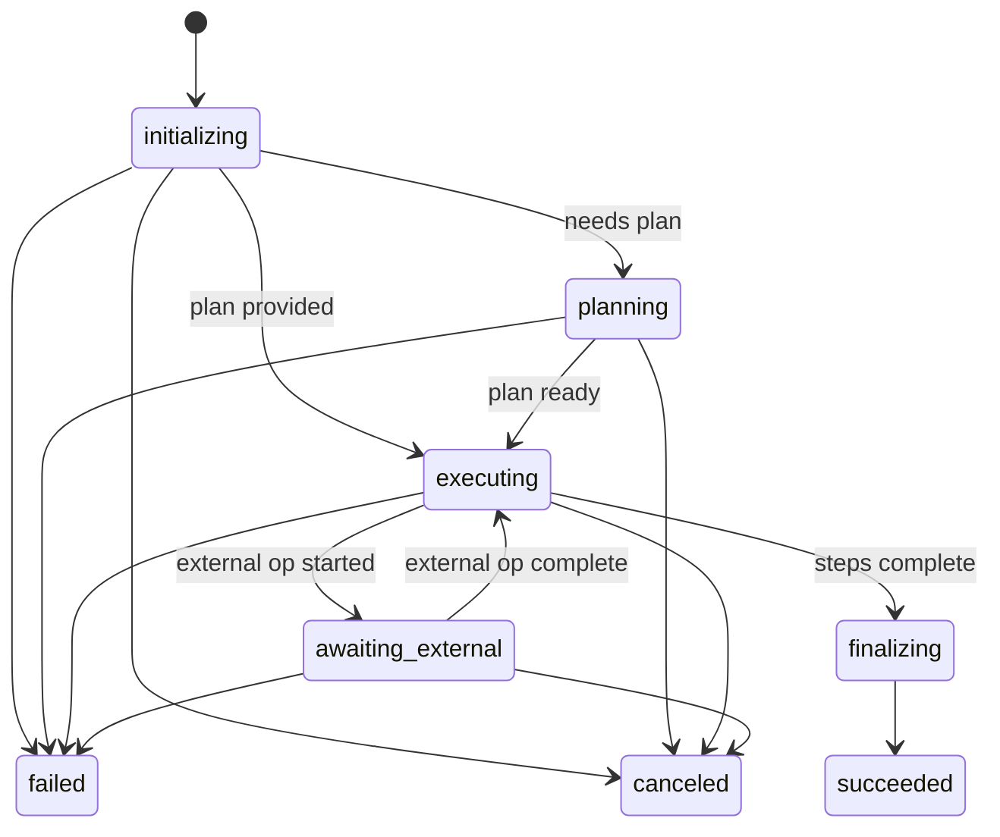
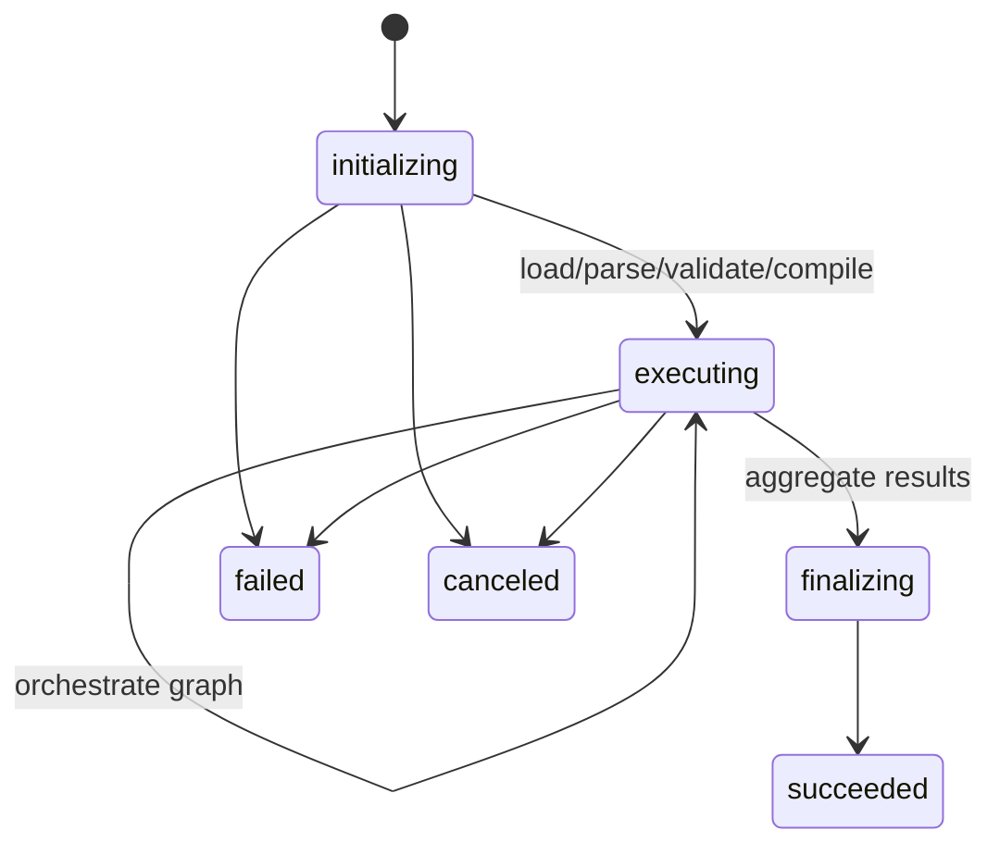

# Workflow Type Catalog and Lifecycle

**Implementation tracking:** [`docs/tmp/remaining-work/Temporal-WorkflowTypeCatalogAndLifecycle.md`](../tmp/remaining-work/Temporal-WorkflowTypeCatalogAndLifecycle.md)

MoonMind **Temporal-native** lifecycle contract for Temporal-managed executions. Task-shaped product surfaces may still use `task` labels; this document governs workflow types and execution semantics inside Temporal.

**Status:** Normative (Temporal application layer)
**Owner:** MoonMind Platform
**Last updated:** 2026-03-05
**Audience:** backend + infra + dashboard

---

## 1) Purpose

Define the **Workflow Types** that constitute MoonMind's Temporal application layer, and specify:

* the **lifecycle** of each Workflow Execution (how it starts, progresses, ends)
* the canonical **state model** exposed to the UI (via Temporal Visibility)
* the **Update** and **Signal** contracts (edit, cancel, webhook events, approvals)
* lifecycle **invariants**, **timeouts**, **retry policies**, and **history management**
* the minimal set of **Search Attributes** and **Memo** fields required for list + filtering + totals

This document defines the **Temporal-side contract**. Public MoonMind APIs and UI flows may still use `task` terminology where compatibility requires it; once work is represented inside Temporal, this document treats it as a **Workflow Execution**.

---

## 2) Design principles

1. **A Temporal-managed row is a Workflow Execution.**
   For Temporal-backed list/detail views, we list and paginate executions using Temporal Visibility. Public `/tasks/*` surfaces may still remain multi-source during migration.

2. **Workflow Types are the only root-level categorization.**
   We do not introduce “kind” or other parallel taxonomies.

3. **Workflows orchestrate; Activities do side effects.**
   All nondeterminism lives in Activities (LLMs, network I/O, filesystem, time).

4. **Edits are modeled as Temporal Updates.**
   Signals are used for asynchronous events (webhooks, approvals, external notifications).

5. **Large payloads live outside workflow history.**
   Workflows reference Artifacts by ID/URI; avoid bloating history.

6. **Task Queues are routing plumbing, not product semantics.**
   We never promise FIFO ordering to users.

---

## 3) Naming conventions and identifiers

### 3.1 Workflow Type names

Namespace: `MoonMind.*`
Examples:

* `MoonMind.Run`
* `MoonMind.ManifestIngest`

Rules:

* Names are stable; never reuse old names for different behavior.
* Prefer **few** types; add only when behavior is truly distinct.

### 3.2 Workflow IDs

Workflow ID format:

* `mm:<ulid-or-uuid>`

Rules:

* Workflow ID is the canonical Temporal identifier for a Temporal-managed execution.
* Do not encode sensitive info into the ID.
* A “re-run” or “restart” uses the same Workflow ID via **Continue-As-New** when appropriate.
* Public MoonMind task APIs may expose `taskId` alongside `workflowId` where the compatibility bridge requires it.

### 3.3 Run IDs

Run IDs are Temporal-generated identifiers for each run of the execution.

* The UI may show the latest Run ID on a detail page, but the primary Temporal handle is Workflow ID.

---

## 4) Workflow Type catalog

### 4.1 Catalog overview

| Workflow Type             | Primary responsibility                                                                                              | Typical inputs                                                 | Typical outputs                                 | Expected duration |
| ------------------------- | ------------------------------------------------------------------------------------------------------------------- | -------------------------------------------------------------- | ----------------------------------------------- | ----------------- |
| `MoonMind.Run`            | Execute a user-requested run: acquire/compute a Plan, execute Skills, integrate external actions, produce artifacts | `input_artifact_ref`, optional `plan_artifact_ref`, parameters | output artifacts, status, summary               | seconds → hours   |
| `MoonMind.ManifestIngest` | Ingest a manifest artifact, validate, compile to a Plan (graph), orchestrate execution (inline or via child runs)   | `manifest_artifact_ref`, policy params                         | aggregated output artifact(s), per-node results | seconds → hours   |

> Note: We intentionally do **not** model “worker/system/manifest” as a taxonomy. A workflow is a system; activities are execution steps. Manifest ingest exists as a separate Workflow Type only because it has materially different orchestration behavior (graph + aggregation).

---

## 5) Common lifecycle model (applies to all Workflow Types)

Temporal already provides Workflow Execution statuses (Running/Completed/Failed/Canceled/Terminated/TimedOut/ContinuedAsNew). MoonMind additionally maintains a **domain state** for filtering and UI messaging on Temporal-managed executions.

### 5.1 Domain state model (Search Attribute)

Define a **single** Search Attribute representing “MoonMind state”:

* `mm_state` (keyword)

Allowed values (v1):

* `initializing`
* `planning`
* `awaiting`
* `executing`
* `awaiting_external`
* `finalizing`
* `succeeded`
* `failed`
* `canceled`

Rules:

* `mm_state` MUST be set immediately at workflow start (`initializing`).
* `awaiting` indicates the workflow has been claimed and is past initial dispatch, but is blocked waiting for a prerequisite resource (e.g. an auth-profile slot from the `AuthProfileManager`). This is distinct from `planning` (generating a plan) and `executing` (actively running agent work). The Memo `summary` field should indicate what the workflow is awaiting.
* `mm_state` MUST transition to a terminal value on completion (`succeeded|failed|canceled`).
* Terminal `mm_state` must be consistent with Temporal close status:

  * Temporal Completed → `succeeded`
  * Temporal Failed/TimedOut/Terminated → `failed`
  * Temporal Canceled → `canceled`
* `mm_state` is the *only* domain state field required for list filtering.

Optional second Search Attribute if you need more detail without exploding states:

* `mm_stage` (keyword) — e.g., `skill:<name>` or `phase:<name>` (keep bounded!)

### 5.2 Minimal Visibility schema (Search Attributes + Memo)

#### Search Attributes (indexed, used for Temporal-backed list filters)

Required:

* `mm_owner_id` (keyword) — who initiated the execution
* `mm_state` (keyword) — state as defined above
* `mm_updated_at` (datetime) — last meaningful state/progress update (for sorting)
* `mm_entry` (keyword) — `"run" | "manifest"` (optional; helps filter without relying on type name)

Optional (only if product needs filtering):

* `mm_repo` (keyword) — repo identifier for code-related runs
* `mm_integration` (keyword) — e.g., `"jules"` when relevant

#### Memo (non-indexed display metadata)

Required:

* `title` (string, small)
* `summary` (string, small; can be updated over time)

Optional:

* `input_ref` (string) — artifact reference (safe, not huge)
* `manifest_ref` (string) — for `MoonMind.ManifestIngest`

Rules:

* Keep Memo small and human-readable.
* Never store large user prompts/manifests in Memo.
* Compatibility adapters may transform these fields into task-oriented list/detail payloads without changing the Temporal source of truth.

---

## 6) Update and Signal contracts

### 6.1 Updates (request/response; used for edits)

Updates are the primary way to support “edit execution” semantics. The workflow validates and returns a structured response.

#### Update: `UpdateInputs`

Purpose: replace or modify references to inputs/plans/parameters.

Request:

* `input_ref?` (artifact ref)
* `plan_ref?` (artifact ref)
* `parameters_patch?` (small JSON patch)

Response:

* `accepted: bool`
* `applied: "immediate" | "next_safe_point" | "continue_as_new"`
* `message: string`

Rules:

* Must be idempotent (client may retry).
* Workflow must reject updates that would violate invariants (e.g., invalid artifacts, unauthorized, terminal state).

#### Update: `SetTitle`

Request:

* `title: string`

Response:

* `accepted: bool`
* `message: string`

Rules:

* Always safe unless terminal and policy forbids post-close changes.

#### Update: `RequestRerun`

Purpose: request a clean re-execution.
Request:

* `input_ref?`
* `plan_ref?`
* `parameters_patch?`

Response:

* `accepted: bool`
* `message: string`

Semantics:

* Prefer **Continue-As-New** to produce a clean run while preserving the same Workflow ID.

> We avoid introducing custom “revision” objects. If you later need immutable audit of inputs, store the history as artifacts and reference them.

### 6.2 Signals (async events; no response)

Signals carry external events and human actions into a running workflow.

#### Signal: `ExternalEvent`

Examples:

* webhook from Jules
* webhook from GitHub app
* external system callback

Payload:

* `source: string` (e.g., `"jules"`)
* `event_type: string`
* `payload_ref?` (artifact ref if large)
* `payload_inline?` (small JSON if tiny)

Rules:

* Workflow must validate event authenticity via an Activity call if needed (don’t do crypto/network verification in workflow code).

#### Signal: `Approve`

Payload:

* `approval_type: string`
* `note?`

#### Signal: `Pause` / `Resume`

Only if product needs interactive control of long runs.

---

## 7) Cancellation and termination semantics

### 7.1 User cancel

API calls Temporal cancellation for the Workflow Execution.
Workflow behavior:

* transitions `mm_state` → `canceled`
* attempts to cancel in-flight activities where possible
* writes a final summary

### 7.2 Forced termination (ops-only)

Used only for runaway workflows or policy violations.

* mark `mm_state` → `failed` (with reason in summary)
* do not attempt graceful cleanup beyond minimal bookkeeping

---

## 8) History management and Continue-As-New

### 8.1 Why

Some executions will be long-lived (polling, large manifests, many steps). To keep replay performant and avoid excessive history growth:

* Use **Continue-As-New** when:

  * the number of executed plan steps exceeds a threshold
  * the workflow has been waiting/polling beyond a threshold
  * an Update requests a major reconfiguration best handled as a clean restart

### 8.2 Policy (v1 defaults)

* `MoonMind.Run`: Continue-As-New after `N` completed skill invocations (choose N based on measured history size)
* `MoonMind.ManifestIngest`: Continue-As-New after completing each major manifest phase (parse/compile/execution batches) if manifest is large

Rule:

* Continue-As-New must preserve:

  * Workflow ID
  * key Search Attributes and Memo (title/owner/state)
  * artifact references needed to proceed

---

## 9) Timeouts and retry policy defaults

### 9.1 Workflow-level

* Workflow execution timeout: set generously (hours) depending on product needs
* “Runaway protection”: use internal timers and explicit time budgets per phase

### 9.2 Activity-level defaults (by class)

(Defined in the Activity/Worker Topology doc; referenced here)

General rule:

* Activities must define explicit:

  * `start_to_close_timeout`
  * `schedule_to_close_timeout` where appropriate
  * retry policy (max attempts, backoff)

### 9.3 External monitoring

* Prefer callback-first; fall back to timer-based polling.
* Polling loop must:

  * use backoff
  * periodically Continue-As-New if long-lived
  * store external IDs in workflow state + minimal memo/search attr if needed

---

## 10) Error taxonomy (what the UI should show)

We avoid legacy error classes; use a small set of UI-facing categories derived from the workflow:

* `user_error` (validation, missing inputs)
* `integration_error` (external API failures beyond retry budget)
* `execution_error` (sandbox/tool failure)
* `system_error` (unexpected bugs)

Implementation:

* Workflow catches failures at orchestration boundaries and writes:

  * `mm_state = failed`
  * memo summary that includes `error_category` and a short human message
  * detailed logs/artifacts for debugging (not in memo)

---

## 11) Per-Workflow-Type lifecycle details

### 11.1 `MoonMind.Run` lifecycle

Mermaid state sketch:

Key notes:

* Planning is a **skill** invoked via an Activity (not special “spec” logic).
* Execution dispatch is activity-driven and can mix LLM and non-LLM activities in one workflow execution.

### 11.2 `MoonMind.ManifestIngest` lifecycle

Key notes:

* Parsing/validation/compile are Activities.
* Execution strategy decision:

  * inline orchestration (activities only), or
  * spawn child `MoonMind.Run` executions for each node/sub-run
* Aggregation writes an artifact reference for results.

---

## 12) Authorization rules (control plane invariants)

All Updates/Signals/Cancels must be authorized by the MoonMind API layer **and** optionally re-validated by workflow (defense in depth).

Minimum requirements:

* Only owners (or admins) can Update/Cancel.
* ExternalEvent signals must include verification context; workflow may call an Activity to verify authenticity if needed.

---

## 13) Acceptance criteria for this document

This document is “done” when:

1. Workflow Types are fixed for v1 (no open debate for initial implementation).
2. `mm_state` values are fixed and implemented consistently.
3. Search Attributes + Memo schema is finalized (enough to build list/filter).
4. Update and Signal names + payload shapes are finalized.
5. Continue-As-New policy triggers are defined (even if thresholds are placeholders).
6. Cancellation semantics are unambiguous.

---

## 14) Open questions (to decide now, not during coding)

1. **Do we expose Workflow Type names directly in the UI**, or map them to user-friendly labels?
2. Do we want a single “detail page” per Workflow ID that always points to the latest run, or show run history?
3. For `RequestRerun`, do we always Continue-As-New, or sometimes start a fresh Workflow ID?
4. Do we need a `Pause/Resume` capability in v1?
5. Should `mm_updated_at` be driven by:

   * “any state transition,” or
   * “progress updates per step,” or
   * both (but bounded)?

---

### Appendix A: Minimal field list for dashboard MVP

* List executions via Visibility with:

  * Workflow ID
  * Workflow Type
  * Temporal status (running/completed/failed/canceled)
  * `mm_state`
  * `mm_updated_at`
  * Memo `title`, `summary`
* Actions:

  * UpdateInputs
  * Cancel
  * (optional) RequestRerun
