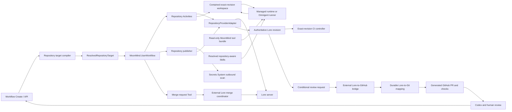

# Lore VCS Integration — System / Feature Design View

**Status:** Proposed  
**Document Class:** Canonical declarative  
**Viewpoint:** System / Feature Design View  
**Updated:** 2026-07-30  
**Audience:** MoonMind contributors, workflow and runtime authors, integration authors, security reviewers, operators, and repository administrators  
**Authority:** Transitional canonical design for provider-discriminated repository targets, Lore-backed workspaces, repository capabilities, publication evidence, generated-review handoff, exact-revision CI, and merge-authority boundaries in MoonMind  
**Owning Surface:** Workflow repository, workspace, publishing, Managed Agents, Omnigent, Security, and integration boundaries  
**Related Docs:** [`MoonMindArchitecture.md`](../MoonMindArchitecture.md), [`WorkflowArchitecture.md`](./WorkflowArchitecture.md), [`WorkflowPublishing.md`](./WorkflowPublishing.md), [`RequiredCapabilities.md`](./RequiredCapabilities.md), [`WorkspaceLocators.md`](./WorkspaceLocators.md), [`ManagedAgentsGit.md`](../ManagedAgents/ManagedAgentsGit.md), [`OmnigentHostMountedTools.md`](../Omnigent/OmnigentHostMountedTools.md), [`SecretsSystem.md`](../Security/SecretsSystem.md), [`SkillSystem.md`](../Steps/SkillSystem.md), [`SkillAndPlanContracts.md`](./SkillAndPlanContracts.md)  
**Related Implementation:** [`execution_contract.py`](../../moonmind/workflows/executions/execution_contract.py), [`moonmind/publish/`](../../moonmind/publish/), [`moonmind/auth/`](../../moonmind/auth/), [`moonmind/workflows/temporal/runtime/`](../../moonmind/workflows/temporal/runtime/), and future repository-provider adapters

> This document defines desired state. Implementation sequencing, migration checklists, Tactics cutover status, and rollout ownership belong in `docs/tmp/`, issues, pull requests, or the external Tactics operational plan.

---

## 1. Purpose

MoonMind currently treats repository selection, Git transport, and GitHub publication as closely coupled concepts. That is valid for a GitHub-authoritative repository, but it is not valid for a project whose authoritative revisions live in Lore and whose GitHub repository is a generated review projection.

This design makes repository authority explicit. It lets MoonMind:

- author one provider-discriminated repository target at the top-level workflow boundary;
- prepare an exact Lore repository and revision as a complete workflow workspace;
- give managed and Omnigent-hosted agents the real, pinned `lore` CLI and provider-aware operating guidance;
- inspect, stage, diff, commit, push, and lock through Lore without treating a generated Git tree as authoritative;
- preserve exact Lore identities in checkpoints, artifacts, CI requests, publication evidence, review mappings, and merge requests;
- request a generated GitHub pull request without pushing repository contents to GitHub;
- consume projected GitHub PR, check, and review state as derived review evidence;
- send review fixes back through a Lore workspace as a new Lore revision; and
- defer protected-branch merge authority to the Lore-side coordinator required by repository policy.

The initial motivating deployment is Tactics. Its intended authority model is a complete Lore repository containing root `Content/**`, exact-revision Unreal CI, and one-way generated Git history that omits root `Content/**` while retaining plugin-owned Content. MoonMind must fit that model rather than create a competing Lore-to-GitHub bridge or a GitHub-to-Lore synchronization path.

---

## 2. Desired behavior

### 2.1 Authority model

For a Lore-backed repository, MoonMind uses this fixed authority direction:

```text
Workflow author or review-remediation request
        |
        v
MoonMind resolves a Lore repository target
        |
        v
Exact Lore workspace, including paths omitted from GitHub
        |
        +---- agent reads and changes the workspace
        |
        +---- MoonMind or a Lore-aware auto-publish Skill publishes
        v
Authoritative Lore work branch and exact Lore revision
        |
        +---- exact-revision CI
        |
        +---- conditional, versioned review request
        v
External Lore-to-GitHub bridge
        |
        v
Generated Git commit, branch, pull request, and checks
        |
        +---- Codex and human review
        |
        +---- findings become a new Lore-backed run
        v
Lore-side merge coordinator merges the approved Lore revision
```

The following are invariants:

1. **Lore is the repository-content authority.** The Lore repository id and immutable revision signature identify repository state. Branch identity is carried separately when branch reachability or mutation matters.
2. **GitHub is a review projection.** A Git commit SHA, generated branch, or pull request is derived identity and must map to the exact Lore revision before MoonMind treats it as current.
3. **GitHub never writes repository contents back into Lore.** Review findings are inputs to a new Lore-backed run. The resulting fix is committed to Lore and projected again.
4. **The authoritative workspace contains the complete Lore revision.** MoonMind must not substitute the filtered GitHub tree for root `Content/**`, Lore workspace state, locks, or other Lore-only state.
5. **A new Lore revision stales earlier branch-scoped CI and review evidence.** This applies even when the generated Git tree is unchanged, such as a root-Content-only revision.
6. **Ordinary MoonMind publication cannot merge protected Lore branches.** It may request review or submit a merge request to the external coordinator, but it does not bypass that coordinator.
7. **Authority handoffs are conditional.** Branch publication and review-request writes are accepted only against the exact expected branch state; a later run cannot overwrite a newer revision's handoff.

### 2.2 Primary scenarios

#### Read or analyze an exact revision

A workflow may author an immutable revision selector with `publish.mode = "none"`. MoonMind resolves the connection, repository, branch context, and exact revision signature; materializes the complete revision into a contained workspace; records the prepared identity; and launches the selected runtime without repository mutation authority.

#### Implement and publish a branch

MoonMind prepares the selected branch at a recorded remote-tip expectation. The agent changes the complete workspace. The deterministic publisher scans external changes, checks lock and contamination policy, stages intended paths, builds a publication candidate, performs the Secrets System outbound scan when required, publishes through a provider-native compare-and-set or equivalent lease, verifies the exact remote revision, and emits provider-neutral publication evidence.

#### Request a generated pull request

For `publish.mode = "pr"`, MoonMind first verifies the Lore publication. It then writes an idempotent review-request envelope only if the Lore work branch still points at the exact published revision. MoonMind durably waits for the external bridge to confirm that this revision maps to the generated Git commit and pull-request head. MoonMind does not directly push the generated Git branch or create the GitHub pull request.

#### Remediate GitHub review findings

MoonMind resolves the generated pull request through trusted bridge mapping data, identifies the authoritative Lore repository, branch, and current revision, fetches authorized GitHub review context, and performs remediation against the Lore workspace. The agent may read GitHub review state, but repository mutation and publication go only to Lore. A later generated Git commit updates the same review projection.

#### Run exact-revision CI

MoonMind or a connected CI controller receives an immutable repository CI request, materializes the complete Lore revision, and returns immutable terminal evidence for that exact revision. When a Git mapping exists, the result may also be projected to a GitHub Check Run, but the Git SHA is not the workspace input.

#### Request merge

MoonMind submits a merge request containing the exact current source revision, target-branch expectation, current Lore CI evidence, current projected-review evidence, approval evidence refs, and idempotency identity. The coordinator remains responsible for serialization, currentness, dry-run conflict detection, approvals, the Lore merge, and generated-Git reconciliation.

### 2.3 Compatibility with the Tactics authority and projection contract

A Tactics-compatible implementation must preserve all of the following:

- root `/Content/**` is present in MoonMind's Lore workspace and exact-revision CI input;
- root `/Content/**` is not expected to appear in the generated GitHub tree;
- plugin-owned `Plugins/**/Content/**` remains ordinary repository content;
- Content-only Lore revisions remain publishable, CI-addressable, and reviewable even when the generated Git tree is tree-identical;
- review summaries distinguish code paths from root Content paths and carry visual or asset-validation evidence when available;
- generated Git history, parent mapping, symlink reconstruction, fast-forward-only generated refs, and divergence quarantine remain responsibilities of the external projection bridge;
- MoonMind never directly updates or force-pushes a generated GitHub ref;
- the exact current Lore revision, not merely the GitHub head, gates CI, review freshness, and merge submission; and
- GitHub merge actions are not authoritative for the Lore-backed repository.

---

## 3. Shape

### 3.1 Component topology



Temporal workflow code carries compact identities and orchestrates retries, waits, signals, and child work. Connection checks, filesystem work, Lore CLI or client calls, network calls, security scans, artifact writes, projection-status reads, and merge-request submission occur in Activities or external service boundaries.

### 3.2 Canonical contract replacement and cutover

The repository-provider change is a cohesive contract replacement, not an additive compatibility alias.

| Superseded shape | Canonical desired state |
| --- | --- |
| Top-level `repository: string` plus `task.git.branch` | One top-level provider-discriminated `repository` object |
| `task.repository` as an ignored extra field | No nested repository target; repository authority is top-level |
| `task.auth.repoAuthRef` and `publishAuthRef` | `repository.connectionRef` to a deployment-owned `RepositoryConnection` |
| Repository presence always derives `git` | Provider- and Skill-aware capability compilation |
| `publish.mode = "pr"` always derives `gh` | `gh` only when GitHub review/check access is actually required |
| `acceptedRepositoryEvidence` plus `moonmind.publish.auto.v1` | One `moonmind.publish.repository.v1` evidence contract for managed and agent-owned publication |
| Git-named checkpoint and Omnigent repository identity fields | Provider-discriminated repository checkpoint and runtime identity |

Cutover rules:

1. New submissions use only the new top-level `repository` contract.
2. New authoring, create, edit, rerun, preset, test, mock, and documentation paths do not emit the old string or `task.git` fields.
3. Existing durable workflow histories may replay through a frozen, explicitly versioned legacy decoder when required by Temporal history compatibility.
4. The legacy decoder is not an authoring normalizer and cannot accept new submissions.
5. Legacy fields and translators are removed after the applicable history and persisted-payload retention window.
6. The implementation that introduces this contract also removes `acceptedRepositoryEvidence` and new-write support for `moonmind.publish.auto.v1`; legacy readers remain only where recorded histories require them.

All new repository schemas use the dotted `moonmind.<contract>.vN` convention. Existing repository-adjacent checkpoint schemas with unrelated version conventions are replaced as part of the provider-discriminated checkpoint cutover rather than retained as a third parallel surface.

### 3.3 Repository connection

Repository access is configured through a first-class `RepositoryConnection`. It is not an LLM Provider Profile and does not overload GitHub credentials.

```ts
type RepositoryProvider = "git" | "lore";

interface RepositoryConnection {
  schemaVersion: "moonmind.repository-connection.v1";
  id: string;
  provider: RepositoryProvider;
  displayName: string;

  endpointRef: string;
  trustBundleRef?: string;

  credentialSource: "secret_ref" | "trusted_network_development";
  credentialRef?: SecretRef;

  allowedRepositoryIds?: string[];
  allowedOperations: Array<
    | "read"
    | "write"
    | "branch_write"
    | "lock"
    | "review_request"
    | "merge_request"
  >;

  clientPolicy: {
    pinnedVersion: string;
    compatibleServerVersions?: string[];
    toolBundleRef: string;
    executableSha256: string;
  };

  projection?: {
    provider: "github";
    repository: string;
    authority: "review_only";
    statusSourceRef: string;
  };
}
```

Rules:

- `endpointRef`, `trustBundleRef`, and `credentialRef` are resolved only at trusted execution boundaries.
- `credentialRef` is the typed `SecretRef` owned by the Secrets System; this design does not introduce another string grammar or secret parser.
- The durable connection contains no private key, token, password, cookie, auth header, or absolute runtime path.
- `credentialSource = "trusted_network_development"` is eligible only under explicit development or migration-shadow policy. It is never production-ready merely because the server is reachable.
- Repository and operation allowlists are checked before workspace preparation and again before mutation.
- Client version and executable digest are pinned and checked against server-compatibility policy. `latest` is not a durable client identity.
- A connection may select a compatible worker or host pool carrying its exact tool-bundle snapshot.
- Repository connection selection replaces repository-scoped auth fields in new authored workflow payloads.

### 3.4 Authored repository target

The canonical workflow boundary carries one top-level repository object:

```ts
interface AuthoredGitRepositoryTarget {
  provider: "git";
  connectionRef: string;
  repository: { name: string };
  branch: { name: string };
  revision?: {
    kind: "git_commit";
    commitSha: string;
  };
}

interface AuthoredLoreRepositoryTarget {
  provider: "lore";
  connectionRef: string;
  repository: { name: string };
  branch: { name: string };
  revision?: {
    kind: "lore_revision";
    revisionSignature: string;
  };
}

type AuthoredRepositoryTarget =
  | AuthoredGitRepositoryTarget
  | AuthoredLoreRepositoryTarget;
```

Representative Lore submission:

```json
{
  "repository": {
    "provider": "lore",
    "connectionRef": "repository-connection:tactics-lore",
    "repository": { "name": "Tactics" },
    "branch": { "name": "main" }
  },
  "workflow": {
    "publish": { "mode": "pr" },
    "instructions": "Implement the selected change"
  }
}
```

Representative exact-revision read:

```json
{
  "repository": {
    "provider": "lore",
    "connectionRef": "repository-connection:tactics-lore",
    "repository": { "name": "Tactics" },
    "branch": { "name": "main" },
    "revision": {
      "kind": "lore_revision",
      "revisionSignature": "<immutable-signature>"
    }
  },
  "workflow": {
    "publish": { "mode": "none" },
    "instructions": "Analyze this exact historical revision"
  }
}
```

Validation rules:

- `revision` selects immutable historical state and is valid for `publish.mode = "none"` and exact-revision Tool or CI requests.
- `revision` is rejected for ordinary `branch`, `pr`, or `auto` publication because silently mutating from a historical checkout is ambiguous.
- Creating a new work branch from a historical revision is a separate explicit provider operation with its own target branch and remote-tip expectation.
- For `publish.mode = "pr"`, the authored branch is the base or target branch; MoonMind creates or resolves a work branch.
- For `publish.mode = "branch"`, the authored branch is the branch to update.
- Review remediation may resolve the existing Lore work branch from trusted projection mapping instead of generating another branch.

### 3.5 Resolved repository identity

Repository identity, branch identity, and immutable revision identity are distinct axes.

```ts
interface RepositoryRef {
  id: string;
  name: string;
}

interface RepositoryBranchRef {
  repositoryId: string;
  id: string;
  name: string;
}

interface GitRevisionRef {
  provider: "git";
  repositoryId: string;
  commitSha: string;
}

interface LoreRevisionRef {
  provider: "lore";
  repositoryId: string;
  revisionSignature: string;
  revisionNumber?: number; // display and diagnostics only
}

type RepositoryRevisionRef = GitRevisionRef | LoreRevisionRef;

type RemoteTipExpectation =
  | { kind: "must_equal"; revision: RepositoryRevisionRef }
  | { kind: "must_not_exist" }
  | { kind: "read_only" };
```

`LoreRevisionRef` deliberately does not embed a branch id. A revision signature identifies immutable repository state; branch reachability and the branch selected for mutation are represented by `RepositoryBranchRef`. The pinned Lore adapter must verify the deployment's actual revision and reachability behavior. If a pinned client exposes branch-scoped lookup constraints, those constraints are adapter validation evidence rather than a reason to conflate branch identity with immutable revision identity.

```ts
interface RepositoryClientEvidence {
  toolBundleRef: string;
  clientVersion: string;
  executableSha256: string;
  serverVersion?: string;
}

interface ResolvedRepositoryTarget {
  schemaVersion: "moonmind.repository-target.v1";
  provider: RepositoryProvider;
  connectionRef: string;

  repository: RepositoryRef;
  baseBranch: RepositoryBranchRef;
  workBranch?: RepositoryBranchRef & {
    origin: "generated" | "selected" | "review_mapping" | "historical_branch";
  };

  preparedRevision: RepositoryRevisionRef;
  preparedBranch: RepositoryBranchRef;
  remoteTipExpectation: RemoteTipExpectation;
  clientEvidence: RepositoryClientEvidence;

  authority: "authoritative";
  projection?: {
    provider: "github";
    repository: string;
    authority: "review_only";
  };
}
```

Rules:

- A selected existing branch uses `must_equal` with the exact observed tip.
- A newly generated work branch uses `must_not_exist` until its first conditional publication succeeds.
- Read-only exact-revision work uses `read_only` and receives no branch-mutation authority.
- Revision numbers, display names, timestamps, and generated Git SHAs never replace the immutable provider revision field.

### 3.6 Repository provider adapter

MoonMind introduces one provider boundary rather than scattering `if lore` branches through workflow, runtime, checkpoint, and publishing code.

```ts
interface RepositoryProviderAdapter {
  resolveTarget(authoredTarget): ResolvedRepositoryTarget;
  checkReadiness(target, requiredCapabilities): RepositoryReadiness;

  prepareWorkspace(target, workspaceLocator): PreparedRepositoryWorkspace;
  inspectWorkspace(workspace, scanMode): RepositoryWorkspaceStatus;
  createOrResolveWorkBranch(target, branchIntent): ResolvedRepositoryTarget;

  acquireLocks(workspace, request, idempotencyKey): RepositoryLockLease;
  releaseLocks(workspace, lease, idempotencyKey): RepositoryLockResult;
  reconcileRunOwnedLocks(runOwnership, idempotencyKey): RepositoryLockReconciliation;

  stageChanges(workspace, selection): RepositoryWorkspaceStatus;
  buildPublicationCandidate(workspace, commitIntent): RepositoryPublicationCandidate;
  commit(workspace, candidate, idempotencyKey): RepositoryMutationResult;
  pushCompareAndSet(
    workspace,
    remoteTipExpectation,
    idempotencyKey
  ): RepositoryMutationResult;
  verifyRemoteTip(target, expectedRevision): RepositoryVerification;

  requestReviewConditionally(
    target,
    request,
    expectedBranchTip,
    idempotencyKey
  ): ReviewRequestResult;
  readProjectionStatus(requestRef): RepositoryProjectionStatus;

  captureCheckpoint(workspace): RepositoryCheckpoint;
  restoreCheckpoint(checkpoint, workspaceLocator): PreparedRepositoryWorkspace;
}
```

The Lore adapter may initially invoke the pinned CLI through bounded subprocess calls when machine-readable output is available. It validates structured output against MoonMind-owned schemas and does not parse human-oriented prose as durable state. A later native library binding may replace subprocess internals without changing workflow contracts.

The adapter does not expose a protected-branch `merge` method to ordinary publication. Protected merge is a separate coordinator boundary.

### 3.7 Workspace preparation, cache isolation, and checkpoints

A prepared Lore workspace has these properties:

- it is materialized from the exact resolved Lore revision;
- it includes every path in that revision, including paths absent from the GitHub projection;
- it uses `workspaceLocator.kind = "sandbox"` for the initial integration and is mounted at the normal runtime-visible workspace path;
- repository authority remains in `ResolvedRepositoryTarget`, not in an authored absolute path or a new locator alias;
- it records repository, branch, revision, remote-tip expectation, client evidence, and connection id in immutable workspace metadata;
- it has no unrelated dirty, staged, or run-owned lock state at start;
- it is containment-checked before runtime mounting; and
- repository-scoped Skills are resolved from the authoritative Lore workspace.

Lore state is split deliberately:

1. **Run-private mutable state** includes auth materialization, workspace indexes, staging state, lock ownership, mutable client config, and operation journals. It is never shared across unrelated runs.
2. **Deployment-shared verified object cache** may contain immutable content-addressed repository objects when the pinned client supports safe cache separation. It is read-only to agent runs, keyed by endpoint/repository/client compatibility, contains no credentials or locks, and may be discarded and rebuilt without losing authority.

Lore tracks workspace state differently from Git. When an agent, Unreal Editor, compiler, asset tool, or other process changes files outside Lore, the publisher performs the pinned client's external-change scan before status, staging, checkpointing, publication, or no-change conclusions. A clean result without a successful required scan is not evidence.

The provider-discriminated checkpoint contract is:

```ts
interface RepositoryCheckpoint {
  schemaVersion: "moonmind.repository-checkpoint.v1";
  provider: RepositoryProvider;
  checkpointKind: "repository_revision" | "repository_delta";

  repository: RepositoryRef;
  branch: RepositoryBranchRef;
  baseRevision: RepositoryRevisionRef;
  remoteTipExpectation: RemoteTipExpectation;

  deltaArtifactRef?: ArtifactRef;
  changedPathsRef?: ArtifactRef;
  stagedPathsRef?: ArtifactRef;
  providerShelfRef?: string;

  workspaceDigest: string; // sha256:<64 lowercase hex>
  clientEvidence: RepositoryClientEvidence;
  lockState: "not_captured";
}
```

Checkpoint rules:

- Artifact refs use the canonical typed `ArtifactRef` contract; illustrative serialized refs use the established `artifact://...` grammar.
- A clean committed checkpoint normally uses `repository_revision` and restores directly from its immutable revision.
- An uncommitted checkpoint uses `repository_delta`: MoonMind materializes the exact base revision in a fresh workspace, applies the bounded delta artifact, runs containment and symlink checks, performs the external-change scan, and re-stages only paths listed in `stagedPathsRef`.
- Mutable `.lore` state, auth material, operation journals, and locks are not archived or restored. The adapter reconstructs fresh provider state.
- Locks are reacquired explicitly after restore when the resumed step still requires them; a checkpoint never resurrects an old lock implicitly.
- A provider-native shelf or stash may be used only when the pinned client proves it is immutable, exact-base-bound, retrievable by a safe provider ref, and free of embedded credentials or lock ownership.
- Delta capture is size-bounded. Oversized dirty work fails with an actionable checkpoint diagnostic rather than silently creating an unbounded Content archive.
- Git-shaped `baselineCommit`, `headCommit`, `headRef`, `sourceBranch`, and `owner/repo` validation are replaced by provider-discriminated identity in checkpoint, Omnigent, restore, and resume contracts.

### 3.8 Required capabilities and readiness registry

Lore support uses the existing `requiredCapabilities: string[]` execution contract. It does not create a second capability system.

| Capability | Meaning |
| --- | --- |
| `lore` | A compatible pinned Lore client, connection, trust policy, and workspace implementation are ready. |
| `repo.read` | The selected provider may resolve and prepare the requested repository state. |
| `repo.write` | The trusted publication owner may create and conditionally publish a repository revision. |
| `repo.branch.write` | The workflow may create, select, or advance an allowed non-protected work branch. |
| `repo.lock` | Explicit lock operations are authorized and terminal reconciliation can clean up run-owned locks. |
| `repo.review.request` | The workflow may write a conditional review-request handoff and read bridge projection status. |
| `repo.merge.request` | The workflow may submit a request to the external merge coordinator. It does not grant direct merge authority. |
| `git` | The selected Git provider's client and workspace path are required. It is not an alias for repository presence. |
| `gh` | GitHub PR, review, comment, or check access is required. For Lore it is normally review-side access only. |

This design claims `repo.read`, `repo.write`, and `repo.branch.write` as provider-neutral capability semantics, superseding their earlier placeholder treatment as scoped aliases of `git`.

Derivation rules:

- a Lore-backed workspace contributes `lore` and `repo.read`;
- a Git-backed workspace contributes `git` and `repo.read`;
- `publish.mode = "branch"` contributes `repo.write` and `repo.branch.write`;
- `publish.mode = "pr"` on Lore contributes `repo.write`, `repo.branch.write`, and `repo.review.request`;
- a Skill that uses locks contributes `repo.lock`;
- merge orchestration contributes `repo.merge.request`;
- reading or writing GitHub review/check state contributes `gh`;
- merely waiting on bridge projection status does not require `gh` when the status source is the trusted bridge API; and
- provider, runtime, publish, Skill, Tool, and preset sources remain additive.

Readiness becomes registry-driven:

```ts
interface CapabilityReadinessProvider {
  token: string;
  check(context): CapabilityReadinessResult;
}
```

Rules:

1. Every normalized token must resolve to a registered readiness provider or an explicitly runtime-owned token.
2. Unknown tokens fail closed with `REPOSITORY_CAPABILITY_UNKNOWN`; they are never silently ignored.
3. Repository readiness receives the resolved target, requested operation, runtime lane, Skill snapshot, connection policy, and tool-bundle evidence.
4. The existing hardwired behavior that adds `git` for any repository and `gh` for every PR publish is replaced in the same cohesive implementation change.
5. Readiness completes before workspace mutation, Tool execution, or runtime launch.

### 3.9 Agent-visible Lore tooling and runtime lanes

The canonical runtime tool is the real Lore CLI, mounted through the existing MoonMind tool-bundle design:

```text
/opt/moonmind-tools/
  manifest.json
  bin/
    gh
    lore
```

A Lore manifest entry carries both acquisition and runtime evidence:

```json
{
  "name": "lore",
  "version": "<pinned-version>",
  "platform": "linux/amd64",
  "sha256": "<release-archive-sha256>",
  "executableSha256": "<installed-executable-sha256>",
  "path": "bin/lore",
  "versionProbe": ["--version"]
}
```

The initializer validates the release artifact and the installed executable. Runtime readiness validates the executable digest, version probe, and selected bundle ref. Mounted-tool preflight is capability-table-driven rather than hardcoded to `gh`.

Connection-specific routing uses immutable bundle snapshots:

- on-demand hosts mount the exact selected bundle;
- managed runtime workers advertise compatible bundle refs;
- static Omnigent hosts are grouped by immutable bundle version rather than changing tools in place; and
- a run that cannot reach a compatible host or worker fails before session creation with `LORE_CLIENT_UNAVAILABLE`.

The runtime receives a run-private Lore configuration root. It does not inherit an operator's global Lore home or another run's authentication state. Trust material is read-only. Raw credentials remain outside workflow payloads, Temporal history, artifacts, prompts, command transcripts, and shared tool volumes.

For MoonMind-managed `branch` and `pr` publication, the preferred privilege split is:

1. MoonMind prepares the workspace through the trusted adapter.
2. The agent receives local repository operations needed to inspect and modify the workspace.
3. The agent does not receive a reusable remote-write credential.
4. After the agent exits, the trusted publisher receives short-lived mutation material, performs final validation and security scanning, conditionally publishes, and verifies the remote revision.

A Lore-aware `auto` Skill may receive remote mutation capability only on a run-dedicated or equivalently isolated runtime, only when its resolved content declares Lore support, and only when the runtime can enforce the same outbound scan and evidence rules as managed publication.

### 3.10 Lore VCS Agent Skill and provider support metadata

MoonMind provides a portable `lore-vcs` Agent Skill alongside the executable. The Skill is provider guidance, not an executable Tool and not a substitute for the CLI.

Repository-mutating Skills declare support explicitly:

```yaml
metadata:
  repository:
    supported-providers:
      - lore
  publish:
    mode: auto
    owner: agent
    evidence-schema: moonmind.publish.repository.v1
  required-capabilities:
    - lore
    - repo.read
    - repo.write
    - repo.branch.write
```

Rules:

- `ResolvedSkillEntry` preserves `supported_repository_providers` and `publish_evidence_schema` from the exact resolved content.
- A Skill with repository write or publish authority must declare supported providers; absence fails closed.
- Existing Git-only repository Skills are updated to declare `[git]` in the same cutover rather than receiving implicit support by name.
- Provider compatibility is enforced after Skill resolution and before runtime launch.
- A later-precedence repo or local Skill with the same name does not inherit provider privileges from a built-in Skill.

The `lore-vcs` content teaches agents to:

- identify repository, branch, prepared revision, remote-tip expectation, connection, client evidence, and publish owner from immutable workspace metadata;
- run the external-change scan when non-Lore tools edited files;
- inspect status and diff before and after changes;
- distinguish dirty, staged, committed-local, pushed, review-requested, projected, and merged state;
- use trusted ids and revision signatures rather than guess from display names;
- avoid direct work on protected branches;
- avoid unconditional force, history rewriting, and generated GitHub ref mutation;
- acquire locks only when `repo.lock` is declared;
- release run-owned locks or leave them to trusted terminal reconciliation;
- never break another human or service identity's lock;
- leave final remote publication to MoonMind for managed `branch` and `pr` modes;
- emit `moonmind.publish.repository.v1` evidence for `auto`; and
- treat a GitHub PR URL as a review locator, not the repository write target.

The Skill is tested against the exact pinned client version represented by its content and tool-bundle evidence.

### 3.11 Bounded executable Tools and lock lifecycle

CLI access is appropriate for open-ended repository work inside an agent run. High-authority or cross-system actions use typed Tools or trusted Activities.

| Tool | Purpose | Authority boundary |
| --- | --- | --- |
| `repository.inspect` | Return normalized repository, branch, revision, status, changed-path, and lock evidence. | Read-only provider adapter. |
| `repository.request_review` | Write an idempotent conditional review request for the exact branch tip. | Adapter plus repository or bridge handoff policy. |
| `repository.projection_status` | Resolve the exact Lore-to-Git mapping, generated PR, and projected checks. | Read-only bridge or mapping API. |
| `repository.lock.acquire` | Acquire policy-scoped locks and return run ownership evidence. | Provider adapter plus lock policy. |
| `repository.lock.release` | Idempotently release the run's own lock lease. | Provider adapter plus ownership check. |
| `repository.lock.reconcile` | Release or report orphaned run-owned locks during terminal cleanup. | Trusted Activity; never agent prose. |
| `repository.submit_merge_request` | Submit exact revision, CI, review, and approval evidence to the coordinator. | Coordinator API; never a direct protected merge. |

A lock lease is typed:

```ts
interface RepositoryLockLease {
  schemaVersion: "moonmind.repository-lock-lease.v1";
  leaseId: string;
  provider: RepositoryProvider;
  repository: RepositoryRef;
  branch?: RepositoryBranchRef;
  paths: string[];
  owner: {
    workflowExecutionId: string;
    workflowRunId: string;
    stepId?: string;
  };
  acquiredRevision: RepositoryRevisionRef;
  acquiredAt: string;
  expiresAt?: string;
  cleanupPolicy: "release_on_terminal";
}
```

Lock rules:

- acquire, release, and reconciliation are idempotent;
- terminal success, failure, cancellation, timeout, runtime loss, and retry all enter trusted reconciliation;
- the publisher checks lock conflicts before final staging and publication;
- a path locked by another human, agent, or service identity blocks with `LORE_LOCK_CONFLICT`;
- MoonMind never breaks another identity's lock as automatic recovery; and
- failed cleanup is durable evidence and an operator-visible blocker, not a silent warning.

### 3.12 Publish modes and deterministic publication

MoonMind preserves product-level publish modes while compiling them through the selected provider.

| Mode | Lore-backed behavior |
| --- | --- |
| `none` | Prepare and run in the Lore workspace. Do not create or push a revision. |
| `branch` | Publish and verify the exact Lore work-branch revision. Do not create or update a GitHub PR. |
| `pr` | Publish the Lore work branch, conditionally request projection, and wait for an exact generated PR mapping. |
| `auto` | A resolved Lore-aware Skill owns admitted repository side effects and emits the same canonical provider-neutral evidence. |

For managed `branch` and `pr` modes, final publication is deterministic infrastructure work:

1. run the required external-change scan;
2. capture pre-publication status, locks, changed paths, and staged paths;
3. reject contamination, protected-target publication, another owner's lock, or incompatible branch movement;
4. stage only intended workspace changes;
5. create or identify the final local revision;
6. construct the bounded outbound bundle from revision metadata and the complete intended diff;
7. invoke the Secrets System high-security outbound scan before any push;
8. block with redacted diagnostics when the scan rejects the bundle;
9. publish through a provider-native compare-and-set or equivalent branch-update lease;
10. query the remote branch and require an exact immutable revision match; and
11. emit immutable `moonmind.publish.repository.v1` evidence.

The outbound scan is enforcement, not Skill guidance. It follows `SecretsSystem.md`: findings identify only category and safe location; raw detected values do not enter logs, errors, artifacts, or summaries. When high-security mode is disabled, the Secrets System's canonical allow behavior applies without silently mutating the candidate.

Remote concurrency semantics distinguish unsafe force from atomic expected-tip publication:

- unconditional force, lease widening, and force-based conflict repair are prohibited;
- Git may use `--force-with-lease=<branch>:<exact-recorded-sha>` when that is the provider's compare-and-set primitive;
- Lore must use a pinned provider-supported compare-and-set, conditional branch update, or exclusive publication lease;
- a plain push followed only by post-hoc verification is insufficient when it permits a time-of-check/time-of-use race; and
- if the pinned Lore surface cannot provide an atomic equivalent, `repo.write` readiness fails rather than weakening the invariant.

A no-change result is valid only when the prepared or locally committed revision is verified as the exact remote branch tip.

### 3.13 Unified repository publication evidence

`moonmind.publish.repository.v1` is the single new-write evidence contract for both MoonMind-managed and agent-owned repository publication.

```ts
type RepositoryPublishStatus =
  | "verified"
  | "no_op_verified"
  | "blocked"
  | "failed";

type RepositoryPublishOwner = "moonmind" | "agent";

type RepositoryPublishAction =
  | "none"
  | "commit"
  | "push"
  | "merge"
  | "commit_and_push"
  | "push_and_merge"
  | "request_review"
  | "commit_push_and_request_review";

interface RepositoryPublicationEvidence {
  schemaVersion: "moonmind.publish.repository.v1";
  mode: "auto" | "none" | "branch" | "pr";
  owner: RepositoryPublishOwner;
  provider: RepositoryProvider;
  status: RepositoryPublishStatus;
  action: RepositoryPublishAction;

  connectionRef: string;
  repository: RepositoryRef;
  branch: RepositoryBranchRef;
  baseRevision: RepositoryRevisionRef;
  publishedRevision?: RepositoryRevisionRef;

  remoteVerification?: {
    verified: boolean;
    expectation: RemoteTipExpectation;
    observedRevision?: RepositoryRevisionRef;
    method:
      | "provider_compare_and_set"
      | "provider_publication_lease"
      | "remote_read";
  };

  clientEvidence: RepositoryClientEvidence;

  securityScan?: {
    required: boolean;
    status: "allowed" | "blocked";
    resultRef?: ArtifactRef;
  };

  changes: {
    changedPathsRef?: ArtifactRef;
    stagedPathsRef?: ArtifactRef;
    rootContentChanged?: boolean;
    contentOnly?: boolean;
  };

  reviewRequest?: {
    requestId: string;
    status: "requested" | "stale" | "failed";
    revision: RepositoryRevisionRef;
  };

  projection?: {
    status: "pending" | "mapped" | "diverged" | "failed";
    projectionVersion?: string;
    gitCommitSha?: string;
    pullRequestUrl?: string;
    pullRequestHeadSha?: string;
    failureCode?: string;
  };

  blockedReason?: string;
  diagnosticsRef?: ArtifactRef;
  verificationSteps: string[];
}
```

Contract rules:

1. Successful commit or push actions require `publishedRevision`, `remoteVerification.verified = true`, and exact equality between `publishedRevision` and `observedRevision`.
2. `no_op_verified` requires remote verification that the intended existing revision is already the exact branch tip.
3. Managed publication uses `owner = "moonmind"`; auto Skill publication uses `owner = "agent"`.
4. Agent-owned evidence is not a weaker schema. The runtime validates the same required fields, action vocabulary, client evidence, outbound-scan evidence, and remote proof.
5. `request_review` and `commit_push_and_request_review` require a successful conditional handoff for the same exact published revision.
6. For a pending projection, unmapped Git fields are omitted. They are not serialized as `null`.
7. A Content-only Lore revision is not converted to `NO_COMMIT` merely because the generated Git tree or PR diff is empty.
8. `merge` and `push_and_merge` remain valid for explicitly supported provider-aware auto Skills, but ordinary Lore publication does not use them; protected Lore merge evidence comes from the coordinator contract.
9. Evidence carries safe connection and client/tool-bundle refs but never credentials, trust private keys, or raw auth configuration.

Workflow outcome mapping:

| Evidence and external state | Workflow outcome |
| --- | --- |
| `branch`, `verified`, exact remote revision | `PUBLISHED_BRANCH` |
| `pr`, exact Lore publication, projection still pending | existing `awaiting_external` state with reason `LORE_PROJECTION_PENDING` |
| `pr`, exact mapped commit and PR head | `PUBLISHED_PR` |
| `no_op_verified` | `NO_COMMIT` |
| `blocked` | publish-stage blocked/failure result with stable code |
| `failed` or invalid evidence | publish-stage failure |

The implementation removes new-write use of `acceptedRepositoryEvidence` and `moonmind.publish.auto.v1` rather than introducing a third parallel evidence shape. Frozen readers may remain only for already-recorded histories.

### 3.14 Conditional review-request handoff

The canonical request is:

```json
{
  "schemaVersion": "moonmind.lore-review-request.v1",
  "requestId": "<stable-idempotency-id>",
  "workflowExecutionId": "<workflow-id>",
  "workflowRunId": "<run-id>",
  "repositoryId": "<lore-repository-id>",
  "branchId": "<lore-work-branch-id>",
  "revisionSignature": "<exact-published-revision>",
  "expectedBranchTipRevisionSignature": "<same-exact-published-revision>",
  "baseBranchId": "<lore-target-branch-id>",
  "title": "<bounded-review-title>",
  "summary": "<bounded-review-summary>",
  "rootContentChanged": true
}
```

The request contains no credentials, raw prompts, private artifact contents, or host paths.

Handoff rules:

- the request is accepted only when the current work-branch tip still equals `expectedBranchTipRevisionSignature`;
- a stale run receives `LORE_REVIEW_REQUEST_STALE` and cannot overwrite a newer revision's request;
- rewriting the same request id for the same revision is idempotent;
- advancing the branch requires a new per-revision request;
- the preferred external representation is an append-only bridge request record keyed by repository, branch, revision, and request id; and
- a single mutable Lore branch-metadata slot is conforming only when the pinned provider supports an atomic compare-and-set against the exact branch tip and the bridge preserves per-revision request history.

A repository may select another handoff mechanism through connection policy, but it must preserve exact revision, base branch, idempotency, conditional write semantics, no content write-back, and externally observable status.

The bridge owns its durable queue, reconciliation, mapping database, generated commits, generated refs, and GitHub App behavior. MoonMind consumes bridge status; it does not infer successful projection from metadata presence.

### 3.15 Projection status, workflow state, and bounded waiting

A projection response has a closed status vocabulary:

```ts
interface LoreProjectionRef {
  schemaVersion: "moonmind.lore-projection.v1";
  requestId: string;
  loreRevision: LoreRevisionRef;
  branch: RepositoryBranchRef;
  projectionVersion: string;
  gitRepository: string;
  status: "pending" | "mapped" | "diverged" | "failed";
  gitCommitSha?: string;
  githubPullRequest?: {
    number: number;
    url: string;
    headSha: string;
    baseRef: string;
  };
  failureCode?: string;
  diagnosticsRef?: ArtifactRef;
}
```

MoonMind treats a mapping as current only when:

- the mapped Lore revision equals the current Lore work-branch tip;
- the GitHub PR head equals the mapped Git commit;
- the mapping uses the active projection policy version; and
- the bridge has not marked the branch divergent or quarantined.

Workflow mapping is deterministic:

| Bridge response | Workflow behavior |
| --- | --- |
| `pending` | stay in existing `awaiting_external` with reason `LORE_PROJECTION_PENDING` and reconcile again |
| `mapped` without a matching PR for `pr` mode | remain `awaiting_external` |
| `mapped` with exact matching PR head | finalize `PUBLISHED_PR` |
| `diverged` | terminal publish failure with `LORE_PROJECTION_DIVERGED` |
| `failed` | terminal publish failure with `LORE_PROJECTION_FAILED` |
| blank, unknown, or newly introduced status | fail closed with `LORE_PROJECTION_STATUS_INVALID` |

No new top-level `review_requested` workflow state is introduced. Review request and projection phase are machine-readable substate/reason fields under the existing `awaiting_external` state.

Waiting is bounded by deployment policy:

1. Before the soft deadline, MoonMind reconciles with bounded backoff and shows the current request and next check.
2. After the soft deadline, the UI exposes an explicit reconcile/intervention action while the workflow remains truthful about the verified Lore publication.
3. At the hard deadline, the workflow finalizes as failed with `LORE_PROJECTION_TIMEOUT`; it preserves publication and request evidence so resume retries only projection reconciliation rather than republishing the branch.
4. A delayed but authoritative terminal mapping must not be overwritten by lagging UI or projection rows; exact bridge and artifact evidence remains authoritative.

GitHub access on a Lore-backed run is constrained:

- `gh` or the GitHub API may read generated PRs, reviews, threads, comments, and checks when `gh` is declared;
- MoonMind may post a semantic response or review-status comment when separately authorized;
- MoonMind and its agents do not push the generated branch;
- MoonMind does not use GitHub's merge endpoint as the repository merge action;
- a GitHub suggestion or review fix is applied in the Lore workspace and published as a new Lore revision; and
- final Codex review remains coordinated with current exact-revision CI and projection state rather than firing on every intermediate revision.

### 3.16 Exact-revision CI request and terminal evidence

The immutable request is:

```ts
interface RepositoryCiRequest {
  schemaVersion: "moonmind.repository-ci-request.v1";
  requestId: string;
  provider: RepositoryProvider;
  connectionRef: string;
  repository: RepositoryRef;
  branch: RepositoryBranchRef;
  revision: RepositoryRevisionRef;
  changedPathsRef?: ArtifactRef;
  correlationId: string;
  idempotencyKey: string;
}
```

The controller returns immutable terminal evidence:

```ts
interface RepositoryCiResult {
  schemaVersion: "moonmind.repository-ci-result.v1";
  requestId: string;
  provider: RepositoryProvider;
  connectionRef: string;
  repository: RepositoryRef;
  branch: RepositoryBranchRef;

  requestedRevision: RepositoryRevisionRef;
  observedRevision: RepositoryRevisionRef;
  observedBranchTip: RepositoryRevisionRef;

  status: "succeeded" | "failed" | "cancelled";
  controller: {
    id: string;
    version: string;
  };
  clientEvidence: RepositoryClientEvidence;

  artifactRefs: ArtifactRef[];
  diagnosticsRef?: ArtifactRef;

  projectedCheck?: {
    provider: "github";
    gitCommitSha: string;
    checkRunId: string;
    checkRunUrl?: string;
    publicationVerified: boolean;
  };

  completedAt: string;
}
```

Terminal and freshness rules:

- `succeeded` satisfies a gate only when requested, observed, and current branch-tip revisions are exact matches.
- `failed` is a current CI failure only for the same exact revision.
- `cancelled` never satisfies a gate and maps to a cancelled CI outcome.
- any later branch tip makes an earlier result stale without mutating the immutable result artifact;
- merge submission includes the result ref plus a currentness assessment performed against the live branch tip;
- blank or unknown controller statuses fail closed with `LORE_CI_RESULT_INVALID`; and
- a stale result produces `LORE_CI_STALE`, not success or generic failure.

The CI controller must synchronize the complete Lore revision, preserve root Content, publish artifacts under the exact identity, and treat Content-only revisions as new CI inputs. Tactics-specific Unreal build planning, asset validation, visual proof, packaging, and GHCR behavior remain owned by Tactics CI design.

### 3.17 Merge-coordinator request and approval evidence

`repository.submit_merge_request` sends:

```ts
interface RepositoryMergeRequest {
  schemaVersion: "moonmind.repository-merge-request.v1";
  requestId: string;
  provider: "lore";
  connectionRef: string;
  repository: RepositoryRef;
  sourceBranch: RepositoryBranchRef;
  sourceRevision: LoreRevisionRef;
  targetBranch: RepositoryBranchRef;
  observedTargetRevision: LoreRevisionRef;
  ciResultRef: ArtifactRef;
  projectionStatusRef: ArtifactRef;
  approvalPolicyRef: string;
  approvalEvidenceRefs: ArtifactRef[];
  requesterRef: string;
  idempotencyKey: string;
}
```

Approval evidence may be produced by:

- current GitHub review approvals tied to the exact projected PR head;
- a MoonMind approval-gate artifact tied to the exact Lore revision; or
- coordinator-native policy evaluation.

MoonMind records and submits safe evidence refs; it does not infer approval from comment prose or an unrelated PR state. The external coordinator is authoritative for determining whether the configured approval policy is satisfied.

The coordinator owns:

- per-target-branch serialization;
- current source and target tip validation;
- CI, projection, review, and approval freshness;
- dry-run Lore conflict checks, including Content conflicts;
- protected-branch policy;
- the Lore merge revision;
- projection of merge parents;
- GitHub PR reconciliation and generated-branch cleanup; and
- fault handling without rewriting generated history.

A successful GitHub merge without the corresponding coordinator-confirmed Lore merge is an authority violation, not repository success.

### 3.18 Security and credential materialization

Lore credentials follow the Secrets System's reference-over-value rule.

The trusted repository boundary may receive:

- the resolved server endpoint;
- pinned trust material;
- selected human or service identity;
- short-lived token or run-private auth materialization;
- exact allowed repository ids and operations; and
- client/server compatibility policy.

The agent runtime receives only what its execution mode needs:

- read-only runs receive no write credential;
- managed `branch` and `pr` runs normally receive no remote-write credential;
- `auto` runs receive narrow mutation material only when the exact resolved Skill, security scan, and host isolation permit it;
- merge-coordinator credentials are never materialized into an ordinary agent shell; and
- GitHub credentials do not imply Lore permissions, nor do Lore credentials imply GitHub permissions.

The design does not standardize on raw Lore tokens in workflow-authored CLI arguments. Non-interactive materialization must keep secrets out of process listings visible to unrelated workloads, logs, histories, shell history, and artifacts. Until a safe pinned-client path is verified, authenticated agent-side mutation is unavailable; trusted adapter-side mutation may still use a narrower boundary.

Connection readiness includes endpoint reachability, TLS validation, authentication state, repository and operation authorization, client compatibility, executable digest evidence, and a bounded repository probe. MoonMind does not silently try another endpoint, identity, trust mode, provider, or less-constrained runtime.

### 3.19 Concurrency, idempotency, and recovery

Every mutation uses a stable idempotency key derived from workflow, run, step, publication owner, provider, and logical operation.

The publisher records:

- prepared revision and branch;
- remote-tip expectation;
- local committed revision;
- outbound scan result ref;
- exact pushed revision;
- remotely observed tip;
- review-request id and conditional-write result; and
- any run-owned lock leases.

Retry behavior:

- when the exact revision is already the verified remote tip, return the prior successful result;
- when the same review request is already accepted for the same exact revision, return the prior result;
- when the remote branch moved unexpectedly, block with `LORE_BRANCH_MOVED`;
- when the review request is stale because the branch advanced, block with `LORE_REVIEW_REQUEST_STALE`;
- never create an extra revision solely because an Activity retried after a lost response;
- never repair branch movement with unconditional force or a widened lease;
- reconcile run-owned locks on every terminal and retry boundary;
- do not infer failure from a lost notification when direct reconciliation can prove state; and
- do not infer success from local state when remote verification is unavailable.

Notifications are advisory wake-ups. Projection, CI, lock-cleanup, and merge consumers reconcile exact ids and revision signatures because notification delivery is not durable workflow state.

### 3.20 Diagnostics, artifacts, and UI

Stable blocker and failure codes include:

| Code | Meaning |
| --- | --- |
| `REPOSITORY_PROVIDER_UNSUPPORTED` | Runtime, Skill, Tool, or publisher does not support the selected provider. |
| `REPOSITORY_CAPABILITY_UNKNOWN` | A required capability has no registered readiness implementation. |
| `REPOSITORY_REVISION_SELECTOR_INVALID` | An immutable revision selector was used with an incompatible mutation mode. |
| `LORE_CLIENT_UNAVAILABLE` | The pinned client, executable digest, or compatible tool bundle is absent. |
| `LORE_CONNECTION_NOT_READY` | Endpoint, TLS, authentication, version, or authorization readiness failed. |
| `LORE_REVISION_NOT_FOUND` | The exact prepared or requested revision cannot be resolved. |
| `LORE_WORKSPACE_SCAN_FAILED` | Required external-change scanning did not complete successfully. |
| `LORE_CHECKPOINT_TOO_LARGE` | Dirty repository delta exceeds checkpoint policy. |
| `LORE_LOCK_CONFLICT` | Intended paths are locked by another owner. |
| `LORE_LOCK_CLEANUP_FAILED` | Run-owned locks could not be reconciled safely. |
| `LORE_BRANCH_MOVED` | The remote branch no longer matches the expected state. |
| `LORE_OUTBOUND_SCAN_BLOCKED` | The Secrets System blocked publication before push. |
| `LORE_PUSH_NOT_VERIFIED` | The remote tip could not be proven equal to the published revision. |
| `LORE_REVIEW_REQUEST_STALE` | The branch advanced before the request was conditionally written. |
| `LORE_REVIEW_REQUEST_FAILED` | The versioned review handoff was not written or verified. |
| `LORE_PROJECTION_PENDING` | Lore publication succeeded but the exact Git/PR mapping is not confirmed. |
| `LORE_PROJECTION_DIVERGED` | The bridge quarantined or rejected the generated ref. |
| `LORE_PROJECTION_FAILED` | The bridge reported terminal projection failure. |
| `LORE_PROJECTION_STATUS_INVALID` | Projection status was blank, unknown, or outside the contract. |
| `LORE_PROJECTION_TIMEOUT` | Projection did not reach an exact PR mapping before the hard deadline. |
| `LORE_CI_RESULT_INVALID` | CI terminal evidence is missing, malformed, or uses an unknown status. |
| `LORE_CI_STALE` | CI evidence does not target the current Lore revision. |
| `LORE_MERGE_COORDINATOR_REQUIRED` | A direct protected merge was attempted outside the coordinator. |

Representative immutable artifacts are:

- `repository_target.json`;
- `repository_readiness.json`;
- `repository_status_before.json`;
- `repository_status_after.json`;
- `repository_changed_paths.json`;
- `repository_checkpoint.json`;
- `repository_lock_leases.json`;
- `repository_security_scan.json`;
- `repository_publish_result.json`;
- `repository_review_request.json`;
- `repository_projection_status.json`;
- `repository_ci_result.json`;
- `repository_merge_request.json`; and
- bounded, redacted command or adapter diagnostics.

The UI clearly labels:

- **Authoritative repository:** Lore;
- repository, branch, and revision identities;
- connection and client evidence through safe display fields;
- current remote verification;
- root Content change presence;
- generated Git commit and GitHub PR as projection fields;
- projection, CI, review, and merge freshness against the current Lore revision;
- current `awaiting_external` reason and deadlines; and
- lock conflicts or cleanup failures requiring operator action.

### 3.21 Document ownership and promotion

This design remains transitional authority until implemented content is promoted into durable owning documents.

- `WorkflowArchitecture.md` owns the top-level provider-discriminated repository authoring and compilation contract.
- `WorkflowPublishing.md` owns the unified `moonmind.publish.repository.v1` evidence contract, outcome mapping, and removal of parallel evidence shapes.
- `RequiredCapabilities.md` owns provider-neutral capability semantics, derivation, registry-driven readiness, and unknown-token failure.
- `WorkspaceLocators.md` owns `sandbox` locator authority, provider-discriminated runtime identity, checkpoint application, and restore containment.
- `OmnigentHostMountedTools.md` owns bundle initialization, archive and executable digests, host routing, `PATH`, and manifest-driven preflight.
- `SkillSystem.md` owns supported-repository-provider and evidence-schema metadata in resolved Skills.
- `ManagedAgentsGit.md` remains Git-provider-specific authentication guidance and does not govern Lore credentials.
- `SecretsSystem.md` owns `SecretRef`, outbound scanning, redaction, and late materialization.
- The future repository integration module owns `RepositoryConnection`, provider adapters, lock leases, projection reads, and repository Tools.

---

## 4. Non-goals

### NON-GOAL-001 MoonMind is not the Lore-to-Git projection worker

MoonMind does not generate the one-Git-commit-per-Lore-revision history, own the bare Git mirror, reconstruct Tactics projection symlinks, enforce root-Content filtering, or force-reconcile generated refs. It integrates with the external bridge through exact conditional requests and mapping status.

### NON-GOAL-002 MoonMind does not create GitHub-to-Lore synchronization

No webhook, PR action, merge button, Git push, or agent operation writes projected GitHub repository content back into Lore.

### NON-GOAL-003 MoonMind does not replace the Lore merge coordinator

Ordinary workflows may submit merge requests. They do not acquire protected-main authority, bypass current CI or review checks, or perform a direct protected merge.

### NON-GOAL-004 MoonMind does not harden or operate the Lore server

Server authentication, CA lifecycle, firewalling, stable addressing, off-device backup, restore drills, capacity monitoring, server upgrades, and public exposure policy remain deployment responsibilities.

### NON-GOAL-005 MoonMind does not use a filtered Git clone as a workspace substitute

A generated GitHub checkout is not an acceptable workspace for a Lore-authoritative run, even when the immediate issue appears code-only.

### NON-GOAL-006 MoonMind does not maintain a custom Omnigent host solely for Lore

The pinned `lore` executable and its Skill use standard read-only tool and Skill projection boundaries. A derived host image requires separate justification.

### NON-GOAL-007 MoonMind does not infer structured state from human CLI prose

Durable adapter state comes from validated machine-readable output, a native binding, or a typed external API.

### NON-GOAL-008 Tool presence does not imply authorization

Installing `lore` in the tool bundle grants no repository, write, lock, review, CI, or merge permission.

---

## 5. Constraints & decisions

### AUTHORITY-001 Lore revision identity is canonical

Every Lore-backed workspace, checkpoint, CI request, publish result, review request, and merge request carries the Lore repository id and exact revision signature. Branch identity is a separate field. Derived Git identities never replace them.

### AUTHORITY-002 Projection is one-way

MoonMind may read GitHub review state and send separately authorized non-content interactions. All repository-content changes flow through Lore.

### CONTRACT-001 One top-level provider-discriminated target

New contracts use top-level `repository.provider`. The old repository string, nested `task.repository`, and `task.git` authoring shapes are removed rather than normalized indefinitely.

### CONTRACT-002 Exact revision is explicit and read-only by default

Historical revision selection is authored explicitly and cannot silently become branch publication.

### CONTRACT-003 Repository connection owns repository access selection

Endpoint, trust, SecretRef, repository allowlist, operation allowlist, projection policy, and client compatibility are selected by `connectionRef`, not scattered workflow auth fields.

### CONTRACT-004 One publication evidence contract

Managed and agent-owned repository publication use `moonmind.publish.repository.v1`. Parallel new-write evidence envelopes are defects.

### WORKSPACE-001 Exact revision and complete tree

The prepared workspace reproduces the exact complete Lore revision. Missing root Content or unverified substitutions are hard failures.

### WORKSPACE-002 Mutable provider state is reconstructed

Checkpoints preserve repository revision and bounded worktree deltas, not mutable `.lore` auth, lock, or operation state.

### WORKSPACE-003 Immutable cache sharing is explicit

Only verified content-addressed objects may be shared across runs. Mutable workspace, credential, staging, and lock state remains run-private.

### TOOLING-001 Real pinned client

Agents receive the real `lore` executable at its ordinary name from a versioned, checksum-verified, read-only tool bundle.

### TOOLING-002 Manifest-driven readiness

Tool preflight is capability-table-driven and validates the executable digest and version selected for the connection.

### TOOLING-003 Portable provider Skill

Agent behavior lives in resolved `lore-vcs` Skill content. MoonMind supplies isolation, credentials, workspace preparation, conditional publication, and evidence validation rather than duplicating the Skill's semantic procedure.

### SECURITY-001 Least-privilege split

Workspace preparation, agent-local work, trusted publication, GitHub review access, lock cleanup, and merge coordination are separate authorization boundaries.

### SECURITY-002 No raw secrets in durable state

Lore credentials and private trust material are referenced and resolved late. They do not enter workflow payloads, artifacts, repository metadata, prompts, or generated Git history.

### SECURITY-003 Outbound scanning precedes publication

When required by the Secrets System, revision metadata and intended diffs are scanned before the remote side effect. A blocked scan cannot be bypassed by Skill instructions.

### PUBLISH-001 Remote revision verification

A Lore publish is successful only when the exact published revision is observed at the intended remote branch tip.

### PUBLISH-002 Atomic expected-tip publication

Publication uses compare-and-set or an equivalent exclusive lease. Unconditional force and post-hoc-only race detection are not acceptable substitutes.

### PUBLISH-003 Review requests are revision-conditional

A review request is accepted only while the work branch still points at the exact requested revision. A stale run cannot overwrite a newer request.

### REVIEW-001 PR mode confirms an exact projection

`publish.mode = "pr"` completes as a published PR only after the generated PR head maps to the exact Lore revision. Request submission alone remains `awaiting_external`.

### REVIEW-002 Content-only revisions remain first-class

An empty projected diff does not erase a Lore revision, its CI need, root Content changes, or review evidence.

### SKILL-001 Provider support is explicit

A Skill with repository side effects declares supported providers and its publication evidence schema. Git-only Skills fail before running on Lore.

### CI-001 CI is keyed by immutable repository revision

The exact Lore revision is the CI input and freshness key. GitHub checks are projections of that result.

### MERGE-001 Protected merge is coordinator-only

MoonMind's ordinary repository adapter has no protected merge operation. The merge-request Tool targets the external coordinator.

### LOCK-001 Locks have durable run ownership and terminal reconciliation

Lock acquire, release, and cleanup are typed, idempotent, and verified. MoonMind never silently breaks another identity's lock.

### QUALITY-001 Replay-safe orchestration

Workflow history contains compact, secret-free ids and refs. External calls and filesystem operations occur in retry-safe Activities with explicit idempotency.

### QUALITY-002 Reconciliation over notification trust

Notifications are wake-ups. Consumers reconcile exact current state before advancing workflow status.

### QUALITY-003 Provider-neutral observability

Operator views and artifacts show authoritative and projected identities separately and never label generated Git state as the Lore workspace state.

### QUALITY-004 Client/server compatibility is explicit

Every execution records safe evidence of the client, executable digest, tool bundle, and compatible server policy. Mutable `latest` selection is prohibited.

### QUALITY-005 Unsupported runtime combinations fail before launch

Every advertised runtime lane proves workspace, tool, Skill, credential, checkpoint, publication, and cleanup boundaries; unsupported combinations are rejected rather than assumed.

---

## 6. Conformance

### 6.1 Runtime × capability × boundary matrix

The implementation must prove or reject each combination explicitly:

| Capability or boundary | Managed runtime | Omnigent on-demand / run-dedicated | Omnigent reusable static host |
| --- | --- | --- | --- |
| Exact read-only Lore workspace | Required | Required | Required when workspace isolation is verified |
| Pinned `lore` executable and digest preflight | Required | Required | Required per immutable host bundle |
| Resolved `lore-vcs` Skill materialization | Required | Required | Required |
| Read-only credential isolation | Required | Required | Required |
| MoonMind-managed `branch` / `pr` handoff | Required | Required | Allowed because remote write remains trusted adapter-side |
| Agent-owned `auto` Lore mutation | Required only on isolated mutation-capable runtime | Required when run-dedicated and scan/evidence enforcement is verified | Unsupported until per-run secret and environment isolation is verified |
| Repository checkpoint restore | Required | Required | Required when workspace restore isolation is verified |
| Run-owned lock reconciliation | Required | Required | Required; host reuse must not retain another run's locks |
| Secrets System outbound scan before push | Required | Required | Required at trusted publisher boundary |

A product path may advertise only matrix cells with current conformance evidence. Every unsupported cell blocks before runtime launch with a structured diagnostic.

### 6.2 Required cases

An implementation conforms only when it proves at least these cases:

1. new authoring accepts the top-level Git and Lore repository unions;
2. new authoring rejects the old repository string and `task.git` fields after cutover;
3. legacy recorded histories replay through the explicit frozen decoder without enabling new legacy submissions;
4. exact historical Lore revision checkout is reachable through the authored revision selector;
5. a historical revision selector with `branch`, `pr`, or `auto` publication is rejected;
6. full-tree preparation includes root Content and plugin Content correctly;
7. exact workspace, tool, Skill, and credential boundaries pass on managed runtime;
8. exact workspace, tool, Skill, and credential boundaries pass on supported Omnigent lanes;
9. unsupported reusable-host auto mutation blocks before session creation;
10. unknown required capabilities fail closed;
11. missing or mismatched executable digest fails with `LORE_CLIENT_UNAVAILABLE`;
12. external file modification is scanned before status, stage, checkpoint, and publication;
13. a secret-like intended diff is blocked before push with redacted diagnostics;
14. no-change publication verifies the exact remote revision;
15. new-branch creation uses `must_not_exist` and rejects an unexpected existing branch;
16. existing-branch publication uses exact compare-and-set and rejects branch-tip movement;
17. retry after lost commit or push response does not create a duplicate revision;
18. Content-only revision publication remains a successful Lore publication;
19. pending projection evidence omits unmapped Git and PR fields;
20. review-request write fails when the branch advances before the handoff;
21. concurrent review requests cannot overwrite a newer revision's request;
22. an exact mapped Git commit and PR head finalize `PUBLISHED_PR`;
23. projection `failed`, `diverged`, blank, unknown, and timeout paths map to their stable terminal codes;
24. GitHub review remediation reads the generated PR but writes only to Lore;
25. direct generated-Git branch mutation is blocked;
26. direct protected Lore merge is blocked;
27. lock conflict with a human or service identity blocks publication without breaking the lock;
28. success, failure, cancellation, runtime loss, and retry reconcile run-owned locks;
29. clean checkpoint restore reconstructs from the exact revision;
30. dirty checkpoint restore reconstructs provider state, applies a bounded delta, re-scans, and re-stages intended paths;
31. checkpoints contain no credentials, lock leases, or mutable `.lore` state;
32. oversized dirty Content checkpoints fail with an actionable diagnostic;
33. CI returns typed success, failure, and cancellation evidence with observed revision and controller version;
34. a branch advance makes earlier CI evidence stale and unable to satisfy merge readiness;
35. merge-request submission carries exact current CI, projection, and approval evidence refs;
36. auth-disabled connection is rejected outside explicit development or migration-shadow policy;
37. credentials remain absent from Temporal history, artifacts, review requests, and generated Git history;
38. incompatible client/server versions are rejected; and
39. projection divergence is surfaced without force-based repair.

---

## 7. External protocol basis

The provider adapter and `lore-vcs` Skill must be verified against the deployment's pinned Lore version and command surface, including:

- [Lore Quickstart](https://lore.epicgames.com/docs/quickstart)
- [Lore CLI command reference](https://lore.epicgames.com/docs/cli/command-reference)
- [Lore configuration reference](https://lore.epicgames.com/docs/cli/configuration)
- [Lore system design](https://lore.epicgames.com/docs/learn/system-design)
- [Lore FAQ and language bindings](https://lore.epicgames.com/docs/faq)

Documentation for a newer or nightly client is not evidence that the deployment's pinned client supports the same flags, output shapes, authentication flow, metadata semantics, revision reachability, compare-and-set behavior, cache separation, or lock lifecycle. Conformance tests and captured tool-bundle evidence govern the supported MoonMind integration.
