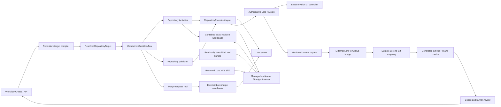

# Lore VCS Integration — System / Feature Design View

**Status:** Proposed  
**Document Class:** Canonical declarative  
**Viewpoint:** System / Feature Design View  
**Updated:** 2026-07-30  
**Audience:** MoonMind contributors, workflow and runtime authors, integration authors, security reviewers, operators, and repository administrators  
**Authority:** Transitional canonical design for Lore-backed repository targets, exact-revision workspaces, agent-visible Lore tooling, repository publication evidence, generated-review handoff, and merge-authority boundaries in MoonMind  
**Owning Surface:** Workflow repository, workspace, and publishing surfaces, with Managed Agents, Omnigent, Security, and integration boundaries  
**Related Docs:** [`MoonMindArchitecture.md`](../MoonMindArchitecture.md), [`WorkflowArchitecture.md`](./WorkflowArchitecture.md), [`WorkflowPublishing.md`](./WorkflowPublishing.md), [`RequiredCapabilities.md`](./RequiredCapabilities.md), [`WorkspaceLocators.md`](./WorkspaceLocators.md), [`ManagedAgentsGit.md`](../ManagedAgents/ManagedAgentsGit.md), [`OmnigentHostMountedTools.md`](../Omnigent/OmnigentHostMountedTools.md), [`SecretsSystem.md`](../Security/SecretsSystem.md), [`SkillSystem.md`](../Steps/SkillSystem.md), [`SkillAndPlanContracts.md`](./SkillAndPlanContracts.md)  
**Related Implementation:** [`execution_contract.py`](../../moonmind/workflows/executions/execution_contract.py), [`moonmind/publish/`](../../moonmind/publish/), [`moonmind/auth/`](../../moonmind/auth/), [`moonmind/workflows/temporal/runtime/`](../../moonmind/workflows/temporal/runtime/), and future repository-provider adapters

> This document defines desired state. Implementation sequencing, migration checklists, Tactics cutover status, and rollout ownership belong in `docs/tmp/`, issues, pull requests, or the external Tactics operational plan.

---

## 1. Purpose

MoonMind currently treats a repository workspace, Git transport, and GitHub review publication as closely coupled concepts. That is valid for a GitHub-authoritative repository, but it is not valid for a project whose authoritative revisions live in Lore and whose GitHub repository is a generated review projection.

This design makes repository authority explicit. It lets MoonMind:

- prepare an exact Lore repository, branch, and revision as a workflow workspace;
- give managed and Omnigent-hosted agents the real, pinned `lore` CLI and provider-aware operating guidance;
- inspect, stage, diff, commit, push, and lock through Lore without treating a generated Git tree as authoritative;
- preserve exact Lore identities in checkpoints, artifacts, CI requests, and publication evidence;
- request a generated GitHub pull request without pushing repository contents to GitHub;
- consume projected GitHub PR, check, and review state as derived review evidence;
- send review fixes back through a Lore workspace as a new Lore revision; and
- defer protected-branch merge authority to the Lore-side coordinator required by the repository's policy.

The initial motivating deployment is Tactics. Its intended authority model is a complete Lore repository containing root `Content/**`, an exact-revision Unreal CI path, and a one-way generated GitHub history that omits root `Content/**` while retaining plugin-owned Content. MoonMind must fit that model rather than creating a competing Lore-to-GitHub bridge or a GitHub-to-Lore synchronization path.

---

## 2. Desired behavior

### 2.1 Authority model

For a Lore-backed repository, MoonMind uses this fixed authority direction:

```text
Workflow author or review-remediation request
        |
        v
MoonMind resolves a Lore repository target
        |
        v
Exact Lore workspace, including paths omitted from GitHub
        |
        +---- agent reads and changes the workspace
        |
        +---- MoonMind or a Lore-aware auto-publish Skill commits and pushes
        v
Authoritative Lore branch and exact Lore revision
        |
        +---- exact-revision CI
        |
        +---- versioned review request to the external Lore bridge
        v
Generated Git branch and GitHub pull request
        |
        +---- GitHub checks, Codex review, and human review
        |
        +---- findings become a new MoonMind run against the Lore branch
        v
Lore-side merge coordinator merges the approved Lore revision
```

The following are invariants:

1. **Lore is the repository-content authority.** A Lore repository id, branch id, and revision signature identify the work being executed and published.
2. **GitHub is a review projection.** A Git commit SHA, GitHub branch, or pull request is derived identity and must be tied back to an exact Lore revision before MoonMind treats it as current.
3. **GitHub never writes repository contents back into Lore.** Review findings are inputs to a new Lore-backed run. The resulting fix is committed to Lore and then projected again.
4. **The authoritative workspace contains the complete Lore revision.** MoonMind must not substitute the filtered GitHub tree for root `Content/**`, generated symlink policy, locks, or other Lore-only state.
5. **A new Lore revision makes earlier branch-scoped CI and review evidence stale.** This applies even when the generated Git tree is unchanged, such as a root-Content-only revision.
6. **Ordinary MoonMind publication cannot merge protected Lore branches.** It may request review or submit a merge request to the external coordinator, but it does not bypass that coordinator.

### 2.2 Primary scenarios

#### Read or analyze an exact revision

MoonMind resolves a Lore repository connection, repository id, branch id, and exact revision signature, materializes that complete revision into a contained workspace, records the prepared identity, and launches the selected runtime without granting repository mutation authority unless the workflow requires it.

#### Implement and publish a branch

MoonMind prepares the selected Lore branch at a recorded expected tip. The agent changes the full workspace. The deterministic publisher scans externally modified files, verifies the workspace and expected remote tip, creates any required final revision, pushes without force, verifies the exact remote revision, and emits provider-neutral publication evidence containing the resulting Lore identity.

#### Request a generated pull request

For `publish.mode = "pr"`, MoonMind publishes a Lore work branch, writes one versioned and idempotent review-request envelope through the repository adapter, and durably waits for the external bridge to confirm that the exact Lore revision maps to the Git SHA at the generated pull-request head. MoonMind does not directly push the generated Git branch or create the GitHub pull request.

#### Remediate GitHub review findings

MoonMind resolves the GitHub pull request through the bridge's mapping data, identifies the authoritative Lore repository, branch, and current revision, fetches authorized review context through GitHub, and runs the remediation against that Lore workspace. The agent may read GitHub review state, but every repository mutation and publication goes to Lore. A later generated Git commit updates the same review projection.

#### Run exact-revision CI

MoonMind or a connected CI controller receives a `LoreRevisionRef`, materializes the complete revision, and attaches results to that exact revision. When a Git mapping exists, the same result may be projected to a GitHub Check Run, but the mapped Git SHA is not the input used to construct the build workspace.

#### Request merge

MoonMind submits a merge request containing the exact Lore source branch tip, target branch, current CI evidence, current projected-review evidence, and idempotency identity to the external Lore merge coordinator. The coordinator remains responsible for locking, freshness checks, dry-run conflict detection, approvals, the Lore merge, and reconciliation of the generated GitHub PR.

### 2.3 Compatibility with the Tactics authority and projection contract

A Tactics-compatible implementation must preserve all of the following:

- root `/Content/**` is present in MoonMind's Lore workspace and exact-revision CI input;
- root `/Content/**` is not expected to appear in the generated GitHub tree;
- plugin-owned `Plugins/**/Content/**` remains ordinary repository content;
- Content-only Lore revisions are publishable and reviewable even when the projected Git commit is tree-identical;
- review summaries distinguish code paths from root Content paths and carry visual or asset-validation evidence when available;
- the generated Git history, parent mapping, symlink reconstruction, fast-forward-only ref policy, and divergence quarantine remain responsibilities of the external projection bridge;
- MoonMind never force-pushes a generated GitHub ref;
- the exact current Lore revision, not merely the current GitHub head, gates CI, review freshness, and merge submission; and
- GitHub merge actions are not authoritative for the Lore-backed repository.

---

## 3. Shape

### 3.1 Component topology



Temporal workflow code carries compact identities and orchestrates retries, waits, and child work. Connection checks, filesystem work, Lore CLI or client calls, network calls, artifact writes, projection-status reads, and merge-request submission occur in Activities or external service boundaries.

### 3.2 Repository connection

Lore access is configured through a first-class `RepositoryConnection`. It is not an LLM Provider Profile and does not overload GitHub credentials.

```ts
type RepositoryProvider = "git" | "lore";

interface RepositoryConnection {
  id: string;
  provider: RepositoryProvider;
  displayName: string;

  // Deployment-owned endpoint and trust configuration.
  endpointRef: string;
  trustBundleRef?: string;

  // SecretRef or another Secrets System reference; never plaintext.
  credentialRef?: string;
  authMode: "authenticated" | "trusted_network_development";

  allowedRepositoryIds?: string[];
  allowedOperations: Array<
    | "read"
    | "write"
    | "branch_write"
    | "lock"
    | "review_request"
    | "merge_request"
  >;

  clientPolicy: {
    pinnedVersion?: string;
    compatibleServerVersions?: string[];
    toolBundleRef?: string;
  };

  projection?: {
    provider: "github";
    repository: string;
    authority: "review_only";
    statusSourceRef: string;
  };
}
```

Rules:

- `endpointRef`, `trustBundleRef`, and `credentialRef` are resolved only at trusted execution boundaries.
- The durable connection contains no private key, token, password, or absolute runtime path.
- A connection with `authMode = "trusted_network_development"` is eligible only under an explicit development or migration-shadow policy. It is never production-ready merely because the server is reachable.
- Repository and operation allowlists are checked before workspace preparation and again before mutation.
- The selected Lore client version is pinned and checked against the connection's server-compatibility policy. `latest` is not a valid durable client identity.
- One deployment may route different connections to different compatible tool-bundle or worker pools while preserving the ordinary executable name `lore`.

### 3.3 Authored and resolved repository targets

New workflow authoring uses a provider-neutral repository field:

```json
{
  "task": {
    "repository": {
      "provider": "lore",
      "connectionRef": "repository-connection:tactics-lore",
      "repository": "Tactics",
      "branch": "main"
    },
    "publish": {
      "mode": "pr"
    }
  }
}
```

The single authored `branch` retains MoonMind's existing semantics:

- for `publish.mode = "pr"`, it is the selected base or target branch and MoonMind creates or resolves a provider-managed Lore work branch;
- for `publish.mode = "branch"`, it is the Lore branch to update;
- for `publish.mode = "none"`, it is the branch used to resolve the workspace unless an exact read-only revision is supplied;
- for review remediation, the trusted projection mapping may resolve an existing Lore work branch instead of generating a new one.

The control plane compiles authoring intent into an immutable, secret-free target:

```ts
interface LoreRevisionRef {
  repositoryId: string;
  branchId: string;
  revisionSignature: string;
  revisionNumber?: number; // display and diagnostics only
}

interface ResolvedRepositoryTarget {
  schemaVersion: "moonmind.repository-target.v1";
  provider: "lore";
  connectionRef: string;

  repository: {
    id: string;
    name: string;
  };

  baseBranch: {
    id: string;
    name: string;
  };

  workBranch?: {
    id: string;
    name: string;
    origin: "generated" | "selected" | "review_mapping";
  };

  preparedRevision: LoreRevisionRef;
  expectedRemoteTip: LoreRevisionRef;

  authority: "authoritative";
  projection?: {
    provider: "github";
    repository: string;
    authority: "review_only";
  };
}
```

The revision signature is the authoritative immutable revision identity. Revision numbers and names are useful display fields but cannot replace ids and signatures in execution, retry, CI, or publication contracts.

Legacy `repository` plus `task.git.branch` inputs normalize to a `provider = "git"` target. New Lore submissions do not populate `task.git`, and no Lore implementation should smuggle a Lore URL into a field whose semantics remain Git-specific.

### 3.4 Repository provider adapter

MoonMind introduces one provider boundary rather than scattering `if lore` branches through workflow, runtime, and publishing code.

```ts
interface RepositoryProviderAdapter {
  resolveTarget(authoredTarget): ResolvedRepositoryTarget;
  checkReadiness(target, requiredCapabilities): RepositoryReadiness;
  prepareWorkspace(target, workspaceLocator): PreparedRepositoryWorkspace;
  inspectWorkspace(workspace, scanMode): RepositoryWorkspaceStatus;
  createOrResolveWorkBranch(target, branchIntent): ResolvedRepositoryTarget;
  stageChanges(workspace, selection): RepositoryWorkspaceStatus;
  commit(workspace, commitIntent, idempotencyKey): RepositoryMutationResult;
  push(workspace, expectedRemoteTip, idempotencyKey): RepositoryMutationResult;
  verifyRemoteTip(target, expectedRevision): RepositoryVerification;
  requestReview(target, request, idempotencyKey): ReviewRequestResult;
  captureCheckpoint(workspace): RepositoryCheckpoint;
}
```

The Lore adapter may initially invoke the pinned CLI in a machine-readable mode through bounded subprocess calls. It must validate structured output against MoonMind-owned schemas and must not parse human-oriented prose as durable state. A later native Lore library binding may replace subprocess internals without changing workflow or publication contracts.

The adapter does not expose a general `merge` method to ordinary repository publication. Protected merge is a separate coordinator boundary.

### 3.5 Workspace preparation and checkpoints

A prepared Lore workspace has these properties:

- it is materialized from the exact resolved Lore revision;
- it includes every path in that revision, including paths absent from the GitHub projection;
- it lives under a normal MoonMind `workspaceLocator`, never an authored absolute path;
- it records the repository id, branch id, revision signature, expected remote tip, client version, and connection id;
- it has no unrelated dirty, staged, or locked state when the run begins;
- it is containment-checked before being mounted into a runtime;
- its `.lore` state is workspace-scoped and is not shared across unrelated runs; and
- repository-scoped Skills are resolved from the authoritative Lore workspace.

Lore tracks workspace state differently from Git. When an agent or build tool changes files outside Lore itself, the publisher must perform the pinned client's external-change scan before status, staging, commit, or no-change conclusions. A clean result without a successful required scan is not publication evidence.

A resumable repository checkpoint contains:

```ts
interface LoreRepositoryCheckpoint {
  schemaVersion: "moonmind.repository-checkpoint.lore.v1";
  baseRevision: LoreRevisionRef;
  expectedRemoteTip: LoreRevisionRef;
  workspaceCheckpointRef: string;
  changedPathsRef?: string;
  stagedPathsRef?: string;
  workspaceDigest: string;
}
```

A clean committed checkpoint may restore directly from its exact Lore revision. A checkpoint with uncommitted work restores the exact base revision first and then applies the MoonMind checkpoint artifact with the normal digest, containment, and symlink checks. Resume fails closed when the source branch moved incompatibly, the checkpoint base cannot be reproduced, or the restored state does not match its digest.

### 3.6 Required capabilities

Lore support uses the existing `requiredCapabilities: string[]` contract. It does not create a second capability system.

| Capability | Meaning |
| --- | --- |
| `lore` | A compatible pinned Lore client, repository connection, trust configuration, and required local workspace support are ready. |
| `repo.read` | The selected provider may resolve and prepare the requested repository state. |
| `repo.write` | The trusted publication boundary may create a repository revision and push it. |
| `repo.branch.write` | The workflow may create, select, or advance a non-protected work branch. |
| `repo.lock` | Explicit Lore lock operations are authorized and terminal cleanup can release run-owned locks. |
| `repo.review.request` | The workflow may write the versioned review-request handoff and read its external projection status. |
| `repo.merge.request` | The workflow may submit a request to the external merge coordinator. It does not grant direct merge authority. |
| `gh` | GitHub PR, review, or check access is required. For a Lore-backed repository this is read/review-side access unless a separate GitHub-owned side effect is explicitly authorized. |

Derivation rules:

- any Lore-backed workspace contributes `lore` and `repo.read`;
- `publish.mode = "branch"` contributes `repo.write` and `repo.branch.write`;
- `publish.mode = "pr"` contributes `repo.write`, `repo.branch.write`, and `repo.review.request`;
- a Skill that uses Lore locks contributes `repo.lock`;
- merge orchestration contributes `repo.merge.request`;
- reading projected GitHub review state contributes `gh`;
- `git` remains the compatibility capability for Git-provider execution and is not silently used as an alias for Lore.

Readiness is target-specific. The mere presence of `/opt/moonmind-tools/bin/lore` does not satisfy `lore`; the selected connection, version policy, TLS trust, authentication policy, repository authorization, and workspace preparation path must also pass.

### 3.7 Agent-visible Lore tooling

The canonical runtime tool is the real Lore CLI, mounted through the existing MoonMind tool-bundle design:

```text
/opt/moonmind-tools/
  manifest.json
  bin/
    gh
    lore
```

The bundle contract requires:

- a deployment-selected pinned Lore client version;
- an approved platform artifact and expected SHA-256;
- a bounded non-interactive version probe;
- atomic publication of a complete bundle;
- read-only mounts into hosts and runners;
- ordinary and login-shell `PATH` visibility;
- no runtime download, package installation, self-update, or plugin installation; and
- routing to a compatible bundle when different Lore connections require different client versions.

The runtime receives a run-private Lore configuration and cache root. It does not inherit an operator's global Lore home or another run's authentication state. Trust material is mounted read-only. Raw credentials are resolved only at the launch or trusted repository-Activity boundary and remain outside workflow payloads, Temporal history, artifacts, prompts, command transcripts, and shared tool volumes.

For MoonMind-managed `branch` and `pr` publication, the preferred privilege split is:

1. MoonMind prepares the remote-backed workspace through the trusted adapter.
2. The agent receives local repository operations required to inspect and modify the workspace.
3. The agent does not receive a reusable remote-write credential.
4. After the agent exits, the trusted publisher receives the short-lived write credential, performs final scan and validation, commits any remaining intended changes, pushes, and verifies the remote tip.

A Lore-aware `auto` Skill may receive remote mutation capability only on a run-dedicated or equivalently isolated runtime, only when its resolved Skill content explicitly declares Lore provider support, and only for the operations admitted by policy.

### 3.8 Lore VCS Agent Skill

MoonMind provides a portable `lore-vcs` Agent Skill alongside the executable. The Skill is provider guidance, not an executable Tool and not a substitute for the CLI.

Its resolved content teaches agents to:

- identify the repository, branch, prepared revision, expected remote tip, and publish owner from MoonMind's workspace metadata;
- run a full external-change scan when tools edited files outside Lore;
- inspect status and diff before and after changes;
- distinguish dirty, staged, committed-local, pushed, and projected-review state;
- use branch ids and revision signatures from trusted metadata rather than guessing from display names;
- avoid direct work on protected branches;
- avoid force, history rewriting, or generated GitHub ref mutation;
- acquire locks only when the run declares `repo.lock`;
- release run-owned locks on completion or hand them to trusted terminal cleanup;
- avoid committing generated secrets, credentials, private certificates, caches, or MoonMind runtime artifacts;
- leave final remote publication to MoonMind for managed `branch` and `pr` modes;
- produce provider-aware publish evidence for `auto` mode; and
- treat a GitHub PR URL as a review locator, not as the repository write target.

The Skill may document ordinary Lore command families such as status, diff, branch, revision/history, stage, commit, push, and lock. It must be tested against the exact pinned client version represented by its resolved content and tool-bundle evidence.

### 3.9 Bounded executable Tools

CLI access is appropriate for open-ended repository work inside an agent run. High-authority or cross-system actions use typed Tools or trusted Activities.

The desired Tool surface is:

| Tool | Purpose | Authority boundary |
| --- | --- | --- |
| `repository.inspect` | Return normalized repository, branch, revision, status, changed-path, and lock evidence. | Read-only provider adapter. |
| `repository.request_review` | Write an idempotent Lore review-request envelope for the exact published revision. | Lore branch metadata or another repository-approved handoff. |
| `repository.projection_status` | Resolve the exact Lore-to-Git mapping, generated PR, and current projected checks. | Read-only bridge or mapping API. |
| `repository.lock.acquire` / `repository.lock.release` | Perform policy-scoped lock operations with run ownership and cleanup evidence. | Lore adapter plus lock policy. |
| `repository.submit_merge_request` | Submit exact revision, CI, and review evidence to the Lore merge coordinator. | Coordinator API; never a direct branch merge. |

These Tools use typed schemas, SecretRefs, policy checks, idempotency keys, and artifact-backed large outputs. They do not accept raw shell fragments, arbitrary endpoints, raw credentials, or absolute workspace paths.

The ordinary agent must not receive a generic `lore branch merge` authority for protected targets merely because the CLI contains that command.

### 3.10 Publish modes

MoonMind preserves the product-level publish modes while compiling them through the selected repository provider.

| Mode | Lore-backed behavior |
| --- | --- |
| `none` | Prepare and run in the Lore workspace. Do not create or push a revision after the agent finishes. Checkpoint or artifact retention is separate from publication. |
| `branch` | Publish and verify the exact Lore work-branch revision. Do not create or update a GitHub PR. |
| `pr` | Publish the Lore work branch, request projection, and wait for a generated PR whose head maps to the exact Lore revision. |
| `auto` | A resolved Lore-aware Skill owns allowed repository side effects and must emit provider-aware evidence. Unsupported Git-only Skills fail before launch. |

For managed `branch` and `pr` modes, final publication is deterministic infrastructure work:

1. scan for externally changed files;
2. capture pre-publication status and changed paths;
3. reject unexpected contamination, protected-target publication, or an incompatible remote-tip move;
4. stage only the intended workspace changes;
5. create a final revision when necessary;
6. push without force using the expected remote tip;
7. query the remote branch and require an exact revision match; and
8. emit immutable publication evidence.

A no-change result is valid only when the prepared or locally committed revision is verified as the exact remote branch tip.

### 3.11 Publication evidence

Provider-neutral publication evidence replaces assumptions that every repository has a Git SHA.

```json
{
  "schemaVersion": "moonmind.publish.repository.v1",
  "mode": "pr",
  "owner": "moonmind",
  "provider": "lore",
  "status": "verified",
  "action": "commit_push_review_request",
  "repository": {
    "id": "<lore-repository-id>",
    "name": "Tactics"
  },
  "branch": {
    "id": "<lore-work-branch-id>",
    "name": "<generated-work-branch>"
  },
  "baseRevision": {
    "repositoryId": "<lore-repository-id>",
    "branchId": "<lore-work-branch-id>",
    "revisionSignature": "<prepared-signature>"
  },
  "publishedRevision": {
    "repositoryId": "<lore-repository-id>",
    "branchId": "<lore-work-branch-id>",
    "revisionSignature": "<published-signature>"
  },
  "remoteVerification": {
    "verified": true,
    "observedRevisionSignature": "<published-signature>"
  },
  "changes": {
    "changedPathsRef": "art:sha256:...",
    "rootContentChanged": true,
    "contentOnly": false
  },
  "reviewRequest": {
    "requestId": "<idempotency-id>",
    "status": "requested",
    "revisionSignature": "<published-signature>"
  },
  "projection": {
    "status": "pending",
    "gitCommitSha": null,
    "pullRequestUrl": null
  }
}
```

Rules:

- `publishedRevision.revisionSignature` and exact remote verification are required for successful Lore publication.
- Git fields remain absent until the bridge confirms a mapping.
- Projection lag does not invalidate the verified Lore push, but `publish.mode = "pr"` does not report `PUBLISHED_PR` until the exact generated PR head is confirmed.
- While projection is pending, the workflow uses a truthful `awaiting_external` or `review_requested` state under policy rather than claiming a PR exists.
- A Content-only revision is not converted to `NO_COMMIT` merely because the generated Git tree or PR diff is empty.
- Evidence records the exact selected connection and tool/client evidence through safe refs, but never embeds credentials or private trust material.

`moonmind.publish.auto.v1` remains valid for existing Git-only auto Skills during compatibility. A provider-aware successor must carry the same core terminal statuses while adding `provider`, provider-specific revision identity, and remote verification. A Skill must not fill Git fields with Lore signatures or otherwise fake schema compatibility.

### 3.12 Review-request handoff

The baseline Lore handoff uses one namespaced branch-metadata value so the external bridge observes an atomic, versioned request rather than a partially updated set of keys:

```text
moonmind.review.request
```

Its value is a bounded JSON string:

```json
{
  "schemaVersion": "moonmind.lore-review-request.v1",
  "requestId": "<stable-idempotency-id>",
  "workflowExecutionId": "<workflow-id>",
  "workflowRunId": "<run-id>",
  "repositoryId": "<lore-repository-id>",
  "branchId": "<lore-work-branch-id>",
  "revisionSignature": "<exact-published-revision>",
  "baseBranchId": "<lore-target-branch-id>",
  "title": "<bounded-review-title>",
  "summary": "<bounded-review-summary>",
  "rootContentChanged": true
}
```

The request contains no credentials, raw prompts, private artifact contents, or host paths. The request id and revision signature are the deduplication key. Rewriting the same request is idempotent; advancing the branch requires a new exact revision request.

A repository may select another handoff mechanism through its connection policy, but it must preserve the same semantics: exact revision, base branch, idempotency, no content write-back, and externally observable status.

The bridge owns its durable queue, reconciliation, mapping database, generated commits, generated refs, and GitHub App behavior. MoonMind consumes bridge status; it does not infer successful projection from the mere presence of metadata.

### 3.13 Projection, GitHub review, and remediation

A confirmed projection has this shape:

```ts
interface LoreProjectionRef {
  loreRevision: LoreRevisionRef;
  projectionVersion: string;
  gitRepository: string;
  gitCommitSha: string;
  githubPullRequest?: {
    number: number;
    url: string;
    headSha: string;
    baseRef: string;
  };
  status: "pending" | "mapped" | "diverged" | "failed";
}
```

MoonMind treats the mapping as current only when:

- the mapped Lore revision equals the current Lore work-branch tip;
- the GitHub PR head equals the mapped Git commit;
- the mapping is for the active projection policy version; and
- the bridge has not marked the branch divergent or quarantined.

GitHub access on a Lore-backed run is constrained:

- `gh` or the GitHub API may read the generated PR, reviews, threads, comments, and checks;
- MoonMind may post a semantic response or review-status comment when separately authorized;
- MoonMind and its agents do not push the generated branch;
- MoonMind does not use GitHub's merge endpoint as the repository merge action;
- a GitHub suggestion or review fix is applied in the Lore workspace and published as a new Lore revision; and
- the final Codex-review trigger remains coordinated with current exact-revision CI and projection state, rather than firing on every intermediate revision.

Existing Skills such as `pr-resolver`, `fix-comments`, `fix-ci`, and `fix-merge-conflicts` are not assumed to support Lore merely because `gh` and `lore` are installed. Resolved Skill metadata declares supported repository providers and publication semantics. A Git-only Skill blocks before launch on a Lore target. A provider-aware remediation Skill may read GitHub but must write and verify Lore evidence.

### 3.14 Exact-revision CI

The Lore CI request uses immutable identity:

```json
{
  "schemaVersion": "moonmind.repository-ci-request.v1",
  "provider": "lore",
  "repositoryId": "<id>",
  "branchId": "<id>",
  "revisionSignature": "<signature>",
  "changedPathsRef": "art:sha256:...",
  "correlationId": "<workflow:run:step>",
  "idempotencyKey": "<stable-request-key>"
}
```

The CI controller must:

- synchronize the exact complete Lore revision rather than cloning the GitHub projection;
- preserve root Content and other paths excluded from GitHub;
- report the observed repository, branch, and revision in terminal evidence;
- publish artifacts and diagnostics under that exact identity;
- mark an earlier branch result stale when the branch advances;
- attach the result to the mapped Git SHA when available without changing the build input; and
- treat Content-only revisions as new CI inputs.

MoonMind may orchestrate or await this controller, but Tactics-specific Unreal build planning, asset validation, visual proof, packaging, and GHCR behavior remain owned by the Tactics CI design.

### 3.15 Merge-coordinator boundary

`repository.submit_merge_request` sends a compact request containing:

- source repository id, branch id, and exact source revision signature;
- target branch id and the target revision observed when readiness was evaluated;
- exact current Lore CI evidence;
- exact current projection and GitHub review evidence;
- required human-approval evidence;
- requester and idempotency identity; and
- safe artifact refs for diagnostics.

It does not execute the merge itself.

The external coordinator is authoritative for:

- per-target-branch serialization;
- current-tip and mapping validation;
- CI and review freshness;
- dry-run Lore conflict checks, including Content conflicts;
- protected-branch policy;
- the Lore merge revision;
- projection of the resulting merge parents;
- GitHub PR reconciliation and generated-branch cleanup; and
- fault handling without force-pushing.

A successful GitHub merge without the corresponding coordinator-confirmed Lore merge is not repository success and must be shown as an authority violation.

### 3.16 Security and credential materialization

Lore credentials follow the Secrets System's reference-over-value rule.

The trusted repository boundary may receive:

- the resolved server endpoint;
- the pinned trust bundle;
- the selected human or service identity;
- a short-lived token or run-private auth materialization;
- the exact allowed repository ids and operations; and
- the expected client/server compatibility policy.

The agent runtime receives only what its execution mode needs:

- read-only runs receive no write credential;
- managed `branch` and `pr` runs normally receive no remote-write credential;
- `auto` runs receive narrowly scoped mutation material only when the exact resolved Skill and host isolation permit it;
- merge-coordinator credentials are never materialized into an ordinary agent shell; and
- GitHub credentials do not imply Lore permissions, nor do Lore credentials imply GitHub permissions.

The design does not standardize on placing a raw Lore token in workflow-authored CLI arguments. A non-interactive auth bootstrap must be verified against the pinned client and must keep the secret out of process listings visible to unrelated workloads, logs, histories, shell history, and artifacts. Until a safe materialization path is verified, authenticated CLI mutation inside the agent runtime remains unavailable; trusted adapter-side mutation may still use a narrower client boundary.

Connection readiness includes endpoint reachability, TLS validation, authentication state, repository authorization, operation authorization, client compatibility, tool checksum evidence, and a bounded repository probe. Failure is explicit; MoonMind does not silently try another endpoint, identity, trust mode, or repository provider.

### 3.17 Concurrency, idempotency, and recovery

Every mutation uses a stable idempotency key derived from workflow, run, step, publication owner, and logical operation.

The publisher records:

- the prepared Lore revision;
- the expected remote branch tip;
- any local committed revision;
- the exact pushed revision;
- the remotely observed tip; and
- the review-request id.

Retry behavior:

- when the exact revision is already the verified remote tip, return the prior successful result;
- when a prior review request for the same request id and revision already exists, return the prior request result;
- when the remote branch moved to an unexpected revision, block with a branch-moved diagnostic;
- never repair branch movement with force;
- never create an extra revision solely because an Activity retried after a lost response;
- do not infer failure from a lost notification when direct reconciliation can prove the remote state; and
- do not infer success from local state when remote verification is unavailable.

Notifications are advisory wake-ups. Any MoonMind consumer that waits for projection, CI, or merge state must also reconcile by exact ids and revision signatures because notification delivery is not durable workflow state.

### 3.18 Diagnostics and artifacts

Stable blocker and failure codes include:

| Code | Meaning |
| --- | --- |
| `REPOSITORY_PROVIDER_UNSUPPORTED` | The runtime, Skill, or publisher does not support the selected provider. |
| `LORE_CLIENT_UNAVAILABLE` | The pinned client or required tool-bundle evidence is absent. |
| `LORE_CONNECTION_NOT_READY` | Endpoint, TLS, authentication, version, or authorization readiness failed. |
| `LORE_REVISION_NOT_FOUND` | The exact prepared or requested revision cannot be resolved. |
| `LORE_WORKSPACE_SCAN_FAILED` | Required external-change scanning did not complete successfully. |
| `LORE_BRANCH_MOVED` | The remote branch no longer equals the expected tip. |
| `LORE_PUSH_NOT_VERIFIED` | The remote tip could not be proven equal to the published revision. |
| `LORE_REVIEW_REQUEST_FAILED` | The versioned review handoff was not written or verified. |
| `LORE_PROJECTION_PENDING` | Lore publication succeeded but the exact Git/PR mapping is not yet confirmed. |
| `LORE_PROJECTION_DIVERGED` | The bridge quarantined or rejected the generated ref. |
| `LORE_MERGE_COORDINATOR_REQUIRED` | A direct protected merge was attempted outside the coordinator. |

Representative immutable artifacts are:

- `repository_target.json`;
- `repository_readiness.json`;
- `repository_status_before.json`;
- `repository_status_after.json`;
- `repository_changed_paths.json`;
- `repository_checkpoint.json`;
- `repository_publish_result.json`;
- `repository_review_request.json`;
- `repository_projection_status.json`;
- `repository_ci_status.json`;
- `repository_merge_request.json`; and
- bounded, redacted command or adapter diagnostics.

The UI clearly labels:

- **Authoritative repository:** Lore;
- Lore repository, branch, and revision identities;
- current remote verification;
- root Content change presence;
- generated Git commit and GitHub PR as projection fields;
- projection, CI, review, and merge freshness against the current Lore revision; and
- whether the workflow is waiting on an external bridge, CI controller, or merge coordinator.

### 3.19 Git compatibility and document ownership

This design is additive.

- Existing Git/GitHub repositories continue to use the Git provider and current GitHub credential path.
- Legacy `task.git.branch` remains a compatibility input for Git targets during migration.
- `ManagedAgentsGit.md` remains the Git-provider authentication and fast-path document; it does not govern Lore credentials.
- `WorkflowPublishing.md` remains authoritative for current publish modes, but its Git-specific implementation language must be promoted into provider-specific behavior as this design is implemented.
- `RequiredCapabilities.md` remains authoritative for capability normalization and readiness; this design supplies the Lore and provider-neutral capability semantics that must be incorporated there.
- `OmnigentHostMountedTools.md` remains authoritative for how the `lore` executable is pinned, verified, mounted, and placed on `PATH`.
- `WorkspaceLocators.md` remains authoritative for durable workspace identity and containment.
- The Secrets System remains authoritative for SecretRefs and resolution.
- This design remains the transitional authority for Lore integration until implemented content is promoted into those durable architecture, module, and contract documents.

---

## 4. Non-goals

### NON-GOAL-001 MoonMind is not the Lore-to-Git projection worker

MoonMind does not generate the one-Git-commit-per-Lore-revision history, own the bare Git mirror, reconstruct Tactics projection symlinks, enforce root-Content filtering, or force-reconcile generated refs. It integrates with the external bridge through exact requests and mapping status.

### NON-GOAL-002 MoonMind does not create GitHub-to-Lore synchronization

No webhook, PR action, merge button, Git push, or agent operation writes projected GitHub repository content back into Lore.

### NON-GOAL-003 MoonMind does not replace the Lore merge coordinator

Ordinary workflows may submit merge requests. They do not acquire protected-main authority, bypass current CI or review checks, or perform a direct protected merge.

### NON-GOAL-004 MoonMind does not harden or operate the Lore server

Server authentication, CA lifecycle, firewalling, stable addressing, off-device backup, restore drills, capacity monitoring, server upgrades, and public exposure policy remain deployment responsibilities.

### NON-GOAL-005 MoonMind does not use a filtered Git clone as a performance substitute

A generated GitHub checkout is not an acceptable workspace for a Lore-authoritative run, even when the immediate issue appears code-only.

### NON-GOAL-006 MoonMind does not maintain a custom Omnigent host solely for Lore

The pinned `lore` executable and its Skill use the standard read-only tool and Skill projection boundaries. A derived host image requires separate justification.

### NON-GOAL-007 MoonMind does not infer structured state from human CLI prose

Durable adapter state comes from validated machine-readable output, a native binding, or a typed external API.

### NON-GOAL-008 Tool presence does not imply authorization

Installing `lore` in the tool bundle grants no repository, write, lock, review, or merge permission.

---

## 5. Constraints & decisions

### AUTHORITY-001 Lore identity is canonical

Every Lore-backed workspace, checkpoint, CI request, publish result, review request, and merge request carries the Lore repository id, branch id, and exact revision signature. Derived Git identities never replace them.

### AUTHORITY-002 Projection is one-way

MoonMind can read GitHub review state and can send non-content review interactions when authorized. All repository-content changes flow through Lore.

### CONTRACT-001 Repository targets are provider-discriminated

New contracts use `task.repository.provider`. Lore details do not enter `task.git`, and Git-specific code is reached only through the Git adapter.

### CONTRACT-002 One authored branch remains the product model

The existing single-branch authoring model remains. Provider compilation resolves separate base and work branches where PR publication requires them.

### WORKSPACE-001 Exact revision and complete tree

The prepared workspace must reproduce the exact complete Lore revision. Missing root Content or unverified substitutions are hard failures.

### WORKSPACE-002 External changes are scanned

A required Lore external-change scan precedes status conclusions, final staging, publication, and no-change evidence when non-Lore tools may have modified files.

### TOOLING-001 Real pinned client

Agents receive the real `lore` executable at its ordinary name from a versioned, checksum-verified, read-only tool bundle.

### TOOLING-002 Portable provider Skill

Agent behavior lives in resolved `lore-vcs` Skill content. MoonMind runtime code supplies isolation, credentials, workspace preparation, and evidence validation rather than duplicating the Skill's semantic procedure.

### SECURITY-001 Least-privilege split

Workspace preparation, agent-local work, trusted publication, GitHub review access, and merge coordination are separate authorization boundaries.

### SECURITY-002 No raw secrets in durable state

Lore credentials and trust secrets are referenced and resolved late. They do not enter workflow payloads, artifacts, repository metadata, prompts, or generated Git history.

### PUBLISH-001 Remote revision verification

A Lore publish is successful only when the exact published revision is observed at the intended remote branch tip.

### PUBLISH-002 No force-based recovery

Unexpected remote movement blocks publication. Recovery requires explicit synchronization, merge, rebase-equivalent provider behavior, or a new branch under policy; it never force-pushes.

### REVIEW-001 PR mode confirms an exact projection

`publish.mode = "pr"` completes as a published PR only after the generated PR head is confirmed to map to the exact Lore revision. Request submission alone is labeled truthfully.

### REVIEW-002 Content-only revisions remain first-class

An empty projected diff does not erase a Lore revision, its CI need, its root Content changes, or its review evidence.

### SKILL-001 Provider support is explicit

A Skill with repository side effects declares supported repository providers and evidence schemas. Git-only auto-publish Skills fail before running on Lore.

### CI-001 CI is keyed by Lore revision

The exact Lore revision is the CI input and freshness key. GitHub checks are projections of that result.

### MERGE-001 Protected merge is coordinator-only

MoonMind's ordinary repository adapter has no protected merge operation. The merge-request Tool targets the external coordinator.

### QUALITY-001 Replay-safe orchestration

Workflow history contains compact, secret-free ids and refs. External calls and filesystem operations occur in retry-safe Activities with explicit idempotency.

### QUALITY-002 Reconciliation over notification trust

Notification consumers use notifications as wake-ups and reconcile exact current state before advancing workflow status.

### QUALITY-003 Provider-neutral observability

Operator views and artifacts show authoritative and projected identities separately and never label a generated Git state as the Lore workspace state.

### QUALITY-004 Client/server compatibility is explicit

Every execution records safe evidence of the selected client/tool-bundle policy. Upgrades are deliberate and testable; mutable `latest` selection is prohibited.

### Conformance cases

An implementation conforms only when it proves at least these cases:

1. exact branch and exact historical-revision checkout;
2. full-tree preparation with root Content present;
3. external file modification followed by scan, status, stage, commit, push, and exact remote verification;
4. no-change remote verification;
5. branch creation and branch-tip race rejection;
6. retry after a lost commit or push response without duplicate revision creation;
7. Content-only revision publication and pending/generated PR handling;
8. generated PR mapping to the exact Lore revision;
9. GitHub review remediation that writes only to Lore;
10. blocked direct GitHub branch mutation;
11. blocked direct protected Lore merge;
12. merge-request submission to the coordinator with current CI and review evidence;
13. checkpoint restore from a clean Lore revision;
14. checkpoint restore with uncommitted workspace state;
15. auth-disabled connection rejected outside an explicit development or migration-shadow policy;
16. credential redaction and absence from Temporal history and artifacts;
17. incompatible client/server version rejection; and
18. projection divergence surfaced without force-based repair.

---

## 6. External protocol basis

The provider adapter and `lore-vcs` Skill should be verified against the pinned version of Epic's Lore documentation and command surface, including:

- [Lore Quickstart](https://lore.epicgames.com/docs/quickstart)
- [Lore CLI command reference](https://lore.epicgames.com/docs/cli/command-reference)
- [Lore configuration reference](https://lore.epicgames.com/docs/cli/configuration)
- [Lore system design](https://lore.epicgames.com/docs/learn/system-design)
- [Lore FAQ and language bindings](https://lore.epicgames.com/docs/faq)

Documentation for a newer or nightly client is not evidence that the deployment's pinned client supports the same flags, output shapes, authentication flow, or metadata behavior. Conformance tests and captured tool-bundle evidence govern the supported MoonMind integration.
