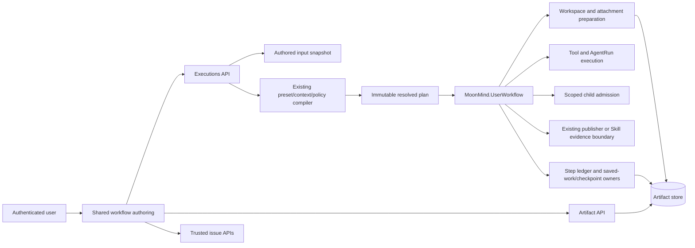

# Workflow Architecture (Control Plane)

**Document Class:** Canonical declarative  
**Viewpoint:** Module Architecture View  
**Status:** Draft  
**Owners:** MoonMind Engineering  
**Updated:** 2026-09-06  
**Audience:** Workflow, API, runtime, recovery, and dashboard contributors  
**Authority:** Workflow control-plane component responsibilities, authored snapshots, compilation, attachment targeting, and execution/recovery handoffs. Providing subsystem documents own their detailed schemas and policy contracts.  
**Owning Surface:** Workflow admission/control plane and MoonMind.UserWorkflow integration  
**Related Docs:** [Workflow Publishing](WorkflowPublishing.md), [Workflow Presets System](WorkflowPresetsSystem.md), [Create Page](../UI/CreatePage.md), [Input Schema Guidance](../Steps/InputSchemaGuidance.md), [Repository Access and Workspace Design](../RepositoryAccessAndWorkspaceDesign.md), [Lore VCS Integration Design](LoreVcsIntegrationDesign.md)  
**Related Implementation:** `moonmind/workflows/executions/`, `moonmind/services/skill_step_inputs.py`, and `MoonMind.UserWorkflow`.

## 1. Purpose

MoonMind's control plane translates workflow objectives, typed steps, target-scoped attachments, runtime/profile selection, repository/source context, publication intent, presets, issue context, and dependencies into durable Temporal execution.

The user authors repository/source context, one applicable branch, and publishing once for a workflow or batch. The compiler binds that context into step/child contracts without exposing duplicate settings. This is a long-term target, not a claim that current seed, API, or runtime implementations already conform.

Detailed page behavior belongs in `docs/UI/CreatePage.md`; publication semantics in `docs/Workflows/WorkflowPublishing.md`; source/save authority in `docs/RepositoryAccessAndWorkspaceDesign.md`; context binding in `docs/Steps/InputSchemaGuidance.md`; attachments in `docs/Workflows/ImageSystem.md`; and readiness in `docs/Workflows/RequiredCapabilities.md`.

## 2. System snapshot

MoonMind.UserWorkflow is the normal durable execution type. The control plane supports step-authored workflows, artifact-backed large/binary inputs, reusable presets, Runtime/Profile intent, and policy-checked pause/resume/cancel/approve/rerun actions.

Image attachments have explicit objective or step targets. Presets are recursively compiled authoring objects, not live runtime catalog instructions. Authored input snapshots preserve task text, attachments, selected definition evidence, context, policy, and flattened-step provenance.

The same architecture distinguishes full retry from failed-step recovery. Full retry starts the task again with confirmed or edited inputs under fresh admission. Failed-step Resume preserves original input and completed progress only when a durable ledger/checkpoint can restore it faithfully.

Publication adds no second orchestrator: the existing compiler resolves one scope intent; UserWorkflow owns orchestration/verdict; trusted publishers or resolved Skills own declared effects; artifact/save owners preserve useful work independently of publication.

## 3. Core architectural principles

### 3.1 Workflow-first control plane

Users author workflow objectives and task-specific steps. Internal effect roles, activities, credentials, and worker placement are compiled concerns. Runtime selection stays under its existing simple Runtime/Profile surface.

### 3.2 Artifact-first binary handling

Binary inputs and large outputs are artifacts referenced by compact IDs. Bytes are not embedded in Temporal histories or instruction text.

### 3.3 Explicit target binding

Every attachment targets the workflow objective or a specific stable step. This binding survives create, reorder, preset expansion, edit, rerun, preparation, prompt composition, and detail display. Storage paths alone do not establish target meaning.

Repository/branch bindings are likewise semantic, not name-based copying. Existing-PR targets can derive their head/base; distinct source/destination roles require an explicitly supported and authorized contract.

### 3.4 Durable reconstruction

The authoritative authored snapshot, not a lossy output projection, reconstructs input. Preserve authored values separately from defaults, context-bound projections, and compiled execution modes. A coordinator's local None cannot replace the batch's authored PR intent.

### 3.5 Separation of text from structured inputs

Instructions remain text, images remain structured references, and generated image context is a secondary artifact. Prompts explain authority but do not grant it, override explicit policy, or replace backend enforcement.

### 3.6 Failed-step resume is not full rerun

Resume retries the failed step with original inputs and proven completed prior work. It does not open a form or silently change instructions, steps, attachments, runtime, publishing, branches, dependencies, or definition evidence. Missing/inconsistent restoration makes Resume unavailable or explicitly blocked, not an implicit full rerun.

### 3.7 One authored publication scope

One selection governs a workflow and its declared children. User-facing Auto/default resolves declared workflow behavior. Compiled Skill-owned Auto remains the agent-owned execution protocol, consuming the same provider-neutral publication evidence as managed publishing. Explicit None is never promoted in new authoring.

The scope's intent survives every coordinator. The coordinator may have no deliverable and compile to local None, while implementation children publish PRs and resolver children execute Skill-owned Auto. Independent dependency links do not establish inheritance. One policy does not require one final push or identical actions everywhere; supported compositions declare staged effects and one owner per effect.

The retired `workflow.default_publish_mode` and its environment aliases are not a second omission/default path. WorkflowPublishing and SettingsSystem section 10.6 own removal and preservation of configured operator intent. Unknown old effective origin requires review rather than silent adoption of a different default.

## 4. High-level architecture



The control plane owns intent, validation, selected definitions, bindings, and durable snapshots. Execution owns lifecycle and effect orchestration over admitted contracts. Runtime adapters realize provider mechanics. Portable Skills retain semantics. No new publication database, schema-expression engine, or competing coordinator is introduced.

## 5. Control-plane responsibilities

### 5.1 Authoring and validation

Render one workflow repository/source and applicable branch control, one publishing selector, Runtime/Profile, task-specific step fields, issue context, dependencies, and attachments. Exact visual placement belongs to CreatePage. Equivalent context-bound Skill/Preset fields have read-only explanations, not additional editors in Advanced or raw JSON.

Validate types, target roles, current access, policy, definition compatibility, and known child/handoff requirements before effects. Static conflicts cannot be deferred until after issue creation or parent launch merely because a helper will eventually submit children.

### 5.2 Artifact upload orchestration

Create upload intents, upload/finalize through MoonMind APIs, reject incomplete uploads, and submit only authorized structured refs. The browser does not acquire long-lived object-store credentials.

### 5.3 Workflow contract normalization

Preserve task.inputAttachments and task.steps[].inputAttachments, stable step identity/order, selected runtime, the single source/branch/publication intent, task-specific inputs, issue provenance, authored preset bindings, flattened ancestry, and detachment state.

Context bindings resolve before required-input validation and expansion. Compiler-owned projected arguments remain separate from authored input. New callers cannot submit duplicates or forge resolved provenance. Historical equivalent copies may collapse only under the versioned decoder.

### 5.4 Preset compilation

Load/pin definition evidence, validate safe binding/default rules and include trees, recursively expand Presets, flatten concrete Tool/Skill steps, resolve the one publication scope, validate required output/code handoffs, and derive per-execution capabilities/effect owners. The resulting plan executes without a live preset lookup.

Included assessment/read-only defaults do not disable the root's candidate publication. A coordinator role does not erase child intent. A child does not consult a later catalog default to reinterpret ancestor Auto. Incompatible independent publishers require a compatible declared composition or separate workflows.

### 5.5 Snapshot durability

Persist authored intent, input origins, selected definitions/content digests, include-tree/provenance, attachment targets, detachment state, and final submitted order. Store resolved scope/target/effect evidence in the existing plan/artifact boundary. Neither projection overwrites the other.

### 5.6 User-facing reads

Expose authorized previews/downloads and safe target/definition/policy explanations. Show the authored selection, local compiled behavior, and actual results separately. Batch enqueue success is not child publication success. Unknown evidence remains unavailable, not guessed from today's defaults.

### 5.7 Failed-workflow recovery orchestration

Expose only backend-supported actions. Exact full retry, edited full retry through the shared form, and failed-step Resume remain distinct intentions; labels/routes and accepted lifecycle behavior are owned by WorkflowEditingSystem and the run-history contract.

Resume requires the authoritative original snapshot; exact source workflowId/runId; the failed-step ledger; durable completed-step output refs; workspace/branch/commit or equivalent checkpoint immediately before the failed step; and matching plan identity. Missing, stale, unauthorized, or inconsistent evidence blocks before the step executes.

An active admitted scope and already-created children cannot be retargeted or receive broader publishing authority through an input patch at a nominal safe point. Material authority changes require a newly admitted path with lineage. Display/title and permitted non-authority updates keep their normal lifecycle.

## 6. Canonical Workflow-shaped contract

The providing schemas define exact wire types. The following outline separates authored task data from compiled evidence:

```ts
interface WorkflowInputAttachmentRef {
  artifactId: string;
  filename: string;
  contentType: string;
  sizeBytes: number;
}

type AuthoredPublishSelection = "default" | "none" | "branch" | "pr" | "pr_with_merge_automation";
type CompiledPublishMode = "none" | "branch" | "pr" | "auto";

type WorkflowRecoveryKind = "exact_full_rerun" | "edited_full_retry" | "recover_from_failed_step";
interface WorkflowRecoveryProvenance {
  kind: WorkflowRecoveryKind;
  sourceWorkflowId: string;
  sourceRunId: string;
  requestedBy?: string;
  requestedAt?: string;
}
interface ResumeFromFailedStepRef {
  kind: "recover_from_failed_step";
  sourceWorkflowId: string;
  sourceRunId: string;
  failedStepId: string;
  failedStepExecution?: number;
  recoveryCheckpointRef: string;
  taskInputSnapshotRef: string;
  planRef?: string;
  planDigest?: string;
}
```

Canonical Step Types and their Tool/Skill/Preset inputs come from StepTypes. Repository/source targets and the single applicable branch come from the repository/workspace contract, not a parallel string field in every step. Selected preset/Skill identity uses the providing slug/scope/selector contract plus content evidence, not another semantic-version selector.

Objective attachments are task.inputAttachments; step attachments are task.steps[n].inputAttachments. task.authoredPresets and step source/provenance retain selected definitions, include path, task input mappings, and detachment evidence. These are durable contract fields, not incidental UI state.

Authored task.publish.mode accepts default/omission as Auto. The compiled mode is resolved before execution; compound PR-and-merge becomes PR plus existing automation configuration. Historical literal auto retains its Skill-owned meaning under the recorded contract, while fresh resolver requests use default/omission and their explicit target.

New requests have one branch role in the canonical repository/source target. Legacy task.git.branch, startingBranch, and targetBranch are decoded only through supported history rules and cannot compete with that target. This also applies to Checkpoint Branch and resolver authoring. PR mode uses the authored base plus a stable generated/provider head. Branch mode updates the authored branch. Existing-PR operations derive actual head/base from an explicit locator, not the coordinator's checkout branch.

Recovery provenance always includes exact source workflow/run. Checkpoint refs are execution-state evidence, not user-editable branch or publication overrides.

## 7. Snapshot, full retry, and Resume architecture

The snapshot preserves objective/step text and attachment refs, identity/order, runtime/profile, source/repository/branch, authored publication selection and input origin, selected preset/Skill evidence, include ancestry, provenance/detachment, and dependencies. Missing attachment/context/policy evidence is explicit degradation, not reconstructible from prose alone.

### 7.1 Editable full retry

The shared Create form reconstructs original authored intent. Edits undergo normal binding/expansion/admission and produce a new immutable snapshot. The original failed execution, ledger, artifacts, checkpoints, and children remain unchanged. Full retry does not import completed progress unless a separately declared source/recovery operation calls for it.

A change in Auto's selected definition/default is reviewed visibly. Explicit None/Branch/PR remains explicit. Conflicting historical copies or mixed per-step policy require correction rather than silent normalization.

### 7.2 Exact full rerun

Reuse confirmed original authored input and pinned definition/policy meaning, revalidate current authority, and start from the beginning under the lifecycle owner's new-run contract. Do not re-execute already accepted external effects blindly: existing idempotency/reconciliation controls remain applicable. Exact input does not restore revoked credentials.

### 7.3 Resume from failed step

Pin source workflow/run, validate the checkpoint/plan, restore the state before the failed step, import completed prior rows and semantic outputs as preserved, retry the failed step as a new attempt, and execute later steps normally. Preserved rows link their source run/step/attempt and are never displayed as freshly executed.

The checkpoint includes schema identity, source workflow/run, original input/plan refs/digest, failed step identity/order/attempt, preserved step output refs, and a workspace/checkpoint locator. Corrupt/incomplete/unauthorized or wrong-plan restoration blocks rather than falling back to full rerun.

## 8. Execution-plane responsibilities

Workers consume resolved steps, prepared context, and immutable scope/target/effect evidence. They do not expand live presets, parse new defaults from repository files, or recover missing authority by ambient fallback.

### 8.1 Workflow responsibilities

UserWorkflow owns durable lifecycle, waits/retries/cancellation, preparation/context orchestration, step ledger, child admission, compiled publication orchestration, evidence-derived outcome, and required save/checkpoint handoffs. Policy decisions stay in shared deterministic helpers, not a second giant provider-specific workflow.

### 8.2 Prepare responsibilities

Prepare creates the contained source workspace, downloads authorized attachments, writes the canonical manifest, materializes stable paths, and generates target-aware image context. Incomplete preparation fails explicitly and does not promote an existing partial directory as ready.

### 8.3 Step execution responsibilities

Consume relevant objective context plus only the current step's scoped attachments by default. Preserve semantic outputs and candidate identity. Read-only step metadata cannot overwrite the run-owned reference to accepted unified repository-publication evidence or its exact candidate association.

### 8.4 Child workflow responsibilities

AgentRun receives the prepared context for its step without broadening attachment or repository authority. Fan-out UserWorkflow children receive fresh child ownership and the parent's frozen scope intent through authenticated server validation, not copied credentials or the parent's entire execution plan.

Per-PR head/base derivation is permitted through the declared target contract. An independent dependency edge is not inheritance. Coordinator-local None is not the child's policy. Static incompatibilities fail early; dynamic partial dispatch retains exact accepted IDs and errors.

### 8.5 Recovery checkpoint responsibilities

Record reusable prepared inputs, completed step output refs, and appropriate state checkpoints at mutation boundaries. Writes are idempotent and large data is artifact-backed. A completed step without required recoverable outputs/state is not eligible for preserved Resume.

Required useful work is saved before destructive cleanup under the repository/workspace contract. Artifact-backed saving can satisfy credentialless/None durability. None does not implicitly authorize a remote recovery push; an unqualified deployment rejects that incompatible new execution before work rather than deleting the sole copy or bypassing policy. Saved work never upgrades failed compute/publication.

### 8.6 Resume execution responsibilities

Validate exact source snapshot/plan and checkpoint, restore safely, inject preserved outputs, retry only the failed/new work, and produce fresh attempt evidence. Restoration failure never silently reexecutes prior steps or broadens publish/credential authority.

### 8.7 Publication and code handoffs

Managed publishers own admitted branch/PR mechanics. Portable Skills own compiled Auto effects. Both emit `moonmind.publish.repository.v1` under the providing repository contract, with actual connection/client evidence and exact provider revision proof. The existing terminal contract and trusted artifact ownership bind accepted results to the current attempt and target. UserWorkflow retains the accepted artifact reference and never duplicates Skill publishing or reconstructs proof from raw metadata. New writers and consumers do not retain `acceptedRepositoryEvidence` or `moonmind.publish.auto.v1` as live alternatives; those are frozen historical-read surfaces only.

Parallel independent children cannot all update the same branch absent a qualified serial handoff. A successful prerequisite is not proof its code is on the next base: the composition needs verified merge, candidate/checkpoint transfer, or qualified shared-branch progression. PR-only, None, or fix-only choices must preserve that requirement or fail before known effects.

## 9. Artifact and authorization boundary

The browser uses MoonMind's authorized preview/download interfaces, never long-lived object-store credentials or direct ungoverned provider file access. Worker reads are execution-scoped. Artifact target semantics are part of the snapshot, not inferred from filenames.

Metadata can include target kind, step, original filename, and safe import provenance, but it is not permission. Saved-work authorization survives source credential loss under the artifact policy. Restore does not restore leases, approvals, session ownership, or permission to repeat remote effects.

## 10. Runtime and prompt boundary

The control plane supplies normalized intent and references. Text-first runtimes use the canonical INPUT ATTACHMENTS context; qualified multimodal adapters can pass raw image refs without changing target semantics.

Prompts describe the compiled role: coordinator dispatch without local publishing, managed candidate preparation without independent push, Skill-owned auto with required evidence, or explicit no-publication scope. Prompt text is not enforcement and cannot override policy. Unsupported provider combinations fail rather than changing publishing, runtime, profile, or billing route.

## 11. Invariants

The system preserves binary-free histories, explicit attachment targets, no silent attachment loss, text/image separation, snapshot durability, compile-time preset expansion, definition/provenance preservation, server policy, MoonMind-owned browser APIs, target-aware context, and no hidden retargeting.

Recovery remains explicit: exact full retry, edited retry, and failed-step Resume are different intents. Resume keeps original input, requires durable prior work, never silently reexecutes preserved steps, and pins exact source workflow/run.

Publication adds the following architectural invariants: one authored context/policy; default Auto distinct from Skill-owned Auto; explicit None preserved; nested coordinators forward frozen scope rather than local None; per-role authority and one effect owner; one new-write provider evidence schema with exact candidate/attempt proof; code handoffs separate from dependency completion; and save-before-cleanup without a prohibited recovery push.

## 12. Workload-specific behavior

### 12.1 MoonMind.UserWorkflow

The normal attachment/context-aware workflow owns its source, authored snapshot, step ledger, resolved scope, subordinate work, and evidence-derived completion. It can start from the beginning or restore a validated failed-step checkpoint under the lifecycle contract.

### 12.2 MoonMind.AgentRun

The subordinate runtime execution consumes only its admitted step context, Skill snapshot, target, and operation scope. It does not choose a conflicting final publication policy or invent attachment targeting.

### 12.3 Other workflow types

Other types can reuse infrastructure without redefining Create authoring. MergeAutomation consumes the admitted PR/finish scope and schedules resolved Skill work; it is not a separate user-facing publication selector.

## 13. Observability and operator surfaces

Details expose attachment metadata by target, relevant manifest/context refs, source/definition provenance, authored policy and effective explanation, local publication disposition, saved outputs, and child outcomes. Separate upload/validation/materialization/context errors and checkpoint validation/restore/output-injection/step failures.

A resumed execution shows reused prior steps. A batch shows actual queued children separately from their completion/PR/merge state. A locally non-publishing coordinator does not appear to have disabled the user's PR batch. Verified saved or remote results survive auxiliary projection lag.

## 14. Boundary with page-level and subsystem docs

CreatePage owns controls and validation UX; WorkflowDetailsPage owns results/actions; ImageSystem owns attachment preparation; SkillSystem owns portable resolution; StepTypes and InputSchemaGuidance own task inputs/bindings; WorkflowPublishing owns policy/effects; RepositoryAccessAndWorkspaceDesign owns source/credential/save roles; LoreVcsIntegrationDesign owns the unified provider evidence schema; Temporal lifecycle/run-history and StepLedgerAndProgressModel own run/recovery identity and progress.

These remain providing owners. This architecture does not create parallel APIs, stores, publishers, or migration ledgers. Implementation sequencing and evidence stay in issues or temporary plans.

## 15. Summary and conformance

MoonMind's control plane is workflow-first, artifact-first, target-aware, and single-context. All producers pass the same definition/binding/publication compiler. Execution realizes role-appropriate actions without requiring duplicate user settings.

Conformance exercises actual Create/Apply/Reapply/Submit/API/MCP/schedule/edit/rerun/Resume and child boundaries. It covers attachment targeting, pinned definitions, contextual versus authored inputs, explicit None, Auto resolution and retired fallback handling, non-publishing parents with publishing descendants, non-default bases and per-PR heads, unified provider evidence, candidate handoffs, idempotent effects, safe preservation, and honest historical reconstruction. A form or documentation update alone is not runtime or deployment conformance.
