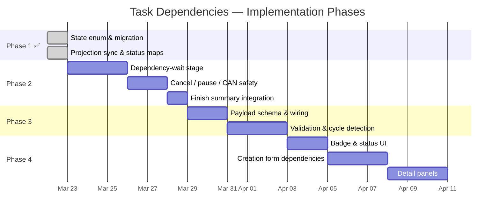

# Task Dependencies — Implementation Plan

Status: In Progress
Last Updated: 2026-03-23
Source Spec: `docs/Tasks/TaskDependencies.md`

---

## Overview

Implementation is split into four phases ordered by dependency: backend state primitives → workflow execution logic → API validation layer → frontend UI. Each phase is independently testable and deployable.

---

## Phase 1 — Backend Foundation (State & Schema) ✅ COMPLETE

**Goal:** Introduce the `waiting_on_dependencies` state across all persistence and projection layers so later phases can set and read it.

### Deliverables

| # | Change | File(s) | Status |
|---|--------|---------|--------|
| 1.1 | Add `WAITING_ON_DEPENDENCIES = "waiting_on_dependencies"` to the `MoonMindWorkflowState` enum | `api_service/db/models.py` (line 770) | ✅ Done |
| 1.2 | Alembic migration to add the new value to the PostgreSQL `moonmindworkflowstate` native enum type | `api_service/migrations/versions/a1b2c3d4e5f7_add_waiting_on_dependencies.py` | ✅ Done |
| 1.3 | Add `STATE_WAITING_ON_DEPENDENCIES = "waiting_on_dependencies"` constant alongside existing state constants | `moonmind/workflows/temporal/workflows/run.py` (line 58) | ✅ Done |
| 1.4 | Register the new state in the projection sync state mapping so `sync.py` recognizes it instead of warning on unknown values | `api_service/core/sync.py` — handled implicitly via `MoonMindWorkflowState(str(mm_state))` enum constructor | ✅ Done |
| 1.5 | Add a dashboard status mapping entry `MoonMindWorkflowState.WAITING_ON_DEPENDENCIES → "waiting"` | `api_service/api/routers/executions.py` (line 64) | ✅ Done |
| 1.6 | Add a compatibility status mapping entry (same pattern as 1.5) | `moonmind/workflows/tasks/compatibility.py` (line 43) | ✅ Done |

### Additional Phase 1 work completed

- State capability map in `executions.py` (line 465) grants `can_set_title`, `can_update_inputs`, `can_cancel` for the `waiting_on_dependencies` state.
- Reverse status filter mapping in `compatibility.py` (line 709) maps `"waiting"` → `WAITING_ON_DEPENDENCIES`.

---

## Phase 2 — Workflow Dependency Logic ⬜ NOT STARTED

**Goal:** Wire the dependency-wait stage into the `MoonMind.Run` workflow so that tasks with a populated `dependsOn` list block on prerequisites before proceeding to planning.

**Depends on:** Phase 1 ✅

### Deliverables

| # | Change | File(s) |
|---|--------|---------|
| 2.1 | Add `_run_dependency_wait_stage` method: transition to `waiting_on_dependencies`, create external workflow handles for each `dependsOn` entry, `asyncio.gather` their results, propagate `DependencyFailedError` on any failure | `moonmind/workflows/temporal/workflows/run.py` |
| 2.2 | Insert the dependency-wait call in `run()` between `_set_state(STATE_INITIALIZING)` and `_set_state(STATE_PLANNING)`, gated on `depends_on = parameters.get("dependsOn", [])` | `moonmind/workflows/temporal/workflows/run.py` |
| 2.3 | Respect `self._cancel_requested` during the gather wait (compound `wait_condition` or shielded check) per spec §3.3 | `moonmind/workflows/temporal/workflows/run.py` |
| 2.4 | Respect `self._paused` — check before entering gather, resume after unpause per spec §3.3 | `moonmind/workflows/temporal/workflows/run.py` |
| 2.5 | Record dependency-wait results in the finish summary: whether a wait occurred, wait duration, resolution outcome | `moonmind/workflows/temporal/workflows/run.py` |
| 2.6 | Update workflow memo with `dependsOn` IDs so the API can surface them without additional queries | `moonmind/workflows/temporal/workflows/run.py` |

### Continue-As-New Safety

Per spec §3.4, `dependsOn` is carried in `initialParameters`. If the workflow continues as new, the new execution re-reads `initialParameters` and re-enters the wait phase, re-creating external handles. External handles produce minimal history events, so this path is safe.

### Tests & Acceptance

- **Unit test — happy path:** Workflow with two `dependsOn` entries; both prerequisites complete successfully → workflow proceeds to `planning`.
- **Unit test — dependency failure:** One prerequisite fails → workflow raises `DependencyFailedError` naming the failed ID.
- **Unit test — cancel during wait:** `cancel_requested` set while waiting → workflow returns `{"status": "canceled"}`.
- **Unit test — pause during wait:** `_paused` is set → workflow blocks; after unpause → gather resumes.
- **Unit test — empty `dependsOn`:** Workflow skips the wait stage entirely (no regression).
- **Workflow boundary test:** Verify the invocation shape matches what the worker binding uses.
- All tests via `./tools/test_unit.sh`.

---

## Phase 3 — API Validation & Payload ⬜ NOT STARTED

**Goal:** Accept `dependsOn` in the task creation payload, validate it at request time, and enforce limits and cycle detection.

**Depends on:** Phase 2

### Deliverables

| # | Change | File(s) |
|---|--------|---------|
| 3.1 | Extend the canonical task payload schema to accept an optional `dependsOn: list[str]` field under `task` | `moonmind/workflows/agent_queue/task_contract.py` (or equivalent schema file) |
| 3.2 | Wire validated `dependsOn` into `initialParameters` when starting the `MoonMind.Run` workflow | API task creation path (submit router / service) |
| 3.3 | **Existence validation:** Each ID in `dependsOn` must resolve to an existing `MoonMind.Run` workflow via the Temporal client | API validation layer |
| 3.4 | **Workflow type validation:** Reject IDs that belong to non-`MoonMind.Run` workflow types | API validation layer |
| 3.5 | **Limit enforcement:** Reject requests with more than 10 `dependsOn` entries | API validation layer |
| 3.6 | **Self-dependency check:** Reject if the new task's workflow ID appears in its own `dependsOn` | API validation layer |
| 3.7 | **Cycle detection:** Traverse the transitive dependency graph (up to 20 hops) via workflow memo reads; reject with `409 Conflict` if a cycle is found | API validation layer |

### Tests & Acceptance

- **Unit test:** Valid `dependsOn` accepted and passed through to workflow parameters.
- **Unit test:** Non-existent dependency ID → `404` or appropriate error.
- **Unit test:** Dependency on non-`MoonMind.Run` workflow → rejection.
- **Unit test:** >10 entries → `400` validation error.
- **Unit test:** Self-dependency → `400`.
- **Unit test:** Cycle detection (A→B→A) → `409 Conflict`.
- **Unit test:** Deep chain (>20 hops) → rejection with simplification message.
- All tests via `./tools/test_unit.sh`.

---

## Phase 4 — Frontend (Mission Control UI) ⬜ NOT STARTED

**Goal:** Surface dependency information in Mission Control: visual badges, dependency configuration during task creation, and dependency panels on task detail views.

**Depends on:** Phase 3

### Deliverables

| # | Change | File(s) |
|---|--------|---------|
| 4.1 | Add a `WAITING_ON_DEPENDENCIES` badge to the task list status column (maps to the `"waiting"` dashboard status from Phase 1) | Mission Control JS (status badge component) |
| 4.2 | Add a tooltip or quick-view on the badge showing blocking task titles | Mission Control JS (task list row component) |
| 4.3 | **Task Creation Form:** Add a "Dependencies" section with a multi-select combobox / typeahead search against `/api/queue/jobs`. Enforce the 10-dependency limit client-side | Mission Control JS (task creation view) |
| 4.4 | **Task Detail — Dependencies panel:** Show prerequisite tasks with real-time status, clickable navigation links to each prerequisite's detail page | Mission Control JS (task detail view) |
| 4.5 | **Task Detail — Dependent Tasks panel:** Reverse-lookup showing downstream tasks that depend on the current task (query workflows whose `dependsOn` includes this task's ID) | Mission Control JS (task detail view) |

### Tests & Acceptance

- Browser-based verification: create a task with dependencies via the form → task appears in `WAITING_ON_DEPENDENCIES` state with correct badge.
- Verify dependency panel renders prerequisite list with live status updates.
- Verify clicking a prerequisite navigates to its detail page.
- Verify 10-dependency limit is enforced in the form.

---

## Phase Summary

## Risk Notes

- **Alembic migration ordering:** The enum migration (1.2) must be coordinated with any other in-flight migrations to avoid Alembic head conflicts. Rebase against `main` immediately before merging.
- **External workflow handle API:** Verify that the Python Temporal SDK version in use supports `workflow.get_external_workflow_handle_for` (typed variant). If not, fall back to the untyped `workflow.get_external_workflow_handle(workflow_id)` which is already used in `agent_run.py`.
- **Cycle detection cost:** The 20-hop traversal cap is a hard limit, not a soft one. If real-world dependency graphs grow deeper than expected, this can be raised but the cap itself must remain to bound query cost.
- **In-flight compatibility:** Adding the `waiting_on_dependencies` state and `dependsOn` parameter is purely additive. Existing in-flight workflows without `dependsOn` skip the wait stage with zero behavior change, satisfying the Compatibility Policy.
