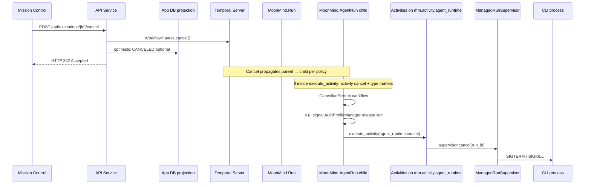

# Managed Agent Cancellation — Idiomatic Temporal Analysis

This document explains how **Temporal models cancellation** (official semantics), how that maps to **slow cancel** for `gemini_cli` and other managed runs in MoonMind, and which changes stay **inside idiomatic Temporal** (no parallel “shadow” cancel paths, no workflow-side process kills on remote workers).

**Code touchpoints:** [`agent_run.py`](../../moonmind/workflows/temporal/workflows/agent_run.py), [`run.py`](../../moonmind/workflows/temporal/workflows/run.py) (child workflow), [`supervisor.py`](../../moonmind/workflows/temporal/runtime/supervisor.py).

---

## Executive summary

Cancellation from Mission Control is **`WorkflowHandle.cancel()`** — a **graceful** stop: Temporal records `WorkflowExecutionCancelRequested`, schedules a workflow task, and workflow code may run cleanup. It is **not** immediate like **Terminate** (which skips workflow code entirely).

Slowness today comes mainly from:

1. **Default activity cancellation behavior** — When the workflow is awaiting `execute_activity(...)`, cancellation of the *workflow* must interact with cancellation of the *current activity*. The default **`ActivityCancellationType.WAIT_CANCELLATION_COMPLETED`** makes the workflow wait for the activity cancellation protocol to finish; long activities without responsive **heartbeats** cannot observe cancellation quickly.
2. **Long `start_to_close` timeouts** — Until the activity completes, fails, or responds to cancellation, the workflow may remain blocked.
3. **Extra hops after `CancelledError`** — Cleanup (e.g. dedicated `agent_runtime.cancel` activity, auth slot signals) adds queue and RPC latency.
4. **Product-level timing** — Supervisor graceful shutdown (`SIGTERM` wait before `SIGKILL`) is independent of Temporal but affects perceived latency.

**Highest-impact, idiomatic lever:** set **`cancellation_type=ActivityCancellationType.TRY_CANCEL`** on `execute_activity` calls where MoonMind should **enter workflow cancel handling without waiting** for the activity’s cancellation to fully complete (per SDK semantics). Combine with **heartbeats + heartbeat timeouts** inside long-running activities so the worker can deliver cancellation to application code promptly.

---

## Idiomatic Temporal cancellation (reference)

### Cancel vs terminate

| Mechanism | Workflow code runs cleanup? | Typical use |
|-----------|------------------------------|-------------|
| **Cancel** | Yes — workflow receives cancellation and can catch `CancelledError` / `asyncio.CancelledError` | Normal operator “stop” |
| **Terminate** | No — no workflow task; history shows `WorkflowExecutionTerminated` | Stuck workflow, broken code path |

Prefer **Cancel** unless the run is truly stuck and cannot make progress through cancellation ([Interrupt a Workflow Execution — Python](https://docs.temporal.io/develop/python/cancellation)).

### Child workflows

A **parent** cancel request is propagated to **child** workflows per your **parent close policy** and Temporal’s rules. That implies an extra server/workflow-task round trip compared to a single workflow. This is expected; do not “fix” it with out-of-band IPC—tune **activity** behavior and **cancellation types** instead.

### Activities: heartbeats are required for responsive cancellation

For **regular** activities, Temporal’s documentation is explicit: to cancel an activity from the workflow side, the activity should **send heartbeats** and set a **heartbeat timeout**. Without heartbeats, the activity may not process cancellation in a timely way ([same cancellation doc](https://docs.temporal.io/develop/python/cancellation)).

**Local activities** are a special case (same worker; cancellation without heartbeats is possible). They are **not** a substitute for killing a process started on another worker’s activity fleet—see *Non-goals* below.

### `ActivityCancellationType` (workflow await on `execute_activity`)

When a **workflow cancellation** arrives while the workflow is **blocked inside** `await workflow.execute_activity(...)`, the SDK uses an **activity cancellation type** to decide how the await resolves ([`ActivityCancellationType`](https://python.temporal.io/temporalio.workflow.ActivityCancellationType.html)):

| Type | Meaning (practical) |
|------|---------------------|
| **`WAIT_CANCELLATION_COMPLETED`** (default) | Workflow cancellation waits for the activity cancellation sequence to complete. Activities that rarely heartbeat may appear to “block” cancellation for a long time. |
| **`TRY_CANCEL`** | Request activity cancellation; the workflow’s await can complete with cancellation **without** waiting for the activity to finish all cleanup (exact semantics follow the SDK). Use when the workflow must run its own `CancelledError` handler (slot release, follow-up activities) even if the first activity is still winding down. |
| **`ABANDON`** | Workflow treats itself as cancelled **without** waiting for activity cancellation to complete—can strand work; use only with strong operational justification. |

MoonMind’s managed-agent path should default to explicit choices per call site (especially **`TRY_CANCEL`** on long-running `agent_runtime.*` and integration polls), not rely blindly on defaults.

### Explicit activity handle cancellation (advanced)

Inside workflow code, **`workflow.start_activity(...)`** returns a handle whose **`cancel()`** requests activity cancellation. That pattern is for **workflow-initiated** cancellation of a specific activity, distinct from **client-initiated workflow cancel**. Both are still fully within Temporal; they are not “bypassing” the platform.

---

## MoonMind: cancellation pipeline (observed)

The following is a **conceptual** sequence for a managed run using `MoonMind.Run` → child `MoonMind.AgentRun`. Exact ordering should be verified against current code.



---

## Root causes of slowness (mapped to Temporal levers)

### 1. Workflow blocked inside a long activity (primary)

If `MoonMind.AgentRun` is awaiting **`agent_runtime.launch`**, **`integration.*.status`**, **`agent_runtime.publish_artifacts`**, etc., **workflow** cancellation cannot complete until the **activity cancellation contract** is satisfied—strongly influenced by **heartbeat** behavior, **timeouts**, and **`ActivityCancellationType`**.

**Idiomatic mitigations:** `TRY_CANCEL` where appropriate, **heartbeats** in long activities, **tighter timeouts** where safe, and **retry policies** that do not extend wall time unnecessarily.

### 2. Default `WAIT_CANCELLATION_COMPLETED` on `execute_activity`

With the default, a **workflow** that has been asked to cancel may still **wait** for the activity side to complete cancellation processing. For minute-scale activities, that dominates latency unless activities heartbeat frequently.

**Idiomatic mitigation:** `cancellation_type=ActivityCancellationType.TRY_CANCEL` on selected `execute_activity` calls (see prioritization below).

### 3. Follow-up cancel activity + queue contention

After the workflow observes cancellation, MoonMind may schedule **`agent_runtime.cancel`**. That is still **idiomatic** (activity-based cleanup). Slowness here is **worker capacity** / **task queue backlog** (`mm.activity.agent_runtime`)—fix with **scaling**, **concurrency**, and **SLOs**, not by killing processes outside Temporal.

### 4. Child workflow propagation

Parent/child cancel ordering is inherent. Prefer **correct activity cancellation** and **timeouts** over extra control-plane shortcuts.

### 5. Ordering of cleanup steps in workflow code

If the workflow **signals** `AuthProfileManager` **before** running **`agent_runtime.cancel`**, slow paths on the manager add delay. **Within deterministic workflow rules**, consider **structuring awaits** so cleanup steps run in parallel only where safe, or reorder so process teardown is not unnecessarily gated on non-critical work—still **inside** the workflow.

### 6. Supervisor graceful shutdown window

`SIGTERM` then wait then `SIGKILL` is a **product** decision (CLI safety). It is not Temporal-specific; tune cautiously for user data integrity.

---

## Recommendations (idiomatic Temporal only)

### P0 — Use `TRY_CANCEL` on long `execute_activity` call sites

Apply **`ActivityCancellationType.TRY_CANCEL`** to activities in the **hot path** where workflow cancellation should **not** block on full activity cancellation completion (especially `agent_runtime.*` and integration polling loops). Example pattern:

```python
from temporalio.workflow import ActivityCancellationType

await workflow.execute_activity(
    "agent_runtime.launch",
    ...,
    cancellation_type=ActivityCancellationType.TRY_CANCEL,
)
```

Validate behavior with **workflow tests** and, where applicable, **replay** tests—changing cancellation semantics affects in-flight histories.

### ~~P0 — Heartbeats + heartbeat timeouts in long-running activities~~ (Done)

Ensure activities that can run for minutes:

- call **`activity.heartbeat(...)`** on an interval below the **heartbeat timeout**
- set a **heartbeat timeout** on the `execute_activity` options

This matches Temporal’s own guidance for cancellable activities ([cancellation doc](https://docs.temporal.io/develop/python/cancellation)).

### P1 — Right-size timeouts and retries

**`start_to_close`** and **`schedule_to_close`** bounds directly cap worst-case time before the workflow can leave a stuck activity. Tune them with **P0** heartbeats so “stuck” is detected without always waiting for the full timeout.

### P1 — Operational: agent-runtime worker scaling

If **`agent_runtime.cancel`** queues behind other work, increase **worker** throughput on **`mm.activity.agent_runtime`** or reduce exclusive long-running work occupying slots.

### ~~P2 — `workflow.query` for “cancellation in progress”~~ (Done)

Expose read-only state (e.g. `cancelling=True`) so Mission Control can show progress **without** mutating workflow state. Queries are the idiomatic read path.

### P2 — Supervisor `SIGTERM` / `SIGKILL` timing

After Temporal-side cancellation is sound, adjust **graceful wait** constants for CLI tools if product safety allows—this is **orthogonal** to Temporal but reduces tail latency.

### ~~P3 — Terminate only as a last resort~~ (Done)

For runs that **cannot** honor cancellation (bug, poison pill), operators may use **Terminate** via tooling. Document **when** it is appropriate; do not treat it as the normal Mission Control path.

---

## Non-goals (explicitly out of scope for "idiomatic Temporal")

The following were previously suggested in earlier drafts but **conflict** with keeping Temporal as the **single orchestration and lifecycle authority**:

| Anti-pattern | Why avoid |
|--------------|-----------|
| **"Bypass Temporal cancel"** via **direct IPC** to kill a process | Splits truth: process may exit while workflow still shows running; breaks audit and child/parent semantics. |
| **`execute_local_activity` from workflow to kill a remote agent process** | Local activities run on the **workflow worker**; managed agents run on **other** workers. This does not replace **`agent_runtime.cancel`** on the correct fleet. |
| **Duplicate cancel channels** (API kills process, workflow learns later) | Hard to reason about; duplicates failures and billing edge cases. |

**Preferred:** one **client** cancel on the **workflow** (`handle.cancel()`), **workflow** code handles `CancelledError`, **activities** cooperate via **heartbeats** and **`TRY_CANCEL`** where appropriate.

---

## Prioritization

1. **`TRY_CANCEL`** on the right `execute_activity` sites + tests.
2. **Heartbeats** + **heartbeat timeouts** for long activities (`agent_runtime`, integrations).
3. **Timeout / retry** tuning and **worker** capacity for `mm.activity.agent_runtime`.
4. **Query** for UX; **supervisor** timing tweaks last.
5. **Auth profile slot leak prevention** — active lease-holder verification in `AuthProfileManager` (see below).

---

## Auth Profile Slot Leak on Cancellation

### Observed Failure (2026-03-24)

Workflow `mm:5b122aaa` was cancelled while its child `MoonMind.AgentRun` held a `claude_minimax` auth profile slot (`max_parallel_runs: 1`). The slot was **not released**, blocking all subsequent Claude Code tasks until the lease was manually released via a `release_slot` signal to the `AuthProfileManager`.

### Root Cause Analysis

The `CancelledError` handler in `MoonMind.AgentRun` (line ~1005 in `agent_run.py`) wraps the slot-release signal in `asyncio.shield()`:

```python
except CancelledError:
    async def _release_slot():
        try:
            manager_handle = workflow.get_external_workflow_handle(manager_id)
            await manager_handle.signal("release_slot", {...})
        except Exception:
            self._get_logger().warning("Failed to release slot on cancellation...")
    tasks.append(asyncio.shield(_release_slot()))
    ...
    await asyncio.gather(*tasks, return_exceptions=True)
    raise
```

**Why the signal was not sent:** Temporal's Python SDK processes `CancelledError` within a workflow task. The `asyncio.shield()` is a Python-level primitive — it does not override Temporal's workflow-level cancellation semantics. Once the Temporal SDK has decided to cancel the workflow execution, `SignalExternalWorkflowExecution` commands may not be delivered if the workflow task completes as cancelled. The workflow history for `mm:5b122aaa:agent:node-1` confirms: no `SignalExternalWorkflowExecutionInitiated` event appears after the `WorkflowExecutionCancelRequested` event.

**Contributing factor:** The workflow was stuck on `integration.get_activity_route` (unregistered activity, now fixed) when the cancel arrived. Even with `TRY_CANCEL`, the cleanup handler's signal may still be swallowed depending on SDK workflow-task finalization ordering.

### Why the Safety Net Did Not Help Quickly

The `AuthProfileManager` runs `evict_expired_leases()` every 60 seconds with `_MAX_LEASE_DURATION_SECONDS = 7200` (2 hours). This is intentionally conservative, as legitimate runs may last up to an hour. However, it means a leaked slot from a cancelled workflow could block the queue for up to **2 hours** — far too long for a single-slot profile.

### Failure Modes Where Slot Cleanup Can Fail

| Failure Mode | Current Handling | Gap |
|---|---|---|
| `CancelledError` handler runs but `asyncio.shield` signal not delivered | Handler exists | Signal may not execute (Temporal SDK finalization) |
| Workflow terminates (not cancelled) | No cleanup code runs at all | No handler for `WorkflowExecutionTerminated` |
| Workflow stuck on unregistered/failing activity | `TRY_CANCEL` set, but cleanup depends on handler executing | Same shield issue |
| Worker crashes | No cleanup possible | Only lease eviction catches this |
| Workflow completes normally after 429 retry | `release_slot` signal sent | Working correctly |

---

## Implementation Tasks: Auth Profile Slot Leak Prevention

> **Design principle:** Do not rely on the child workflow's cleanup code as the sole mechanism for slot recovery. The `AuthProfileManager` (the slot owner) must independently detect and reclaim orphaned leases using idiomatic Temporal patterns.

### Task 1: Active Lease Holder Verification in `AuthProfileManager`

**What:** Add a periodic check in `_evict_expired_leases()` (or a new `_verify_lease_holders()` method) that queries whether each lease-holding workflow is still running.

**How (idiomatic Temporal):** Use `workflow.execute_activity()` to call a new verification activity on the workflow fleet that uses the Temporal Client's `describe_workflow_execution(workflow_id)` API to check whether the lease-holder workflow is in a terminal state (`COMPLETED`, `CANCELED`, `TERMINATED`, `FAILED`, `TIMED_OUT`).

```python
# New activity on mm.workflow fleet
@activity.defn(name="auth_profile.verify_lease_holder")
async def verify_lease_holder(workflow_id: str) -> dict:
    """Check if a workflow is still running. Returns {"running": bool, "status": str}."""
    client = await Client.connect(...)
    handle = client.get_workflow_handle(workflow_id)
    try:
        desc = await handle.describe()
        status = desc.status.name  # RUNNING, COMPLETED, CANCELED, etc.
        return {"running": status == "RUNNING", "status": status}
    except RPCError:
        return {"running": False, "status": "NOT_FOUND"}
```

**Why idiomatic:** Activities are the correct place for non-deterministic operations (RPC calls) in Temporal. The manager workflow stays deterministic; verification is delegated to an activity.

**Where:**
- New activity: `auth_profile_manager.py` or `activity_catalog.py`
- Manager integration: `_evict_expired_leases()` in `auth_profile_manager.py`
- Registration: `worker_runtime.py` (workflow fleet activities list)

**Reclaim policy:** If a lease holder is in a terminal state, release the lease immediately and proceed to drain the pending request queue. Log a warning for observability.

### Task 2: Reduce `_MAX_LEASE_DURATION_SECONDS` or Make It Profile-Configurable

**What:** The current 2-hour default is too conservative for profiles with `max_parallel_runs: 1`. Either:
- Reduce the global default to a shorter value (e.g., 90 minutes)
- Allow per-profile `max_lease_duration_seconds` configuration (e.g., in the DB-backed profile definition)

**Where:** `auth_profile_manager.py` constant and/or `ProfileSlotState` dataclass.

### Task 3: Verify `CancelledError` Slot Release Reliability

**What:** Add a workflow-level test that:
1. Starts a `MoonMind.AgentRun` with a managed agent kind
2. Assigns an auth profile slot
3. Cancels the workflow
4. Asserts that the `AuthProfileManager` state no longer contains the lease

**Where:** `tests/unit/workflows/temporal/test_auth_profile_manager.py` or a new test file.

**Why:** The existing `CancelledError` handler has never been tested at the workflow boundary. The `asyncio.shield` + Temporal cancel interaction must be validated empirically.

### Task 4: (Optional) Parent-Initiated Slot Release Fallback

**What:** If `MoonMind.Run` (the parent) observes that its child `MoonMind.AgentRun` exited as `CANCELED` or `FAILED`, the parent can send a defensive `release_slot` signal to the `AuthProfileManager` as a fallback.

**Why idiomatic:** The parent workflow is still running after the child terminates; it can issue signals. This adds a second release attempt without introducing any non-Temporal control plane.

**Where:** `_run_execution_stage()` in `run.py`, in the child workflow completion handling.

---

## References

- [Interrupt a Workflow Execution — Python SDK](https://docs.temporal.io/develop/python/cancellation)
- [Failure detection — Python SDK](https://docs.temporal.io/develop/python/failure-detection) (timeouts, heartbeats)
- [`temporalio.workflow.ActivityCancellationType`](https://python.temporal.io/temporalio.workflow.ActivityCancellationType.html)
- [TaskCancellation.md § 6 — Auth Profile Slot Cleanup](../Tasks/TaskCancellation.md) (canonical design)
