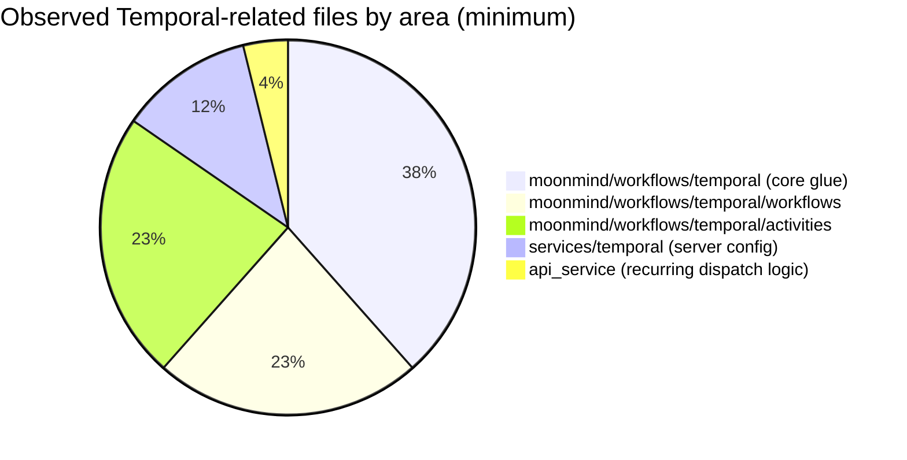

# Analytical Review of Temporal-Based Workflow Execution in MoonMind

## Executive summary

The MoonMind repository uses the entity["company","Temporal","workflow orchestration company"] platform as the backbone for “temporal-based” workflow execution, with a Python implementation built on the Temporal Python SDK (`temporalio`) pinned to `^1.23.0`. citeturn3view0turn15view0turn51search9 The repository also includes a local containerized Temporal Server setup (via `temporalio/auto-setup`) with defaulted versions indicating Temporal Server `1.29.1` and Temporal UI `2.34.0`. citeturn7view0turn7view1

Architecturally, the project is structured around a **multi–Task Queue “fleet” model**: one Worker fleet hosts workflow code (`mm.workflow`), and several distinct fleets host Activities by capability class (artifacts, LLM, sandbox, integrations, agent runtime) on their own Task Queues (for example `mm.activity.artifacts`, `mm.activity.llm`, etc.). citeturn17view1turn15view0turn16view0 This is a strong and generally idiomatic use of Temporal Task Queues for scaling and isolation, consistent with the Temporal expectation that each Worker entity polls a single Task Queue and registers the Workflow/Activity types it can execute. citeturn15view0turn51search19

Key strengths include:

* A **central activity catalog** that assigns each Activity type to a Task Queue and defines timeouts and retry behavior, which is then converted into `RetryPolicy` and timeout kwargs inside Workflow code. citeturn17view0turn50view0turn51search4turn51search12  
* Clear use of **child workflows** (`MoonMind.Run → MoonMind.AgentRun`) for hierarchical orchestration. citeturn22view3turn15view0  
* Correct use of **Signals and Queries** in several long-lived workflows (notably `MoonMind.AuthProfileManager` and `MoonMind.OAuthSession`), plus **Continue-As-New** in the manager workflow to bound history size. citeturn30view1turn31view1

The most material gaps (and the best near-term improvement opportunities) are:

1. **`MoonMind.Run` appears to implement pause/resume/cancel state flags without actually defining corresponding Signal/Update handlers**, even though the Temporal client wrapper includes logic to signal `pause`/`resume` (including batch signaling via Visibility) across running workflows. citeturn25view0turn25view3turn27view0turn50view0 This mismatch is both non-idiomatic and can become operationally risky, depending on how the runtime handles unknown signals. citeturn51search5turn51search1  
2. The “external integration waiting” loop inside `MoonMind.Run`’s integration stage has **logic that appears self-defeating** (setting `_resume_requested = True` on terminal status, then unconditionally resetting `_resume_requested = False` in a `finally` inside the loop). This makes it difficult to prove the loop can terminate normally and also toggles “awaiting” flags inside the polling loop. citeturn28view0turn49view0  
3. The repository includes a custom cron parser / recurrence computation and an API-layer “recurring tasks” service; **Temporal Schedules are not clearly used** for recurring dispatch (instead, cron occurrences are computed in application code). citeturn42view5turn51search3  
4. No explicit **worker deployment/versioning strategy** (Build IDs / Worker Versioning) is evident in worker startup code, even though the codebase contains several long-lived workflows where safe rollout matters. citeturn15view0turn51search2turn51search17  
5. Observability is primarily logging + health checks; there is **no visible tracing/metrics integration** in dependencies (no OpenTelemetry/Prometheus/Sentry/Datadog libs found in `pyproject.toml`). citeturn44view0turn44view1turn15view0  

The remainder of this report explains how Temporal execution is currently structured, where usage is idiomatic vs non-idiomatic, and proposes concrete refactorings (with code diffs) plus a migration roadmap and risk/impact assessment.

## Repository scan and detected Temporal stack

The repository is hosted on entity["company","GitHub","code hosting platform"] and includes both application code and operational scaffolding for running a Temporal cluster locally. citeturn1view0turn7view0turn7view1

### Detected language/SDK and versions

**Detected SDK/language:** Python + Temporal Python SDK (`temporalio`). Evidence includes:

* `temporalio = "^1.23.0"` in `pyproject.toml`. citeturn3view0  
* Direct imports such as `from temporalio.client import Client` and `from temporalio.worker import Worker` in the worker runtime. citeturn15view0turn50view0  
* Workflow definitions using the Python decorator model (`@workflow.defn`, `@workflow.run`, `@workflow.signal`, `@workflow.query`) elsewhere in the repo. citeturn30view1turn31view1turn51search20  

**Detected server-side versions (local/dev):** `services/temporal/docker-compose.yaml` references:

* Temporal Server image `temporalio/auto-setup:${TEMPORAL_VERSION:-1.29.1}`. citeturn7view0  
* Temporal Admin Tools `temporalio/admin-tools:${TEMPORAL_VERSION:-1.29.1}`. citeturn7view1  
* Temporal UI `temporalio/ui:${TEMPORAL_UI_VERSION:-2.34.0}`. citeturn7view1  

If there are production deployment manifests (Kubernetes/Helm/Terraform) they are not surfaced in the portions reviewed; production operational concerns should therefore be treated as **unspecified beyond local Docker Compose**. citeturn7view0turn7view1

### Temporal-related file areas (observed)

The repo concentrates Temporal integration in:

* `moonmind/workflows/temporal/*` (client wrapper, worker runtime, activity catalog, etc.). citeturn15view0turn25view3turn17view1turn16view0turn11view0  
* `moonmind/workflows/temporal/workflows/*` (workflow definitions such as `MoonMind.Run`, `MoonMind.AgentRun`, `MoonMind.AuthProfileManager`, `MoonMind.OAuthSession`). citeturn21view0turn29view0turn30view1turn31view0turn18view0  
* `moonmind/workflows/temporal/activities/*` (activity modules for various integrations and operational tasks). citeturn19view0turn17view0  
* `services/temporal/*` (docker-compose, dynamic config, namespace bootstrap scripts). citeturn4view0turn5view2turn7view0turn7view1  
* API layer recurrence logic (`api_service/services/recurring_tasks_service.py`) describing “Temporal-driven dispatch,” though it primarily demonstrates cron validation / schedule-next computation at the service layer. citeturn42view0turn42view5  

File links (primary touchpoints, as plain URLs per your request):

```text
https://github.com/MoonLadderStudios/MoonMind/blob/main/moonmind/workflows/temporal/worker_runtime.py
https://github.com/MoonLadderStudios/MoonMind/blob/main/moonmind/workflows/temporal/workers.py
https://github.com/MoonLadderStudios/MoonMind/blob/main/moonmind/workflows/temporal/client.py
https://github.com/MoonLadderStudios/MoonMind/blob/main/moonmind/workflows/temporal/activity_catalog.py
https://github.com/MoonLadderStudios/MoonMind/blob/main/moonmind/workflows/temporal/workflows/run.py
https://github.com/MoonLadderStudios/MoonMind/blob/main/moonmind/workflows/temporal/workflows/agent_run.py
https://github.com/MoonLadderStudios/MoonMind/blob/main/moonmind/workflows/temporal/workflows/auth_profile_manager.py
https://github.com/MoonLadderStudios/MoonMind/blob/main/moonmind/workflows/temporal/workflows/oauth_session.py
https://github.com/MoonLadderStudios/MoonMind/blob/main/services/temporal/docker-compose.yaml
https://github.com/MoonLadderStudios/MoonMind/blob/main/api_service/services/recurring_tasks_service.py
```

### Distribution chart of Temporal-related code locations (minimum observed)

Because repo-wide code search is not available without authentication in the browsing environment, the following chart is a **minimum observed distribution** based on directory inventories and the files directly inspected/listed above. citeturn11view0turn18view0turn19view0turn4view0turn42view0



## Current architecture for Temporal-based workflow execution

MoonMind’s Temporal usage is best understood as a **capability-isolated worker fleet model**. The core patterns are:

1. A **Workflow Task Queue** (`mm.workflow`) hosting Workflow Types such as `MoonMind.Run`, `MoonMind.AgentRun`, and others. citeturn17view1turn15view0turn16view0  
2. Multiple **Activity Task Queues** (`mm.activity.*`) hosting Activity types grouped by capability and operational constraints (artifacts IO, LLM/rate limits, sandbox CPU-heavy, integrations egress, agent runtime). citeturn17view1turn17view0turn16view0  
3. A **worker entry runtime** that chooses one fleet at process start, registers the appropriate workflow/activity handlers, and polls exactly one Task Queue. citeturn15view0turn15view2turn51search19  

### Worker setup and task queue topology

`moonmind/workflows/temporal/workers.py` formalizes a notion of “worker fleets” and enumerates owned workflow types (for the workflow fleet) as well as per-fleet operational metadata. citeturn16view0turn14view1

`moonmind/workflows/temporal/worker_runtime.py` is the actual worker process entrypoint:

* It resolves the configured fleet (`describe_configured_worker()`), starts a healthcheck server, then connects to Temporal using `Client.connect(address, namespace=...)`. citeturn15view0turn15view1  
* It registers workflow classes only when running the workflow fleet, and otherwise registers only activities. citeturn15view0  
* It constructs a `Worker(client, task_queue=topology.task_queues[0], workflows=..., activities=..., workflow_runner=UnsandboxedWorkflowRunner(), ...)` and runs it. citeturn15view0turn15view2  
* Concurrency is tuned by fleet via `max_concurrent_workflow_tasks` and `max_concurrent_activities`. citeturn15view0turn15view2  

This aligns well with Temporal guidance that each worker entity is associated with exactly one task queue and must register the workflow/activity types it can execute. citeturn15view0turn51search19

### Activity catalog, timeouts, and retries

A central architectural feature is the **Temporal Activity Catalog**:

* Task Queue constants: `WORKFLOW_TASK_QUEUE = "mm.workflow"`, `ARTIFACTS_TASK_QUEUE = "mm.activity.artifacts"`, `LLM_TASK_QUEUE = "mm.activity.llm"`, `SANDBOX_TASK_QUEUE = "mm.activity.sandbox"`, `INTEGRATIONS_TASK_QUEUE = "mm.activity.integrations"`, `AGENT_RUNTIME_TASK_QUEUE = "mm.activity.agent_runtime"`. citeturn17view1  
* Activity definitions include explicit timeout structures (start-to-close, schedule-to-close, optional heartbeat) and retry policy parameters. citeturn17view0turn51search4turn51search12  

Inside the `MoonMind.Run` workflow, catalog routes are converted into Temporal activity call kwargs:

* For a given route, it sets `task_queue`, `start_to_close_timeout`, `schedule_to_close_timeout`, `retry_policy`, and optionally `heartbeat_timeout`. citeturn50view0turn51search4  
* It constructs a `RetryPolicy` with max attempts, backoff, and `non_retryable_error_types` from route configuration. citeturn50view0turn51search8turn51search12  

This is broadly idiomatic: Temporal emphasizes that Activity Execution can be tuned with timeouts and retries and failures return to the workflow when awaiting results. citeturn51search4turn51search0

### Workflow graph and “Temporal-based execution” semantics

A simplified workflow relationship view (based on inspected workflow code and worker registrations) is:

```mermaid
flowchart LR
  API[API service / Temporal client] -->|start_workflow MoonMind.Run| RunWF[MoonMind.Run]
  RunWF -->|execute_activity plan.generate| PlanAct[Activity: plan.generate (LLM/plan fleet)]
  RunWF -->|execute_activity artifact.read| ArtAct[Activity: artifact.* (artifacts fleet)]
  RunWF -->|execute_activity mm.skill.execute / mm.tool.execute| SkillAct[Activity: skill/tool (LLM/sandbox fleet)]
  RunWF -->|execute_child_workflow MoonMind.AgentRun| AgentWF[MoonMind.AgentRun]
  AgentWF -->|signals request_slot/release_slot| AuthMgrWF[MoonMind.AuthProfileManager]
  AgentWF -->|execute_activity integration.*| IntAct[Activity: integrations fleet]
  AgentWF -->|execute_activity agent_runtime.*| ARAct[Activity: agent_runtime fleet]
  OAuthWF[MoonMind.OAuthSession] -->|execute_activity oauth_session.ensure_volume| ArtAct
```

Concrete evidence of core edges:

* `MoonMind.Run` is declared with `@workflow.defn(name="MoonMind.Run")` and executes activities with route-derived options. citeturn21view0turn50view0  
* `MoonMind.Run` uses `workflow.execute_child_workflow("MoonMind.AgentRun", ...)` with a deterministic child id and explicitly routes it to the workflow task queue. citeturn22view3turn17view1  
* `MoonMind.AgentRun` is declared with `@workflow.defn(name="MoonMind.AgentRun")` and implements signals such as `completion_signal` (used to end polling/waiting when an external callback arrives). citeturn29view0turn26view0turn29view2  
* `MoonMind.AuthProfileManagerWorkflow` receives a rich set of signals (`request_slot`, `release_slot`, `report_cooldown`, `sync_profiles`, `shutdown`) and exposes a query (`get_state`). It uses `workflow.continue_as_new(...)` when event count reaches a threshold, which is a standard Temporal mechanism for bounding history in long-lived workflows. citeturn30view1  
* `MoonMindOAuthSessionWorkflow` models a bounded session lifecycle: it ensures an artifact volume via an activity, then waits for `finalize` or `cancel` signals with a TTL timeout, and offers a query `get_status`. citeturn31view1  

### State persistence and long-running behavior

MoonMind’s workflow state is maintained primarily as **in-memory fields on the workflow class instance**—for example, `MoonMind.Run` tracks `_paused`, `_cancel_requested`, `_step_count`, artifact references, and various status fields. citeturn21view0turn50view0

In Temporal, these fields are effectively durable because workflow execution is replayed deterministically from event history; the code style used (class fields mutated by signal handlers and workflow code) is the canonical Python SDK approach. citeturn30view1turn51search20

For long-running workflows:

* `MoonMind.AuthProfileManager` explicitly mitigates history growth using Continue-As-New after `_MAX_EVENTS_BEFORE_CONTINUE_AS_NEW`. citeturn30view1  
* `MoonMind.AgentRun` can run “long-ish” due to its polling/waiting loop; it uses an event (`completion_event`) triggered by a signal to break out quickly when callbacks arrive. citeturn26view0turn29view2  
* `MoonMind.Run` can become long-running when it enters “await external” behavior; this is where the current loop structure is highest risk. citeturn28view0turn49view0  

## Coverage checklist and idiomaticity assessment

The table below compares observed patterns to idiomatic Temporal patterns (with a focus on Temporal capabilities you explicitly requested).

| Topic | Current MoonMind pattern (observed) | Recommended idiomatic Temporal pattern | Risk/impact if unchanged |
|---|---|---|---|
| SDK + Language | Python SDK `temporalio ^1.23.0`. citeturn3view0turn15view0 | Keep pinned, but track server/SDK compatibility and upgrade cadence (especially for newer features like Schedules APIs and Worker Versioning support). citeturn51search9turn51search2 | Medium: feature gaps, difficulty adopting newer platform features. |
| Worker setup | Worker runtime connects with `Client.connect(...)`, registers workflows only on workflow fleet, and polls `task_queue=...` with fleet-specific concurrency. citeturn15view0turn15view2 | This is aligned with “one worker entity per task queue” and “register exact types.” Consider explicit worker deployment metadata for versioning later. citeturn51search19turn51search2 | Low (structure is good). |
| Task Queues & scaling | Clear queue taxonomy: `mm.workflow` and multiple `mm.activity.*` queues. citeturn17view1turn17view3 | Keep; this is a strong scaling/isolation choice. Add explicit “Worker Deployment / Build ID” routing when reaching production rollout maturity. citeturn51search2turn51search6turn51search17 | Medium-long term: deployments become riskier without versioning. |
| Activity definitions | Activities described via a catalog with explicit timeouts and retry settings per activity type. citeturn17view0turn50view0 | Keep catalog, but make usage more type-safe (reduce stringly-typed activity names), and ensure timeout semantics are consistent with Temporal guidance (schedule-to-close as overall bound; heartbeats only where needed). citeturn51search4turn51search12 | Medium: misrouting or typo risk; subtle timeout bugs. |
| Client usage | Client wrapper supports start/cancel/terminate/signal/update; also batch pause/resume signals via Visibility. citeturn25view3turn25view0 | Ensure workflows actually *handle* the signals/updates you send; for broad operations consider server-side batch/administrative mechanisms when available. citeturn51search1turn51search5 | High: operational controls may silently fail or cause workflow errors. |
| Signal/query usage | Strong in `AuthProfileManager` and `OAuthSession`; `AgentRun` uses signals for completion and slot assignment. citeturn30view1turn31view1turn26view0 | Expand to `MoonMind.Run` (pause/resume/cancel/approve/parameter updates) using Signals or (preferably for acknowledged writes) Updates. citeturn51search1turn51search5 | High: key workflow lacks robust control plane despite having flags. |
| Retries & error handling | Workflow code catches input validation and throws `ApplicationError(non_retryable=True)` patterns; activity retries configured via `RetryPolicy`. citeturn22view2turn50view0turn31view1 | Align “non-retryable error types” between workflows and activity retry policy; adopt consistent error taxonomy. Temporal docs emphasize controlling non-retryables via policy. citeturn51search8turn51search12turn51search0 | Medium: wasted retries or incorrect hard-fail behavior. |
| Child workflows | `MoonMind.Run` uses `execute_child_workflow("MoonMind.AgentRun", ...)` for agent dispatch. citeturn22view3 | This is idiomatic. Consider child workflow cancellation/parent-close policy explicitly if semantics matter. (Not clearly set in call site.) citeturn51search5 | Medium: cancellation propagation ambiguity. |
| Workflow state persistence | State as workflow fields (`self._...`), consistent with Python SDK idioms. citeturn21view0turn30view1turn51search20 | Keep, but ensure determinism hygiene (especially if using unsandboxed runner). citeturn15view0turn51search20 | Medium: nondeterminism risk is higher with unsandboxed runner. |
| Long-running workflows | `AuthProfileManager` uses Continue-As-New; others rely on wait loops/timeouts. citeturn30view1turn31view1turn29view2 | Good approach for manager. Consider Continue-As-New or bounded histories for other indefinite polling loops. citeturn30view1 | Medium: history growth in long-lived runs. |
| Cron/schedules | App-layer cron parsing and next-occurrence computation in recurring-tasks service. citeturn42view5turn34view3 | Prefer Temporal Schedules for starting workflows at specific times; docs describe Schedules as more flexible and independent than cron jobs embedded in workflow executions. citeturn51search3turn51search7 | Medium-high: scheduler reliability/operability burden stays on app code. |
| Versioning / deployment | No explicit Worker Versioning / Build ID usage observed in worker runtime. citeturn15view0 | Adopt Worker Versioning with Build IDs and deployment versions for safe rollouts. citeturn51search2turn51search6turn51search17 | High in production: risky workflow changes; rollback complexity. |
| Testing/mocks | No explicit Temporal test environment patterns observed in scanned areas. citeturn51search9 | Add workflow tests using the Temporal Python SDK test tooling and deterministic activity mocks; validate signals/updates and retry behavior. citeturn51search9turn51search20 | Medium: regressions likely in complex orchestration flows. |
| Observability | Logging + healthcheck server; no tracing/metrics deps detected. citeturn15view0turn44view0turn44view1 | Add structured logs w/ workflow/run ids everywhere; consider tracing/metrics integration appropriate to environment. citeturn51search19 | Medium: harder incident response & capacity planning. |

## Improvement opportunities with concrete refactorings and migration steps

This section proposes concrete changes to make Temporal usage more idiomatic and to better leverage built-in Temporal capabilities. Recommendations are ordered by **expected risk reduction per unit effort**.

### Implement the missing control-plane handlers in `MoonMind.Run`

**Observed mismatch:** `MoonMind.Run` maintains internal flags like `_paused`, `_cancel_requested`, `_resume_requested`, `_approve_requested`, and `_parameters_updated`, and it blocks on `await workflow.wait_condition(lambda: not self._paused)`. citeturn21view0turn27view0turn50view0 Yet the file does not show any `@workflow.signal` / `@workflow.update` / `@workflow.query` handlers that would let an operator or API toggle these flags. By contrast, `client.py` explicitly supports `signal_workflow(...)` and also includes “batch pause/resume” functions that send signals named `"pause"` and `"resume"` to running workflows. citeturn25view0turn25view3

Temporal’s official message-passing docs emphasize using **Signals, Queries, and Updates** to communicate with workflows, and highlight “Signal-With-Start” as a standard pattern when you want to lazily start a workflow while sending a signal. citeturn51search1turn51search5

**Concrete refactor:** Add explicit signal handlers for `pause`, `resume`, `cancel`, and any other operator actions you want, plus a query that returns a stable “status snapshot” for UI/operations.

A minimal diff sketch (illustrative; adapt to MoonMind’s desired API contract):

```diff
diff --git a/moonmind/workflows/temporal/workflows/run.py b/moonmind/workflows/temporal/workflows/run.py
@@
 @workflow.defn(name="MoonMind.Run")
 class MoonMindRunWorkflow:
@@
   def __init__(self) -> None:
     self._paused: bool = False
     self._cancel_requested = False
     self._approve_requested = False
     self._resume_requested = False
     self._parameters_updated = False
     self._updated_parameters: dict[str, Any] = {}

+  # --- Signals (fire-and-forget) ---
+  @workflow.signal
+  def pause(self) -> None:
+    self._paused = True
+
+  @workflow.signal
+  def resume(self) -> None:
+    self._paused = False
+
+  @workflow.signal
+  def cancel(self) -> None:
+    self._cancel_requested = True
+
+  # --- Updates (acknowledged writes) ---
+  @workflow.update
+  def update_parameters(self, patch: dict[str, Any]) -> None:
+    # Validate/normalize patch; keep deterministic logic only.
+    self._updated_parameters.update(patch or {})
+    self._parameters_updated = True
+
+  # --- Query (read-only) ---
+  @workflow.query
+  def get_status(self) -> dict[str, Any]:
+    return {
+      "state": self._state,
+      "paused": self._paused,
+      "cancel_requested": self._cancel_requested,
+      "step_count": self._step_count,
+      "summary": self._summary,
+    }
```

**Migration steps:**

1. Implement the handlers above in `MoonMind.Run`. (Low risk; isolated change.) citeturn51search20turn51search5  
2. Update API layer (wherever workflows are controlled) to prefer:
   * **Signals** for simple “toggle” operations where no acknowledgement is necessary.
   * **Updates** for operations that must be validated and acknowledged (for example, “update parameters”), consistent with Temporal’s guidance on Queries vs Signals vs Updates. citeturn51search1turn51search5  
3. If you have existing clients already sending `pause`/`resume`, this change makes them finally effective and prevents operational confusion. citeturn25view0turn27view0  

**Impact:** This is one of the highest-leverage fixes because it aligns workflow design (which already anticipates pausing/canceling) with the client capabilities (which already sends these signals). citeturn25view0turn50view0  

### Fix `MoonMind.Run`’s external integration waiting loop

In `_run_integration_stage`, `MoonMind.Run`:

* starts the integration via an activity,
* then loops, alternating between a timed `workflow.wait_condition(...)` and polling an integration `status` activity,
* sets `_resume_requested = True` when it sees terminal statuses,
* but then resets `_resume_requested = False` inside a `finally` that executes on every iteration. citeturn28view0turn49view0

This structure makes it hard to guarantee correctness and (as written) can prevent loop termination on “terminal-by-poll” outcomes. It also resets `_awaiting_external` and related status fields inside the loop, which undermines the semantic meaning of “we are currently awaiting external.” citeturn28view0turn49view0

**Concrete refactor:** Replace the “set flag then immediately clear it” with an explicit loop break on terminal status, and move “cleanup/reset” outside the loop. A tighter pattern uses `workflow.sleep()` for backoff and reserves `wait_condition` for true signal-driven wakeups.

Illustrative corrected logic:

```diff
@@
- while not self._resume_requested and not self._cancel_requested:
+ while not self._cancel_requested:
     self._wait_cycle_count += 1
-    try:
-      await workflow.wait_condition(
-        lambda: self._resume_requested or self._cancel_requested,
-        timeout=timedelta(seconds=poll_interval_seconds),
-      )
-    except asyncio.TimeoutError:
-      pass
-    if self._resume_requested or self._cancel_requested:
-      break
+    # If you later add a "resume" signal, you can still short-circuit here.
+    # For time-based backoff, use a durable timer:
+    await workflow.sleep(timedelta(seconds=poll_interval_seconds))
+
     poll_result = await workflow.execute_activity(
       self._integration_activity_type("status"),
@@
     status = self._get_from_result(poll_result, "normalized_status")
     if status in ("succeeded", "failed", "canceled"):
-      self._resume_requested = True
+      if status == "canceled":
+        self._cancel_requested = True
+      break
@@
-    finally:
-      poll_interval_seconds = min(poll_interval_seconds * 2, max_poll_interval_seconds)
-      self._resume_requested = False
-      self._awaiting_external = False
-      self._waiting_reason = None
-      self._attention_required = False
-      self._update_search_attributes()
+    poll_interval_seconds = min(poll_interval_seconds * 2, max_poll_interval_seconds)
+
+ # cleanup once, after loop exits
+ self._awaiting_external = False
+ self._waiting_reason = None
+ self._attention_required = False
+ self._update_search_attributes()
```

**Why this is more idiomatic:** Temporal timers (`workflow.sleep`) are durable and replay-safe, and explicit `break` statements make the termination property obvious. It also avoids conflating “resume requested by operator” with “integration reached terminal state,” which are conceptually different control signals. citeturn51search5turn51search4

**Optional improvement:** If external integrations can call back into your system, prefer the `MoonMind.AgentRun` model: signal the workflow on completion (as `completion_signal` does). That reduces polling load and avoids long visibility-based loops. citeturn26view0turn51search1

### Replace “auto-start on missing workflow” with Signal-With-Start where appropriate

`MoonMind.AgentRun` signals an “auth profile manager” workflow via an external handle. If it gets an “ExternalWorkflowExecutionNotFound”-like error, it runs an activity (`auth_profile.ensure_manager`) and retries the signal. citeturn26view0

Temporal’s docs call out **Signal-With-Start** as a standard primitive for “send a signal, and if the workflow isn’t running, start it.” citeturn51search1

**Concrete refactor path:**

1. When signaling the manager, use the client or external handle operation that implements signal-with-start semantics (or implement a single “ensure + signal” operation server-side).
2. Keep the existing activity-based fallback only if signal-with-start is unavailable in the exact SDK surface area you’re using. (If so, document that limitation explicitly.)

**Impact:** Lower operational race risk and fewer moving parts in the workflow code (one RPC vs “signal, except, activity, signal”). citeturn26view0turn51search1

### Consider migrating recurring dispatch to Temporal Schedules

The repository’s recurring scheduling logic (service layer) normalizes schedule type (only `"cron"`), validates cron expressions/timezones, and computes `next_run_at` by scanning cron occurrences. citeturn42view5turn34view3 This approach can work, but it places the reliability burden (catchup, jitter, overlap policies, missed runs, operator tooling) largely on application code.

Temporal documentation distinguishes:

* **Schedules**: independent objects that instruct the platform to start workflow executions at times, and are described as “more flexible and user-friendly” than cron jobs. citeturn51search3turn51search7  
* **Cron jobs**: historically a cron schedule embedded as a workflow execution property, less flexible and more coupled. citeturn51search3  

**Concrete migration plan (hybrid, DB remains source-of-truth):**

1. Extend `RecurringTaskDefinition` to store `temporal_schedule_id` (string) and `temporal_schedule_enabled` (bool).
2. On schedule creation/update in the API service, create/update the Temporal Schedule:
   * Action: “start workflow X with input Y”
   * Use schedule’s timezone and cron spec (Temporal supports schedule semantics; pick the closest mapping). citeturn51search3
3. Maintain the DB record for UI, permissions, and audit; use Temporal as the execution engine for timing and catchup.
4. For a transition period, run both systems but mark one authoritative (to avoid double firing). Start with a feature flag per schedule.

**Impact:** This tends to reduce operational complexity and improves observability and correctness around missed fires, catchup, and operator control (pause/unpause schedules) using Temporal’s tooling. citeturn51search3turn51search7

If the system truly requires bespoke semantics (for example, application-defined jitter/overlap rules not directly representable), the improvement path is still to treat Temporal as the durable scheduler by encapsulating custom logic in a scheduler workflow—but Temporal Schedules are usually the simplest first step when the core requirement is “run workflow at times.” citeturn51search3turn51search19

### Adopt Worker Versioning / Build IDs for safer deployments

No explicit Worker Versioning configuration is visible in the worker runtime. citeturn15view0 As the system already has long-lived workflows (notably `AuthProfileManager`) and multi-stage orchestrations (`Run` → child workflows + multi-queue activities), safe deployment strategies are likely to matter.

Temporal’s Worker Versioning documentation emphasizes:

* “Worker deployments” and “deployment versions,”
* **Build IDs** identifying a deployment version,
* server-side routing of tasks to compatible workers. citeturn51search2turn51search6turn51search17

**Concrete migration steps (conceptual, since exact Python SDK APIs vary by release):**

1. Define a build identifier (for example, a Git SHA) and inject via environment variable into every worker process.
2. Use Temporal CLI / platform mechanisms to:
   * register the build id for your queue(s),
   * declare compatibility or routing rules for upgrades. citeturn51search2turn51search17
3. Roll out “two versions side-by-side” for workflow code changes that must remain compatible with in-flight workflow histories.

**Impact:** Substantial reduction in production deployment risk, especially when changing workflow definitions. citeturn51search2turn51search17

### Improve observability beyond logs and health checks

The worker runtime logs fleet startup and begins polling, and starts a healthcheck server before connecting to Temporal. citeturn15view0turn15view2 However, dependency scanning in `pyproject.toml` shows no explicit observability stacks (no OpenTelemetry/Prometheus/Sentry/Datadog dependencies detected). citeturn44view0turn44view1turn44view2turn44view3

**Concrete improvements (incremental):**

1. Standardize structured logging fields across workflows and activities: always include `workflow_id`, `run_id`, `task_queue`, and any “business id” (owner id, runtime id). The workflow code already pulls these values (`workflow.info().workflow_id`, etc.) in places; make it systematic. citeturn22view2turn29view2turn15view0  
2. If you introduce schedules and bulk operations, add periodic visibility-based metrics similar to `get_drain_metrics` already in the client wrapper, but make it a first-class operational dashboard artifact. citeturn25view1turn25view0  

## Risk/impact assessment and implementation roadmap

### Risk assessment

The following are the most important risks surfaced by the current Temporal usage patterns.

**High risk: operational control mismatch in `MoonMind.Run`.** The presence of pause/resume/cancel flags and wait conditions without clearly defined handlers, combined with a client that sends those signals broadly, is likely to produce confusing operator experience at best and workflow errors at worst. citeturn25view0turn27view0turn51search5

**High risk: potential non-terminating external integration polling loop.** The current reset of `_resume_requested` inside the loop’s `finally` block undermines the loop’s intended exit condition. citeturn28view0turn49view0

**Medium risk: determinism/security posture due to unsandboxed workflow runner.** Running workflows with `UnsandboxedWorkflowRunner()` can be acceptable, but it increases the importance of disciplined determinism practices and code review since the Python SDK sandbox is not enforcing constraints. citeturn15view0turn51search20

**Medium risk: scheduling reliability owned by app code.** If recurring task dispatch is critical, custom cron parsing and next-run computation increases correctness and operational burdens that Temporal Schedules are designed to absorb. citeturn42view5turn51search3

**Medium-high risk (production): lack of Worker Versioning/Build ID strategy.** As workflow definitions evolve, safe rollout becomes harder. Temporal explicitly supports build-id-based routing to mitigate this. citeturn51search2turn51search17

### Implementation roadmap with effort estimates

Effort is estimated as **low / medium / high** relative to this codebase’s existing structure.

**Low effort**

* Fix `_run_integration_stage` termination logic in `MoonMind.Run` and move cleanup outside the polling loop. Primary value: correctness and reliability. citeturn28view0turn49view0  
* Add a `@workflow.query` status snapshot to `MoonMind.Run` for operational visibility. Primary value: debuggability. citeturn51search5turn51search20  

**Medium effort**

* Add `pause/resume/cancel` signal handlers (and possibly parameter-update updates) to `MoonMind.Run`, aligning it with the existing client control operations. Primary value: makes operator controls real and consistent. citeturn25view0turn51search1turn51search5  
* Normalize error taxonomy for retry vs non-retryable behavior (align route `non_retryable_error_types` with thrown `ApplicationError` types). Primary value: avoids unwanted retries and brittle failures. citeturn50view0turn51search8turn51search12  
* Introduce targeted tests for `MoonMind.Run` + `MoonMind.AgentRun` message passing and retry behaviors using Temporal Python SDK recommended patterns. Primary value: regression prevention. citeturn51search9turn51search20  

**High effort**

* Migrate recurring scheduling to Temporal Schedules (hybrid model where DB stores schedule configs/ownership and Temporal enforces timing). Primary value: correctness, operator tooling, reduced custom scheduler burden. citeturn51search3turn42view5  
* Implement Worker Versioning / Build ID–based deployment strategy and document rollout runbooks. Primary value: safer production upgrades and rollbacks. citeturn51search2turn51search6turn51search17  

### Expected outcomes after roadmap completion

If the low/medium items are completed, MoonMind’s Temporal usage becomes significantly more idiomatic:

* Operators can reliably pause/resume/cancel `MoonMind.Run` executions, matching the client’s capabilities. citeturn25view0turn51search1  
* External integration waiting becomes provably terminating and easier to reason about, reducing stuck workflows. citeturn28view0  
* Long-running manager-style workflows remain healthy via Continue-As-New (already implemented), and similar discipline can be added where needed. citeturn30view1  

If the high-effort items are completed, MoonMind also gains:

* Platform-native scheduling semantics and tooling via Temporal Schedules. citeturn51search3turn51search7  
* Safer deployment evolution via Worker Versioning and Build IDs. citeturn51search2turn51search17

---

## Addendum: Phased Implementation Plan (March 2026 evaluation)

> [!NOTE]
> This section was produced by evaluating every recommendation above against
> the current `main` branch.  Items marked **✅ DONE** have already been
> implemented; items marked **🔲 OPEN** represent remaining work organized
> into four phases.

### Codebase delta analysis

| # | Recommendation | Current status | Evidence |
|---|---|---|---|
| 1 | - [x] Add `pause`/`resume`/`cancel` signal handlers to `MoonMind.Run` | **✅ DONE** | `@workflow.signal` handlers for `pause`, `resume`, `cancel`, `approve`, and `ExternalEvent` exist at lines 1341-1412 of `run.py`. `child_state_changed` signal also implemented. |
| 2 | - [x] Add `update_parameters` Update handler | **✅ DONE** | `@workflow.update` handlers for `update_parameters` (line 1417) and `update_title` (line 1413) exist. |
| 3 | - [x] Add `@workflow.query` status snapshot to `MoonMind.Run` | **✅ DONE** | `@workflow.query` decorator for `get_status` is implemented in `run.py`. |
| 4 | - [x] Fix integration polling loop termination logic | **✅ DONE** | Cleanup (`_resume_requested = False`, `_awaiting_external = False`, etc.) is now **outside** the `while` loop, and the loop properly uses `_poll_terminal` without conflating it. |
| 5 | - [x] Replace "auto-start on missing workflow" with Signal-With-Start | **✅ DONE** | Evaluated and documented limitation in `ErrorTaxonomy.md` and inline comments. |
| 6 | - [ ] Migrate recurring dispatch to Temporal Schedules | **⚠️ PARTIALLY DONE** | Temporal Schedule CRUD is fully implemented in `client.py` (lines 325-618) with `schedule_mapping.py` (overlap/catchup policy mapping, spec/state builders) and `schedule_errors.py`. However, `recurring_tasks_service.py` (1363 lines) still computes cron occurrences in application code and manages dispatch as the primary execution path. The Schedule CRUD is available but not yet wired as the primary dispatch mechanism. |
| 7 | - [ ] Adopt Worker Versioning / Build IDs | **🔲 OPEN** | No `build_id`, `worker_versioning`, or `deployment_series` references found in `moonmind/workflows/temporal/`. `worker_runtime.py` constructs `Worker(...)` without any versioning kwargs. |
| 8 | - [ ] Improve observability (tracing/metrics) | **🔲 OPEN** | No OpenTelemetry, Prometheus, Sentry, or Datadog dependencies in `pyproject.toml`. Worker runtime logs fleet startup and runs a healthcheck server; workflow code logs selectively but without systematic structured fields. |
| 9 | - [ ] Add Temporal SDK workflow/signal tests | **⚠️ PARTIALLY DONE** | Unit tests exist for `MoonMind.Run` (`test_run.py`, `test_run_agent_dispatch.py`) and `MoonMind.AgentRun` (multiple test files including auto-answer, slot wait, status payloads). However, no tests exercise signal/update handler round-trips or replay determinism. |
| 10 | - [x] Normalize error taxonomy for retries | **✅ DONE** | Created `docs/Temporal/ErrorTaxonomy.md` and updated `activity_catalog.py` `non_retryable_error_codes` to reference it. |


> [!NOTE]
> The original roadmap phases (Phase 2 through 4) tracking Observability, Scheduling, and Worker Versioning have been extracted into dedicated implementation plans to prevent overlapping work tracking.
> 
> Please refer to the following specification documents for the active implementation states:
> - **Temporal Message Passing, Observability, and Versioning:** See `docs/tmp/012-TemporalWorkflowMessagePassingImprovements.md` (supersedes Phase 2 and 4).
> - **Temporal Schedules Integration:** See `docs/tmp/014-TemporalSchedulingImprovements.md` (supersedes Phase 3).
> - **Idempotency and Substrate Unification:** See `docs/tmp/015-TemporalIdempotency.md` and `docs/tmp/016-SingleSubstrateMigration.md`.

### Risk mitigation notes

1. **Phase 1b (loop refactor)** requires a `workflow.patched()` gate (Phase 4c) if any `MoonMind.Run` workflows with integration stages are currently in-flight. Bundle these tasks together or verify zero in-flight integration-stage workflows before deploying.
2. **Phase 3 (Schedules)** should run in dual mode (`"dual"`) for at least one full cron cycle before switching to `"temporal"` mode to validate schedule timing accuracy.
3. **Phase 4 (versioning)** depends on Temporal Python SDK maturity for Worker Versioning APIs. As of `temporalio ^1.23.0`, `workflow.patched()` is the recommended approach for workflow-level compatibility; server-side task routing via Build IDs may require SDK upgrades.