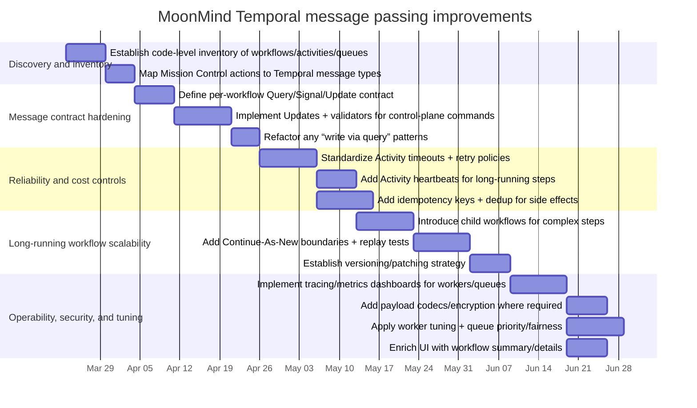

# MoonMind and Temporal Workflow Message Passing

## Executive summary

MoonMind (an open-source project by entity["organization","MoonLadderStudios","github org"] hosted on entity["company","GitHub","code hosting platform"]) positions itself as “mission control” for AI agent runtimes, emphasizing scheduling, resiliency, artifact management, and an operational dashboard. Its README describes an architecture composed of decoupled containers: an API service (FastAPI endpoints + “job queue API”), a Temporal server backed by PostgreSQL, a “worker fleet” with specialized workers, a “Mission Control” UI, and supporting stores/services (e.g., entity["company","Qdrant","vector database vendor"] and entity["company","MinIO","s3 compatible storage vendor"]), plus a Docker socket proxy for sandboxing. citeturn35view0

Temporal’s message-passing model (Signals, Queries, and Workflow Updates) is best understood as “RPC-like endpoints on a durable, replayable state machine”: Workflows define handlers; clients (and other Workflows) send messages through the Temporal Service; Workers poll Task Queues to deliver and execute the message handlers and workflow logic. The Temporal Python SDK documentation explicitly frames Workflows as “stateful web services” with message endpoints and provides idiomatic guidance on when to use Queries vs Signals vs Updates. citeturn46view0

**Critical limitation for this report:** The web environment available here could retrieve MoonMind’s repository landing page (README + top-level file listing) but could not retrieve individual source files within the repo (GitHub “blob/tree” pages and raw file views returned cache-miss errors). As a result, I cannot truthfully enumerate *all* Temporal Workflows, Activities, Signals, Queries, Child Workflows, and Task Queues defined in MoonMind’s code, nor can I provide repo-specific code excerpts with file paths. The sections on “MoonMind utilization,” “current patterns,” and “gaps” therefore separate (a) what is directly evidenced in the README from (b) architecture-level inferences that are consistent with Temporal best practices and with the repo’s stated design goals. citeturn35view0turn46view0

Despite that constraint, the report provides a deep, actionable, SDK-accurate explanation of Temporal message passing (with primary-source excerpts), a reconstructed message/data-flow model for MoonMind’s stated architecture, and a concrete improvement plan that aligns MoonMind’s likely “job submission + durable orchestration + mission control UX” goals with idiomatic Temporal patterns—especially the use of Workflow Updates for trackable request/response state mutations, Signals for asynchronous events, Queries for read-only state, and Activities for side effects with timeouts/retries/heartbeats. citeturn46view0turn47view0turn48view0

## Evidence base and repository architecture

### What can be verified from the repo landing page

From the repository front page, we can directly verify:

- The project’s positioning and feature claims: orchestration of AI agents (Claude Code / Gemini CLI / Codex, etc.), scheduling/recurrence, artifacts, mission control dashboard, and resiliency “backed by Temporal.” citeturn35view0  
- A declared containerized architecture with distinct roles:
  - **API Service** (FastAPI endpoints + MCP server + “job queue API”).
  - **Temporal Server** for durable execution with PostgreSQL persistence.
  - **Worker Fleet** of specialized/isolated workers (orchestration, sandbox execution, LLM calls, external integrations).
  - **Mission Control** dashboard.
  - Supporting stores/services (Qdrant, MinIO) and a Docker socket proxy. citeturn35view0  
- A top-level directory layout that strongly suggests a multi-service Python-heavy system (e.g., `api_service/`, `services/`, `moonmind/`, `tests/`, plus multiple docker-compose files). citeturn35view0

### Architecture implications relevant to Temporal message passing

Given the above, MoonMind’s intended durable coordination likely follows a standard Temporal pattern:

- The API service accepts a “task” submission (job) and starts a Temporal Workflow Execution to orchestrate it.  
- The “worker fleet” polls one or more Temporal Task Queues and runs Workflow code and Activity code; Activity invocations encapsulate side effects (calling LLMs, interacting with runtimes, writing artifacts).  
- Mission Control reads execution state, progress, and artifacts via Temporal visibility/history plus application databases/object stores; it may also drive control actions (cancel/terminate/pause/resume/approve) via Temporal messages (Signals or Updates). citeturn35view0turn46view0

These inferences are consistent with Temporal’s core model—Workflows as durable orchestrators; Activities as failure-prone side effects with retries/timeouts; Task Queues as the routing boundary between “who produces work” and “which workers can execute it.” citeturn29view0turn47view0turn48view0

### Repo links requested by the user

The following repo links are included because the repository landing page indicates these are major components, but (per the constraint above) their contents could not be fetched here:

- MoonMind root: `https://github.com/MoonLadderStudios/MoonMind` citeturn35view0  
- API service: `https://github.com/MoonLadderStudios/MoonMind/tree/main/api_service` citeturn35view0  
- Core Python package: `https://github.com/MoonLadderStudios/MoonMind/tree/main/moonmind` citeturn35view0  
- Services/workers: `https://github.com/MoonLadderStudios/MoonMind/tree/main/services` citeturn35view0  
- Compose files: `https://github.com/MoonLadderStudios/MoonMind/blob/main/docker-compose.yaml` (and related compose variants) citeturn35view0  

## How Temporal workflow message passing works

Temporal “message passing” in application terms is primarily the triad of **Signals**, **Queries**, and **Workflow Updates**. In the Temporal Python SDK developer guide, Temporal describes the model explicitly: *a Workflow can act like a stateful web service that receives messages (Queries, Signals, Updates); the Workflow defines handler methods; clients send messages via the Temporal Service.* citeturn46view0

### Core primitives and what “message delivery” actually means

A simplified (but accurate) lifecycle looks like:

1. A **Client** issues a request (start workflow, send signal, send update, query).
2. The **Temporal Service** persists events to the Workflow’s History as appropriate:
   - Signals create `WorkflowExecutionSignaled` events in the recipient’s history (and additional “initiated” events when signaling external workflows). citeturn46view0turn41search1  
   - Updates have explicit acceptance/completion lifecycle events and can be rejected by validators before being written to history. citeturn46view0turn41search1  
   - Queries do not become history events. citeturn46view0turn41search1  
3. The Service schedules a **Workflow Task** to the Workflow’s **Task Queue** so a Worker can process the new event(s) and execute code deterministically.
4. A **Worker** polls the Task Queue(s) and runs:
   - **Workflow code** (replayable) to react to message events.
   - **Activity code** (side effects) when triggered by the Workflow. citeturn48view0turn47view0  

This mechanism is why “message passing” in Temporal is tightly coupled to Task Queue health, worker polling, and tuning (pollers, slots, schedule-to-start latency). The Worker Performance guide explains that pollers long-poll Task Queues and that throughput/latency depends on worker slots and poller behavior (including autoscaling). citeturn48view0

### Queries, Signals, and Updates in the Python SDK

Temporal’s Python docs provide direct, idiomatic rules:

- **Queries** are synchronous reads of Workflow state; query handlers must not mutate state and cannot execute async operations (no Activities inside queries). citeturn46view0  
- **Signals** are asynchronous messages to mutate Workflow state and drive flow. Signals cannot return values; the client call returns when the server accepts the signal, not when the workflow processes it. citeturn46view0turn41search1  
- **Updates** are trackable synchronous requests that can mutate state *and* return a value. Updates can have validators that reject updates *before* the update is written to history. citeturn46view0turn41search1  

A short excerpt (from Temporal’s Python docs) illustrates the semantic distinction (query read-only; signal mutating/no return; update mutating/returns + validator): citeturn46view0

```python
@workflow.query
def get_languages(self, input: GetLanguagesInput) -> list[Language]:
    # Query: inspect but must not mutate state
    ...

@workflow.signal
def approve(self, input: ApproveInput) -> None:
    # Signal: can mutate state, cannot return a value
    self.approved_for_release = True

@workflow.update
def set_language(self, language: Language) -> Language:
    # Update: can mutate state and return a value
    previous_language, self.language = self.language, language
    return previous_language

@set_language.validator
def validate_language(self, language: Language) -> None:
    if language not in self.greetings:
        raise ValueError("not supported")
```

### Signal-with-start and “exactly-once” message processing concerns

Temporal supports a “Signal-With-Start” operation: send a signal to a workflow, starting it if it isn’t running (and relying on request IDs for de-duplication at the API level). citeturn46view0turn41search1

For stronger application-level “exactly once” semantics, Temporal’s Python message passing docs call out using Update IDs and `workflow.current_update_info` for deduplication (especially with Continue-As-New). citeturn46view0

### Activities are not message passing, but they are critical for durable orchestration

MoonMind’s domain (LLM calls, sandbox execution, external integrations) is dominated by side effects that will fail transiently. In Temporal, that logic belongs in Activities, where you apply timeouts, retries, and heartbeats. The Python Failure Detection guide covers:

- Setting **Activity timeouts** (schedule-to-close, start-to-close, schedule-to-start).
- Setting **Activity retry policy** (backoff, max attempts, non-retryable error types).
- Heartbeating long-running activities.
- Using `ApplicationError(non_retryable=True)` to prevent pointless retries when input is invalid. citeturn47view0

### Long-running workflows, history growth, and lifecycle structuring

Two Temporal features matter for “agent orchestration” where runs can be long and step-heavy:

- **Child Workflows**: spawn structured sub-executions and capture child lifecycle events. citeturn46view3  
- **Continue-As-New**: restart the execution with the same Workflow ID to manage history size while preserving durable progress. citeturn46view4turn49view0  

### Scheduling and recurrence

MoonMind’s README highlights scheduled and recurring tasks. Temporal’s Python SDK docs include first-class **Schedules** guidance (and also discuss cron-like behavior). citeturn35view0turn46view5turn41search1

## How MoonMind appears to utilize Temporal message passing

### Confirmed usage from the README

MoonMind explicitly claims Temporal-backed durability (“workflows survive container crashes and restarts”) and describes a Temporal Server plus a “Worker Fleet” alongside an API Service and Mission Control dashboard. citeturn35view0

This is enough to confidently assert that:

- Temporal is intended as the durable execution core (state + retries + crash recovery).
- There is a separation between “request ingress” (API Service), “durable orchestrator” (Temporal), “execution engines” (Workers), and “operators/humans” (Mission Control). citeturn35view0turn46view0

### Likely (but not code-verified) message/data flow

Based on the architecture described in the README and Temporal’s documented model, the most plausible system-level message passing topology is:

- **API Service → Temporal**: start workflows for tasks; possibly send signals/updates for control operations.
- **Mission Control → Temporal**: query workflow state; issue updates/signals (pause/resume/cancel/approve); read visibility/history.
- **Workflow → Activities/Child Workflows**: orchestrate execution steps; fan out to specialized workers/queues.
- **Activities → External systems**: run agent CLIs, execute sandboxed commands via Docker proxy, call LLM APIs, store artifacts, index memory. citeturn35view0turn46view0turn47view0turn48view0

#### Conceptual message-flow diagram

```mermaid
flowchart LR
  subgraph ClientSide[Ingress + UI]
    API[API Service\n(FastAPI + job queue API)]
    UI[Mission Control UI]
  end

  subgraph TemporalCore[Temporal Core]
    TS[Temporal Service]
    TQ[Task Queues]
    Hist[(Workflow Event History\n+ Visibility)]
  end

  subgraph Workers[Worker Fleet]
    W1[Orchestrator Worker\n(Workflow Tasks)]
    W2[Execution Workers\n(Activity Tasks)]
    W3[Integration Workers\n(Activity Tasks)]
  end

  subgraph Infra[Supporting Services]
    DB[(PostgreSQL)]
    S3[(Artifact Store\nMinIO)]
    VDB[(Vector DB\nQdrant)]
    DP[Docker Socket Proxy\n(sandbox boundary)]
  end

  API -->|Start Workflow / Signal-With-Start| TS
  UI -->|Query / Update / Signal| TS
  TS --> Hist
  TS --> TQ
  W1 <--> TQ
  W2 <--> TQ
  W3 <--> TQ

  W2 --> DP
  W2 --> S3
  W3 --> VDB
  TS --> DB
```

This diagram is conceptual, but each edge corresponds to a documented Temporal mechanism (client message → history and/or workflow task → worker poll/execute → activity side effects). citeturn35view0turn46view0turn47view0turn48view0

### Conceptual workflow relationship model for an “agent task”

Because MoonMind advertises “step-based context management” and multi-worker execution, a structure like the following is typically idiomatic:

- A top-level **TaskOrchestrationWorkflow** (one per user task/job) maintains durable run state.
- Each “step” is either:
  - an **Activity** (if it is a single side-effecting operation), or
  - a **Child Workflow** (if it is complex, long-running, or benefits from its own message endpoints and history segmentation). citeturn35view0turn46view3turn46view4

```mermaid
flowchart TD
  A[TaskOrchestrationWorkflow] --> B[Step Planner\n(Workflow code)]
  B --> C1[ChildWorkflow: SandboxedExecution]
  B --> C2[ChildWorkflow: LLMReasoning]
  B --> C3[ChildWorkflow: ExternalIntegration]
  C1 --> D1[Activities:\nlaunch runtime / run command / stream logs]
  C2 --> D2[Activities:\ncall model / parse response]
  C3 --> D3[Activities:\nGitHub/Jira/etc]
```

Child workflows and Continue-As-New are especially relevant when a single “task” can run for a long time or accumulate large histories (common in agentic pipelines). citeturn46view3turn46view4turn49view0

### Inventory request: workflows, activities, signals, queries, child workflows, task queues

**Requested:** “identify all Temporal workflows, activities, signals, queries, child workflows, and task queues in the repo.”

**Status:** Not possible to enumerate from the accessible sources. The repo landing page shows top-level directories and describes the architecture, but source files containing Temporal decorators, worker registration, and task queue names could not be retrieved in this environment. citeturn35view0turn46view0

**What an inventory would look like (framework):** In a Python Temporal app, you would enumerate Workflow classes (`@workflow.defn`) and their handlers (`@workflow.query`, `@workflow.signal`, `@workflow.update`), Activities (`@activity.defn`), calls to `workflow.execute_activity(...)`, child workflow starts, and all configured task queue strings used by Workers and `client.start_workflow(..., task_queue=...)`. Temporal’s docs show these constructs explicitly. citeturn46view0turn47view0turn46view3

## Idiomaticity assessment relative to Temporal best practices

This section evaluates MoonMind’s *stated* design against Temporal’s documented best practices, and flags likely divergence risks in “message passing as a job system” architectures.

### Temporal-idiomatic patterns that align with MoonMind’s goals

MoonMind’s stated goals map cleanly to Temporal primitives:

- **Durable orchestration for crash/restart resilience**: Temporal’s core value proposition, and explicitly claimed in the README. citeturn35view0turn29view0  
- **Scheduling and recurrence**: Temporal Schedules (and cron-like behavior) are a first-class solution for recurring tasks. citeturn35view0turn46view5turn41search1  
- **Operator control plane (“Mission Control”)**: Temporal’s message passing model is designed for exactly this—operators can query state, signal state changes, or issue trackable updates that return results. citeturn46view0turn49view4

### Common divergence risks in “job queue API + workers” systems built on Temporal

Without code, these are framed as **risks to check**, not confirmed flaws:

- **Overusing Signals where Updates are required**: If Mission Control needs an acknowledgement/result (e.g., “pause accepted”, “cleanup started”, “replan completed”), Signals are not trackable; Updates are trackable and can return values and be rejected via validators. citeturn46view0turn41search1  
- **Using Queries for mutable operations or side effects**: Query handlers must not mutate state and cannot call Activities; if the UI expects “read-modify-write” through a Query endpoint, it is fundamentally non-idiomatic and unsafe. citeturn46view0  
- **Treating Temporal as a plain queue without modeling workflow state**: MoonMind’s README mentions a “job queue API.” If the system pattern is “enqueue a job and a worker pops it,” Temporal can still work, but you lose the big advantage unless each job is a Workflow that models progress and handles retries/compensation deliberately. Temporal’s failure handling guidance emphasizes that Activities should not directly fail workflows; workflow failure should be deliberate. citeturn47view0turn29view0  
- **Missing activity timeouts/retries/heartbeats for LLM/tool calls**: LLM calls and sandboxed executions are often long-running or flaky. Temporal expects you to encode failure detection in Activity options (timeouts, retries, heartbeats). citeturn47view0  
- **History bloat without Continue-As-New**: Step-heavy agent runs can generate lots of events. Continue-As-New is Temporal’s standard approach to keep histories manageable. citeturn46view4turn49view0  
- **Unsafe deployments / non-determinism**: Workflow code must be deterministic; changes must be rolled out safely using Temporal’s versioning strategies (worker versioning and/or patching). citeturn49view0turn48view2  
- **Throughput/latency issues from mismatched worker tuning**: A “worker fleet” implies multiple task types and resource profiles. Temporal provides explicit guidance on worker slots, poller autoscaling, and tuning. citeturn48view0  

### Current vs recommended idiomatic patterns

Because repo code could not be inspected, “current” reflects what is *implied* by the README and typical architectures.

| Area | Current pattern implied by README | Recommended idiomatic Temporal pattern | Why it matters |
|---|---|---|---|
| Job submission API | “Job queue API” starts durable work somewhere | Treat each job/task as a Workflow Execution; use `workflow_id` as the durable job id; store progress in workflow state and/or search attributes | Temporal’s strength is durable, replayable state, not ephemeral queue semantics citeturn35view0turn29view0turn46view0 |
| Operator control actions (pause/resume/approve) | Mission Control likely drives control-plane events | Use **Workflow Updates** for trackable commands that must be accepted/rejected and return results; use **Signals** for fire-and-forget events | Updates provide synchronous request/response and validators; signals do not wait for workflow processing citeturn46view0turn41search1 |
| Status read model | Mission Control needs “real-time state” | Use **Queries** for read-only state; enrich UI with Summary/Details; optionally use Visibility/Search Attributes for list/search | Queries cannot mutate state; UI enrichment improves operability and auditability citeturn46view0turn49view4turn48view0 |
| External side effects (LLM calls, sandbox exec) | Worker fleet runs specialized operations | Implement as **Activities** with explicit timeouts + retry policy; heartbeat long operations; mark non-retryables | This is Temporal’s failure boundary; avoids stuck executions and uncontrolled cost citeturn47view0turn48view0 |
| Long tasks + many steps | “Step-based context management” suggests many events | Use **Child Workflows** for complex steps; use **Continue-As-New** to cap history growth | Scales long-running orchestrations safely without runaway histories citeturn46view3turn46view4turn49view0 |
| Deployments of changing workflows | Active development + long-running workflows | Use patching / worker versioning; follow safe deployment guidance | Prevents nondeterministic replay failures during upgrades citeturn49view0turn48view2 |
| Multi-tenant/priority scheduling | Different job types (LLM, sandbox, integrations) | Use Task Queue separation + Task Queue priority/fairness; tune workers with slots/pollers | Prevents starvation; makes SLOs achievable; controls cost/latency citeturn48view3turn48view0 |

## Prioritized recommendations and implementation plan

### Recommendations

The items below are prioritized for a system like MoonMind’s (job submission + mission control UI + multi-worker durable orchestration). Each recommendation includes concrete code-level or configuration direction based on Temporal primary sources.

#### Establish an explicit message contract per workflow

Define, for each “job/task” workflow type, a clear contract:

- **Queries**: read-only state views (progress, current step, last error, artifact pointers).
- **Updates**: operator commands that must be validated and acknowledged (pause/resume/cancel-with-cleanup/replan/change-priority).
- **Signals**: asynchronous events that do not require synchronous confirmation (log streaming notifications, “step finished” events from external systems, “user uploaded artifact”, etc.). citeturn46view0

**Code-level change direction (Python):**
- Prefer `@workflow.update` + validators for control actions. Use validators to reject invalid commands before they hit workflow history (e.g., reject “resume” when not paused; reject “change model” mid-step if unsafe). citeturn46view0  
- Ensure query handlers are pure reads and do not call Activities (queries can’t be async and must not mutate). citeturn46view0  

#### Make “task idempotency” a first-class requirement

A “mission control” system will inevitably see duplicates (user double-submits, retries, UI refresh, network retries). Use Temporal-friendly dedup patterns:

- For operator commands: rely on **Update IDs** and `workflow.current_update_info` where applicable, particularly if you frequently Continue-As-New. citeturn46view0  
- For side effects in Activities: implement idempotency keys at the integration boundary (e.g., “artifact upload id”, “LLM call correlation id”), and treat non-idempotent operations as compensatable. Temporal’s failure guidance emphasizes controlling retry behavior via retry policies and non-retryable errors. citeturn47view0  

#### Standardize Activity options for every external call

For MoonMind’s long-running and failure-prone operations (LLM calls, sandbox execution, external integrations):

- Set Activity timeouts (start-to-close at minimum; schedule-to-start if queue pressure is a concern; schedule-to-close for total bound). citeturn47view0  
- Set retry policies intentionally (limited attempts for expensive calls; exponential backoff; mark validation errors non-retryable). citeturn47view0  
- Heartbeat activities that can run long (sandbox execution, downloads, large refactors) so the system can detect stalls and handle worker failure. citeturn47view0  

This aligns directly with MoonMind’s own promise of “smart retries” and “stuck detection,” but makes it deterministic and observable through Temporal mechanisms instead of ad hoc logic. citeturn35view0turn47view0turn48view0

#### Introduce structural controls for long histories

If MoonMind tasks can run for hours/days or have many steps:

- Use **Child Workflows** to isolate complex sub-runs (e.g., sandbox execution session, multi-turn LLM planning loops). citeturn46view3  
- Use **Continue-As-New** to keep workflow history bounded while preserving a stable workflow id for UI tracking. citeturn46view4turn49view0  

#### Invest in worker fleet tuning as a product feature

A multi-worker fleet is only as good as its task queue and worker tuning.

- Use worker slots and poller autoscaling guidance to prevent schedule-to-start latency spikes and backlog buildup. citeturn48view0  
- Separate task queues by workload class (or use priority/fairness mechanisms) so “cheap quick UI operations” don’t get starved behind “expensive long LLM calls.” citeturn48view3turn48view0  

#### Make deployments safe for running workflows

MoonMind is likely to evolve quickly. Temporal requires workflow determinism; changes must be rolled out safely:

- Adopt patching (`patched`, `deprecate_patch`) for compatible in-place workflow evolution where needed. citeturn49view0  
- Follow safe deployment guidance and/or adopt modern worker versioning approaches for pinned code paths. citeturn49view0turn48view2  

#### Harden security and observability around message passing

For a platform coordinating AI agents and potentially handling sensitive repo context, payload and metadata hygiene matter:

- Use **Converters and encryption** guidance to protect sensitive payload data (e.g., credentials, secrets, proprietary prompts) if they must transit through Temporal payloads. citeturn49view2  
- Use **Interceptors** to add cross-cutting concerns such as authorization, request metadata propagation, and enhanced tracing/logging around client calls and worker execution. citeturn49view3  
- Configure and emit **metrics + tracing + workflow logging** so Task Queue latency, worker saturation, and retry storms are visible. Worker performance guidance identifies key metrics (slots, schedule-to-start latency, cache metrics) for tuning. citeturn49view1turn48view0  
- Enrich the Temporal UI (Summary/Details) so Mission Control and Temporal Web UI both provide operator-grade context. citeturn49view4  

### Missing features checklist for MoonMind to confirm in code

Because repo code could not be inspected, this is a targeted checklist of Temporal features that are particularly important for MoonMind’s domain and are directly supported and documented:

- **Workflow Updates used for command-style message passing** (trackable) rather than only Signals. citeturn46view0  
- **Activity timeouts + retry policies** on all external calls, and **heartbeats** for long steps. citeturn47view0  
- **Continue-As-New** for long-lived, step-heavy jobs. citeturn46view4turn49view0  
- **Child workflows** for large sub-problems and isolation. citeturn46view3  
- **Schedules** (vs ad hoc cron) for recurring jobs. citeturn46view5turn41search1  
- **Versioning strategy** (patching and/or worker versioning) for safe evolution. citeturn49view0turn48view2  
- **Observability** (metrics, tracing) and **UI enrichment** for operations. citeturn49view1turn49view4turn48view0  
- **Encryption/codecs** for payload confidentiality where required. citeturn49view2  

### Implementation timeline



This plan explicitly sequences work so that (1) the system gains an authoritative inventory and message contract, (2) the operator control plane becomes trackable (updates + validators), (3) reliability/cost boundaries are encoded in activity options, then (4) long-running scalability and safe deployments are addressed, and finally (5) observability, security, and worker tuning are hardened. The ordering aligns with Temporal’s guidance on message passing semantics, failure detection, tuning, safe deployments, and UI enrichment. citeturn46view0turn47view0turn48view0turn48view2turn49view4turn49view2turn48view3

### Key primary references used

- Temporal Python SDK: Workflow message passing (queries/signals/updates): `https://docs.temporal.io/develop/python/message-passing` citeturn46view0  
- Temporal Python SDK: Failure detection (timeouts, retries, heartbeats, ApplicationError): `https://docs.temporal.io/develop/python/failure-detection` citeturn47view0  
- Temporal: Worker performance and tuning concepts: `https://docs.temporal.io/develop/worker-performance` citeturn48view0  
- Temporal: Task queue priority and fairness: `https://docs.temporal.io/develop/task-queue-priority-fairness` citeturn48view3  
- Temporal Python SDK: Child workflows: `https://docs.temporal.io/develop/python/child-workflows` citeturn46view3  
- Temporal Python SDK: Continue-as-new: `https://docs.temporal.io/develop/python/continue-as-new` citeturn46view4  
- Temporal Python SDK: Versioning/patching: `https://docs.temporal.io/develop/python/versioning` citeturn49view0  
- Temporal: Safe deployments guidance: `https://docs.temporal.io/develop/safe-deployments` citeturn48view2  
- Temporal Python SDK: Observability: `https://docs.temporal.io/develop/python/observability` citeturn49view1  
- Temporal Python SDK: Converters and encryption: `https://docs.temporal.io/develop/python/converters-and-encryption` citeturn49view2  
- Temporal Python SDK: Interceptors: `https://docs.temporal.io/develop/python/interceptors` citeturn49view3  
- Temporal Python SDK: Enriching the UI: `https://docs.temporal.io/develop/python/enriching-ui` citeturn49view4  
- Temporal API protocol documentation (low-level requests including signal-with-start and workflow update endpoints): `https://api-docs.temporal.io/` citeturn41search1

## Phased implementation plan

This section turns the recommendations above into ordered phases. Each phase has a goal, concrete deliverables, and exit criteria so progress can be reviewed without re-reading the full report. Phases build on one another: later phases assume earlier contracts and inventories exist.

### Phase 1 — Discovery and authoritative inventory (✅ COMPLETE)

**Goal:** Replace inference with a code-level map of Temporal usage so every subsequent change is targeted and testable.

**Deliverables**

- Inventory of all `@workflow.defn` workflows, `@activity.defn` activities, task queue strings (workers and clients), `@workflow.query` / `@workflow.signal` / `@workflow.update` handlers, and child workflow relationships.
- A short matrix mapping Mission Control and API actions to today’s Temporal operations (start, signal, query, update) and payloads.
- Gaps list against the “missing features checklist” in this document.

**Exit criteria**

- Inventory is checked into repo docs or a maintained internal doc and is updateable on each release.
- Stakeholders agree which workflow types are “job/task” orchestrators versus supporting workflows.

### Phase 2 — Per-workflow message contracts

**Goal:** Establish an explicit **Query / Signal / Update** contract for each job-orchestration workflow type, aligned with Temporal semantics (queries read-only; updates for validated, trackable commands; signals for fire-and-forget events).

**Deliverables**

- Written contract per workflow: handler names, payload shapes, validation rules, and which client paths (API vs Mission Control) use each primitive.
- Implementation plan for **Workflow Updates** with validators for operator commands that need acceptance, rejection before history, or return values (e.g., pause, resume, replan).
- Refactor list for any anti-patterns (e.g., mutating state or implying side effects through queries).

**Exit criteria**

- No intended “command” path relies solely on signals where a trackable update is required for UX or safety.
- Query handlers are documented and reviewed as read-only and non-async.

### Phase 3 — Idempotency and deduplication

**Goal:** Make duplicate submissions and retries safe at the Temporal and application boundaries.

**Deliverables**

- Conventions for **Update IDs** and use of `workflow.current_update_info` where Continue-As-New or duplicate client retries are expected.
- Idempotency keys at activity boundaries for non-repeatable side effects (artifacts, external APIs, billed LLM calls), with clear documentation of compensating actions where full idempotency is impossible.
- Signal-with-start or start options documented where “exactly one logical job” per id is required.

**Exit criteria**

- Documented dedup story for: double-submit from UI, network retries, and workflow continuation after CAN.
- Workflow-boundary tests cover at least one compatibility path for prior payload shapes where in-flight runs may exist (per project testing policy for Temporal contracts).

### Phase 4 — Activity reliability standard

**Goal:** Encode failure detection for all external and long-running work using Temporal’s activity model.

**Deliverables**

- Standard activity options template: timeouts (start-to-close, schedule-to-start or schedule-to-close as needed), retry policies, and `ApplicationError(non_retryable=True)` for validation failures.
- Heartbeats for long-running activities (sandbox execution, large transfers, long LLM or tool runs).
- Rollout across the worker fleet so no “naked” activity calls remain without documented options.

**Exit criteria**

- All integration-side activities use the template; exceptions are rare, named, and justified in code or docs.
- Observable behavior matches product expectations for “stuck” and retry behavior (no silent infinite retries on bad input).

### Phase 5 — Long-running scalability (child workflows and Continue-As-New)

**Goal:** Keep histories bounded and isolate complex sub-runs without losing a stable job identity for Mission Control.

**Deliverables**

- Child workflows for separable phases (e.g., sandbox session, multi-step planning) where isolation, separate signals/queries, or history segmentation helps.
- Continue-As-New boundaries for step-heavy or long-lived executions, with state carried forward explicitly.
- Replay or workflow-boundary regression tests for CAN and child workflow contracts.

**Exit criteria**

- Worst-case history growth for a representative long task is within agreed limits or explicitly bounded by CAN.
- Versioning/patching strategy is drafted (see Phase 6) before broad CAN rollout in production.

### Phase 6 — Safe workflow evolution

**Goal:** Ship workflow changes without nondeterministic replay failures for runs already in flight.

**Deliverables**

- Adopt patching (`patched` / `deprecate_patch`) or worker versioning for changes that affect workflow structure or event ordering.
- Release checklist: when a change requires a patch, a version bump, or a new workflow type.
- Documentation for operators on mixed-version workers during rollout windows.

**Exit criteria**

- No production deploy of workflow logic without a recorded compatibility strategy for active executions.
- CI includes replay-style or workflow-boundary coverage for changed workflows where applicable.

### Phase 7 — Worker fleet tuning and task queue strategy

**Goal:** Match worker capacity, pollers, and queue topology to workload classes so latency and cost stay predictable.

**Deliverables**

- Task queue layout by workload class (or priority/fairness configuration) aligned with Temporal guidance.
- Worker slot and poller settings tuned using metrics (schedule-to-start latency, backlog, saturation).
- Runbooks for scaling workers and diagnosing queue starvation.

**Exit criteria**

- Measured improvement or explicit SLOs for schedule-to-start on critical queues; no unbounded growth under nominal load tests.

### Phase 8 — Observability, security hardening, and UI alignment

**Goal:** Operators can diagnose issues from metrics and traces; sensitive payloads are protected; Mission Control and Temporal UI show consistent, rich context.

**Deliverables**

- Metrics and tracing for workers, workflows, and task queues; dashboards for retries, latency, and errors.
- Payload encryption or codec strategy where secrets or sensitive repo context transit Temporal; interceptors for auth, metadata, and consistent logging.
- UI enrichment (Summary/Details) and parity between Mission Control and Temporal Web UI for key job fields.

**Exit criteria**

- On-call can answer “why is this job stuck?” using dashboards and workflow history without raw log diving only.
- Security review sign-off on payload handling for production environments that need encryption.

### Cross-phase dependencies (summary)

| Phase | Depends on | Unlocks |
| --- | --- | --- |
| 1 | — | Accurate scope for 2–8 |
| 2 | 1 | Clear API/UI contracts |
| 3 | 2 | Safe retries and CAN |
| 4 | 1 (activity list) | Reliable side effects |
| 5 | 2, 4 | Long jobs without history blow-up |
| 6 | 2, 5 | Safe deploys with active runs |
| 7 | 1, 4 | Predictable throughput |
| 8 | 1–7 (incrementally) | Production operability |

This phased plan aligns with the gantt-style timeline under **Implementation timeline** above: inventory and contracts first, then reliability and scalability, then deployment safety and fleet tuning, and finally observability and security as ongoing hardening.