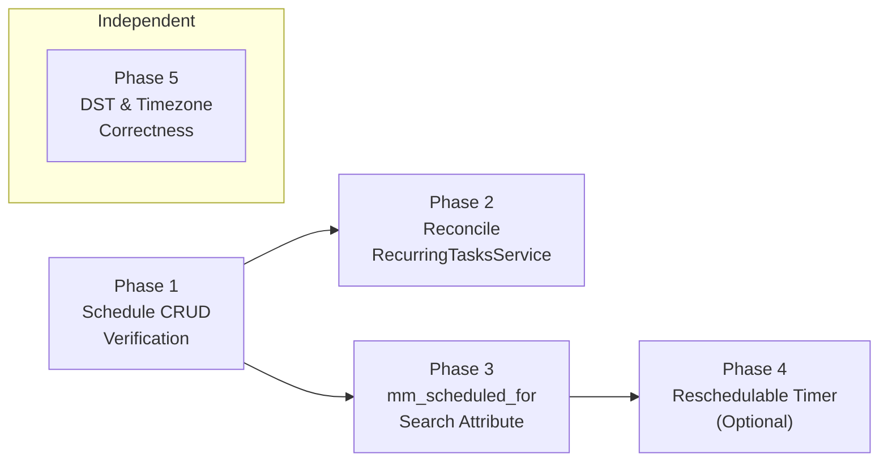

# Temporal Scheduling Improvements

**Reference:** [TemporalScheduling.md](../Temporal/TemporalScheduling.md) (desired state)
**Created:** 2026-03
**Status:** Active

---

## Executive Summary

MoonMind implements "time-based scheduling" in two ways today:

1. **One-off delayed starts** via Temporal's `start_delay` — fully wired end-to-end from API through `TemporalClientAdapter` to `Client.start_workflow(...)`. Idiomatic and working.

2. **Recurring scheduling** via a DB-backed cron system — `recurring_tasks_service.py` computes cron due times and dispatches work. This duplicates capabilities that Temporal Schedules provide natively and is the largest idiomatic gap.

The Temporal Schedule CRUD layer has already been implemented in `client.py` with `schedule_mapping.py` and `schedule_errors.py`, but it is not yet wired as the primary dispatch mechanism.

This plan closes that gap and adds supporting improvements across five phases.

### Current State Summary

| Area | Status |
|---|---|
| One-off `start_delay` for deferred starts | ✅ Idiomatic, working |
| In-workflow timers via `wait_condition` (gating, polling, backoff) | ✅ Idiomatic, working |
| Child workflow fan-out (dependency-based DAG dispatch) | ✅ Idiomatic, working |
| Temporal Schedule CRUD in `TemporalClientAdapter` | ✅ Implemented |
| Schedule policy mapping (overlap, catchup, jitter) | ✅ Implemented |
| Recurring dispatch via Temporal Schedules (primary path) | 🔲 Not yet wired |
| `mm_scheduled_for` search attribute | 🔲 Not implemented |
| Reschedulable timer pattern | 🔲 Not implemented |
| Cron/timezone correctness tests at DST boundaries | 🔲 Not implemented |

---

## Phase 1 — Wire Temporal Schedule CRUD into TemporalClientAdapter (Low effort · 1 sprint)

**Goal:** Ensure MoonMind's backend has complete, tested schedule lifecycle methods.

> [!NOTE]
> The CRUD methods already exist in `client.py` (lines 325-618). This phase focuses on
> filling any gaps in test coverage, error handling, and policy mapping.

- [x] **1.1** Verify and complete schedule lifecycle method coverage
  - **Files:** `moonmind/workflows/temporal/client.py`
  - Ensure all methods are present: `create_schedule()`, `describe_schedule()`, `update_schedule()`, `pause_schedule()`, `unpause_schedule()`, `trigger_schedule()`, `delete_schedule()`
  - All methods accept MoonMind-level inputs and map to Temporal SDK types
  - Schedule IDs follow convention: `mm-schedule:{definition_uuid}`
  - Workflow IDs for schedule-spawned workflows: `mm:{definition_uuid}:{schedule_time_epoch}`

- [x] **1.2** Add/complete unit tests for schedule CRUD
  - **Files:** `tests/unit/workflows/temporal/test_client_schedules.py`
  - Tests for each lifecycle method with mocked Temporal client
  - Tests for policy mapping (overlap → `ScheduleOverlapPolicy`, catchup → `catchup_window`)
  - Tests for schedule/workflow ID generation

### Policy Mapping Reference

**Overlap:**

| MoonMind `overlap.mode` | `ScheduleOverlapPolicy` |
|---|---|
| `skip` | `SKIP` |
| `allow` | `ALLOW_ALL` |
| `buffer_one` | `BUFFER_ONE` |
| `cancel_previous` | `CANCEL_OTHER` |

**Catchup:**

| MoonMind `catchup.mode` | `catchup_window` |
|---|---|
| `none` | `timedelta(0)` |
| `last` | `timedelta(minutes=15)` |
| `all` | `timedelta(days=365)` |

---

## Phase 2 — Reconcile RecurringTasksService with Temporal Schedules (High effort · 2-3 sprints)

**Goal:** Replace the DB-backed scheduling/dispatch loop with Temporal Schedule reconciliation while preserving the API surface.

- [x] **2.1** Add `temporal_schedule_id` column to `RecurringTaskDefinition`
  - **Files:** DB migration, `api_service/db/models.py`
  - Nullable string; when populated, indicates the definition has a corresponding Temporal Schedule

- [x] **2.2** Wire Temporal Schedule operations into definition CRUD
  - **Files:** `recurring_tasks_service.py`
  - On `create_definition()`: call `TemporalClientAdapter.create_schedule()`
  - On `update_definition()`: call `update_schedule()`
  - On enable/disable: call `pause_schedule()` / `unpause_schedule()`
  - On manual run: call `trigger_schedule()`

- [x] **2.3** Add hybrid dispatch with feature flag
  - **Files:** `recurring_tasks_service.py`
  - Introduce `RECURRING_DISPATCH_ENGINE` setting (`"app"` | `"temporal"` | `"dual"`)
  - In `"dual"` mode, both systems schedule but only the temporal-backed one dispatches (app path becomes read-only auditing)
  - ⚠️ Run in dual mode for at least one full cron cycle before switching to `"temporal"` mode

- [x] **2.4** Migrate existing definitions to Temporal Schedules
  - **Files:** New migration script
  - Iterate existing enabled definitions and call `create_schedule()` for each
  - Populate `temporal_schedule_id`

- [x] **2.5** Move target resolution into the workflow
  - Target resolution (template expansion, manifest lookup) moves from the scheduler service into the workflow
  - Schedule payload includes raw target specification
  - `MoonMind.Run` or `MoonMind.ManifestIngest` resolves the target in its initialization phase via Activities
  - Removes the scheduler's dependency on `ManifestsService` and `TaskTemplateCatalogService`

- [x] **2.6** Add reconciliation error handling
  - If a Temporal Schedule operation fails (e.g., Temporal temporarily unavailable), the MoonMind DB update succeeds but the Temporal Schedule is stale
  - Implement a reconciliation sweep (invoked periodically or on next access) that re-applies DB state to Temporal
  - Add logs and metrics to track reconciliation mismatches

- [x] **2.7** Deprecate app-layer cron computation
  - **Files:** `recurring_tasks_service.py`, `moonmind/workflows/recurring_tasks/cron.py`
  - Once `"temporal"` mode is stable, remove: `schedule_due_definitions()`, `_compute_due_occurrences()`, `_insert_run_if_missing()`, `dispatch_pending_runs()`, `_dispatch_run()`, `_dispatch_temporal_task()`, `_dispatch_temporal_task_template()`, `_dispatch_manifest_run()`, `_count_active_runs()`, `_bulk_fetch_active_counts()`, `_bulk_fetch_existing_executions()`, `_find_existing_temporal_execution_for_run()`, `run_scheduler_tick()`
  - Keep: cron/timezone validation helpers for UI, `RecurringTaskDefinition` model, CRUD methods, `/api/recurring-tasks` routes

### Verification

- Unit tests for reconciled `create_definition()` / `update_definition()`
- Unit tests confirming removed methods no longer exist
- Existing `test_recurring_tasks_service.py` tests updated for the new flow
- Existing `test_recurring_tasks.py` router tests remain valid (API surface unchanged)
- Integration test: create → schedule fires → workflow starts

---

## Phase 3 — Add `mm_scheduled_for` Search Attribute (Low-Medium effort · 1 sprint)

**Goal:** Make scheduled execution times queryable via Temporal Visibility.

- [ ] **3.1** Register the search attribute
  - **Files:** `services/temporal/bootstrap-namespace.sh`
  - ```bash
    temporal operator search-attribute create \
      --namespace "$TEMPORAL_NAMESPACE" \
      --name mm_scheduled_for \
      --type Datetime
    ```

- [ ] **3.2** Set `mm_scheduled_for` on deferred one-time executions
  - **Files:** `moonmind/workflows/temporal/client.py`
  - When `start_delay` is provided in `start_workflow()`, add `mm_scheduled_for = now + start_delay` to search attributes

- [ ] **3.3** Set `mm_scheduled_for` on schedule-spawned workflows
  - **Files:** `moonmind/workflows/temporal/client.py`
  - Use the schedule time as `mm_scheduled_for` in `ScheduleActionStartWorkflow` config

- [ ] **3.4** Document in Visibility docs
  - **Files:** `docs/Temporal/VisibilityAndUiQueryModel.md`

### Verification

- Unit test: `start_workflow()` with `start_delay` sets `mm_scheduled_for`
- Integration test: query workflows by `mm_scheduled_for` range
- Manual: verify attribute appears in Temporal UI filters

---

## Phase 4 — Implement Reschedulable Timer (Medium effort · 1-2 sprints)

**Goal:** Allow users to change the scheduled start time of a deferred execution after creation.

> [!NOTE]
> Temporal's `start_delay` is not adjustable after creation. The reschedulable timer pattern
> starts the workflow immediately, then waits on an updatable timer that can be changed via signal.
> See [TemporalScheduling.md §6.2](../Temporal/TemporalScheduling.md#62-mechanism-updatable-timer-pattern).

- [ ] **4.1** Add `reschedule` signal handler to `MoonMind.Run`
  - **Files:** `moonmind/workflows/temporal/workflows/run.py`
  - Workflow waits with an updatable timer when `input.scheduled_for` is set
  - `reschedule` signal updates the target time; timer re-evaluates

- [ ] **4.2** Add `send_reschedule_signal()` to `TemporalClientAdapter`
  - **Files:** `moonmind/workflows/temporal/client.py`

- [ ] **4.3** Add reschedule API endpoint
  - **Files:** `api_service/api/routers/executions.py`
  - `POST /api/executions/{workflowId}/reschedule` with body `{ "scheduledFor": "2026-03-24T12:00:00Z" }`
  - Backend sends a `reschedule` signal via `TemporalClientAdapter`

- [ ] **4.4** Add Mission Control UI action
  - Add "Change scheduled time" action on the task detail page for workflows with `mm_state=scheduled`

### Verification

- Unit test: workflow waits then proceeds after timer expires
- Unit test: workflow re-evaluates wait after `reschedule` signal
- Unit test: reschedule to the past triggers immediate execution
- Integration test: create deferred → reschedule → verify new execution time
- Manual: reschedule via Mission Control UI

---

## Phase 5 — DST & Timezone Correctness (Low-Medium effort · 1 sprint)

**Goal:** Ensure cron/timezone handling is correct at DST boundaries, whether using Temporal Schedules or app-layer cron.

- [ ] **5.1** Add DST boundary tests for cron evaluation
  - Test cron expression evaluation across spring-forward and fall-back transitions
  - Cover UTC, US/Eastern, Europe/London at minimum

- [ ] **5.2** Add integration tests for Temporal Schedule timezone handling
  - Verify that Temporal Schedules fire correctly across DST transitions in the deployed Temporal version
  - Document any Temporal server–level timezone caveats

- [ ] **5.3** Document canonical scheduling semantics
  - Unify the three scheduling concepts (start delay, in-workflow timers, Temporal Schedules) in one reference doc
  - Clarify which mechanism to use for which use case

---

## Phase Dependency Graph



**Task-level dependencies:**
- 1.1 → 2.2 (schedule CRUD must be verified before wiring into service)
- 2.1 → 2.2 → 2.3 → 2.4 → 2.7 (sequential schedule migration)
- 3.1 → 3.2, 3.3 (attribute must be registered before setting it)
- 3.2 → 4.1 (search attribute needed for reschedulable timer state)
- Phase 5 can proceed independently at any time

---

## Risk Mitigation Notes

1. **Phase 2 (Schedules migration)** should run in dual mode (`"dual"`) for at least one full cron cycle before switching to `"temporal"` mode to validate schedule timing accuracy.
2. **Phase 2.5 (target resolution)** removes a service dependency — ensure the workflow-side Activity for target resolution is robust and tested before deprecating the service-side path.
3. **Phase 4 (reschedulable timer)** is optional and depends on product need. The pattern is well-established but adds signal handler complexity to `MoonMind.Run`.
4. **Phase 5 (DST)** is high-impact if timezone bugs occur in production — prioritize regardless of other phase ordering.