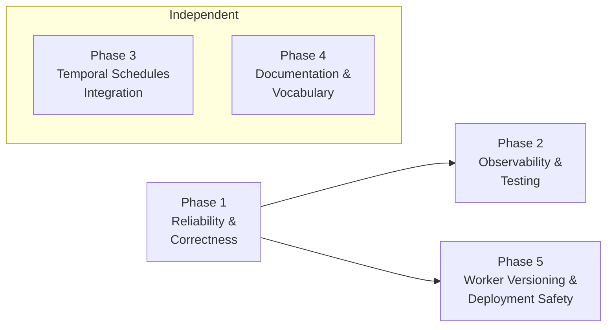

# Temporal Agent Alignment Plan

**Reference:** [011-TemporalWorkflowExecutionImprovements.md](011-TemporalWorkflowExecutionImprovements.md) (analysis report)
**Created:** 2026-03
**Status:** Superseded (Extracted)

> [!NOTE]
> This plan's structural alignment goals have been absorbed into more specific implementation trackers. To prevent overlapping execution checklists, the phases below should no longer be used as the primary tracking source.
> 
> Please refer to the following specification documents for active tracking:
> - **Temporal Message Passing, Observability, and Versioning:** See `012-TemporalWorkflowMessagePassingImprovements.md` (supersedes Phase 2 and 5 out of this document).
> - **Temporal Schedules Integration:** See `014-TemporalSchedulingImprovements.md` (supersedes Phase 3).
> - **Substrate Unification & Idempotency:** See `015-TemporalIdempotency.md` and `016-SingleSubstrateMigration.md`.

---

## Executive Summary

MoonMind's architecture is **largely aligned** with idiomatic Temporal. The repo already defines the right target: Workflow Executions as the durable orchestration primitive, Activities for all side effects, Temporal Visibility for list/query/count, artifact-by-reference payload discipline, and Signals/Updates for runtime interaction.

The core gap is **not** "MoonMind is non-Temporal." The gap is:

> **MoonMind still risks sounding and occasionally structuring itself like a platform with its own orchestration substrate that happens to use Temporal underneath, rather than a platform whose execution substrate _is_ Temporal itself.**

This plan closes that gap through five phases of work, each independently shippable.

### What Is Already Well Aligned

| Area | Status |
|---|---|
| Few root workflow types (`MoonMind.Run`, `MoonMind.ManifestIngest`) | ✅ Correct |
| `MoonMind.AgentRun` child workflow for delegated agent runtimes | ✅ Correct |
| Activities as the only side-effect boundary | ✅ Correct |
| Artifacts by reference (payload discipline) | ✅ Correct |
| Signals/Updates/Queries as the interaction model | ✅ Correct |
| `pause`/`resume`/`cancel` signal handlers on `MoonMind.Run` | ✅ Implemented |
| `update_parameters` / `update_title` Update handlers | ✅ Implemented |
| Temporal Schedule CRUD in `client.py` | ✅ Implemented |

---

## Phase 1 — Reliability & Correctness (Low effort · 1-2 sprints)

**Goal:** Fix remaining correctness gaps and add operational visibility to `MoonMind.Run`.

- [x] **1.1** Add `@workflow.query get_status` to `MoonMind.Run`
  - **Files:** `run.py`
  - Return `_state`, `_paused`, `_cancel_requested`, `_step_count`, `_summary`, `_awaiting_external`, `_waiting_reason`
  - Aligns with the client's `describe_workflow`

- [x] **1.2** Refactor integration polling loop to separate "operator resume" from "poll terminal"
  - **Files:** `run.py` (lines 864-918)
  - Introduce a distinct `_poll_terminal` flag instead of reusing `_resume_requested` for two different intents
  - Makes loop termination easier to reason about; eliminates post-loop `_resume_requested = False` reset
  - ⚠️ Requires a `workflow.patched()` gate (see 5.3) if any in-flight workflows have integration stages

- [x] **1.3** Explore Signal-With-Start for AuthProfileManager bootstrapping
  - **Files:** `agent_run.py` (`_ensure_manager_and_signal`)
  - Evaluate whether the Python SDK `start_workflow(..., start_signal=...)` or `signal_with_start` API can replace the current try/catch/activity/retry pattern
  - If SDK support is incomplete, document the limitation and keep the existing approach

- [x] **1.4** Define error taxonomy document
  - **Files:** New `docs/Temporal/ErrorTaxonomy.md`, modify `activity_catalog.py`
  - Map each `ApplicationError` subtype to retry vs non-retryable classification
  - Update `non_retryable_error_codes` to reference the taxonomy

---

## Phase 2 — Observability & Testing (Superseded by 012)

**Goal:** Systematic structured logging, workflow tests covering signals/updates, and replay determinism.

- [x] **2.1** Add structured logging context to all workflows
  - **Files:** `run.py`, `agent_run.py`, `auth_profile_manager.py`, `manifest_ingest.py`
  - Standardize `extra=` fields: `workflow_id`, `run_id`, `task_queue`, `owner_id`
  - Use `workflow.info()` consistently

- [x] **2.2** Add signal/update round-trip unit tests
  - **Files:** `tests/unit/workflows/temporal/workflows/`
  - Test `pause` → `wait_condition` unblocks on `resume`
  - Test `cancel` stops execution
  - Test `update_parameters` is acknowledged
  - Use Temporal Python SDK test environment (`WorkflowEnvironment.start_time_skipping()`)

- [x] **2.3** Add replay determinism test harness
  - **Files:** `tests/unit/workflows/temporal/`
  - Capture a workflow history JSON, then replay against current workflow code to catch non-determinism
  - Critical given `UnsandboxedWorkflowRunner()`

- [x] **2.4** Evaluate OpenTelemetry integration
  - **Files:** `pyproject.toml`, `worker_runtime.py`
  - The Temporal Python SDK supports interceptors for tracing
  - Add `opentelemetry-api` + `opentelemetry-sdk` + `temporalio` tracing interceptor
  - Gate behind feature flag for initial rollout

---

## Phase 3 — Temporal Schedules Integration (Superseded by 014)

**Goal:** Wire existing `client.py` Schedule CRUD as the primary dispatch mechanism for recurring tasks.

> [!NOTE]
> Schedule CRUD is already implemented in `client.py` (lines 325-618) with `schedule_mapping.py`
> and `schedule_errors.py`. This phase wires it into the recurring tasks service as the primary
> dispatch path.

- [x] **3.1** Add `temporal_schedule_id` column to `RecurringTaskDefinition`
  - **Files:** DB migration, `api_service/db/models.py`
  - Nullable string; when populated, indicates the definition has a corresponding Temporal Schedule

- [x] **3.2** Create/update Temporal Schedule on definition CRUD
  - **Files:** `recurring_tasks_service.py`
  - On `create_definition()`: call `TemporalClientAdapter.create_schedule()`
  - On `update_definition()`: call `update_schedule()`
  - On enable/disable: call `pause_schedule()` / `unpause_schedule()`

- [x] **3.3** Hybrid dispatch with feature flag
  - **Files:** `recurring_tasks_service.py`
  - Introduce `RECURRING_DISPATCH_ENGINE` setting (`"app"` | `"temporal"` | `"dual"`)
  - In `"dual"` mode, both systems schedule but only the temporal-backed one dispatches (app path becomes read-only auditing)

- [x] **3.4** Migrate existing definitions
  - **Files:** New migration script
  - Iterate existing enabled definitions and call `create_schedule()` for each
  - Populate `temporal_schedule_id`

- [x] **3.5** Deprecate app-layer cron computation
  - **Files:** `recurring_tasks_service.py`, `moonmind/workflows/recurring_tasks/cron.py`
  - Once `"temporal"` mode is stable, remove `schedule_due_definitions()` polling loop and `compute_next_occurrence()` dispatch path
  - Keep cron validation for UI

---

## Phase 4 — Documentation & Vocabulary Alignment (Superseded)

**Goal:** Make the docs and codebase vocabulary consistently Temporal-native.

- [x] **4.1** Add top-level architecture statement
  - **Files:** `docs/Temporal/TemporalArchitecture.md`
  - Add and repeat consistently across docs: _"MoonMind execution is Temporal-native. MoonMind adds domain contracts above Temporal—Tool, Plan, Artifact, Agent Adapter—but does not introduce a parallel orchestration substrate."_

- [x] **4.2** Rename "Plan Executor" → "Plan Executor" or "Plan Driver"
  - **Files:** Docs and source code references
  - "Interpreter" implies a shadow orchestrator; "Executor" makes clear the Workflow is the durable owner

- [x] **4.3** Define the dual agent execution model in docs
  - **Files:** Architecture docs
  - Document two sanctioned agent execution modes:
    1. **Workflow-native agentic loop** — reasoning loop lives in workflow code; each model/tool interaction is an Activity
    2. **Delegated agent runtime** — agent runs outside the workflow; `MoonMind.AgentRun` owns its durable lifecycle
  - Sharpen `MoonMind.AgentRun` contract: _"The durable lifecycle wrapper for delegated cognition"_

- [x] **4.4** Formalize the Query vs Visibility split
  - **Files:** Architecture docs
  - **Visibility + projections** → list pages, counts, filtering, history, dashboards
  - **Queries** → live execution detail, current progress, awaiting reason, active step, intervention point

- [x] **4.5** Codify the adapter vs workflow boundary rule
  - **Files:** Architecture docs
  - _"Adapters translate provider/runtime semantics. Workflows own lifecycle semantics."_
  - Adapters: normalize states, launch/start/status/fetch/cancel, expose capability descriptors
  - Workflows: phase progression, waiting, orchestration-level retries, HITL transitions, durable lifecycle state

- [x] **4.6** Clean up naming collisions
  - Rename "Review Gate" → "Approval Policy" or "HITL Policy"
  - Distinguish **workflow pause** from **fleet quiesce/drain** in pause/resume docs
  - Remove any user-visible "queue" wording that implies ordering semantics
  - Avoid "dispatcher/supervisor" language for logic that is Workflow + Activity behavior

- [x] **4.7** Formalize "read models are never execution truth"
  - **Files:** Architecture docs
  - workflow state/history + artifacts = execution truth
  - Visibility = indexed execution query plane
  - projections = UI/read optimization
  - projections must never be read by workflows to decide what to do next

---

## Phase 5 — Worker Versioning & Deployment Safety (Superseded by 012)

**Goal:** Enable safe rolling deploys for workflow code changes.

- [x] **5.1** Inject build identifier into worker startup
  - **Files:** `worker_runtime.py`
  - Read `MOONMIND_BUILD_ID` (default: Git SHA) from environment
  - Pass to `Worker(...)` using the Python SDK's versioning API once stable (or use `workflow.patched()` gates in the interim)

- [x] **5.2** Document deployment runbook
  - **Files:** New `docs/Temporal/WorkerDeployment.md`
  - Cover: version registration, compatibility matrix, rollback procedure, two-version side-by-side strategy for workflow changes

- [x] **5.3** Add `workflow.patched()` gates for in-flight compatibility
  - **Files:** Workflow files as needed
  - For any workflow-shape-changing refactor (e.g., 1.2 loop refactor), use `workflow.patched("patch-id")` to branch between old and new behavior during replay

---

## Phase Dependency Graph

**Task-level dependencies:**
- 1.1 → 2.2 (query handler needed before signal/update tests)
- 1.2 → 5.3 (loop refactor needs patched gates for in-flight safety)
- 1.4 → 2.2 (error taxonomy informs test assertions)
- 2.2 → 2.3 (signal tests before replay tests)
- 3.1 → 3.2 → 3.3 → 3.4 → 3.5 (sequential schedule migration)
- 5.1 → 5.2, 5.3 → 5.2

---

## Risk Mitigation Notes

1. **Task 1.2 (loop refactor)** requires a `workflow.patched()` gate (5.3) if any `MoonMind.Run` workflows with integration stages are currently in-flight. Bundle these tasks together or verify zero in-flight integration-stage workflows before deploying.
2. **Phase 3 (Schedules)** should run in dual mode (`"dual"`) for at least one full cron cycle before switching to `"temporal"` mode to validate schedule timing accuracy.
3. **Phase 5 (versioning)** depends on Temporal Python SDK maturity for Worker Versioning APIs. As of `temporalio ^1.23.0`, `workflow.patched()` is the recommended approach for workflow-level compatibility; server-side task routing via Build IDs may require SDK upgrades.
