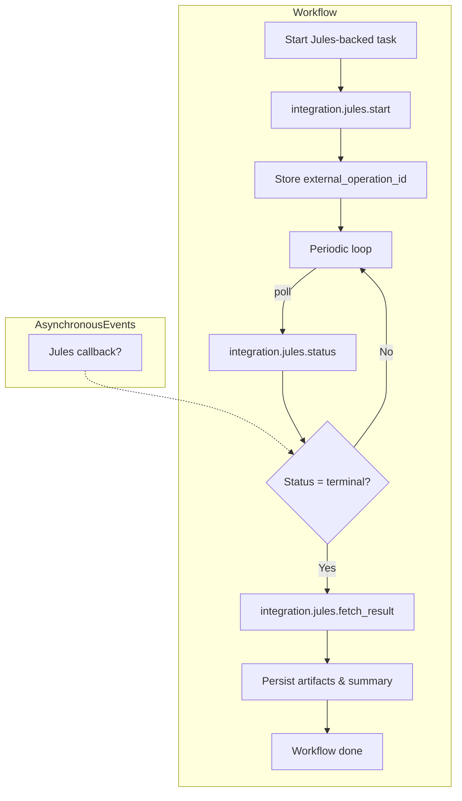
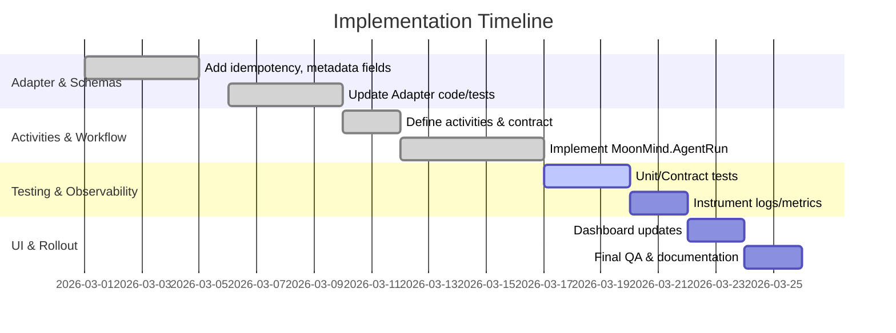

# Jules Temporal Integration Report

**Implementation tracking:** [`docs/tmp/remaining-work/ExternalAgents-JulesTemporalIntegrationReport.md`](remaining-work/ExternalAgents-JulesTemporalIntegrationReport.md)

> **Status**: Historical planning report. Most phases described here are now **complete**.
> See [`ManagedAndExternalAgentExecutionModel.md`](../Temporal/ManagedAndExternalAgentExecutionModel.md) for the current implementation status.
> Last reviewed: 2026-03-16

Integrating Jules with Temporal requires updating our documentation and implementation to leverage Temporal’s workflow model, eventing, and reliability features. Key changes include updating the **Jules Temporal External Event Contract** to explicitly use Temporal signals (ExternalEvent) and polling fallbacks, enforcing the existing runtime gate, and preserving existing Jules request/response semantics (e.g. status normalization, retry rules). The **Jules adapter** docs should be enhanced to describe using `idempotencyKey` and `correlationId` (e.g. using the Temporal workflow run ID) in the `integration.jules.start` payload, as well as scrubbing secrets from logs. The **Jules Proposal Delivery** doc should emphasize Temporal’s durable workflow guarantees, show how we register `integration.jules.send_proposal` and `sync_proposal_status` activities, and prefer signals for callbacks while falling back to polling (citing the ExternalEvent contract). We recommend adding concrete examples (JSON snippets) and language/runtime notes (Go/Java/TypeScript) in each doc.

We identified a phased implementation plan: (1) **Adapter & Schema** — add idempotency, callback support, status normalizer in code and docs ✅, (2) **Activity Registration & Workflow** — implement `integration.jules.start/status/fetch_result` and `MoonMind.AgentRun` workflow ✅, (3) **Testing & Observability** — write unit/contract tests and add metrics/logging (in progress), (4) **UI/Compatibility** — update dashboards to show Jules task info separately from workflow ID (remaining). Each task has clear acceptance criteria. We enforce event-contract versioning and maintain backward-compatibility with existing polling logic. Observability will include metrics for activities and signals, logs annotated with `correlation_id`, and persistent artifacts (terminal snapshots, failure summaries) stored via the Temporal artifact backend. Security measures include keeping API keys out of workflow history and validating any future Jules callbacks.

Below we detail **specific document edits** with example snippets, **implementation tasks** (with effort and criteria), recommended **tests**, versioning strategy, observability checklist, and security considerations.

## 1. Documentation Updates

### 1.1 **docs/ExternalAgents/JulesTemporalExternalEventContract.md**
- **Section 1–4 (Introduction)**: Clarify that Jules is a *provider-specific external-monitoring profile* for Temporal. Emphasize Temporal’s shared “ExternalEvent” contract for callbacks and the current policy of polling-first with callback readiness. ✅ Updated to reflect current architecture. For example, add a note:

  > *Note:* Jules workflows will use Temporal signals (`ExternalEvent`) for callbacks in the future, but must fall back to polling today. As with other integrations, the MoonMind hybrid model requires polling now and only uses callbacks after verified support.

- **Section 5 (Runtime State)**: Explicitly define fields. For example, add a JSON schema snippet:

  ```jsonc
  {
    "integration_name": "jules",             // canonical provider name
    "correlation_id": "<MoonMind workflow ID>",  // stable per-run id
    "external_operation_id": "<Jules taskId>",  // the Jules task identifier
    "provider_status": "<raw status>",          // raw status string (preserved)
    "external_url": "<task URL or null>"        // provider deep link
  }
  ```

  This aligns with FR-003/FR-006 requirements (use “jules” and map `taskId`→`external_operation_id`).

- **Section 6 (Runtime Gate)**: Emphasize enforcing the existing Jules enablement flags (`JULES_ENABLED`, etc.) across *all* code paths (API, workers, Temporal). ✅ Already implemented. Add: “If Jules is disabled or misconfigured, the Temporal activities for Jules must immediately error out (same as non-Temporal path) and not schedule any provider call”.

- **Section 7–9 (Request/Response Contract, Monitoring)**: Ensure wording preserves the compact, retry-safe patterns. Status activities should be idempotent and retry with backoff on 5xx/429, and fail fast on other 4xx (per existing adapter rules). ✅ `normalize_jules_status()` centralizes status mapping. For example, note “Use the same compact JSON shapes as today. Status activities should be idempotent and retry with backoff on 5xx/429, and fail fast on other 4xx (per existing adapter rules)”. Reinforce using a centralized status-normalizer (e.g. cite `normalize_jules_status` in code) to map raw states into `queued`, `running`, `succeeded`, etc., falling back to `unknown`.

- **Section 10 (Activities)**: Confirm activities run on the default `mm.activity.integrations` queue. ✅ Registered in `activity_catalog.py`. E.g.: “Use the standard `mm.activity.integrations` task queue (e.g. `integration.jules.start`, etc.) and do NOT introduce a new Jules-specific queue”. Under 10.2, specify inputs/outputs of `integration.jules.start`: it should include `correlationId`, `idempotencyKey`, `title`, `description` (with any `inputRefs`, `parameters`), and optionally `callbackUrl`/`callbackCorrelationKey`. Indicate that `callback_supported` defaults to `false` unless `callbackUrl` is provided (matching `JulesIntegrationStartResult` fields). For instance:

  ```markdown
  **Example:**
  ```
  integration.jules.start({
    "correlationId": "<workflow-id>",
    "idempotencyKey": "<stable-key>",
    "title": "...",
    "description": "...",
    "metadata": { ... }
  })
  ```
  Returns the `external_operation_id` (taskId) and `provider_status`, with `callback_supported: false` (until we enable real callbacks).
  ```

- **Section 11–12 (Polling vs Callback)**: Highlight that polling should use Temporal timers/backoff and avoid duplicate completions if a future callback arrives. Current implementation is polling-only via `MoonMind.Run._run_integration_stage()` with exponential backoff. Clarify that **current implementation is polling-only**: “Temporal workflows should schedule periodic status checks (`integration.jules.status`) until a terminal state is reached, using bounded backoff”. Also note the future ExternalEvent design (authenticated, deduplicated events stored as artifacts, not in history) per FR-013.

- **Section 13–15 (Artifacts, Security, Compatibility)**: Stress compactness and artifact use. Terminal Jules data should be saved as artifacts via the Temporal artifact backend, not in workflow history. No secrets in history or logs. UIs should show both workflow and Jules IDs clearly. For example, add: “Terminal Jules data (like resolution details) should be saved as *artifacts* via the Temporal artifact backend, not in workflow history”. Include a reminder that *no secrets* (API keys, tokens) go into history or logs. Finally, in compatibility, note that UIs should show both workflow and Jules IDs clearly and never substitute `taskId` for the workflow ID.

### 1.2 **docs/ExternalAgents/JulesAdapter.md**
*(Existing adapter documentation should be enhanced to cover Temporal-specific usage.)*

- **General Description**: Add an introductory note that the `JulesClient` now supports integration semantics (idempotency, correlation, callbacks). For example, mention that `JulesClient.start_integration()` automatically sets a `moonmind` metadata block with `correlationId` and `idempotencyKey` based on inputs. Recommend providing a stable `idempotencyKey` (e.g. using the Temporal runId or other workflow-unique ID) so retries don’t re-run the same Jules task.

- **Start / Status / Fetch methods**: For each API call (start task, get status, fetch result, resolve/cancel), clarify the contract:
  - **Start**: The adapter’s `start_integration` wraps the Jules `/tasks` endpoint. Emphasize its behavior: it returns a `JulesIntegrationStartResult` containing `externalOperationId` (the Jules taskId), `normalizedStatus`, `providerStatus`, and possibly `externalUrl` (task link). Stress that it uses HTTP bearer auth and respects timeouts/retries (consistent with older client) and that failure messages are scrubbed (see `JulesClientError` removing sensitive info). Provide a code snippet of how to call it in Python (or reference common patterns in Go/Java/TS):
    ```python
    result = await jules_client.start_integration(
        JulesIntegrationStartRequest(
            correlationId=workflow_id,
            idempotencyKey=unique_key,
            title="...",
            description="...",
            metadata={...}
        )
    )
    print(result.externalOperationId, result.providerStatus, result.externalUrl)
    ```
  - **Status**: Document that `get_integration_status()` calls `/tasks/{id}` and returns `normalizedStatus`, `providerStatus`, and `terminal` flag (true if status is terminal). Note it uses retries for network errors.
  - **Fetch Result**: Explain that `fetch_integration_result()` should retrieve any final output or resolution notes, returning references (`output_refs`, `summary`, etc.) and the status. Mention that large payloads (logs, diffs) may not exist in Jules and that summary/diagnostic artifacts should be stored via the artifact system.
  - **Cancel**: Document that provider cancellation is *unsupported* for now; calling cancel yields a `JulesIntegrationCancelResult` indicating “not performed” while the workflow can still cancel locally.

- **Error Handling**: Add text about `JulesClientError` (from `jules_client.py`) and how errors are surfaced: “Errors from the Jules API are raised as `JulesClientError`, whose string representation omits any secret (API keys). The adapter will retry on server/timeouts and fail fast on client errors as before.”

- **Observability**: Recommend logging context: e.g., “Ensure logs include `correlationId` and `externalOperationId` for each call for tracing.” Possibly show linking to a tracing example.

- **Language/Runtime Notes**: Since Temporal supports Go, Java, TypeScript, add remarks for each (brief): e.g. “In Go, use the Temporal SDK’s activity functions to call `JulesClient` (e.g. in `activity_runtime.go`); in TypeScript, use async/await with the `@temporalio` client library to invoke API endpoints. All languages must still abide by the contracts above.”

### 1.3 **docs/Temporal/JulesProposalDelivery.md**
*(This doc already outlines the design; we recommend small updates and clarifications.)*

- **Temporal Workflow**: Emphasize that this is a **Durable Temporal workflow**. Perhaps preface section 3.1 with: “Implemented as a long-running Temporal workflow (`MoonMind.ProposalDelivery`), this sequence will survive restarts and failures without losing the proposal payload.” Mention using `Workflow.sleep` or timers for periodic status checks if needed.

- **Activities**: In 3.2 and 4, link to the activity catalog. Possibly insert a table of inputs/outputs (or confirm with spec):
  - For `integration.jules.send_proposal`, clarify **input**: MoonMind proposal ID and payload; **output**: `externalOperationId` (Jules ID) and initial status.
  - For `integration.jules.sync_proposal_status`, clarify **input**: the `externalOperationId`; **output**: normalized status and provider status (as given by Jules). Use a snippet similar to [45] or [13].

- **Polling vs Callback**: Reinforce that the workflow should *prefer signals* for final status but *polls otherwise*. For example, update 3.3 to add: “Once the proposal is sent, the workflow waits either for a Jules callback signal or polls `integration.jules.sync_proposal_status` until a terminal state (`promoted` or `rejected`) is reached.” Reference the ExternalEvent design: “(See `JulesTemporalExternalEventContract.md` for the expected callback signal format.)”

- **Correlation**: Mention carrying over the `correlation_id` from the proposal creation through the Jules payload metadata. Section 6 (Security and Correlation) notes stable correlation: cite that the activity adds it to metadata. For example, state: “We attach a unique `correlation_id` (e.g. the MoonMind proposal ID) to the Jules task metadata to ensure idempotency and tracking.”

- **Failure Handling**: Possibly elaborate on termination: e.g. add a bullet “If the workflow itself is canceled, it should still attempt to cancel the proposal in Jules (even though provider cancel is unsupported) and record the cancellation outcome.”

- **Code/Params**: Consider adding an example or reference to where this is implemented, e.g. "The activities correspond to entries in `moonmind/workflows/temporal/activity_catalog.py` (see code) and the workflow logic is in `moonmind/workflows/temporal/workflows/agent_run.py`."

## 2. Implementation status

Adapter schema (`idempotencyKey`, `correlationId`, callbacks), `integration.jules.*` activities, and `MoonMind.AgentRun` orchestration are **implemented**. Remaining work spans **tests**, **metrics/artifacts**, **dashboard surfacing** of Jules IDs, and **callback wiring** as providers allow. The prioritized task table lives in [`docs/tmp/remaining-work/ExternalAgents-JulesTemporalIntegrationReport.md`](remaining-work/ExternalAgents-JulesTemporalIntegrationReport.md).

## 3. Testing Strategy

- **Unit Tests:** Cover the adapter logic (`JulesAgentAdapter` handling, status normalizer) and guard clauses for the runtime gate. Tests for `normalize_jules_status()` should include unknown/new status mapping to `"unknown"`. Existing tests in `test_jules_client.py` cover the HTTP transport layer.

- **Contract Tests:** Use schema-validation tests (`tests/contract/`) to ensure activity inputs/outputs remain consistent with code. Verify that `integration.jules.start/status/fetch_result` exist on the correct queue.

- **Integration Tests:** Run in an isolated Temporal environment. Simulate a mock Jules server to return different statuses. Test full workflow execution: task creation → activity calls → polling loop → completion. Include scenarios for intermediate failures (e.g. 429s, then recovery).

- **Manual End-to-End:** Deploy to a staging Temporal cluster and test via the API: toggle `JULES_ENABLED`, start a Jules proposal, ensure logs and outcomes match the spec.

- **Observability Tests:** Verify that metrics (e.g. using a metrics client) and artifacts are produced. For secrets: add a test that logs any exception from the Jules client call and assert that the `JulesClientError` string matches the scrubbed format (no token content).

## 4. Event Contract Migration & Versioning

- **Backward Compatibility:** Since we currently do not use callbacks, no existing flows break. Once callbacks are introduced, version the event format. For instance, include a `version` field in the ExternalEvent payload or use a new **signal name** (e.g. `Jules.ExternalEvent.v2`) so old workflows ignore unknown signals. Maintain the old polling logic until all providers support callbacks.

- **Schema Evolution:** Track changes using an event schema registry (or at least documented versions in the code). For example, if adding new fields (like `error_code`) to callback events, treat them as optional and default them to maintain compatibility.

- **Upgrade Path:** If any fields in the Temporal contract must change, apply Temporal’s [versioning guidelines](https://docs.temporal.io/docs/typescript/workflows#versioning) (e.g. `workflow.Version` in Go/Java, or feature flags) to avoid history conflicts. For the Event payload, consider incrementing an `eventVersion` for significant changes.

## 5. Observability & Monitoring Checklist

- **Traceability:** Log `correlation_id` and `external_operation_id` with every activity invocation. Use structured logging so these fields can be indexed in logs (e.g. via `logger.info(..., correlationId=..., externalOperationId=...)`).

- **Metrics:** Track counters and histograms:
  - *Activity starts/completions/failures* for each Jules activity (e.g. counts of `integration.jules.start` calls, latency histograms).
  - *Workflow metrics*: number of ProposalDelivery workflows started, succeeded, failed.
  - *Status polling*: number of polls per execution.

- **Dashboards:** In the Temporal Web UI, verify:
  - The workflow list shows Jules jobs with a distinct label (maybe “Jules Proposal”).
  - The proposal entity’s status field reflects normalized state (`promoted`/`rejected`), and the UI includes a link to `externalUrl`.

- **Artifacts:** For each workflow, ensure artifacts (terminal snapshot and failure summary) are attached. Periodically scan an S3/DB location to confirm artifacts saved for Jules runs. Include an automated check (as an acceptance test) that a successful run creates at least two artifacts: one JSON snapshot of the Jules task, one text summary of outcome.

- **Alerting:** (Not code-level but ops) – Define alerts for failed activities (e.g. if a Jules call fails repeatedly), or for missing callbacks beyond a timeout.

## 6. Security Considerations

- **Secrets Management:** Jules API keys must **never** be serialized into workflow history or sent to clients. As designed, `JulesClient` only sends the API key in the HTTP `Authorization` header, and scrubs it from exceptions. We should double-check (audit) that the new start/status/fetch code paths do not log the raw token.

- **Callback Authentication:** When callbacks are eventually implemented, they must be *authenticated*. For example, use an HMAC or a pre-shared secret on the callback URL, then verify it before signaling the workflow (as stated in the spec FR-013). Log and ignore any callback with invalid auth or unknown `external_operation_id`.

- **Idempotency & Replay:** Use the provided `idempotencyKey` in requests so that Temporal retries do not create multiple Jules tasks. The `JulesAgentAdapter` already uses this key in metadata. Also, enable Temporal's *context propagation* to guard against duplicate signals.

- **Least Privilege:** Ensure that only the worker process (with Jules credentials) can call the Jules API. The API endpoints exposed to clients should not reveal Jules details.

- **Auditing:** Maintain a clear audit trail: every Jules-backed start, status check, and final result should record who initiated it (via `correlation_id` linking back to the user's action in MoonMind). Do not log raw stack traces of errors — use the `JulesClientError` messages instead.

## 7. Design Options Comparison

| Aspect               | Polling-First (Current)         | Callback-First (Future)                         |
|----------------------|---------------------------------|-------------------------------------------------|
| **Complexity**       | Simpler to implement now.       | Requires provider support and callback endpoint.|
| **Latency**          | Higher (periodic checks).       | Lower (push updates instantly).                 |
| **Reliability**      | Guaranteed by Temporal (retries). | Also reliable if implemented correctly with ack.|
| **Design Effort**    | Moderate (reuse existing).      | High (secure callback handling, idempotency).   |
| **Temporal Features**| Uses `Workflow.sleep`/timers.   | Uses `Workflow.SignalExternalEvent`.            |
| **Backward-Compat.** | N/A (existing).                 | Must version event contracts.                   |

**Mermaid Workflow Diagram:** Jules integration workflow (polling variant):



**Mermaid Gantt Chart:** Implementation phases timeline (S/M/L estimated durations):



**References:** Internal docs referenced throughout. All recommendations align with Temporal’s constraints (deterministic workflows, durable timers, signals) and leverage existing MoonMind patterns (shared status normalizer, artifact backend). The updated docs and tasks above ensure Jules integration will be robust, observable, and compatible with Temporal best practices.
