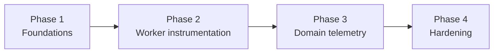

# OpenTelemetry implementation plans

**Canonical design:** [OpenTelemetrySystem.md](../Observability/OpenTelemetrySystem.md)  
**Created:** 2026-03-26  
**Status:** Draft (execution tracker; design truth lives in the canonical doc)

The canonical doc’s **§18 Rollout plan** and **§21 Implementation tracker** defer here. This file expands those sections plus §15 *Service-by-service implementation* and §19 *Testing strategy* into actionable checklists. It does not restate goals, non-goals, or attribute contracts—read the system doc for those.

---

## Phase 1 — Foundations

**Design reference:** OpenTelemetrySystem.md §18 Phase 1, §15.1, §21 items 1–4 and 6.

- [ ] Add OpenTelemetry Collector plus Tempo, Loki, Prometheus, and Grafana to Docker Compose (default internal OTLP target for MoonMind services).
- [ ] Wire services to export OTLP to the collector on the internal network (see canonical §6.2, §14).
- [ ] Add a shared telemetry bootstrap module used by API and workers (common resource attributes, exporter setup, feature flags).
- [ ] Instrument FastAPI with standard OpenTelemetry HTTP middleware (canonical §8.1).
- [ ] Expose Prometheus scrape metrics from the API service (canonical §15.1).
- [ ] Add Temporal **client** interceptors so start / update / signal / cancel / (query if applicable) propagate trace context and execution identifiers (canonical §8.1, §6.1).
- [ ] Standardize structured JSON logging; inject `trace_id` / span context where available.
- [ ] Attach `workflow_id`, `run_id`, and `moonmind.correlation_id` (or equivalent stable identity) to log context for worker and API paths (canonical §5.3).
- [ ] Add structured log processor on the API path that enriches logs with trace/span/workflow context (canonical §15.1).
- [ ] When feature-flagged, include trace (and related) links in execution/action API responses (canonical §15.1).

---

## Phase 2 — Temporal worker instrumentation

**Design reference:** OpenTelemetrySystem.md §18 Phase 2, §15.2, §21 items 5–6.

- [ ] Set worker-level OpenTelemetry resource attributes (e.g. `service.name=moonmind-temporal-worker-workflow` for workflow worker; align names per worker type in canonical §15).
- [ ] Register **workflow** and **activity** interceptors on Temporal workers (no ad hoc exporter I/O from workflow bodies; canonical §5.1, §8).
- [ ] Emit minimal workflow-task spans at interceptor boundaries only (canonical §8.2, §15.2).
- [ ] Ensure activity execution creates spans that inherit propagated context from the workflow/task pipeline (canonical §8.2).
- [ ] Align structlog (or equivalent) JSON context with trace, workflow, and run identifiers across workers (canonical §21.6).
- [ ] Add correlation-aware logging from worker startup through activity completion (canonical §15.2).
- [ ] Add metrics for worker health and task-queue polling behavior (canonical §15.2).

---

## Phase 3 — Domain telemetry

**Design reference:** OpenTelemetrySystem.md §18 Phase 3, §15.3–§15.6, §16.1, §21 items 7–8 and 10.

### 3.1 Cross-cutting activity helpers

- [ ] Add shared activity helpers for LLM, tool, sandbox, and integration work so spans/metrics stay consistent and bounded (canonical §21.7, §5.4).

### 3.2 Artifacts worker

- [ ] Spans for create / read / write_complete / link / list / preview (or equivalent operations) with artifact id/reference attributes (canonical §15.3).
- [ ] Bytes and latency metrics for artifact operations (canonical §15.3).
- [ ] Route large debug output to artifacts, not spans/logs (canonical §15.3, §5.4).

### 3.3 LLM worker

- [ ] Spans around provider API calls with provider/model labels (canonical §15.4).
- [ ] Token and cost metrics with bounded error classification (canonical §15.4).
- [ ] Keep payload capture behind explicit config gates only (canonical §15.4, §17).

### 3.4 Sandbox worker

- [ ] Spans around repo checkout, patch apply, test runs, and command execution (canonical §15.5).
- [ ] Heartbeat/progress logs where useful for operators (canonical §15.5).
- [ ] Exit-code and duration metrics; link outputs to artifact refs (canonical §15.5).

### 3.5 Integrations worker

- [ ] Per-provider spans and webhook/callback correlation fields (canonical §15.6).
- [ ] Rate-limit, error-class, circuit-breaker, and retry telemetry (canonical §15.6).

### 3.6 Business metrics and Mission Control

- [ ] Add Prometheus module(s) for business/fleet metrics (throughput, stuck/waiting, approvals, costs—per canonical §7.2 and product needs) (canonical §21.8).
- [ ] Mission Control detail surfaces: trace id / “view trace”, run id, worker fleet hints, activity summaries, artifact refs, retry/failure class, AI cost summary, waiting/attention signals—**links** to backends, not replacement UIs (canonical §16.1, §21.10).

---

## Phase 4 — Hardening

**Design reference:** OpenTelemetrySystem.md §18 Phase 4, §17, §19, §21 item 9.

### 4.1 Privacy and operations

- [ ] Privacy and content-capture configuration flags (defaults: telemetry on, payload capture off) (canonical §17.1, §21.9).
- [ ] Ensure secrets, tokens, presigned URLs, and large payloads never appear in span attributes or logs (canonical §17, §5.4).
- [ ] Reuse MoonMind sanitization/redaction paths for sensitive fields (canonical §17.2).
- [ ] Define and implement sampling policy for traces (and document operator tuning) (canonical §18 Phase 4).

### 4.2 SLOs and failure behavior

- [ ] Grafana (or chosen UI) dashboards for core worker/API/queue health (canonical §18 Phase 4).
- [ ] Alerts aligned to SLOs where applicable (canonical §18 Phase 4).
- [ ] Verify under failure injection that telemetry outages do not affect workflow correctness (collector/backends unavailable, worker restart, activity retry/cancel/timeout, provider timeout/rate limit) (canonical §19.3).

### 4.3 Testing and contracts

- [ ] Contract tests: required attributes on spans/logs; bounded metric names/labels; content-capture flags honored (canonical §19.1).
- [ ] Integration tests: API starts trace; workflow start carries correlation metadata; activity spans inherit context; Continue-As-New / run linking behaves per §5.3; large sandbox output stays artifact-backed (canonical §19.2).

---

## Phase dependency graph

**Notes:**

- Phase 1 must be in place before reliable end-to-end correlation from API through Temporal client.
- Domain spans (Phase 3) assume interceptor and activity boundaries from Phase 2.
- Hardening (Phase 4) should close the loop on privacy, sampling, and test coverage after representative spans/metrics exist.

---

## Key decisions (reminder)

Summarized from OpenTelemetrySystem.md §20—do not “reinterpret” these during execution:

1. OTel is the operational telemetry plane, not execution truth.
2. Temporal Visibility remains the source of truth for Temporal-backed list/query/count.
3. Workflow code stays deterministic; rich telemetry at interceptors and activities.
4. Stable correlation identity spans Continue-As-New where policy says the execution is logically the same.
5. Large evidence goes to artifacts, not spans.
6. Default export is self-hosted Collector in Compose; backends are pluggable via OTLP.
7. Mission Control links out to telemetry systems; it does not replace them.
