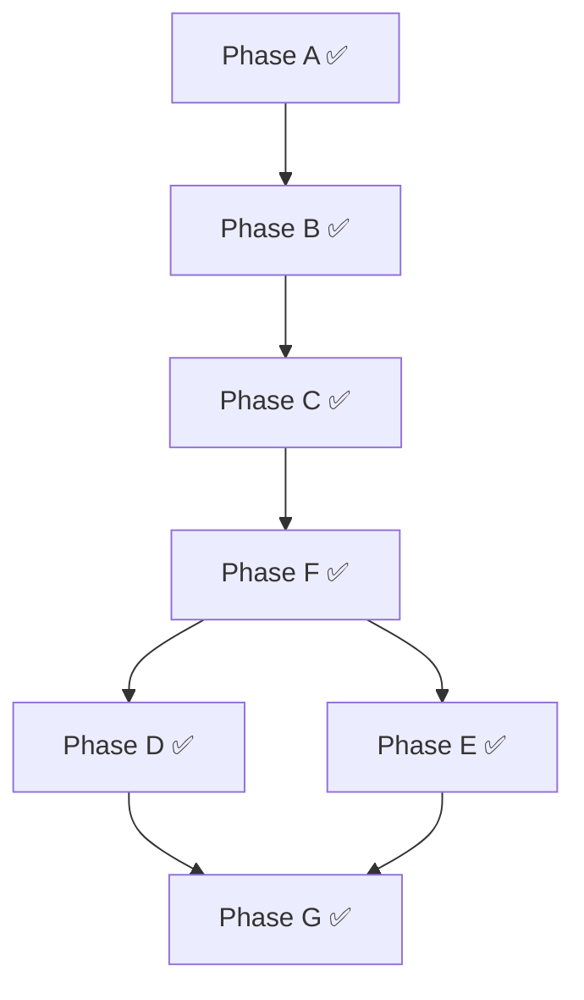

# Agent Execution Model — Remediation Plan

Consolidate the dual implementation of `docs/Temporal/ManagedAndExternalAgentExecutionModel.md` into the `moonmind/` package and get all phases working end-to-end.

---

## Problem (Resolved)

Core agent execution logic was split across `moonmind/` and `api_service/services/temporal/`. The prototype workflow used duplicate contracts and stub adapters.

**Status:** All phases (A–G) are complete. The agent execution model is fully consolidated into `moonmind/`. `MoonMind.Run` dispatches agent-type plan nodes to `MoonMind.AgentRun` as child workflows. The supervisor signals completion back to the workflow via a callback. Legacy `api_service/services/temporal/` and duplicate test directories have been removed.

---

## Target State

```
moonmind/
  schemas/
    agent_runtime_models.py        ← (keep) canonical contracts, single source of truth
  workflows/
    adapters/
      agent_adapter.py             ← (keep) AgentAdapter protocol
      jules_agent_adapter.py       ← (keep) production external adapter
      managed_agent_adapter.py     ← (keep) production managed adapter with auth-profile controls
    temporal/
      workflows/
        agent_run.py               ← (NEW) MoonMindAgentRun workflow, using canonical contracts + production adapters
        auth_profile_manager.py    ← (keep) slot management workflow
        run.py                     ← (modify) invoke MoonMind.AgentRun as child workflow
      runtime/                     ← (NEW directory)
        __init__.py
        launcher.py                ← (migrate from api_service/) managed subprocess launcher
        store.py                   ← (migrate from api_service/) managed run record persistence
        supervisor.py              ← (migrate from api_service/) heartbeat, timeout, exit classification
        log_streamer.py            ← (migrate from api_service/) artifact-backed log streaming

api_service/
  db/models.py                     ← (keep) ManagedAgentAuthProfile ORM model stays here
  api/routers/auth_profiles.py     ← (keep) CRUD API stays here
  services/temporal/               ← (DELETE entire subtree after migration)
```

---

## Phases

### Phase A — Delete Duplicate Contracts ✅ COMPLETE

**Goal:** Single source of truth for all agent runtime types.

1. Delete `api_service/services/temporal/workflows/shared.py`
2. Delete `api_service/services/temporal/adapters/base.py`
3. Delete `api_service/services/temporal/adapters/external.py` (stub, replaced by `JulesAgentAdapter`)
4. Delete `api_service/services/temporal/adapters/managed.py` (stub, replaced by production `ManagedAgentAdapter`)
5. Update all tests under `tests/services/temporal/` and `tests/unit/services/temporal/` to import from `moonmind.schemas.agent_runtime_models` and `moonmind.workflows.adapters`
6. Run `./tools/test_unit.sh` to verify nothing broke

**Files deleted:**
- `api_service/services/temporal/workflows/shared.py`
- `api_service/services/temporal/adapters/base.py`
- `api_service/services/temporal/adapters/external.py`
- `api_service/services/temporal/adapters/managed.py`

---

### Phase B — Migrate Runtime Layer ✅ COMPLETE

**Goal:** Move runtime components from `api_service/` to `moonmind/`, fixing any tight coupling.

1. Create `moonmind/workflows/temporal/runtime/` directory with `__init__.py`
2. Move (not copy) the following files, updating imports:
   - `api_service/services/temporal/runtime/store.py` → `moonmind/workflows/temporal/runtime/store.py`
   - `api_service/services/temporal/runtime/launcher.py` → `moonmind/workflows/temporal/runtime/launcher.py`
   - `api_service/services/temporal/runtime/supervisor.py` → `moonmind/workflows/temporal/runtime/supervisor.py`
   - `api_service/services/temporal/runtime/log_streamer.py` → `moonmind/workflows/temporal/runtime/log_streamer.py`

3. Fix `log_streamer.py` dependency on `moonmind.workflows.agent_queue.storage` — verify `AgentQueueArtifactStorage` is the right abstraction or replace with the Temporal artifact service.

4. Update corresponding tests:
   - Move tests from `tests/unit/services/temporal/runtime/` → `tests/unit/workflows/temporal/runtime/`
   - Update all imports

5. Delete `api_service/services/temporal/runtime/` directory

6. Run `./tools/test_unit.sh`

---

### Phase C — Migrate and Fix MoonMindAgentRun Workflow ✅ COMPLETE

**Goal:** Production-ready `MoonMind.AgentRun` workflow in `moonmind/` using canonical contracts and production adapters.

1. Create `moonmind/workflows/temporal/workflows/agent_run.py` based on the prototype at `api_service/services/temporal/workflows/agent_run.py`, with these changes:

   - **Use canonical contracts**: Import from `moonmind.schemas.agent_runtime_models` instead of the deleted `shared.py`
   - **Use production adapters**: Import `JulesAgentAdapter` from `moonmind.workflows.adapters.jules_agent_adapter`, `ManagedAgentAdapter` from `moonmind.workflows.adapters.managed_agent_adapter`
   - **Fix `failure_class`**: Replace `failure_class="Timeout"` with `failure_class="execution_error"` (valid `FailureClass` literal)
   - **Fix `execute_in_background_with_shield()`**: Replace with proper Temporal Python SDK cancellation cleanup pattern (detached cancellation scope or `workflow.unsafe.sandbox_unrestricted()`)
   - **Fix status comparison**: `AgentRunStatus` is now a `BaseModel` (not a `str` Enum). Status polling logic needs to compare against `status.status` field, not the model itself
   - **Wire supervisor signals**: When the managed adapter/supervisor completes, it should send a `completion_signal` to the `MoonMindAgentRun` workflow

2. Register `MoonMindAgentRun` in `moonmind/workflows/temporal/worker_runtime.py` alongside `MoonMindRun`, `MoonMindManifestIngest`, and `MoonMindAuthProfileManager`

3. Register the `publish_artifacts_activity` and `invoke_adapter_cancel` activities in the activity catalog (`moonmind/workflows/temporal/activity_catalog.py`) and bind them in `activity_runtime.py`

4. Migrate and update tests from `tests/unit/services/temporal/workflows/test_agent_run.py` → `tests/unit/workflows/temporal/test_agent_run.py`

5. Delete `api_service/services/temporal/workflows/agent_run.py`

6. Run `./tools/test_unit.sh`

---

### Phase D — Connect to Root Workflow ✅ COMPLETE

**Goal:** `MoonMind.Run` dispatches to `MoonMind.AgentRun` as a child workflow **per step** when a plan node requires an agent runtime.

> **Context:** The legacy `_auto_skill_handler` and `_build_runtime_planner` have been removed. There is no longer a `mm.skill.execute` activity handler. Phase D must provide the replacement dispatch mechanism within the existing plan execution loop.

#### Key Architectural Clarification

```
Task (MoonMind.Run workflow)
 └─ Plan (generated or provided)
     ├─ Step 1: sandbox.run_command        (activity)
     ├─ Step 2: MoonMind.AgentRun          (child workflow) → e.g. Gemini CLI
     ├─ Step 3: MoonMind.AgentRun          (child workflow) → e.g. Jules
     └─ Step 4: sandbox.run_tests          (activity)
```

- **Task** = one `MoonMind.Run` workflow execution (the root lifecycle)
- **Plan** = ordered sequence of steps for that task
- **Step** = one plan node, dispatched per-step based on its type
- **Agent invocation** = one step, one agent. A task can involve multiple different agents across steps.

`MoonMind.Run` provides the consistent task lifecycle envelope (state tracking, search attributes, pause/resume, cancellation, integration, dashboard visibility). The plan execution loop remains the core dispatch mechanism.

#### Design Decision

The plan execution loop in `_run_execution_stage()` gains a **step-level dispatch discriminator**:

- **Agent step** → the node's `tool.type` is `"agent_runtime"` (or a new field `execution_mode: "agent_runtime"`). `MoonMind.Run` starts `MoonMind.AgentRun` as a child workflow via `workflow.execute_child_workflow()`, constructing an `AgentExecutionRequest` from the node inputs.
- **Activity step** → the node dispatches to a standard Temporal activity (`sandbox.run_command`, integration activities, etc.) via the existing `workflow.execute_activity()` path. This preserves the ability to run simple bash scripts, tests, and other non-agent operations.

#### `AgentExecutionRequest` Construction (per step)

The execution loop must translate each agent-type plan node's inputs into an `AgentExecutionRequest`:

| Plan node field | `AgentExecutionRequest` field |
|---|---|
| `inputs.targetRuntime` / `inputs.runtime.mode` | `agent_id` |
| `inputs.repository` / `inputs.repo` | `workspace_spec` |
| `inputs.instructions` | `instruction_ref` (or inline) |
| `inputs.runtime.model` | `parameters.model` |
| `inputs.runtime.effort` | `parameters.effort` |
| `inputs.publishMode` | `parameters.publish_mode` |
| `inputs.startingBranch` / `inputs.newBranch` | `workspace_spec` branch fields |
| `inputs.executionProfileRef` | `execution_profile_ref` |
| derived from `agent_id` | `agent_kind` (`managed` or `external`) |
| parent workflow `mm_owner_id` | `correlation_id` / principal |

#### Implementation Steps

1. In `_run_execution_stage()`, after resolving the route for each plan node, check whether the node requires agent-runtime dispatch (by `tool.type`, `execution_mode`, or route `activity_type`).

2. If agent dispatch:
   - Build `AgentExecutionRequest` from node inputs + parent workflow context
   - Call `workflow.execute_child_workflow("MoonMind.AgentRun", request, ...)`
   - Map `AgentRunResult` to the same result format expected by the execution loop

3. If activity dispatch:
   - Use the existing `workflow.execute_activity(route.activity_type, ...)` path (unchanged)

4. Add unit tests for the dispatch discriminator and `AgentExecutionRequest` builder.

5. Add integration tests verifying a multi-step plan with mixed agent and activity steps.

---

### Phase E — Wire Supervisor → Workflow Signals ✅ COMPLETE

**Goal:** Managed runtime supervisor completion events translate into Temporal Signals on the `AgentRun` workflow.

> **Dependency:** Phase E can proceed in parallel with Phase D. The `MoonMind.AgentRun` workflow already defines a `completion_signal` handler; this phase wires the supervisor to actually send that signal.

1. Pass `workflow_id` into `ManagedAgentAdapter.start()` so it can store the parent workflow ID in the `ManagedRunRecord`.

2. After `ManagedRunSupervisor.supervise()` completes (or times out), the supervisor (or a wrapper) calls:
   ```python
   temporal_client.get_workflow_handle(workflow_id).signal("completion_signal", result_dict)
   ```

3. This replaces the current poll-only fallback and enables the callback-first model the spec requires.

4. The supervisor needs access to a Temporal client. Options:
   - Inject a client factory into the supervisor at construction time
   - Have the supervisor emit events and let a thin Temporal-aware wrapper translate them into signals

---

### Phase F — Bind Agent Runtime Fleet ✅ COMPLETE

**Done:**
- `MoonMind.AgentRun` added to `REGISTERED_TEMPORAL_WORKFLOW_TYPES`
- `agent_runtime.publish_artifacts` and `agent_runtime.cancel` activity definitions added to `activity_catalog.py`
- `@workflow.defn(name="MoonMind.AgentRun")` set on the workflow class
- Legacy `_auto_skill_handler`, `_build_runtime_planner`, and all supporting code (~862 lines) removed from `worker_runtime.py`
- Legacy tests (~768 lines) removed from `test_temporal_worker_runtime.py`

---

### Phase G — Cleanup ✅ COMPLETE

**Done:**
- `api_service/services/temporal/` was already deleted in earlier phases
- `tests/services/temporal/` (duplicate runtime tests) deleted
- `tests/unit/services/temporal/workflows/` (empty — only `__init__.py`) deleted
- No remaining imports of `api_service.services.temporal` anywhere in the codebase
- 479/480 tests pass (sole failure is pre-existing, unrelated to agent model)

---

## Dependency Order



All phases are complete.

---

## Risk Notes

- **`ManagedRunStore` uses local JSON files** — works for single-container, but won't scale. Consider migrating to DB-backed storage (new ORM model) or Temporal workflow state. This can be a follow-up after the consolidation.
- **`log_streamer.py` depends on `AgentQueueArtifactStorage`** — verify this is compatible with the Temporal artifact service used elsewhere, or adapt to use `TemporalArtifactService`.
- **`ManagedAgentAdapter.status()` and `fetch_result()` are stubs** in the production adapter — these need to be connected to the migrated runtime layer (store + supervisor) during Phase C.
- **Callback infrastructure for external agents** (webhooks, signature verification, presigned URLs) is not covered by this plan. That's a separate effort once the foundation is solid.
