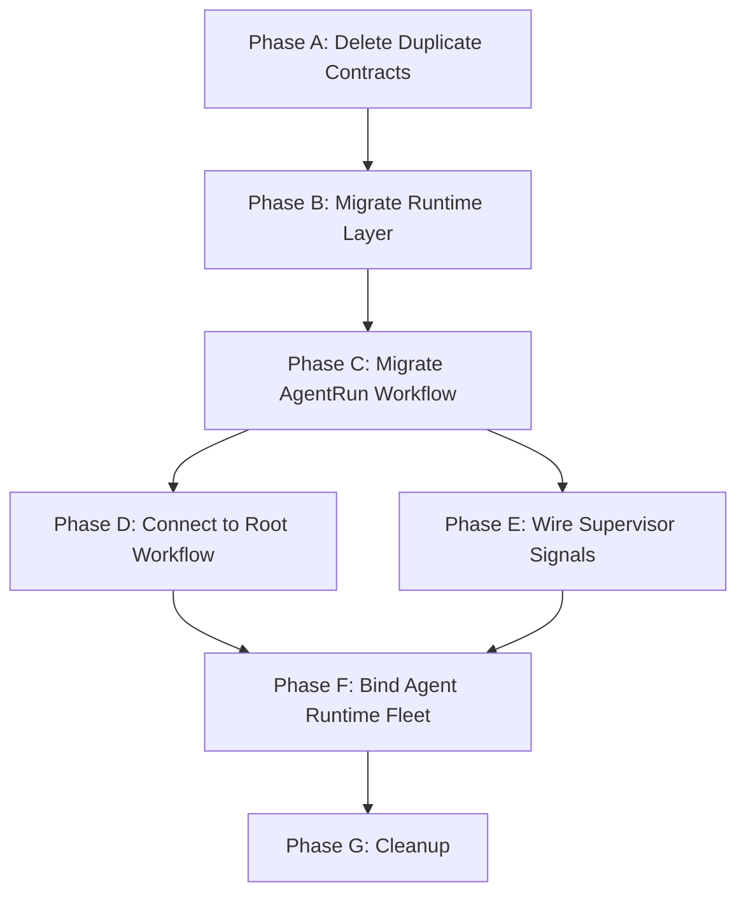

# Agent Execution Model — Remediation Plan

Consolidate the dual implementation of `docs/Temporal/ManagedAndExternalAgentExecutionModel.md` into the `moonmind/` package and get all phases working end-to-end.

---

## Problem

Core agent execution logic is split across two locations:

- **`moonmind/`** — canonical contracts, production adapters (`JulesAgentAdapter`, `ManagedAgentAdapter`), `AuthProfileManager` workflow. All registered in the production worker.
- **`api_service/services/temporal/`** — prototype `MoonMindAgentRun` workflow, runtime layer (launcher, supervisor, store, log streamer), and stub adapters. **None of this is registered in the production worker.**

The prototype workflow uses duplicate, unvalidated contracts and stub adapters instead of the production-quality code in `moonmind/`.

---

## Target State

```
moonmind/
  schemas/
    agent_runtime_models.py        ← (keep) canonical contracts, single source of truth
  workflows/
    adapters/
      agent_adapter.py             ← (keep) AgentAdapter protocol
      jules_agent_adapter.py       ← (keep) production external adapter
      managed_agent_adapter.py     ← (keep) production managed adapter with auth-profile controls
    temporal/
      workflows/
        agent_run.py               ← (NEW) MoonMindAgentRun workflow, using canonical contracts + production adapters
        auth_profile_manager.py    ← (keep) slot management workflow
        run.py                     ← (modify) invoke MoonMind.AgentRun as child workflow
      runtime/                     ← (NEW directory)
        __init__.py
        launcher.py                ← (migrate from api_service/) managed subprocess launcher
        store.py                   ← (migrate from api_service/) managed run record persistence
        supervisor.py              ← (migrate from api_service/) heartbeat, timeout, exit classification
        log_streamer.py            ← (migrate from api_service/) artifact-backed log streaming

api_service/
  db/models.py                     ← (keep) ManagedAgentAuthProfile ORM model stays here
  api/routers/auth_profiles.py     ← (keep) CRUD API stays here
  services/temporal/               ← (DELETE entire subtree after migration)
```

---

## Phases

### Phase A — Delete Duplicate Contracts

**Goal:** Single source of truth for all agent runtime types.

1. Delete `api_service/services/temporal/workflows/shared.py`
2. Delete `api_service/services/temporal/adapters/base.py`
3. Delete `api_service/services/temporal/adapters/external.py` (stub, replaced by `JulesAgentAdapter`)
4. Delete `api_service/services/temporal/adapters/managed.py` (stub, replaced by production `ManagedAgentAdapter`)
5. Update all tests under `tests/services/temporal/` and `tests/unit/services/temporal/` to import from `moonmind.schemas.agent_runtime_models` and `moonmind.workflows.adapters`
6. Run `./tools/test_unit.sh` to verify nothing broke

**Files deleted:**
- `api_service/services/temporal/workflows/shared.py`
- `api_service/services/temporal/adapters/base.py`
- `api_service/services/temporal/adapters/external.py`
- `api_service/services/temporal/adapters/managed.py`

---

### Phase B — Migrate Runtime Layer

**Goal:** Move runtime components from `api_service/` to `moonmind/`, fixing any tight coupling.

1. Create `moonmind/workflows/temporal/runtime/` directory with `__init__.py`
2. Move (not copy) the following files, updating imports:
   - `api_service/services/temporal/runtime/store.py` → `moonmind/workflows/temporal/runtime/store.py`
   - `api_service/services/temporal/runtime/launcher.py` → `moonmind/workflows/temporal/runtime/launcher.py`
   - `api_service/services/temporal/runtime/supervisor.py` → `moonmind/workflows/temporal/runtime/supervisor.py`
   - `api_service/services/temporal/runtime/log_streamer.py` → `moonmind/workflows/temporal/runtime/log_streamer.py`

3. Fix `log_streamer.py` dependency on `moonmind.workflows.agent_queue.storage` — verify `AgentQueueArtifactStorage` is the right abstraction or replace with the Temporal artifact service.

4. Update corresponding tests:
   - Move tests from `tests/unit/services/temporal/runtime/` → `tests/unit/workflows/temporal/runtime/`
   - Update all imports

5. Delete `api_service/services/temporal/runtime/` directory

6. Run `./tools/test_unit.sh`

---

### Phase C — Migrate and Fix MoonMindAgentRun Workflow

**Goal:** Production-ready `MoonMind.AgentRun` workflow in `moonmind/` using canonical contracts and production adapters.

1. Create `moonmind/workflows/temporal/workflows/agent_run.py` based on the prototype at `api_service/services/temporal/workflows/agent_run.py`, with these changes:

   - **Use canonical contracts**: Import from `moonmind.schemas.agent_runtime_models` instead of the deleted `shared.py`
   - **Use production adapters**: Import `JulesAgentAdapter` from `moonmind.workflows.adapters.jules_agent_adapter`, `ManagedAgentAdapter` from `moonmind.workflows.adapters.managed_agent_adapter`
   - **Fix `failure_class`**: Replace `failure_class="Timeout"` with `failure_class="execution_error"` (valid `FailureClass` literal)
   - **Fix `execute_in_background_with_shield()`**: Replace with proper Temporal Python SDK cancellation cleanup pattern (detached cancellation scope or `workflow.unsafe.sandbox_unrestricted()`)
   - **Fix status comparison**: `AgentRunStatus` is now a `BaseModel` (not a `str` Enum). Status polling logic needs to compare against `status.status` field, not the model itself
   - **Wire supervisor signals**: When the managed adapter/supervisor completes, it should send a `completion_signal` to the `MoonMindAgentRun` workflow

2. Register `MoonMindAgentRun` in `moonmind/workflows/temporal/worker_runtime.py` alongside `MoonMindRun`, `MoonMindManifestIngest`, and `MoonMindAuthProfileManager`

3. Register the `publish_artifacts_activity` and `invoke_adapter_cancel` activities in the activity catalog (`moonmind/workflows/temporal/activity_catalog.py`) and bind them in `activity_runtime.py`

4. Migrate and update tests from `tests/unit/services/temporal/workflows/test_agent_run.py` → `tests/unit/workflows/temporal/test_agent_run.py`

5. Delete `api_service/services/temporal/workflows/agent_run.py`

6. Run `./tools/test_unit.sh`

---

### Phase D — Connect to Root Workflow

**Goal:** `MoonMind.Run` invokes `MoonMind.AgentRun` as a child workflow when the task requires a true agent runtime.

1. In `moonmind/workflows/temporal/workflows/run.py`, add a code path that starts `MoonMind.AgentRun` as a child workflow when the execution step requires an agent runtime (not a plain LLM call)

2. The decision point should be based on something like:
   - The step's `skill_id` or `activity_type` indicates an agent runtime
   - Or an explicit `agent_kind` / `agent_id` is present in the step parameters

3. Pass the `AgentExecutionRequest` as the child workflow input

4. Receive the `AgentRunResult` back and continue the parent workflow

5. Ensure child workflow cancellation propagates correctly (parent cancel → child cancel → adapter cancel)

6. Add integration-style tests verifying the parent-child workflow interaction

---

### Phase E — Wire Supervisor → Workflow Signals

**Goal:** Managed runtime supervisor completion events translate into Temporal Signals on the `AgentRun` workflow.

1. After `ManagedRunSupervisor.supervise()` completes (or times out), it needs to send a `completion_signal` to the `MoonMindAgentRun` workflow that started the run

2. This requires the supervisor to know the parent workflow ID. Options:
   - Pass `workflow_id` into the supervisor at launch time
   - Store it in `ManagedRunRecord`
   - Use a Temporal client to signal the parent workflow

3. The `ManagedAgentAdapter.start()` should store the `workflow_id` in the run handle metadata so the supervisor can retrieve it

4. After supervision completes, the supervisor (or a wrapper around it) calls:
   ```python
   temporal_client.get_workflow_handle(workflow_id).signal("completion_signal", result_dict)
   ```

5. This replaces the current poll-only fallback and enables the callback-first model the spec requires

---

### Phase F — Bind Agent Runtime Fleet

**Goal:** Activities for managed agent runtime execution are registered on the `mm.activity.agent_runtime` task queue.

1. Add activity definitions to `moonmind/workflows/temporal/activity_catalog.py` for agent runtime activities:
   - `agent_runtime.launch` — launch a managed agent subprocess
   - `agent_runtime.status` — read supervisor state for a run
   - `agent_runtime.cancel` — cancel a managed run
   - `agent_runtime.fetch_result` — collect final outputs

2. Implement these activities in a new `TemporalAgentRuntimeActivities` class (similar pattern to `TemporalSandboxActivities`) in `activity_runtime.py`

3. Add bindings in `build_activity_bindings()` for the `agent_runtime` fleet

4. Ensure the `temporal-worker-agent-runtime` Docker service in `docker-compose.yaml` starts workers that register these activities

---

### Phase G — Cleanup

1. Delete `api_service/services/temporal/` directory entirely (should be empty after migrations)
2. Delete or redirect any remaining test files under `tests/services/temporal/` and `tests/unit/services/temporal/`
3. Verify all tests pass: `./tools/test_unit.sh`
4. Verify Docker Compose starts cleanly: `docker compose up -d`

---

## Dependency Order



Phases A → B → C are sequential prerequisites. D and E can run in parallel after C. F depends on both D and E. G is the final cleanup.

---

## Risk Notes

- **`ManagedRunStore` uses local JSON files** — works for single-container, but won't scale. Consider migrating to DB-backed storage (new ORM model) or Temporal workflow state. This can be a follow-up after the consolidation.
- **`log_streamer.py` depends on `AgentQueueArtifactStorage`** — verify this is compatible with the Temporal artifact service used elsewhere, or adapt to use `TemporalArtifactService`.
- **`ManagedAgentAdapter.status()` and `fetch_result()` are stubs** in the production adapter — these need to be connected to the migrated runtime layer (store + supervisor) during Phase C.
- **Callback infrastructure for external agents** (webhooks, signature verification, presigned URLs) is not covered by this plan. That's a separate effort once the foundation is solid.
