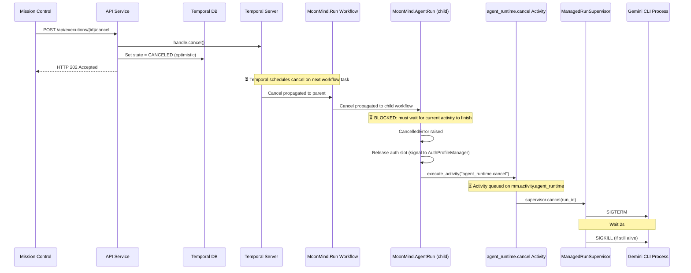

# Gemini CLI Task Cancellation — Root Cause Analysis

## Summary

Cancelling a `gemini_cli` managed task from Mission Control is slow because the cancel request must traverse a **5-hop pipeline** — each hop introducing latency — before the actual agent process gets killed. The cancer also cannot interrupt activities that are currently executing, meaning the workflow must wait for the current activity to complete before it can process the cancellation.

---

## Cancellation Pipeline



---

## Root Causes of Slowness

### 1. **Activity-in-progress blocks cancellation (PRIMARY CAUSE)**

The `MoonMindAgentRun` workflow's main loop sits in `workflow.wait_condition()` with a `poll_interval` timeout (default **10 seconds**). However, this isn't the main problem. The real issue is that **Temporal cancellation cannot interrupt a currently-executing activity**.

When a cancel is requested:
- If the workflow is between activities (in `wait_condition`), it gets cancelled relatively quickly.
- If the workflow is **inside** `execute_activity()` (e.g., `agent_runtime.launch`, `integration.*.status`, `agent_runtime.publish_artifacts`), Temporal must wait for that activity to **complete or time out** before the `CancelledError` is delivered.

Some of these activities have timeouts up to **5 minutes** (`AGENT_RUNTIME_ACTIVITY_TIMEOUT`, `INTEGRATIONS_ACTIVITY_TIMEOUT`).

> 📍 [agent_run.py:38-42](file:///Users/nsticco/MoonMind/moonmind/workflows/temporal/workflows/agent_run.py#L38-L42)

### 2. **Cancel activity dispatch adds queuing latency**

After the `CancelledError` is caught, the workflow dispatches a **new activity** (`agent_runtime.cancel`) to the `mm.activity.agent_runtime` task queue with a 1-minute timeout. If the agent-runtime worker fleet is busy or has only one worker, this activity sits in the queue waiting to be picked up.

> 📍 [agent_run.py:367-373](file:///Users/nsticco/MoonMind/moonmind/workflows/temporal/workflows/agent_run.py#L367-L373)

### 3. **Child workflow cancel propagation**

For Temporal-executed tasks, the `MoonMind.Run` workflow runs `MoonMind.AgentRun` as a **child workflow**. Cancel propagation from parent to child adds another round-trip through the Temporal server. If the parent is itself blocked in an activity, the cancel doesn't even reach the child immediately.

> 📍 [run.py:451-456](file:///Users/nsticco/MoonMind/moonmind/workflows/temporal/workflows/run.py#L451-L456)

### 4. **Auth slot release before process kill**

In the `CancelledError` handler, the workflow first tries to release the auth slot by signaling the `AuthProfileManager` workflow **before** dispatching the cancel activity. If the AuthProfileManager is slow to respond or not running, this adds delay before the actual process gets killed.

> 📍 [agent_run.py:345-355](file:///Users/nsticco/MoonMind/moonmind/workflows/temporal/workflows/agent_run.py#L345-L355)

### 5. **Graceful shutdown wait**

The supervisor's `_terminate_process` sends `SIGTERM` and waits **2 seconds** before sending `SIGKILL`. Gemini CLI may not handle `SIGTERM` quickly (it may be in the middle of an API call or file write), so this adds 2s minimum.

> 📍 [supervisor.py:197-207](file:///Users/nsticco/MoonMind/moonmind/workflows/temporal/runtime/supervisor.py#L197-L207)

---

## Recommendations

### Quick Wins (no architectural change)

| # | Change | Impact | File |
|---|--------|--------|------|
| 1 | **Enable Temporal activity cancellation** via `cancellation_type=ActivityCancellationType.TRY_CANCEL` on `execute_activity` calls in `agent_run.py`. This lets Temporal deliver cancellation to activities without waiting for them to complete. | High — eliminates the #1 bottleneck | [agent_run.py](file:///Users/nsticco/MoonMind/moonmind/workflows/temporal/workflows/agent_run.py) |
| 2 | **Kill the process directly from the workflow** instead of dispatching a separate activity. Use `workflow.execute_local_activity()` or send a direct signal to the supervisor, avoiding the task queue hop entirely. | Medium — eliminates queuing delay | [agent_run.py](file:///Users/nsticco/MoonMind/moonmind/workflows/temporal/workflows/agent_run.py) |
| 3 | **Parallelize slot release and process cancel** — run both concurrently in the `CancelledError` handler using `asyncio.gather()` instead of sequentially. | Low-Medium — shaves seconds | [agent_run.py](file:///Users/nsticco/MoonMind/moonmind/workflows/temporal/workflows/agent_run.py) |
| 4 | **Reduce `GRACEFUL_TERMINATE_WAIT_SECONDS`** from 2.0 to 0.5 seconds. Gemini CLI doesn't need graceful shutdown — it's a CLI tool running agent loops. | Low — but consistent 1.5s saved | [supervisor.py](file:///Users/nsticco/MoonMind/moonmind/workflows/temporal/runtime/supervisor.py) |

### Medium-Term Improvements

| # | Change | Impact |
|---|--------|--------|
| 5 | **Add heartbeat-based cancellation** to long-running activities. Activities that check `activity.heartbeat()` and detect cancellation can self-terminate immediately. This requires modifying the activity implementations. | High |
| 6 | **Bypass the Temporal cancel path for managed agents** — send a "cancel" signal to the supervisor directly from the API service (via a Temporal signal or a direct IPC channel), then let the workflow catch up asynchronously. The UI would see immediate feedback. | High |
| 7 | **Add a cancel-requested flag to the workflow query handler** so the dashboard can poll/detect that cancellation is in progress and show appropriate UI feedback immediately. | UX improvement |

---

## Which Fix to Prioritize

**Fix #1 (TRY_CANCEL)** is the highest-impact, lowest-risk change. By default, Temporal activities use `WAIT_CANCELLATION_COMPLETED` mode, which means the workflow won't process the cancellation until the current activity finishes. Switching to `TRY_CANCEL` mode lets Temporal deliver `CancelledError` to the workflow immediately, even while an activity is running.

In `agent_run.py`, every `execute_activity` call in the main polling loop and the launch/status calls should use:

```python
from temporalio.workflow import ActivityCancellationType

await workflow.execute_activity(
    "agent_runtime.launch",
    ...,
    cancellation_type=ActivityCancellationType.TRY_CANCEL,
)
```

Combined with **Fix #3** (parallelize slot release + cancel), this would make cancellation respond within seconds instead of potentially minutes.
