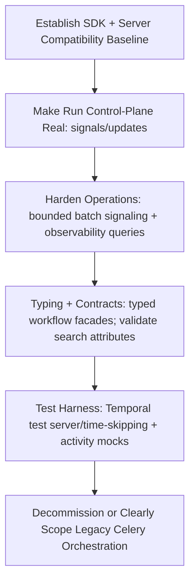
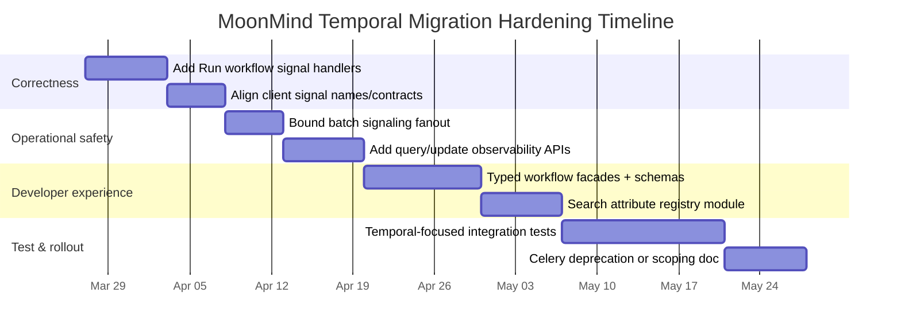

# MoonMind Temporal Migration Review and Idiomatic-Pattern Assessment

## Executive summary

MoonMind’s migration toward Temporal is **substantial but not complete**, both functionally and idiomatically. The repository contains a serious Temporal implementation—multiple production-grade workflows (e.g., `MoonMind.Run`, `MoonMind.AgentRun`, `MoonMind.AuthProfileManager`, `MoonMind.ManifestIngest`), a worker “fleet” topology, activity routing with per-activity timeouts/retries/heartbeats, and a client adapter that centralizes workflow start/signal/update/schedule operations. citeturn26view0turn36view2turn45view0turn46view3turn20view0

However, several signals in the codebase indicate the overall migration is still underway:

- The repository’s own README warns that a release is expected **after the “full migration to Temporal”**, implying the team does not consider the migration done yet. citeturn4view0  
- The root Python project configuration still includes **Celery** (and lacks an obvious pinned `temporalio` dependency in the root `pyproject.toml`), supporting the likelihood of a hybrid orchestration era and/or packaging drift. citeturn14view0  
- The flagship workflow (`MoonMind.Run`) contains internal state flags for pause/reschedule/cancel flows, but (based on what is visible in this repo scan) does **not** actually define corresponding `@workflow.signal` / `@workflow.update` handlers in that file, even though the client layer sends `pause`, `resume`, and `reschedule` signals. This is a high-likelihood functional gap, not just a style issue. citeturn21view0turn36view2turn30view1  

Overall assessment: **Core Temporal adoption is real and thoughtfully designed (especially around worker segmentation and activity routing), but there are identifiable remaining gaps to reach “idiomatic Temporal” completeness**—especially around typed APIs, signal/update semantics consistency, workflow-level ergonomics, migration/versioning hygiene, and end-to-end test coverage patterns.

## Scope and repository snapshot

MoonMind is primarily a Python repository (dominant language share shown by GitHub), so this assessment focuses on **Temporal Python SDK** patterns. citeturn1view0

The Temporal footprint in `main` includes:

- A centralized Temporal client adapter: `moonmind/workflows/temporal/client.py` citeturn20view0turn21view0  
- Worker topology / fleet model: `moonmind/workflows/temporal/workers.py` citeturn45view0turn45view1  
- Activity routing + per-activity execution policy: `moonmind/workflows/temporal/activity_catalog.py` citeturn46view2turn46view3  
- Key workflows:  
  - `moonmind/workflows/temporal/workflows/run.py` (`MoonMind.Run`) citeturn28view0turn31view2  
  - `moonmind/workflows/temporal/workflows/agent_run.py` (`MoonMind.AgentRun`) citeturn34view1turn34view2turn34view3  
  - `moonmind/workflows/temporal/workflows/auth_profile_manager.py` (`MoonMind.AuthProfileManager`) citeturn36view1turn36view2turn36view3  
  - `moonmind/workflows/temporal/workflows/manifest_ingest.py` (`MoonMind.ManifestIngest`) citeturn40view0  

Limitations of this review:

- I could not actually “clone all branches and analyze all commits” in an automated way in this environment; the findings are based on a targeted inspection of the Temporal surface area in `main` and repository-visible artifacts via GitHub browsing. Where commit/PR/issue archaeology is critical, I mark it as **unspecified** rather than inventing history.

## Temporal architecture observed

### Client and control plane patterns

MoonMind wraps Temporal `Client.connect()` with a shared adapter that uses a **pydantic data converter**, which is a common and reasonable approach when payloads are mostly Pydantic models. citeturn20view0

The adapter supports:

- `start_workflow()` with configurable workflow type/id, memo, search attributes, and an optional `start_delay`. citeturn20view0  
- Signals (`signal_workflow`, specialized `send_reschedule_signal`) and updates (`execute_update`). citeturn20view0  
- Visibility-based “drain metrics” (`count_workflows`) and a manual batch-signal loop across running executions. citeturn21view0  
- Schedule CRUD via `client.create_schedule()` (and related helpers), including templated workflow IDs and schedule-time search attributes. citeturn21view0  

**Idiomatic baseline reference:** Temporal’s Python SDK documentation emphasizes that clients are created outside workflow code and used by services/activities, not inside workflows. citeturn13search4  
MoonMind follows that: the client adapter is in normal service code, not workflow code. citeturn20view0

### Worker topology and fleet segmentation

MoonMind has a non-trivial worker topology model: it defines worker “fleets” (workflow vs activity fleets) with explicit service names, task queues, and capability/egress policies. citeturn45view0turn45view1

Example: the code enumerates worker fleets and maps them to service names and task queues (e.g., `mm.workflow`, `mm.activity.artifacts`, `mm.activity.llm`, etc.). citeturn20view0turn46view2turn45view0

This is a strong sign of an intended “Temporal-native” operational model: different activity classes (IO-bound, LLM rate-limited, sandbox CPU-heavy) are separated to allow independent scaling and isolation. citeturn45view0turn46view3

### Activity catalog, timeouts, retries, and heartbeats

`activity_catalog.py` defines activity metadata including:

- Task queue and fleet routing  
- A `timeouts` object (with multiple durations)  
- Retry policy settings via helper `_activity_retries()`  
- Explicit heartbeat configuration for long-running activities

For example, sandbox activities include a heartbeat timeout and mark `heartbeat_required=True`, which is consistent with Temporal best practice: long-running activities should heartbeat to enable responsive cancellation and liveness tracking. citeturn46view3turn44search5turn44search6

Illustrative excerpt (MoonMind-defined activity policy metadata):
```python
TemporalActivityDefinition(
  activity_type="sandbox.apply_patch",
  task_queue=cfg.activity_sandbox_task_queue,
  fleet=SANDBOX_FLEET,
  timeouts=TemporalActivityTimeouts(600, 900, heartbeat_timeout_seconds=30),
  retries=_activity_retries(max_attempts=2, max_interval_seconds=300),
  heartbeat_required=True,
)
```
citeturn46view3turn46view2

This is one of MoonMind’s most “idiomatic Temporal” areas: explicit timeouts + heartbeats + fleet routing is the right mental model for reliable orchestration. citeturn46view3turn44search6

### Workflow patterns: orchestration, child workflows, signals/queries, and versioning

MoonMind’s workflows show a mix of maturity levels:

- `MoonMind.AuthProfileManager` is particularly idiomatic: it uses multiple `@workflow.signal` handlers and exposes a `@workflow.query` state view. It also uses a `continue-as-new` threshold constant to bound history growth—one of the canonical Temporal patterns for long-lived workflows. citeturn36view2turn36view3turn36view0  
- `MoonMind.AgentRun` uses `@workflow.signal` handlers (`completion_signal`, `slot_assigned`) for coordination, and it communicates with the auth-profile-manager via external workflow signals. citeturn34view2turn34view3  
- `MoonMind.Run` is a large orchestrator: it executes activities (e.g., `plan.generate`, `artifact.read`) and launches child workflows for agent runtime nodes via `workflow.execute_child_workflow("MoonMind.AgentRun", ...)`. citeturn31view2turn28view0  
- `MoonMind.Run` also uses `workflow.patched(...)` gates for replay-safe evolution (e.g., introducing idempotency keys and enabling “jules bundling”). citeturn31view2turn26view0  

**Idiomatic baseline reference:** The Temporal Python SDK documentation explicitly covers workflow sandboxing, signals/updates, external workflows, child workflows, and testing/time skipping; it also documents the sandbox “passthrough imports” concept that MoonMind uses. citeturn44search6turn44search0  

## Idiomatic-pattern assessment with concrete findings

### What looks complete and idiomatic

MoonMind has several areas that already align strongly with Temporal’s intended usage patterns:

- Clear separation between workflow orchestration (`mm.workflow`) and activity task queues (`mm.activity.*`) with fleet metadata designed for scaling and isolation. citeturn46view2turn45view0  
- Explicit activity execution controls (timeouts/retries/heartbeats) encoded centrally in the activity catalog, which makes reliability behavior consistent and reviewable. citeturn46view3turn44search5turn44search6  
- Use of `workflow.execute_child_workflow` for agent runtime runs in `MoonMind.Run`, rather than doing “agent execution” as a plain activity (which would lose orchestration richness and independently queryable child history). citeturn31view2  
- Use of `workflow.patched(...)` to gate behavioral changes in a replay-stable way, which is the correct approach when you must evolve workflow logic over time. citeturn26view0turn31view2turn36view0  
- Long-lived manager workflow (`AuthProfileManager`) exposing query state and using signals as the coordination mechanism. citeturn36view2turn36view3  

### What appears incomplete or non-idiomatic

The remaining issues fall into four broad buckets: “missing semantics”, “weak typing/contracts”, “operational scaling edges”, and “migration hygiene”.

#### Missing semantics: signals/updates in `MoonMind.Run` do not align with client behavior

`TemporalClientAdapter` sends `pause`/`resume` signals in batch and can send a `reschedule` signal. citeturn21view0turn20view0  
`MoonMind.Run` contains internal flags (`self._paused`, `self._reschedule_requested`, `self._cancel_requested`) and waits on them using `workflow.wait_condition`. citeturn30view1turn32view2turn32view1  

But in the visible `run.py` content, the workflow defines `@workflow.defn` and `@workflow.run` but **does not show `@workflow.signal` / `@workflow.update` handlers** that would toggle these flags. citeturn31view2turn28view0  

Why this matters:

- If `pause`/`resume`/`reschedule` signals are sent to a workflow that doesn’t handle them, you may end up with **dead control paths** (operators think they can pause/resume, but the workflow never changes state).
- It also indicates the migration is not “semantically complete”: the control-plane API exists, but the workflow contract may not.

This is the single most important “remaining improvement” because it can be both a correctness issue and a user-facing feature gap.

#### Weak typing/contracts: heavy stringly-typed workflow and search attribute usage

MoonMind uses workflow names and activity types mostly as strings (e.g., `"MoonMind.Run"`, `"plan.generate"`), and it constructs Visibility queries manually (string query with `TaskQueue IN (...)`). citeturn21view0turn31view2turn45view0  

This is not inherently wrong, but it’s less idiomatic for Python, where many teams prefer:

- referencing activities/workflows as callables (or at least central constants) for refactor safety
- typed search attributes or validated mappings rather than “any mapping becomes `[v]`” for search attributes

MoonMind already centralizes activity routing and timeouts in the activity catalog (good), but the client adapter still constructs search attributes in a relatively ad hoc way. citeturn20view0turn21view0

#### Operational scaling edges: batch signal implementation creates an unbounded task list

The batch pause/resume logic iterates over workflows and creates an asyncio task per workflow, then `gather`s them all. Even with a semaphore limiting concurrent signal sends, the list of tasks can still grow to “number of running workflows”, which can become memory-heavy at larger scale. citeturn21view0  

This is a classic scaling footgun for operations.

#### Migration hygiene: repository-level dependency and coexistence signals

The root `pyproject.toml` shows `celery` is still a declared dependency, and does not obviously list `temporalio`. citeturn14view0  
The repo also states a release is expected after “full migration to Temporal.” citeturn4view0  

This strongly suggests the “migration toward Temporal” is not finalized in the build/deploy story (even if much of the code exists).

## Current vs idiomatic pattern comparison

| Area | Current MoonMind pattern (evidence) | Idiomatic Temporal Python pattern (primary references) | Remaining gap / impact |
|---|---|---|---|
| Worker/task queue topology | Multiple worker fleets, explicit task queues (`mm.workflow`, `mm.activity.*`), with fleet metadata for isolation/scaling citeturn45view0turn46view2 | Separate task queues for different activity classes is standard; keep workflows lean and push side effects to activities citeturn44search6 | Looks strong; main remaining work is tightening semantics and tests rather than architecture |
| Activity timeouts/retries/heartbeats | Central activity catalog defines timeouts/retries; some activities require heartbeat (e.g., sandbox, openclaw) citeturn46view3 | Long-running activities should heartbeat; activity calls must specify timeouts; retries should be explicit where needed citeturn44search5turn44search6 | Generally good; verify activities actually heartbeat when `heartbeat_required=True` |
| Workflow orchestration | `MoonMind.Run` executes activities and child workflows; uses `workflow.patched` for evolution citeturn31view2turn26view0 | Use child workflows for complex sub-orchestrations; use versioning patterns for safe workflow changes citeturn44search6turn44search0 | Missing visible signal/update handlers in `MoonMind.Run` limits operability |
| Signals/queries | `AuthProfileManager` uses many signals + query (`get_state`) citeturn36view2turn36view3 | Signals for async external input; queries for read-only state; updates for synchronous state transitions where appropriate citeturn44search6 | Strong in the manager workflows; likely incomplete in `MoonMind.Run` control-plane features |
| Client usage | Central adapter wraps Client.connect and uses pydantic converter; does scheduling and signaling citeturn20view0turn21view0 | Clients should not run inside workflow code; client connections centralized; data conversion consistent citeturn13search4turn44search6 | Good direction; consider stronger typing + bounded batch operations |
| Long-running workflow history control | Auth manager has event threshold constant and mentions continue-as-new usage citeturn36view0turn36view1 | Use continue-as-new to bound history for long-running control-plane workflows citeturn44search1turn44search6 | Good. Ensure other long-lived loops use similar strategies if applicable |

## Prioritized recommendations and migration steps

### Highest priority fixes

These are prioritized by risk (correctness/operability), not just elegance.

#### Implement explicit control-plane signals (and/or updates) for `MoonMind.Run`

**Problem:** `MoonMind.Run` waits on `_paused` and `_reschedule_requested`, and the client adapter sends `pause`/`resume`/`reschedule` signals, but the workflow file does not visibly expose `@workflow.signal` handlers for these. citeturn21view0turn30view1turn32view2  

**Minimal refactor (non-breaking if you keep signal names):**
```python
@workflow.defn(name="MoonMind.Run")
class MoonMindRunWorkflow:
    # ...

    @workflow.signal(name="pause")
    def pause(self) -> None:
        self._paused = True

    @workflow.signal(name="resume")
    def resume(self) -> None:
        self._paused = False

    @workflow.signal(name="reschedule")
    def reschedule(self, scheduled_for_iso: str) -> None:
        self._scheduled_for = scheduled_for_iso
        self._reschedule_requested = True

    @workflow.signal(name="cancel")
    def cancel(self) -> None:
        self._cancel_requested = True
```

**Why idiomatic:** This matches Temporal’s documented “signal handler” model for Python workflows. citeturn44search6turn36view2  

**Breaking vs non-breaking:** non-breaking if you keep public names (`pause`, `resume`, `reschedule`) aligned with the existing client adapter. citeturn21view0turn20view0

#### Bound batch signal fan-out to avoid large in-memory `tasks` lists

**Problem:** `_send_signal_to_running_workflows` collects a task for each workflow then gathers them, which can grow too large. citeturn21view0  

**Minimal change approach:** accumulate tasks in a fixed-size window (e.g., 500–2,000) and `await gather()` per window, or consume using `asyncio.as_completed` to keep memory bounded.

Pseudo-diff logic:
```python
batch = []
async for execution in client.list_workflows(query=visibility_filter):
    batch.append(asyncio.create_task(_signal_one(execution.id)))
    if len(batch) >= 1000:
        results = await asyncio.gather(*batch)
        signaled += sum(1 for ok in results if ok)
        batch.clear()

if batch:
    results = await asyncio.gather(*batch)
    signaled += sum(1 for ok in results if ok)
```

### Medium priority improvements

#### Tighten workflow API typing and contracts

MoonMind currently uses `workflow_type: str` in multiple places (start and schedule actions). citeturn20view0turn21view0  
In Python, it is often more maintainable to expose typed wrappers per workflow, even if the underlying call remains string-based.

Example: create per-workflow typed façade methods:
```python
async def start_run_workflow(self, workflow_id: str, payload: RunWorkflowInput, ...) -> WorkflowStartResult:
    return await self.start_workflow(
        workflow_type="MoonMind.Run",
        workflow_id=workflow_id,
        input_args=payload,
        ...
    )
```

This reduces accidental mismatches and centralizes schema evolution.

#### Standardize / validate search attributes and ensure cluster registration is explicit

MoonMind uses multiple custom search attributes (e.g., `mm_owner_id`, `mm_owner_type`, `mm_scheduled_for`). citeturn26view0turn20view0turn21view0  

Idiomatic improvement: maintain a single module defining:

- search attribute names
- expected types
- enforcement/validation for writes (and possibly “do we support advanced visibility here?”)

This is not just style—Temporal search attributes must be supported by the cluster/namespace configuration to behave as intended.

#### Reconcile packaging/dependency story for Temporal vs Celery

The root dependency list includes Celery. citeturn14view0  
If Celery orchestration remains intentionally, document the division of responsibility (what stays in Celery vs what is in Temporal). If not, complete the dependency and deployment migration so that Temporal is the clear orchestration runtime.

### Migration plan visualization

The sequence below is designed to minimize risk and keep diffs small.





## References to authoritative Temporal sources

The following primary/authoritative sources informed the “idiomatic pattern” comparisons:

- Temporal documentation on Python Client usage and the rule that clients are not initialized inside workflows. citeturn13search4  
- Temporal Python SDK documentation covering workflow sandboxing, signal/update handlers, external workflows, and testing concepts. citeturn44search6turn44search0  
- Temporal Python SDK API reference (package docs) for exceptions and SDK surface area (useful for replacing string-matched exceptions with typed ones where possible). citeturn44search2  

