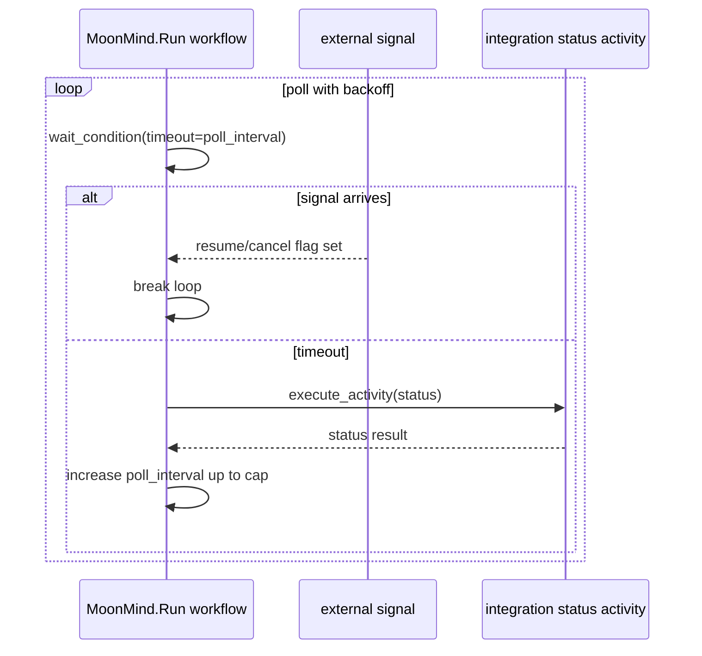

# Temporal-Based Scheduling in MoonMind

## Executive summary

MoonMind (by entity["organization","MoonLadderStudios","open-source org"]) uses entity["company","Temporal","workflow orchestration platform"] primarily as a durable orchestration runtime (workflows + activities), and it implements “time-based scheduling” in two distinct ways:

First, **one-off delayed starts** are supported via Temporal’s **workflow start delay** (“start the workflow now, but don’t dispatch the first workflow task to workers until a delay elapses”). This is wired end-to-end: the API-layer execution service accepts `start_delay`, sets an initial “SCHEDULED” state, and passes `start_delay` into `Client.start_workflow(...)`. citeturn54view0turn30view0turn52view1turn55search1

Second, **recurring scheduling** is *not* implemented in a Temporal-native way today. Instead, the repository contains (a) a cron-expression parsing module and (b) a design document describing a DB-backed “moonmind-scheduler” daemon that computes due times and dispatches queue jobs. That design explicitly resembles a cron/beat-style scheduler; it does not describe Temporal Schedules as the enforcement mechanism. citeturn24view0turn21view3turn46view0turn47view3turn50view0

The key opportunity is to decide a “center of gravity” for recurring schedules:

- If the goal is “start a workflow on a calendar schedule”, **Temporal Schedules** are the idiomatic primitive (server-owned schedules, pause/trigger/backfill semantics), and MoonMind’s current DB-scheduler design likely duplicates Temporal capabilities. citeturn50view0turn55search10turn55search6  
- If the goal is “dashboard-managed schedules as domain objects” (with richer product semantics than Temporal provides), MoonMind can still **use Temporal Schedules as the execution backend**, while keeping a DB model for UI/product needs.

The report below maps where Temporal scheduling/timers exist now, assesses idiomatic fit, and proposes refactors.

## Repository surface area relevant to Temporal scheduling

MoonMind’s Temporal integration is Python-based (Temporal Python SDK dependency is `temporalio ^1.23.0`). citeturn52view1turn55search2

Temporal is self-hosted via Docker Compose, with a Temporal service container pinned by default to `temporalio/auto-setup:1.29.1` and a default namespace of `moonmind`. citeturn58view1turn58view2turn58view0 The Compose stack includes:

- Temporal server: `temporalio/auto-setup:${TEMPORAL_VERSION:-1.29.1}`, backed by Postgres, with dynamic config mounted from `./services/temporal/dynamicconfig`. citeturn58view1turn58view4turn58view6  
- Temporal UI: `temporalio/ui:${TEMPORAL_UI_VERSION:-2.34.0}` (optional profile). citeturn58view3turn58view0  
- Admin tools: `temporalio/admin-tools:${TEMPORAL_ADMINTOOLS_VERSION:-1.29.1-tctl-1.18.4-cli-1.5.0}` and a `temporal-namespace-init` job that uses `TEMPORAL_ADDRESS` + `TEMPORAL_NAMESPACE` and retention-related env vars. citeturn58view0turn58view5  

On the worker side, Compose defines multiple worker services with fleet/task-queue env vars. Examples shown in the Compose file include:

- Workflow worker fleet (`TEMPORAL_WORKER_FLEET=workflow`) on task queue `mm.workflow` with concurrency `8`. citeturn58view2  
- Artifacts activity fleet (`TEMPORAL_WORKER_FLEET=artifacts`) on task queue `mm.activity.artifacts` with concurrency `8`. citeturn58view2  

## Findings: where and how Temporal-based scheduling is implemented

### One-off scheduling via Temporal workflow start delay

The primary *Temporal-native* scheduling mechanism currently implemented is workflow start delay, exposed through the execution service.

In `moonmind/workflows/temporal/service.py`, `create_execution(...)` accepts:

- `start_delay: timedelta | None`
- `scheduled_for: datetime | None`

When `start_delay` is provided, the execution is created immediately, but its initial state is set to `MoonMindWorkflowState.SCHEDULED` and later `start_delay` is passed into the client adapter’s `start_workflow`. citeturn54view0

Annotated excerpt (simplified):

```python
initial_state = MoonMindWorkflowState.SCHEDULED if start_delay is not None else INITIALIZING
...
start_result = await self._client_adapter.start_workflow(..., start_delay=start_delay)
```  
citeturn54view0

In `moonmind/workflows/temporal/client.py`, the adapter builds `start_kwargs` and conditionally sets `start_kwargs["start_delay"] = start_delay`, then calls `client.start_workflow(...)`. citeturn30view0turn30view1

This aligns with Temporal’s underlying API field `workflow_start_delay`, which Temporal documents as “time to wait before dispatching the first workflow task” and also notes important constraints, including **it cannot be used with `cron_schedule`**. citeturn55search1

Implications for MoonMind:

- This is an idiomatic way to schedule **a single delayed start**, particularly for “run at/after time T” semantics. citeturn54view0turn30view0turn55search1  
- It is *not* a full recurring schedule system, and it is not designed for “reschedule after creation” (Temporal community guidance notes there is no API to change an already-set `start_delay`; the suggested approach is instead a timer inside the workflow that can be updated via signal). citeturn55search0turn55search5  

### “Timer-based scheduling” inside workflows (polling, gating, dependency waits)

MoonMind workflows use Temporal timers indirectly via `workflow.wait_condition(...)` with and without timeouts.

In `moonmind/workflows/temporal/workflows/run.py`, the `MoonMind.Run` workflow gates execution on a pause flag:

```python
# Pause until unpaused
await workflow.wait_condition(lambda: not self._paused)
```  
citeturn41view0turn41view3

The same workflow implements periodic polling by using a timeout on `wait_condition` (effectively “sleep up to X seconds unless a signal changes state”), then executing an integration status activity and doubling the interval (backoff) up to a cap. citeturn35view3turn36view4 This is a Temporal-idiomatic pattern for “wait for event or timeout, then do work”, and it avoids non-deterministic wall-clock waits.

In `moonmind/workflows/temporal/manifest_ingest.py`, the manifest ingest orchestration (the larger, DAG-like one) schedules child workflow starts based on dependency satisfaction and a concurrency limit. It repeatedly:

- waits until not paused (`await workflow.wait_condition(lambda: not self._paused)`)
- computes ready nodes
- starts up to `available_slots` concurrent node runners using `asyncio.create_task(...)`  
citeturn44view4

This is “semantic scheduling” (dependency-based), not calendar scheduling, but it is still Temporal-based scheduling in that:
- it uses Temporal’s deterministic workflow execution,  
- it schedules child workflows when conditions become true,  
- it relies on Temporal to persist state and survive restarts. citeturn44view4

### Child workflows and execution fan-out

MoonMind uses child workflows as part of its orchestration model.

In `moonmind/workflows/temporal/workflows/run.py`, plan nodes can dispatch an “agent” path via a child workflow call:

```python
child_result = await workflow.execute_child_workflow("MoonMind.AgentRun", ...)
```  
citeturn39view3

In `moonmind/workflows/temporal/manifest_ingest.py`, each manifest node is executed as a child workflow `MoonMind.Run`, with a deterministic child workflow id derived from parent workflow id/run id/node id and a parent-close policy of `REQUEST_CANCEL`. citeturn44view4

These patterns are relevant to scheduling because the system “schedules work” by spawning children when dependencies are satisfied rather than relying on external planners.

### Cron expression handling exists, but is not wired to Temporal schedules

MoonMind has a `moonmind/workflows/recurring_tasks` module that exports cron parsing and next-occurrence computation utilities. citeturn24view0turn21view3

Separately, there is a design document for a DB-backed recurring schedules system and a `moonmind-scheduler` daemon. The doc includes cron + timezone semantics, misfire/overlap/catchup policy concepts, and “due scan → lock → dispatch” loops. citeturn46view0turn47view3

Critically, the doc does **not** describe using Temporal Cron or Temporal Schedules to enforce the cadence; it describes a scheduler service that computes due times and enqueues work. citeturn47view3turn46view0

This sits in tension with MoonMind’s own Temporal migration architecture doc, which states a target direction that “Temporal Schedules replace cron/beat-style scheduling for Temporal-managed flows.” citeturn50view0

### Task queues, worker fleets, retries, and namespaces

MoonMind uses multiple task queues and primarily routes work by capability/concerns.

A hard-coded list (used for “drain metrics” queries and batch signaling) shows a primary workflow queue plus multiple activity queues:

- `mm.workflow`
- `mm.activity.artifacts`
- `mm.activity.llm`
- `mm.activity.sandbox`
- `mm.activity.integrations`
- `mm.activity.agent_runtime`  
citeturn30view4

These task queue names also appear in Docker Compose worker configuration via env vars. citeturn58view2

Activities are centrally described in `moonmind/workflows/temporal/activity_catalog.py` as “activity definitions” that bundle:
- activity type name (string)
- task queue (from config)
- timeouts
- retry parameters (via a helper `_activity_retries(...)`)
- heartbeat requirements  
citeturn57view5  

Workers are created in `moonmind/workflows/temporal/worker_runtime.py` with:
- `Worker(client, task_queue=topology.task_queues[0], workflows=..., activities=...)`
- A workflow fleet that registers a set of workflow classes including `MoonMindRun`, `MoonMindManifestIngest`, `MoonMindAuthProfileManager`, `MoonMindAgentRun` (names inferred from variables in the worker setup). citeturn57view7

The default namespace is wired through env vars and Compose defaults to `moonmind`, and the deployment includes a namespace init job that uses `TEMPORAL_NAMESPACE`. citeturn58view0turn58view2

## Comparison to Temporal idioms and best practices for scheduling

Temporal supports multiple “scheduling-like” constructs; MoonMind currently uses only a subset:

- **Workflow start delay**: good for one-off “start later”. MoonMind uses this. citeturn54view0turn30view0turn55search1  
- **Timers/condition waits inside workflows**: good for “wait for event or timeout” logic, polling/backoff, gating, and reschedulable waits via signals. MoonMind uses `wait_condition` with timeouts and gating. citeturn36view4turn35view3turn44view4turn55search5  
- **Cron schedule on workflows**: traditional “cron workflows”; however, Temporal’s API notes constraints such as start delay “cannot be used with cron schedule”, and cron semantics have known caveats (UTC basis, skip behavior while running). citeturn55search1turn55search8turn48search0  
- **Temporal Schedules (server-side schedule objects)**: intended to replace “cron/beat” style scheduling for Temporal-managed flows, and the Python SDK has supported schedules since early versions; schedules became GA later (per Temporal’s product changelog). citeturn50view0turn55search10turn55search6  

MoonMind’s *current* recurring scheduling direction (DB-backed scheduler daemon) looks closer to a traditional scheduler design than to Temporal Schedules. citeturn47view3turn50view0 That mismatch is the largest “idiomatic gap” for Temporal-based scheduling.

## Current patterns vs idiomatic alternatives

| Scheduling need | Current MoonMind pattern (evidence) | Idiomatic Temporal alternative | Pros of alternative | Costs / risks |
|---|---|---|---|---|
| One-time “run at time T” | `create_execution(... start_delay=...)` → adapter passes `start_delay` to `client.start_workflow` citeturn54view0turn30view0 | Keep as-is (start delay) **or** schedule via a Temporal Schedule that triggers once | Start delay is simple and uses native dispatch delay citeturn55search1 | Start delay is not adjustable after creation (rescheduling requires different approach) citeturn55search0turn55search5 |
| Reschedulable “run not before T, but user can change T” | Not clearly implemented; start delay exists but there’s no API to adjust after start citeturn30view0turn55search0 | “Updatable timer” pattern: workflow waits on timer; signal updates the target time | Supports changing the time after workflow creation; deterministic wait | Requires workflow design changes + signal handlers and persisted target time |
| Recurring schedule “cron + timezone + policies” | Draft design: DB-backed definitions + scheduler daemon compute due → dispatch queue jobs citeturn46view0turn47view3 | Use Temporal Schedules as the execution backend (create/list/pause schedules; start workflows on cadence) citeturn50view0turn55search10turn55search6 | Server-owned reliability, fewer moving parts, aligns with stated target architecture | Migration effort; decide source-of-truth between DB vs Temporal schedule state |
| Periodic polling/backoff | `workflow.wait_condition(... timeout=...)` loop with exponential backoff citeturn35view3turn36view4 | Keep pattern; optionally tighten via “continue-as-new” for infinite loops depending on history size | Idiomatic “wait or event” logic; clear state machine | Must ensure loop doesn’t grow history unbounded if very long-lived |
| Dependency-based DAG dispatch | Manifest ingest orchestrator schedules child workflows when dependencies satisfied citeturn44view4 | Keep; optionally add stronger child workflow start options (task queue, timeouts, retry) and consider “workflow.continue_as_new” for long DAGs | Already Temporal-idiomatic; durable DAG state | Concurrency and determinism need careful testing |

## Prioritized recommendations for more idiomatic Temporal scheduling

### Adopt Temporal Schedules for recurring work where Temporal is the execution backend

MoonMind’s Temporal migration doc explicitly frames a target where “Temporal Schedules replace cron/beat-style scheduling for Temporal-managed flows.” citeturn50view0 Meanwhile, `TaskRecurringSchedulesSystem.md` proposes a classic scheduler daemon that computes cron due times and enqueues jobs. citeturn47view3turn46view0

If the scheduled action ultimately results in starting Temporal workflows (or producing work that should be Temporal-managed), then using Temporal Schedules is the more idiomatic and often simpler backend. Temporal indicates schedules are a supported and GA feature (per product changelog), and schedule client APIs exist in SDKs. citeturn55search10turn55search6

Estimated effort: **Medium to High** (requires designing an interface between dashboard schedule objects and Temporal schedule objects).  
Risk: **Medium** (migration and operational changes, but yields less bespoke scheduling code).

Concrete refactor direction (conceptual):

- Keep `RecurringTaskDefinition` in DB as the UI/product representation. citeturn47view3  
- On create/update/enable/disable, reconcile a Temporal Schedule “mirroring” that definition (schedule id = definition id).  
- On “run now”, use Temporal Schedule “trigger now” or create a one-off schedule action (depending on chosen API), rather than enqueueing via a custom daemon.

### If “reschedule after creation” matters, prefer timer-in-workflow over start_delay

Start delay is a “dispatch delay” set at workflow start; community guidance indicates there is no API to change this delay once set. citeturn55search0turn55search5 If MoonMind’s scheduled tasks need user edits that shift the planned start time, implement an *updatable timer*:

- Start workflow immediately.
- Workflow maintains `target_run_time` in state.
- Workflow waits until that time (or until signaled that it has changed).

This would also align with MoonMind’s existing signal-based control patterns (batch pause/resume signals exist in the client adapter). citeturn30view4turn36view4

Estimated effort: **Medium** (workflow changes + signal handlers + tests).  
Risk: **Low to Medium** (common pattern; requires determinism discipline).

### Unify and document scheduling semantics across layers

Today, there are at least three “scheduling concepts” in the repo:

- Temporal start delay for delayed starts citeturn54view0turn30view0  
- In-workflow waiting logic for gating/polling citeturn36view4turn35view3turn44view4  
- A DB-backed recurring scheduling design that is separate from Temporal citeturn47view3turn46view0  

A refactor plan should pick a small set of canonical semantics and document them in one place, ideally as part of the established Temporal design docs set. citeturn50view0

Estimated effort: **Low** (documentation + contracts) / **Medium** (if refactoring).  
Risk: **Low**.

### Treat “cron/timezone correctness” as an execution-backend concern, not just a UI concern

The recurring schedule doc calls out DST-aware timezone cron semantics. citeturn47view1turn47view3 Temporal cron workflows historically have UTC-based scheduling constraints and timezone complexity (community discussions exist around cron timezone support). citeturn48search0turn55search8

If MoonMind stays with DB-scheduler logic, ensure correctness is tested at DST boundaries (the design doc already proposes such tests). citeturn47view1 If MoonMind moves to Temporal Schedules, incorporate timezone support at that layer and defend it with integration tests in the target Temporal version.

Estimated effort: **Medium** (tests + validation in staging).  
Risk: **Medium** (timezone bugs are high-impact).

### Make “scheduled_for” a first-class observable field in Temporal visibility and MoonMind search attributes

`create_execution(...)` accepts `scheduled_for`, and the execution record can be updated with it after start failures. citeturn54view0 To make scheduling more operationally visible:

- Add a dedicated search attribute for nominal scheduled time (e.g., `mm_scheduled_for`) and set it when `start_delay` is provided.
- Ensure state transitions from “SCHEDULED” to “INITIALIZING/EXECUTING” update `mm_state` and `mm_updated_at` consistently (MoonMind already updates `mm_state` and `mm_updated_at` search attributes). citeturn54view0

Estimated effort: **Low to Medium** (schema + wiring).  
Risk: **Low**.

## Mermaid diagrams

### Scheduling pathways overview

```mermaid
flowchart TD
  A[API / Execution Service] -->|create_execution(start_delay?)| B[TemporalExecutionService]
  B -->|start_delay passed| C[TemporalClientAdapter.start_workflow]
  C -->|Client.start_workflow(start_delay)| D[Temporal Server]

  B -->|no start_delay| E[Immediate workflow task dispatch]
  B -->|start_delay set| F[Workflow task dispatched after delay]

  subgraph Workflows
    W1[MoonMind.Run] -->|execute_child_workflow| W2[MoonMind.AgentRun]
    W3[Manifest ingest orchestrator] -->|execute_child_workflow per node| W1
  end
```

Evidence for the “start_delay” pathway: citeturn54view0turn30view0turn55search1  
Evidence for child workflow relationships: citeturn39view3turn44view4  

### Timer-based polling loop inside MoonMind.Run



Evidence: polling implemented via `wait_condition(... timeout=...)` and exponential backoff. citeturn35view3turn36view4  

## A small chart from inferred “task distribution” data

Even without schedule frequency data, the repository exposes a clear multi-queue, multi-fleet routing model. The following summarizes the **number of distinct task queues** MoonMind scopes as “its” queues for operational controls (drain metrics + batch pause/resume):

- Workflow queue: 1 (`mm.workflow`)
- Activity queues: 5 (`mm.activity.*`)  
citeturn30view4turn58view2

A simple distribution:

- Workflows: █ (1)
- Activities: █████ (5)

This is not a throughput chart; it is an architectural “distribution surface” that matters for scheduling because any schedule backend you adopt (DB scheduler, Temporal Schedules, cron workflows) must decide **which task queue(s)** scheduled workflow starts should target. citeturn30view4turn58view2

## Assumptions, gaps, and unspecified details

The analysis above is grounded in the specific repository files and docs cited. Some requested items could not be fully confirmed from the examined sources and should be treated as **unspecified** unless validated by additional repo-wide scanning:

- Temporal **Schedules API usage**: no direct evidence was found in the inspected code paths that MoonMind currently creates/manages Temporal Schedule objects; instead, the repo contains a *plan* for a DB-backed scheduler and a migration doc stating schedules as a target direction. citeturn47view3turn50view0turn55search10  
- Temporal **cron workflows** (`cron_schedule` parameter): no direct evidence in the inspected code showed use of `cron_schedule`. The Temporal API constraints around `workflow_start_delay` and `cron_schedule` remain relevant if cron is added later. citeturn55search1turn54view0  
- **Signals/queries/updates**: the client adapter can send signals and execute updates by name, and it implements batch pause/resume signaling via Visibility queries. citeturn30view1turn30view4 However, specific workflow-side signal/update handler definitions for all workflows were not exhaustively enumerated from the captured excerpts.  
- **CI/CD and test coverage**: the dependency list shows pytest tooling is present. citeturn52view1 Yet CI pipelines and Temporal-specific tests were not identified from the inspected sources.  
- **Kubernetes/Helm deployment**: the inspected deployment material is Docker Compose–based, and the Temporal migration doc states Docker Compose as a “locked platform decision.” citeturn58view1turn50view0 No Helm/k8s artifacts were cited here.

The most actionable refactor decision remains: align the recurring scheduling system with Temporal’s scheduling primitives (Temporal Schedules or workflow timer patterns) rather than maintaining a parallel scheduler daemon, unless MoonMind’s product needs truly exceed Temporal’s schedule model. citeturn50view0turn47view3turn55search10