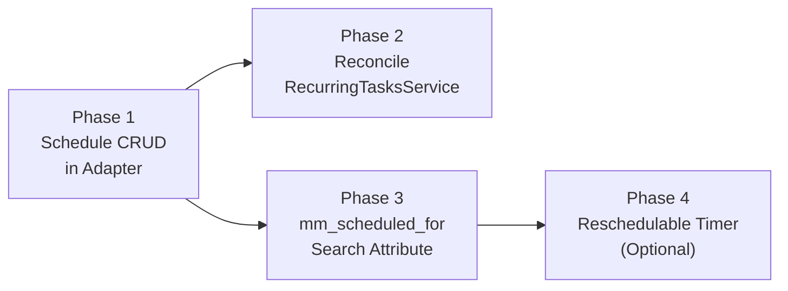

# Temporal Scheduling — Implementation Plan

**Reference:** [TemporalScheduling.md](../Temporal/TemporalScheduling.md) (desired state)
**Created:** 2026-03-23
**Status:** Draft

---

## Overview

This plan implements the Temporal-native scheduling system described in [TemporalScheduling.md](../Temporal/TemporalScheduling.md). It replaces MoonMind's DB-backed scheduler with Temporal Schedules for recurring work, adds the `mm_scheduled_for` search attribute, and introduces a reschedulable timer pattern for deferred executions.

Work is organized into four phases with increasing scope. Each phase is independently shippable.

---

## Phase 1: Wire Temporal Schedule CRUD into TemporalClientAdapter

**Goal:** Give MoonMind's backend the ability to create, read, update, and delete Temporal Schedules.

### Scope

Add schedule lifecycle methods to `TemporalClientAdapter` (`moonmind/workflows/temporal/client.py`):

| Method | Temporal SDK Call | Purpose |
|---|---|---|
| `create_schedule()` | `client.create_schedule()` | Create a new server-owned schedule |
| `describe_schedule()` | `handle.describe()` | Fetch schedule state, recent actions, next runs |
| `update_schedule()` | `handle.update()` | Change spec, policy, or action |
| `pause_schedule()` | `handle.pause()` | Pause a schedule |
| `unpause_schedule()` | `handle.unpause()` | Resume a paused schedule |
| `trigger_schedule()` | `handle.trigger()` | Fire a schedule immediately (manual run) |
| `delete_schedule()` | `handle.delete()` | Remove a schedule |

### Key Details

- Methods accept MoonMind-level inputs (cron string, timezone, overlap mode, definition ID) and map them to Temporal SDK types (`ScheduleSpec`, `SchedulePolicy`, `ScheduleOverlapPolicy`, etc.)
- Schedule IDs follow the convention: `mm-schedule:{definition_uuid}`
- Workflow IDs for schedule-spawned workflows: `mm:{definition_uuid}:{schedule_time_epoch}`
- All methods are async and raise adapter-level exceptions (not raw Temporal SDK errors)

### Overlap Policy Mapping

| MoonMind `overlap.mode` | `ScheduleOverlapPolicy` |
|---|---|
| `skip` | `SKIP` |
| `allow` | `ALLOW_ALL` |
| `buffer_one` | `BUFFER_ONE` |
| `cancel_previous` | `CANCEL_OTHER` |

### Catchup Policy Mapping

| MoonMind `catchup.mode` | `catchup_window` |
|---|---|
| `none` | `timedelta(0)` |
| `last` | `timedelta(minutes=15)` |
| `all` | `timedelta(days=365)` |

### Verification

- Unit tests for each method with mocked Temporal client
- Unit tests for policy mapping (overlap, catchup, jitter)
- Unit tests for schedule/workflow ID generation

### Files

| Action | File |
|---|---|
| MODIFY | `moonmind/workflows/temporal/client.py` |
| NEW | `tests/unit/workflows/temporal/test_client_schedules.py` |

---

## Phase 2: Reconcile RecurringTasksService with Temporal Schedules

**Goal:** Replace the DB-backed scheduling/dispatch loop with Temporal Schedule reconciliation while preserving the API surface.

### Scope

Refactor `RecurringTasksService` (`api_service/services/recurring_tasks_service.py`) to delegate scheduling to Temporal:

| Operation | Before (DB scheduler) | After (Temporal Schedule) |
|---|---|---|
| Create definition | Insert DB row + compute `next_run_at` | Insert DB row + `adapter.create_schedule()` |
| Update definition | Update DB row + recompute `next_run_at` | Update DB row + `adapter.update_schedule()` |
| Enable/disable | Set `enabled` flag | Set `enabled` flag + `adapter.unpause/pause_schedule()` |
| Manual run | Insert `RecurringTaskRun` row | `adapter.trigger_schedule()` |
| Due-scan + dispatch | `schedule_due_definitions()` + `dispatch_pending_runs()` | **Removed** — Temporal handles this |
| Run history | Query `RecurringTaskRun` table | `adapter.describe_schedule()` + Temporal Visibility query |

### Removals

The following methods and their supporting code are removed:

- `schedule_due_definitions()`
- `_compute_due_occurrences()`
- `_insert_run_if_missing()`
- `dispatch_pending_runs()`
- `_dispatch_run()`
- `_dispatch_temporal_task()`
- `_dispatch_temporal_task_template()`
- `_dispatch_manifest_run()`
- `_count_active_runs()`
- `_bulk_fetch_active_counts()`
- `_bulk_fetch_existing_executions()`
- `_find_existing_temporal_execution_for_run()`
- `run_scheduler_tick()`

### What Stays

- `RecurringTaskDefinition` model and DB table — product metadata, authorization, target spec
- `create_definition()` / `update_definition()` — CRUD, augmented with Temporal Schedule calls
- `list_definitions()` / `get_definition()` — read operations
- `require_authorized_definition()` — authorization
- Cron/timezone validation helpers (`moonmind/workflows/recurring_tasks/cron.py`)
- `/api/recurring-tasks` routes — API contract unchanged

### Target Resolution Change

Target resolution (template expansion, manifest lookup) moves from the scheduler service into the workflow:

1. Schedule payload includes raw target specification
2. `MoonMind.Run` or `MoonMind.ManifestIngest` workflow resolves the target in its initialization phase via Activities
3. This removes the scheduler's dependency on `ManifestsService` and `TaskTemplateCatalogService`

### Reconciliation Error Handling

If a Temporal Schedule operation fails (e.g., Temporal is temporarily unavailable):
- The MoonMind DB update succeeds but the Temporal Schedule is stale
- A reconciliation sweep (invoked periodically or on next access) re-applies the DB state to Temporal
- Logs and metrics track reconciliation mismatches

### Verification

- Unit tests for reconciled `create_definition()` / `update_definition()`
- Unit tests confirming removed methods no longer exist
- Existing `test_recurring_tasks_service.py` tests updated for the new flow
- Existing `test_recurring_tasks.py` router tests remain valid (API surface unchanged)
- Integration test: create → schedule fires → workflow starts

### Files

| Action | File |
|---|---|
| MODIFY | `api_service/services/recurring_tasks_service.py` |
| MODIFY | `tests/unit/services/test_recurring_tasks_service.py` |
| MODIFY | `api_service/api/routers/recurring_tasks.py` (minor — inject adapter) |
| MODIFY | `tests/unit/api/routers/test_recurring_tasks.py` (minor) |

---

## Phase 3: Add `mm_scheduled_for` Search Attribute

**Goal:** Make scheduled execution times queryable via Temporal Visibility.

### Scope

1. **Register the attribute** in `services/temporal/bootstrap-namespace.sh`:
   ```bash
   temporal operator search-attribute create \
     --namespace "$TEMPORAL_NAMESPACE" \
     --name mm_scheduled_for \
     --type Datetime
   ```

2. **Set on deferred one-time execution** in `TemporalClientAdapter.start_workflow()`:
   - When `start_delay` is provided, add `mm_scheduled_for = now + start_delay` to search attributes

3. **Set on schedule-spawned workflows** in the `ScheduleActionStartWorkflow` config:
   - Use the schedule time as `mm_scheduled_for`

4. **Document** in [VisibilityAndUiQueryModel.md](../Temporal/VisibilityAndUiQueryModel.md)

### Verification

- Unit test: `start_workflow()` with `start_delay` sets `mm_scheduled_for`
- Integration test: query workflows by `mm_scheduled_for` range
- Manual: verify attribute appears in Temporal UI filters

### Files

| Action | File |
|---|---|
| MODIFY | `services/temporal/bootstrap-namespace.sh` |
| MODIFY | `moonmind/workflows/temporal/client.py` |
| MODIFY | `docs/Temporal/VisibilityAndUiQueryModel.md` |

---

## Phase 4: Implement Reschedulable Timer (Optional)

**Goal:** Allow users to change the scheduled start time of a deferred execution after creation.

### Scope

1. **Add `reschedule` signal handler** to `MoonMind.Run` workflow (`moonmind/workflows/temporal/workflows/run.py`):
   - Workflow waits with an updatable timer when `input.scheduled_for` is set
   - `reschedule` signal updates the target time; timer re-evaluates
   - See [TemporalScheduling.md §6.2](../Temporal/TemporalScheduling.md#62-mechanism-updatable-timer-pattern) for the reference implementation

2. **Add reschedule API endpoint**:
   ```
   POST /api/executions/{workflowId}/reschedule
   { "scheduledFor": "2026-03-24T12:00:00Z" }
   ```
   Backend sends a `reschedule` signal via `TemporalClientAdapter`

3. **Add `send_reschedule_signal()` to `TemporalClientAdapter`**

4. **Mission Control UI**: Add "Change scheduled time" action on the task detail page for workflows with `mm_state=scheduled`

### Verification

- Unit test: workflow waits then proceeds after timer expires
- Unit test: workflow re-evaluates wait after `reschedule` signal
- Unit test: reschedule to the past triggers immediate execution
- Integration test: create deferred → reschedule → verify new execution time
- Manual: reschedule via Mission Control UI

### Files

| Action | File |
|---|---|
| MODIFY | `moonmind/workflows/temporal/workflows/run.py` |
| MODIFY | `moonmind/workflows/temporal/client.py` |
| MODIFY | `api_service/api/routers/executions.py` |
| NEW | `tests/unit/workflows/temporal/test_reschedule.py` |

---

## Dependency Order



Phase 1 is prerequisite to Phase 2. Phase 3 can proceed in parallel with Phase 2. Phase 4 depends on Phase 3 (needs `mm_scheduled_for`) and is optional.
