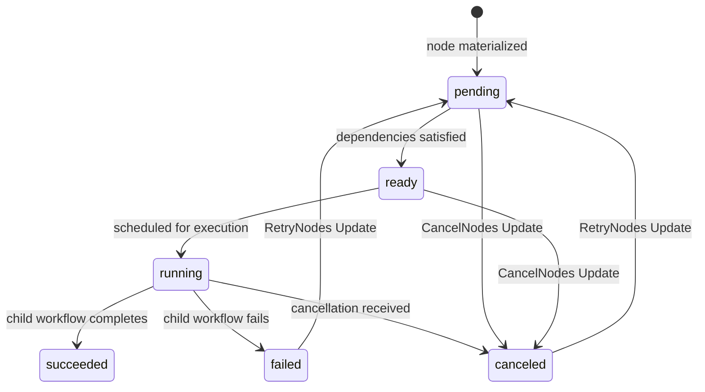

# Data Model: Manifest Phase 0 Temporal Alignment

**Feature**: 083-manifest-phase0
**Date**: 2026-03-17

## Entities

### CompiledManifestPlanModel

**Source**: `moonmind/schemas/manifest_ingest_models.py`

| Field | Type | Description |
|-------|------|-------------|
| `plan_ref` | `str` | Artifact reference for the compiled plan |
| `manifest_hash` | `str` | SHA-256 content hash of the manifest YAML |
| `manifest_version` | `str` | Manifest schema version (e.g., `v0`) |
| `nodes` | `list[ManifestPlanNodeModel]` | Compiled plan nodes with dependencies |
| `required_capabilities` | `list[str]` | Server-derived capabilities for worker routing |
| `manifest_secret_refs` | `dict[str, str]` | Safe secret reference metadata (`profile://`, `vault://`) |

### ManifestPlanNodeModel

| Field | Type | Description |
|-------|------|-------------|
| `node_id` | `str` | Deterministic ID: `node-{sha256(content)[:12]}` |
| `title` | `str` | Human-readable node title |
| `data_source` | `dict` | Source configuration (type, params) |
| `dependencies` | `list[str]` | Node IDs this node depends on |

### ManifestNodeModel

**Source**: `moonmind/schemas/manifest_ingest_models.py`

| Field | Type | Description |
|-------|------|-------------|
| `node_id` | `str` | Stable deterministic ID |
| `state` | `str` | Lifecycle state: `pending`/`ready`/`running`/`succeeded`/`failed`/`canceled` |
| `title` | `str` | Human-readable node title |
| `dependencies` | `list[str]` | Dependency node IDs |
| `child_workflow_id` | `str?` | Temporal child workflow ID (when running or completed) |
| `result_artifact_ref` | `str?` | Result artifact reference (when succeeded) |
| `error` | `str?` | Error message (when failed) |

### ManifestExecutionPolicyModel

| Field | Type | Description |
|-------|------|-------------|
| `failure_policy` | `str` | `fail_fast` (default) or `continue` |
| `max_concurrency` | `int` | Max parallel child workflows (1–500, default 50) |

### ManifestIngestSummaryModel

| Field | Type | Description |
|-------|------|-------------|
| `state` | `str` | `succeeded` or `failed` |
| `phase` | `str` | Pipeline phase (e.g., `completed`) |
| `total_nodes` | `int` | Total node count |
| `succeeded_count` | `int` | Nodes that succeeded |
| `failed_count` | `int` | Nodes that failed |
| `failed_node_ids` | `list[str]` | IDs of failed nodes |
| `manifest_ref` | `str` | Source manifest artifact ref |
| `plan_ref` | `str` | Compiled plan artifact ref |

### ManifestRunIndexModel

| Field | Type | Description |
|-------|------|-------------|
| `nodes` | `list[ManifestRunIndexNodeEntry]` | Per-node state with child workflow refs |

### RequestedByModel

| Field | Type | Description |
|-------|------|-------------|
| `type` | `str` | `user` or `system` |
| `id` | `str?` | User ID (for user-requested runs) |

## State Transitions

