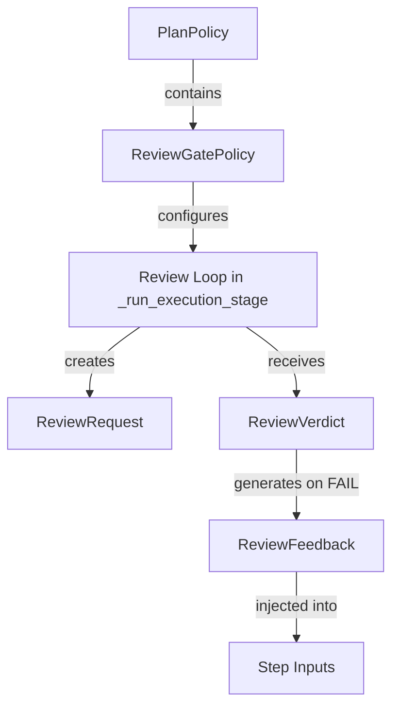

# Data Model: Step Review Gate

## ReviewGatePolicy

Configuration object embedded in `PlanPolicy`.

| Field | Type | Default | Description |
|---|---|---|---|
| `enabled` | `bool` | `False` | Whether the review gate is active |
| `max_review_attempts` | `int` | `2` | Max retries per step on review failure (excludes initial) |
| `reviewer_model` | `str` | `"default"` | LLM model for review |
| `review_timeout_seconds` | `int` | `120` | Timeout per review activity |
| `skip_tool_types` | `tuple[str, ...]` | `()` | Tool types exempt from review |

**Validation**: `max_review_attempts >= 0`, `review_timeout_seconds > 0`.

## ReviewRequest

Input to the `step.review` Activity.

| Field | Type | Description |
|---|---|---|
| `node_id` | `str` | Plan node identifier |
| `step_index` | `int` | 1-based step position |
| `total_steps` | `int` | Total steps in plan |
| `review_attempt` | `int` | Current review attempt (1-based) |
| `tool_name` | `str` | Tool/skill name |
| `tool_version` | `str` | Tool/skill version |
| `tool_type` | `str` | `"skill"` or `"agent_runtime"` |
| `inputs` | `dict` | Original step inputs |
| `execution_result` | `dict` | ToolResult payload |
| `workflow_context` | `dict` | `{workflow_id, run_id, plan_title}` |
| `previous_feedback` | `str | None` | Feedback from prior review attempt |

## ReviewVerdict

Output from the `step.review` Activity.

| Field | Type | Description |
|---|---|---|
| `verdict` | `str` | `"PASS"`, `"FAIL"`, or `"INCONCLUSIVE"` |
| `confidence` | `float` | 0.0–1.0 confidence score |
| `feedback` | `str | None` | Explanation if `FAIL` |
| `issues` | `list[dict]` | `[{severity, description, evidence}]` |

## ReviewFeedback

Injected into step inputs on retry.

| Field | Type | Description |
|---|---|---|
| `attempt` | `int` | Which attempt produced this feedback |
| `feedback` | `str` | Reviewer's feedback text |
| `issues` | `list[dict]` | Structured issues list |

## Entity Relationships

