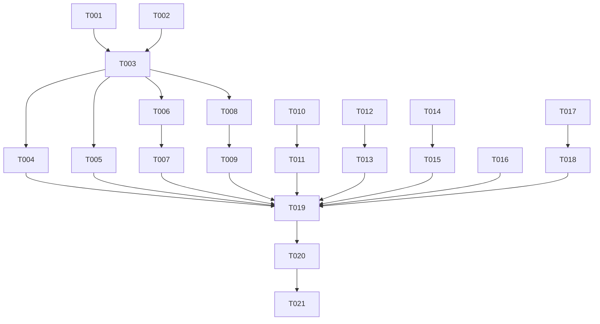

# Tasks: Queue Substrate Removal (Phase 1)

**Feature**: `095-queue-substrate-removal`
**Branch**: `095-queue-substrate-removal`
**Plan**: [plan.md](plan.md)
**Spec**: [spec.md](spec.md)

## Phase 1: Setup

- [ ] T001 Read and verify current routing logic in `moonmind/workflows/tasks/routing.py`
- [ ] T002 Read and verify current queue create_job delegation in `api_service/api/routers/agent_queue.py`

## Phase 2: Foundational — Harden Temporal Routing

- [ ] T003 [DOC-REQ-007] Remove queue fallback from `get_routing_target_for_task()` in `moonmind/workflows/tasks/routing.py` — always return `"temporal"`, raise `ValueError` when `submit_enabled=False`
- [ ] T004 [DOC-REQ-007] Add unit test verifying `get_routing_target_for_task()` always returns `"temporal"` for manifests, runs, and default cases in `tests/unit/workflows/tasks/test_routing.py`
- [ ] T005 [DOC-REQ-007] Add unit test verifying `get_routing_target_for_task()` raises `ValueError` when `submit_enabled=False` in `tests/unit/workflows/tasks/test_routing.py`

## Phase 3: User Story 1 (P1) — Task Submission via Temporal

**Goal**: Verify 100% of task submissions route through Temporal with all form fields preserved.
**Independent Test**: Submit a task and confirm it creates a Temporal workflow execution.

- [ ] T006 [US1] [DOC-REQ-003] [P] Audit `_create_execution_from_task_request` in `api_service/api/routers/executions.py` and verify all submit form fields (runtime, model, effort, repository, publishMode) are preserved in execution payloads
- [ ] T007 [US1] [DOC-REQ-003] Add unit test in `tests/unit/api/routers/test_executions.py` verifying all submit fields round-trip into Temporal execution request
- [ ] T008 [US1] [DOC-REQ-004] [P] Audit `_create_execution_from_manifest_request` in `api_service/api/routers/executions.py` and verify manifest type routes to `MoonMind.ManifestIngest` workflow
- [ ] T009 [US1] [DOC-REQ-004] Add unit test verifying manifest-type job creation produces `MoonMind.ManifestIngest` workflow in `tests/unit/api/routers/test_executions.py`

## Phase 4: User Story 2 (P1) — Task Monitoring and Actions

**Goal**: Verify task monitoring and control actions work end-to-end through Temporal APIs.
**Independent Test**: Start a task, verify status, cancel it.

- [ ] T010 [US2] [DOC-REQ-001] [P] Audit cancel/edit/rerun paths in `api_service/api/routers/executions.py` — verify they use Temporal cancel/update/signal, not queue mutations
- [ ] T011 [US2] [DOC-REQ-007] Verify status normalization in `api_service/api/routers/task_dashboard_view_model.py` correctly maps all `mm_state` values for Temporal source

## Phase 5: User Story 3 (P1) — Recurring Tasks via Temporal

**Goal**: Verify recurring tasks create Temporal Schedules.
**Independent Test**: Create a recurring task and confirm Temporal Schedule is created.

- [ ] T012 [US3] [DOC-REQ-005] [P] Audit `api_service/api/routers/recurring_tasks.py` and verify it creates Temporal Schedules, not queue jobs
- [ ] T013 [US3] [DOC-REQ-005] Add verification test or code audit note confirming recurring tasks produce Temporal workflow executions in `tests/unit/api/routers/test_recurring_tasks.py`

## Phase 6: User Story 4 (P2) — Attachment Uploads

**Goal**: Verify attachments work through the Temporal artifact system.
**Independent Test**: Submit a task with attachment and verify artifact is created.

- [ ] T014 [US4] [DOC-REQ-003] [P] Audit attachment handling in the Temporal submit path — verify `with-attachments` endpoint delegates to artifact system
- [ ] T015 [US4] [DOC-REQ-003] Add verification test for attachment round-trip through Temporal artifact APIs in `tests/unit/api/routers/test_executions.py`

## Phase 7: User Story 5 (P2) — Step Templates

**Goal**: Verify step templates work with Temporal execution path.
**Independent Test**: Apply a template and verify parameters expand correctly.

- [ ] T016 [US5] [DOC-REQ-006] [P] Audit `api_service/api/routers/task_step_templates.py` and verify expansion output is source-agnostic (no queue-specific fields)

## Phase 8: Cross-Cutting — Feature Audit Report

**Goal**: Produce comprehensive audit documenting every queue endpoint's Temporal equivalent.

- [ ] T017 [DOC-REQ-001] [DOC-REQ-002] Create `specs/095-queue-substrate-removal/contracts/queue-feature-audit.md` with status for every `/api/queue/*` endpoint: Temporal equivalent, Deprecated (worker internal), or Deferred
- [ ] T018 [DOC-REQ-002] Add deprecation warnings (`logger.warning`) to worker-facing queue endpoints (claim, heartbeat, complete, fail, recover) in `api_service/api/routers/agent_queue.py`

## Phase 9: Polish & Validation

- [ ] T019 Run `./tools/test_unit.sh` and verify all tests pass
- [ ] T020 Update `docs/MoonMindRoadmap.md` Phase 1 items as completed
- [ ] T021 Commit all changes on branch `095-queue-substrate-removal`

---

## Dependencies

## Parallel Execution Opportunities

- **T006 || T008 || T010 || T012 || T014 || T016**: All audit tasks can run in parallel
- **T004 || T005**: Both routing tests can be written in parallel
- **T007 || T009 || T015**: Test tasks for different stories can run in parallel

## Implementation Strategy

**MVP (User Story 1 only)**: T001–T005 (routing hardening) + T006–T009 (submit verification) delivers the core guarantee that all submissions route to Temporal.

**Full delivery**: All 21 tasks, completing the Phase 1 gate from `SingleSubstrateMigration.md`.
