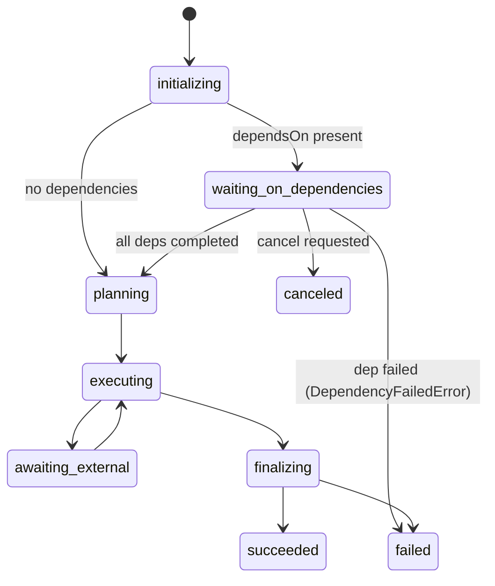

# Data Model: Task Dependencies Phase 1

**Branch**: `101-task-dependencies-phase1`
**Date**: 2026-03-22

## Modified Entity: MoonMindWorkflowState

**Type**: PostgreSQL native enum / Python `str, Enum`
**Location**: `api_service/db/models.py`

### Current Values

| Value | Lifecycle Position |
|-------|--------------------|
| `scheduled` | Pre-execution |
| `initializing` | 1 |
| `planning` | 2 |
| `executing` | 3 |
| `awaiting_external` | 3.5 (integration wait) |
| `finalizing` | 4 |
| `succeeded` | Terminal |
| `failed` | Terminal |
| `canceled` | Terminal |

### New Value

| Value | Lifecycle Position |
|-------|--------------------|
| `waiting_on_dependencies` | 1.5 (between initializing and planning) |

### State Transitions

> Note: Transition logic is implemented in Phase 2. Phase 1 only adds the value.

## Affected Database Tables

- `temporal_execution_sources` (`state` column, type `moonmindworkflowstate`)
- `temporal_executions` (`state` column, type `moonmindworkflowstate`)

## Validation Rules

- The new value uses lowercase naming matching existing convention.
- The new value is a valid member of the PostgreSQL enum type after migration.
